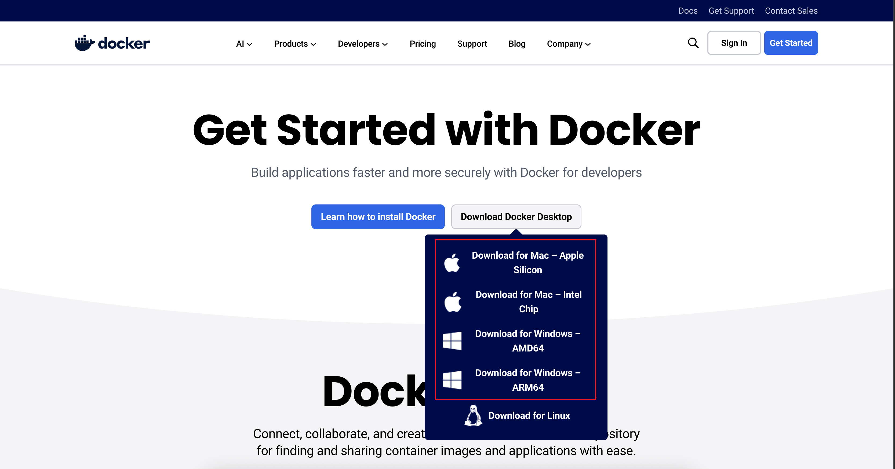
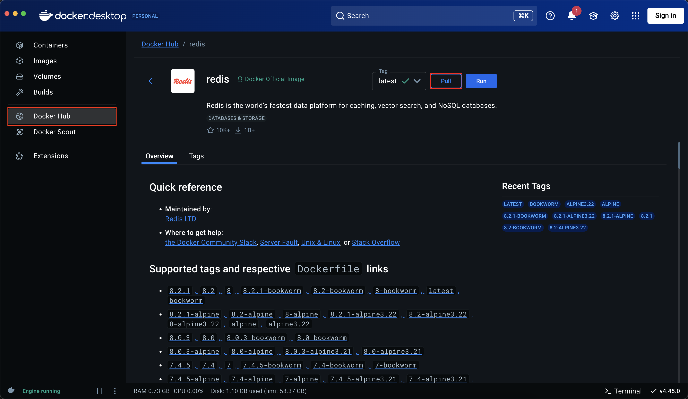
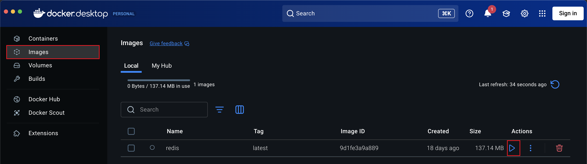
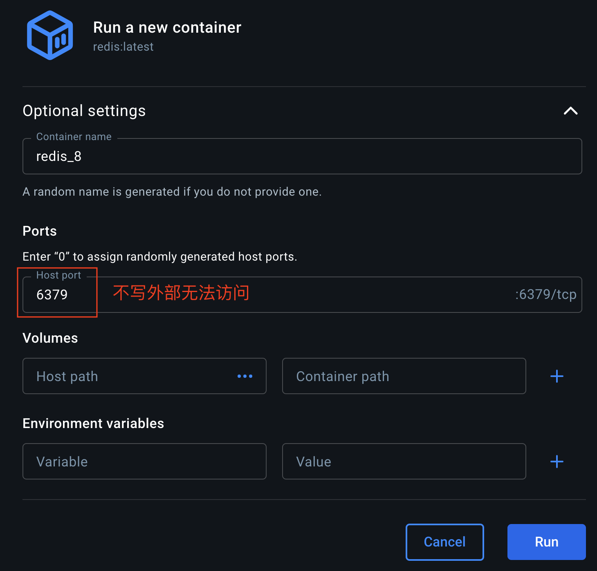
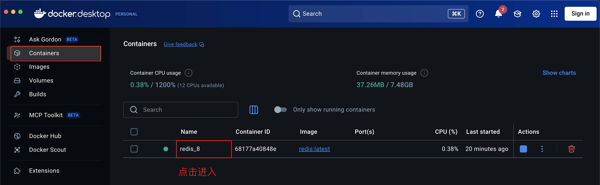
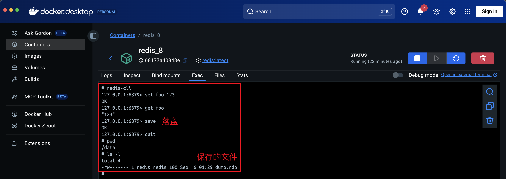

:source-highlighter: pygments
:icons: font
:scripts: cjk
:stem: latexmath
:toc:
:toc: right
:toc-title: Table of Contents
:toclevels: 3

= Learning Docker

++++
<button id="toggleButton">Table of Contents</button>

++++

== Introduction Docker
Docker 是一个“**一次打包、随处运行**”的轻量级容器引擎，它把应用和依赖打成一个镜像，秒级启动、隔离运行，解决“我机器上能跑，别人机器上不能跑”的环境不一致问题。

== Install Docker
* Linux Install docker
+
https://docs.docker.com/engine/install/

* Windows & Macos Install docker
+
https://www.docker.com/get-started/
+

== Pull & Run Redis
.docker_pull_redis

.docker_run_redis

.docker_run_port

.docker_container_redis

.docker_container_redis_exec

NOTE: save 落盘只是为了给学生发送已经有数据的容器打包。

在宿主机测试连接到 redis 服务器::
redis-cli

== Commit & Save & Load & Run 把 redis 容器做成离线镜像包发给学生
1. 把正在跑的容器打成镜像

    docker commit redis_8 redis_8-with-data:2025

2. 导出为单个 tar 文件（几百 MB 到几 GB 不等）

    docker save -o redis_8-with-data.tar redis_8-with-data:2025

3. 学生导入镜像

    docker load -i redis_8-with-data.tar

4. 直接运行（端口、卷都不用再配）

    docker run -d --name my-redis -p 6379:6379 redis_8-with-data:2025

[NOTE]
====
1. 镜像文件较大，可先用 gzip redis-with-data.tar 压缩再传。压缩后的文件大小，要看镜像内容的实际情况。
2. 如果数据还在内存、没触发过 SAVE/BGSAVE，先手动执行一次 SAVE，再 commit，否则镜像里可能没数据。
====

