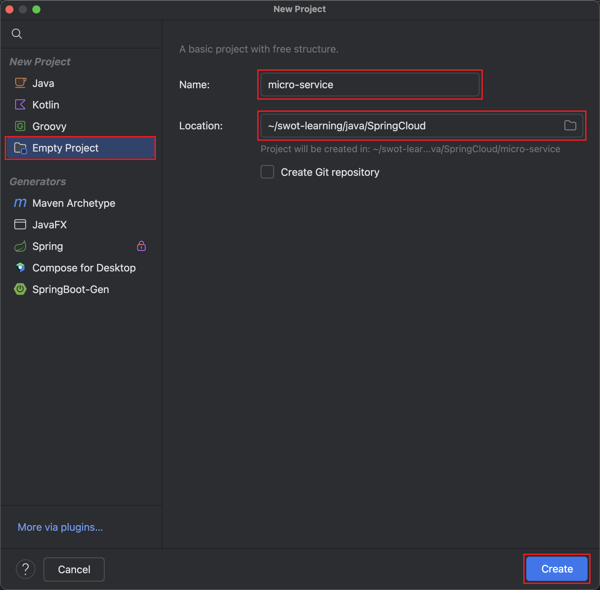

:source-highlighter: pygments
:icons: font
:scripts: cjk
:stem: latexmath
:toc:
:toc: right
:toc-title: Table of Contents
:toclevels: 3

= Spring Cloud 微服务

++++
<button id="toggleButton">Table of Contents</button>

++++

== Spring Cloud 微服务介绍

=== 一、 什么是微服务？
1. 单体架构的困境
+
在传统单体架构（Monolithic Architecture）中，所有功能模块（如用户管理、订单管理、支付管理等）都被打包在一个大的应用程序中，并部署在一个应用服务器上。

* *优点*：开发、测试、部署简单。
* *缺点*：
  ** 复杂性高：代码庞大，耦合度高，维护困难。
  ** 技术栈僵化：难以引入新的技术或框架。
  ** 扩展性差：无法针对特定模块进行扩展，必须扩展整个应用。
  ** 部署不灵活：一个小修改就需要重新部署整个应用，风险高。
  ** 可靠性低：一个微小的问题可能导致整个应用崩溃。

2. 微服务架构的解决方案
+
微服务架构（Microservices Architecture）是一种将单个应用程序拆分为 #一组小而自治的服务# 的架构风格。

* *核心思想*：*拆分* 与 *解耦*。
* *每个服务*：
  ** 围绕 *业务能力* 构建。
  ** 拥有独立的 *数据库* 和 *数据模型*。
  ** 可以独立 *开发*、*部署*、*扩展* 和 *重启*。
  ** 通过轻量级的通信机制（如 HTTP/REST、gRPC）进行协作。

+
比喻：

* *单体应用* 像一个 *大商场* ：所有部门（服装、餐饮、超市）在一个大楼里，共享水电消防。一损俱损。
* *微服务* 像一个 *商业街* ：每个店铺（服务）独立经营，有自己的特色和库存，通过公共街道（网络）连接。一店装修，不影响其他店。

=== 二、 微服务带来的新挑战
拆分成多个服务后，也引入了新的复杂性：

. 服务发现：服务实例动态变化，消费者如何找到提供者？
. 配置管理：如何统一管理所有服务的配置，并实现动态更新？
. 负载均衡：如何将请求合理地分发到多个服务实例上？
. 容错与熔断：如何防止一个服务故障导致整个系统雪崩？
. API网关：如何为外部客户端提供一个统一的入口，并处理跨切面问题（认证、限流、路由）？
. 分布式事务：如何保证跨多个服务的数据一致性？
. 监控与链路追踪：如何跟踪一个请求穿越多个服务的全过程，以便排查问题？

=== 三、 什么是 Spring Cloud？
1. 定义
+
Spring Cloud 是一套基于 Spring Boot的 #微服务生态工具集#。它提供了一系列 #标准化的工具和组件#，用于快速解决微服务架构中的常见问题（如上述挑战），让我们能更专注于业务逻辑的开发。
+
*简单来说*：Spring Boot 让开发单个微服务变得简单，而 Spring Cloud 让 #管理和协调# 这些微服务变得简单。

2. 核心定位
+
Spring Cloud 通过封装 *Netflix*、*Alibaba* 等公司成熟的微服务解决方案，提供了 *开箱即用* 的分布式系统开发体验。

=== 四、 Spring Cloud 的核心组件/子项目
Spring Cloud是一个“全家桶”，包含众多组件，以下是其中最核心的几个：

[cols="1,3,2", options="header"]
|===
| 组件名称
| 功能
| 比喻

| *Eureka / Nacos*
| *服务发现与注册*：服务提供者启动后向注册中心注册自己的地址，消费者从注册中心拉取服务列表。
| *电话簿*：服务在这里注册和查找彼此的地址。

| *Ribbon / LoadBalancer*
| *客户端负载均衡*：从服务列表中选择一个实例，将请求分发过去。
| *导游*：在多个相同的服务实例中，选择一个带你去。

| *Feign / OpenFeign*
| *声明式HTTP客户端*：基于接口和注解的方式调用远程服务，像调用本地方法一样简单。
| *翻译官*：帮你自动完成HTTP请求的组装和发送。

| *Hystrix / Sentinel*
| *熔断器*：当服务调用失败率达到阈值时，快速失败（熔断），防止雪崩效应，并提供服务降级。
| *保险丝*：电流过大（故障太多）自动熔断，保护整个电路（系统）。

| *Zuul / Gateway*
| *API网关*：所有外部请求的统一入口，负责路由、过滤、认证、限流、监控等。
| *前台/门卫*：所有访客必须经过这里，由它决定谁可以进、去哪里。

| *Config / Nacos*
| *分布式配置中心*：集中管理所有环境的配置文件，支持动态刷新。
| *公告板*：所有服务从这里获取最新配置，无需重启即可生效。

| *Sleuth / Zipkin*
| *分布式链路追踪*：跟踪一个请求从开始到结束的完整路径，用于性能分析和故障排查。
| *快递追踪*：可以查看你的包裹（请求）经过了哪些中转站（服务）。
|===

=== 五、 Spring Cloud 的流派
目前主要有两大主流体系：

. *Netflix系*：Spring Cloud Netflix（如 Eureka, Hystrix, Zuul）是早期标准，目前已部分进入维护模式。

. *Alibaba系*：*Spring Cloud Alibaba* 是目前国内最主流的方案，它提供了一站式的微服务解决方案（如 Nacos, Sentinel, Seata），与 Spring Cloud 生态无缝集成，功能强大且活跃度高。

*建议*：新项目首选 *Spring Cloud Alibaba*。

=== 六、 总结
* 微服务架构通过拆分和解耦，解决了单体应用的痛点，但也带来了分布式系统的复杂性。

* *Spring Cloud* 不是一门新技术，而是一个 *工具箱*，它提供了 *一整套标准化的解决方案* 来轻松应对这些复杂性。

* 使用 *Spring Boot + Spring Cloud*，可以快速构建和治理一套完整、健壮的分布式微服务系统。

== 创建一个空的工程 micro-service

== 创建商品微服务模块 service-item
写完下面的代码后，使用 httpie 测试一下

http :8081/item/1

=== file -> service-item/pom.xml
<project xmlns="http://maven.apache.org/POM/4.0.0" xmlns:xsi="http://www.w3.org/2001/XMLSchema-instance"
         xsi:schemaLocation="http://maven.apache.org/POM/4.0.0 https://maven.apache.org/xsd/maven-4.0.0.xsd">
    <modelVersion>4.0.0</modelVersion>
    <parent>
        <groupId>org.springframework.boot</groupId>
        <artifactId>spring-boot-starter-parent</artifactId>
        <version>2.7.18</version>
        <relativePath/> <!-- lookup parent from repository -->
    </parent>
    <groupId>com.tjise</groupId>
    <artifactId>service-item</artifactId>
    <version>1.0-SNAPSHOT</version>
    <name>service-item</name>
    <description>service-item</description>
    <properties>
        <java.version>1.8</java.version>
    </properties>
    <dependencies>
        <dependency>
            <groupId>org.springframework.boot</groupId>
            <artifactId>spring-boot-starter-web</artifactId>
        </dependency>

        <dependency>
            <groupId>org.springframework.boot</groupId>
            <artifactId>spring-boot-starter-test</artifactId>
            <scope>test</scope>
        </dependency>
        
        <!-- Lombok -->
        <dependency>
            <groupId>org.projectlombok</groupId>
            <artifactId>lombok</artifactId>
            <optional>true</optional>
        </dependency>
    </dependencies>

    <build>
        <plugins>
            <plugin>
                <groupId>org.springframework.boot</groupId>
                <artifactId>spring-boot-maven-plugin</artifactId>
            </plugin>
        </plugins>
    </build>

</project>

=== file -> service-item/src/main/java/com/tjise/serviceitem/pojo/Item.java
package com.tjise.serviceitem.pojo;

import lombok.Data;
import lombok.AllArgsConstructor;
import lombok.NoArgsConstructor;

@Data
@NoArgsConstructor
@AllArgsConstructor
public class Item {
    
    private Long id;
    
    private String title;
    
    private String pic;
    
    private String desc;
    
    private Long price;
}

=== file -> service-item/src/main/java/com/tjise/serviceitem/service/ItemService.java
package com.tjise.serviceitem.service;

import com.tjise.serviceitem.pojo.Item;
import org.springframework.stereotype.Service;
import java.util.HashMap;
import java.util.Map;

@Service
public class ItemService {

    private static final Map<Long, Item> ITEM_MAP = new HashMap<Long, Item>();

    static {// 准备一些静态数据，模拟数据库，只是为了简单而已
        ITEM_MAP.put(1L, new Item(1L, "商品1", "http://图片1", "商品描述1", 1000L));
        ITEM_MAP.put(2L, new Item(2L, "商品2", "http://图片2", "商品描述2", 2000L));
        ITEM_MAP.put(3L, new Item(3L, "商品3", "http://图片3", "商品描述3", 3000L));
        ITEM_MAP.put(4L, new Item(4L, "商品4", "http://图片4", "商品描述4", 4000L));
        ITEM_MAP.put(5L, new Item(5L, "商品5", "http://图片5", "商品描述5", 5000L));
        ITEM_MAP.put(6L, new Item(6L, "商品6", "http://图片6", "商品描述6", 6000L));
        ITEM_MAP.put(7L, new Item(7L, "商品7", "http://图片7", "商品描述7", 7000L));
        ITEM_MAP.put(8L, new Item(8L, "商品8", "http://图片8", "商品描述8", 8000L));
        ITEM_MAP.put(9L, new Item(9L, "商品9", "http://图片9", "商品描述9", 9000L));
        ITEM_MAP.put(10L, new Item(10L, "商品10", "http://图片10", "商品描述10", 10000L));
    }

    /**
     * 模拟实现商品查询
     *
     * @param id
     * @return
     */
    public Item queryItemById(Long id) {
        return ITEM_MAP.get(id);
    }

}

=== file -> service-item/src/main/java/com/tjise/serviceitem/controller/ItemController.java
package com.tjise.serviceitem.controller;

import com.tjise.serviceitem.pojo.Item;
import com.tjise.serviceitem.service.ItemService;
import org.springframework.beans.factory.annotation.Autowired;
import org.springframework.web.bind.annotation.GetMapping;
import org.springframework.web.bind.annotation.PathVariable;
import org.springframework.web.bind.annotation.RestController;

@RestController
public class ItemController {

    @Autowired
    private ItemService itemService;

    /**
     * 对外提供接口服务，查询商品信息
     *
     * @param id
     * @return
     */
    @GetMapping(value = "item/{id}")
    public Item queryItemById(@PathVariable("id") Long id) {
        return this.itemService.queryItemById(id);
    }

}

=== file -> service-item/src/main/java/com/tjise/serviceitem/ServiceItemApplication.java
package com.tjise.serviceitem;

import org.springframework.boot.SpringApplication;
import org.springframework.boot.autoconfigure.SpringBootApplication;

@SpringBootApplication
public class ServiceItemApplication {

    public static void main(String[] args) {
        SpringApplication.run(ServiceItemApplication.class, args);
    }

}

=== file -> service-item/src/main/resources/application.yml
server:
  port: 8081

== 创建订单微服务模块 service-order

=== file -> pom.xml
<project xmlns="http://maven.apache.org/POM/4.0.0" xmlns:xsi="http://www.w3.org/2001/XMLSchema-instance"
         xsi:schemaLocation="http://maven.apache.org/POM/4.0.0 https://maven.apache.org/xsd/maven-4.0.0.xsd">
    <modelVersion>4.0.0</modelVersion>
    <parent>
        <groupId>org.springframework.boot</groupId>
        <artifactId>spring-boot-starter-parent</artifactId>
        <version>2.7.18</version>
        <relativePath/> <!-- lookup parent from repository -->
    </parent>
    <groupId>com.tjise</groupId>
    <artifactId>service-order</artifactId>
    <version>1.0-SNAPSHOT</version>
    <name>service-order</name>
    <description>service-order</description>
    <properties>
        <java.version>1.8</java.version>
    </properties>
    <dependencies>
        <dependency>
            <groupId>org.springframework.boot</groupId>
            <artifactId>spring-boot-starter-web</artifactId>
        </dependency>

        <dependency>
            <groupId>org.springframework.boot</groupId>
            <artifactId>spring-boot-starter-test</artifactId>
            <scope>test</scope>
        </dependency>

        <!-- Lombok -->
        <dependency>
            <groupId>org.projectlombok</groupId>
            <artifactId>lombok</artifactId>
            <optional>true</optional>
        </dependency>
    </dependencies>

    <build>
        <plugins>
            <plugin>
                <groupId>org.springframework.boot</groupId>
                <artifactId>spring-boot-maven-plugin</artifactId>
            </plugin>
        </plugins>
    </build>
</project>

=== file -> service-order/src/main/java/com/tjise/serviceorder/pojo/Item.java
package com.tjise.serviceorder.pojo;

import lombok.Data;
import lombok.AllArgsConstructor;
import lombok.NoArgsConstructor;

@Data
@NoArgsConstructor
@AllArgsConstructor
public class Item {
    
    private Long id;
    
    private String title;
    
    private String pic;
    
    private String desc;
    
    private Long price;
}

=== file -> service-order/src/main/java/com/tjise/serviceorder/pojo/Order.java
package com.tjise.serviceorder.pojo;

import lombok.AllArgsConstructor;
import lombok.Data;
import lombok.NoArgsConstructor;

import java.util.Date;
import java.util.List;

@Data
@NoArgsConstructor
@AllArgsConstructor
public class Order {

    private String orderId;

    private Long userId;

    private Date createDate;

    private Date updateDate;

    private List<OrderDetail> orderDetails;
}

=== file -> service-order/src/main/java/com/tjise/serviceorder/pojo/OrderDetail.java
package com.tjise.serviceorder.pojo;

import lombok.AllArgsConstructor;
import lombok.Data;
import lombok.NoArgsConstructor;

@Data
@NoArgsConstructor
@AllArgsConstructor
public class OrderDetail {
    private String orderId;
    private Item item;
}

=== file -> service-order/src/main/java/com/tjise/serviceorder/service/OrderService.java
package com.tjise.serviceorder.service;

import com.tjise.serviceorder.pojo.Order;
import com.tjise.serviceorder.pojo.OrderDetail;
import com.tjise.serviceorder.pojo.Item;
import org.springframework.beans.factory.annotation.Autowired;
import org.springframework.stereotype.Service;

import java.io.IOException;
import java.util.*;

/**
 * 订单服务类
 * 提供订单查询功能，并通过调用商品服务获取商品详细信息
 */
@Service
public class OrderService {

    // 使用静态Map模拟数据库存储订单数据
    private static final Map<String, Order> ORDER_DATA = new HashMap<String, Order>();

    // 初始化订单数据
    static {
        // 模拟数据库，构造测试数据
        Order order = new Order();
        order.setOrderId("201810300001");
        order.setCreateDate(new Date());
        order.setUpdateDate(order.getCreateDate());
        order.setUserId(1L);
        List<OrderDetail> orderDetails = new ArrayList<OrderDetail>();

        // 创建第一个商品详情（仅保存商品ID，需要调用商品微服务获取详细信息）
        Item item = new Item();
        item.setId(1L);
        orderDetails.add(new OrderDetail(order.getOrderId(), item));

        // 创建第二个商品详情
        item = new Item();
        item.setId(2L);
        orderDetails.add(new OrderDetail(order.getOrderId(), item));

        order.setOrderDetails(orderDetails);

        ORDER_DATA.put(order.getOrderId(), order);
    }

    // 注入商品服务，用于查询商品详细信息
    @Autowired
    private ItemService itemService;

    /**
     * 根据订单ID查询订单数据
     * 
     * @param orderId 订单ID
     * @return Order 订单信息，包含完整的商品详情
     */
    public Order queryOrderById(String orderId) throws IOException {
        // 从模拟数据库中查询订单
        Order order = ORDER_DATA.get(orderId);
        if (null == order) {
            return null;
        }
        
        // 获取订单详情列表
        List<OrderDetail> orderDetails = order.getOrderDetails();
        
        // 遍历订单详情，通过商品微服务查询商品详细数据
        for (OrderDetail orderDetail : orderDetails) {
            // 通过商品微服务查询商品详细数据
            Item item = itemService.queryItemById(orderDetail.getItem().getId());
            if (null == item) {
                continue;
            }
            // 将查询到的商品详细信息设置到订单详情中
            orderDetail.setItem(item);
        }

        return order;
    }
}

=== file -> service-order/src/main/java/com/tjise/serviceorder/service/ItemService.java
package com.tjise.serviceorder.service;

import com.tjise.serviceorder.pojo.Item;
import org.springframework.beans.factory.annotation.Autowired;
import org.springframework.stereotype.Service;
import org.springframework.web.client.RestTemplate;

/**
 * 商品服务类
 * 通过 REST 方式调用商品微服务获取商品信息
 */
@Service
public class ItemService {

    // Spring 框架对 RESTful 方式的 http 请求做了封装，来简化操作
    @Autowired
    private RestTemplate restTemplate;

    /**
     * 根据商品 ID 查询商品信息
     * 通过 REST 调用商品微服务获取商品详细数据
     * 
     * @param id 商品ID
     * @return Item 商品信息
     */
    public Item queryItemById(Long id) {
        return restTemplate.getForObject("http://127.0.0.1:8081/item/"
                + id, Item.class);
    }

}

=== file -> service-order/src/main/java/com/tjise/serviceorder/controller/OrderController.java
[source,java]
----
package com.tjise.serviceorder.controller;

import com.tjise.serviceorder.pojo.Order;
import com.tjise.serviceorder.service.OrderService;
import org.springframework.beans.factory.annotation.Autowired;
import org.springframework.web.bind.annotation.*;

/**
 * 订单控制器
 * 处理订单相关的HTTP请求
 */
@RestController
public class OrderController {
    
    // 注入订单服务
    @Autowired
    private OrderService orderService;

    /**
     * 根据订单ID查询订单信息
     * 
     * @param orderId 订单ID
     * @return Order 订单信息
     */
    @GetMapping(value = "order/{orderId}")
    public Order queryOrderById(@PathVariable("orderId") String orderId) {
        return orderService.queryOrderById(orderId);
    }
}
----

httpie 测试:
http :8082/order/201810300001

=== file -> service-order/src/main/java/com/tjise/serviceorder/ServiceOrderApplication.java
package com.tjise.serviceorder;

import org.springframework.boot.SpringApplication;
import org.springframework.boot.autoconfigure.SpringBootApplication;
import org.springframework.context.annotation.Bean;
import org.springframework.web.client.RestTemplate;

/**
 * 订单服务启动类
 * Spring Boot 应用程序入口点
 */
@SpringBootApplication
public class ServiceOrderApplication {
    public static void main(String[] args) {
        SpringApplication.run(ServiceOrderApplication.class, args);
    }

    /**
     * 创建RestTemplate实例
     * 用于调用其他微服务
     * 
     * @return RestTemplate
     */
    @Bean
    public RestTemplate restTemplate() {
        // 可以在这里添加拦截器来统一处理URL前缀
        return new RestTemplate();
    }
}

=== file -> service-order/src/main/resources/application.yml
server:
  port: 8082

== HTTP 客户端

=== RestTemplate -- Spring 提供的传统同步 HTTP 客户端
前面演示的是 方式一：字段注入（需要 @Autowired），
下面演示一下使用 方式二单个构造函数注入的例子。

==== file -> service-order/src/main/java/com/tjise/serviceorder/service/ItemService.java

===== class ItemService
/**
 * 商品服务类
 * 通过 REST 方式调用商品微服务获取商品信息
 */
@Service
public class ItemService {
    @others
}

====== 方式二 单个构造函数注入
[source,java]
----
private final RestTemplate restTemplate;
public ItemService(RestTemplate restTemplate) {
    this.restTemplate = restTemplate;
}
----

=== RestTemplate + OkHttp 可以兼容老代码
为了兼容老的 RestTemplate 代码，也可以在 RestTemplate 中配置 OkHttp。

==== file -> service-order/pom.xml

===== okhttp 依赖
[source,scss]
....
<!-- 使用 Spring Boot 管理的版本： -->
<dependency>
    <groupId>com.squareup.okhttp3</groupId>
    <artifactId>okhttp</artifactId>
</dependency>
....

==== file -> service-order/src/main/java/com/tjise/serviceorder/ServiceOrderApplication.java

===== RestTemplate restTemplate
[source,java]
----
/**
 * 创建RestTemplate实例
 * 用于调用其他微服务
 * 
 * @return RestTemplate
 */
@Bean
public RestTemplate restTemplate() {
    // 可以在这里添加拦截器来统一处理URL前缀
    // return new RestTemplate();  // 未使用 OkHttp
    return new RestTemplate(new OkHttp3ClientHttpRequestFactory());
}
----

==== file -> service-order/src/main/java/com/tjise/serviceorder/service/ItemService.java

===== 方式二 单个构造函数注入 -- 增加了查看是否成功使用了 OkHttp 打印
[source,java]
----
private final RestTemplate restTemplate;
public ItemService(RestTemplate restTemplate) {
    this.restTemplate = restTemplate;
    // 检查请求工厂类型
    System.out.println("Request Factory: " + restTemplate.getRequestFactory().getClass().getName());
    // 成功使用 OkHttp 会打印
    // Request Factory: org.springframework.http.client.OkHttp3ClientHttpRequestFactory
}
----

=== OkHttp       -- Square 开源的高性能 HTTP 客户端
OkHttp 的异步 API 在应用程序层面实现了与 Node.js 类似的高并发编程模型：通过非阻塞 I/O 和回调机制，最大化利用少量线程来处理海量网络连接，从而高效地处理高并发 HTTP 请求。

==== file -> service-order/src/main/java/com/tjise/serviceorder/ServiceOrderApplication.java

===== OkHttpClient okHttpClient
[source,java]
----
@Bean
public OkHttpClient okHttpClient() {
    return new OkHttpClient.Builder()
        .connectTimeout(30, TimeUnit.SECONDS)
        .readTimeout(30, TimeUnit.SECONDS)
        .build();
}
----

==== file -> service-order/src/main/java/com/tjise/serviceorder/service/ItemService.java
[source,java]
----
package com.tjise.serviceorder.service;

import com.fasterxml.jackson.databind.ObjectMapper;
import com.tjise.serviceorder.pojo.Item;
import okhttp3.OkHttpClient;
import okhttp3.Request;
import okhttp3.Response;
import org.springframework.stereotype.Service;

import java.io.IOException;

@Service
public class ItemService {
    // 下面这两种方式是等价的，看自己的使用方式而定
    // 方式一：字段注入（需要 @Autowired）
    // @Autowired
    // private OkHttpClient client;

    // 方式二 单个构造函数注入
    private final OkHttpClient client;  // 单个构造函数注入（不需要 @Autowired
    private final ObjectMapper objectMapper;  // 可支持 json 序列化
    public ItemService(OkHttpClient client, ObjectMapper objectMapper) {
        this.client = client;
        this.objectMapper = objectMapper;
        // 检查请求工厂类型
        System.out.println("Using OkHttpClient: " + client.getClass().getName());
        // 打印：Using OkHttpClient: okhttp3.OkHttpClient
    }

    public Item queryItemById(Long id) throws IOException {
        Request request = new Request.Builder()
                .url("http://127.0.0.1:8081/item/" + id)
                .build();
        try (Response response = client.newCall(request).execute()) {
            // 读取响应体
            String json = response.body().string();
            // 使用注入的 objectMapper 反序列化成 JSON 字符串
            return objectMapper.readValue(json, Item.class);
        }
    }
}
----

=== WebClient    -- Spring WebFlux 提供的响应式 HTTP 客户端

==== file -> service-order/pom.xml

===== WebClient
[source,scss]
....
<dependency>
    <groupId>org.springframework.boot</groupId>
    <artifactId>spring-boot-starter-webflux</artifactId>
</dependency>
....

==== file -> service-order/src/main/java/com/tjise/serviceorder/ServiceOrderApplication.java

===== WebClient
[source,java]
----
@Bean
public WebClient webClient() {
    return WebClient.builder()
        .baseUrl("http://127.0.0.1:8081/item")
        .build();
}
----

==== file -> service-order/src/main/java/com/tjise/serviceorder/service/ItemService.java
[source,java]
----
package com.tjise.serviceorder.service;

import com.fasterxml.jackson.databind.ObjectMapper;
import com.tjise.serviceorder.pojo.Item;
import okhttp3.OkHttpClient;
import okhttp3.Request;
import okhttp3.Response;
import org.springframework.stereotype.Service;
import org.springframework.web.reactive.function.client.WebClient;

import java.io.IOException;

@Service
public class ItemService {
    // 下面这两种方式是等价的，看自己的使用方式而定
    // 方式一：字段注入（需要 @Autowired）
    // @Autowired
    // private WebClient webClient;

    // 方式二 单个构造函数注入
    private final WebClient webClient;
    public ItemService(WebClient webClient) {
        this.webClient = webClient;
    }

    public Item queryItemById(Long id) {
        return webClient.get()
            .uri("/{id}", id)
            .retrieve()
            .bodyToMono(Item.class)
            .block(); // 同步调用，如需要异步可去掉block()
    }
}
----

=== RestClient   -- Spring 6.1 才支持（目前的 Spring Boot 2.7.18 使用的是 Spring 5.3.x）
RestClient 的主要价值在于它提供了一个现代化但又不失简单的 API，结合了 RestTemplate 的易用性和 WebClient 的功能强大，是未来 Spring 应用HTTP客户端调用的推荐选择。

== 解决 service-order url 硬编码问题：使用 @Value
通过以上的测试我们发现，在订单系统中要调用商品微服务中的查询接口来获取数据，在订单微服务中将 url 硬编码到代码中，这样显然不好，因为，运行环境一旦发生变化这个 url 地址将不可用。

如何解决呢？

解决方案：将 ur l地址写入到 application.yml 配置文件中。

=== file -> service-order/src/main/resources/application.yml
server:
  port: 8082

# 新增 url 配置
myspcloud:
  item:
    url: http://127.0.0.1:8081/item/

=== file -> service-order/src/main/java/com/tjise/serviceorder/ServiceOrderApplication.java

==== class ServiceOrderApplication
/**
 * 订单服务启动类
 * Spring Boot 应用程序入口点
 */
@SpringBootApplication
public class ServiceOrderApplication {

    // 新增使用 @Value 注解获取配置的 url
    @Value("${myspcloud.item.url}")
    private String itemUrl;

    public static void main(String[] args) {
        SpringApplication.run(ServiceOrderApplication.class, args);
    }
    @others
}

===== WebClient
[source,java]
----
@Bean
public WebClient webClient() {
    return WebClient.builder()
        .baseUrl(itemUrl)   // 使用注入的 Url
        .build();
}
----

== 解决 service-order url 硬编码问题：使用 @ConfigurationProperties

=== file -> service-order/src/main/java/com/tjise/serviceorder/utils/ItemProperties.java
[source,java]
----
package com.tjise.serviceorder.utils;

import lombok.Data;
import org.springframework.boot.context.properties.ConfigurationProperties;
import org.springframework.stereotype.Component;

@Data
@Component
@ConfigurationProperties(prefix = "myspcloud.item")
public class ItemProperties {
    // 下面属性值的内容会从配置文件中被自动获取到
    private String url;
}
----

=== file -> service-order/src/main/java/com/tjise/serviceorder/ServiceOrderApplication.java

==== class ServiceOrderApplication
/**
 * 订单服务启动类
 * Spring Boot 应用程序入口点
 */
@SpringBootApplication
public class ServiceOrderApplication {

    // 新增 DI 注入 配置的 url
    @Autowired
    private ItemProperties itemProperties;

    public static void main(String[] args) {
        SpringApplication.run(ServiceOrderApplication.class, args);
    }
    @others
}

===== @Bean WebClient
[source,java]
----
// 直接注入也可以的
// public WebClient webClient(ItemServiceProperties properties) {
@Bean
public WebClient webClient() {
    return WebClient.builder()
        .baseUrl(itemProperties.getUrl())   // 使用注入的 Url
        .build();
}
----

== 引入微服务注册、发现机制
* 问题：商品微服务 ip 发生变更则需要更改订单微服务的配置文件
* 问题：商品微服务有多个，订单微服务该链接哪个？

从而引入微服务注册、发现机制，如下。

image::img/service_register.png[,640]

1. 服务提供者将服务注册到注册中心
2. 服务消费者通过注册中心查找服务
3. 查找到服务后进行调用（这里就是无需硬编码url的解决方案）
4. 服务的消费者与服务注册中心保持心跳连接，一旦服务提供者的地址发生变更时，注册中心会通知服务消费者

=== Eureka 介绍
Eureka 是 Netfix 开源的服务发现组件，本身是一个基于 REST 的服务。它包含 Server 和 Client 两部分。SpringCloud 将它集成在子项目 SpringCloud Netfix 中，从而实现微服务的注册与发现。

* Eureka Server 提供服务注册服务，各个节点启动后，会在 Eureka Server 中进行注册，这样 EurekaServer 中的服务注册表中将会存储所有可用服务节点的信息，服务节点的信息可以在界面中直观的看到。

* Eureka Client 是一个 java 客户端，用于简化与 Eureka Server 的交互，客户端同时也有一个内置的、使用轮询(round-robin)负载算法的负载均衡器。

* 在应用启动后，将会向 Eureka Server 发送心跳,默认周期为 30 秒，如果 Eureka Server 在多个心跳周期内没有接收到某个节点的心跳，Eureka Server 将会从服务注册表中把这个服务节点移除(默认90秒)。

* Eureka Server 之间通过复制的方式完成数据的同步，Eureka 还提供了客户端缓存机制，即使所有的 Eureka Server 都挂掉，客户端依然可以利用缓存中的信息消费其他服务的 API。

综上，Eureka 通过心跳检查、客户端缓存等机制，确保了系统的高可用性、灵活性和可伸缩性。

=== Eureka Server 的创建
创建一个 maven 的项目，命名为 eureka。

image::img/create_eureka_module.png[,800]

==== @file eureka/pom.xml
[source,scss]
....
<project xmlns="http://maven.apache.org/POM/4.0.0"
         xmlns:xsi="http://www.w3.org/2001/XMLSchema-instance"
         xsi:schemaLocation="http://maven.apache.org/POM/4.0.0 http://maven.apache.org/xsd/maven-4.0.0.xsd">
    <modelVersion>4.0.0</modelVersion>

    <groupId>com.tjise</groupId>
    <artifactId>eureka</artifactId>
    <version>1.0-SNAPSHOT</version>
    <!-- 加入下面各项内容 -->
    @others
</project>
....

===== properties 配置项目属性：Java 版本、Spring Boot 和 Spring Cloud 版本
[source,scss]
....
<properties>
    <maven.compiler.source>8</maven.compiler.source>
    <maven.compiler.target>8</maven.compiler.target>
    <project.build.sourceEncoding>UTF-8</project.build.sourceEncoding>
    <!-- 这两个版本要匹配才行 -->
    <spring.boot.version>2.7.18</spring.boot.version>
    <spring.cloud.version>2021.0.8</spring.cloud.version>
</properties>
....

===== dependencyManagement 依赖管理：导入 Spring Boot 和 Spring Cloud 的依赖管理
[source,scss]
....
<dependencyManagement>
    <dependencies>
        <!-- Spring Boot 依赖管理 -->
        <dependency>
            <groupId>org.springframework.boot</groupId>
            <artifactId>spring-boot-dependencies</artifactId>
            <version>${spring.boot.version}</version>
            <type>pom</type>
            <scope>import</scope>
        </dependency>
        <!-- Spring Cloud依赖管理 -->
        <dependency>
            <groupId>org.springframework.cloud</groupId>
            <artifactId>spring-cloud-dependencies</artifactId>
            <version>${spring.cloud.version}</version>
            <type>pom</type>
            <scope>import</scope>
        </dependency>
    </dependencies>
</dependencyManagement>
....

===== dependencies 项目依赖：添加 Eureka Server 依赖
[source,scss]
....
<dependencies>
    <!-- Eureka Server核心依赖 -->
    <dependency>
        <groupId>org.springframework.cloud</groupId>
        <artifactId>spring-cloud-starter-netflix-eureka-server</artifactId>
    </dependency>
</dependencies>
....

===== plugins 构建配置：添加 Spring Boot Maven 插件
[source,scss]
....
<build>
    <plugins>
        <!-- Spring Boot Maven插件，用于打包可执行jar -->
        <plugin>
            <groupId>org.springframework.boot</groupId>
            <artifactId>spring-boot-maven-plugin</artifactId>
            <version>${spring.boot.version}</version>
        </plugin>
    </plugins>
</build>
....

==== @file eureka/src/main/java/com/tjise/eureka/EurekaApplication.java
package com.tjise.eureka;

import org.springframework.boot.SpringApplication;
import org.springframework.boot.autoconfigure.SpringBootApplication;
import org.springframework.cloud.netflix.eureka.server.EnableEurekaServer;

/**
 * Eureka Server启动类
 * 
 * @EnableEurekaServer 注解启用 Eureka Server 功能
 */
@SpringBootApplication
@EnableEurekaServer
public class EurekaApplication {
    
    public static void main(String[] args) {
        SpringApplication.run(EurekaApplication.class, args);
    }
}

==== @file eureka/src/main/resources/application.yml
server:
  port: 8761  # 1. Eureka Server端口设置为8761（默认端口）

eureka:
  instance:
    hostname: localhost  # 2. 设置主机名为localhost
  client:
    register-with-eureka: false  # 3. Eureka Server不向自己注册
    fetch-registry: false        # 4. Eureka 自己不需要获取服务注册信息
    service-url:
      # 5. 设置 Eureka Server 的访问地址
      defaultZone: http://${eureka.instance.hostname}:${server.port}/eureka/
      
  server:
    enable-self-preservation: false  # 6. 关闭自我保护机制（开发环境建议关闭）

==== 启动 Eureka Server 并测试
现在可以通过以下命令启动 Eureka Server：

. 进入eureka项目目录
* cd /Users/swot/swot-learning/java/SpringCloud/eureka

. 启动应用
* mvn spring-boot:run

. 或者先打包再运行
* mvn clean package
* java -jar target/eureka-1.0-SNAPSHOT.jar

启动后访问 http://localhost:8761 即可看到 Eureka Server 的管理界面。

image::img/eureka_admin_no_instance.png[]

