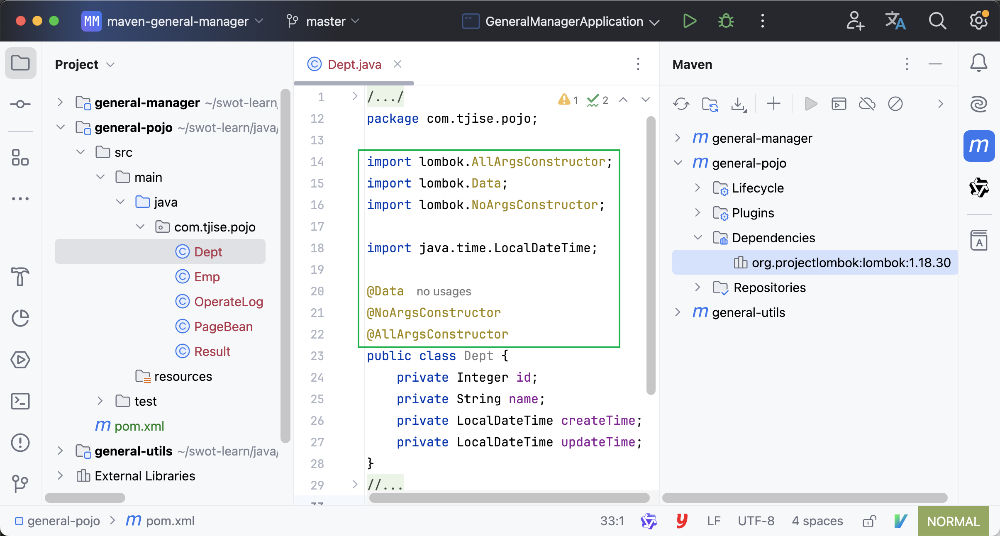

:source-highlighter: pygments
:icons: font
:scripts: cjk
:toc:
:toc: right
:toc-title: 目录
:toclevels: 3

= Maven

++++
<button id="toggleButton">Table of Contents</button>
<script>
    // 获取按钮和 div 元素
    const toggleButton = document.getElementById('toggleButton');
    const contentDiv = document.getElementById('toc');
    contentDiv.style.display = 'block';

    // 添加点击事件监听器
    toggleButton.addEventListener('click', () => {
        // 切换 div 的显示状态
        // if (contentDiv.style.display === 'none' || contentDiv.style.display === '') {
        if (contentDiv.style.display === 'none') {
            contentDiv.style.display = 'block';
        } else {
            contentDiv.style.display = 'none';
        }
    });
</script>
++++

== Maven 介绍
*Maven 是用于管理和构建 java 项目的工具，它基于项目对象模型(POM - Project Object Model)的概念，通过一小段描述信息 (pom.xml文件) 来管理项目的构建。*

官网: http://maven.apache.org


maven 功能：

1. 依赖管理
** 方便快捷的管理项目的资源(jar包)，避免版本冲突问题。

2. 统一项目结构
** 固定的目录结构（参创建项目后的目录结构）。

3. 项目构建
** 标准跨平台（Linux、Windows、MacOS）的自动化项目构建方式。
** 主要阶段: 清理，编译，测试，打包，发布。

== Maven 下载安装
下载: https://maven.apache.org/download.cgi

安装: https://maven.apache.org/install.html

. 下载 bin 二进制压缩包，如 apache-maven-3.9.9-bin.tar.gz

. 解压 bin 二进制压缩包 `tar xzvf apache-maven-3.9.9-bin.tar.gz`
  * 注意解压路径不要包含特殊字符，如中文、空格等等，因为可能会遇到无法预料的问题。

. 依赖 Java，需要配置 JAVA_HOME (参 Java 安装)

. 设置 Maven 自身的运行环境，需要配置 MAVEN_HOME (现在已经不是必须的了，有些老的库会使用 MAVEN_HOME，还是配置上吧)
* 设置环境变量 MAVEN_HOME 为: `您的目录路径/apache-maven-3.9.9`
* 编辑环境变量 PATH
  ** 注意 Windows 系统为增加 `%MAVEN_HOME%\bin`，参考下面 Windows 的安装说明。
+
.vim ~/.zshrc
[source,shell,]
----
export MAVEN_HOME=/Users/swot/soft/apache-maven-3.9.9
export PATH=$MAVEN_HOME/bin:$PATH
----
+
.生效配置(或者重新打开终端窗口也可以生效配置)
[source,console,]
----
source ~/.zshrc
----

. 检测 Maven 是否安装好
+
[source,console,]
----
mvn -v
----

IMPORTANT: 解压路径不要有中文

=== Windows 设置环境变量
此电脑 右键 --> 高级系统设置 --> 高级 --> 环境变量

A. 在系统变量处新建一个变量 MAVEN_HOME
+
image::img/maven_home.png[,800]

B. 在 Path 中进行配置
+


== Maven 仓库
仓库：用于存储资源，包含各种 jar 包

* 中央仓库: 在国外 Maven 的服务器上
** https://repo1.maven.org/maven2/

* 私服仓库: 在公司自己部署的服务器上(可选)

* 本地仓库: 在开发者的机器上


开发时获取 jar 包的顺序:

* 开发机器的本地仓库 -> 私服仓库(可选) -> 中央仓库

== Maven 本地仓库 conf/settings.xml
配置文件: 您的 maven 安装目录/conf/settings.xml

配置本地仓库位置: +
<localRepository>/Users/swot/maven/repository</localRepository>

== Maven 镜像仓库 conf/settings.xml
Maven 的中央仓库是 `<url>https://repo.maven.apache.org/maven2</url>`

因为是在国外会相对慢一些，所以需要配置一个国内的镜像仓库。

打开 maven 的配置文件（windows机器一般在 maven 安装目录的 conf/settings.xml），在<mirrors></mirrors>标签中添加mirror子节点：

配置文件: conf/settings.xml

```xml
<mirror>
    <id>alimaven</id>
    <mirrorOf>central</mirrorOf>
    <name>阿里云公共仓库</name>
    <url>https://maven.aliyun.com/repository/public</url>
</mirror>
```

// 参考: https://help.aliyun.com/document_detail/102512.html?spm=a2c6h.13066369.question.6.6ad54e6cnX8crS&source=5176.11533457&userCode=28kqeewo&type=copy

// 有项目存在的时候，更改完后可以执行 mvn clean install -U 测试
// 该命令会强制更新依赖并从远程仓库下载。如果一切配置正确，Maven 应该会从阿里云镜像仓库下载依赖，而不是中央仓库。

== Maven 项目使用 IDEA


=== IDEA 设置 Maven 全局环境
1. 选择 IDEA 中 File --> close project
   * 如果打开了项目，请关闭项目

2. IDEA 主界面点击 Customize --> All settings
+
image::img/all_settings.png[,800]

3. 打开 All settings , 选择 Build,Execution,Deployment --> Build Tools -->
Maven (或者在顶端搜索 maven 也行)
+
image::img/maven_global.png[,960]

=== IDEA 创建 Maven 项目
不同版本的 IDEA 可能略有差别，这是 2024 社区版本的 IDEA。

*方式1: 推荐*


*方式2: 了解即可*

image::img/maven_project_create2.png[,960]

=== IDEA 打开 Maven 项目
用途：打开已创建的 Maven 项目

1. 在 IDEA 中点击 File，选择 Open

2. 选择 Maven 工程 (二选一)
* 方式一: 选择工程目录
* 方式二: 选择工程的 pom.xml 文件

3. *配置 Maven 环境 (重要)*
* 检查 JDK 版本
+
image::img/maven_check_jdk.png[]

* 检查 Maven 版本 -> File(MacOS 是 InteliJ IDEA) -> Settings
+
image::img/maven_env.png[]

== Maven 项目结构
Maven 项目主要目录列出如下：

====
* src 目录
    ** main -> 实际项目资源
        *** [red]#java -> java源代码目录，在此写代码#
        *** resources -> 配置文件目录
    ** test -> 测试项目资源
        *** java -> java 测试代码目录
        *** resources -> 测试配置文件目录，可以不要该目录
* pom.xml -> 核心配置文件
====

=== pom.xml 核心配置文件内容示例
下面是 Maven 项目创建时默认生成的 pom.xml 文件

[source,xml,linenums]
----
<?xml version="1.0" encoding="UTF-8"?>
<project xmlns="http://maven.apache.org/POM/4.0.0"
         xmlns:xsi="http://www.w3.org/2001/XMLSchema-instance"
         xsi:schemaLocation="http://maven.apache.org/POM/4.0.0 http://maven.apache.org/xsd/maven-4.0.0.xsd">
    <!-- Maven uses this to validate the POM file's structure. Do not change it -->
    <modelVersion>4.0.0</modelVersion>

    <!-- 定义该 Maven 项目本身的坐标 -->
    <groupId>com.tjise</groupId>
    <artifactId>maven-demo1</artifactId>
    <version>1.0-SNAPSHOT</version>

    <properties>
        <!-- 表示使用 Java 8 的语法来编译代码 -->
        <maven.compiler.source>8</maven.compiler.source>
        <!-- 表示生成的字节码将与 Java 8 兼容（即它将在运行 Java 8 或更高版本的 JVM 上运行） -->
        <maven.compiler.target>8</maven.compiler.target>
        <!-- 全局设置 UTF-8，所以在 maven 的编译、执行等插件中不用再设置了 -->
        <project.build.sourceEncoding>UTF-8</project.build.sourceEncoding>
    </properties>
</project>
----

== Maven 坐标
Maven 中的坐标用于描述仓库中资源(jar包)的位置，使用坐标来定义项目本身的坐标或引入项目中需要的依赖的坐标。

Maven 坐标主要组成:

* groupld:    定义项目隶属组织名称(通常是域名反写，例如: org.mybatis)
* artifactld: 定义项目名称(通常是模块名称，例如 order-service, goods-service)
* version:    定义项目版本号，SNAPSHOT 翻译中文为快照的意思，指的是正在开发的版本。
// * packaging:  定义该项目的打包方式(可选)


***
在 pom.xml 中定义项目本身的坐标：

```xml
<groupId>com.tjise</groupId>
<artifactId>maven-demo1</artifactId>
<version>1.0-SNAPSHOT</version>
```


***
在 pom.xml 中引入第三方库的坐标：

```xml
<dependencies>

    <dependency>
        <groupId>org.projectlombok</groupId>
        <artifactId>lombok</artifactId>
        <version>1.18.30</version>
    </dependency>

    <dependency>
        <groupId>junit</groupId>
        <artifactId>junit</artifactId>
        <version>4.12</version>
        <scope>test</scope>  <!-- 属于依赖范围，先别管 -->
    </dependency>

</dependencies>
```

TIP: 您可以放入 pom.xml 文件中试试效果如下  -> ##刷新 Maven## 后会引入 lombok 的 jar 包。

[.thumb]


image::img/maven_refresh_button.png[refresh,640]

* 左边刷新按钮（圆形箭头图标）：
这个按钮通常用于刷新整个Maven项目。点击这个按钮会触发Maven重新解析项目的 pom.xml 文件，重新下载所有依赖项，并更新项目的依赖树。这个操作相当于执行了 Maven 的 `mvn clean install` 命令，确保项目的所有依赖都是最新的，并且本地仓库中的依赖是完整的。

* 右边刷新按钮（两个箭头组成的圆形图标）：
这个按钮可能用于刷新 Maven 依赖树视图。点击这个按钮会更新 IDE 中显示的依赖树，确保显示的依赖信息与 pom.xml 文件中定义的一致。这个操作不会重新下载依赖项，只是更新 IDE 中的显示内容。

{empty}

.常用坐标网站
****
国外查找坐标网站: https://mvnrepository.com/

国内查找坐标网站: https://mvn.coderead.cn/
****

== Maven 坐标引入成功测试 test
1. 在 maven 项目的 `src/test/java/` 下创建一个包，如 com.tjise

2. 在包 com.tjise 下创建测试类 MavenTest.java [red]##*(注意测试类要以 Test 结尾，这样 maven 的 test 插件才能找到该测试类)*##，否则只能手动在 IDEA 中点击单个类的测试按钮了。可以看下面的截图。

3. MavenTest.java 内容如下：
+
```java
package com.tjise;

import org.junit.Test;

public class MavenTest {
    @Test
    public void show(){
        System.out.println("hello maven");
    }
}
```

4. 在 IDEA 中运行测试该类，成功则说明 junit 坐标是引入成功的。

* 点击 IDEA 测试类的运行按钮，可以正常运行该测试类。
* 点击 IDEA Maven -> Lifecycle -> test 后，不会运行 MavenTry 测试类。
* 点击 IDEA Probems 中会提示测试类 MavenTry 命名没有以 Test 结尾。

+
.测试类名没有以 Test 结尾的截图
====
image::img/maven_test.png[]
====

== Maven 坐标依赖传递特性
以 pom.xml 中只引入了 junit 为例:

```xml
<dependency>
    <groupId>junit</groupId>
    <artifactId>junit</artifactId>
    <version>4.12</version>
    <scope>test</scope>  属于依赖范围，先别管
</dependency>
```

在刷新 Maven 后，可以看见 junit 还引入了 hamcrest-core 依赖。


*可以这样理解：以后我们可以直接使用被间接依赖的 jar 包，这就是依赖的传递特性。*

== Maven 坐标排除依赖
排除依赖指主动断开依赖的资源，被排除的资源无需指定版本。在实际项目开发中，如无特殊需求，不用排除依赖。此处只是一个演示。

比如想排除 junit 中的 hamcrest-core 依赖，可以使用 <exclusions> 指定如下：

[source,xml,linenums,highlight=6..11]
----
<dependency>
    <groupId>junit</groupId>
    <artifactId>junit</artifactId>
    <version>4.12</version>
    <scope>test</scope>
    <exclusions>
        <exclusion>
            <groupId>org.hamcrest</groupId>
            <artifactId>hamcrest-core</artifactId>
        </exclusion>
    </exclusions>
</dependency>
----


== Maven 坐标依赖范围
比如在 pom.xml 文件中，将 junit 的 scope 设置为 test，如下：

[source,java,linenums,highlight=5]
----
<dependency>
    <groupId>junit</groupId>
    <artifactId>junit</artifactId>
    <version>4.12</version>
    <scope>test</scope>
</dependency>
----


那么在 **src/main/java/com/tjise/Main.java** 中就不能用 junit 了，@Test 会在 IDEA中报红色不能用，提示 Cannot resolve symbol 'Test'。

```java
package com.tjise;

public class Main {
    public static void main(String[] args) {
        System.out.println("Hello world!");
    }

    // 报错不能用 junit: Cannot resolve symbol 'Test'
    @Test
    public void showSomeThing(){}
}
```

但是在 `src/test/java/com/tjise/MavenTest.java` 中是可以使用 @Test 的。

```java
package com.tjise;

import org.junit.Test;

public class MavenTest {
    // 可以使用 junit
    @Test
    public void show(){
        System.out.println("hello maven");
    }
}
```

=== 依赖范围说明
依赖的 jar 包，默认情况下，可以在任何地方使用（main 和 test）。可以在 pom.xml 中通过 <scope>...</scope> 设置其作用范围。

* 主程序范围有效。(main 目录内)

* 测试程序范围有效。(test 目录内)

* 是否参与打包运行。(package 指令范围内)

[caption=]
.scope 取值范围
[cols="1,1,1,1,2,2",options="header"]
|===
| scope值      | 主程序 | 测试程序 | 打包(运行) | 范例           | 场景

| compile(默认) | Y     | Y      | Y         | log4j         | 在三种场景都需要
| test         | --     | Y      | --        | junit        | 只在测试时才需要
| provided      | Y     | Y     | --        | servlet-api   | 比如打 war 包，Web 容器（如 Tomcat）会在运行时提供 servlet-api
| runtime       | --    | Y     | Y         | jdbc 数据库驱动  | 只在运行时需要
|===

NOTE: scope runtime 指主程序（编译时）只需要依赖 JDBC 接口（属于 java.sql 包），而运行时才需要具体的实现（即数据库驱动 Jar 包）。

== Maven 生命周期
在 Maven 中，生命周期指的是项目的构建过程，这个过程由一系列**阶段（phases）**组成，Maven 自动帮你执行这些阶段来完成构建操作。

Maven 的生命周期主要分为三个核心部分：

[discrete]
=== 1. **`clean` 生命周期**：
   - *目的*：清理项目的构建结果。
   - *阶段*：
     ** `pre-clean`：在清理之前要做的工作。
     ** [red]`clean`：删除上一次构建生成的所有文件（如 `target/` 目录下的文件）。
     ** `post-clean`：在清理之后要做的工作。
   - *作用*：当你执行 `mvn clean` 时，它会删除之前构建生成的所有文件，确保下一次构建从干净的状态开始。

[discrete]
===  2. *`default` 生命周期*（也叫构建生命周期）：
   - *目的*：负责项目的构建、测试、打包等一系列步骤。
   - *阶段*：最重要的部分，包含了 Maven 实际构建项目的核心步骤。
     ** `validate`：验证项目结构是否正确，检查所有必要信息是否可用。
     ** [red]`compile`：编译项目的源代码（位于 `src/main/java` 到 target 目录下）。
     ** [red]`test`：运行测试代码（位于 `src/test/java`），确保代码功能正常。
     ** [red]`package`：打包编译后的代码成 JAR 或 WAR 文件。
     ** `verify`：运行任何集成测试，确保包的质量。
     ** [red]`install`：将打包后的项目安装到本地 Maven 仓库中，方便其他项目依赖。
     ** `deploy`：将最终的构建发布到远程 Maven 仓库中（一般指 maven 私服），供他人使用。
   - **作用**：这是项目从开发、编译、测试、打包到部署的完整流程。通常你只要执行 `mvn package`，Maven 会自动完成 `validate` 到 `package` 之间所有必要的步骤。

[discrete]
=== 3. **`site` 生命周期**： -> 了解即可
   - *目的*：为项目生成站点文档。
   - *阶段*：
      ** `pre-site`：在生成站点之前的准备工作。
      ** `site`：为项目生成站点文档。
      ** `post-site`：在生成站点之后执行的工作。
      ** `site-deploy`：将生成的站点文档发布到服务器上，供浏览。
   - *作用*：为项目生成一个静态站点文档，通常用于项目的描述、API 文档、测试结果等。

[discrete]
=== 总结
Maven 的生命周期由这三个核心部分组成，它们帮助你自动管理项目的不同构建步骤：

1. **`clean` 生命周期**：清理上一次构建的结果。
2. **`default` 生命周期**：完成项目从编译、测试到打包、安装的全过程。
3. **`site` 生命周期**：生成项目文档。

这三个生命周期每个都有自己的作用域，可以独立运行或结合使用。最常用的是 `default` 生命周期，它包含了大多数开发流程中需要的步骤。

== Maven 内置插件介绍
Maven 插件与生命周期命令对应关系如下图：

* 如 test 对应插件 surefire
* 如 package 对应插件 jar
* 其他的名字是相同的，一一对应。

image::img/maven_plugin.png[,800]

== Maven 高级 -- 学完 spring boot 再来


=== 分模块设计
什么是分模块设计? ::
将项目按照功能拆分成若干个子模块。

为什么要分模块设计?::
方便项目的管理维护、扩展，也方便模块间的相互调用，资源共享。

注意事项: ::
分模块设计需要先针对模块功能进行设计，再进行编码。不会先将工程开发完毕，然后进行拆分。

image::img/maven_module_design.png[,800]


我们以之前完成的单模块项目 general-manager 为例进行拆分操作。

1. 把 pojo 拆分成一个模块，如叫 general-pojo。
2. 把 utils 拆分成一个模块，如叫 general-utils。
3. 原模块 general-manager 依然存在（少了上面两个模块），它使用 pom.xml 来引用上面拆分出去的两个模块。

==== 先预览一下创建好的 maven 模块结构
要在项目 maven-gereral-manager 下一共创建 3 个模块，如下图所示：

image::img/maven_module_structure.png[]

// 这儿只是先看下要创建的结果，后面有具体操作步骤。

==== 创建空的 maven 项目
1. 先创建一个 maven 项目。（module-design 是自己创建的一个目录，没有特别的意义）
+
image::img/maven_create_new_project.png[,800]

2. 再删除默认创建的模块，使新创建的项目为空项目。IDEA File 菜单选择 Project Structure...
+


3. 删除无用的文件和目录，如 src、pom.xml、.gitignore 等等。

IMPORTANT: 重新启动 IDEA，否则新导入的模块名称会乱，可能成为项目的名称。比如导入了 general-manager 模块，最后模块名称变成了项目的名称 maven-general-manager。这是不对的哟！

==== 复制之前的 general-manager 项目
1. 找到之前开发的项目，复制到目录 maven-general-manager 中。

2. 打开 IDEA file 菜单选择 Project Structure...，选择 Modules，再点击 *+* 号选择 Import Module，导入刚刚复制的 general-manager 项目。
* 可以选择 general-manager 目录。
* 也可选择 general-manager 目录下的 pom.xml 文件。
+


3. 运行项目，应该可以正常启动。然后可以使用 httpie 或者运行前端项目进行测试一下。

下面创建两个模块 general-pojo 和 general-utils 进行演示。

==== 创建 maven 模块 general-pojo
1. 打开 IDEA file 菜单选择 Project Structure...，选择 Modules，再点击 + 号选择 New Module。
+


2. 在 general/src/main/java 下创建包 com.tjise
+
image::img/maven_general-pojo_create_package_com.tjise.png[,800]

3. 将 general-manager 中的 pojo 目录剪切后粘贴到 general-pojo 中。
+


4. 因为缺少 lombok 依赖，代码报错如下
+
image::img/maven_missing_lombok.png[,800]

5. 在 pom.xml 中导入 lombok 依赖（注意要写上版本，否则无法加载）
+


6. 检查因缺少 lombok 依赖而报错的代码，正常了。
+


==== 创建 maven 模块 general-utils
1. 打开 IDEA file 菜单选择 Project Structure...，选择 Modules，再点击 + 号选择 New Module。
+
image::img/maven_create_module_general-utils.png[,800]

2. 在 general/src/main/java 下创建包 com.tjise
+


3. 将 general-manager 中的 utils 目录剪切后粘贴到 general-utils 中。
+


4. 因为缺少一些依赖，代码中有会好多报错，如下：
+


5. 在 pom.xml 中导入相应依赖，刷新后正常。（如果不行，指定相应版本试一下）
+
[source,xml]
----
<dependencies>
    <dependency>
        <groupId>org.springframework.boot</groupId>
        <artifactId>spring-boot-starter-web</artifactId>
        <version>2.7.18</version>
    </dependency>

    <dependency>
        <groupId>org.projectlombok</groupId>
        <artifactId>lombok</artifactId>
        <version>1.18.30</version>
        <optional>true</optional>
    </dependency>

    <dependency>
        <groupId>com.aliyun.oss</groupId>
        <artifactId>aliyun-sdk-oss</artifactId>
        <version>3.17.4</version>
    </dependency>

    <!-- 接口层: 编译时需要 -->
    <dependency>
        <groupId>io.jsonwebtoken</groupId>
        <artifactId>jjwt-api</artifactId>
        <version>0.12.6</version>
    </dependency>

    <!-- 实现层: 运行时必需 -->
    <dependency>
        <groupId>io.jsonwebtoken</groupId>
        <artifactId>jjwt-impl</artifactId>
        <version>0.12.6</version>
        <scope>runtime</scope>
    </dependency>

    <!-- JSON 序列化支持: 运行时必需 -->
    <dependency>
        <groupId>io.jsonwebtoken</groupId>
        <artifactId>jjwt-jackson</artifactId>
        <version>0.12.6</version>
        <scope>runtime</scope>
    </dependency>
</dependencies>
----

6. 检查因缺少相应依赖而报错的代码，都正常了。
+
image::img/maven_missing_dependences_ok.png[]

==== 在模块 general-manager 的 pom.xml 中引入新建的两个模块


===== general-pojo
[source,xml]
....
<dependency>
    <groupId>com.tjise</groupId>
    <artifactId>general-pojo</artifactId>
    <version>1.0-SNAPSHOT</version>
</dependency>
....

===== general-utils
[source,xml]
....
<dependency>
    <groupId>com.tjise</groupId>
    <artifactId>general-utils</artifactId>
    <version>1.0-SNAPSHOT</version>
</dependency>
....

==== 测试分模块后的项目
运行项目，应该可以正常启动。然后可以使用 httpie 或者运行前端项目进行测试一下。

=== 继承关系
现在三个模块中都有相同的依赖，如 lombok，可以抽取到父模块的 pom.xml 中，只有一份即可。

* 概念：继承描述的是两个工程间的关系，与 java 中的继承相似，子工程可以继承父工程中依赖。
* 作用：简化依赖配置、统一管理依赖。
* 实现：<parent> ... </parent> 

****
* jar：普通 maven 模块和 springboot 项目打包都是 jar 包（内嵌 tomcat 运行）。
* war：普通 web 程序打包，需要部署在外部的 tomcat 服务器中运行（现在很少用了）。
* pom：父工程或聚合工程，该模块不写代码，仅进行依赖管理。
****

==== 创建父模块（接着上面分模块设计继续操作）
创建 maven 模块 general-parent ，该工程为父工程，设置打包方式 pom (默认 jar)。

1. 打开 IDEA file 菜单选择 Project Structure...，选择 Modules，再点击 + 号选择 New Module。
+
image::img/maven_create_parent_module.png[,800]

2. 在父模块删除不需要的 general-parent/src 目录。

3. 在父模块的 pom.xml 增加 <packaging>pom</packaging>

===== file -> module-design/maven-general-manager/general-parent/pom.xml


====== 1) packaging 指定该父模块打包方式为 pom
[source,xml]
....
<packaging>pom</packaging>
....

====== 2) parent 指定该模块的父模块依赖 Spring Boot 默认的 <parent>
[source,scss]
....
<parent>
    <groupId>org.springframework.boot</groupId>
    <artifactId>spring-boot-starter-parent</artifactId>
    <version>2.7.18</version>
    <relativePath/> <!-- lookup parent from repository 指从本地仓库查找父模块-->
</parent>
....

====== 3) dependency 配置各个子模块共有的依赖（子模块会自动继承父模块的依赖）
[source,scss]
....
<dependencies>
    <dependency>
        <groupId>org.projectlombok</groupId>
        <artifactId>lombok</artifactId>
        <version>1.18.30</version>
        <optional>true</optional>
    </dependency>
</dependencies>
....

optional 为 true 表示不会将该依赖传递给子模块。

* 子模块想用 lombok，依然得声明，但是不用指定版本了。
* 若父子模块都配置了同一个依赖的不同版本，以子模块的版本为准。

==== 在子模块的 pom.xml 文件中，配置继承关系
NOTE: 下面三个子模块中多余的 <groupId> 坐标可以删除，因为都已经在它们的 <parent> 坐标中指定了。

.可以删除 <groupId>
[source,scss]
----
<groupId>com.tjise</groupId>
----

.在 <parent> 中已经指定 <groupId> 了
[source,scss]
----
<parent>
    <groupId>com.tjise</groupId>
    <artifactId>general-parent</artifactId>
    <version>1.0-SNAPSHOT</version>
    <relativePath>../general-parent/pom.xml</relativePath>
</parent>
----

IMPORTANT: relativePath 指定父模块的 pom 文件的相对位置（如果不指定，将从本地仓库/远程仓库查找该模块）。

===== file -> module-design/maven-general-manager/general-manager/pom.xml


====== parent & self
[source,scss]
....
<parent>
    <groupId>com.tjise</groupId>
    <artifactId>general-parent</artifactId>
    <version>1.0-SNAPSHOT</version>
    <relativePath>../general-parent/pom.xml</relativePath>
</parent>

<!-- 可以删除 -->
<!-- <groupId>com.tjise</groupId> -->
<artifactId>general-manager</artifactId>
<version>0.0.1-SNAPSHOT</version>
<name>general-manager</name>
....

===== file -> module-design/maven-general-manager/general-pojo/pom.xml


====== parent & self
[source,scss]
....
<parent>
    <groupId>com.tjise</groupId>
    <artifactId>general-parent</artifactId>
    <version>1.0-SNAPSHOT</version>
    <relativePath>../general-parent/pom.xml</relativePath>
</parent>

<!-- 可以删除 -->
<!-- <groupId>com.tjise</groupId> -->
<artifactId>general-pojo</artifactId>
<version>1.0-SNAPSHOT</version>
....

===== file -> module-design/maven-general-manager/general-utils/pom.xml


====== parent & self
[source,scss]
....
<parent>
    <groupId>com.tjise</groupId>
    <artifactId>general-parent</artifactId>
    <version>1.0-SNAPSHOT</version>
    <relativePath>../general-parent/pom.xml</relativePath>
</parent>

<!-- 可以删除 -->
<!-- <groupId>com.tjise</groupId> -->
<artifactId>general-utils</artifactId>
<version>1.0-SNAPSHOT</version>
....

=== 父模块版本锁定
在 maven 中，可以在父模块的 pom 文件中通过 <dependencyManagement> 来统一管理**依赖版本**。

NOTE: 子模块引入依赖时，无需指定 <version> 版本号，父模块统一管理。**变更依赖版本号**，只需在父模块中统一变更。

IMPORTANT: <dependencyManagement> 只是对版本进行管理，没有继承关系！如果想要继承，参上节内容。

image::img/maven_dependencyManagement.png[]

下面是变更的代码例子。

==== file -> module-design/maven-general-manager/general-parent/pom.xml


===== dependencyManagement -> 在此父模块中指定依赖版本
[source,scss,linenum]
....
<dependencyManagement>
    <dependencies>
        <dependency>
            <groupId>org.springframework.boot</groupId>
            <artifactId>spring-boot-starter-web</artifactId>
            <version>2.7.18</version>
        </dependency>
        <dependency>
            <groupId>com.aliyun.oss</groupId>
            <artifactId>aliyun-sdk-oss</artifactId>
            <version>3.17.4</version>
        </dependency>
        <dependency>
            <groupId>io.jsonwebtoken</groupId>
            <artifactId>jjwt-api</artifactId>
            <version>0.12.6</version>
        </dependency>

        <!-- 实现层: 运行时必需 -->
        <dependency>
            <groupId>io.jsonwebtoken</groupId>
            <artifactId>jjwt-impl</artifactId>
            <version>0.12.6</version>
            <scope>runtime</scope>
        </dependency>

        <!-- JSON 序列化支持: 运行时必需 -->
        <dependency>
            <groupId>io.jsonwebtoken</groupId>
            <artifactId>jjwt-jackson</artifactId>
            <version>0.12.6</version>
            <scope>runtime</scope>
        </dependency>
    </dependencies>
</dependencyManagement>
....

==== file -> module-design/maven-general-manager/general-utils/pom.xml


===== <dependencies>
该子模块中依赖的具体版本号已经去掉了，maven 会自动引用父模块 <dependencyManagement> 定义好的依赖版本。

[source,scss]
....
<dependencies>
    <dependency>
        <groupId>org.springframework.boot</groupId>
        <artifactId>spring-boot-starter-web</artifactId>
    </dependency>
    <dependency>
        <groupId>com.aliyun.oss</groupId>
        <artifactId>aliyun-sdk-oss</artifactId>
    </dependency>
    <dependency>
        <groupId>io.jsonwebtoken</groupId>
        <artifactId>jjwt-api</artifactId>
    </dependency>

    <!-- 实现层: 运行时必需 -->
    <dependency>
        <groupId>io.jsonwebtoken</groupId>
        <artifactId>jjwt-impl</artifactId>
        <scope>runtime</scope>
    </dependency>

    <!-- JSON 序列化支持: 运行时必需 -->
    <dependency>
        <groupId>io.jsonwebtoken</groupId>
        <artifactId>jjwt-jackson</artifactId>
        <scope>runtime</scope>
    </dependency>
</dependencies>
....

=== 父模块中引用依赖的自定义版本属性
为了方便在一个地方对所有的依赖版本号进行更改，可以在父组件 pom.xml 的 <properties> 坐标中自定义依赖版本号变量。然后在父模块中相应需要版本号的地方引用该变量即可。

image::img/maven_self_define_version_variable.png[]

==== file -> module-design/maven-general-manager/general-parent/pom.xml


===== properties -> 在此自定义依赖版本变量来统一管理依赖版本号
[source,scss]
....
<properties>
    <maven.compiler.source>8</maven.compiler.source>
    <maven.compiler.target>8</maven.compiler.target>
    <project.build.sourceEncoding>UTF-8</project.build.sourceEncoding>

    <!-- 变量名是自定义的，如 lombok.version，这儿为了演示只定义了两个变量 -->
    <lombok.version>1.18.30</lombok.version>
    <oss.version>3.17.4</oss.version>
</properties>
....

===== dependency -> 在此引用自定义的依赖版本变量
[source,scss]
....
<dependencies>
    <dependency>
        <groupId>org.projectlombok</groupId>
        <artifactId>lombok</artifactId>

        <!-- 引用自定义版本号变量 -->
        <version>${lombok.version}</version>
        <optional>true</optional>
    </dependency>
</dependencies>
....

IMPORTANT: 若父子模块都配置了同一个依赖的不同版本，以子模块的版本为准。

===== dependencyManagement -> 在此引用自定义的依赖版本变量
[source,scss,linenum]
....
<dependencyManagement>
    <dependencies>
        <dependency>
            <groupId>org.springframework.boot</groupId>
            <artifactId>spring-boot-starter-web</artifactId>
            <version>2.7.18</version>
        </dependency>
        <dependency>
            <groupId>com.aliyun.oss</groupId>
            <artifactId>aliyun-sdk-oss</artifactId>
            <version>${oss.version}</version>
        </dependency>
        <dependency>
            <groupId>io.jsonwebtoken</groupId>
            <artifactId>jjwt-api</artifactId>
            <version>0.12.6</version>
        </dependency>

        <!-- 实现层: 运行时必需 -->
        <dependency>
            <groupId>io.jsonwebtoken</groupId>
            <artifactId>jjwt-impl</artifactId>
            <version>0.12.6</version>
            <scope>runtime</scope>
        </dependency>

        <!-- JSON 序列化支持: 运行时必需 -->
        <dependency>
            <groupId>io.jsonwebtoken</groupId>
            <artifactId>jjwt-jackson</artifactId>
            <version>0.12.6</version>
            <scope>runtime</scope>
        </dependency>
    </dependencies>
</dependencyManagement>
....

=== 面试题: <dependencyManagement> 与 <dependencies>的区别是什么?
<dependencies> 是直接依赖，在父模块配置了依赖，子模块会直接继承下来。 

<dependencyManagement> 是统一管理依赖版本，不会直接依赖，还需要在子模块中引入所需依赖(无需指定版本)。

=== 聚合模块
目前存在的问题：

1. general-manager 依赖于两个模块，分别是 general-pojo 和 general-utils。

2. 如果直接对 general-manager 模块进行 package 打包会报错。
+
image::img/maven_package_no_dependence_jar.png[]

3. 如果分别对 general-pojo 和 general-utils 进行 install（装到本地仓库了，如有兴趣可以试下 install 操作），则 general-manager 模块可以 package 打包构建成功。若模块很多，则操作会很麻烦。

4. 引入聚合模块功能可解决此问题。
* 聚合：将多个模块组织成一个整体，同时进行项目的构建。
* 聚合模块：一个不具有业务功能的“空”模块（有且只有一个 pom.xml 文件）
* 作用：快速构建项目（无需根据依赖关系手动构建，直接在聚合模块上构建即可）

NOTE: 直接使用前面的父模块即可，因为它只有一个 pom.xml 文件，符合条件。

==== file -> module-design/maven-general-manager/general-parent/pom.xml


===== modules -> 配置聚合模块的子模块
maven 中可以通过 <modules> 设置当前聚合模块所包含的子模块名称。聚合模块中所包含的模块，在构建时，会自动根据模块间的依赖关系设置构建顺序，与模块的配置书写位置无关。

[source,scss]
....
<!-- 这三个 module 的书写顺序没有关系 -->
<modules>
    <module>../general-manager</module>
    <module>../general-pojo</module>
    <module>../general-utils</module>
</modules>
....

此时使用 maven package 可以进行打包构建了。


=== 面试题: 继承与聚合的区分
作用

* 聚合用于快速构建项目。
* 继承用于简化依赖配置、统一管理依赖。

相同点：

* 聚合与继承的 pom.xml 文件打包方式均为 pom，可以将继承和聚合设置为同一个模块。
* 聚合与继承均属于设计型模块，并无实际的模块内容。

不同点：

* 聚合是在父模块中配置关系，聚合可以感知到参与聚合的模块有哪些。
* 继承是在子模块中配置关系，父模块无法感知哪些子模块继承了自己。

IMPORTANT: 需要参考上面知识点仔细品味！

=== 私服 nexus -> 公司自己搭建的 maven 依赖服务器
私服是一种特殊的远程仓库，它是架设在局域网内的仓库服务，用来代理位于外部的中央仓库，用于解决团队内部的资源共享与资源同步问题。

依赖查找顺序：

1. 本地仓库（开发者电脑）
2. 私服（公司内部服务器）
3. 中央仓库（全球唯一）

.私服架构示意图


TIP: 私服在企业项目开发中，公司只需要一台即可（无需我们自己搭建，会使用即可）。

==== nexus 安装与运行
nexus 下载地址: https://www.sonatype.com/thanks/repo-community-edition

比如下载的是 nexus-3.83.0-08-mac-x86_64.tar.gz，解压后运行:

[source,console]
----
cd nexus-3.83.0-08-mac-x86_64/nexus-3.83.0-08/bin
./nexus start  # 无信息输出方式启动
./nexus run    # 有信息输出方式启动
./nexus stop   # 停止服务
----

浏览器访问 http://localhost:8081

.admin 用户密码存放位置
....
Your admin user password is located in
/Users/swot/soft/nexus-3.83.0-08-mac-x86_64/sonatype-work/nexus3/admin.password on the server.
....

NOTE: 登录后让改密码，我已经把密码改成了 123456。改完密码后 admin.password 文件就被删除了。

==== Nexus 预置的仓库（Repository）说明
这些都是 Nexus 预置的仓库（Repository），按用途可以分三类：代理仓库、托管仓库和仓库组。

[caption=]
[cols="1,1,3",options="header"]
|===
| 仓库名 | 类型  | 作用说明

| **maven-central** | 代理仓库（Proxy） | 代理 Maven 中央仓库。你下载的依赖如果本地没有，就会通过它去 Maven Central 拉取并缓存下来。 
| **maven-public** | 仓库组（Group） | 把 maven-central、maven-releases、maven-snapshots 等统一聚合到一个地址对外发布。让客户端只需要配置这一个 URL 即可获取所有 Maven 依赖。 
| **maven-releases** | 托管仓库（Hosted） | 存放自己项目发布的正式版本（release）。执行 `mvn deploy` 时，如果是 release 版本（不带 `-SNAPSHOT`），就会部署到这里。 
| **maven-snapshots** | 托管仓库（Hosted） | 存放自己项目的快照版本（snapshot）。开发过程中每次 `mvn deploy` 的 `-SNAPSHOT` 版本都会放进来。 
| **nuget.org-proxy** | 代理仓库（Proxy） | 代理官方 NuGet 源，给 .NET/C# 项目拉取包。 
| **nuget-hosted** | 托管仓库（Hosted） | 存放自己打包并发布的 NuGet 包。 
| **nuget-group** | 仓库组（Group） | 把 nuget.org-proxy 和 nuget-hosted 聚合成一个地址，客户端只需要配置这一个即可同时获取官方包和自己内部包。 
|===

日常使用要点

- **Maven 项目**：在 `settings.xml` 或 `pom.xml` 里把 `<mirror>` 或 `<repository>` 指向 **maven-public** 即可。
- **NuGet 项目**：在 Visual Studio 或 `nuget.config` 里把源指向 **nuget-group** 即可。

一句话总结：

- `-proxy` 是帮你去外网“代购”的仓库；
- `-hosted` 是你自己“生产”的仓库；
- `-group` 是把上面两类“打包”成一个入口，使用最方便。

==== 使用私服进行依赖的上传与下载


===== Maven 原始配置备份


====== @file /Users/swot/soft/apache-maven-3.9.9/conf/settings.xml
<!--
Licensed to the Apache Software Foundation (ASF) under one
or more contributor license agreements.  See the NOTICE file
distributed with this work for additional information
regarding copyright ownership.  The ASF licenses this file
to you under the Apache License, Version 2.0 (the
"License"); you may not use this file except in compliance
with the License.  You may obtain a copy of the License at

    http://www.apache.org/licenses/LICENSE-2.0

Unless required by applicable law or agreed to in writing,
software distributed under the License is distributed on an
"AS IS" BASIS, WITHOUT WARRANTIES OR CONDITIONS OF ANY
KIND, either express or implied.  See the License for the
specific language governing permissions and limitations
under the License.
-->

<!--
 | This is the configuration file for Maven. It can be specified at two levels:
 |
 |  1. User Level. This settings.xml file provides configuration for a single user,
 |                 and is normally provided in ${user.home}/.m2/settings.xml.
 |
 |                 NOTE: This location can be overridden with the CLI option:
 |
 |                 -s /path/to/user/settings.xml
 |
 |  2. Global Level. This settings.xml file provides configuration for all Maven
 |                 users on a machine (assuming they're all using the same Maven
 |                 installation). It's normally provided in
 |                 ${maven.conf}/settings.xml.
 |
 |                 NOTE: This location can be overridden with the CLI option:
 |
 |                 -gs /path/to/global/settings.xml
 |
 | The sections in this sample file are intended to give you a running start at
 | getting the most out of your Maven installation. Where appropriate, the default
 | values (values used when the setting is not specified) are provided.
 |
 |-->
<settings xmlns="http://maven.apache.org/SETTINGS/1.2.0"
          xmlns:xsi="http://www.w3.org/2001/XMLSchema-instance"
          xsi:schemaLocation="http://maven.apache.org/SETTINGS/1.2.0 https://maven.apache.org/xsd/settings-1.2.0.xsd">
  <!-- localRepository
   | The path to the local repository maven will use to store artifacts.
   |
   | Default: ${user.home}/.m2/repository
  <localRepository>/path/to/local/repo</localRepository>
  -->
  <localRepository>/Users/swot/maven/repository</localRepository>

  <!-- interactiveMode
   | This will determine whether maven prompts you when it needs input. If set to false,
   | maven will use a sensible default value, perhaps based on some other setting, for
   | the parameter in question.
   |
   | Default: true
  <interactiveMode>true</interactiveMode>
  -->

  <!-- offline
   | Determines whether maven should attempt to connect to the network when executing a build.
   | This will have an effect on artifact downloads, artifact deployment, and others.
   |
   | Default: false
  <offline>false</offline>
  -->

  <!-- pluginGroups
   | This is a list of additional group identifiers that will be searched when resolving plugins by their prefix, i.e.
   | when invoking a command line like "mvn prefix:goal". Maven will automatically add the group identifiers
   | "org.apache.maven.plugins" and "org.codehaus.mojo" if these are not already contained in the list.
   |-->
  <pluginGroups>
    <!-- pluginGroup
     | Specifies a further group identifier to use for plugin lookup.
    <pluginGroup>com.your.plugins</pluginGroup>
    -->
  </pluginGroups>

  <!-- TODO Since when can proxies be selected as depicted? -->
  <!-- proxies
   | This is a list of proxies which can be used on this machine to connect to the network.
   | Unless otherwise specified (by system property or command-line switch), the first proxy
   | specification in this list marked as active will be used.
   |-->
  <proxies>
    <!-- proxy
     | Specification for one proxy, to be used in connecting to the network.
     |
    <proxy>
      <id>optional</id>
      <active>true</active>
      <protocol>http</protocol>
      <username>proxyuser</username>
      <password>proxypass</password>
      <host>proxy.host.net</host>
      <port>80</port>
      <nonProxyHosts>local.net|some.host.com</nonProxyHosts>
    </proxy>
    -->
  </proxies>
  @others
  <!-- profiles
   | This is a list of profiles which can be activated in a variety of ways, and which can modify
   | the build process. Profiles provided in the settings.xml are intended to provide local machine-
   | specific paths and repository locations which allow the build to work in the local environment.
   |
   | For example, if you have an integration testing plugin - like cactus - that needs to know where
   | your Tomcat instance is installed, you can provide a variable here such that the variable is
   | dereferenced during the build process to configure the cactus plugin.
   |
   | As noted above, profiles can be activated in a variety of ways. One way - the activeProfiles
   | section of this document (settings.xml) - will be discussed later. Another way essentially
   | relies on the detection of a property, either matching a particular value for the property,
   | or merely testing its existence. Profiles can also be activated by JDK version prefix, where a
   | value of '1.4' might activate a profile when the build is executed on a JDK version of '1.4.2_07'.
   | Finally, the list of active profiles can be specified directly from the command line.
   |
   | NOTE: For profiles defined in the settings.xml, you are restricted to specifying only artifact
   |       repositories, plugin repositories, and free-form properties to be used as configuration
   |       variables for plugins in the POM.
   |
   |-->
  <profiles>
    <!-- profile
     | Specifies a set of introductions to the build process, to be activated using one or more of the
     | mechanisms described above. For inheritance purposes, and to activate profiles via <activatedProfiles/>
     | or the command line, profiles have to have an ID that is unique.
     |
     | An encouraged best practice for profile identification is to use a consistent naming convention
     | for profiles, such as 'env-dev', 'env-test', 'env-production', 'user-jdcasey', 'user-brett', etc.
     | This will make it more intuitive to understand what the set of introduced profiles is attempting
     | to accomplish, particularly when you only have a list of profile id's for debug.
     |
     | This profile example uses the JDK version to trigger activation, and provides a JDK-specific repo.
    <profile>
      <id>jdk-1.4</id>

      <activation>
        <jdk>1.4</jdk>
      </activation>

      <repositories>
        <repository>
          <id>jdk14</id>
          <name>Repository for JDK 1.4 builds</name>
          <url>http://www.myhost.com/maven/jdk14</url>
          <layout>default</layout>
          <snapshotPolicy>always</snapshotPolicy>
        </repository>
      </repositories>
    </profile>
    -->

    <!--
     | Here is another profile, activated by the property 'target-env' with a value of 'dev', which
     | provides a specific path to the Tomcat instance. To use this, your plugin configuration might
     | hypothetically look like:
     |
     | ...
     | <plugin>
     |   <groupId>org.myco.myplugins</groupId>
     |   <artifactId>myplugin</artifactId>
     |
     |   <configuration>
     |     <tomcatLocation>${tomcatPath}</tomcatLocation>
     |   </configuration>
     | </plugin>
     | ...
     |
     | NOTE: If you just wanted to inject this configuration whenever someone set 'target-env' to
     |       anything, you could just leave off the <value/> inside the activation-property.
     |
    <profile>
      <id>env-dev</id>

      <activation>
        <property>
          <name>target-env</name>
          <value>dev</value>
        </property>
      </activation>

      <properties>
        <tomcatPath>/path/to/tomcat/instance</tomcatPath>
      </properties>
    </profile>
    -->
  </profiles>

  <!-- activeProfiles
   | List of profiles that are active for all builds.
   |
  <activeProfiles>
    <activeProfile>alwaysActiveProfile</activeProfile>
    <activeProfile>anotherAlwaysActiveProfile</activeProfile>
  </activeProfiles>
  -->
</settings>

====== servers 配置用户名和密码
<!-- servers
 | This is a list of authentication profiles, keyed by the server-id used within the system.
 | Authentication profiles can be used whenever maven must make a connection to a remote server.
 |-->
<servers>
  <!-- server
   | Specifies the authentication information to use when connecting to a particular server, identified by
   | a unique name within the system (referred to by the 'id' attribute below).
   |
   | NOTE: You should either specify username/password OR privateKey/passphrase, since these pairings are
   |       used together.
   |
  <server>
    <id>deploymentRepo</id>
    <username>repouser</username>
    <password>repopwd</password>
  </server>
  -->

  <!-- Another sample, using keys to authenticate.
  <server>
    <id>siteServer</id>
    <privateKey>/path/to/private/key</privateKey>
    <passphrase>optional; leave empty if not used.</passphrase>
  </server>
  -->
</servers>

====== mirrors 注释阿里私服 配置公司私服
<!-- mirrors
 | This is a list of mirrors to be used in downloading artifacts from remote repositories.
 |
 | It works like this: a POM may declare a repository to use in resolving certain artifacts.
 | However, this repository may have problems with heavy traffic at times, so people have mirrored
 | it to several places.
 |
 | That repository definition will have a unique id, so we can create a mirror reference for that
 | repository, to be used as an alternate download site. The mirror site will be the preferred
 | server for that repository.
 |-->
<mirrors>
  <!-- mirror
   | Specifies a repository mirror site to use instead of a given repository. The repository that
   | this mirror serves has an ID that matches the mirrorOf element of this mirror. IDs are used
   | for inheritance and direct lookup purposes, and must be unique across the set of mirrors.
   |
  <mirror>
   -->
  <mirror>
      <id>alimaven</id>
      <mirrorOf>central</mirrorOf>
      <name>阿里云公共仓库</name>
      <url>https://maven.aliyun.com/repository/public</url>
  </mirror>
</mirrors>

===== Maven 配置 Nexus


====== servers 配置用户名和密码
[source,scss]
....
<servers>
    <server>
        <id>maven-public</id>
        <username>admin</username>
        <password>123456</password>
    </server>
    <server>
        <id>maven-releases</id>
        <username>admin</username>
        <password>123456</password>
    </server>
    <server>
        <id>maven-snapshots</id>
        <username>admin</username>
        <password>123456</password>
    </server>
</servers>
....

====== mirrors 注释阿里私服 配置公司私服
[source,scss]
....
<mirrors>
  <!-- <mirror> -->
      <!-- <id>alimaven</id> -->
      <!-- <mirrorOf>central</mirrorOf> -->
      <!-- <name>阿里云公共仓库</name> -->
      <!-- <url>https://maven.aliyun.com/repository/public</url> -->
  <!-- </mirror> -->
  <mirror>
      <!-- 因为 maven-public 是 Group，所以只配置它就可以了 -->
      <id>maven-public</id>
      <!-- <mirrorOf>*</mirrorOf> -->
      <!-- *,!central 就是给官方仓库开绿灯，让插件请求绕开私服，避免找不到插件而失败； -->
      <!-- 同时保留私服对其它仓库的代理功能，兼顾速度与可用性。 -->
      <mirrorOf>*,!central</mirrorOf>
      <url>http://localhost:8081/repository/maven-public/</url>
  </mirror>
</mirrors>
....

====== profiles 支持项目部署
[source,scss]
....
<profiles>
  <profile>
      <id>allow-snapshots</id>
      <activation>
          <activeByDefault>true</activeByDefault>
      </activation>
      <repositories>
          <repository>
              <id>maven-public</id>
              <url>http://localhost:8081/repository/maven-public/</url>
              <releases>
                  <enabled>true</enabled>
              </releases>
              <snapshots>
                  <enabled>true</enabled>
              </snapshots>
          </repository>
      </repositories>
  </profile>
</profiles>
....

===== Maven 聚合父模块配置项目发布到私服


====== file -> module-design/maven-general-manager/general-parent/pom.xml


====== distributionManagement 配置项目发布到私服
[source,scss]
....
<distributionManagement>
    <!-- release版本的发布地址 -->
    <repository>
        <id>maven-releases</id>
        <url>http://localhost:8081/repository/maven-releases/</url>
    </repository>

    <!-- snapshot版本的发布地址 -->
    <snapshotRepository>
        <id>maven-snapshots</id>
        <url>http://localhost:8081/repository/maven-snapshots/</url>
    </snapshotRepository>
</distributionManagement>
....

===== 测试发布项目
WARNING: 不要演示了，网络不好时，总是下载依赖不成功！！！

. 删除本地仓库中的 org 目录，为了避免和私服的仓库冲突。

. 刷新 maven。

. 运行 `mvn clean install -U` 安装到本地仓库。
* 报错就多试几次

. 运行 Maven 的 deploy 将 jar 包发布到私服的 maven-snapshots。
*  因为聚合父模块 pom.xml 中写了 `<version>1.0-SNAPSHOT</version>`

.发布时建议跳过单元测试
****
跳过测试执行（但仍会编译测试代码）

    mvn deploy -DskipTests

或者跳过整个测试阶段（不编译也不执行测试）

    mvn deploy -Dmaven.test.skip=true
****

deploy 成功后，可以在私服中看到 jar 包上传成功了。


