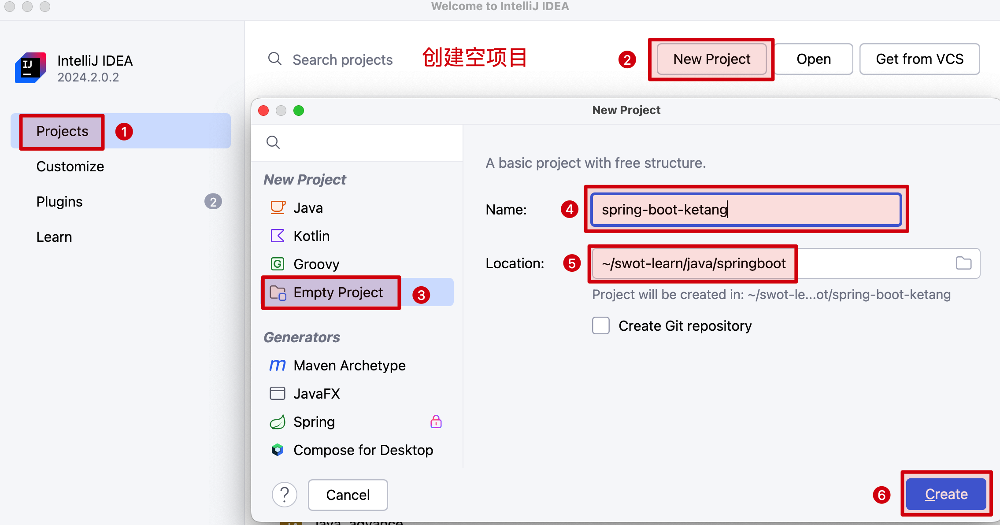
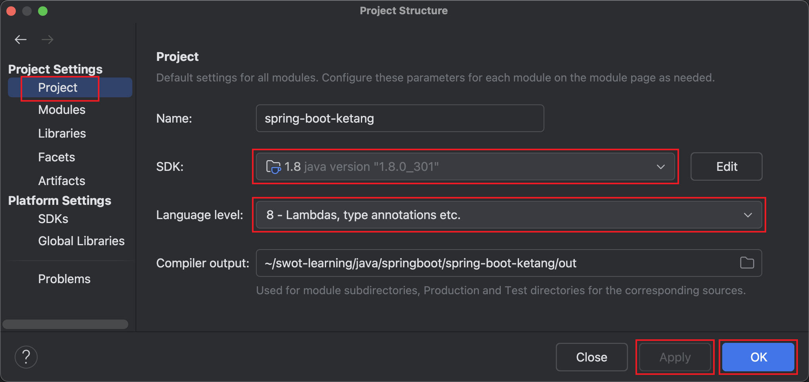
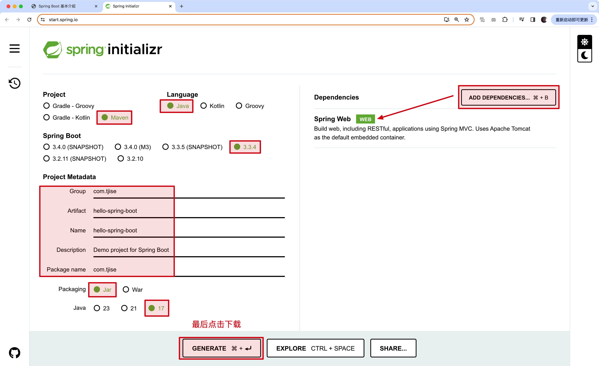
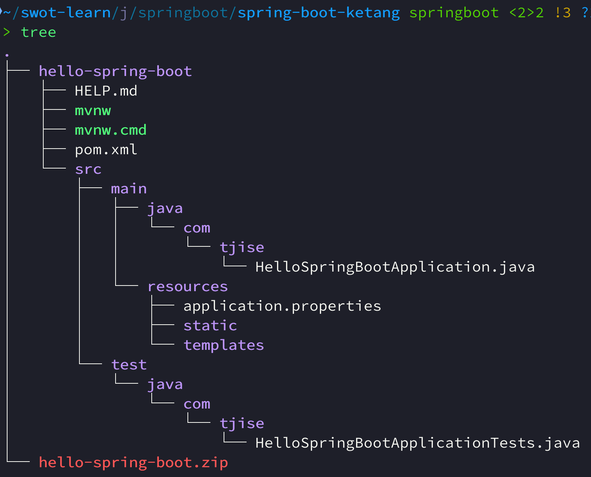

:source-highlighter: pygments
:icons: font
:scripts: cjk
:stem: latexmath
:toc:
:toc: right
:toc-title: Table of Contents
:toclevels: 3

= Spring Boot 基本介绍

++++
<button id="toggleButton">Table of Contents</button>

++++

== 官网介绍
官网介绍 https://spring.io/

项目介绍 https://spring.io/projects

Spring Boot: https://spring.io/projects/spring-boot
// 应该学习官网的例子

Spring Boot 可以帮助我们非常快速的构建应用程序、简化开发、提高效率。

如果 IDEA 是社区版本，可以使用下面的网页方式来创建 Spring Boot 项目

* 创建 Spring Boot 项目 3 版本 https://start.spring.io/
* 创建 Spring Boot 项目 2 版本 https://start.aliyun.com/

** Project: Maven
** Language: java
** SpringBoot: 2.7.18 https://github.com/spring-projects/spring-boot/releases?q=v2.7&expanded=true
** Group: com.xxx 自己命名
** 打包方式: jar
** java版本: 8
** Dependencies: mysql Driver、Spring Web、lombok（方便创建实体类）

== 安装 JDK
// New version
// https://bell-sw.com/pages/downloads/#jdk-21-lts

建议下载 jdk-8-lts:
https://bell-sw.com/pages/downloads/#jdk-8-lts

安装文档:
https://docs.bell-sw.com/liberica-jdk/8u422b6/general/install-guide/#microsoft-windows

NOTE: 上面文档是 OpenJDK 的安装方式，实际上我使用的是 Oracle JDK，捂脸ing...

验证安装:
`java -version`

.实际上我的是 Oracle JDK
....
java version "1.8.0_301"
Java(TM) SE Runtime Environment (build 1.8.0_301-b09)
Java HotSpot(TM) 64-Bit Server VM (build 25.301-b09, mixed mode)
....

== 创建一个空的工程
创建一个空的工程后，我们可以在该工程中创建或导入多个模块，这样方便不同的功能模块放在一起。

. 运行开发工具 IDEA

. New Project -> Empty Project -> (指空项目名称，如) spring-boot-ketang

. 删除 .iml 文件，因为我们会使用 maven 来管理项目(不使用 idea 来管理项目)。

. 进入 File -> Project Structure 对话框，选择 Modules，删除默认创建的模块(后面我们都是自己来创建模块，在上面删除了 .iml 文件后，默认创建的模块可能会被自动删除)。

[.thumb]

[.thumb]

== 快速入门
需求：使用 Spring Boot 开发一个 web 应用，浏览器发起请求 /hello 后，给浏览器返回字符串 "Hello World!"。

.请求地址
====
http://localhost:8080/hello
====

=== initializr 创建 Spring Boot 模块
https://start.spring.io/

举例创建名称为: hello-spring-boot

1. 填写参数
2. 选择起步依赖

[.thumb]

[WARNING]
====
1. 无法创建 2 系列版本的了
2. 只能创建 3 版本以上的项目了
3. 要求 Java 17 以上

#如果要创建 2 系列版本的项目，可以先创建 3 系列版本的项目，然后再更改 pom.xml 文件。
更改方式参后面导入模块内容#
====

.起步依赖
****
https://docs.spring.io/spring-boot/docs/2.7.18/reference/html/using.html#using.build-systems.starters

起步依赖命名规则

* 官方起步依赖: spring-boot-starter-*
* 第三方起步依赖: 第三方项目名称-spring-boot-starter
****

=== aliyun 创建 Spring Boot 模块(了解)
https://start.aliyun.com

可以创建 Spring Boot2 的项目，可以直接使用，不用再更改依赖的版本。

=== 导入自己创建的 Spring Boot 模块
1. 解压下载的 Spring Boot 代码，如 hello-spring-boot.zip，可以发现就是一个 Maven 模块的目录结构。
+

2. 使用 IDEA 导入 hello-spring-boot 模块

* 进入 File -> Project Structure 对话框，选择 Modules
* 点击 `+` 号，选择要导入的模块目录，如 hello-spring-boot
+
image::img/import_module_0.png[,400]

3. 在导入时有两个选项：

* Create module from existing sources（从现有源创建模块）用于导入没有使用构建工具如 maven 的项目
* Import module from external model（从外部模型导入模块）用于导入使用构建工具如 maven 创建的项目。因为我们是用 maven 来管理代码的，所以选择 `Import module from external model`
+
[.thumb]
image::img/import_module_1.png[,640]

4. 然后会看见 IDEA 自动安装了依赖。

5. 更改 hello-spring-boot 中的 pom.xml 文件中的 Spring Boot 和 JDK 版本号。
+
[source,xml,linenums,highlight=4;8]
----
<parent>
    <groupId>org.springframework.boot</groupId>
    <artifactId>spring-boot-starter-parent</artifactId>
    <version>2.7.18</version>
    <relativePath/> <!-- lookup parent from repository -->
</parent>
<properties>
    <java.version>1.8</java.version>
</properties>
----

=== 定义控制类并添加方法

==== #file spring-boot-ketang/hello-spring-boot/src/main/java/com/tjise/HelloController.java
.服务端路由 /hello，返回字符串 "Hello World!"
[source,java,linenums]
----
package com.tjise;

import org.springframework.web.bind.annotation.RequestMapping;
import org.springframework.web.bind.annotation.RestController;

@RestController
public class HelloController {

    @RequestMapping("/hello")
    public String hello(){
        System.out.println("Hello World");
        return "Hello World";
    }
}
----

=== 运行测试
找到引导类: src/main/java/<group>/HelloWorldApplication.java

右键选择运行该引导类

在浏览器中输入地址进行测试: http://localhost:8080/hello

可以看见页面中显示 "Hello World!" 字样。

== HTTP协议

=== HTTP 概述
HTTP 协议：超文本传输协议 Hyper Text Transfer Protocol，规定了浏览器和服务器之间数据传输的规则。

HTTP 协议特点：

1. 基于 TCP 协议: 面向连接，安全。
2. 基于请求--响应模型: 一次请求对应一次响应
3. HTTP 协议是无状态协议: 对于事务处理没有记忆能力。每次请求--响应都是独立的。理解：下一次请求不会携带上一次数据。
  * 缺点：多次请求间不能共享数据。
  * 优点：速度快。

TCP/IP 四层模型:

* 网络接口层 - 管理硬件和本地网络之间的数据通信。
* 网络层 - 处理数据包的路由与传输。
* 传输层 - 提供端到端的可靠或不可靠数据传输。
* 应用层 - 为用户提供网络服务和应用接口。

三者关系:

* IP   协议 在网络层负责将数据从源设备传送到目标设备。
* TCP  协议 在传输层基于IP协议，确保数据传输的可靠性和完整性。
* HTTP 协议 在应用层，使用TCP协议传输HTTP请求和响应，从而实现网页内容的传输。

=== HTTP 请求协议 GET
您可以在浏览器中打开一个网址，查看 GET 发送的内容。

.GET 请求数据格式
====
.请求行
....
GET /hello HTTP/1.1
....

.请求头 (与请求行之间无空行)
....
Host: localhost:8080
User-Agent: Mozilla/5.0 (Macintosh; Intel Mac OS X 10.15; rv:131.0) Gecko/20100101 Firefox/131.0
Accept: text/html,application/xhtml+xml,application/xml;q=0.9,image/avif,image/webp,image/png,image/svg+xml,*/*;q=0.8
Accept-Language: zh-CN,zh;q=0.8,zh-TW;q=0.7,zh-HK;q=0.5,en-US;q=0.3,en;q=0.2
Accept-Encoding: gzip, deflate, br, zstd
Connection: keep-alive
Cookie: _ga_E3C3GCQVBN=GS1.1.1727626100.1.1.1727626112.0.0.0; _ga=GA1.1.1602099806.1727626101
Upgrade-Insecure-Requests: 1
Sec-Fetch-Dest: document
Sec-Fetch-Mode: navigate
Sec-Fetch-Site: none
Sec-Fetch-User: ?1
Priority: u=0, i
....
====

NOTE: GET 请求一般在规范中无请求体，实际上也可以带请求体，只要服务端 api 能处理就行。

=== HTTP 请求协议 POST
Firefox 浏览器开发者模式支持发 POST 请求，您可以在 Firefox 浏览器中打开一个网址，查看 POST 发送的内容。

.POST 请求数据格式
====
.请求行
....
POST /hello HTTP/1.1
....

.请求头 (与请求行之间无空行)
....
Host: localhost:8080
User-Agent: Mozilla/5.0 (Macintosh; Intel Mac OS X 10.15; rv:131.0) Gecko/20100101 Firefox/131.0
Accept: text/html,application/xhtml+xml,application/xml;q=0.9,image/avif,image/webp,image/png,image/svg+xml,*/*;q=0.8
Accept-Language: zh-CN,zh;q=0.8,zh-TW;q=0.7,zh-HK;q=0.5,en-US;q=0.3,en;q=0.2
Accept-Encoding: gzip, deflate, br, zstd
Connection: keep-alive
Cookie: _ga_E3C3GCQVBN=GS1.1.1727626100.1.1.1727626112.0.0.0; _ga=GA1.1.1602099806.1727626101
Upgrade-Insecure-Requests: 1
Sec-Fetch-Dest: empty
Sec-Fetch-Mode: no-cors
Sec-Fetch-Site: same-origin
Sec-Fetch-User: ?1
Content-Length: 16
Origin: http://localhost:8080
Priority: u=0, i
Pragma: no-cache
Cache-Control: no-cache
....

.请求体 (与请求头之间有一个空行)，此例发送的是 JSON 数据
....
{"name": "Swot"}
....
====

.firefox 发送 post 请求
[.thumb]
image::img/firefox_post.png[]

=== HTTP 响应协议
.响应行
....
HTTP/1.1 200
....

.响应头 (与响应行之间无空行)
....
Content-Type: text/html;charset=UTF-8
Content-Length: 11
Date: Wed, 02 Oct 2024 07:17:33 GMT
Keep-Alive: timeout=60
Connection: keep-alive
....

.响应体 (与响应头之间有一个空行)
....
Hello World
....

=== HTTP 响应状态码
参考网址:
https://developer.mozilla.org/zh-CN/docs/Web/HTTP/Status

常见响应码:

* 200: 响应成功
* 301/302: 重定向，比如访问 http://www.baidu.com 会被服务器重定向到 https://www.baidu.com，firefox 调试 302 时需要清除缓存并重启浏览器。
* 404: 找不到 url 资源，客户端请求了不存在的资源地址
* 500: 服务器错误

=== HTTP 协议解析
对请求行、请求头、请求体进行解析。
主要是为了了解解析原理的，自己不会写 web 服务器的代码。我们直接使用 Tomcat 服务器。

使用下面的例子对原理进行了解。

==== 自定义 Socket 服务器解析 HTTP 请求
1. File -> Project Structure 对话框，选择 Modules

2. 点击 + 号，选择 New Module

3. 选择 Java，再填写必要的信息后创建模块，如 simple-http-server

NOTE: 该例子会将请求中的「请求行」、「请求头」、「请求体」都打印出来。

===== #file spring-boot-ketang/simple-http-server/src/main/java/SimpleHttpServer.java
[source,java,linenums]
----
import java.io.*;
import java.net.ServerSocket;
import java.net.Socket;
import java.util.HashMap;
import java.util.Map;

public class SimpleHttpServer {

    public static void main(String[] args) {
        try (ServerSocket serverSocket = new ServerSocket(8081)) {
            System.out.println("Server started on port 8081...");

            while (true) {
                // serverSocket.accept() 阻塞等待新的客户端连接，一旦有客户端连接，它返回一个 Socket 对象，表示与该客户端之间的通信。
                try (Socket clientSocket = serverSocket.accept()) {
                    handleClient(clientSocket);
                } catch (IOException e) {
                    e.printStackTrace();
                }
            }
        } catch (IOException e) {
            e.printStackTrace();
        }
    }

    private static void handleClient(Socket clientSocket) throws IOException {
        // 获取输入流读取请求数据
        InputStream input = clientSocket.getInputStream();
        BufferedReader reader = new BufferedReader(new InputStreamReader(input));

        // 解析请求行
        String requestLine = reader.readLine();
        System.out.println("Request Line: " + requestLine);

        // 解析请求头
        Map<String, String> headers = new HashMap<>();
        String headerLine;
        while (!(headerLine = reader.readLine()).isEmpty()) {
            String[] header = headerLine.split(": ");
            headers.put(header[0], header[1]);
        }

        System.out.println("\nRequest Headers:");
        for (Map.Entry<String, String> entry : headers.entrySet()) {
            System.out.println(entry.getKey() + ": " + entry.getValue());
        }

        // 读取请求体 (仅处理 POST 请求)
        if (requestLine.startsWith("POST")) {
            int contentLength = Integer.parseInt(headers.getOrDefault("Content-Length", "0"));
            char[] body = new char[contentLength];
            reader.read(body, 0, contentLength);
            System.out.println("\nRequest Body: ");
            System.out.println(new String(body));
        }

        // 发送响应
        OutputStream output = clientSocket.getOutputStream();
        PrintWriter writer = new PrintWriter(output, true);
        writer.println("HTTP/1.1 200 OK");
        writer.println("Content-Type: text/plain");
        // 正确设置 Content-Length
        String responseBody = "Hello from SimpleHttpServer";
        writer.println("Content-Length: " + responseBody.length());
        writer.println();
        writer.println("Hello from SimpleHttpServer");
    }
}
----

== Tomcat(Web Server) 了解
Web 服务器::
* Web 服务器是一个应用程序（软件），对 HTTP 协议的操作进行封装，使得程序员不必直接对协议进行操作，让 Web 开发更加便捷。
* 主要功能是对请求数据解析，响应数据封装。

Tomcat::
* https://tomcat.apache.org
* Tomcat 是 Apache 软件基金会一个核心项目，是一个开源免费的轻量级 Web 服务器，支持 Servlet/JSP 少量 JavaEE 规范。
* Tomcat 也被称为 Web 容器、Servlet 容器。JavaWeb 的 .war 包需要放在 Tomcat 下才能运行。

.Spring Boot 已经内置了 Tomcat 服务器
[IMPORTANT]
====
* 开发时直接在 IDEA 中运行启动类即可
* 部署时直接运行 java -j xxx.jar 包即可
====

JavaEE::
* Java Enterprise Edition, Java 企业版。指 Java 企业级开发的技术规范总和。
* 包含 13 项技术规范 JDBC, JNDI, EJB, RMI, JSP, Servlet, XML, JMS, Java IDL, JTS, JTA, JavaMail, JAF。

.新技术老规范(了解)
****
有些规范已经老了，有新的基于这些规范的技术出现了。比如

关于Java Enterprise Edition（Java企业版）所包含的13项技术规范，虽然它们是Java企业级开发的基础，但随着时间的推移，确实有一些新的技术基于这些规范发展起来。以下是对这些新技术或相关发展的一些概述：

1. **JDBC（Java Database Connectivity）**：
   - **新技术**：虽然JDBC本身是一个老规范，但基于JDBC的持久层框架如MyBatis和Hibernate等，为Java开发者提供了更高级别的数据库访问抽象，简化了数据库操作并提高了开发效率。
2. **JNDI（Java Naming and Directory Interface）**：
   - **新技术**：随着云计算和微服务架构的兴起，JNDI的使用逐渐减少，因为它更多地与传统的企业级应用服务器（如Tomcat、JBoss等）紧密相关。然而，在微服务架构中，服务发现和配置管理通常通过更现代的工具（如Spring Cloud Config、Consul等）来实现。
3. **EJB（Enterprise JavaBeans）**：
   - **新技术**：EJB曾经是企业级Java应用中的核心组件，但随着Spring框架的兴起，EJB的使用逐渐减少。Spring提供了更轻量级、更灵活的依赖注入和面向切面编程支持，逐渐取代了EJB在Java企业级开发中的地位。
4. **RMI（Remote Method Invocation）**：
   - **新技术**：RMI虽然提供了远程方法调用的能力，但在现代分布式系统中，更常用的技术是RESTful Web服务和基于消息的通信（如使用JMS或Kafka等）。这些技术提供了更灵活、更松散的耦合方式，使得服务之间的交互更加简单和高效。
5. **JSP（JavaServer Pages）和Servlet**：
   - **新技术**：虽然JSP和Servlet仍然是Java Web开发的基础，但随着前端技术的不断发展（如React、Vue等），越来越多的Java Web应用开始采用前后端分离的架构。在这种架构中，JSP和Servlet更多地用于处理后端逻辑和API接口，而前端则使用更现代的框架和库来构建用户界面。
6. **XML（Extensible Markup Language）**：
   - **新技术**：XML虽然仍然是一种重要的数据交换格式，但在现代Web开发中，JSON（JavaScript Object Notation）由于其轻量级和易于解析的特性，逐渐取代了XML的地位。许多现代的Web API和微服务都使用JSON作为数据交换格式。
7. **JMS（Java Message Service）**：
   - **新技术**：JMS提供了基于消息的异步通信机制，但在现代分布式系统中，更常用的消息队列技术包括Kafka、RabbitMQ等。这些技术提供了更高级别的消息处理能力（如持久化、分区、复制等），使得消息传递更加可靠和高效。
8. **Java IDL/CORBA**：
   - **新技术**：随着Web服务和RESTful API的兴起，Java IDL/CORBA的使用逐渐减少。现代分布式系统更倾向于使用轻量级的通信协议（如HTTP/HTTPS）和基于JSON/XML的数据格式来实现服务之间的交互。
9. **JTA（Java Transaction API）和JTS（Java Transaction Service）**：
   - **新技术**：虽然JTA和JTS仍然提供了分布式事务处理的能力，但在现代微服务架构中，事务的边界通常更加清晰和有限。此外，随着数据库技术的发展（如NoSQL数据库的兴起），一些应用开始采用最终一致性而不是强一致性来保证数据的完整性。
10. **JavaMail**：
    - **新技术**：虽然JavaMail仍然是一个用于发送和接收电子邮件的API，但随着云计算和SaaS服务的兴起，越来越多的应用开始使用第三方邮件服务（如SendGrid、Mailgun等）来发送电子邮件。这些服务提供了更可靠、更灵活的邮件发送能力，并且支持多种邮件格式和跟踪功能。
11. **JAF（JavaBeans Activation Framework）**：
    - **新技术**：JAF虽然仍然是一个用于处理MIME类型和数据源的框架，但在现代Web开发中，其使用逐渐减少。许多现代的Web应用都使用更高级别的库和框架来处理文件上传和下载等功能。

需要注意的是，虽然上述技术可能被视为基于Java EE老规范的新发展，但它们并不是完全取代老规范，而是在不同的场景和需求下提供了更灵活、更高效的解决方案。此外，随着技术的不断发展，未来还可能会有更多的新技术出现来进一步丰富和拓展Java企业级开发的生态系统。
****

=== Tomcat 安装使用
Download: https://tomcat.apache.org/download-90.cgi

[NOTE]
====
Tomcat 9 need JDK8，我们使用了 JDK8，所以下载 Tomcat9。

Tomcat 10 need JDK11
====

INSTALL:: 绿色版，直接解压即可

UNINSTALL::  直接删除目录即可

START::
* 双击 bin\startup.bat 或 bin/startup.sh

STOP::
* 强制关闭: 直接 x 掉运行容器
* 正常关闭: bin\shutdown.bat 或 bin/shutdown.sh
* 正常关闭: ctrl+c

PORT::
* 修改 conf/server.xml
+
[source,xml,]
----
<Connector port="8080" protocol="HTTP/1.1"
           connectionTimeout="20000"
           redirectPort="8443"
           maxParameterCount="1000"
           />
----
+
* HTTP 协议默认端口号为 80，如果将 Tomcat 端口号改为 80，则将来访问 Tomcat 时，将不用输入端口号。
* 系统进程有可能占用 80 端口，所以还是自己指定一个唯一的端口比较好，以实际需求为准。

=== Tomcat 启动时可能出现问题
1. 端口号冲突：找到对应程序，将其关闭掉。或者更改 Tomcat 的端口号。
+
....
Caused by: java.net.BindException: Address already in use: bind
....

2. Windows 下启动窗口一闪而过：检查 `JAVA_HOME` 环境变量是否配置正确
* 可以在控制台下执行启动 Tomcat 的命令 statup.bat，查看到报错原因。

3. Windows 控制台中文乱码：修改 conf/logging.properties
+
`java.util.logging.ConsoleHandler.encoding =` [red]`UTF-8 -> GBK`

* 因为 Windows 控制台默认是 GBK 编码

