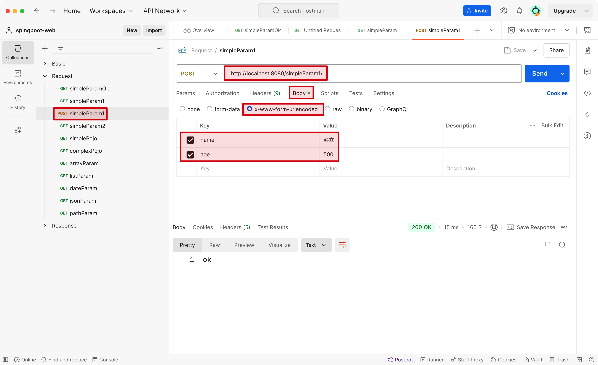

:source-highlighter: pygments
:icons: font
:scripts: cjk
:toc: right
:toc-title: 目录
:toclevels: 3

= Spring Boot 请求数据

++++
<button id="toggleButton">Table of Contents</button>
<script>
    // 获取按钮和 div 元素
    const toggleButton = document.getElementById('toggleButton');
    const contentDiv = document.getElementById('toc');
    contentDiv.style.display = 'block';

    // 添加点击事件监听器
    toggleButton.addEventListener('click', () => {
        // 切换 div 的显示状态
        // if (contentDiv.style.display === 'none' || contentDiv.style.display === '') {
        if (contentDiv.style.display === 'none') {
            contentDiv.style.display = 'block';
        } else {
            contentDiv.style.display = 'none';
        }
    });
</script>
++++

== HTTP 请求调试工具


=== Postman 国外
由美国 Postman, Inc. 公司开发的老牌工具
https://www.postman.com/

1. 注册帐号

2. Create Workspace

3. Create Collection

4. Create Request (创建您自己的请求)

=== Apifox  国产
https://apifox.com/

=== Apipost 国产
https://www.apipost.cn/

=== httpie  命令行工具
**HTTPie**（读作 _aitch-tee-tee-pie_）是一个现代、用户友好的命令行 HTTP 客户端。其目标是让与 Web 服务的交互尽可能简单直观，使 API 测试和调试变得轻而易举。

**设计哲学**：简洁、直观的语法，支持 JSON 等格式高亮显示。

==== 安装
[source,bash]
----
# 在 macOS 上使用 Homebrew 安装
brew install httpie

# 在 Ubuntu/Debian 上使用 apt 安装
sudo apt install httpie

# 使用 Python 的 pip 包管理器安装 (通用)
pip install --upgrade httpie
----

**验证安装**：
[source,bash]
----
http --version
----

.基本语法结构
[source,bash]
----
http [选项] <请求方法> URL [请求项...]
----

==== 发送 GET 请求
获取资源信息（默认为 GET 方法，可省略）。

[source,bash]
----
# 获取所有帖子
http GET https://jsonplaceholder.typicode.com/posts

# 简写形式 (GET 可省略)
http https://jsonplaceholder.typicode.com/posts

# 获取特定帖子 (ID 为 1)
http https://jsonplaceholder.typicode.com/posts/1
----

==== 发送 POST 请求
创建新资源。

[source,bash]
----
# 创建一篇新帖子 (自动设置 Content-Type: application/json)
http POST https://jsonplaceholder.typicode.com/posts \
  userId:=1 \
  title="Hello HTTPie" \
  body="This is the body of my post."

# 使用原始 JSON 字符串
http POST https://jsonplaceholder.typicode.com/posts \
  data='{"userId": 1, "title": "Foo", "body": "Bar"}'

# 从文件读取 JSON 数据
http POST https://jsonplaceholder.typicode.com/posts < data.json
----

[NOTE]
====
**语法说明**：
* `field=value`：字符串值（默认）
* `field:=value`：非字符串值（数字、布尔值、数组、对象）
====

==== 发送 PUT 和 PATCH 请求
更新资源（PUT 通常替换整个资源，PATCH 部分更新）。

[source,bash]
----
# 使用 PUT 完全更新帖子 (ID 为 1)
http PUT https://jsonplaceholder.typicode.com/posts/1 \
  userId:=1 \
  title="Updated Title" \
  body="Updated body content."

# 使用 PATCH 部分更新帖子标题
http PATCH https://jsonplaceholder.typicode.com/posts/1 \
  title="Partially Updated Title"
----

==== 发送 DELETE 请求
删除资源。

[source,bash]
----
http DELETE https://jsonplaceholder.typicode.com/posts/1
----

==== 添加 HTTP 头
使用 `Header:Value` 的格式。

[source,bash]
----
# 添加自定义请求头
http GET https://api.example.com/endpoint \
  Authorization:"Bearer YOUR_TOKEN" \
  X-Custom-Header:"MyValue"
----

==== 表单提交
使用 `--form` 或 `-f` 选项发送 `application/x-www-form-urlencoded` 数据。

[source,bash]
----
http --form POST https://httpbin.org/post \
  username="johndoe" \
  password="secret"
----

==== 文件上传
使用 `@` 符号。

[source,bash]
----
# 上传单个文件
http POST https://httpbin.org/post \
  file@/path/to/file.jpg

# 上传多个文件及其他字段
http -f POST https://httpbin.org/post \
  name="John" \
  avatar@/path/to/avatar.jpg \
  document@/path/to/report.pdf
----

==== 查询参数
直接在 URL 后使用 `==` 添加查询字符串。

[source,bash]
----
# 添加查询参数 ?q=httpie&sort=desc
http GET https://httpbin.org/get \
  q=="httpie" \
  sort=="desc"
----

==== 输出处理
控制响应的显示内容。

[source,bash]
----
# 只打印响应头
http --headers GET https://httpbin.org/json

# 只打印响应体 (默认行为)
http --body GET https://httpbin.org/json

# 将输出保存到文件
http GET https://httpbin.org/json > output.json

# 忽略 SSL 证书验证 (仅用于测试环境!)
http --verify=no GET https://self-signed.badssl.com/
----

==== 会话与认证
使用会话保持状态（如 Cookie）。

[source,bash]
----
# 登录并保存会话到文件 `session.json`
http --session=./session.json POST https://example.com/login \
  username="admin" \
  password="password"

# 使用已保存的会话发送请求
http --session=./session.json GET https://example.com/dashboard
----

==== 综合示例：测试 JSONPlaceholder API

[source,bash]
----
# 1. 获取所有用户
http GET https://jsonplaceholder.typicode.com/users

# 2. 为用户 (ID 1) 创建一篇新帖子
http POST https://jsonplaceholder.typicode.com/posts \
  userId:=1 \
  title="My New Post" \
  body="This post was created using HTTPie. It's awesome!"

# 3. 更新刚创建的帖子 (假设 ID 为 101)
http PATCH https://jsonplaceholder.typicode.com/posts/101 \
  title="Updated Title via HTTPie"

# 4. 删除该帖子
http DELETE https://jsonplaceholder.typicode.com/posts/101
----

==== 总结
HTTPie 通过直观的语法、漂亮的输出和强大的功能，极大地简化了在命令行中与 HTTP API 的交互，是开发者必备的工具之一。
```

您可以将此内容保存为 `.adoc` 文件，然后使用 Asciidoctor 进行编译：

```bash
asciidoctor httpie-guide.adoc
```

这将生成一个格式美观的 HTML 文档，非常适合作为课件使用。

== 新创建请求响应模块
具体操作参考前面的快速入门内容。

1. 可以在 https://start.spring.io/ 创建新的模块，也可以复制之前已经创建的模块目录。#最好新创建，复制后需要更改不少设置。#
* 模块名为 spring-boot-request-response

2. 更改 pom.xml 文件中的 Spring Boot 和 JDK 版本号（如果不是自己想要的版本号的话）。

3. 导入模块到项目中
* 进入 File -> Project Structure 对话框，选择 Modules
* 点击 `+` 号，选择要导入的模块目录，如 spring-boot-request-response

== request  请求数据


=== @file spring-boot-ketang/spring-boot-request-response/src/main/java/com/tjise/controller/RequestController.java
[source,java,linenums]
----
package com.tjise.controller;

// import 都是下面例子用到的时候逐个导入的
import com.tjise.pojo.User;
import org.springframework.format.annotation.DateTimeFormat;
import org.springframework.web.bind.annotation.*;

import javax.servlet.http.HttpServletRequest;
import javax.servlet.http.HttpServletResponse;
import java.time.LocalDateTime;
import java.util.Arrays;
import java.util.List;

@RestController
public class RequestController {
    // @others 伪代码表示此处还会有很多具体的代码
    @others
}
----

==== 简单请求参数原始方式演示(了解以后不用)
[source,java,linenums]
----
@RequestMapping("/simpleParamOld")
public String simpleParamOld(HttpServletRequest request,
                             HttpServletResponse response)
{
    String name = request.getParameter("name");
    String age  = request.getParameter("age");
    System.out.println(name + " : " + age);
    return "ok";
}
----

使用 httpie 测试：

http "http://localhost:8080/simpleParamOld?name=Swot&age=19"

NOTE:  只能获取 url 携带的参数。

==== 简单请求参数: 前端提交与方法形参一致
[source,java,linenums]
----
@RequestMapping("/simpleParam1")
public String simpleParam1(String name, Integer age) {
    System.out.println(name + " : " + age);
    return "ok";
}
----

注意事项:

. 前端请求参数名与形参变量名相同，定义形参即可接收数据
    * 如前端请求 http://localhost:8080/simpleParam1/?name=王林&age=400
    * url 中的 name 对应形参 String name，age  对应形参 Integer age

. 参数类型可以自动类型转换，基本类型需要使用包装类类型接收
    * age 网上传过来的是 String，现在已经是 Integer 类型了
    * Integer 是包装类类型

. 如果前端请求参数名与方法形参名称不一致，可以使用 @RequestParam 完成映射
    * 参下面 @RequestParam 例子

此方法可获取 get 方法 url 携带的参数（如上面的 url）或者 post 方法 body 使用 x-www-form-urlencoded 形式携带的参数。

body 中发送 http://localhost:8080/simpleParam1 选择 x-www-form-urlencoded 类型的数据如下图所示



.使用 httpie 测试
[source,console]
----
http --form POST localhost:8080/simpleParam1 \
  name="王林" \
  age="400"
----

==== @RequestParam 简单请求参数不一致
[source,java,linenums]
----
@RequestMapping("/simpleParam2")
public String simpleParam2(@RequestParam("username") String name,
                           Integer age) {
    System.out.println(name + " : " + age);
    return "ok";
}
----

如果前端请求参数名与方法形参名称不一致，可以使用 @RequestParam 完成映射

    * 如前端请求 http://localhost:8080/simpleParam2/?username=韩立&age=2000
    * username 的内容会被 name 接收到

.使用 httpie 测试
[source,console]
----
http "http://localhost:8080/simpleParam2/?username=韩立&age=2000"
----

==== 简单实体对象参数
1. 创建包 pojo，User 实体类放在包 pojo 中，参 pojo/User.java
    * POJO: 在 Java 中，POJO 是 Plain Old Java Object 的缩写，意为简单的 Java 对象。它指的是一个普通的没有任何特殊要求或依赖的 Java 类，通常用来作为实体类来封装数据。POJO 类并不继承特定的父类，也不需要实现特定的接口，因此保持了很大的自由度和简单性。

2. 前端传入参数名与 User 属性名相同
    * 访问 url: http://localhost:8080/simplePojo/?name=韩立&age=2000
    * 服务器打印数据: `User{name='韩立', age=2000}`

[source,java,linenums]
----
@RequestMapping("/simplePojo")
public String simplePojo(User user) {
    System.out.println(user);
    return "ok";
}
----

==== 复杂实体对象参数
. 请求参数名与形参对象属性名相同，按照对象层次结构关系即可接收嵌套 POJO 属性参数。
    * popo/Uesr.java 包含三个属性 user, name, address （address 对应 Address.java）
    * popo/Address.java 包含两个属性 province, city

. 前端传入参数名与 User 属性名相同
    * 访问 url: http://localhost:8080/complexPojo/?name=韩立&age=2000&address.province=河北&address.city=张家口
    * 服务器打印数据: `User{name='韩立', age=2000, address=Address{province='河北', city='张家口'}}`

[source,java,linenums]
----
@RequestMapping("/complexPojo")
public String complexPojo(User user) {
    System.out.println(user);
    return "ok";
}
----

=== 创建包 pojo 再创建下面实体类
这是上面案例演示需要的实体类代码。

==== #file spring-boot-ketang/spring-boot-request-response/src/main/java/com/tjise/pojo/User.java
只包含两个属性 name & age，为了演示简单实体对象参数的获取。

[source,java,linenums]
----
package com.tjise.pojo;

public class User {
    private String name;
    private int age;

    public User() {
    }

    public User(String name, int age) {
        this.name = name;
        this.age = age;
    }

    public String getName() {
        return name;
    }

    public void setName(String name) {
        this.name = name;
    }

    public int getAge() {
        return age;
    }

    public void setAge(int age) {
        this.age = age;
    }

    @Override
    public String toString() {
        return "User{" +
                "name='" + name + '\'' +
                ", age=" + age +
                '}';
    }
}
----

==== #file spring-boot-ketang/spring-boot-request-response/src/main/java/com/tjise/pojo/User.java
改造成包含三个属性 name & age & address，为了演示复杂实体对象参数的获取。

[source,java,linenums]
----
package com.tjise.pojo;

public class User {
    private String name;
    private int age;
    private Address address;

    public User() {
    }

    public User(String name, int age, Address address) {
        this.name = name;
        this.age = age;
        this.address = address;
    }

    public String getName() {
        return name;
    }

    public int getAge() {
        return age;
    }

    public Address getAddress() {
        return address;
    }

    public void setName(String name) {
        this.name = name;
    }

    public void setAge(int age) {
        this.age = age;
    }

    public void setAddress(Address address) {
        this.address = address;
    }

    @Override
    public String toString() {
        return "User{" +
                "name='" + name + '\'' +
                ", age=" + age +
                ", address=" + address +
                '}';
    }
}
----

==== #file spring-boot-ketang/spring-boot-request-response/src/main/java/com/tjise/pojo/Address.java
.会被 User.java 使用
[source,java,linenums]
----
package com.tjise.pojo;

public class Address {
    private String province;
    private String city;

    public Address() {
    }

    public Address(String city, String province) {
        this.city = city;
        this.province = province;
    }

    public String getProvince() {
        return province;
    }

    public void setProvince(String province) {
        this.province = province;
    }

    public String getCity() {
        return city;
    }

    public void setCity(String city) {
        this.city = city;
    }

    @Override
    public String toString() {
        return "Address{" +
                "province='" + province + '\'' +
                ", city='" + city + '\'' +
                '}';
    }
}
----

