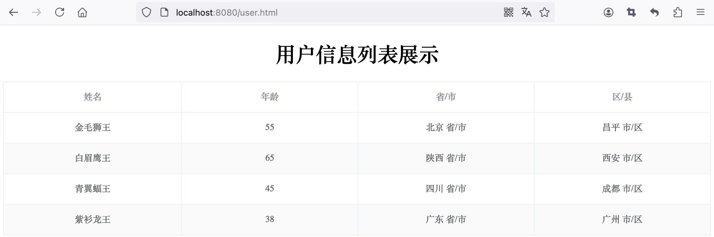

:source-highlighter: pygments
:icons: font
:scripts: cjk
:toc:
:toc: right
:toc-title: 目录
:toclevels: 3

= XML数据打通前后端案例

++++
<button id="toggleButton">Table of Contents</button>
<script>
    // 获取按钮和 div 元素
    const toggleButton = document.getElementById('toggleButton');
    const contentDiv = document.getElementById('toc');
    contentDiv.style.display = 'block';

    // 添加点击事件监听器
    toggleButton.addEventListener('click', () => {
        // 切换 div 的显示状态
        // if (contentDiv.style.display === 'none' || contentDiv.style.display === '') {
        if (contentDiv.style.display === 'none') {
            contentDiv.style.display = 'block';
        } else {
            contentDiv.style.display = 'none';
        }
    });
</script>
++++


CAUTION: [red]#要使用前面的工程来实现本例。#

目标：获取 `user.xml` 文件中的用户数据，返回统一响应结果，在页面渲染展示。

== 1) user.xml 数据文件


=== #file spring-boot-ketang/spring-boot-request-response/src/main/resources/user.xml
.user 数据文件
```xml
<users>
    <user>
        <name>金毛狮王</name>
        <age>55</age>
        <address>
            <province>北京</province>
            <city>昌平</city>
        </address>
    </user>
    <user>
        <name>白眉鹰王</name>
        <age>65</age>
        <address>
            <province>陕西</province>
            <city>西安</city>
        </address>
    </user>
    <user>
        <name>青翼蝠王</name>
        <age>45</age>
        <address>
            <province>四川</province>
            <city>成都</city>
        </address>
    </user>
    <user>
        <name>紫衫龙王</name>
        <age>38</age>
        <address>
            <province>广东</province>
            <city>广州</city>
        </address>
    </user>
</users>
```

== 2) pom.xml 增加依赖 dom4j
[source,xml]
----
<dependency>
    <groupId>dom4j</groupId>
    <artifactId>dom4j</artifactId>
    <version>1.6.1</version>
</dependency>
----

== 3) 工具类 utils/XmlParserUtils.java
先在 IDEA 中创建包 utils，然后再生成工具类文件。

=== #file spring-boot-ketang/spring-boot-request-response/src/main/java/com/tjise/utils/XmlParserUtils.java
[source,java,linenums]
----
package com.tjise.utils;

import com.tjise.pojo.Address;
import com.tjise.pojo.User;
import org.dom4j.Document;
import org.dom4j.DocumentException;
import org.dom4j.Element;
import org.dom4j.io.SAXReader;
import java.io.File;
import java.util.ArrayList;
import java.util.List;

public class XmlParserUtils {
    public static List<User> parse(String file)  {
        ArrayList<User> list = new ArrayList<>(); //封装解析出来的数据

        try {
            //1.获取一个解析器对象
            SAXReader saxReader = new SAXReader();
            //2.利用解析器把xml文件加载到内存中,并返回一个文档对象
            Document document = saxReader.read(new File(file));
            //3.获取到根标签
            Element rootElement = document.getRootElement();
            //4.通过根标签来获取 user 标签
            List<Element> userElements = rootElement.elements("user");

            //5.遍历集合,得到每一个 user 标签
            for (Element element : userElements) {
                //获取 name 属性
                String name = element.element("name").getText();

                //获取 age 标签
                String age = element.element("age").getText();

                //获取 address 标签
                Element address = element.element("address");
                String province = address.element("province").getText();
                String city = address.element("city").getText();

                //组装数据
                User user = new User();
                user.setName(name);
                user.setAge(Integer.parseInt(age));

                Address addr = new Address();
                addr.setProvince(province);
                addr.setCity(city);
                user.setAddress(addr);

                list.add(user);
            }
        } catch (Exception e) {
            e.printStackTrace();
        }
        return list;
    }
}
----

== 4) 写api功能方法
创建控制器 UserController，代码完成后可以使用 postman 工具或者浏览器测试该 api。

=== #file spring-boot-ketang/spring-boot-request-response/src/main/java/com/tjise/controller/UserController.java
[source,java,linenums]
----
package com.tjise.controller;

import com.tjise.pojo.Address;
import com.tjise.pojo.Result;
import com.tjise.pojo.User;
import com.tjise.utils.XmlParserUtils;
import org.springframework.web.bind.annotation.RequestMapping;
import org.springframework.web.bind.annotation.RestController;

import java.util.List;

@RestController
public class UserController {

    @RequestMapping("/listUser")
    public Result listUser() {
        // 1 获取数据（解析 xml 文件，把数据封装到对象中）
        // 动态获取 user.xml 文件绝对路径
        String path = UserController.class.getClassLoader()
                      .getResource("user.xml").getPath();
        System.out.println("path = " + path);
        List<User> list = XmlParserUtils.parse(path);

        // 2 业务逻辑操作（把获取的 province 和 city 的值进行处理）
        for (User user : list) {
            Address address = user.getAddress();
            address.setProvince(address.getProvince() + " 省/市");
            address.setCity(address.getCity() + " 市/区");
        }

        // 3 把封装的数据响应给客户端
        return Result.success(list);
    }
}
----

== 5) user.html 放入资源目录


=== #file spring-boot-ketang/spring-boot-request-response/src/main/resources/static/user.html
[source,html,linenums]
----
<html lang="en">
<head>
    <meta charset="UTF-8">
    <meta http-equiv="X-UA-Compatible" content="IE=edge">
    <meta name="viewport" content="width=device-width, initial-scale=1.0">
    <title>用户信息</title>
</head>

<!--<script src="./js/vue.js"></script>-->
<!--<script src="./js/axios-0.18.0.js"></script>-->

<!-- Vue.js 2.6.10 CDN -->
<script src="https://cdn.jsdelivr.net/npm/vue@2.6.10/dist/vue.min.js"></script>

<!-- Axios 0.18.0 CDN -->
<script src="https://cdn.jsdelivr.net/npm/axios@0.18.0/dist/axios.min.js"></script>

<!-- element-ui 引入样式 -->
<link rel="stylesheet" href="https://unpkg.com/element-ui/lib/theme-chalk/index.css">
<!-- element-ui 引入组件库 -->
<script src="https://unpkg.com/element-ui/lib/index.js"></script>

<body>
  <h1 align="center">用户信息列表展示</h1>
  <div id="app">
    <!-- {{ tableData }}-->
    <el-table :data="tableData" style="width: 100%"  stripe border >
      <el-table-column prop="name" label="姓名" align="center" min-width="25%">
      </el-table-column>
      <el-table-column prop="age" label="年龄" align="center" min-width="25%">
      </el-table-column>
      <el-table-column prop="address.province" label="省/市" align="center" min-width="25%">
      </el-table-column>
      <el-table-column prop="address.city" label="区/县" align="center" min-width="25%">
      </el-table-column>
    </el-table>
  </div>
</body>

<style>
    .el-table .warning-row {
        background: oldlace;
    }
    .el-table .success-row {
        background: #f0f9eb;
    }
</style>

<script>
    new Vue({
        el: "#app",
        data() {
            return {
                tableData: []
            }
        },
        mounted(){
            axios.get('/listUser').then(res=>{
                if(res.data.code){
                    this.tableData = res.data.data;
                }
            });
        },
        methods: {}
    });
</script>
</html>
----

== 6) 运行项目并测试网页
[.thumb]


