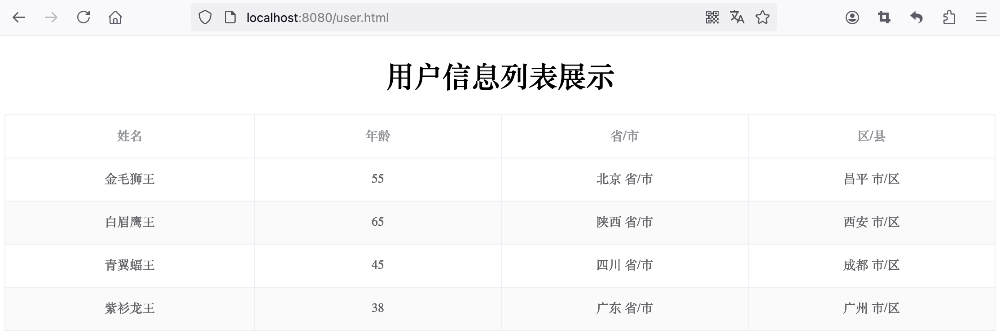

:source-highlighter: pygments
:icons: font
:scripts: cjk
:toc:
:toc: right
:toc-title: 目录
:toclevels: 4

= 三层架构改造

++++
<button id="toggleButton">目录</button>

++++

== @path spring-boot-ketang/spring-boot-request-response

=== 代码结构在设计上存在的问题
在学习前面的 user.xml 解析案例时，如下面的 public class UserController 类中，所有的三个功能都写在了这一个类中。比如:

1. 获取数据（解析 xml 文件，把数据封装到对象中）

2. 业务逻辑操作（把获取的 province 和 city 的值进行处理）

3. 把封装的数据响应给客户端

当网站功能复杂时，该类中的代码会很多，不容易维护，所以需要将三种不同功能的代码拆分开。

这里我们介绍三层架构的拆分方式。

==== #file src/main/java/com/tjise/controller/UserController.java
[source,java,linenums]
----
package com.tjise.controller;

import com.tjise.pojo.Address;
import com.tjise.pojo.Result;
import com.tjise.pojo.User;
import com.tjise.utils.XmlParserUtils;
import org.springframework.web.bind.annotation.RequestMapping;
import org.springframework.web.bind.annotation.RestController;

import java.util.List;

@RestController
public class UserController {

    @RequestMapping("/listUser")
    public Result listUser() {
        // 1 获取数据（解析 xml 文件，把数据封装到对象中）
        // 动态获取 user.xml 文件绝对路径
        String path = UserController.class.getClassLoader()
                      .getResource("user.xml").getPath();
        System.out.println("path = " + path);
        List<User> list = XmlParserUtils.parse(path);

        // 2 业务逻辑操作（把获取的 province 和 city 的值进行处理）
        for (User user : list) {
            Address address = user.getAddress();
            address.setProvince(address.getProvince() + " 省/市");
            address.setCity(address.getCity() + " 市/区");
        }

        // 3 把封装的数据响应给客户端
        return Result.success(list);
    }
}
----

=== 三层架构拆分代码
按照下面三个分层，分别创建 3 个包：

1. 在 IDEA 中创建包 dao（Data Access Object 数据访问对象），在 dao 下创建类 UserDaoA.java
    * 起名为 A 是为了后面演示多个类的情况，先记住。

2. 在 IDEA 中创建包 service，在 service 下创建类 UserServiceA.java
    * 起名为 A 是为了后面演示多个类的情况，先记住。

3. controller 包已经存在，不需要再创建。

改造完成后访问网址: http://localhost:8080/user.html 和之前一样，说明改造成功。

[.thumb]

==== 1) dao 层数据访问
负责数据访问操作，包括数据的增、删、改、查。

===== #file src/main/java/com/tjise/dao/UserDaoA.java
[source,java,linenums]
----
package com.tjise.dao;

import com.tjise.controller.UserController;
import com.tjise.pojo.User;
import com.tjise.utils.XmlParserUtils;

import java.util.List;

public class UserDaoA {
    public List<User> operatorUser() {
        // 1 操作数据（解析 xml 文件，把数据封装到对象中）
        // 动态获取 user.xml 文件绝对路径
        String path = UserController.class.getClassLoader()
                .getResource("user.xml").getPath();
        System.out.println("path = " + path);
        List<User> list = XmlParserUtils.parse(path);
        return list;
    }
}
----

==== 2) service 层逻辑处理
处理具体的业务逻辑。

===== #file src/main/java/com/tjise/service/UserServiceA.java
[source,java,linenums]
----
package com.tjise.service;

import com.tjise.dao.UserDaoA;
import com.tjise.pojo.Address;
import com.tjise.pojo.User;

import java.util.List;

public class UserServiceA {
    private UserDaoA userDao = new UserDaoA();

    public List<User> operatorUser() {
        // 调用 Dao 层的方法，获取数据集合
        List<User> list = userDao.operatorUser();

        // 2 业务逻辑操作（把获取的 province 和 city 的值进行处理）
        for (User user : list) {
            Address address = user.getAddress();
            address.setProvince(address.getProvince() + " 省/市");
            address.setCity(address.getCity() + " 市/区");
        }

        return list;
    }
}
----

==== 3) controller 层处理请求、响应数据
接收前端发送的请求，对请求进行处理，并响应数据。

===== #file src/main/java/com/tjise/controller/UserController.java
[source,java,linenums]
----
package com.tjise.controller;

import com.tjise.pojo.Address;
import com.tjise.pojo.Result;
import com.tjise.pojo.User;
import com.tjise.service.UserServiceA;
import com.tjise.utils.XmlParserUtils;
import org.springframework.web.bind.annotation.RequestMapping;
import org.springframework.web.bind.annotation.RestController;

import java.util.List;

@RestController
public class UserController {
    private UserServiceA userService = new UserServiceA();

    @RequestMapping("/listUser")
    public Result listUser() {
        List<User> list = userService.operatorUser();
        // 3 把封装的数据响应给客户端
        return Result.success(list);
    }
}
----

