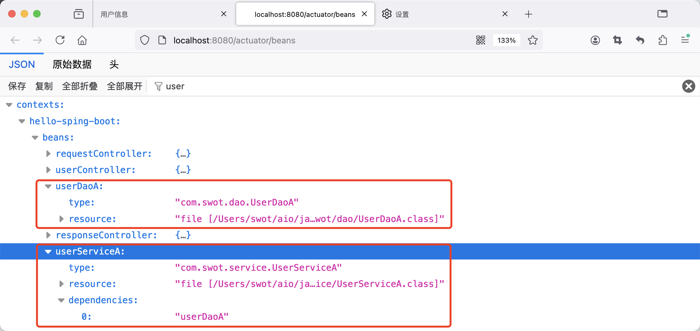
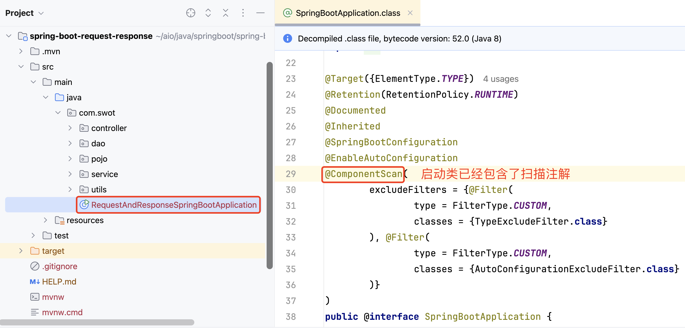
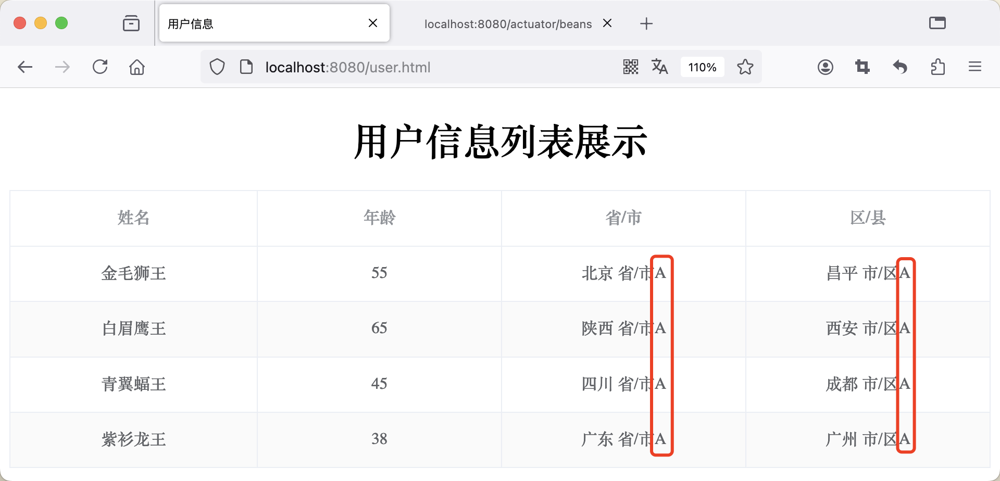

:source-highlighter: pygments
:icons: font
:scripts: cjk
:stem: latexmath
:toc:
:toc: right
:toc-title: Table of Contents
:toclevels: 3

= 三层架构分层的解耦

++++
<button id="toggleButton">Table of Contents</button>
<script>
    // 获取按钮和 div 元素
    const toggleButton = document.getElementById('toggleButton');
    const contentDiv = document.getElementById('toc');
    contentDiv.style.display = 'block';

    // 添加点击事件监听器
    toggleButton.addEventListener('click', () => {
        // 切换 div 的显示状态
        // if (contentDiv.style.display === 'none' || contentDiv.style.display === '') {
        if (contentDiv.style.display === 'none') {
            contentDiv.style.display = 'block';
        } else {
            contentDiv.style.display = 'none';
        }
    });
</script>
++++

== @path spring-boot-ketang/spring-boot-request-response/src/main/java/com/tjise


=== 1. 高内聚低耦合问题描述
软件开发原则是「高内聚低耦合」。

* 内聚：要提高软件中各个功能模块自己完成功能的能力。
* 耦合：要降低软件中各个层/模块之间的依赖、关联的程度。


.下面代码中 UserServiceA.java 类实例化了类 UserDaoA.java
[source,java]
----
private UserDaoA userDao = new UserDaoA();
----

.下面代码中 UserController.java 类实例化了类 UserServiceA.java
[source,java]
----
private UserServiceA userService = new UserServiceA();
----

这样就产生了强耦合::
    如类 UserDaoA 更改类名，则类 UserServiceA 中的代码也要更改。 +
    如类 UserServiceA 更改类名，则 UserController 中的代码也要更改。

这样不好，我们需要解决这个强耦合问题。


举个例子再解释一下，假设我们有这样的应用场景::
    UserServiceA 对应微信支付 +
    UserServiceB 对应支付宝支付 +
    UserServiceC 对应京东支付 +

那么只要我们更换支付方式，则需要更改 UserController.java 中的代码。

==== #file service/UserServiceA.java
[source,java,linenums,highlight=10]
----
package com.tjise.service;

import com.tjise.dao.UserDaoA;
import com.tjise.pojo.Address;
import com.tjise.pojo.User;

import java.util.List;

public class UserServiceA {
    private UserDaoA userDao = new UserDaoA();  // 强耦合

    public List<User> operatorUser() {
        // 调用 Dao 层的方法，获取数据集合
        List<User> list = userDao.operatorUser();

        // 2 业务逻辑操作（把获取的 province 和 city 的值进行处理）
        for (User user : list) {
            Address address = user.getAddress();
            address.setProvince(address.getProvince() + " 省/市");
            address.setCity(address.getCity() + " 市/区");
        }

        return list;
    }
}
----

==== #file controller/UserController.java
[source,java,linenums,highlight=15]
----
package com.tjise.controller;

import com.tjise.pojo.Address;
import com.tjise.pojo.Result;
import com.tjise.pojo.User;
import com.tjise.service.UserServiceA;
import com.tjise.utils.XmlParserUtils;
import org.springframework.web.bind.annotation.RequestMapping;
import org.springframework.web.bind.annotation.RestController;

import java.util.List;

@RestController
public class UserController {
    private UserServiceA userService = new UserServiceA();  // 强耦合

    @RequestMapping("/listUser")
    public Result listUser() {
        List<User> list = userService.operatorUser();
        // 3 把封装的数据响应给客户端
        return Result.success(list);
    }
}
----

=== 2. 降低获取数据时左边类型的耦合 -> left多态
我们需要从两个方面来进行解耦，分别是 #左边类型# 和 #右边的类实例化#。
====
private [red]#UserDaoA# userDao = [red]#new UserDoaA()#;
====

左边类型使用多态来解耦。

. 定义接口 UserDao
+
[source,java]
----
public interface UserDao {  // 定义接口
    public abstract List<User> operatorUser();  // 抽象方法
}
----

. 实现接口 UserDao
+
[source,java]
----
public class UserDaoA implements UserDao
----

. 使用接口 UserDao 来定义变量类型
+
[source,java]
----
private UserDao userDao = new UserDaoA();
----

详细看下面的代码。

==== #file dao/UserDao.java
[source,java,linenums]
----
package com.tjise.dao;

import com.tjise.pojo.User;

import java.util.List;

// 接口
public interface UserDao {
    // 抽象方法
    public abstract List<User> operatorUser();
}
----

==== #file dao/UserDaoA.java
[source,java,linenums]
----
package com.tjise.dao;

import com.tjise.controller.UserController;
import com.tjise.pojo.User;
import com.tjise.utils.XmlParserUtils;

import java.util.List;

// public class UserDaoA {
// -- new -- 实现接口 UserDao
public class UserDaoA implements UserDao {

    public List<User> operatorUser() {
        // 1 操作数据（解析 xml 文件，把数据封装到对象中）
        // 动态获取 user.xml 文件绝对路径
        String path = UserController.class.getClassLoader()
                .getResource("user.xml").getPath();
        System.out.println("path = " + path);
        List<User> list = XmlParserUtils.parse(path);
        return list;
    }
}
----

==== #file service/UserServiceA.java
[source,java,linenums]
----
package com.tjise.service;

import com.tjise.dao.UserDao;
import com.tjise.dao.UserDaoA;
import com.tjise.pojo.Address;
import com.tjise.pojo.User;

import java.util.List;

public class UserServiceA {

    // private UserDaoA userDao = new UserDaoA();
    // -- new -- 使用接口 UserDao 来定义变量类型(多态)
    private UserDao userDao = new UserDaoA();

    public List<User> operatorUser() {
        // 调用 Dao 层的方法，获取数据集合
        List<User> list = userDao.operatorUser();

        // 2 业务逻辑操作（把获取的 province 和 city 的值进行处理）
        for (User user : list) {
            Address address = user.getAddress();
            address.setProvince(address.getProvince() + " 省/市");
            address.setCity(address.getCity() + " 市/区");
        }

        return list;
    }
}
----

=== 3. 降低处理逻辑时左边类型的耦合 -> left多态
我们需要从两个方面来进行解耦，分别是 #左边类型# 和 #右边的类实例化#。
====
private [red]#UserServiceA# userService = [red]#new UserServiceA()#;
====

左边类型使用多态来解耦。

. 定义接口 UserService
+
[source,java]
----
public interface UserService {
    public abstract List<User> operatorUser();
}
----

. 实现接口 UserService
+
[source,java]
----
public class UserServiceA implements UserService {
----

. 使用接口 UserService 来定义变量类型
+
[source,java]
----
private UserService userService = new UserServiceA();
----

详细看下面的代码。

==== #file service/UserService.java
[source,java,linenums]
----
package com.tjise.service;

import com.tjise.pojo.User;

import java.util.List;

public interface UserService {
    public abstract List<User> operatorUser();
}
----

==== #file service/UserServiceA.java
[source,java,linenums]
----
package com.tjise.service;

import com.tjise.dao.UserDao;
import com.tjise.dao.UserDaoA;
import com.tjise.pojo.Address;
import com.tjise.pojo.User;

import java.util.List;

// public class UserServiceA {
// -- new -- 实现接口 UserService
public class UserServiceA implements UserService {

    // private UserDaoA userDao = new UserDaoA();
    // 使用接口 UserDao 来定义变量类型(多态)
    private UserDao userDao = new UserDaoA();

    public List<User> operatorUser() {
        // 调用 Dao 层的方法，获取数据集合
        List<User> list = userDao.operatorUser();

        // 2 业务逻辑操作（把获取的 province 和 city 的值进行处理）
        for (User user : list) {
            Address address = user.getAddress();
            address.setProvince(address.getProvince() + " 省/市");
            address.setCity(address.getCity() + " 市/区");
        }

        return list;
    }
}
----

==== #file controller/UserController.java
[source,java,linenums]
----
package com.tjise.controller;

import com.tjise.pojo.Address;
import com.tjise.pojo.Result;
import com.tjise.pojo.User;
import com.tjise.service.UserService;
import com.tjise.service.UserServiceA;
import com.tjise.utils.XmlParserUtils;
import org.springframework.web.bind.annotation.RequestMapping;
import org.springframework.web.bind.annotation.RestController;

import java.util.List;

@RestController
public class UserController {

    // private UserServiceA userService = new UserServiceA();
    private UserService userService = new UserServiceA();

    @RequestMapping("/listUser")
    public Result listUser() {
        List<User> list = userService.operatorUser();
        // 3 把封装的数据响应给客户端
        return Result.success(list);
    }
}
----

=== 4. 降低获取数据时右边类型的耦合 -> right IOC/DI
我们现在需要对右边的类实例化进行解耦。
====
service 层调用 Dao 层::
private UserDao userDao = [red]#new UserDaoA()#;
controller 层调用 Service 层::
private UserService userService = [red]#new UserServiceA()#;
====

右边类的实例化解耦有两步：

1. 使用 IOC 控制反转将实现类的对象放入框架的容器(称为IOC容器)。
+
[source,java]
----
@Component
public class UserDaoA implements UserDao {...}

@Component
public class UserServiceA implements UserService {...}
----

2. 使用 DI 依赖注入将IOC容器中的对象(Bean对象)赋值给接口定义的变量。
+
[source,java]
----
@Autowired  // 去 IOC 容器中找 UserDao 类型的对象进行使用
private UserDao userDao;  // service 层调用 Dao 层

@Autowired  // 去 IOC 容器中找 UserService 类型的对象进行使用
private UserService userService;  // controller 层调用 Service 层
----

详细看下面的代码。

.名词解释
****
* IOC: Inversion Of Control, 对象的创建控制权由程序自身转移到外部（容器），这种思想称为控制反转。

* DI: Dependecy Injection, 容器为应用程序提供运行时所依赖的资源，称为依赖注入。

* Bean对象: IOC容器中创建、管理的对象，称为 bean 对象。即由 @Component 注解的类生成的对象。
****

==== #file dao/UserDaoA.java
[source,java,linenums,highlight=12]
----
package com.tjise.dao;

import com.tjise.controller.UserController;
import com.tjise.pojo.User;
import com.tjise.utils.XmlParserUtils;
import org.springframework.stereotype.Component;

import java.util.List;


// -- new --
@Component
public class UserDaoA implements UserDao {

    public List<User> operatorUser() {
        // 1 操作数据（解析 xml 文件，把数据封装到对象中）
        // 动态获取 user.xml 文件绝对路径
        String path = UserController.class.getClassLoader()
                .getResource("user.xml").getPath();
        System.out.println("path = " + path);
        List<User> list = XmlParserUtils.parse(path);
        return list;
    }
}
----

==== #file service/UserServiceA.java
[source,java,linenums,highlight=13;19]
----
package com.tjise.service;

import com.tjise.dao.UserDao;
import com.tjise.dao.UserDaoA;
import com.tjise.pojo.Address;
import com.tjise.pojo.User;
import org.springframework.beans.factory.annotation.Autowired;
import org.springframework.stereotype.Component;

import java.util.List;

// -- new --
@Component
public class UserServiceA implements UserService {

    // 使用接口 UserDao 来定义变量类型(多态)
    // private UserDao userDao = new UserDaoA();
    // -- new start --
    @Autowired
    private UserDao userDao;
    // -- new end --

    public List<User> operatorUser() {
        // 调用 Dao 层的方法，获取数据集合
        List<User> list = userDao.operatorUser();

        // 2 业务逻辑操作（把获取的 province 和 city 的值进行处理）
        for (User user : list) {
            Address address = user.getAddress();
            address.setProvince(address.getProvince() + " 省/市");
            address.setCity(address.getCity() + " 市/区");
        }

        return list;
    }
}
----

==== #file controller/UserController.java
[source,java,linenums,highlight=20]
----
package com.tjise.controller;

import com.tjise.pojo.Address;
import com.tjise.pojo.Result;
import com.tjise.pojo.User;
import com.tjise.service.UserService;
import com.tjise.service.UserServiceA;
import com.tjise.utils.XmlParserUtils;
import org.springframework.beans.factory.annotation.Autowired;
import org.springframework.web.bind.annotation.RequestMapping;
import org.springframework.web.bind.annotation.RestController;

import java.util.List;

@RestController
public class UserController {

    // private UserService userService = new UserServiceA();
    // -- new start --
    @Autowired
    private UserService userService;
    // -- new end --

    @RequestMapping("/listUser")
    public Result listUser() {
        List<User> list = userService.operatorUser();
        // 3 把封装的数据响应给客户端
        return Result.success(list);
    }
}
----

=== 5. 查看 IOC 容器中的 Bean 对象
尽管社区版的 IDEA 没有 Ultimate 版的高级功能，依然可以通过代码和日志来查看 Spring IOC 容器中的对象。

下面是三种查看方式，经过测试都可以，推荐使用 Actuator 依赖来查看。

==== 方法1 使用 Actuator -> **推荐**
1. 在 `pom.xml` 中添加 Spring Boot Actuator 依赖，然后在浏览器中访问 `/actuator/beans` 端点来查看所有 Bean 信息。依赖如下：
+
```xml
<dependency>
    <groupId>org.springframework.boot</groupId>
    <artifactId>spring-boot-starter-actuator</artifactId>
</dependency>
```

2. 在 `application.properties` 文件中启用该端点：
+
```properties
management.endpoints.web.exposure.include=beans
```

3. 启动应用程序并访问 http://localhost:8080/actuator/beans 会看到所有 IoC 容器中的 Bean 及其依赖关系。ICO 容器中 bean 对象命名规则可参考下面内容。
+
[.thumb]


==== 方法2 在日志中输出
1. 项目的 pom.xml 中正确引入 spring-boot-starter-logging 依赖
+
```xml
<!-- 打印日志-->
<dependency>
    <groupId>org.springframework.boot</groupId>
    <artifactId>spring-boot-starter-logging</artifactId>
</dependency>
```

2. 在 `application.properties` 或 `application.yml` 中设置 Spring 的日志级别为 `DEBUG` 来查看 Bean 的加载情况：
+
```properties
logging.level.org.springframework=DEBUG
```

3. 启动应用程序时，控制台会输出 Spring IOC 容器的详细信息，包括 Bean 的加载过程和依赖注入的日志。
+
image::img/ioc_bean_log.png[]

==== 方法3 启动类输出 ApplicationContext
**使用 `@SpringBootApplication` 和 `ApplicationContext`**：
你可以通过在 Spring Boot 项目中使用 `ApplicationContext` 来查看所有已注册的 Bean。以下是在项目启动类中打印出所有 Bean 的例子：

```java
@SpringBootApplication
public class MySpringBootApplication {
    public static void main(String[] args) {
        ApplicationContext context = SpringApplication.run(MySpringBootApplication.class, args);
        String[] beanNames = context.getBeanDefinitionNames();
        Arrays.sort(beanNames); // 排序，方便查看
        for (String beanName : beanNames) {
            System.out.println(beanName);
        }
    }
}
```

运行程序时，这会在控制台打印出 Spring IoC 容器中的所有 Bean 名称。

.有好多的 Bean
....
beanName = userController
beanName = userDaoA
beanName = userServiceA
等等......
....

=== 6. 声明 IOC 容器中的 Bean 对象拓展
前面我们使用 @Component 声明过 IOC 容器中的 bean 对象了，现在再来拓展一下相应的内容。

要把某个对象交给 IOC 容器管理，需要在对应的类上添加如下注解之一：

[cols="15%,25%,60%",options="header"]
|===
|注解            |说明                        |位置
|@Component     | 声明 bean 对象的基础注解     |一般不属于以下三类时，可用此注解，比如定义的工具类、POJO 实体类等
|@Controller    .3+.^| @Component 的衍生注解  | 标注在 controller 层的控制器类上
|@Service                                    | 标注在 service 层的业务类上，比 @Component 主义化更强
|@Repository                                 | 标注在 dao 层数据访问类上（由于与 mybatis 整合会使用 @Mapper，所以用的少）
|===

下面用相应的注解来做一些更改吧!

==== #file dao/UserDaoA.java
[source,java,linenums,highlight=13]
----
package com.tjise.dao;

import com.tjise.controller.UserController;
import com.tjise.pojo.User;
import com.tjise.utils.XmlParserUtils;
import org.springframework.stereotype.Component;
import org.springframework.stereotype.Repository;

import java.util.List;


// @Component
@Repository  // -- new --
public class UserDaoA implements UserDao {

    public List<User> operatorUser() {
        // 1 操作数据（解析 xml 文件，把数据封装到对象中）
        // 动态获取 user.xml 文件绝对路径
        String path = UserController.class.getClassLoader()
                .getResource("user.xml").getPath();
        System.out.println("path = " + path);
        List<User> list = XmlParserUtils.parse(path);
        return list;
    }
}
----

==== #file service/UserServiceA.java
[source,java,linenums,highlight=15]
----
package com.tjise.service;

import com.tjise.dao.UserDao;
import com.tjise.dao.UserDaoA;
import com.tjise.pojo.Address;
import com.tjise.pojo.User;
import org.springframework.beans.factory.annotation.Autowired;
import org.springframework.stereotype.Component;
import org.springframework.stereotype.Service;

import java.util.List;


// @Component
@Service    // -- new --
public class UserServiceA implements UserService {

    // 使用接口 UserDao 来定义变量类型(多态)
    // private UserDao userDao = new UserDaoA();
    @Autowired
    private UserDao userDao;

    public List<User> operatorUser() {
        // 调用 Dao 层的方法，获取数据集合
        List<User> list = userDao.operatorUser();

        // 2 业务逻辑操作（把获取的 province 和 city 的值进行处理）
        for (User user : list) {
            Address address = user.getAddress();
            address.setProvince(address.getProvince() + " 省/市");
            address.setCity(address.getCity() + " 市/区");
        }
        return list;
    }
}
----

==== #file controller/UserController.java
[source,java,linenums,highlight=15;16]
----
package com.tjise.controller;

import com.tjise.pojo.Address;
import com.tjise.pojo.Result;
import com.tjise.pojo.User;
import com.tjise.service.UserService;
import com.tjise.service.UserServiceA;
import com.tjise.utils.XmlParserUtils;
import org.springframework.beans.factory.annotation.Autowired;
import org.springframework.web.bind.annotation.RequestMapping;
import org.springframework.web.bind.annotation.RestController;

import java.util.List;

// -- new -- 说明一下: 该注解已经包含了 @Controller
@RestController
public class UserController {

    @Autowired
    private UserService userService;

    @RequestMapping("/listUser")
    public Result listUser() {
        List<User> list = userService.operatorUser();
        // 3 把封装的数据响应给客户端
        return Result.success(list);
    }
}
----

=== 7. 声明 IOC 容器中的 Bean 对象注意事项


==== ICO 容器中 bean 对象命名规则
1. 声明 bean 的时候，如果没有指定 value 属性，则 Bean 对象名称默认为类名首字母小写。

** 如默认的 UserController 类对应的 IOC 容器中的 bean 对象名字为 userController

** 具体查看方法请参 《查看 IOC 容器中的 Bean 对象》一节

+
.bean 名字默认为小驼峰
[.thumb]
image::img/ioc_bean_name.png[默认bean对象命名,640]


2. 声明 bean 的时候，也可以通过 value 属性指定 bean 的名称。
+
bean 名称被指定 @Service(value="userServiceAAA")，如下面截图和代码所示。
+
[.thumb]
image::img/ioc_bean_name_assigned.png[指定bean对象命名,640]

===== #file service/UserServiceA.java
[source,java,linenums]
----
package com.tjise.service;

import com.tjise.dao.UserDao;
import com.tjise.dao.UserDaoA;
import com.tjise.pojo.Address;
import com.tjise.pojo.User;
import org.springframework.beans.factory.annotation.Autowired;
import org.springframework.stereotype.Component;
import org.springframework.stereotype.Service;

import java.util.List;

// @Service
// @Service(value="userServiceAAA")
@Service("userServiceAAA")    // -- new -- 可以省略 value
public class UserServiceA implements UserService {

    @Autowired
    private UserDao userDao;

    public List<User> operatorUser() {
        // 调用 Dao 层的方法，获取数据集合
        List<User> list = userDao.operatorUser();

        // 2 业务逻辑操作（把获取的 province 和 city 的值进行处理）
        for (User user : list) {
            Address address = user.getAddress();
            address.setProvince(address.getProvince() + " 省/市");
            address.setCity(address.getCity() + " 市/区");
        }
        return list;
    }
}
----

==== Web 开发控制器只能用 @Controller
目前来说，我们使用以上四个注解都可以声明 bean，但是在集成后端 web 开发之后，声明控制器(Controller) 的 bean 只能用 @Controler。
当前的应用已经加入了起步依赖 spring-boot-starter-web，所以我们使用 @RestController 就可以了。

.为什么控制器 bean 只能用 `@Controller`？
****
虽然从 Spring IOC 容器的角度来看，`@Component` 和其他衍生注解（如 `@Controller`）在技术上都可以注册 bean，但 `@Controller` 是专门用于控制器类的注解。Spring MVC 框架会扫描所有带有 `@Controller` 注解的类，并将其视为处理 HTTP 请求的控制器。

- *`@Controller` 的作用不仅仅是声明 bean*，它还告诉 Spring 这个类是一个 Web 控制器，它应该参与处理 HTTP 请求。
- 如果你用其他注解（例如 `@Service` 或 `@Component`）来声明控制器类，Spring MVC 不会识别它为一个控制器，导致 HTTP 请求无法被正确处理。
****

NOTE: @RestController 注解已经包含了 @Controller 注释。

=== 8. 进入 IOC 容器中的 Bean 对象扫描
前面声明 bean 的四大注解，要想生效，还需要被组件扫描注解 @ComponentScan 扫描。

@ComponentScan 注解虽然没有显式配置，但是实际上已经包含在了引导类声明注解 @SpringBootApplication 中，##默认扫描的范围是引导类所在包及其子包##，按 Ctrl 点击 @SpringBootApplication 可查看包含的其他注解。

.启动类已经包含了 @ComponentScan 注解



.查看代码目录结构
....
tree spring-boot-request-response/src/main/java
└── com
    └── tjise
        ├── RequestAndResponseSpringBootApplication.java  // 启动类
        ├── controller
        │   └── UserController.java
        ├── dao
        │   ├── UserDao.java
        │   └── UserDaoA.java
        ├── pojo
        │   ├── Address.java
        │   ├── Result.java
        │   └── User.java
        ├── service
        │   ├── UserService.java
        │   └── UserServiceA.java
        └── utils
            └── XmlParserUtils.java
....

所以只要四大注解（@Component, @Controller, @Service, @Repository）修饰的文件们超出了 tjise 目录，注解就无法生效了。您可以试试哟！

=== 9. 使用 IOC 容器中的 Bean 对象注入报错
@Autowired 注解注入 bean 对象，##默认是按类的类型进行查找的##，所以如果存在多个相同类型的 bean 对象，将会报错。

新建 UserServiceB.java 后，3 个文件的关键代码如下面颜色高亮部分。

.运行项目报错如下:
....
Field userService in com.tjise.controller.UserController required a single bean, but 2 were found:
	- userServiceA: defined in file [/Users/swot/aio/java/springboot/spring-boot-request-response/target/classes/com/swot/service/UserServiceA.class]
	- userServiceB: defined in file [/Users/swot/aio/java/springboot/spring-boot-request-response/target/classes/com/swot/service/UserServiceB.class]

Action:

Consider marking one of the beans as @Primary, updating the consumer to accept multiple beans, or using @Qualifier to identify the bean that should be consumed
....

上面给出了报错原因是 UserController 需要一个 bean 对象，但是找到了两个。
同时也给出了两种解决方案为使用注解 @Primary 或 @Qualifier。
下面分别对 @Primary 和 @Qualifier 进行测试。

NOTE: 下面还额外介绍了 java 提供的注解 @Resource 来解决这个问题。用法和 @Qualifier 类似。

==== #file controller/UserController.java
.使用 @Autowired 注入 ICO 容器中的 bean 对象给变量 userService
[source,java,linenums,highlight=18;19]
----
package com.tjise.controller;

import com.tjise.pojo.Address;
import com.tjise.pojo.Result;
import com.tjise.pojo.User;
import com.tjise.service.UserService;
import com.tjise.service.UserServiceA;
import com.tjise.utils.XmlParserUtils;
import org.springframework.beans.factory.annotation.Autowired;
import org.springframework.web.bind.annotation.RequestMapping;
import org.springframework.web.bind.annotation.RestController;

import java.util.List;

@RestController
public class UserController {

    @Autowired  // 只要一个 UserService 类型的 IOC bean 对象
    private UserService userService;

    @RequestMapping("/listUser")
    public Result listUser() {
        List<User> list = userService.operatorUser();
        // 3 把封装的数据响应给客户端
        return Result.success(list);
    }
}
----

==== #file service/UserServiceA.java
.IOC 容器中的 UserService 类型的 bean 对象为 userServiceA
[source,java,linenums,highlight=13;14;26;27]
----
package com.tjise.service;

import com.tjise.dao.UserDao;
import com.tjise.dao.UserDaoA;
import com.tjise.pojo.Address;
import com.tjise.pojo.User;
import org.springframework.beans.factory.annotation.Autowired;
import org.springframework.stereotype.Component;
import org.springframework.stereotype.Service;

import java.util.List;

@Service    // --new-- IOC bean 是 UserService 类型的 userServiceA
public class UserServiceA implements UserService {

    @Autowired
    private UserDao userDao;

    public List<User> operatorUser() {
        // 调用 Dao 层的方法，获取数据集合
        List<User> list = userDao.operatorUser();

        // 2 业务逻辑操作（把获取的 province 和 city 的值进行处理）
        for (User user : list) {
            Address address = user.getAddress();
            address.setProvince(address.getProvince() + " 省/市A");
            address.setCity(address.getCity() + " 市/区A");
        }
        return list;
    }
}
----

==== #file service/UserServiceB.java
.IOC 容器中的 UserService 类型的 bean 对象为 userServiceB
[source,java,linenums,highlight=13;14;26;27]
----
package com.tjise.service;

import com.tjise.dao.UserDao;
import com.tjise.dao.UserDaoA;
import com.tjise.pojo.Address;
import com.tjise.pojo.User;
import org.springframework.beans.factory.annotation.Autowired;
import org.springframework.stereotype.Component;
import org.springframework.stereotype.Service;

import java.util.List;

@Service    // --new-- IOC bean 是 UserService 类型的 userServiceB
public class UserServiceB implements UserService {

    @Autowired
    private UserDao userDao;

    public List<User> operatorUser() {
        // 调用 Dao 层的方法，获取数据集合
        List<User> list = userDao.operatorUser();

        // 2 业务逻辑操作（把获取的 province 和 city 的值进行处理）
        for (User user : list) {
            Address address = user.getAddress();
            address.setProvince(address.getProvince() + " 省/市B");
            address.setCity(address.getCity() + " 市/区B");
        }
        return list;
    }
}
----

=== 10. 选择 IOC 容器中的 Bean 对象注入方式 @Primary
使用 @Primary 注解标注生成的 bean 对象会被优先使用。测试将 @Primary 注解加在 UserServiceA 实现类上，再启动项目会发现此时使用了 bean 对象 userServiceA。

[.thumb]


如果将 @Primary 注解加在 UserServiceB 类上，则会使用 bean 对象 userServiceB，测试省略。

==== #file service/UserServiceA.java
.IOC 容器中的 UserService 类型的 bean 对象为 userServiceA
[source,java,linenums,highlight=15..17;29;30]
----
package com.tjise.service;

import com.tjise.dao.UserDao;
import com.tjise.dao.UserDaoA;
import com.tjise.pojo.Address;
import com.tjise.pojo.User;
import org.springframework.beans.factory.annotation.Autowired;
import org.springframework.context.annotation.Primary;
import org.springframework.stereotype.Component;
import org.springframework.stereotype.Service;

import java.util.List;


@Service    // --new-- IOC bean 对象是 UserService 类型的 userServiceA
@Primary    // 加入新注解以解决多个 @Autowired 只要一个Bean 的问题
public class UserServiceA implements UserService {

    @Autowired
    private UserDao userDao;

    public List<User> operatorUser() {
        // 调用 Dao 层的方法，获取数据集合
        List<User> list = userDao.operatorUser();

        // 2 业务逻辑操作（把获取的 province 和 city 的值进行处理）
        for (User user : list) {
            Address address = user.getAddress();
            address.setProvince(address.getProvince() + " 省/市A");
            address.setCity(address.getCity() + " 市/区A");
        }
        return list;
    }
}
----

=== 11. 选择 IOC 容器中的 Bean 对象注入方式 @Qualifier
在使用 @Autowired 注入 bean 对象的时候，使用 @Qualifier 注解来指定使用哪个 bean 对象。

==== #file controller/UserController.java
.使用 @Qualifier(bean对象名) 注入 ICO 容器中的 bean 对象给变量 userService
[source,java,linenums,highlight=19;20]
----
package com.tjise.controller;

import com.tjise.pojo.Address;
import com.tjise.pojo.Result;
import com.tjise.pojo.User;
import com.tjise.service.UserService;
import com.tjise.service.UserServiceA;
import com.tjise.utils.XmlParserUtils;
import org.springframework.beans.factory.annotation.Autowired;
import org.springframework.web.bind.annotation.RequestMapping;
import org.springframework.web.bind.annotation.RestController;

import java.util.List;

@RestController
public class UserController {

    @Autowired  // 只要一个 UserService 类型的 IOC bean
    // @Qualifier("userServiceA")   // 使用 userServiceA
    @Qualifier("userServiceB")      // 使用 userServiceB
    private UserService userService;

    @RequestMapping("/listUser")
    public Result listUser() {
        List<User> list = userService.operatorUser();
        // 3 把封装的数据响应给客户端
        return Result.success(list);
    }
}
----

=== 12. 选择 IOC 容器中的 Bean 对象注入方式 @Resource
在使用 @Autowired 注入 bean 对象的时候，使用 @Resource 注解来指定使用哪个 bean 对象。

NOTE: @Resource 是 java 提供的注解。

==== #file controller/UserController.java
.使用 @Resource 注解来指定使用哪个 bean 对象给变量 userService
[source,java,linenums,highlight=21;22]
----
package com.tjise.controller;

import com.tjise.pojo.Address;
import com.tjise.pojo.Result;
import com.tjise.pojo.User;
import com.tjise.service.UserService;
import com.tjise.service.UserServiceA;
import com.tjise.utils.XmlParserUtils;
import org.springframework.beans.factory.annotation.Autowired;
import org.springframework.web.bind.annotation.RequestMapping;
import org.springframework.web.bind.annotation.RestController;

import javax.annotation.Resource;
import java.util.List;


@RestController
public class UserController {

    @Autowired  // 只要一个 UserService 类型的 IOC bean
    @Resource(name="userServiceA")      // 使用 userServiceA
    // @Resource(name="userServiceB")      // 使用 userServiceB
    // @Qualifier("userServiceA")       // 使用 userServiceA
    // @Qualifier("userServiceB")       // 使用 userServiceB
    private UserService userService;

    @RequestMapping("/listUser")
    public Result listUser() {
        List<User> list = userService.operatorUser();
        // 3 把封装的数据响应给客户端
        return Result.success(list);
    }
}
----

