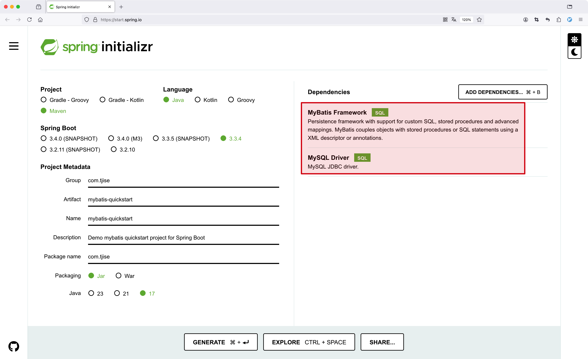

:source-highlighter: pygments
:icons: font
:scripts: cjk
:toc:
:toc: right
:toc-title: 目录
:toclevels: 3

= Mybatis 入门

++++
<button id="toggleButton">目录</button>

++++

== MyBatis 介绍
MyBatis 是一款优秀的 [red]#持久层框架#，用于简化 JDBC 的开发。

之前学的三层架构

* controller 控制层

* service 业务层

* dao 持久层

MyBatis 本是 Apache 的一个开源项目 iBatis，2010 年这个项目由 apache 迁移到了 google code，并且改名为 MyBatis, 2013 年 11 月迁移到 Github。

官网: https://mybatis.org/mybatis-3/

中文: https://mybatis.org/mybatis-3/zh_CN/index.html

== MyBatis 快速入门
使用 https://start.spring.io/ 创建 Spring Boot 工程，如下所示。

注：给工程命名为 mybatis-quickstart，在创建工程时选择 mybatis 起步依赖、mysql 驱动包依赖。

*下面引用之前学过的文档内容，请注意项目名称更改为 mybatis-quickstart.zip 即可。*

=== 导入自己创建的 Spring Boot 模块
1. 解压下载的 Spring Boot 代码，如 hello-spring-boot.zip，可以发现就是一个 Maven 模块的目录结构。
+
image::img/hello-spring-boot-unzip.png[,640]

2. 使用 IDEA 导入 hello-spring-boot 模块

* 进入 File -> Project Structure 对话框，选择 Modules
* 点击 `+` 号，选择要导入的模块目录，如 hello-spring-boot
+
image::img/import_module_0.png[,400]

3. 在导入时有两个选项：

* Create module from existing sources（从现有源创建模块）用于导入没有使用构建工具如 maven 的项目
* Import module from external model（从外部模型导入模块）用于导入使用构建工具如 maven 创建的项目。因为我们是用 maven 来管理代码的，所以选择 `Import module from external model`
+
[.thumb]
image::img/import_module_1.png[,640]

4. 然后会看见 IDEA 自动安装了依赖。

5. 更改 hello-spring-boot 中的 pom.xml 文件中的 Spring Boot 和 JDK 版本号。
+
[source,xml,linenums,highlight=4;8]
----
<parent>
    <groupId>org.springframework.boot</groupId>
    <artifactId>spring-boot-starter-parent</artifactId>
    <version>2.7.18</version>
    <relativePath/> <!-- lookup parent from repository -->
</parent>
<properties>
    <java.version>1.8</java.version>
</properties>
----

=== 检查所有依赖版本
.将 mbatis 依赖的版本调整为支持 JDK1.8，然后刷新 Maven。
[source,xml,linenums,highlight=4;10]
----
<dependency>
    <groupId>org.mybatis.spring.boot</groupId>
    <artifactId>mybatis-spring-boot-starter</artifactId>
    <version>2.3.0</version>
</dependency>

<dependency>
    <groupId>org.mybatis.spring.boot</groupId>
    <artifactId>mybatis-spring-boot-starter-test</artifactId>
    <version>2.3.0</version>
    <scope>test</scope>
</dependency>
----

=== 创建用户表 user
创建用户表时最好选择 utf8 中文，这样可以避免中文乱码问题。

[source,sql]
----
create database mybatis_db character set 'utf8';
use mybatis_db;

create table user
(
    id      int unsigned primary key auto_increment comment 'ID',
    name    varchar(100) comment '姓名',
    age     tinyint unsigned comment '年龄',
    gender  tinyint unsigned comment '性别, 1:男, 2:女',
    phone   varchar(11)      comment '手机号'
) comment '用户表';

INSERT INTO user (id, name, age, gender, phone)
VALUES
    (null, '白眉鹰王', 55, '1', '18900000000'),
    (null, '金毛狮王', 45, '1', '18900000001'),
    (null, '青翼蝠王', 38, '1', '18900000002'),
    (null, '紫衫龙王', 42, '2', '18800000003'),
    (null, '光明左使', 37, '1', '18800000004'),
    (null, '光明右使', 48, '1', '18800000005');
----

////
macos 启动 mysql
> sudo /usr/local/mysql/support-files/mysql.server start
Password:
Starting MySQL
... SUCCESS!
////

=== 创建对应的实体类 User
1. 实体类应该放在包 pojo 中，所以创建包 com.tjise.pojo

2. 在包 pojo 中创建实体类 User

==== #file spring-boot-ketang/mybatis-quickstart/src/main/java/com/tjise/pojo/User.java
[source,java,linenums]
----
package com.tjise.pojo;

public class User {
//  private int id;      // 因为 int 默认值是 0, 但是数据库中 int 默认为 null
    private Integer id;  // 所以为了对应，建议此处用 Integer
    private String name;
    private Integer age;
    private Integer gender;
    private String phone;

    public User() {
    }

    public User(Integer id, String name, Integer age, Integer gender, String phone) {
        this.id = id;
        this.name = name;
        this.age = age;
        this.gender = gender;
        this.phone = phone;
    }

    public Integer getId() {
        return id;
    }

    public void setId(Integer id) {
        this.id = id;
    }

    public String getName() {
        return name;
    }

    public void setName(String name) {
        this.name = name;
    }

    public Integer getAge() {
        return age;
    }

    public void setAge(Integer age) {
        this.age = age;
    }

    public Integer getGender() {
        return gender;
    }

    public void setGender(Integer gender) {
        this.gender = gender;
    }

    public String getPhone() {
        return phone;
    }

    public void setPhone(String phone) {
        this.phone = phone;
    }

    @Override
    public String toString() {
        return "User{" +
                "id=" + id +
                ", name='" + name + '\'' +
                ", age=" + age +
                ", gender=" + gender +
                ", phone='" + phone + '\'' +
                '}';
    }
}
----

=== 编写 application.properties
配置数据库连接信息。

==== #file spring-boot-ketang/mybatis-quickstart/src/main/resources/application.properties
[source,properties,linenums]
----
spring.application.name=mybatis-quickstart

# 配置文件行最后不能有空格

# 驱动类名称
spring.datasource.driver-class-name=com.mysql.cj.jdbc.Driver
# 数据库连接的 url
spring.datasource.url=jdbc:mysql://localhost:3306/mybatis_db
# 连接数据库的用户名
spring.datasource.username=root
# 连接数据库的密码
spring.datasource.password=root
----

=== 文件乱码 application.properties
文件 application.properties 默认的编码是 ISO-8859-1，这样在写中文的时候会出现乱码问题，按照下图设置为 UTF-8 编码即可。

.src/main/resources/application.properties 文件乱码解决方法

=== 编写持久层接口 UserMapper 及 SQL
对于持久层，我们可以使用包名 dao，但是以后建议使用 mapper。

创建包 dao，并在其中创建接口 UserMapper，我们以取数据库表 user 中的所有记录为例，代码如下：

==== #file spring-boot-ketang/mybatis-quickstart/src/main/java/com/tjise/dao/UserMapper.java
[source,java,linenums]
----
package com.tjise.dao;

import com.tjise.pojo.User;
import org.apache.ibatis.annotations.Mapper;
import org.apache.ibatis.annotations.Select;

import java.util.List;

/* Mapper 注解
    1. 让此接口被 mybatis 框架识别
    2. Spring Boot 会自动创建此接口的实现类对象，交给 IOC 容器管理
*/

@Mapper
public interface UserMapper {
    // 抽象方法
    @Select("select * from user")
    public abstract List<User> listUser();
}
----

=== 单元测试

==== #file spring-boot-ketang/mybatis-quickstart/src/test/java/com/tjise/MybatisQuickstartApplicationTests.java
.单元测试代码
[source,java,linenums]
----
package com.tjise;

import com.tjise.dao.UserMapper;
import com.tjise.pojo.User;
import org.junit.jupiter.api.Test;
import org.springframework.beans.factory.annotation.Autowired;
import org.springframework.boot.test.context.SpringBootTest;

import java.util.List;

@SpringBootTest
class MybatisQuickstartApplicationTests {

    @Autowired        // 此依赖注入功能为取 IOC 容器中 UserMapper 类型的对象
    private UserMapper userMapper;

    @Test
    public void testListUser() {
        List<User> list = userMapper.listUser();
        for (User user : list) {
            System.out.println(user);
        }
    }
}
----

.运行单元测试结果如下
....
User{id=1, name='白眉鹰王', age=55, gender=1, phone='18900000000'}
User{id=2, name='金毛狮王', age=45, gender=1, phone='18900000001'}
User{id=3, name='青翼蝠王', age=38, gender=1, phone='18900000002'}
User{id=4, name='紫衫龙王', age=42, gender=2, phone='18800000003'}
User{id=5, name='光明左使', age=37, gender=1, phone='18800000004'}
User{id=6, name='光明右使', age=48, gender=1, phone='18800000005'}
....

== JDBC 介绍(了解)
JDBC (Java DataBase Connectivity) 是使用 Java 语言操作关系型数据库的一套 API。

[caption=]
.JDBC 定义了接口
[cols="1,1,1",options="header"]
|===
|程序                   |接口规范抽象方法             |各厂商实现类(驱动)
.4+^.^|Java 代码调用 ->  .4+^.^|JDBC Interface ->    |MySQL
                                                   |ORACLE
                                                   |SQLServer
                                                   |...
|===

* JDBC 是 sun 公司官方定义的一套操作所有关系型数据库的规范，即接口。
* 各个数据库厂商去实现这套接口，提供数据库驱动 jar 包。
* 我们可以使用这套接口(JDBC)编程，真正执行的代码是驱动 jar 包中的实现类 *(面向对象中多态的应用)*。

== 数据库连接池 Druid
数据库连接池是个容器，负责分配、管理数据库连接(Connection)。

* 资源重用，提升系统响应速度：它允许应用程序重复使用一个现有的数据库连接，而不是再重新建立一个。
* 避免数据库连接遗漏：如果数据库连接没有及时释放，那么会在数据连接池中获取其他可用的连接。

常用数据库连接池：

* Druid 阿里巴巴的德鲁伊。
* Hikari(追光者)，是 Spring Boot 默认的。
+

***
*切换 Druid 数据库连接池*

官方地址: https://github.com/alibaba/druid/tree/master/druid-spring-boot-starter

.pom.xml 增加 Druid 依赖
[source,xml]
----
<dependency>
    <groupId>com.alibaba</groupId>
    <artifactId>druid-spring-boot-starter</artifactId>
    <version>1.2.23</version>
</dependency>
----

.编写 application.properties (##可选操作，如果不成功就加上这4行##)
[source,properties]
----
# cj 表示支持高版本 mysql8
spring.datasource.druid.driver-class-name=com.mysql.cj.jdbc.Driver
spring.datasource.druid.url=jdbc:mysql://localhost:3306/mybatis
spring.datasource.druid.username=root
spring.datasource.druid.password=root
----

.使用 Druid 数据库连接池成功

== lombok 注解简化 pojo 类代码
Lombok是一个实用的java工具包，可以通过简单的注解来简化和消除一些必须有但显得很臃肿的Java代码。

[caption=]
.lombok 注解说明 (红色的常用)
[cols="1,3",options="header",stripes=even]
|===
|注解             	    |作用
|@Getter/@Setter      |为所有的属性提供 get/set方法
|@ToString	           |会给类自动生成易阅读的 toString 方法
|@EqualsAndHashCode	  |根据类所拥有的非静态字段自动重写 equals 方法和 hashCode 方法
|[red]#@Data#	                |提供了更综合的生成代码功能（@Getter + @Setter + @ToString + @EqualsAndHashCode）
|[red]#@NoArgsConstructor#   |为实体类生成无参的构造器方法
|[red]#@AllArgsConstructor#	 |为实体类生成除了 static 修饰的字段之外带有各参数的构造器方法。
|===

.pom.xml 增加依赖 lombok
[source,xml]
----
<dependency>
    <groupId>org.projectlombok</groupId>
    <artifactId>lombok</artifactId>
</dependency>
----

Lombok 依赖会在编译时，自动生成对应的 java 代码。在使用 lombok 时，还需要安装一个 IDEA's lombok 插件。

NOTE: 如果使用 Lombok 依赖而没有安装 IDEA 的 Lombok 插件，IDE 可能无法识别 Lombok 的注解，导致代码看起来像是缺失 getter/setter 等方法，尽管它们在编译时会正常生成。因此，安装这个插件是为了确保 Lombok 注解在开发过程中能够被 IDEA 正确识别和处理。

我们可以使用 lombok 依赖简化前面创建的实体类 pojo/User.java，简化后的代码如下，
同时执行单元测试 class MybatisQuickstartApplicationTests -> public void testListUser() 正常通过。

=== #file spring-boot-ketang/mybatis-quickstart/src/main/java/com/tjise/pojo/User.java
[source,java,linenums]
----
package com.tjise.pojo;

import lombok.AllArgsConstructor;
import lombok.Data;
import lombok.NoArgsConstructor;

@Data
@NoArgsConstructor
@AllArgsConstructor
public class User {
//  private int id;      // 因为 int 默认值是 0, 但是数据库中 int 默认为 null
    private Integer id;  // 所以为了对应，建议此处用 Integer
    private String name;
    private Integer age;
    private Integer gender;
    private String phone;
}
----

.单元测试通过，说明 lombok 的注解生效了
....
User(id=1, name=白眉鹰王, age=55, gender=1, phone=18900000000)
User(id=2, name=金毛狮王, age=45, gender=1, phone=18900000001)
User(id=3, name=青翼蝠王, age=38, gender=1, phone=18900000002)
User(id=4, name=紫衫龙王, age=42, gender=2, phone=18800000003)
User(id=5, name=光明左使, age=37, gender=1, phone=18800000004)
User(id=6, name=光明右使, age=48, gender=1, phone=18800000005)
....

