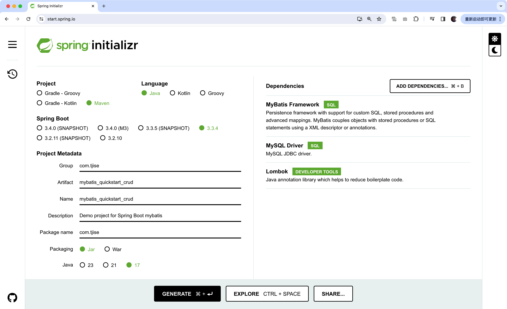
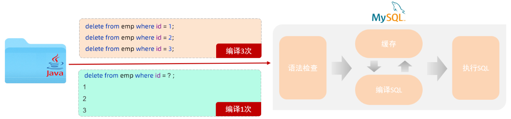

:source-highlighter: pygments
:icons: font
:scripts: cjk
:toc:
:toc: right
:toc-title: 目录
:toclevels: 3
:doctype: book

++++
<button id="toggleButton">目录</button>

++++

= 1. Mybatis 基础增删改查 -> 删除

== @path spring-boot-ketang/mybatis_quickstart-crud

=== 案例准备工作
使用 https://start.spring.io/ 创建 Spring Boot 工程，如下所示。

注：给工程命名为 mybatis-quickstart-crud，在创建工程时选择对应的起步依赖 mybatis, mysql, lombok。

*下面引用之前学过的文档内容，请注意项目名称更改为 mybatis-quickstart-crud.zip 即可*

=== 导入自己创建的 Spring Boot 模块
1. 解压下载的 Spring Boot 代码，如 hello-spring-boot.zip，可以发现就是一个 Maven 模块的目录结构。
+
image::img/hello-spring-boot-unzip.png[,640]

2. 使用 IDEA 导入 hello-spring-boot 模块

* 进入 File -> Project Structure 对话框，选择 Modules
* 点击 `+` 号，选择要导入的模块目录，如 hello-spring-boot
+
image::img/import_module_0.png[,400]

3. 在导入时有两个选项：

* Create module from existing sources（从现有源创建模块）用于导入没有使用构建工具如 maven 的项目
* Import module from external model（从外部模型导入模块）用于导入使用构建工具如 maven 创建的项目。因为我们是用 maven 来管理代码的，所以选择 `Import module from external model`
+
[.thumb]
image::img/import_module_1.png[,640]

4. 然后会看见 IDEA 自动安装了依赖。

5. 更改 hello-spring-boot 中的 pom.xml 文件中的 Spring Boot 和 JDK 版本号。
+
[source,xml,linenums,highlight=4;8]
----
<parent>
    <groupId>org.springframework.boot</groupId>
    <artifactId>spring-boot-starter-parent</artifactId>
    <version>2.7.18</version>
    <relativePath/> <!-- lookup parent from repository -->
</parent>
<properties>
    <java.version>1.8</java.version>
</properties>
----

=== 检查所有依赖版本
.将 mbatis 依赖的版本调整为支持 JDK1.8，然后刷新 Maven。
[source,xml,linenums,highlight=4;10]
----
<dependency>
    <groupId>org.mybatis.spring.boot</groupId>
    <artifactId>mybatis-spring-boot-starter</artifactId>
    <version>2.3.0</version>
</dependency>

<dependency>
    <groupId>org.mybatis.spring.boot</groupId>
    <artifactId>mybatis-spring-boot-starter-test</artifactId>
    <version>2.3.0</version>
    <scope>test</scope>
</dependency>
----

=== 编写 application.properties
配置数据库连接信息。

==== #file src/main/resources/application.properties
[source,properties,linenums]
----
spring.application.name=mybatis_quickstart-crud

# 配置文件行最后不能有空格

# 驱动类名称
spring.datasource.driver-class-name=com.mysql.cj.jdbc.Driver
# 数据库连接的 url
spring.datasource.url=jdbc:mysql://localhost:3306/mybatis_db
# 连接数据库的用户名
spring.datasource.username=root
# 连接数据库的密码
spring.datasource.password=root
----

=== 创建数据库表 emp
.在数据库管理软件中执行命令
[source,sql,linenums]
----
use mybatis_db;

create table emp (
  id          int unsigned primary key auto_increment comment 'ID',
  username    varchar(20) not null unique comment '用户名',
  password    varchar(32) default '123456' comment '密码',
  name        varchar(10) not null comment '姓名',
  gender      tinyint unsigned not null comment '性别, 说明: 1 男, 2 女',
  image       varchar(300) comment '图像',
  job         tinyint unsigned comment '职位, 说明: 1班主任, 2讲师, 3学工主管, 4教研主管, 5咨询师',
  entrydate   date comment '入职时间',
  dept_id     int unsigned comment '部门ID',
  create_time datetime not null comment '创建时间',
  update_time datetime not null comment '修改时间'
) comment='员工表';
----

=== 插入数据到表 emp
.在数据库管理软件中执行命令
[source,sql,linenums]
----
INSERT INTO emp
(id, username, password, name, gender, image, job, entrydate,dept_id, create_time, update_time) VALUES
( 1 ,'jinyong'    ,'123456' ,'金庸'   , 1  ,'1.jpg'  , 4  ,'2000-01-01', 2  , now() , now()),
( 2 ,'zhangwuji'  ,'123456' ,'张无忌' , 1  ,'2.jpg'  , 2  ,'2015-01-01', 2  , now() , now()),
( 3 ,'yangxiao'   ,'123456' ,'杨逍'   , 1  ,'3.jpg'  , 2  ,'2008-05-01', 2  , now() , now()),
( 4 ,'weiyixiao'  ,'123456' ,'韦一笑' , 1  ,'4.jpg'  , 2  ,'2007-01-01', 2  , now() , now()),
( 5 ,'changyuchun','123456' ,'常遇春' , 1  ,'5.jpg'  , 2  ,'2012-12-05', 2  , now() , now()),
( 6 ,'xiaozhao'   ,'123456' ,'小昭'   , 2  ,'6.jpg'  , 3  ,'2013-09-05', 1  , now() , now()),
( 7 ,'jixiaofu'   ,'123456' ,'纪晓芙' , 2  ,'7.jpg'  , 1  ,'2005-08-01', 1  , now() , now()),
( 8 ,'zhouzhiruo' ,'123456' ,'周芷若' , 2  ,'8.jpg'  , 1  ,'2014-11-09', 1  , now() , now()),
( 9 ,'dingminjun' ,'123456' ,'丁敏君' , 2  ,'9.jpg'  , 1  ,'2011-03-11', 1  , now() , now()),
(10 ,'zhaomin'    ,'123456' ,'赵敏'   , 2  ,'10.jpg' , 1  ,'2013-09-05', 1  , now() , now()),
(11 ,'luzhangke'  ,'123456' ,'鹿杖客' , 1  ,'11.jpg' , 5  ,'2007-02-01', 3  , now() , now()),
(12 ,'hebiweng'   ,'123456' ,'鹤笔翁' , 1  ,'12.jpg' , 5  ,'2008-08-18', 3  , now() , now()),
(13 ,'fangdongbai','123456' ,'方东白' , 1  ,'13.jpg' , 5  ,'2012-11-01', 3  , now() , now()),
(14 ,'zhangsanfeng','123456','张三丰' , 1  ,'14.jpg' , 2  ,'2002-08-01', 2  , now() , now()),
(15 ,'yulianzhou' ,'123456' ,'俞莲舟' , 1  ,'15.jpg' , 2  ,'2011-05-01', 2  , now() , now()),
(16 ,'songyuanqiao','123456','宋远桥' , 1  ,'16.jpg' , 2  ,'2010-01-01', 2  , now() , now()),
(17 ,'chenyouliang','123456','陈友谅' , 1  ,'17.jpg' ,NULL,'2015-03-21',NULL , now(), now());
----

=== 创建对应的实体类 Emp
创建 pojo 包，在包里创建 Emp.java 实体类。

实体类属性采用小驼峰命名模式，可能会与数据库中字段的命名方式不同，以后会讲解如何处理该问题。

==== #file src/main/java/com/tjise/pojo/Emp.java
[source,java,linenums,highlight=22..24]
----
package com.tjise.pojo;

import lombok.AllArgsConstructor;
import lombok.Data;
import lombok.NoArgsConstructor;

import java.time.LocalDate;
import java.time.LocalDateTime;

@Data
@NoArgsConstructor
@AllArgsConstructor
public class Emp {
    private Integer id;
    private String username;
    private String password;
    private String name;
    private Short gender;
    private String image;
    private Short job;
    private LocalDate entrydate;
    private Integer deptId;     // 这里三行采用了小驼峰命名，数据库中一般为下划线命名方式
    private LocalDateTime createTime;   // 后面会学如何处理这种不对应的问题
    private LocalDateTime updateTime;
}
----

=== 创建 Mapper 接口 EmpMapper
创建包 mapper (和以前的 dao 的含义是一样的，只是 Spring Boot 项目习惯使用 mapper 而已)，在包中创建接口 EmpMapper.java

==== #file src/main/java/com/tjise/mapper/EmpMapper.java
[source,java,linenums]
----
package com.tjise.mapper;

import org.apache.ibatis.annotations.Mapper;

/* Mapper 注解
    1. 让此接口被 mybatis 框架识别
    2. Spring Boot 会自动创建此接口的实现类对象，交给 IOC 容器管理
*/

@Mapper
public interface EmpMapper {

}
----

=== 删除记录练习
删除记录的 SQL 语句::
    delete from 表名 where id = id值; +
    delete from emp where id = 15;

==== #file src/main/java/com/tjise/mapper/EmpMapper.java
删除记录接口方法如下

[source,java,linenums]
----
package com.tjise.mapper;

import org.apache.ibatis.annotations.Delete;
import org.apache.ibatis.annotations.Mapper;

/* Mapper 注解
    1. 让此接口被 mybatis 框架识别
    2. Spring Boot 会自动创建此接口的实现类对象，交给 IOC 容器管理
*/

@Mapper
public interface EmpMapper {

    @Delete("delete from emp where id = #{id}")  // <1>
    public abstract void deleteEmpById(Integer id);
}
----

<1> 如果 mapper 接口方法形参只有一个普通类型的参数，\#{...} 里面的属性名可以随便写，如: #{id}、#{value}。
+
*但是在实际开发中，我们还是要见名思意，不要随便起名字。*

==== #file src/test/java/com/tjise/MybatisQuickstartCrudApplicationTests.java
接下来，我们就可以直接在单元测试类中通过 @Autowired 注解 EmpMapper 接口。
然后就可以直接调用其 deleteEmpById 方法传递参数进行测试了。

[source,java,linenums]
----
package com.tjise;

import com.tjise.mapper.EmpMapper;
import org.junit.jupiter.api.Test;
import org.springframework.beans.factory.annotation.Autowired;
import org.springframework.boot.test.context.SpringBootTest;

@SpringBootTest
class MybatisQuickstartCrudApplicationTests {

    @Autowired
    private EmpMapper empMapper;

    @Test
    void deleteEmpByIdTest() {
        empMapper.deleteEmpById(15);
    }

}
----

测试结果为删除了指定的数据库记录。

=== 打开 mybatis 日志查看执行的 sql 语句
可以在 application.properties 中，打开 mybatis 的日志，并指定输出到控制台，参下面文件所示。

开启日志之后，我们再次运行单元测试。可以看到在控制台中，输出了执行的 SQL 语句。
....
==>  Preparing: delete from emp where id = ?
==> Parameters: 15(Integer)
<==    Updates: 1
....

但是发现输出的SQL语句为: `delete from emp where id = ?`，我们输入的参数 15 并没有在后面拼接，id 的值是使用 ? 进行占位。那这种SQL语句我们称为 #预编译 SQL#。

==== #file src/main/resources/application.properties
[source,properties,linenums,highlight=13;14]
----
# 配置文件行最后不能有空格
spring.application.name=mybatis_quickstart-crud

# 驱动类名称
spring.datasource.driver-class-name=com.mysql.cj.jdbc.Driver
# 数据库连接的 url
spring.datasource.url=jdbc:mysql://localhost:3306/mybatis_db
# 连接数据库的用户名
spring.datasource.username=root
# 连接数据库的密码
spring.datasource.password=root

# 指定mybatis输出日志的位置, 输出控制台
mybatis.configuration.log-impl=org.apache.ibatis.logging.stdout.StdOutImpl

----

=== 预编译 SQL 知识介绍
预编译的 SQL，有两个优势：

* 性能更高 -> 预编译SQL，编译一次之后会将编译后的SQL语句缓存起来，后面再次执行这条insert语句时，SQL语句一样，不会再次编译。 只是输入的参数不同。
+
[.thumb]

* 防止 SQL 注入 -> 将敏感字进行转义，安全。

** SQL 注入是通过操作输入来修改事先定义好的SQL语句，用以达到执行代码对服务器进行攻击的方法。

** 非预编译 sql 是直接对 sql 进行拼接，再进行编译，会出现 sql 注入问题。
+
.SQL 注入举例 (目前的网站已无此问题，在此学习一下原理而已)
[source,sql]
----
-- 下面是正常的执行语句，会返回 1，说明登录成功。
select count(*) from emp where username = 'jinyong' and password = '123456';

-- 下面是有 SQL 注入的情况，也会返回 1，说明也登录成功。(在 DBeaver 中执行成功，在 Antares 中执行不成功。)
-- 用户在前端输入 'jinyong'-- '，直接把后面的 ' and password = '123456'; 给注释了，如下所示:
select count(*) from emp where username = 'jinyong'-- ' and password = '123456';
----

** 预编译 sql，使用占位符替代具体的参数，编译之后再进行对占位符的赋值。这样就解决了 sql 注入问题。
+
[source,sql]
----
select count(*) from emp where username = ? and password = ?;
----

=== 参数占位符
在 Mybatis 中提供的参数占位符有两种：${...}, #{...}。

1. #{...}

* 执行SQL时，会将#{…}替换为?，生成预编译SQL，会自动设置参数值。

* 使用时机：参数传递，都使用#{…}

2. ${...}

* 拼接SQL。直接将参数拼接在SQL语句中，存在SQL注入问题。

* 使用时机：在对表名、列名进行动态设置时使用。如下面例子中取表名 emp
** 正确 -> [green]#delete from ${emp} where id = 17;#
** 错误 ->   [red]#delete from #{emp} where id = 17;# (无法通过语法检测)

NOTE: 	在项目开发中，建议使用 #{...}，生成预编译SQL，防止SQL注入安全。

==== #file src/main/java/com/tjise/mapper/EmpMapper.java
删除记录接口方法如下

[source,java,linenums]
----
package com.tjise.mapper;

import org.apache.ibatis.annotations.Delete;
import org.apache.ibatis.annotations.Mapper;

/* Mapper 注解
    1. 让此接口被 mybatis 框架识别
    2. Spring Boot 会自动创建此接口的实现类对象，交给 IOC 容器管理
*/

@Mapper
public interface EmpMapper {

    // @Delete("delete from emp where id = #{id}")   // <1>
    @Delete("delete from emp where id = ${id}")  // <2> 
    public abstract void deleteEmpById(Integer id);
}
----
<1> 使用 # 是预编译 sql，控制台打印如下:
+
....
==>  Preparing: delete from emp where id = ?
==> Parameters: 17(Integer)
<==    Updates: 0
....

<2> 改成 $ 也是可以的，但为拼接 sql，不是预编译 sql，不建议使用。改成 $ 后控制台打印如下:
+
....
==>  Preparing: delete from emp where id = 17
==> Parameters: 
<==    Updates: 0
....

=== 测试 ${} 的使用场景

==== #file src/main/java/com/tjise/mapper/EmpMapper.java
删除记录接口方法如下

[source,java,linenums]
----
package com.tjise.mapper;

import org.apache.ibatis.annotations.Delete;
import org.apache.ibatis.annotations.Mapper;

@Mapper
public interface EmpMapper {

    // @Delete("delete from emp where id = #{id}")
    @Delete("delete from emp where id = ${id}")
    public abstract void deleteEmpById(Integer id);

    // -- new -- 新增两种情况测试代码
    @Delete("delete from #{tableName} where id = 17")  // <1>
//  @Delete("delete from ${tableName} where id = 17")  // <2>
    public abstract void deleteFromTableById(String tableName);
}
----

<1> #{} 表名不可用
+
....
### SQL: delete from ? where id = 17
### Cause: java.sql.SQLSyntaxErrorException: You have an error in your SQL syntax; 
....

<2> ${} 表名可用
+
....
JDBC Connection [HikariProxyConnection@2007004340 wrapping com.mysql.cj.jdbc.ConnectionImpl@333c8791] will not be managed by Spring
==>  Preparing: delete from emp where id = 17
==> Parameters: 
<==    Updates: 0
....

==== #file src/test/java/com/tjise/MybatisQuickstartCrudApplicationTests.java
接下来，我们就可以直接在单元测试类中通过 @Autowired 注解 EmpMapper 接口。
然后就可以直接调用其 deleteFromTableByIdTest 方法传递参数进行测试了。

[source,java,linenums]
----
package com.tjise;

import com.tjise.mapper.EmpMapper;
import org.junit.jupiter.api.Test;
import org.springframework.beans.factory.annotation.Autowired;
import org.springframework.boot.test.context.SpringBootTest;

@SpringBootTest
class MybatisQuickstartCrudApplicationTests {

    @Autowired
    private EmpMapper empMapper;

    @Test
    void deleteEmpByIdTest() {
        empMapper.deleteEmpById(17);
    }

    // -- new -- 新增测试
    @Test
    void deleteFromTableByIdTest() {
        empMapper.deleteFromTableById("emp");
    }
}
----

= 2. Mybatis 基础增删改查 -> 新增

== @path spring-boot-ketang/mybatis_quickstart-crud

=== Mapper(Dao层) Insert 记录
先确认写的 sql 语句可以新增记录。

[source,sql]
----
INSERT INTO emp 字段1，字段2 values 值1，值2;

-- id 为自增长，password 有默认值
insert into emp (username, name, gender, image, job, entrydate, dept_id, create_time, update_time)
values ('wanglin', '王林', 1, '1.png', 2, '2003-02-10', 2, now(), now());
----

下面定义 Mapper 接口的抽象方法。

==== #file src/main/java/com/tjise/mapper/EmpMapper.java
[source,java,linenums]
----
package com.tjise.mapper;

import com.tjise.pojo.Emp;
import org.apache.ibatis.annotations.Delete;
import org.apache.ibatis.annotations.Insert;
import org.apache.ibatis.annotations.Mapper;

@Mapper
public interface EmpMapper {

    // 省略其他代码显示
    @others

    // @Insert("insert into emp (username, name, gender, image, job, entrydate, dept_id, create_time, update_time)" +
            //  values ('wanglin', '王林', 1, '1.png', 2, '2003-02-10', 2, now(), now())")
    /* 方法的参数是一个实体类对象，取实体类对象中的属性为: #{成员变量名} */
    @Insert("insert into emp (username, name, gender, image, job, entrydate, dept_id, create_time, update_time)" +
            " values (#{username}, #{name}, #{gender}, #{image}, #{job}, #{entrydate}, #{deptId}, #{createTime}, #{updateTime})")
    public abstract void insertEmp(Emp emp);
}
----

=== 单元测试 insertEmpTest
测试 Mapper 接口是否可用。

==== #file src/test/java/com/tjise/MybatisQuickstartCrudApplicationTests.java
接下来，我们就可以直接在单元测试类中通过 @Autowired 注解 EmpMapper 接口。

[source,java,linenums]
----
package com.tjise;

import com.tjise.mapper.EmpMapper;
import com.tjise.pojo.Emp;
import org.junit.jupiter.api.Test;
import org.springframework.beans.factory.annotation.Autowired;
import org.springframework.boot.test.context.SpringBootTest;

import java.time.LocalDate;
import java.time.LocalDateTime;

@SpringBootTest
class MybatisQuickstartCrudApplicationTests {

    @Autowired
    private EmpMapper empMapper;

    // 省略其他代码显示
    @others

    @Test
    public void insertEmpTest(){
        // 创建实体类对象
        Emp emp = new Emp();
        emp.setUsername("yufan");
        emp.setName("叶凡");
        emp.setGender((short) 2);
        emp.setImage("2.png");
        emp.setJob((short) 2);      // 讲师
        emp.setEntrydate(LocalDate.of(2003,2,10));
        emp.setDeptId(2);   // 先随便给个数值吧
        emp.setCreateTime(LocalDateTime.now());
        emp.setUpdateTime(LocalDateTime.now());

        empMapper.insertEmp(emp);
    }
}
----

.控制台打印插入记录成功，并返回主键 id
....
==>  Preparing: insert into emp (username, name, gender, image, job, entrydate, dept_id, create_time, update_time) values (?, ?, ?, ?, ?, ?, ?, ?, ?)
==> Parameters: yufan(String), 叶凡(String), 2(Short), 2.png(String), 2(Short), 2003-02-10(LocalDate), 2(Integer), 2024-10-19T13:00:48.257(LocalDateTime), 2024-10-19T13:00:48.257(LocalDateTime)
<==    Updates: 1
....

=== 获取自增主键 id -> Options
在数据库中插入数据后自动获取新增记录的 id，专业叫自增主键回填。

用途：在业务逻辑相对复杂一些的应用中，会使用该 id 来处理其他逻辑，而不用再专门去获取一遍该 id。
比如把该 id 与其他表进行关联的操作等等。

可以使用注解 @Options() 来获取自增主键的值。所以 @Options 会和 @Insert 配合一起使用。

==== #file src/main/java/com/tjise/mapper/EmpMapper.java
[source,java,linenums,highlight=17]
----
package com.tjise.mapper;

import com.tjise.pojo.Emp;
import org.apache.ibatis.annotations.Delete;
import org.apache.ibatis.annotations.Insert;
import org.apache.ibatis.annotations.Mapper;
import org.apache.ibatis.annotations.Options;

@Mapper
public interface EmpMapper {

    // 省略其他代码显示
    @others

//  @Options 需要三个参数，给两个就行 keyColumn 是数据库表字段名，keyProperty 是实体类属性
//  @Options(useGeneratedKeys = true, keyColumn = "id", keyProperty = "id")
    @Options(useGeneratedKeys = true, keyProperty = "id")  // <1>

//  @Insert("insert into emp (username, name, gender, image, job, entrydate, dept_id, create_time, update_time)" +
//  values ('wanglin', '王林', 1, '1.png', 2, '2003-02-10', 2, now(), now())")  // <2>
    @Insert("insert into emp (username, name, gender, image, job, entrydate, dept_id, create_time, update_time)" +
            " values (#{username}, #{name}, #{gender}, #{image}, #{job}, #{entrydate}, #{deptId}, #{createTime}, #{updateTime})")  // <3>
    public abstract void insertEmp(Emp emp);
}
----

<1> 自增主键回填
<2> @Insert() 方法直接插入死的数据演示
<3> @Insert() 方法的参数是一个实体类对象，取实体类对象中的属性为: #{成员变量名}

==== #file src/test/java/com/tjise/MybatisQuickstartCrudApplicationTests.java
接下来，我们就可以直接在单元测试类中查看自增主键 id 是否生成成功。

[source,java,linenums]
----
package com.tjise;

import com.tjise.mapper.EmpMapper;
import com.tjise.pojo.Emp;
import org.junit.jupiter.api.Test;
import org.springframework.beans.factory.annotation.Autowired;
import org.springframework.boot.test.context.SpringBootTest;

import java.time.LocalDate;
import java.time.LocalDateTime;

@SpringBootTest
class MybatisQuickstartCrudApplicationTests {

    @Autowired
    private EmpMapper empMapper;

    // 省略其他代码显示
    @others

    @Test
    public void insertEmpTest(){
        // 创建实体类对象
        Emp emp = new Emp();
        emp.setUsername("zhouyuan");
        emp.setName("周元");
        emp.setGender((short) 2);
        emp.setImage("2.png");
        emp.setJob((short) 2);      // 讲师
        emp.setEntrydate(LocalDate.of(2003,2,10));
        emp.setDeptId(2);   // 先随便给个数值吧
        emp.setCreateTime(LocalDateTime.now());
        emp.setUpdateTime(LocalDateTime.now());

        empMapper.insertEmp(emp);
        System.out.println("emp.id: " + emp.getId());
    }
}
----

.控制台打印插入记录成功，并返回主键 id
....
==>  Preparing: insert into emp (username, name, gender, image, job, entrydate, dept_id, create_time, update_time) values (?, ?, ?, ?, ?, ?, ?, ?, ?)
==> Parameters: zhouyuan(String), 周元(String), 2(Short), 2.png(String), 2(Short), 2003-02-10(LocalDate), 2(Integer), 2024-10-19T13:00:48.257(LocalDateTime), 2024-10-19T13:00:48.257(LocalDateTime)
<==    Updates: 1

emp.id: 22  -> 自增主键 id 生成了
....

= 3. Mybatis 基础增删改查 -> 更新

== @path spring-boot-ketang/mybatis_quickstart-crud

=== Mapper(Dao层) Update 记录
先确认写的 sql 语句可以更新记录。

[source,sql]
----
UPDATE 表名 SET 字段名1 = 新值1, 字段名n = 新值n WHERE 条件;

UPDATE emp SET username = 'shihao', name = '石昊', gender = 1 , image = '1.jpg' , job = 2, entrydate = '2012-01-01', dept_id = 2, update_time = '2022-10-01 12:12:12' WHERE id = 18;
----

下面定义 Mapper 接口的抽象方法。

==== ###file src/main/java/com/tjise/mapper/EmpMapper.java
[source,java,linenums]
----
package com.tjise.mapper;

import com.tjise.pojo.Emp;
import org.apache.ibatis.annotations.Delete;
import org.apache.ibatis.annotations.Insert;
import org.apache.ibatis.annotations.Mapper;
import org.apache.ibatis.annotations.Update;

@Mapper
public interface EmpMapper {

    // 省略其他代码显示
    @others

    // 注意 #{这儿是类的成员变量名}
    @Update("update emp set username=#{username}, name=#{name}, gender=#{gender}, image=#{image}, job=#{job}, entrydate=#{entrydate}, dept_id=#{deptId}, update_time=#{updateTime} where id=#{id}")
    public abstract void updateEmp(Emp emp);
}
----

=== 单元测试 updateEmpTest

==== #file src/test/java/com/tjise/MybatisQuickstartCrudApplicationTests.java
接下来，我们在测试类中测试更改数据库记录。

[source,java,linenums]
----
package com.tjise;

import com.tjise.mapper.EmpMapper;
import com.tjise.pojo.Emp;
import org.junit.jupiter.api.Test;
import org.springframework.beans.factory.annotation.Autowired;
import org.springframework.boot.test.context.SpringBootTest;

import java.time.LocalDate;
import java.time.LocalDateTime;

@SpringBootTest
class MybatisQuickstartCrudApplicationTests {

    @Autowired
    private EmpMapper empMapper;

    // 省略其他代码显示
    @others

    @Test
    public void updateEmpTest(){
        // 创建实体类对象
        Emp emp = new Emp();
        emp.setId(18);
        emp.setUsername("fanghan");
        emp.setName("方寒");
        emp.setGender((short) 2);
        emp.setImage("2.png");
        emp.setJob((short) 2);      // 讲师
        emp.setEntrydate(LocalDate.of(2003,2,10));
        emp.setDeptId(2);   // 先随便给个数值吧
        emp.setUpdateTime(LocalDateTime.now());

        empMapper.updateEmp(emp);
    }

}
----

.控制台打印更新记录成功
....
==>  Preparing: update emp set username=?, name=?, gender=?, image=?, job=?, entrydate=?, dept_id=?, update_time=? where id=?
==> Parameters: fanghan(String), 方寒(String), 2(Short), 2.png(String), 2(Short), 2003-02-10(LocalDate), 2(Integer), 2024-10-19T20:05:23.088(LocalDateTime), 18(Integer)
<==    Updates: 1
....

= 4. Mybatis 基础增删改查 -> 查询

== @path spring-boot-ketang/mybatis_quickstart-crud

=== Mapper(Dao层)  Select 单条件查询
先确认写的 sql 语句可以查询单条记录。

[source,sql]
----
SELECT * FROM 表名 WHERE 条件;

SELECT * FROM emp WHERE id = 18;
----

下面定义 Mapper 接口的抽象方法。

==== #file src/main/java/com/tjise/mapper/EmpMapper.java
[source,java,linenums]
----
package com.tjise.mapper;

import com.tjise.pojo.Emp;
import org.apache.ibatis.annotations.*;

@Mapper
public interface EmpMapper {

    // 省略其他代码显示
    @others

    @Select("select * from emp where id = #{id}")
    public abstract Emp selectEmpById(Integer id);
}
----

==== 单元测试 selectEmpTest

===== #file src/test/java/com/tjise/MybatisQuickstartCrudApplicationTests.java
接下来，我们在测试类中测试更改数据库记录。

[source,java,linenums]
----
package com.tjise;

import com.tjise.mapper.EmpMapper;
import com.tjise.pojo.Emp;
import org.junit.jupiter.api.Test;
import org.springframework.beans.factory.annotation.Autowired;
import org.springframework.boot.test.context.SpringBootTest;

import java.time.LocalDate;
import java.time.LocalDateTime;

@SpringBootTest
class MybatisQuickstartCrudApplicationTests {

    @Autowired
    private EmpMapper empMapper;

    // 省略其他代码显示
    @others

    @Test
    public void selectEmpByIdTest() {
        Emp emp = empMapper.selectEmpById(18);
        System.out.println(emp);  // 有的字段封装失败
    }

}
----

.控制台打印查询记录成功
....
==>  Preparing: select * from emp where id = ?
==> Parameters: 18(Integer)
<==    Columns: id, username, password, name, gender, image, job, entrydate, dept_id, create_time, update_time
<==        Row: 18, fanghan, 123456, 方寒, 2, 2.png, 2, 2003-02-10, 2, 2024-10-18 15:29:47, 2024-10-19 20:05:23
<==      Total: 1
Closing non transactional SqlSession [org.apache.ibatis.session.defaults.DefaultSqlSession@4d7aaca2]
Emp(id=18, username=fanghan, password=123456, name=方寒, gender=2, image=2.png, job=2, entrydate=2003-02-10, deptId=null, createTime=null, updateTime=null)
....

从打印可以看出，select 语句已经将数据正确取出，但是在实例化 Emp 对象时有三个参数无法赋值，原因为数据库表 emp 字段命名无法与 Emp 类的属性对应，如 dep_id != deptId，create_time != createTime，update_time != updateTime。

有三种解决方式解决封装无法正确赋值问题，分别是「起别名」、「手动结果映射 @Result」、「开启驼峰命名映射」。

==== 1) @Select  数据封装 -> 起别名 (了解)
在 SQL 语句中，对不一样的列名起别名，别名和实体类属性名一样。

===== #file src/main/java/com/tjise/mapper/EmpMapper.java
[source,java,linenums]
----
package com.tjise.mapper;

import com.tjise.pojo.Emp;
import org.apache.ibatis.annotations.*;

@Mapper
public interface EmpMapper {

    // 省略其他代码显示
    @others

    // @Select("select * from emp where id = #{id}")
    @Select("select id, username, password, name, gender, image, job, entrydate, " +
            "dept_id deptId, create_time createTime, update_time updateTime " +
            "from emp where id = #{id}")
    public abstract Emp selectEmpById(Integer id);
}
----

下面是起别名的语法，在 sql 语句中起别名后就可以正常将数据封装到 Emp 对象了::
    "dept_id deptId, create_time createTime, update_time updateTime "

运行测试类后，控制台打印 emp 数据全了::
    deptId=2, createTime=2024-10-18T15:29:47, updateTime=2024-10-19T20:05:23

....
==>  Preparing: select id, username, password, name, gender, image, job, entrydate, dept_id deptId, create_time createTime, update_time updateTime from emp where id = ?
==> Parameters: 18(Integer)
<==    Columns: id, username, password, name, gender, image, job, entrydate, deptId, createTime, updateTime
<==        Row: 18, fanghan, 123456, 方寒, 2, 2.png, 2, 2003-02-10, 2, 2024-10-18 15:29:47, 2024-10-19 20:05:23
<==      Total: 1
Closing non transactional SqlSession [org.apache.ibatis.session.defaults.DefaultSqlSession@70e889e9]
Emp(id=18, username=fanghan, password=123456, name=方寒, gender=2, image=2.png, job=2, entrydate=2003-02-10, deptId=2, createTime=2024-10-18T15:29:47, updateTime=2024-10-19T20:05:23)
....

==== 2) @Results 数据封装 -> 手动结果映射 @Result (了解)
通过 @Results及@Result 进行手动结果映射。

===== #file src/main/java/com/tjise/mapper/EmpMapper.java
[source,java,linenums]
----
package com.tjise.mapper;

import com.tjise.pojo.Emp;
import org.apache.ibatis.annotations.*;

@Mapper
public interface EmpMapper {

    // 省略其他代码显示
    @others

    @Select("select * from emp where id = #{id}")
    // @Select("select id, username, password, name, gender, image, job, entrydate, " +
            // "dept_id deptId, create_time createTime, update_time updateTime " +
            // "from emp where id = #{id}")
    @Results({
        @Result(column = "dept_id",     property = "deptId"),
        @Result(column = "create_time", property = "createTime"),
        @Result(column = "update_time", property = "updateTime")
    })
    public abstract Emp selectEmpById(Integer id);
}
----

通过 @Results 手动映射，运行测试类后，控制台打印 emp 数据全了::
    deptId=2, createTime=2024-10-18T15:29:47, updateTime=2024-10-19T20:05:23

....
==>  Preparing: select id, username, password, name, gender, image, job, entrydate, dept_id deptId, create_time createTime, update_time updateTime from emp where id = ?
==> Parameters: 18(Integer)
<==    Columns: id, username, password, name, gender, image, job, entrydate, deptId, createTime, updateTime
<==        Row: 18, fanghan, 123456, 方寒, 2, 2.png, 2, 2003-02-10, 2, 2024-10-18 15:29:47, 2024-10-19 20:05:23
<==      Total: 1
Closing non transactional SqlSession [org.apache.ibatis.session.defaults.DefaultSqlSession@70e889e9]
Emp(id=18, username=fanghan, password=123456, name=方寒, gender=2, image=2.png, job=2, entrydate=2003-02-10, deptId=2, createTime=2024-10-18T15:29:47, updateTime=2024-10-19T20:05:23)
....

==== 3) 配置文件  数据封装 -> 开启驼峰命名映射 (推荐)
开启驼峰命名(推荐): 如果字段名与属性名符合驼峰命名规则，mybatis 会自动通过驼峰命名规则映射。

NOTE: 要使用驼峰命名前提是 实体类的属性 与 数据库表中的字段名严格遵守驼峰命名。

===== #file src/main/resources/application.properties
[source,properties,linenums,highlight=16;17]
----
# 配置文件行最后不能有空格
spring.application.name=mybatis_quickstart-crud

# 驱动类名称
spring.datasource.driver-class-name=com.mysql.cj.jdbc.Driver
# 数据库连接的 url
spring.datasource.url=jdbc:mysql://localhost:3306/mybatis_db
# 连接数据库的用户名
spring.datasource.username=root
# 连接数据库的密码
spring.datasource.password=root

# 指定mybatis输出日志的位置, 输出控制台
mybatis.configuration.log-impl=org.apache.ibatis.logging.stdout.StdOutImpl

#开启驼峰命名自动映射，即从经典数据库列名 a_column 映射到经典 Java 属性 名 aColumn。
mybatis.configuration.map-underscore-to-camel-case=true

----

===== #file src/main/java/com/tjise/mapper/EmpMapper.java
使用 mybatis.configuration.map-underscore-to-camel-case=true 无需再写其它代码，将 @Results 代码注释。

[source,java,linenums,highlight=16..20]
----
package com.tjise.mapper;

import com.tjise.pojo.Emp;
import org.apache.ibatis.annotations.*;

@Mapper
public interface EmpMapper {

    // 省略其他代码显示
    @others

    @Select("select * from emp where id = #{id}")
    // @Select("select id, username, password, name, gender, image, job, entrydate, " +
            // "dept_id deptId, create_time createTime, update_time updateTime " +
            // "from emp where id = #{id}")
    // @Results({
        // @Result(column = "dept_id",     property = "deptId"),
        // @Result(column = "create_time", property = "createTime"),
        // @Result(column = "update_time", property = "updateTime")
    // })
    public abstract Emp selectEmpById(Integer id);
}
----

使用 mybatis.configuration.map-underscore-to-camel-case=true 无需再写其它代码，运行测试类后，控制台打印 emp 数据全了::
    deptId=2, createTime=2024-10-18T15:29:47, updateTime=2024-10-19T20:05:23

....
==>  Preparing: select id, username, password, name, gender, image, job, entrydate, dept_id deptId, create_time createTime, update_time updateTime from emp where id = ?
==> Parameters: 18(Integer)
<==    Columns: id, username, password, name, gender, image, job, entrydate, deptId, createTime, updateTime
<==        Row: 18, fanghan, 123456, 方寒, 2, 2.png, 2, 2003-02-10, 2, 2024-10-18 15:29:47, 2024-10-19 20:05:23
<==      Total: 1
Closing non transactional SqlSession [org.apache.ibatis.session.defaults.DefaultSqlSession@70e889e9]
Emp(id=18, username=fanghan, password=123456, name=方寒, gender=2, image=2.png, job=2, entrydate=2003-02-10, deptId=2, createTime=2024-10-18T15:29:47, updateTime=2024-10-19T20:05:23)
....

=== Mapper(Dao层)  Select 多条件查询
比如在开发员工管理的列表页面时，我们需要根据条件查询员工信息，查询条件包括：姓名、性别、入职时间。

- 姓名：要求支持模糊匹配
- 性别：要求精确匹配
- 入职时间：要求进行范围查询
- 并且要求根据最后修改时间 update_time 字段进行倒序排序

sql 语句为::
    SELECT * FROM emp WHERE name LIKE '%张%' AND gender = 1 AND entrydate BETWEEN '2000-01-01' AND '2020-01-01' ORDER BY update_time DESC;

==== 报错案例 %#{name}%
如 EmpMapper.java 代码所示，写成 '%#{name}%' 会报参数个数不匹配，报错如下:
....
Caused by: java.sql.SQLException: Parameter index out of range (4 > number of parameters, which is 3)
....

控制台打印生成的 sql 为
....
==>  Preparing: select * from emp where name like '%?%' and gender = ? and entrydate between ? and ? order by update_time desc
....

原因是 '%?%' 不是占位符，只是一个普通字符串。所以传入 4 个参数就多了一个。占位符只能是一个单独的问号 ?

===== #file src/main/java/com/tjise/mapper/EmpMapper.java
[source,java,linenums]
----
package com.tjise.mapper;

import com.tjise.pojo.Emp;
import org.apache.ibatis.annotations.*;

import java.time.LocalDate;
import java.util.List;

@Mapper
public interface EmpMapper {

    // 省略其他代码显示
    @others

    // 这是一个演示报错的例子
    // '%#{name}%' 生成的 '%?%' 不是占位符，所以此处用 '%#{name}%' 不行
    @Select("select * from emp where name like '%#{name}%' " +
                                "and gender = #{gender} " +
                                "and entrydate between #{begin} and #{end} " +
                                "order by update_time desc")
    // 也因此传入 4 个参数就多了
    public List<Emp> listEmp(
        String name,
        Short gender,
        LocalDate begin,
        LocalDate end
    );
}
----

===== #file src/test/java/com/tjise/MybatisQuickstartCrudApplicationTests.java
接下来，我们在测试类中测试多条件查询数据库记录。

[source,java,linenums]
----
package com.tjise;

import com.tjise.mapper.EmpMapper;
import com.tjise.pojo.Emp;
import org.junit.jupiter.api.Test;
import org.springframework.beans.factory.annotation.Autowired;
import org.springframework.boot.test.context.SpringBootTest;

import java.time.LocalDate;
import java.time.LocalDateTime;
import java.util.List;

@SpringBootTest
class MybatisQuickstartCrudApplicationTests {

    @Autowired
    private EmpMapper empMapper;

    // 省略其他代码显示
    @others

    @Test
    public void listEmpTest() {
        List<Emp> listEmp = empMapper.listEmp(
            "张",
            (short) 1,
            LocalDate.of(2000, 1, 1),
            LocalDate.of(2020, 1, 1)
        );
        for(Emp emp : listEmp){
            System.out.println(emp);
        }
    }

}
----

运行该测试，将会报上面描述的错误。

==== 方案一改成 %${name}% (字符串拼接)
使用 '%${name}%' 进行字符串拼接，这种方式由于是字符串拼接，并不是预编译的形式，所以效率不高、且存在 SQL 注入风险。但是确实能用。

===== #file src/main/java/com/tjise/mapper/EmpMapper.java
[source,java,linenums]
----
package com.tjise.mapper;

import com.tjise.pojo.Emp;
import org.apache.ibatis.annotations.*;

import java.time.LocalDate;
import java.util.List;

@Mapper
public interface EmpMapper {

    // 省略其他代码显示
    @others

    // 使用 '%${name}%' 进行字符串拼接，这种方式由于是字符串拼接，并不是预编译的形式，所以效率不高、且存在 SQL 注入风险。但是确实能用。
    @Select("select * from emp where name like '%${name}%' " +
                                "and gender = #{gender} " +
                                "and entrydate between #{begin} and #{end} " +
                                "order by update_time desc")
    public List<Emp> listEmp(
        String name,
        Short gender,
        LocalDate begin,
        LocalDate end
    );
}
----

.%张% 为字符串拼接
....
==>  Preparing: select * from emp where name like '%张%' and gender = ? and entrydate between ? and ? order by update_time desc
==> Parameters: 1(Short), 2000-01-01(LocalDate), 2020-01-01(LocalDate)
<==    Columns: id, username, password, name, gender, image, job, entrydate, dept_id, create_time, update_time
<==        Row: 2, zhangwuji, 123456, 张无忌, 1, 2.jpg, 2, 2015-01-01, 2, 2024-10-15 16:48:57, 2024-10-15 16:48:57
<==        Row: 14, zhangsanfeng, 123456, 张三丰, 1, 14.jpg, 2, 2002-08-01, 2, 2024-10-15 16:48:57, 2024-10-15 16:48:57
<==      Total: 2

--- 封装后的对象 ---:
Emp(id=2, username=zhangwuji, password=123456, name=张无忌, gender=1, image=2.jpg, job=2, entrydate=2015-01-01, deptId=2, createTime=2024-10-15T16:48:57, updateTime=2024-10-15T16:48:57)
Emp(id=14, username=zhangsanfeng, password=123456, name=张三丰, gender=1, image=14.jpg, job=2, entrydate=2002-08-01, deptId=2, createTime=2024-10-15T16:48:57, updateTime=2024-10-15T16:48:57)
....

==== 方案二改成函数 concat (有预编译)
SQL 语句 `select concat('%', '张', '%');` 执行后得到字符串 "%张%"，所以可以应用在生产的代码中。

这种方式，生成的 SQL 都是预编译的 SQL 语句。性能高、安全。 推荐使用。

===== #file src/main/java/com/tjise/mapper/EmpMapper.java
[source,java,linenums]
----
package com.tjise.mapper;

import com.tjise.pojo.Emp;
import org.apache.ibatis.annotations.*;

import java.time.LocalDate;
import java.util.List;

@Mapper
public interface EmpMapper {

    // 省略其他代码显示
    @others

    // 使用 sql 中的函数 concat() 替换 '%${name}%'
    @Select("select * from emp where name like concat('%', #{name}, '%') " +
                                "and gender = #{gender} " +
                                "and entrydate between #{begin} and #{end} " +
                                "order by update_time desc")
    public List<Emp> listEmp(
        String name,
        Short gender,
        LocalDate begin,
        LocalDate end
    );
}
----

.concat('%', ?, '%') 有 SQL 预编译如下所示
....
==>  Preparing: select * from emp where name like concat('%', ?, '%') and gender = ? and entrydate between ? and ? order by update_time desc
==> Parameters: 张(String), 1(Short), 2000-01-01(LocalDate), 2020-01-01(LocalDate)
<==    Columns: id, username, password, name, gender, image, job, entrydate, dept_id, create_time, update_time
<==        Row: 2, zhangwuji, 123456, 张无忌, 1, 2.jpg, 2, 2015-01-01, 2, 2024-10-15 16:48:57, 2024-10-15 16:48:57
<==        Row: 14, zhangsanfeng, 123456, 张三丰, 1, 14.jpg, 2, 2002-08-01, 2, 2024-10-15 16:48:57, 2024-10-15 16:48:57
<==      Total: 2

--- 封装后的对象 ---:
Emp(id=2, username=zhangwuji, password=123456, name=张无忌, gender=1, image=2.jpg, job=2, entrydate=2015-01-01, deptId=2, createTime=2024-10-15T16:48:57, updateTime=2024-10-15T16:48:57)
Emp(id=14, username=zhangsanfeng, password=123456, name=张三丰, gender=1, image=14.jpg, job=2, entrydate=2002-08-01, deptId=2, createTime=2024-10-15T16:48:57, updateTime=2024-10-15T16:48:57)
....

