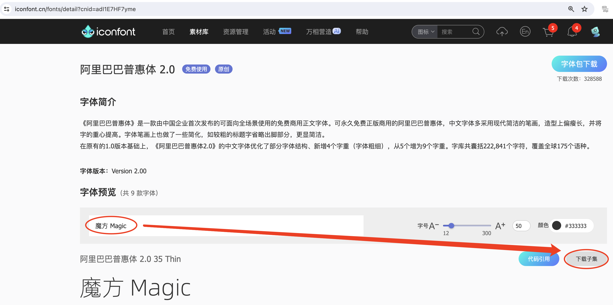

:source-highlighter: pygments
:icons: font
:scripts: cjk
:stem: latexmath
:toc:
:toc: right
:toc-title: Table of Contents
:toclevels: 4

= Nuxt Notes

++++
<button id="toggleButton">Table of Contents</button>
<script>
    // 获取按钮和 div 元素
    const toggleButton = document.getElementById('toggleButton');
    const contentDiv = document.getElementById('toc');
    contentDiv.style.display = 'block';

    // 添加点击事件监听器
    toggleButton.addEventListener('click', () => {
        // 切换 div 的显示状态
        // if (contentDiv.style.display === 'none' || contentDiv.style.display === '') {
        if (contentDiv.style.display === 'none') {
            contentDiv.style.display = 'block';
        } else {
            contentDiv.style.display = 'none';
        }
    });
</script>
++++

== @file pnpm-workspace.yaml
[source,yaml]
----
packages:
  - 'nuxt3-basic'
  - 'nuxt3-element-plus'
  - 'nuxt3-layout'
  - 'nuxt3-tailwindcss'
  - 'nuxt3-font'
  - 'nuxt3-component'
  - 'nuxt3-sitemap'
  - 'nuxt3-sqlite'
  - 'nuxt3-slug'
  - 'nuxt3-server'

----

== @path nuxt3-basic
这是本来就有的 origin/main 分支。

=== github link
https://github.com/wangzhaohe/nuxt3-basic.git

=== Create a new project
https://nuxt.com/docs/getting-started/installation#new-project

Prepare Directory

    mkdir -p nuxt/nuxt3

IMPORTANT: nuxt3-basic 作为最基本的项目目录，后面会使用 `git worktree` 把不同分支的目录放在 nuxt3目录下，它们和 nuxt3-basic 在同级目录下。这样后面再有 nuxt4 的项目，也可以放在 nuxt 目录下，和 nuxt3 目录平行放置。


Create a new nuxt3 project

    cd nuxt/nuxt3
    pnpm create nuxt nuxt3-basic


.Install some recommended library
....
> pnpm create nuxt nuxt3-basic

        .d$b.
       i$$A$$L  .d$b
     .$$F` `$$L.$$A$$.
    j$$'    `4$$:` `$$.
   j$$'     .4$:    `$$.
  j$$`     .$$:      `4$L
 :$$:____.d$$:  _____.:$$:
 `4$$$$$$$$P` .i$$$$$$$$P`

ℹ Welcome to Nuxt!                                                                                                                                nuxi 11:13:07 AM
ℹ Creating a new project in nuxt3-basic.                                                                                                          nuxi 11:13:07 AM

✔ Which package manager would you like to use?
pnpm
◐ Installing dependencies...                                                                                                                       nuxi 11:13:09 AM
 WARN  9 deprecated subdependencies found: @types/parse-path@7.1.0, are-we-there-yet@2.0.0, gauge@3.0.2, glob@7.2.3, glob@8.1.0, inflight@1.0.6, node-domexception@1.0.0, npmlog@5.0.1, rimraf@3.0.2
Packages: +763

Progress: resolved 836, reused 757, downloaded 11, added 763, done

> nuxt-app@ postinstall /Users/swot/swot-learning/nuxt/nuxt3/nuxt3-basic
> nuxt prepare

✔ Types generated in .nuxt                                                                                                                        nuxi 11:13:21 AM

dependencies:
+ nuxt 3.17.4
+ vue 3.5.14
+ vue-router 4.5.1

Done in 11.6s
✔ Installation completed.                                                                                                                         nuxi 11:13:21 AM

✔ Initialize git repository?
Yes
ℹ Initializing git repository...                                                                                                                  nuxi 11:13:25 AM

hint: Using 'master' as the name for the initial branch. This default branch name
hint: is subject to change. To configure the initial branch name to use in all
hint: of your new repositories, which will suppress this warning, call:
hint:
hint: 	git config --global init.defaultBranch <name>
hint:
hint: Names commonly chosen instead of 'master' are 'main', 'trunk' and
hint: 'development'. The just-created branch can be renamed via this command:
hint:
hint: 	git branch -m <name>
Initialized empty Git repository in /Users/swot/swot-learning/nuxt/nuxt3/nuxt3-basic/.git/

✔ Would you like to install any of the official modules?
@nuxt/eslint – Project-aware, easy-to-use, extensible and future-proof ESLint integration, @nuxt/fonts – Add custom web fonts with performance in mind, @nuxt/icon –
Icon module for Nuxt with 200,000+ ready to use icons from Iconify, @nuxt/image – Add images with progressive processing, lazy-loading, resizing and providers
support, @nuxt/scripts – Add 3rd-party scripts without sacrificing performance, @nuxt/ui – The Intuitive UI Library powered by Reka UI and Tailwind CSS
ℹ Resolved @nuxt/icon, @nuxt/image, @nuxt/scripts, @nuxt/ui, @nuxt/fonts, @nuxt/eslint, adding modules...                                         nuxi 11:16:40 AM
ℹ Installing @nuxt/icon@1.13.0, @nuxt/image@1.10.0, @nuxt/scripts@0.11.7, @nuxt/ui@3.1.2, @nuxt/fonts@0.11.4, @nuxt/eslint@1.4.1 as dependencies  nuxi 11:16:40 AM
 WARN  9 deprecated subdependencies found: @types/parse-path@7.1.0, are-we-there-yet@2.0.0, gauge@3.0.2, glob@7.2.3, glob@8.1.0, inflight@1.0.6, node-domexception@1.0.0, npmlog@5.0.1, rimraf@3.0.2
Packages: +271
+++++++++++++++++++++++++++++++++++++++++++++++++++++++++++++++++++++++++++++++++++++++++++++++++++++++++++++++++++++++++++++++++++++++++++++++++++++++++++++++++++
Progress: resolved 1129, reused 1022, downloaded 3, added 271, done

dependencies:
+ @nuxt/eslint 1.4.1
+ @nuxt/fonts 0.11.4
+ @nuxt/icon 1.13.0
+ @nuxt/image 1.10.0
+ @nuxt/scripts 0.11.7
+ @nuxt/ui 3.1.2

Done in 19.8s
 WARN  9 deprecated subdependencies found: @types/parse-path@7.1.0, are-we-there-yet@2.0.0, gauge@3.0.2, glob@7.2.3, glob@8.1.0, inflight@1.0.6, node-domexception@1.0.0, npmlog@5.0.1, rimraf@3.0.2
Already up to date
Progress: resolved 1129, reused 1025, downloaded 0, added 0, done

dependencies:
+ @unhead/vue ^2.0.3
+ eslint ^9.0.0
+ typescript ^5.6.3

Done in 3s
ℹ Adding @nuxt/icon to the modules                                                                                                                nuxi 11:17:03 AM
ℹ Adding @nuxt/image to the modules                                                                                                               nuxi 11:17:03 AM
ℹ Adding @nuxt/scripts to the modules                                                                                                             nuxi 11:17:03 AM
ℹ Adding @nuxt/ui to the modules                                                                                                                  nuxi 11:17:03 AM
ℹ Adding @nuxt/fonts to the modules                                                                                                               nuxi 11:17:03 AM
ℹ Adding @nuxt/eslint to the modules                                                                                                              nuxi 11:17:03 AM
✔ ESLint config file created at /Users/swot/swot-learning/nuxt/nuxt3/nuxt3-basic/eslint.config.mjs                                                     11:17:05 AM
ℹ If you have .eslintrc or .eslintignore files, you might want to migrate them to the new config file                                                  11:17:05 AM
ℹ Nuxt Icon server bundle mode is set to local                                                                                                         11:17:05 AM
✔ Types generated in nuxt3-basic/.nuxt                                                                                                            nuxi 11:17:08 AM
                                                                                                                                                   nuxi 11:17:08 AM
✨ Nuxt project has been created with the v3 template. Next steps:
 › cd nuxt3-basic                                                                                                                                  nuxi 11:17:08 AM
 › Start development server with pnpm run dev
....

=== install packages
I like pug, so add it.

    pnpm add pug

=== @file nuxt.config.ts
[source,javascript,]
----
// https://nuxt.com/docs/api/configuration/nuxt-config
export default defineNuxtConfig({
    compatibilityDate: '2025-05-15',
    devtools: { enabled: true },

    modules: [
        '@nuxt/icon',
        '@nuxt/image',
        '@nuxt/scripts',
        '@nuxt/ui',
        '@nuxt/fonts',
        '@nuxt/eslint'
    ],
    @others
});
----

==== 1 关闭默认的 google 访问设置
[source,javascript,]
----
// 因为默认会使用 google 的字体和图标，但是 node.js 不会走代理，可能访问不到 google 网站。

// @nuxt/fonts 不使用 google fonts
fonts: {
    provider: 'none', // 禁用默认字体提供商（如 Google Fonts）
},

// Nuxt UI 就不会再尝试加载 Google Fonts
ui: {
    fonts: false
},
----

== @path nuxt3-layout
Add worktree nuxt3-layout

    git worktree add -b nuxt3-layout ../nuxt3-layout origin/main
    git push -u origin nuxt3-layout

=== github link
https://github.com/wangzhaohe/nuxt3-basic/tree/nuxt3-layout

=== pug 语法介绍
模板使用了 pug 格式，优点是不用再写结束标签了。以缩进作为层级，类似于 python 语言。

https://pugjs.org/api/getting-started.html

安装 pug

    pnpm add -D pug

=== @file app.vue
[source,typescript]
----
<template lang="pug">
    NuxtLayout
        NuxtPage
</template>
----

== @path nuxt3-element-plus
Add worktree nuxt3-element-plus

    git worktree add -b nuxt3-element-plus ../nuxt3-element-plus
    git push -u origin nuxt3-element-plus

[IMPORTANT]
====
一定要注意是从哪个分支创建的，实在不放心就直接指定分支来源吧。
比如从 origin/nuxt3-layout 来创建新的 worktree

    git worktree add -b nuxt3-element-plus ../nuxt3-element-plus origin/nuxt3-layout
====

=== Install
Video: https://www.bilibili.com/video/BV1G14y1z7KF/?spm_id_from=333.337.search-card.all.click&vd_source=392e2829ea8e40de989be86888026747[安装和使用Element Plus组件库] | 
https://www.bilibili.com/video/BV1pd4y1W7eX/?spm_id_from=333.788&vd_source=392e2829ea8e40de989be86888026747[水哥澎湃]

文档: https://nuxt.com/modules/element-plus?[官网详细安装说明]

.安装命令
[source,sql]
----
pnpm i element-plus @element-plus/nuxt -D
----

NOTE: -D 可以作为开发依赖，因为在 build 时会自动收集相关信息

=== @file nuxt.config.ts
[source,javascript,]
----
// https://nuxt.com/docs/api/configuration/nuxt-config
export default defineNuxtConfig({
    compatibilityDate: '2025-05-15',
    devtools: { enabled: true },

    modules: [
        '@nuxt/icon',
        '@nuxt/image',
        '@nuxt/scripts',
        '@nuxt/ui',
        '@nuxt/fonts',
        '@nuxt/eslint',
        '@element-plus/nuxt'    // new
    ],
    elementPlus: { /** Options */ },
    @others
});
----

==== 1 关闭默认的 google 访问设置
[source,javascript,]
----
/* 因为默认会使用 google 的字体和图标，
   但是 node.js 不会走代理，可能访问不到 google 网站
*/

// @nuxt/fonts 不使用 google fonts
fonts: {
    provider: 'none', // 禁用默认字体提供商（如 Google Fonts）
},

// Nuxt UI 就不会再尝试加载 Google Fonts
ui: {
    fonts: false
},
----

=== @file pages/elementPlus.vue


==== template
[source,typescript]
----
<template lang="pug">
div
    el-button(@click="ElMessage('hello')") button

    ElButton(:icon="ElIconEditPen" type="success") button

    LazyElButton(type="warning") lazy button

    el-icon
        ElIconDeleteFilled

    el-date-picker(
        v-model="date"
        type="date"
        placeholder="选择日期"
    )

    el-table.mb-1(:data="[]")
    el-pagination(:total="100")
</template>
----

==== script
[source,typescript]
----
<script setup lang="ts">
    const date = ref('')
</script>
----

=== element-plus I18N support
https://element-plus.org/zh-CN/guide/i18n.html#configprovider

ConfigProvider 方式

==== @file app.vue


===== template
[source,typescript]
----
<template lang="pug">
NuxtLayout
    div
        //- 这一行应该可以放在 layout 文件中，现在只是一个测试而已
        el-button.mb-2(@click="toggle") Switch Language
        p
        el-config-provider(:locale="locale")
            NuxtPage
</template>
----

===== script
[source,typescript]
----
<script setup lang="ts">

import zhCn from 'element-plus/es/locale/lang/zh-cn'
import en   from 'element-plus/es/locale/lang/en'

const language = ref('zh-cn')

// eslint-disable-next-line @typescript-eslint/no-unused-vars
const locale = computed(() => (
    language.value === 'zh-cn' ? zhCn : en))

// eslint-disable-next-line @typescript-eslint/no-unused-vars
const toggle = () => {
    language.value = language.value === 'zh-cn' ? 'en' : 'zh-cn'
}

</script>
----

=== 报错或警告处理


==== dayjs/dayjs.min.js does not provide an export named 'default'
这是安装命令:

    pnpm i element-plus @element-plus/nuxt -D

在安装完 element-plus 后报错:

.报错提示
....
[Bug Report] [All] Uncaught SyntaxError: The requested module '/_nuxt/node_modules/dayjs/dayjs.min.js?v=391d0c11' does not provide an export named 'default' (at picker2.mjs?v=391d0c11:2:8)
....


在网上查找解决方法为：
https://github.com/element-plus/element-plus/issues/8165

实际解决方法为: pnpm install dayjs

==== Extraneous non-props attributes (data-v-inspector) were passed to component
https://github.com/element-plus/element-plus/issues/18213

```xml
<NuxtLayout>
    <!-- elementUI plus 支持中文 -->
    <el-config-provider :locale="zhCn">
        <NuxtPage />
    </el-config-provider>
</NuxtLayout>
```

如上面 element-plus 设置中文后，如果在页面(pages/)中再使用组件，则会报警告如下:

> WARN  [Vue warn]: Extraneous non-props attributes (data-v-inspector) were passed to component but could not be automatically inherited because component renders fragment or text or teleport root nodes. 
  at <ElConfigProvider locale= { name: 'zh-cn',
  el:


##解决方法：在 nuxt.config.ts 中临时禁用 componentInspector 功能##

```javascript
export default defineNuxtConfig({
  devtools: {
    enabled: true,
    componentInspector: false
  },
})
```

== @path nuxt3-tailwindcss
Add worktree nuxt3-tailwindcss

    cd nuxt3-basic
    git worktree add -b nuxt3-tailwindcss ../nuxt3-tailwindcss origin/nuxt3-layout
    // 修改之后提交代码
    git push -u origin nuxt3-tailwindcss

=== Some Urls
https://nuxt.com/modules/tailwindcss
目前我没有使用该 @nuxtjs/tailwindcss（集成的是 tailwindcss3），因为 NuxtUI 集成了 tailwindcss4，就不用再单独安装了。

Official Website: https://tailwindcss.com/blog

中文网: https://tailwind.nodejs.cn/docs/installation +
中文网的版本默认是 4.1 2025-05-22 12:50:32

基于 tailwind 开发的 UI https://flowbite.com/ +
感觉很强

基于 tailwind 开发的 UI 特效库 +
https://inspira-ui.com/getting-started/installation +
特别酷

Tailwind CSS Start to Mastery with 18 Project Examples 2024 +
https://www.bilibili.com/video/BV1f2zqYCE84 +
https://github.com/emmanuelbakare/Mastering-Tailwind-CSS-with-Project-Examples +
感觉这个课程挺适合我的，坚持看完了，英语听力长了。

=== VSCode plugins
vscode install plugin: Tailwind CSS IntelliSense (vscode 的智能提示，需要配置如下)

.在项目的根目录 `.vscode/settings.json` 中添加以下内容
[source,json]
----
{
  "files.associations": {
    "*.css": "tailwindcss"
  },
  "editor.quickSuggestions": {
    "strings": "on"
  },
  "tailwindCSS.classAttributes": ["class", "ui"],
  "tailwindCSS.experimental.classRegex": [
    ["ui:\\s*{([^)]*)\\s*}", "(?:'|\"|`)([^']*)(?:'|\"|`)"]
  ]
}
----

ref: https://ui.nuxt.com/getting-started/installation/nuxt#import-tailwind-css-and-nuxt-ui-in-your-css

=== Install
https://ui.nuxt.com/getting-started/installation/nuxt

使用 NuxtUI 的安装配置就可以了。

=== @file nuxt.config.ts
[source,typescript]
----
// https://nuxt.com/docs/api/configuration/nuxt-config
export default defineNuxtConfig({
    compatibilityDate: '2025-05-15',
    devtools: { enabled: true },

    modules: [
        '@nuxt/icon',
        '@nuxt/image',
        '@nuxt/scripts',
        '@nuxt/ui',                  // new
        '@nuxt/fonts',
        '@nuxt/eslint',
    ],
    css: ['~/assets/css/main.css'],  // new
    @others
})
----

==== 1 关闭默认的 google 访问设置
[source,javascript]
----
/* 因为默认会使用 google 的字体和图标，
   但是 node.js 不会走代理，可能访问不到 google 网站
*/

// @nuxt/fonts 不使用 google fonts
fonts: {
    provider: 'none', // 禁用默认字体提供商（如 Google Fonts）
},

ui: {
    // Nuxt UI 就不会再尝试加载 Google Fonts
    fonts: false,
},
----

=== @file assets/css/main.css
[source,scss]
----
@import "tailwindcss";
@import "@nuxt/ui";
----

=== @file pages/easy_example.vue
[source,typescript]
----
<template lang="pug">
div(class="text-3xl text-white bg-green-500 p-6 rounded shadow")
    | Tailwind 样式现在已生效
</template>
----

== @path nuxt3-font
Add worktree nuxt3-font

    cd nuxt3-basic
    git worktree add -b nuxt3-font ../nuxt3-font origin/nuxt3-layout
    // 修改之后提交代码
    git push -u origin nuxt3-font

=== Nuxt3 字体引用《阿里巴巴普惠体》


==== 安装字体
官网: https://www.iconfont.cn/fonts/detail?cnid=adI1E7HF7yme

1. 字体最好使用 .woff2 字体，很小，加载快。将字体放入 `public/fonts/` 目录下。
+
[source,console]
----
tree public/fonts                                         
public/fonts
├── PuHuiTi-Thin.woff
└── PuHuiTi-Thin.woff2
----
+
.阿里巴巴普惠字体2.0 下载子集是 .woff&.woff2 字体，且下载的只是在 input 框中输入的字



2. 配置 main.scss 引入字体《阿里巴巴普惠体》

3. 配置 nuxt.config.ts 全局加载 main.scss 文件

===== @file assets/css/main.css
[source,scss]
----
/* sass 不支持 @import 了 */
@import "tailwindcss";
@import "@nuxt/ui";

/* 引入字体《阿里巴巴普惠体》 -- new */
@font-face {
    font-family: "PuHuiTi-Thin";
    src: url("/fonts/PuHuiTi-Thin.woff2") format("woff2"),
         url("/fonts/PuHuiTi-Thin.woff") format("woff");
    font-weight: 250;
    font-display: swap;
}

/* tailwind 工具类来使用指定的字体，会被全局使用 */
@theme {
    --font-sans: "PuHuiTi-Thin", sans-serif;
}
----

===== @file assets/css/main.scss


====== reset browser default css -> 若用 tailwindcss 则不用设置默认值
[source,scss]
----
* {
    box-sizing: border-box;
    padding: 0;
    margin: 0;
}

html {
    font-size: 62.5%;
}

a {
    text-decoration: none;
    display: inline-block;
}

ul, ol {
    list-style: none;
}
----

===== @file nuxt.config.ts
[source,javascript,]
----
// https://nuxt.com/docs/api/configuration/nuxt-config
export default defineNuxtConfig({
    compatibilityDate: '2025-05-15',
    devtools: { enabled: true },

    modules: [
        '@nuxt/icon',
        '@nuxt/image',
        '@nuxt/scripts',
        '@nuxt/ui',
        '@nuxt/fonts',
        '@nuxt/eslint'
    ],
    @others
});
----

====== 1 关闭默认的 google 访问设置
[source,javascript,]
----
/* 因为默认会使用 google 的字体和图标，
   但是 node.js 不会走代理，可能访问不到 google 网站
*/

// @nuxt/fonts 不使用 google fonts
fonts: {
    provider: 'none', // 禁用默认字体提供商（如 Google Fonts）
},

// Nuxt UI 就不会再尝试加载 Google Fonts
ui: {
    fonts: false
},
----

====== 2 全局加载 css 文件 -- new
[source,typescript]
----
css: [
    "~/assets/css/main.scss",
    "~/assets/css/main.css",
],
----

==== 使用字体


===== @file pages/tailwind/font_example.vue
[source,html]
----
<template lang="pug">
    div
        div 在下载《阿里巴巴普惠体》时，只选择了 魔方 Magic，所以其他字无效果
        br
        div(class="text-3xl bg-red-400") Hello World (该行无效果)
        br
        p 使用《阿里巴巴普惠体》 (该行无效果，下面的行都有效果)
        div(class="font-sans text-3xl") 魔方 Magic
        div(class="text-4xl") 魔方 Magic  (不指定 font-sans 也有效果，因为是全局的)
        div(class="font-sans text-4xl") 魔方 Magic
        div(class="font-sans text-5xl") 魔方 Magic
</template>
----

== @path nuxt3-component
Add worktree nuxt3-component

    cd nuxt3-basic
    git worktree add -b nuxt3-component ../nuxt3-component origin/nuxt3-tailwindcss
    // 修改之后提交代码
    git push -u origin nuxt3-component

=== @file assets/css/main.css
[source,scss]
----
@import "tailwindcss";
@import "@nuxt/ui";

/* 自定义 hover 效果的工具类 目前写在 vue 的 <style scoped> 中不支持 */
@utility link-hover {
    @apply hover:text-white hover:underline;
}
----

=== Web Footer 页脚开发


==== @file pages/footer.vue
[source,scss]
----
<template lang="pug">
div
    Footer
</template>

<script setup>
</script>
----

==== @file components/Footer.vue
网站底部组件

===== template
[source,scss]
----
<template lang="pug">
    footer.bg-gray-800.text-gray-300.py-8.px-4
        div.container.mx-auto
            @others
</template>
----

====== 1. footer__top
[source,scss]
----
section.flex.flex-wrap.justify-between
    @others
----

======= 1.1 服务链接
[source,scss]
----
nav.w-full(class="md:w-1/4")

    h6.font-bold.mb-4.text-gray-400
        | Services

    ul(class="space-y-2")
        li
            NuxtLink(to="/" class="link-hover")
                | Shop & Contact
        li
            NuxtLink(to="/" class="link-hover")
                | Return & Refund
        li
            NuxtLink(to="/" class="link-hover")
                | Online Store
        li
            NuxtLink(to="/" class="link-hover")
                | Terms & Conditions
----

======= 1.2 关于我们
[source,scss]
----
nav.w-full(class="md:w-1/4")

    h6.font-bold.mb-4.text-gray-400
        | About Us

    ul.space-y-2
        li
            NuxtLink(to="/" class="link-hover")
                | Our Story
        li
            NuxtLink(to="/" class="link-hover")
                | Blog
        li
            NuxtLink(to="/" class="link-hover")
                | Contact Us
----

======= 1.3 社交媒体链接
[source,scss]
----
nav.w-full(class="md:w-1/4")

    h6.font-bold.mb-4.text-gray-400
        | Follow Us

    ul.space-y-2
        li
            a(href="#" class="link-hover")
                | Facebook
        li
            a(href="#" class="link-hover")
                | Instagram
        li
            a(href="#" class="link-hover")
                | Twitter
----

======= 1.4 新闻订阅
[source,scss]
----
div.w-full(class="md:w-1/4")

    h6.font-bold.mb-4.text-gray-400
        | Subscribe

    form.flex.flex-col
        input(
            type="email" placeholder="Enter your email"
            class="bg-gray-700 text-gray-300 \
                   border border-gray-600 rounded-md p-2 mb-2"
        )
        button(
            type="submit"
            class="bg-blue-500 hover:bg-blue-600 text-white font-bold \
                   py-2 px-4 rounded-md"
        )
            | Subscribe
----

====== 2. footer__bottom 底部版权信息
[source,scss]
----
section.mt-8.text-center.text-gray-400
    p
        | &copy; 2025 Swotpp. All Rights Reserved
----

===== script
[source,scss]
----
<script setup lang="ts"></script>
----

=== Web CookieConsent 许可页面开发
有 CookieConsent 的参考页面

. https://www.qlik.com/us/pricing/data-integration-products-pricing

==== @file pages/cookie.vue
测试调用组件 CookieConsent.vue

[source,scss]
----
<template lang="pug">
    div
        CookieConsent
</template>

<script></script>
----

==== @file components/CookieConsent.vue
这是一个在页脚显示的 cookies 授权组件。

===== template
[source,scss]
----
<template lang="pug">
UApp
    @others
</template>
----

====== 1 Cookie Consent Modal
[source,scss]
----
div(
    v-if="cookieConsentModalIsVisible"
    class="flex flex-col justify-between \
           fixed bottom-5 left-5 p-5 \
           w-11/12 sm:w-4/5 md:w-3/5 \
           bg-white rounded-lg shadow-lg z-50"
)
    div.flex.justify-between.items-center.mb-2
        h2.m-0.text-lg.leading-tight
            | Manage Cookie Consent
        UButton(
            :padded="false"
            color="neutral"
            size="sm"
            variant="soft"
            icon="i-heroicons-x-mark-20-solid"
            @click="cookieConsentModalIsVisible = false"
        )

    p.text-sm.mb-5.leading-normal
        | Cookies give you a personalized experience. 
        | Cookie files help us to enhance your experience using our website, 
        | simplify navigation, keep our website safe and assist in our marketing efforts. 
        | For more information, review our 
        a#cookiePolicyLink.text-blue-500.no-underline(
            href="#"
            @click="cookiePolicyModalIsVisible = true"
        ) Cookie Policy.

    div.flex.justify-end.items-center.gap-2
        UButton(label="Accept" color="secondary" @click="acceptCookieConsent")
        UButton(label="Deny"   color="neutral"   @click="denyCookieConsent")
        UButton(label="Adjust" color="neutral"   @click="cookieSettingsModalIsVisible = true")
----

====== 2 Cookie Policy Modal
[source,scss]
----
div(
    v-if="cookiePolicyModalIsVisible"
    class="fixed z-50 left-0 top-0 w-full h-full \
           overflow-auto bg-black bg-opacity-50 \
           justify-center items-center"
)
    div(
        class="bg-white mx-auto my-20 p-2 \
               border border-gray-300 \
               w-11/12 max-w-lg rounded-lg"
    )
        UCard
            template(#header)
                div(class="flex justify-between items-center")
                    h2.m-0.text-lg.leading-none
                        | Cookie Policy
                    UButton(
                        :padded="false"
                        color="neutral"
                        size="sm"
                        variant="soft"
                        icon="i-heroicons-x-mark-20-solid"
                        @click="cookiePolicyModalIsVisible = false")

            p.pb-2
                | Types of cookies:
            ul
                li(class="flex flex-col sm:flex sm:flex-row sm:gap-2")
                    strong Necessary cookies:
                    span Essential for website functionality.
                li(class="flex flex-col sm:flex sm:flex-row sm:gap-2")
                    strong Preferences cookies:
                    span Remember your settings.
                li(class="flex flex-col sm:flex sm:flex-row sm:gap-2")
                    strong Statistics cookies:
                    span Help us improve our site.
                li(class="flex flex-col sm:flex sm:flex-row sm:gap-2")
                    strong Marketing cookies:
                    span Used for personalized advertising.

            template(#footer)
                p
                    | We use cookies to improve our services and customize your experience. 
                    | You can control the use of cookies through your browser settings and change your preferences at any time.
----

====== 3 Cookie Settings Modal
[source,scss]
----
div(v-if="cookieSettingsModalIsVisible"
    class="fixed z-50 left-0 top-0 w-full h-full overflow-auto bg-black bg-opacity-50 justify-center items-center")
    div(class="bg-white mx-auto my-20 p-2 border border-gray-300 w-11/12 max-w-lg rounded-lg")
        UCard
            template(#header)
                div(class="flex justify-between items-center")
                    h2(class="m-0 text-lg leading-tight")
                        | Cookie Settings
                    UButton(
                        :padded="false"
                        color="neutral"
                        size="sm"
                        variant="soft"
                        icon="i-heroicons-x-mark-20-solid"
                        @click="cookieSettingsModalIsVisible = false"
                    )
            form(id="cookieSettingsForm" @submit.prevent="saveCookieSettings")
                div(class="flex justify-between items-center mb-2")
                    label(for="necessaryCookies" class="mr-2") Necessary Cookies
                    input(
                        type="checkbox" id="necessaryCookies" name="necessaryCookies" class="h-5 w-5 accent-blue-600"
                        v-model="necessaryCookies"
                    )
                div(class="flex justify-between items-center mb-2")
                    label(for="preferencesCookies" class="mr-2") Preferences Cookies
                    input(
                        type="checkbox" id="preferencesCookies" name="preferencesCookies" class="h-5 w-5 accent-blue-600"
                        v-model="preferencesCookies"
                    )
                div(class="flex justify-between items-center mb-2")
                    label(for="statisticsCookies" class="mr-2") Statistics Cookies
                    input(
                        type="checkbox" id="statisticsCookies" name="statisticsCookies" class="h-5 w-5 accent-blue-600"
                        v-model="statisticsCookies"
                    )
                div(class="flex justify-between items-center mb-2")
                    label(for="marketingCookies" class="mr-2") Marketing Cookies
                    input(
                        type="checkbox" id="marketingCookies" name="marketingCookies" class="h-5 w-5 accent-blue-600"
                        v-model="marketingCookies"
                    )
                UButton(label="Save" color="secondary" type="submit" block class="mt-5")
----

===== script
[source,scss]
----
<script setup lang="ts">
</script>
----

====== ref var
[source,javascript,]
----
// flags used by v-if
const cookieConsentModalIsVisible = ref(false);
const cookiePolicyModalIsVisible = ref(false);
const cookieSettingsModalIsVisible = ref(false);

// 5 cookies
const maxAge = 60 * 60 * 24 * 30; // 30 days in seconds
const necessaryCookies = useCookie('necessaryCookies', { maxAge });
const preferencesCookies = useCookie('preferencesCookies', { maxAge });
const statisticsCookies = useCookie('statisticsCookies', { maxAge });
const marketingCookies = useCookie('marketingCookies', { maxAge });
const cookieConsent = useCookie('cookieConsent', { maxAge });

if (cookieConsent.value &&
   ['accepted', 'denied', 'partial'].includes(cookieConsent.value)) {
    cookieConsentModalIsVisible.value = false;
} else {
    cookieConsentModalIsVisible.value = true;
}
----

====== accept & deny
[source,javascript,]
----
const acceptCookieConsent = () => {
    cookieConsent.value = 'accepted';
    cookieConsentModalIsVisible.value = false;
};

const denyCookieConsent = () => {
    cookieConsent.value = 'denied';
    cookieConsentModalIsVisible.value = false;
};
----

====== saveCookieSettings
[source,javascript,]
----
// will be called by saveCookieSettings
const saveCookieConsent = () => {
    // 从 Adjust 选项来关联 cookieConsent 的三种情况
    // 1. 如果都选择 cookieConsent 设置为 accepted
    // 2. 如果都不选择 cookieConsent 设置为 denied
    // 3. 只选择部分 cookieConsent 设置为 partial
    const consent = [necessaryCookies.value, preferencesCookies.value, statisticsCookies.value, marketingCookies.value];
    const accepted = consent.every((value) => value);
    const denied = consent.every((value) => !value);
    cookieConsent.value = accepted ? 'accepted' : denied ? 'denied' : 'partial';
    cookieConsentModalIsVisible.value = false;
};

const saveCookieSettings = () => {
    // Save cookie settings
    necessaryCookies.value = necessaryCookies.value;
    preferencesCookies.value = preferencesCookies.value;
    statisticsCookies.value = statisticsCookies.value;
    marketingCookies.value = marketingCookies.value;

    cookieSettingsModalIsVisible.value = false;  // Close cookie settings modal
    saveCookieConsent();  // Update cookie consent based on the above settings
};
----

== @path nuxt3-sitemap
Add worktree nuxt3-sitemap

    cd nuxt3-basic
    git worktree add -b nuxt3-sitemap ../nuxt3-sitemap origin/main
    // 修改之后提交代码
    git push -u origin nuxt3-sitemap

=== 静态书写 sitemap -> 需要手动更新内容
在 Nuxt 中，sitemap.xml 和 sitemap.xsl 文件应该放在 `public/` 目录下。

`public/` 目录用于存放网站的静态资源，这些文件会在根目录下直接提供服务，并且在构建过程中不会被修改。这非常适合那些需要保持原始文件名的文件（如 `robots.txt`）或不太可能更改的文件（如 `favicon.ico`）。

目录结构示例：
```
-| public/
---| favicon.ico
---| sitemap.xml
---| sitemap.xsl
---| robots.txt
```

这些文件将直接在您的网站根目录下可访问，例如：`https://yoursite.com/sitemap.xml`。

[Nuxt 文档 - public 目录](https://nuxt.com/docs/guide/directory-structure/public)

*如果您使用 `@nuxtjs/sitemap` 模块来自动生成站点地图，那么您不需要手动创建这些文件，因为模块会自动生成并放置在正确的位置。*

如果您使用 Nuxt 4 的新目录结构，`public/` 目录仍然是位于项目根目录下，而不是在 `app/` 目录内。

==== @file public/sitemap.xml
[source,xml]
----
<?xml version="1.0" encoding="UTF-8"?>
<?xml-stylesheet type="text/xsl" href="http://localhost:3000/sitemap.xsl"?>
<urlset xmlns="http://www.sitemaps.org/schemas/sitemap/0.9">
	<url>
		<loc>https://www.swotpp.com/sitemap_addl.xml</loc>
	</url>
	<url>
		<loc>https://www.swotpp.com/sitemap_post_1.xml</loc>
		<priority>0.9</priority>
		<changefreq>weekly</changefreq>
	</url>
	<url>
		<loc>https://www.swotpp.com/sitemap_post_2.xml</loc>
		<priority>0.9</priority>
		<changefreq>weekly</changefreq>
	</url>
	<url>
		<loc>https://www.swotpp.com/sitemap_page.xml</loc>
		<priority>0.9</priority>
		<changefreq>weekly</changefreq>
	</url>
	<url>
		<loc>https://www.swotpp.com/sitemap_news.xml</loc>
		<priority>0.9</priority>
		<changefreq>weekly</changefreq>
	</url>
	<url>
		<loc>https://www.swotpp.com/sitemap_project.xml</loc>
		<priority>0.9</priority>
		<changefreq>weekly</changefreq>
	</url>
	<url>
		<loc>https://www.swotpp.com/sitemap_category.xml</loc>
		<priority>0.8</priority>
		<changefreq>weekly</changefreq>
	</url>
	<url>
		<loc>https://www.swotpp.com/sitemap_post_tag.xml</loc>
		<priority>0.8</priority>
		<changefreq>weekly</changefreq>
	</url>
	<url>
		<loc>https://www.swotpp.com/sitemap_project_catalog.xml</loc>
		<priority>0.8</priority>
		<changefreq>weekly</changefreq>
	</url>
</urlset><!-- permalink_structure ends with slash (/) but REQUEST_URI does not end with slash (/) -->
----

=== 动态生成 sitemap
V7.3.0 https://nuxtseo.com/docs/sitemap/getting-started/installation

.install
[source,console]
----
pnpm i @nuxtjs/sitemap
----

.vim nuxt.config.ts
[source,javascript]
----
export default defineNuxtConfig({
  modules: [
    '@nuxtjs/sitemap',
  ],
})
----

visit result: http://localhost:3000/sitemap.xml

***

目前是静态的, 动态网站则需使用 sources，参考
https://nuxtseo.com/docs/sitemap/guides/dynamic-urls#_2-create-your-own-endpoint

    sitemap: {
        sources: [
            '/api/__sitemap__/urls',
        ]
    },

==== @file nuxt.config.ts
[source,javascript,]
----
// https://nuxt.com/docs/api/configuration/nuxt-config
export default defineNuxtConfig({
    compatibilityDate: '2025-05-15',
    devtools: { enabled: true },

    modules: [
        '@nuxt/icon',
        '@nuxt/image',
        '@nuxt/scripts',
        '@nuxt/ui',
        '@nuxt/fonts',
        '@nuxt/eslint',
        '@nuxtjs/sitemap',  // new
    ],
    @others
});
----

===== 1 关闭默认的 google 访问设置
[source,javascript,]
----
/* 因为默认会使用 google 的字体和图标，
   但是 node.js 不会走代理，可能访问不到 google 网站
*/

// @nuxt/fonts 不使用 google fonts
fonts: {
    provider: 'none', // 禁用默认字体提供商（如 Google Fonts）
},

// Nuxt UI 就不会再尝试加载 Google Fonts
ui: {
    fonts: false
},
----

==== @file app.vue
[source,xml]
----
<template>
  <div>
    <NuxtPage />
  </div>
</template>
----

==== @file pages/test-sitemap1.vue
[source,xml]
----
<template>
    This is page test-sitemap1
</template>
----

==== @file pages/test-sitemap2.vue
[source,xml]
----
<template>
    This is page test-sitemap2
</template>
----

== @path nuxt3-sqlite
Add worktree nuxt3-sqlite

    cd nuxt3-basic
    git worktree add -b nuxt3-sqlite ../nuxt3-sqlite origin/main
    // 修改之后提交代码
    git push -u origin nuxt3-sqlite

=== Install knex & sqlite3
在 Nuxt3 项目中使用 `Knex.js` 连接 `SQLite` 数据库是完全可行的，尤其适合轻量级项目或本地开发。

    // pnpm add knex sqlite3   sqlite3 需要编译，很麻烦
    pnpm add knex better-sqlite3

=== @file knexfile.js
[source,typescript]
----
import betterSqlite3 from 'better-sqlite3';

const shared = {
    client: 'better-sqlite3',
    driver: betterSqlite3,
    useNullAsDefault: true,
    migrations: {
        directory: './migrations'
    },
    seeds: {
        directory: './data/seeds'
    }
};

const development = {
    ...shared,
    connection: {
        filename: './data/dev.sqlite'
    }
};

const production = {
    ...shared,
    connection: {
        filename: './data/prod.sqlite'
    }
};

// CLI 要求使用默认导出方式
export default {
    development,
    production
};

----

==== doc
1. 生成 knexfile.js 配置文件
   * 执行 `knex init` 生成一个 knexfile.js 配置文件，用于定义数据库连接信息。
   * 只需要执行一次即可，实际上自己手动创建个 knexfile.js 文件就行了。

2. 迁移命令：
   * 生成迁移文件

        knex migrate:make create_users_table
        # 生成迁移文件并补充完整内容，migrations 目录会自动生成
        # 例如 migrations/20250322014847_create_users_table.js

   * 创建数据库 sqlite 存放的目录 data

        mkdir data
        knex migrate:latest
        # 自动生成数据库文件 data/dev.sqlite
        # 查看数据库中已经生成了表 users

=== @file migrations/20250527164201_create_users_table.js
[source,typescript]
----
export const up = function(knex) {
    return knex.schema.createTable('users', (table) => {
        table.increments('id').primary()
        table.string('username').notNullable().unique()
        table.string('password').notNullable()
        table.timestamps()  // 自动创建 `created_at` 和 `updated_at`
    })
};

export const down = function(knex) {
	  return knex.schema.dropTable('users')
};
----

执行 knex migrate:latest

table.timestamps() 会在数据库中生成字段：

    created_at DATETIME
    updated_at DATETIME

=== 报错处理: Could not locate the bindings file
.执行命令报错 knex migrate:latest
....
Using environment: development
Could not locate the bindings file. Tried:
 → /Users/swot/swot-learning/nuxt/nuxt3/node_modules/.pnpm/better-sqlite3@11.10.0/node_modules/better-sqlite3/build/better_sqlite3.node
 → /Users/swot/swot-learning/nuxt/nuxt3/node_modules/.pnpm/better-sqlite3@11.10.0/node_modules/better-sqlite3/build/Debug/better_sqlite3.node
 → /Users/swot/swot-learning/nuxt/nuxt3/node_modules/.pnpm/better-sqlite3@11.10.0/node_modules/better-sqlite3/build/Release/better_sqlite3.node
 → /Users/swot/swot-learning/nuxt/nuxt3/node_modules/.pnpm/better-sqlite3@11.10.0/node_modules/better-sqlite3/out/Debug/better_sqlite3.node
 → /Users/swot/swot-learning/nuxt/nuxt3/node_modules/.pnpm/better-sqlite3@11.10.0/node_modules/better-sqlite3/Debug/better_sqlite3.node
 → /Users/swot/swot-learning/nuxt/nuxt3/node_modules/.pnpm/better-sqlite3@11.10.0/node_modules/better-sqlite3/out/Release/better_sqlite3.node
 → /Users/swot/swot-learning/nuxt/nuxt3/node_modules/.pnpm/better-sqlite3@11.10.0/node_modules/better-sqlite3/Release/better_sqlite3.node
 → /Users/swot/swot-learning/nuxt/nuxt3/node_modules/.pnpm/better-sqlite3@11.10.0/node_modules/better-sqlite3/build/default/better_sqlite3.node
 → /Users/swot/swot-learning/nuxt/nuxt3/node_modules/.pnpm/better-sqlite3@11.10.0/node_modules/better-sqlite3/compiled/20.12.1/darwin/x64/better_sqlite3.node
 → /Users/swot/swot-learning/nuxt/nuxt3/node_modules/.pnpm/better-sqlite3@11.10.0/node_modules/better-sqlite3/addon-build/release/install-root/better_sqlite3.node
 → /Users/swot/swot-learning/nuxt/nuxt3/node_modules/.pnpm/better-sqlite3@11.10.0/node_modules/better-sqlite3/addon-build/debug/install-root/better_sqlite3.node
 → /Users/swot/swot-learning/nuxt/nuxt3/node_modules/.pnpm/better-sqlite3@11.10.0/node_modules/better-sqlite3/addon-build/default/install-root/better_sqlite3.node
 → /Users/swot/swot-learning/nuxt/nuxt3/node_modules/.pnpm/better-sqlite3@11.10.0/node_modules/better-sqlite3/lib/binding/node-v115-darwin-x64/better_sqlite3.node
....

==== 处理方式: pnpm run build-release
参考来源: https://github.com/WiseLibs/better-sqlite3/issues/146#issuecomment-2813283542

> I had no build folder in node_modules/better-sqlite3. I got it working by going into node_modules/better-sqlite3 and running pnpm run build-release. Now I have a build folder and the error is gone.

所以执行如下命令就好了

    cd node_modules/better-sqlite3
    pnpm run build-release

=== @file data/seeds/01_users.js
操作命令

    knex seed:run 执行所有
    knex seed:run --specific 01_users.js 执行单个

[source,typescript]
----
export async function seed(knex) {

    await knex('users').del();

    // const now = new Date().toISOString();  // 使用服务器时间
    const now = knex.fn.now(); // 使用数据库当前时间

    await knex('users').insert([
        { id: 1, username: 'User1', password: '123456', created_at: now, updated_at: now },
        { id: 2, username: 'User2', password: '123456', created_at: now, updated_at: now },
        { id: 3, username: 'User3', password: '123456', created_at: now, updated_at: now }
    ]);
}
----

=== @file nuxt.config.ts
[source,javascript,]
----
// https://nuxt.com/docs/api/configuration/nuxt-config
export default defineNuxtConfig({
    compatibilityDate: '2025-05-15',
    devtools: { enabled: true },
    future: {
       compatibilityVersion: 4,
    },
    modules: [
        '@nuxt/icon',
        '@nuxt/image',
        '@nuxt/scripts',
        '@nuxt/ui',
        '@nuxt/fonts',
        '@nuxt/eslint'
    ],
    @others
});
----

==== 1 关闭默认的 google 访问设置
[source,javascript,]
----
/* 因为默认会使用 google 的字体和图标，
   但是 node.js 不会走代理，可能访问不到 google 网站
*/

// @nuxt/fonts 不使用 google fonts
fonts: {
    provider: 'none', // 禁用默认字体提供商（如 Google Fonts）
},

// Nuxt UI 就不会再尝试加载 Google Fonts
ui: {
    fonts: false
},
----

==== 2 nitro 支持顶层 await
[source,typescript]
----
nitro: {
    esbuild: {
        options: {
            target: 'es2022', // 支持顶层 await
        },
    }
},
----

In server/utils/db.ts:

    const knexfile = await import(knexfilePath);

要想支持这种顶层 await，则需要配置 es2022

=== @file shared/types/user.d.ts
[source,typescript]
----
// 可以自己定义 User 接口
export interface User {
    id: number
    username: string
    password: string
    created_at: string
    updated_at: string
}
----

=== @file server/utils/db.ts
Get database config from knexfile.js.

[source,typescript]
----
import knex from 'knex';
import { fileURLToPath } from 'url'
import { dirname, join } from 'path';

const currentDir = dirname(fileURLToPath(import.meta.url));
const knexfilePath = join(currentDir, '../../knexfile.js');
// 注意 es2022 才支持顶层 await
const knexfile = await import(knexfilePath);
const env = (process.env.NODE_ENV || 'development') as keyof typeof knexfile.default;

export default knex(knexfile.default[env]);
----

=== @file server/api/users/index.get.ts
[source,typescript]
----
// 比如你想查询 `users` 表：
export default defineEventHandler(async (event) => {
    const users = await db<User>('users').select('*')
    return users
})
----

== @path nuxt3-slug
Add worktree nuxt3-slug

    cd nuxt3-sqlite

    git worktree add -b nuxt3-slug ../nuxt3-slug

    // 修改之后提交代码
    git push -u origin nuxt3-slug

=== How to use Slug

++++
<button id="toggleButton">Table of Contents</button>
<script>
    // 获取按钮和 div 元素
    const toggleButton = document.getElementById('toggleButton');
    const contentDiv = document.getElementById('toc');
    contentDiv.style.display = 'none';

    // 添加点击事件监听器
    toggleButton.addEventListener('click', () => {
        // 切换 div 的显示状态
        // if (contentDiv.style.display === 'none' || contentDiv.style.display === '') {
        if (contentDiv.style.display === 'none') {
            contentDiv.style.display = 'block';
        } else {
            contentDiv.style.display = 'none';
        }
    });
</script>
++++

==== 例子说明
下面使用 users 表作为 slug 入门例子。

一般情况 users 表中的 username 字段没有空格分隔，因为用户名不允许有空格。

我们只是作为一个 Example 来演示 slug 的使用。

==== 创建迁移表并执行迁移
为前面已经创建的 users 表增加字段 slug

    knex migrate:make add_slug_to_users

迁移字段

    knex migrate:latest

检查状态

    knex migrate:status

==== @file migrations/20250527190502_add_slug_to_users.js
export const up = function(knex) {
    return knex.schema.table('users', (table) => {
        table.string('slug').unique();  // 添加 slug 字段并设置唯一
    });
};

export const down = function(knex) {
    return knex.schema.table('users', (table) => {
        table.dropColumn('slug');  // 回滚时移除
    });
};

==== @file shared/types/user.d.ts
// 更新 User 接口，添加 slug 字段

export interface User {
    id: number
    username: string
    password: string
    slug: string  // 添加 slug 字段
    created_at: string
    updated_at: string
}

==== @file pages/users/[slug].vue
在动态路由中使用 slug

===== template
<template lang="pug">
ul
    li(v-for="item in user" :key="index")
        | {{ item }}
</template>

===== script
<script setup lang="ts">

const route = useRoute();
const slug = route.params.slug;

// 通过 slug 获取用户数据
// eslint-disable-next-line @typescript-eslint/no-unused-vars
const { data: user } = await useFetch(`/api/users/${slug}`);

</script>

==== @file server/api/users/[slug].get.ts
// get user by slug
import type { User } from '~/types/user'

export default defineEventHandler(async (event) => {
    const slug = getRouterParam(event, 'slug');
    const user = await db<User>('users').where({ slug }).first();

    if (!user) {
        throw createError({
            statusCode: 404,
            statusMessage: 'User not found'
        });
    }
    return user;
});

http :3000/api/users/user1-b53304f3

==== @file server/api/users/index.post.ts
// Add slug and hash password when create user
import { v4 as uuidv4 } from 'uuid';
import bcrypt from 'bcryptjs';


export default defineEventHandler(async (event) => {

    const body = await readBody(event);
    const hashedPassword = await bcrypt.hash(body.password, 10);
    const slug = `${body.username.toLowerCase().replace(/\s+/g, '-')}-${(uuidv4()).substring(0, 8)}`;

    // body 中有 username 和 password，不要指定这样的字段，直接使用 body 即可
    const user = await db<User>('users').insert({
        ...body,
        password: hashedPassword,
        // 这里的 slug 是 uuidv4 的前 8 位
        // 这里的 slug 是 username 的小写字母和 - 连接起来
        slug: slug,
        created_at: db.fn.now(),
        updated_at: db.fn.now()
    }).returning('*');

    return user[0];
});


const now = db.fn.now();  // 使用数据库当前时间，但是格式与 ISOString 不一样，但仍然是 UTC 时间。

http POST :3000/api/users username=Swot password=123

http --offline POST :3000/api/users username=Swot password=123

==== @file server/api/users/id/[id].put.ts
// 更新用户，如果没有 slug 则增加 slug
// 此路由多加了一个 /id/，就是为了 /api/users/[slug].get.ts 区分开

import { v4 as uuidv4 } from 'uuid';
import type { User } from '~/types/user'


export default defineEventHandler(async (event) => {

    const userId = getRouterParam(event, 'id');
    const body = await readBody(event);

    if (!userId) {
        throw createError({
            statusCode: 400,
            statusMessage: 'Invalid user ID'
        });
    }
    const currentUser = await db<User>('users').where('id', userId).first();

    if (!currentUser) {
        throw createError({
            statusCode: 404,
            statusMessage: 'User not found'
        });
    }
    // 准备更新数据
    const updatedData: { username: string; updated_at: string; slug?: string } = {
        username: body.username,  // 这个字段根据实际情况修改，因为用户名可能不允许修改
        updated_at: new Date().toISOString()
    };
    // 检查用户是否已有 slug，如果没有则生成一个
    if (!currentUser.slug) {
        const nameSlug = body.username.toLowerCase().replace(/\s+/g, '-');
        const uuidPart = uuidv4().substring(0, 8);
        updatedData.slug = `${nameSlug}-${uuidPart}`;
    }
    // 更新用户信息
    const updatedUser = await db<User>('users')
        .where('id', userId)
        .update(updatedData)
        .returning('*');

    return updatedUser[0];
});

http put :3000/api/users/id/5 username=swotpp

==== @file server/api/users/generate-missing-slugs.post.ts
// Add slug for all users
import { v4 as uuidv4 } from 'uuid'
import type { User } from '~/types/user'

export default defineEventHandler(async (event) => {
    try {
        // 查找所有没有 slug 的用户
        const usersWithoutSlug = await db('users')
            .whereNull('slug')
            .select('*')

        let updatedCount = 0

        // 为每个用户更新一个生成的 UUID 前8位作为 slug
        for (const user of usersWithoutSlug) {
            const nameSlug = user.username.toLowerCase().replace(/\s+/g, '-');
            const uuidPart = uuidv4().substring(0, 8);  // UUID 只取前8位
            const slug = `${nameSlug}-${uuidPart}`;

            // 更新用户的 slug
            await db<User>('users')
                .where({ id: user.id })
                .update({
                    slug,
                    updated_at: new Date().toISOString()
                })

            updatedCount++
        }

        return {
            success: true,
            message: `已为 ${updatedCount} 个用户更新了新的 UUID slug`,
            updatedCount
        }
    } catch (error) {
        throw createError({
            statusCode: 500,
            statusMessage: '生成 slug 失败',
            data: error
        })
    }
})

值得注意的是，虽然这个 api 不接收请求体数据，但它确实修改了数据库状态。

根据 RESTful 原则，修改资源状态的操作通常使用 POST、PUT 或 PATCH 方法，而不是 GET。

GET 请求应该是幂等的（多次调用不会产生不同结果）。

因此，尽管技术上可以使用 GET，但保持为 POST 可能更符合 API 设计最佳实践，因为这个操作会修改数据库状态。

==== @file server/api/users/index.get.ts
// 比如你想查询 `users` 表：
export default defineEventHandler(async (event) => {
    const users = await db<User>('users').select('*')
    return users
})

http :3000/api/users

== @path nuxt3-server
Add worktree nuxt3-server

    cd nuxt3-basic

    git worktree add -b nuxt3-server ../nuxt3-server origin/main

    // 修改之后提交代码
    git push -u origin nuxt3-server

=== 获取 body 数据


==== x-www-form-urlencoded


===== @file server/api/handle_urlencoded_and_json.ts
可以用 readBody(event) 解析 JSON 或普通表单数据（application/json 或 application/x-www-form-urlencoded），而 multipart/form-data 需要特殊处理，否则 readBody 会得到原始内容字符串。

[source,typescript]
----
export default defineEventHandler(async (event) => {
    const body = await readBody(event)
    // 这里 body 会包含表单字段，或者还有文件内容
    console.log('body:', body);
    return { body }
})
----

===== 测试发送数据格式 x-www-form-urlencoded (-f --form)
[source,shell]
----
http -f -v post :3000/api/handle_urlencoded_and_json username=river password=123
----

.result
....
POST /api/handle-form-data HTTP/1.1
Accept: */*
Accept-Encoding: gzip, deflate
Connection: keep-alive
Content-Length: 27
Content-Type: application/x-www-form-urlencoded; charset=utf-8
Host: localhost:3000
User-Agent: HTTPie/3.2.4

username=river&password=123


HTTP/1.1 200 OK
connection: close
content-length: 66
content-type: application/json
date: Wed, 28 May 2025 03:26:47 GMT

{
    "body": {
        "password": "123",
        "username": "river"
    }
}
....

===== 测试发送数据格式 multipart
[source,shell]
----
http --multipart -v post :3000/api/handle_urlencoded_and_json username=river password=123
----

.result
....
POST /api/handle_urlencoded_and_json HTTP/1.1
Accept: */*
Accept-Encoding: gzip, deflate
Connection: keep-alive
Content-Length: 224
Content-Type: multipart/form-data; boundary=f6caf4c14ac94cf4a06e25bb0cde98da
Host: localhost:3000
User-Agent: HTTPie/3.2.4

--f6caf4c14ac94cf4a06e25bb0cde98da
Content-Disposition: form-data; name="username"

river
--f6caf4c14ac94cf4a06e25bb0cde98da
Content-Disposition: form-data; name="password"

123
--f6caf4c14ac94cf4a06e25bb0cde98da--


HTTP/1.1 200 OK
connection: close
content-length: 262
content-type: application/json
date: Wed, 28 May 2025 07:13:23 GMT

{
    "body": "--f6caf4c14ac94cf4a06e25bb0cde98da\r\nContent-Disposition: form-data; name=\"username\"\r\n\r\nriver\r\n--f6caf4c14ac94cf4a06e25bb0cde98da\r\nContent-Disposition: form-data; name=\"password\"\r\n\r\n123\r\n--f6caf4c14ac94cf4a06e25bb0cde98da--\r\n"
}
....

==== raw - JSON -> api 同上面 x-www-form-urlencoded


===== @file server/api/handle_urlencoded_and_json.ts
可以用 readBody(event) 解析 JSON 或普通表单数据（application/json 或 application/x-www-form-urlencoded），而 multipart/form-data 需要特殊处理，否则 readBody 会得到原始内容字符串。

[source,typescript]
----
export default defineEventHandler(async (event) => {
    const body = await readBody(event)
    // 这里 body 会包含表单字段，或者还有文件内容
    console.log('body:', body);
    return { body }
})
----

===== 测试发送数据格式 json (-j --json)
[source,shell]
----
http -j -v post :3000/api/handle-form-data username=river password=123
----

.result
....
POST /api/handle-form-data HTTP/1.1
Accept: application/json, */*;q=0.5
Accept-Encoding: gzip, deflate
Connection: keep-alive
Content-Length: 40
Content-Type: application/json
Host: localhost:3000
User-Agent: HTTPie/3.2.4

{
    "password": "123",
    "username": "river"
}


HTTP/1.1 200 OK
connection: close
content-length: 66
content-type: application/json
date: Wed, 28 May 2025 03:27:21 GMT

{
    "body": {
        "password": "123",
        "username": "river"
    }
}
....

===== 测试发送数据格式 multipart -> 同上所以省略了


==== multipart/form-data


===== @file server/api/handle-multipart.ts
multipart/form-data 需要特殊处理，否则 readBody 会得到原始内容字符串。

.install formidable
[source,shell]
----
pnpm add formidable
----

在 Formidable 3.5.4 中，`multiples` 参数已经被移除。在早期版本中（如 Formidable 1.x 和 2.x），`multiples` 参数用于指示是否支持多文件上传。如果设置为 `true`，则可以处理多个文件字段。但在 Formidable 3.x 版本中，该参数已被移除，不再需要显式设置，文件和字段的值默认总是数组。

[source,typescript]
----
import formidable from 'formidable';
import type { IncomingMessage } from 'http';

export default defineEventHandler(async (event) => {
    const form = formidable();
    const { fields, files } = await new Promise<{ fields: formidable.Fields; files: formidable.Files }>((resolve, reject) => {
        form.parse(event.node.req as IncomingMessage, (err, fields, files) => {
            if (err) reject(err);
            else {
                console.log('fields:', fields);
                console.log('files:', files);
                resolve({ fields, files });
            }
        });
    });
    const username = fields.username;
    const password = fields.password;

    return {
        message: 'Form data received',
        fields,
        files,
        //- username,
        //- password,
    };
})
----

===== 测试发送数据格式 multipart 不带文件
[source,shell]
----
http --multipart -v post :3000/api/handle-multipart username=river password=123
----

.result
....
POST /api/handle-multipart HTTP/1.1
Accept: */*
Accept-Encoding: gzip, deflate
Connection: keep-alive
Content-Length: 224
Content-Type: multipart/form-data; boundary=7ef282699c7e40a2a3f655aaa6193e47
Host: localhost:3000
User-Agent: HTTPie/3.2.4

--7ef282699c7e40a2a3f655aaa6193e47
Content-Disposition: form-data; name="username"

river
--7ef282699c7e40a2a3f655aaa6193e47
Content-Disposition: form-data; name="password"

123
--7ef282699c7e40a2a3f655aaa6193e47--


HTTP/1.1 200 OK
connection: close
content-length: 146
content-type: application/json
date: Wed, 28 May 2025 07:08:22 GMT

{
    "fields": {
        "password": [
            "123"
        ],
        "username": [
            "river"
        ]
    },
    "files": {},
    "message": "Form data received"
}
....

===== 测试发送数据格式 multipart 携带文件
[source,shell]
----
http --multipart -v post :3000/api/handle-multipart username=river password=123 file@./test_upload.txt
----

.result
....
POST /api/handle-multipart HTTP/1.1
Accept: */*
Accept-Encoding: gzip, deflate
Connection: keep-alive
Content-Length: 395
Content-Type: multipart/form-data; boundary=453dbf53b9a5414ba08d0c57b1a52d78
Host: localhost:3000
User-Agent: HTTPie/3.2.4

--453dbf53b9a5414ba08d0c57b1a52d78
Content-Disposition: form-data; name="username"

river
--453dbf53b9a5414ba08d0c57b1a52d78
Content-Disposition: form-data; name="password"

123
--453dbf53b9a5414ba08d0c57b1a52d78
Content-Disposition: form-data; name="file"; filename="test_upload.txt"
Content-Type: text/plain

This is a test file for upload!

--453dbf53b9a5414ba08d0c57b1a52d78--


HTTP/1.1 200 OK
connection: close
content-length: 480
content-type: application/json
date: Wed, 28 May 2025 07:04:59 GMT

{
    "fields": {
        "password": [
            "123"
        ],
        "username": [
            "river"
        ]
    },
    "files": {
        "file": [
            {
                "filepath": "/var/folders/nz/bqt3s78s1nd_k0hmpmgd9_f00000gn/T/h7476dt8uw5kttjthus40s7os",
                "mimetype": "text/plain",
                "mtime": "2025-05-28T07:04:59.449Z",
                "newFilename": "h7476dt8uw5kttjthus40s7os",
                "originalFilename": "test_upload.txt",
                "size": 32
            }
        ]
    },
    "message": "Form data received"
}
....

