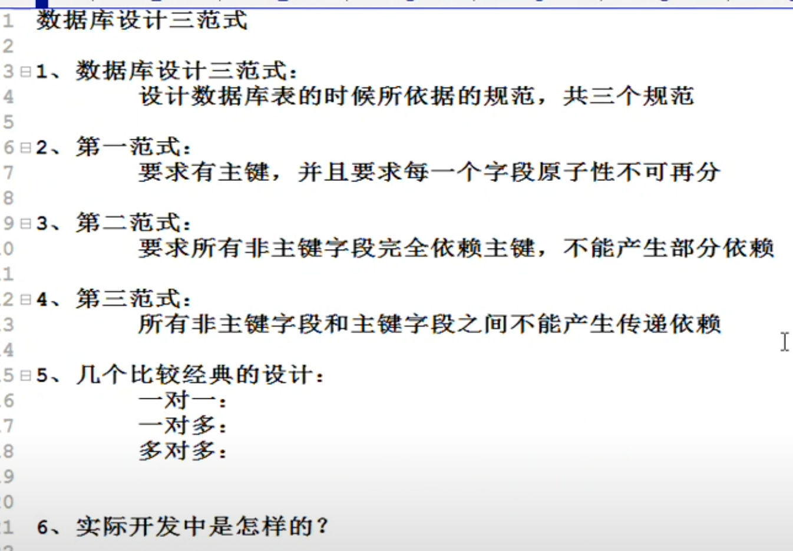
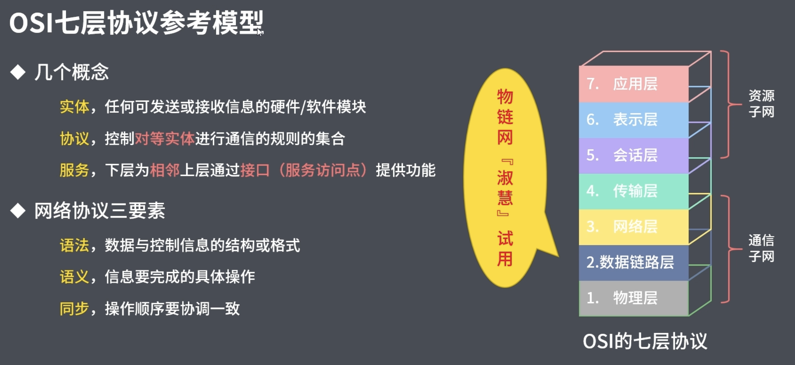
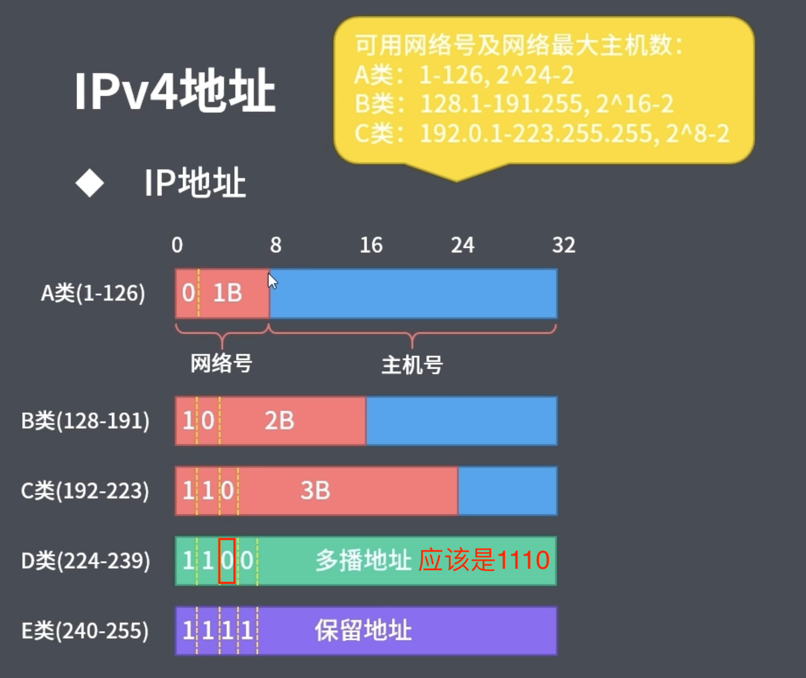

:source-highlighter: pygments
:icons: font
:scripts: cjk
:stem: latexmath
:toc:
:toc: right
:toc-title: Table of Contents
:toclevels: 4

= 软件设计师例题精讲

++++
<button id="toggleButton">Table of Contents</button>
<script>
    // 获取按钮和 div 元素
    const toggleButton = document.getElementById('toggleButton');
    const contentDiv = document.getElementById('toc');
    contentDiv.style.display = 'block';

    // 添加点击事件监听器
    toggleButton.addEventListener('click', () => {
        // 切换 div 的显示状态
        // if (contentDiv.style.display === 'none' || contentDiv.style.display === '') {
        if (contentDiv.style.display === 'none') {
            contentDiv.style.display = 'block';
        } else {
            contentDiv.style.display = 'none';
        }
    });
</script>
++++

== 1 数据表示


=== 1.1 浮点数格式
某种机器的浮点数表示格式如下(允许非规格化表示)。若阶码以补码表示，尾数以原码表示，则1000100000000001表示的浮点数是（ ）。

    1位      4位      1位      10位
     ↑        ↑       ↑        ↑
    阶符     阶码     数符      尾数

单选：

    A 2^-16 × 2^-10
    B 2^-15 × 2^-10
    C 2^-16 ×（1-2^-10）
    D 2^-15 ×（1-2^-10）

***

题干尾数是原码为：0000000001，数符是 0，这表示该尾数是负数为 2^-10 。

阶码是 0001 是补码，转换成原码是 1111，是十进制的 15，这里注意阶符是 1，这表示阶码是负数，因此该浮点数是 2^-15 ×2^-10 。

NOTE: 这个题用到了负数的补码。

=== 1.2 校验码（在OSI的数据链路层）


==== 1.2.1 奇偶校验
奇校验：原始数据增加一个校验位，使 1 的个数为奇数。

    原始数据    校验位
    10010100    0   -> 1 的个数为奇数，所以校验位为 0

偶校验：原始数据增加一个校验位，使 1 的个数为偶数。

    原始数据    校验位
    10010100    1   -> 1 的个数为奇数，所以校验位为 1


* 奇偶校验只有在出错二进制位个数是 #奇数# 的情况下才有效。
* 奇偶校验只能检错，不能纠错。


码字：编码后的信息单元，由若干个二进制位组成。

距离：将两个码字逐位进行对比，具有不相同的位的个数称为两个码字间的距离。

  ** 1011101 和 1001001 之间的距离是 2。

    1011101
    1001001
      x x   -> 2 位不同

  ** 奇偶校验的码距为 2
     *** 以奇校验为例：如下面完整码字的任意两个奇数个 1 的码字之间，至少要改两个比特才能从一个合法码字变成另一个合法码字。所以码距是 2。
+
[caption=]
.举例说明奇校验码距为 2
[cols="1,1,1",options="header"]
|===
| 数据位 | 校验位（奇校验） | 完整码字 
| 000   | 1             | 0001 
| 001   | 0             | 0010 
| 010   | 0             | 0100 
| 011   | 1             | 0111 
| 100   | 0             | 1000 
| 101   | 1             | 1011 
| 110   | 1             | 1101 
| 111   | 0             | 1110 
|===

码距：一种编码方案可能有若干个合法码字，各合法码字间的 #最小距离# 称为“码距”。

计算（偶校验为例）：各信息位进行异或（模2加）运算，得到的结果即为「偶校验位」。

  * 如 1001101 异或结果为 0，所以偶校验位为 0。
  * 则最后发送的数据为 10011010（假设将校验位放在最后面）

验证（偶校验为例）：收到方验证数据

  * 将收到的数据 10011010 按位异或结果为 0，说明数据正确。

https://www.bilibili.com/video/BV1qp421D7B3  0:00 -> 02:44

==== 1.2.2 循环冗余校验码‌（CRC校验）
给定待发送的数据为: 101001

要求的校验码多项式为: stem:[G(x) = x^3 + x^2 + 1]

***

1. 根据多项式确定 CRC 校验码位数
  ** 因为多项式最高次幂为 3，所以校验码位数为 3。

2. 数据左移校验码位数
  ** 数据补 3 个 0 为: 101001000

3. 确定多项式的值
  ** 根据多项式确定
  stem:[G(x) = x^3 + x^2 + 1] ->
  stem:[1 \cdot x^3 + 1 \cdot x^2 + 0 \cdot x^1 + 1 \cdot x^0]
  -> 1101

4. 计算 CRC 值（除法异或运算）
+
  1010 01000 ÷ 1101
  1101        (生成多项式)
  ----
  01110 1000  (第一步 XOR 结果)
   1101
   ----
   001110 00  (第二步 XOR 结果)
     1101
     -----
     001100   (第三步 XOR 结果)
       1101
       ----
       0001   (CRC 余数为 1，则 3 位校验位为 001)

5. 生成发送数据 = 传输数据 + CRC校验码
  ** 101001+001 -> 101001001

---
https://www.bilibili.com/video/BV1qp421D7B3

  * 从低到高举例 12:27 -> end

==== 1.2.3 海明码
* 可检错和纠错，海明码的标准码距是 3

* 可发现 2 位错，纠正 1 位错

* 用到了奇偶校验中的偶校验。

* ##计算 k 位数公式：stem:[2^k \geq n + k + 1]##
  ** n 为信息码长度
  ** k 为校验码长度（需要通过上面公式，自己代出来即可）
  ** ##校验码位置：stem:[2^{i-1}] ( i 从 1 -> k，如1、2、4、8 )##

* ##异或校验整个海明码，都为 0 正确。##

---

视频教学

* https://www.youtube.com/watch?v=5it44QcOtQQ 从高到低举例
* https://www.bilibili.com/video/BV1qp421D7B3 从低到高举例 02:44 -> 12:27

===== 1.2.3.1 Example1 计算海明码
例如: 信息码 101101100，采用海明码校验，问最终海明码是多少?

1. 确定校验位数量 k，原信息码位数为 n=9，代入公式:
  * stem:[2^k \geq n+k+1]，得 stem:[2^k \geq 9+k+1]
  * 若 k=4，则 stem:[2^4 \geq 9+4+1]，即 16>14，满足公式。
  * 确定校验位数量为 4 位

2. 确定校验码位置: 代入公式 stem:[2^{i-1}] ( i 从 1-> k=4，得 1、2、4、8 )，即下面 k1、k2、k4、k8 的 4 个位置。
+
[plantuml, target=img/diagram-haimingcode1, format=png]
....
@startebnf
<style>
element {
  ebnf {
    Backgroundcolor pink
    note {
      Backgroundcolor pink
    }
  }
}
</style>

校验位位置=k1(*1*),k2(*2*),"1"(*3*),k4(*4*),"0"(*5*),"1"(*6*),"1"(*7*),
k8(*8*),"0"(*9*),"1"(*10*),"1"(*11*),"0"(*12*),"0"(*13*);

@endebnf
....

3. 确定校验位与数据位对应关系
  * 即 kx 分别对应哪些数据位
+
[caption=]
[cols="6*"]
|===
2.2+^.^|校验位对应数据位表 (为1则对应)                          4+^|4个校验位
                         |k8 (9,10,11,12,13) |k4 (5,6,7,12,13) |k2 (3,6,7,10,11) |k1 (3,5,7,9,11,13)
.9+^.^|9个数据位对应校验位关系
        | 3 -> 0011 -> k1, k2     |0                  |0               |1                 |1
        | 5 -> 0101 -> k1, k4     |0                  |1               |0                 |1
        | 6 -> 0110 -> k2, k4     |0                  |1               |1                 |0
        | 7 -> 0111 -> k1, k2, k4 |0                  |1               |1                 |1
        | 9 -> 1001 -> k1, k8     |1                  |0               |0                 |1
        |10 -> 1010 -> k2, k8     |1                  |0               |1                 |0
        |11 -> 1011 -> k1, k2, k8 |1                  |0               |1                 |1
        |12 -> 1100 -> k4, k8     |1                  |1               |0                 |0
        |13 -> 1101 -> k1, k4, k8 |1                  |1               |0                 |1
|===

4. 计算校验位的值
  * 异或结果为 kx 的值
+
[caption=]
[cols="8*"]
|===
| k1 对应位   |3 | 5 | 7 | 9  | 11 | 13    | 异或结果为 k1
| 信息码对应值 |1 | 0 | 1 | 0  | 1  | 0  ^.^| 1
| k2 对应位   |3 | 6 | 7 | 10 | 11 |       | 异或结果为 k2
| 信息码对应值 |1 | 1 | 1 | 1  | 1  |    ^.^| 1
| k3 对应位   |5 | 6 | 7 | 12 | 13 |       | 异或结果为 k3
| 信息码对应值 |0 | 1 | 1 | 0  | 0  |    ^.^| 0
| k4 对应位   |9 | 10| 11| 12 | 13 |       | 异或结果为 k4
| 信息码对应值 |0 | 1 | 1 | 0  | 0  |    ^.^| 0
|===

5. 插入校验位 k1 k2 k4 k8
+
[plantuml, target=img/diagram-haimingcode2, format=png]
....
@startebnf
<style>
element {
  ebnf {
    Backgroundcolor pink
    note {
      Backgroundcolor pink
    }
  }
}
</style>

插入校验位 = k1(*1*), k2(*2*),"1"(*3*),k4(*4*), "0"(*5*),"1"(*6*),"1"(*7*),k8(*8*), "0"(*9*),"1"(*10*),"1"(*11*),"0"(*12*),"0"(*13*)
           |1(*1*),  1(*2*),"1"(*3*), 0(*4*), "0"(*5*),"1"(*6*),"1"(*7*), 0(*8*), "0"(*9*),"1"(*10*),"1"(*11*),"0"(*12*),"0"(*13*);
(* 海明码为: 1110011001100 *)
@endebnf
....

6. 接收方检错和纠错判断
  * 接收方接收正确数据时: 1110011001100，按《4. 计算校验位的值》中的表进行异或（含 kx 值），都为 0 为正确。
  * 接收方接收错误数据时: 1110111001100，按《4. 计算校验位的值》中的表进行异或（含 kx 值），若有 1 为错误。
    ** 此例为数值位 5 由 0 变成了 1
    ** 如何知道是数据位 5 发生了变化？ -> #将异或结果由 k8 k4 k2 k1 排序为 0 1 0 1，即是十进制的位置 5。#

+
[caption=]
[cols="8*", stripes=odd]
|===
| k1 | 3      | 5       | 7 | 9  | 11 | 13 | 异或结果
| 1  | 1      | 0 -> 1  | 1 | 0  | 1  | 0  | 1 错
| k2 | 3      | 6       | 7 | 10 | 11 |    | 异或结果
| 1  | 1      | 1       | 1 | 1  | 1  |    | 0
| k4 | 5      | 6       | 7 | 12 | 13 |    | 异或结果
| 0  | 0 -> 1 | 1       | 1 | 0  | 0  |    | 1 错
| k8 | 9      | 10      | 11| 12 | 13 |    | 异或结果
| 0  | 0      | 1       | 1 | 0  | 0  |    | 0
|===

== 2 数据结构


=== 2.1 二叉树最小高度
假设一棵二叉树的结点个数为 50，则它的最小高度是（ ）。

    A 4
    B 5
    C 6
    D 7

---

按照满足条件时，当 50 个结点构成一棵完全二叉树时高度最小，h=(log2n) 向下取整 + 1 = 6

=== 2.2 二叉树结点数
:stem: latexmath
若一棵二叉树的高度（即层数）为h，则该二叉树（A）。

* A 最多有 stem:[2^h - 1] 个结点
* B 最少有 stem:[2^h - 1] 个结点
* C stem:[2^h] 个结点
* D 有 stem:[2^h -1] 个结点

[discrete]
==== 解析

**A. 最多有 stem:[2^h - 1] 个结点** ✅

这是正确的。

- 满二叉树（Full Binary Tree）：每一层的结点数都是最大，第 i 层有 stem:[2^{i-1}] 个结点。
- 总结点数为：等比数列求和公式
  ** stem:[1 + 2 + 4 + ... + 2^{h-1} = 2^h-1]

所以当二叉树是满的（即每一层都满）时，结点最多有 stem:[2^h - 1] 个。

**B. 最少有 2^h^ - 1 个结点** ❌
错误。最少的情况是每层只有一个结点（即链式结构），那么最少有 h 个结点，而不是 2^h^ - 1。

**C. 有 2^h^ 个结点** ❌
错误。这是满二叉树下一层的节点数，仅在深度为 h+1 时才可能达到。

**D. 有 2^h^ - 1 个结点** ❌
错误。这是最多的情况，而非所有情况。

[discrete]
==== 正确答案

*A*

=== 2.3 二叉排序树关键码序列
可以构造出下图所示二叉排序树（二叉检索树、二叉查找树）的关键码序列是（ B ）。

.link:img/mermaid-2025-05-11-164301.svg[二叉排序树]
[mermaid, target=img/mermaid-2025-05-11-164301, format=svg]
....
flowchart TD
    23((23)) --- 17((17))
    23((23)) --- 40((40))
    17((17)) --- 10((10)) ---|right| 13((13))
    17((17)) --- 19((19))
    40((40)) --- 31((31)) ---|left| 27((27))
    40((40)) --- 91((91)) ---|left| 65((65))
....

    A 10 13 17 19 23 27 31 40 65 91
    B 23 40 91 17 19 10 31 65 27 13
    C 23 19 40 27 17 13 10 91 65 31
    D 27 31 40 65 91 13 10 17 23 19

---

要构造题目所示的二叉排序树，关键码序列需满足以下条件：

1. **根节点必须最先插入**：根节点是23，因此任何以其他数字开头的序列（如选项A、D）均可排除。
2. **父节点必须在子节点之前插入**：每个子节点的位置由其父节点的值决定，因此父节点必须已存在于树中。
3. **插入路径需符合树的层级关系**：##插入时需从根节点开始，逐层比较，最终定位到正确位置。##

**选项B的插入过程分析**：

[caption=]
[cols="1,5",options="header"]
|===
| 插入顺序 | 插入逻辑
| 23  | 作为根节点插入。
| 40  | 与23比较，40>23，成为23的右子节点。
| 91  | 先与23比较，进入右子树，再与40比较，91>40，成为40的右子节点。
| 17  | 先与23比较，17<23，成为23的左子节点。
| 19  | 先与23比较，进入左子树，与17比较，19>17，成为17的右子节点。
| 10  | 先与23比较，进入左子树，与17比较，10<17，成为17的左子节点。
| 31  | 先与23比较，进入右子树，与40比较，31<40，成为40的左子节点。
| 65  | 先与23比较，进入右子树，与40比较，进入右子树，与91比较，65<91，成为91的左子节点。
| 27  | 先与23比较，进入右子树，与40比较，进入左子树，与31比较，27<31，成为31的左子节点。
| 13  | 先与23比较，进入左子树，与17比较，进入左子树，与10比较，13>10，成为10的右子节点。
|===

**为何有时与根节点比较，有时与父节点比较？**

- **插入始终从根开始**：每次插入新节点时，必须从根节点23开始逐层比较。例如，插入13时，虽然其父节点是10，但插入路径需经过23→17→10，最终确定13的位置。
- **路径依赖父节点顺序**：父节点的插入顺序决定了子节点的比较路径。例如，插入27时，路径为23→40→31，因为31已插入，才能进一步比较27的位置。

**错误选项分析**：

- **选项C**：插入顺序为23,19,40,27,17,13,10,91,65,31。
  - 插入19时，23的左子节点应为17，但19被错误地插入到左子树，导致后续17无法正确插入到23的左子树，结构混乱。
- **选项D**：以27开头，根节点必须是23，因此排除。

**结论**：选项 B 的插入顺序严格遵循二叉排序树的构造规则，每个节点的父节点均在其之前插入，且路径正确，最终形成题目所示的树结构。因此，正确答案为：

**答案：B**

=== 2.4 二叉树小根堆
对于 n 个元素的关键字序列 { k1,k2, ...kn }，当且仅当满足关系 ki ≤ k2i 且 ki ≤ k2i+1 {i=1.2...[n/2]} 时称其为小根堆(小顶堆)。

以下序列中，（ ）不是小根堆(小顶堆)。

    A 16,25,40,55,30,50,45
    B 16,40,25,50,45,30,55
    C 16,25,39,41,45,43,50
    D 16,40,25,53,39,55,45

***

这是根据完全二叉树在数组中的存储方式来判断的。小根堆是一种完全二叉树结构的堆，在顺序存储时具有以下规律：

.link:img/mermaid-2025-05-09-174131.svg[D 16,40,25,53,39,55,45]
[mermaid, target=img/mermaid-2025-05-09-174131, format=svg]
....
flowchart TD
    16((16)) --- 25((25))
    25((25)) --- 55((55))
    25((25)) --- 45((45))

    16((16)) --- 40((40))
    40((40)) --- 53((53))
    40((40)) ---|违反小根堆性质| 39((39))
....

*答案为 D*

=== 2.5 二叉树遍历顺序
已知一棵二叉树的先序遍历结果为 ABCDEF，中序遍历结果为 CBAEDF，则后序遍历结果为（ ）。

    A CBEFDA
    B FEDCBA
    C CBEDFA
    D 不确定

***

我们根据 **先序遍历** 和 **中序遍历** 来还原这棵二叉树，再求出它的 **后序遍历**。

.遍历就是访问树中所有节点的一种方式
****
1. **先序遍历（Preorder）**: 访问顺序：**根 → 左子树 → 右子树**

2. **中序遍历（Inorder）**: 访问顺序：**左子树 → 根 → 右子树**

3. **后序遍历（Postorder）**: 访问顺序：**左子树 → 右子树 → 根**
****

给定：

- 先序遍历（Preorder）：`A B C D E F`
- 中序遍历（Inorder）： `C B A E D F`

[discrete]
=== 步骤一：构建二叉树

先序遍历的第一个节点是根节点：

- **根节点：A**

查找 A 在中序遍历中的位置：

- 中序遍历：`C B | A | E D F`

所以 A 的左子树是 `C B`，右子树是 `E D F`。

[discrete]
==== 处理左子树：

先序遍历中 A 的左子树部分是：`B C`

- 根是 B（先序中紧跟 A 之后）
- 中序左子树为 `C B`，B 是根，C 在左边 ⇒ C 是 B 的左子

左子树构建为：

```
   B
  /
C
```

[discrete]
==== 处理右子树：

先序遍历中 A 的右子树部分是：`D E F`（剩下的）

- 根是 D（下一个未使用的先序元素）
- 中序右子树是 `E D F`

D 在中序中的位置中间，所以：

- 左子树：E
- 右子树：F

右子树构建为：

```
   D
  / \
 E   F
```

[discrete]
==== 整体树结构为：

```
       A
     /   \
    B     D
   /     / \
  C     E   F
```

[discrete]
=== 步骤二：求后序遍历（Postorder）

后序遍历顺序是：**左 → 右 → 根**

按照树结构遍历：

- 左子树（B 的子树）：C → B
  
- 右子树（D 的子树）：E → F → D
  
- 根：A

合起来是：`C B E F D A`

[discrete]
==== 答案：**A. CBEFDA**

***

=== 2.6 哈夫曼树(最优二叉树)公式
若一棵哈夫曼(Huffman)树共有 9 个顶点，则其叶子结点的个数为（ ）。

    A 4
    B 5
    C 6
    D 7

答案为：B

先推个公式出来：

正确的构建流程（4 个叶子结点：A、B、C、D）：

初始结点：A、B、C、D（都是叶子）

第一步：合并权值最小的两个（比如 A 和 B）⇒ 生成中间结点 P

第二步：合并权值最小的两个（比如 C 和 D）⇒ 生成中间结点 Q

第三步：合并 P 和 Q ⇒ 得到根结点 R

树的结构应该是这样的：

        R
       / \
      P   Q
     / \ / \
    A  B C  D

总结点数验证：

- 叶子结点：A、B、C、D ⇒ 4 个

- 中间结点：P、Q、R ⇒ 3 个

- 总结点数：4 + 3 = 7 = 2×4 - 1

所以有公式: ##总结点数 = 叶子结点数 + 内部结点数 = n+(n−1) = 2n−1##

9 个顶点代入公式： 9 = 2n - 1 -> n = 5

=== 2.7 哈夫曼树编码
已知字符集 {a,b,c,d,e,f}，若各字符出现的次数分别为 6,3,8,2,10,4，则对应字符集中各字符的哈夫曼编码可能为（A）。

    A 00，1011, 01, 1010, 11, 100
    B 11, 100, 110, 000 , 0010, 01
    C 10, 1011, 11, 0011, 00, 010
    D 0011, 10, 11, 0010, 01, 000

---

1. **初始节点**：按权值升序排列为 d(2), b(3), f(4), a(6), c(8), e(10)。

2. **合并最小节点**：
   - 合并 d(2) 和 b(3) 成 5，队列变为 [f(4), 5, a(6), c(8), e(10)]。
   - 合并 f(4) 和 5 成 9，队列变为 [a(6), 9, c(8), e(10)]。
   - 合并 a(6) 和 c(8) 成 14，队列变为 [9, e(10), 14]。
   - 合并 9 和 e(10) 成 19，队列变为 [14, 19]。
   - 合并 14 和 19 成根节点 33。
+
.画出的树，可用边来推算出编码
[graphviz, target="img/graphviz-2025-05-13-054235", format=svg]
....
digraph G {
    rankdir=LR

    dbfe [label="19"]
    ac [label="14"]

    f [label="f:4"]

    d [label="d:2"]
    b [label="b:3"]
    db [label="5"]
    dbf [label="9"]
    e [label="e:10"]

    a [label="a:6"]
    c [label="c:8"]

    root [label="33"]

    d -> db [label="0"]
    b -> db [label="1"]

    f -> dbf [label="0"]
    db -> dbf [label="1"]

    a -> ac [label="0"]
    c -> ac [label="1"]

    dbf -> dbfe [label="0"]
    e -> dbfe [label="1"]

    ac -> root [label="0"]
    dbfe -> root [label="1"]
}
....

3. **编码规则**：左分支为 0，右分支为 1。
   - **a**：路径为根→左→左，编码 **00**。
   - **c**：路径为根→左→右，编码 **01**。
   - **e**：路径为根→右→右，编码 **11**。
   - **f**：路径为根→右→左→左，编码 **100**。
   - **d**：路径为根→右→左→右→左，编码 **1010**。
   - **b**：路径为根→右→左→右→右，编码 **1011**。

**选项 A 的编码与上述结果完全一致**，且满足哈夫曼编码的最短加权路径性质（高频字符编码更短）。其他选项（如 B、C、D）中，存在高频字符编码过长或前缀冲突的问题，因此排除。

**答案：A**

哈夫曼编码原则回顾：

* 频率越高，编码越短；频率越低，编码越长。
* 没有一个编码是另一个编码的前缀（前缀码）。
* 哈夫曼树是通过合并频率最小的两个节点，逐步构建出来的。

分析选项 A：

* 频率最高的是 e(10) 和 c(8)，它们的编码分别是 11 和 01（都是2位）✅
* a(6) 是 00（也是2位）✅
* f(4) 是 100（3位）✅
* b(3) 是 1011（4位），d(2) 是 1010（4位）✅
* 没有任何编码是另一个编码的前缀 ✅

这完全符合哈夫曼编码的基本原则。

其他选项简要分析：

* B：e 的编码是 0010（4位），但它频率最高，应是最短的 → 不合理 ❌
* C：b(3) 是 1011，d(2) 是 0011，但 a(6) 是 10，b 的编码比 a 还长，合理 ✅，但由于题目只选一项，A 更标准，A 是由树推算出来的。
* D：a(6) 的编码是 0011（4位），比 b(3) 的 10 还长 → 不合理 ❌

=== 2.8 无向图顶点度数之和
:stem: latexmath
无向图中一个顶点的度是指图中与该顶点相邻接的顶点数。若无向图 G 中的顶点数为 n，边数为 e，则所有顶点的度数之和为（ ）

* A n*e 
* B n+e 
* C 2n 
* D 2e

答案：D

****

定义：在无向图中，一个顶点的度数（Degree）是指与该顶点相连的边的数量。度数是描述顶点在图中连接程度的一个重要指标。

这个题考查的是图论中无向图的一个基本性质：

在一个无向图中，所有顶点的度数之和等于边数的两倍。

原因解释：
每条边连接两个顶点，因此会被两个顶点各“贡献一次”度数。所以总的度数是边数的两倍。

设：

* 顶点数为 n
* 边数为 e
* 公式中的 vi 指顶点

则： stem:[\sum_{i=1}^{n} \deg(v_i) = 2e]
****

=== 2.9 某个度的节点数
在—棵度为 3 的树中，若有 2 个度为 3 的结点，有 1 个度为 2 的结点，则有（C）个度为 0 的结点。

    A 4
    B 5
    C 6
    D 7

---

解释：
度为 3 的树（也称为**三叉树**）是指**树中每个结点的最大子结点数为3**，即每个结点最多可以有 3 个子结点。

**度为3的树的特点：**

1. **结点的度**：每个结点的子结点数可以是0（叶子结点）、1、2 或 3。
2. **树的度**：整棵树的度是所有结点##度的最大值##，因此如果树中至少有一个结点有 3 个子结点，则该树的度为 3。
3. **结构**：不同于**二叉树（每个结点最多2个子结点）**，三叉树可以有更灵活的分支结构。

.**示例：**

        A
      / | \
     B  C  D
    / \    |
   E   F   G

- **A** 的度为3（子结点 B、C、D）。
- **B** 的度为2（子结点 E、F）。
- **D** 的度为1（子结点 G）。
- **C、E、F、G** 的度为 0（叶子结点）。

总结：**度为 3 的树是一种每个结点最多有 3 个子结点的树结构**，适用于需要更高分支因子的场景。

基本概念清楚了，要想计算，还是挺麻烦的。下面画一个图可以快速求出本题。

         A
       /   \
      B     C
     /|\   /|\
    D E F G H I

这个树的度为 3，A节点的度为 2，度为 0 的节点有 6 个。所以答案是 C

=== 2.10 拓扑排序
（ ）是右图的合法拓扑序列。

[graphviz, target="img/graphviz-2025-05-10-205110", format=svg]
....
digraph AOV {
    rankdir=LR;
    node [shape = circle];

    2 -> 1;
    3 -> 1;
    3 -> 2;
    4 -> 2;
    4 -> 3;
    5 -> 2;
    5 -> 4;
    6 -> 3;
    6 -> 4;
}
....

    A 654321
    B 123456
    C 563421
    D 564213

答案：A

***

本题考查数据结构的基础知识。

拓扑排序是将AOV网中所有顶点排成一个线性序列的过程，并且该序列满足：若在 AOV 网中从顶点 vi 到 vj 有一条路径，则在该线性序列中，顶点 vi 必然在顶点 vj 之前。

对AOV网进行拓扑排序的方法如下：

(1)在AOV网中选择一个 #入度为零（没有前驱）的顶点# 且输出它；

(2)从网中删除该顶点及与该顶点有关的所有边；

(3)重复上述两步，直至网中不存在入度为零的顶点为止。

本题中只有序列“6 5 4 3 2 1”可由上述过程导出。

对有向图进行拓扑排序的结果会有两种情况：一种是所有顶点已输出，此时整个拓扑排序完成，说明网中不存在回路；另一种是尚有未输出的顶点，剩余的顶点均有前驱顶点，表明网中存在回路。

=== 2.11 进栈出栈
若元素以a,b,c,d,e的顺序进入一个初始为空的栈中，每个元素进栈、出栈各1次，要求出栈的第一个元素为d，则合法的出栈序列共有 （4） 种。

    A 4
    B 5
    C 6
    D 24

---
本题考查数据结构基础知识。

栈的修改规则是后进先出。对于题目给出的元素序列，若要求 d 先出栈，则此时 a、b、c 尚在栈中，因此这四个元素构成的出栈序列只能是 dcba。

若 e 在 c 出栈之前进栈，因此可以得到出栈系列 decba。

若 e 在 b 出栈之前进栈，因此可以得到出栈序列 dceba。

若 e 在 a 出栈之前入栈，因此可以得到出栈序列 dcbea。

若 e 在 a 出栈之后入栈，因此可以得到出栈序列 dcbae。

=== 2.12 队列长度
设某循环队列 Q 的定义中有 front 和 rear 两个域变量，其中，front 指示队头元素的位置，rear 指示队尾元素之后的位置，如下图所示。若该队列的容量为 M，则其长度为（D）。

image::img/queue_length.png[]

    A (Q.rear-Q.front+1)
    B (Q.rear-Q.front+M)
    C (Q.rear-Q.front+1)%M
    D (Q.rear-Q.front+M)%M

本题考查数据结构基础知识。

根据题目中所给的示意图，Q.front 为队头元素的指针，Q.rear 表示队尾元素之后的一个空位置，故队列长度为Q.rear-Q.front

由于队列中存储位置编号是在 0～M－1 之间循环的，Q.rear-Q.front 的结果有可能是负数，故在 Q.rear-Q.front基础上加上 M 可恢复为正数，而此正数有可能超出 0～M－1 的范围，故用整除，M 取余运算恢复一下，因此长度计算的式子为 (Q.rear-Q.front+M)%M。

== 3 算法


=== 3.1 算法策略和时间复杂度
某货车运输公司有一个中央仓库和n个运输目的地，每天要从中央仓库将货物运输到所有的运输目的地，到达每个运输目的地一次且仅一次，最后回到中央仓库。在两个地点i和j之间运输货物存在费用cij。为求解旅行费用总和最小的运输路径，设计如下算法：首先选择离中央仓库最近的运输目的地1，然后选择离运输目的地1最近的运输目的地2,……，每次在未访问过的运输目的地中选择离当前运输目的地最近的运输目的地，最后回到中央仓库。

则该算法采用了（ ）算法设计策略，其时间复杂度为（ ）。

---
* 分治（Divide and Conquer）：将问题分解为若干子问题，递归解决子问题后合并结果。这里没有明显的分解和合并过程。

* 动态规划（Dynamic Programming）：将问题分解为重叠子问题，保存子问题的解以避免重复计算。这里没有保存子问题的解或利用重叠子问题的特性。

* #贪心（Greedy）：在每一步选择当前看起来最优的局部解，希望最终得到全局最优解。这里的“每次选择最近的未访问目的地”正是贪心策略的体现。#

* 回溯（Backtracking）：通过尝试所有可能的解，并在发现当前路径不可能得到最优解时回溯。这里没有回溯的过程。

---
时间复杂度分析
贪心的最近邻算法的时间复杂度可以如下分析：

从中央仓库出发，选择最近的未访问目的地：需要比较n个目的地的距离，O(n)时间。

从第一个目的地选择下一个最近的未访问目的地：需要比较n-1个目的地的距离，O(n)时间。

...

从第n-1个目的地选择最后一个未访问目的地：O(1)时间。

最后返回中央仓库：O(1)时间。

总的时间复杂度是：O(n) + O(n-1) + ... + O(1) = O(n^2)。

***

总结时间复杂度	含义	例子

* O(1)	一次搞定	数组取元素 arr[0]
* O(log n)	每次砍掉一半数据	二分查找、平衡二叉树的查找
* O(n)	遍历所有数据	找最大值、线性查找
* O(n log n)	分治 + 每层处理 n 次	归并排序、快速排序
* O(n²)	双重循环	冒泡排序、最近邻贪心 TSP

==== 3.1.1 插入排序算法时间和空间复杂度
对 n 个基本有序的整数进行排序，若采用插入排序算法，则时间和空间复杂度分别为（D）

    A O(n2)和O(n)
    B O(n)和O(n)
    C O(n2)和O(1)
    D O(n)和O(1)

---

算法简介：插入排序是一种简单直观的排序算法，其基本思想是从第二个元素开始，将每个元素插入到它前面已经排好序的子数组中，使整个数组逐步变成有序。

若数据基本有序，对插入排序算法而言，则可以在近似线性时间内完成排序，即O(n);

插入排序算法在排序时仅需要一个额外的存储空间，即空间复杂度均为常数时间复杂度 O(1)。

===== python 插入排序--源代码
[source,python,]
----
def insertion_sort(arr):
    print("初始数组:", arr)
    for i in range(1, len(arr)):
        key = arr[i]
        j = i - 1
        print(f"\n第 {i} 步：准备插入元素 {key}（来自位置 {i}）")

        # 将大于 key 的元素向后移
        while j >= 0 and arr[j] > key:
            print(f"\t移动: 元素 {arr[j]} 从位置 {j} 移动到位置 {j + 1}")
            arr[j + 1] = arr[j]
            j -= 1

        arr[j + 1] = key
        print(f"\t插入: 元素 {key} 到位置 {j + 1}")
        print("\t当前数组状态:", arr)

    print("\n最终排序结果:", arr)
    return arr

# 测试代码
arr = [5, 2, 4, 6, 1, 3]
insertion_sort(arr.copy())

----

代码很巧妙，需要理解它的时间复杂度和空间复杂度。

.输出结果
....
初始数组: [5, 2, 4, 6, 1, 3]

第 1 步：准备插入元素 2（来自位置 1）
	移动: 元素 5 从位置 0 移动到位置 1
	插入: 元素 2 到位置 0
	当前数组状态: [2, 5, 4, 6, 1, 3]

第 2 步：准备插入元素 4（来自位置 2）
	移动: 元素 5 从位置 1 移动到位置 2
	插入: 元素 4 到位置 1
	当前数组状态: [2, 4, 5, 6, 1, 3]

第 3 步：准备插入元素 6（来自位置 3）
	插入: 元素 6 到位置 3
	当前数组状态: [2, 4, 5, 6, 1, 3]

第 4 步：准备插入元素 1（来自位置 4）
	移动: 元素 6 从位置 3 移动到位置 4
	移动: 元素 5 从位置 2 移动到位置 3
	移动: 元素 4 从位置 1 移动到位置 2
	移动: 元素 2 从位置 0 移动到位置 1
	插入: 元素 1 到位置 0
	当前数组状态: [1, 2, 4, 5, 6, 3]

第 5 步：准备插入元素 3（来自位置 5）
	移动: 元素 6 从位置 4 移动到位置 5
	移动: 元素 5 从位置 3 移动到位置 4
	移动: 元素 4 从位置 2 移动到位置 3
	插入: 元素 3 到位置 2
	当前数组状态: [1, 2, 3, 4, 5, 6]

最终排序结果: [1, 2, 3, 4, 5, 6]
....

===== python 插入排序--活动图
[plantuml, target=img/diagram-2025-05-14-103821, format=svg]
....
@startuml
start

:初始数组 arr = [5, 2, 4, 6, 1, 3];
:i = 1;

while (i < len(arr)) is (true)
  :key = arr[i];
  :j = i - 1;
  :Print "准备插入元素 key（来自位置 i）";

  while (j >= 0 and arr[j] > key) is (true)
    :Print "移动: 元素 arr[j] 从位置 j 移动到位置 j+1";
    :arr[j+1] = arr[j];
    :j = j - 1;
  endwhile

  :arr[j+1] = key;
  :Print "插入: 元素 key 到位置 j+1";
  :Print 当前数组状态;
  :i = i + 1;
endwhile

:Print "最终排序结果";
stop
@enduml
....

==== 3.1.2 快速排序算法时间和空间复杂度
对 n 个基本有序的整数进行排序，若采用快速排序算法，则时间和空间复杂度分别为（ ）。

    A O(n2)和O(n)
    B O(nlgn)和O(n)
    C O(n2)和O(1)
    D O(nlgn)和O(1)

---

快速排序的核心是 “分治法”（Divide and Conquer）：

1. 选一个“基准”元素（pivot）。
2. 把数组分成两个部分：
    * 左边部分：所有小于 pivot 的元素。
    * 右边部分：所有大于等于 pivot 的元素。
3. 分别对左右两部分递归地进行排序。
4. 把排序好的左边 + pivot + 排序好的右边合并起来。

就是这样一步一步拆分成小问题，最后拼回一个有序的结果。

[discrete]
==== 示例演示

对数组 `[5, 2, 4, 6, 1, 3]` 执行 quicksort，过程如下：

. 第一次：pivot = 5
  * 左边：[2, 4, 1, 3]
  * 右边：[6]

. 对左边 `[2, 4, 1, 3]` 执行 quicksort：
  * pivot = 2
  * 左边：[1]
  * 右边：[4, 3]

. 对 `[4, 3]` 执行 quicksort：
  * pivot = 4
  * 左边：[3]
  * 右边：[]

. 合并过程：
[source]
----
[1] + [2] + [3, 4] = [1, 2, 3, 4]
----

. 最终结果：
[source]
----
[1, 2, 3, 4] + [5] + [6] = [1, 2, 3, 4, 5, 6]
----

[discrete]
==== 为什么叫“快速排序”？

快速排序之所以叫“快速”，是因为它的平均性能非常优秀：

* 平均时间复杂度：`O(n log n)`
* 最坏情况：`O(n^2)`（当 pivot 选得很差时）

它在大多数实际应用中比冒泡、选择、插入等排序算法快很多，因此得名“快速排序”。

[discrete]
==== 总结

快速排序之所以能够排序成功，是因为它在每一步都将数据划分为两部分：
* 小的元素在左边
* 大的元素在右边

通过递归地排序这两部分，最终拼出一个完整有序的结果。

===== python 快速排序--源代码
下面是用 Python 实现的 快速排序（Quicksort） 源代码，采用的是经典的递归方式：

[source,python,]
----
def quicksort(arr):
    if len(arr) <= 1:
        return arr
    pivot = arr[0]  # 选取第一个元素作为基准
    left =  [x for x in arr[1:] if x < pivot]     # 小于 pivot 的元素
    right = [x for x in arr[1:] if x >= pivot]    # 大于等于 pivot 的元素
    return quicksort(left) + [pivot] + quicksort(right)

nums = [5, 2, 4, 6, 1, 3]
sorted_nums = quicksort(nums)
print(sorted_nums)
----

[discrete]
===

===== python 快速排序--活动图
[plantuml, target=img/diagram-2025-05-14-113805, format=svg]
....
@startuml
start

:调用 quicksort(arr);

if (arr 长度 <= 1?) then (是)
  :返回 arr;
  stop
else (否)
  :pivot = arr[0];
  :left = [x for x in arr[1:] if x < pivot];
  :right = [x for x in arr[1:] if x >= pivot];

  :对 left 递归执行 quicksort;
  :对 right 递归执行 quicksort;

  :返回 quicksort(left) + [pivot] + quicksort(right);
  stop
endif
@enduml
....

=== 3.2 背包问题
考虑下述背包问题的实例。
有 5 件物品，背包容量为 100，每件物品的价值和重量如下表所示，并已经按照物品的单位重量价值从大到小排好序，##根据物品单位重量价值大优先的策略装入背包中##，则采用了（B）设计策略。

考虑 0|1 背包问题（每件物品或者全部放入或者全部不装入背包）和部分背包问题（物品可以部分装入背包），求解该实例，得到的最大价值分别为（C）。

[cols="^,^,^,^", options="header"]
|===
|物品编号 |价值 |重量 |单位重量价值
|1 |50  |5  |10
|2 |200 |25 |8
|3 |180 |30 |6
|4 |225 |45 |5
|5 |200 |50 |4
|===

第一问选项:

    A 分治
    B 贪心
    C 动态规划
    D 回溯

第二问选项:

    A 605和630
    B 605和605
    C 430和630
    D 630和430

---

第二问答案：C. 430 和 630

0|1 背包（贪心选物）：只能整件选，按顺序选入 1、2、3 号物品，重量共 60，价值为 430

部分背包（贪心法）：可以部分选物，总价值为 630

注意：0|1 背包这里并非求最优解（605），而是要求在##贪心策略##下的结果。

== 4 状态转换机
// 编译原理，上下有好几集 https://www.bilibili.com/video/BV1TQ4y1D7Vk

下图所示为一个不确定有限自动机(NFA)的状态转换图，与该 NFA 等价的 DFA 是 ()

.解析：NFA 正规集 0 (0|11*) 0 -> *答案为 C*
[graphviz, target="img/graphviz-2025-05-10-125143-NFA", format=svg]
....
digraph finite_state_machine {
    rankdir=LR;
    node [shape = doublecircle]; S5;
    node [shape = circle];
    start [label="", width=0, height=0, shape=none];

    start -> S0;
    S0 -> S1 [label = "0"];
    S1 -> S4 [label = "0"];
    S1 -> S2 [label = "ε"];
    S2 -> S3 [label = "1"];
    S3 -> S2 [label = "ε"];
    S3 -> S4 [label = "ε"];
    S4 -> S5 [label = "0"];
}
....

IMPORTANT: DFA 不允许有 ε 空输入。

.选项 A -> 正规集为 01*0;
[graphviz, target="img/graphviz-2025-05-10-125311-A", format=svg]
....
digraph finite_state_machine {
    rankdir=LR;
    node [shape=doublecircle, label=""]; End
    node [shape = circle];
    start [label="", width=0, height=0, shape=none];

    start -> S0;
    S0 -> S1  [label = "0"];
    S1 -> S1  [label = "1"];
    S1 -> End [label = "0"];
}
....

.选项 B -> 正规集为 001*0
[graphviz, target="img/graphviz-2025-05-10-125444-B", format=svg]
....
digraph finite_state_machine {
    rankdir=LR;
    node [shape=doublecircle, label=""]; End
    node [shape = circle];
    start [label="", width=0, height=0, shape=none];

    start -> S0;
    S0 -> S1  [label = "0"];
    S1 -> S2  [label = "0"];
    S2 -> S2  [label = "1"];
    S2 -> End [label = "0"];
}
....

.选项 C -> 正规集为 0(0|11*)0
[graphviz, target="img/graphviz-2025-05-10-125457-C", format=svg]
....
digraph finite_state_machine {
    rankdir=LR;
    node [shape=doublecircle, label=""]; End
    node [shape = circle];
    start [label="", width=0, height=0, shape=none];

    start -> S0;
    S0 -> S1  [label = "0"];
    S1 -> S2  [label = "0"];
    S1 -> S2  [label = "1"];
    S2 -> S2  [label = "1"];
    S2 -> End [label = "0"];
}
....

.选项 D -》 正规集为 01*00
[graphviz, target="img/graphviz-2025-05-10-125519-D", format=svg]
....
digraph finite_state_machine {
    rankdir=LR;
    node [shape=doublecircle, label=""]; End
    node [shape = circle];
    start [label="", width=0, height=0, shape=none];

    start -> S0;
    S0 -> S1  [label = "0"];
    S1 -> S2  [label = "0"];
    S1 -> S1  [label = "1"];
    S2 -> End [label = "0"];
}
....

== 5 存储系统与寻址结构


=== 5.1 存储单元地址宽度
:stem: latexmath
设有一个 `64K×32` 位的存储器（每个存储单元为 `32` 位），其存储单元的地址宽度为（ B ）。

    A 15
    B 16
    C 30
    D 32

详细解释

1. **存储单元数量计算**：

   - "64K" 中的 "K" 表示 *1024*（即 stem:[2^{10}]），所以：
     stem:[64K = 64 \times 1024]

   - 而 stem:[64 = 2^6]，stem:[1024 = 2^{10}]，因此：
     stem:[64 \times 1024 = 2^6 \times 2^{10} = 2^{16}]

   - 最终得到存储单元总数：
     stem:[64K = 65{,}536 = 2^{16}]

2. **地址宽度计算**：
   - 要寻址 stem:[2^{16}] 个存储单元，需要的地址位数为：
     stem:[\log_2(2^{16}) = 16 \text{ 位}]
   - 因此，**地址宽度为 16 位**。

结论：通过指数运算可直接推导出，该存储器的 **地址宽度是 16 位**，正确答案为 **B**。

=== 5.2 寻址范围计算
若某计算机字长为32位，内存容量为2GB，按字编址，则可寻址范围为（C）。

    A 1024M
    B 1GB
    C 512M
    D 2GB

[discrete]
==== 理解基本概念

首先，我们需要明确几个关键概念：

1. *字长（Word Size）*：指计算机一次能处理的二进制位数。这里字长为32位，即4字节（因为1字节=8位，32位=4字节）。

2. *内存容量*：指计算机内存的总大小。这里是2GB（GigaBytes）。需要明确的是，通常“B”代表字节（Byte），所以2GB = 2 × 1024 × 1024 × 1024 字节。

3. *编址方式*：
   - *按字节编址*：每个地址对应一个字节。
   - *按字编址*：每个地址对应一个字（这里一个字是32位，即4字节）。

题目中明确指出是“按字编址”，因此每个地址对应的是一个字（4字节）。

[discrete]
==== 计算可寻址范围

可寻址范围指的是可以寻址的地址数量。我们需要计算在按字编址的情况下，有多少个唯一的地址可以访问。

1. *内存总容量*：2GB = 2 × 2^30 字节 = 2^31 字节。

2. *按字编址*：每个字 = 4字节 = 2^2 字节。

   因此，可寻址的字数量 = 总字节数 / 每个字的字节数 = 2^31 / 2^2 = 2^(31-2) = 2^29。

3. 2^29 是多少？
   - 2^10 = 1K
   - 2^20 = 1M
   - 2^30 = 1G
   - 所以 2^29 = 2^(30-1) = 1G / 2 = 512M。

因此，可寻址范围是512M个地址。

[discrete]
==== 验证单位

题目问的是“可寻址范围”，通常指的是地址的数量。地址的数量是无单位的（即多少个地址），但选项中给出的单位是“M”、“GB”等。这里需要明确：

- 如果“可寻址范围”指的是地址的数量，那么512M表示512 × 2^20个地址。
- 每个地址对应一个字（4字节），因此总内存 = 地址数量 × 字大小 = 512M × 4字节 = 2048MB = 2GB，这与题目给出的内存容量一致。

因此，选项C的“512M”是正确的。

[discrete]
==== 排除其他选项

让我们看看其他选项为什么不对：

- *A. 1024M*：
  - 1024M = 1G 地址。
  - 按字编址，总内存 = 1G × 4字节 = 4GB，与题目2GB不符。

- *B. 1GB*：
  - 类似于A，1GB地址 = 1G地址。
  - 总内存 = 1G × 4字节 = 4GB，不符。

- *D. 2GB*：
  - 2GB地址。
  - 总内存 = 2G × 4字节 = 8GB，不符。

只有C（512M）满足：

512M地址 × 4字节/地址 = 2GB 内存。

[discrete]
==== 可能的混淆点

有时候，人们可能会混淆“按字编址”和“按字节编址”：

- 如果是*按字节编址*：
  - 可寻址范围 = 2GB / 1字节 = 2G 地址。
  - 但题目是按字编址，所以需要除以字的大小（4字节）。

因此，不能直接认为内存容量是2GB，可寻址范围就是2G。

[discrete]
==== 单位的选择

为什么选项用“M”而不是“MB”？

- 这里的“M”指的是“百万”或“2^20”个地址，不是“MB”（兆字节）。
- 因为地址数量是无单位的，所以用“M”表示“百万”个地址是合理的。
- 如果写成“MB”可能会误解为内存大小。

[discrete]
==== 总结

- 内存总容量：2GB = 2^31 字节。
- 按字编址，字长：32位 = 4字节。
- 可寻址的字数量 = 2^31 / 4 = 2^29 = 512M。
- 因此，正确答案是 *C 512M*。

[discrete]
==== 最终答案

*C 512M*

=== 5.3 寻址单元数计算
设机器字长为 32 位，一个容量为 16MB 的存储器，CPU 按照半字寻址，其可寻址的单元数是（ ）。

    A 2^24
    B 2^23 正确
    C 2^22
    D 2^21

***

1. ‌明确关键概念‌

* 机器字长‌：32位，即 CPU 一次处理数据的位数为 32bit‌。
* 半字‌：字长的一半，32 位机器的半字为 16位（2字节）‌。
* 存储器容量‌：16MB = 16 × 2²⁰字节 = 2²⁴字节（因1MB = 2²⁰字节）‌。

2. ‌计算总位数‌

* 存储器容量需转换为位数以便后续计算：
* 16MB的位数‌ = 16 × 2²⁰字节 × 8位/字节 = 2²⁴ × 8位 = 2²⁷位‌。

3. ‌按半字寻址的单元数‌

* 每个半字大小‌：16位（2字节）‌。
* 总单元数‌ = 存储器总字节数 ÷ 每单元字节数 = 2²⁴字节 ÷ 2字节/单元 = 2²³单元‌。
* （或等价计算：总位数 ÷ 半字位数 = 2²⁷位 ÷ 16位/单元 = 2²³单元）

4. ‌验证与选项对比‌

* 选项B（2²³）‌与计算结果一致‌。

* 其他选项错误原因‌：

    A（2²⁴）：误用字节寻址（每单元1字节）‌。
    C（2²²）和D（2²¹）：无对应计算逻辑支持‌。

5. 通用公式：

* 可寻址单元数 = 存储器容量（字节） ÷ 每单元字节数‌

本题中：

* 每单元字节数 = 半字大小 = 2字节 → 2²⁴ ÷ 2 = 2²³‌。

通过以上步骤可清晰得出答案为‌B. 2²³‌。

=== 5.4 存储体系位示图 (第几个字)(多少字)
某文件管理系统采用位示图(bitmap)记录磁盘的使用情况。
如果系统的字长为 32 位（指计算机一次可以处理的数据位数为32位），
磁盘物理块的大小为 4MB，物理块依次编号为：0、1、2、位示图字依次编号为：0、1、2，
那么 16385 号物理块的使用情况在位示图中的第（ ）个字中描述;
如果磁盘的容量为 1000GB，那么位示图需要（ ）个字来表示。

---

关于 16385 号物理块在位示图中的位置计算，正确的答案确实是‌**512**‌（从0开始编号），而不是511。以下是详细解释：

1. 16385 号物理块的位置计算

- 物理块编号从‌**0**‌开始，因此16385号物理块实际上是第‌**16386**‌个物理块（因为编号 0 是第 1 块）‌。
- 每个字长为 32 位，可表示 32 个物理块的状态。
- 计算：
  ** 字数 = 16386​ / 32 = 512.0625
  ** 取整数部分，得到‌**512**‌（从0开始编号的字序号）‌。

2. 1000GB 磁盘的位示图字数计算

- 磁盘容量 = 1000GB = 1000 * 1024MB = 1,024,000MB。
- 每个物理块大小 = 4MB，因此物理块总数 = 1,024,000 / 4 ​= 256,000 个。
- 每个字表示 32 个物理块，所需字数 = 32 * 256,000 = 8,000个字‌。

最终答案：

- 16385号物理块在位示图中的第‌ 512 个字中描述；
- 1000GB磁盘的位示图需要‌ 8,000 个字来表示‌。

---

*继续解释：*

> 每个字长为 32 位（即一个字里有 32 个 bit），**每个 bit 表示一个物理块的状态**，而每个物理块大小为 **4MB**。

换句话说：

- 一个 bit → 表示一个 4MB 的物理块是否已被使用（0 表示空闲，1 表示占用）

- 一个 32 位的字（即 4 字节）→ 可以表示 **32 个 4MB 的物理块** 的使用情况；

- 所以：一个字可管理的总磁盘空间为：`32 × 4MB = 128MB`。

举个简单：

假设磁盘只有 128MB，块大小是 4MB，那么：

- 总共有 `128 ÷ 4 = 32` 个块；
- 只需要一个 32 位的字（4 字节）就能用位示图来表示这 32 个块的使用情况。

总结：“每个字长为 32 位，可表示 32 个物理块的状态”指的是：

- **每个位对应一个 4MB 的物理块**。

=== 5.5 存储地址编号
设用 2K×4 位的存储器芯片组成 16K×8 位的存储器（地址单元为 0000H~3FFFH，每个芯片的地址空间连续)，则地址单元 *0B1FH* 所在芯片的最小地址编号为（ ）。

*A* 0000H; *B* 0800H; *C* 2000H; *D* 2800H;

先分析问题：

***

1. 什么是「2K×4位的芯片」？

- 「2K」表示有 **2 × 1024 = 2048** 个地址单元
- 「4位」表示每个地址单元存的是 **4位数据**（半个字节）

2. 我们要做一个「16K × 8位」的存储器

- 「16K」表示有 **16 × 1024 = 16384** 个地址单元
- 每个地址要存 **8 位数据**（1 个字节）

---

*怎么用小芯片拼出大存储器？*

现在有很多个「2K × 4位」的小芯片。要拼成「16K × 8位」的存储器：

第一步：数据宽度

- 每个芯片只有 4 位，但我们需要 8 位 → 所以 **要用两个芯片拼起来**
- 一个管高 4 位，一个管低 4 位，所以每个地址要用 **2 个芯片**。

第二步：地址数量

- 每个芯片能放 2K 个地址，但我们需要 16K 个地址，所以需要
 16K / 2K = **8 组地址区间**

每组地址，需要 2 个芯片（见上一步），所以总共是：**8 组 × 2 个芯片 = 16 个芯片**。

---

看看题目问什么？

> 地址单元 0B1FH（十六进制）是在哪个芯片中？这个芯片的起始地址是多少？

把 0B1F₁₆ 换成十进制 `0B1F₁₆ = 2847₁₀`，然后我们看一下每组芯片的地址范围是多大：

- 每组是 2K 地址 → 2048 个地址

所以地址分组是这样的：

[caption=]
[cols="^1,1",options="header"]
|===
| 区块编号 | 地址范围（十六进制）
| 0   | 0000H ~ 07FFH -> (0000 ~ 2047)
| 1   | 0800H ~ 0FFFH -> (2048 ~ 4095)
| 2   | 1000H ~ 17FFH -> (4096 ~ 6143)
| ……  | ……
| 7   | 3800H ~ 3FFFH -> (14335 ~ 16383)
|===

那 0B1F 属于哪组？

看看 0B1F 在不在 0800H ~ 0FFFH 里？ +
是的！属于 **第 1 组**（编号为 1）

---
所以这个芯片的最小地址是：**0800H**，最后答案是：**B. 0800H**。

=== 5.6 存储时间计算
在磁盘上存储数据的排列方式会影响 IO 服务的总时间。假设每个磁道被划分成 10 个物理块，每个物理块存放1个逻辑记录。逻辑记录R1,R2....R10存放在同一个磁道上，记录的排列顺序如下表所示。

[caption=]
[cols="2,10*^",options="header"]
|===
|物理块数 | 1  | 2  | 3  | 4  | 5  | 6  | 7  | 8  | 9  | 10
|逻辑记录 | R1 | R2 | R3 | R4 | R5 | R6 | R7 | R8 | R9 | R10
|===

假定磁盘的旋转速度为 10ms/周，磁头当前处在 R1 的开始处。

* 若系统顺序处理这些记录，使用单缓冲区，每个记录处理时间为 2ms,则处理这 10个 记录的最长时间为（D）;

    A 30ms
    B 60ms
    C 94ms
    D 102ms

* 若对存储数据的排列顺序进行优化，处理10个记录的最少时间为（ ）。

---

1. 磁头当前处于 R1 处，读取出 R1 的时间为 10ms/10=1ms，然后的使用单缓冲区处理，花费 2ms。R1 处理完毕后磁头此时已处于 R4 处，若是顺序读和处理 R2 则需要再等待 8ms，R2 的读取与处理时间与 R1 相同，当 R2 处理完毕再读取 R3 仍然需要再等待 8ms......依次类推，10 个记录读完处理完毕的时间一共是 102ms。

    * 计算：**总时间 = 3ms（R1）+9×11ms（R2-R10）= 102ms**

2. 若对存储数据的排列顺序进行优化，即在原先存放 R4 处，存放 R2，则十个记录的处理时间会缩短至 30ms。

**关键总结**

1. **读取时间**：是物理块从磁头下方通过的时间（10ms/周 ÷ 10块 = 1ms/块）。

2. **处理时间**：是程序处理数据的时间（题目给定2ms），期间磁盘仍在旋转。

3. **优化核心**：通过重排数据，让“处理时间”对应的磁盘旋转刚好定位到下一个记录，避免等待。

这样设计后，磁盘的物理特性（旋转延迟）被完全利用，实现了最短时间（30ms）。

=== 5.7 存储器分类方式
（C）不属于按寻址方式划分的一类存储器。

    A 随机存储器
    B 顺序存储器
    C 相联存储器
    D 直接存储器

---

正确答案是：**C 相联存储器**

题目问的是“**不属于按寻址方式划分的一类存储器**”，而存储器的寻址方式通常分为以下几类：

1. **随机存储器（A）**：通过地址直接访问任意存储单元，如RAM。
2. **顺序存储器（B）**：必须按顺序访问存储单元，如磁带。
3. **直接存储器（D）**：介于随机和顺序之间，通过部分地址直接定位到某个区域，如磁盘。

**相联存储器（C）**是通过**内容**而非地址访问的存储器（如CAM，Content-Addressable Memory），因此它不属于按寻址方式划分的类别，而是按访问方式划分的。

关键点：

- 寻址方式关注的是**如何定位存储单元**（地址、顺序、直接等）。
- 相联存储器是通过**内容匹配**访问，与寻址方式无关。

其他选项（A、B、D）均属于按寻址方式划分的存储器类型。

=== 5.8 存储分页系统


==== 5.8.1 求物理地址
某计算机系统页面大小为 4K，进程的页面变换表如下所示。若进程的逻辑地址为 3C28H。该地址经过变换后，其物理地址应为（D）。

    页号      物理块号
    0           1
    1           3
    2           4
    3           6

    A 2048H
    B 4096H
    C 4C28H
    D 6C28H

---

首先，我们需要明确几个关键概念：

* 页面大小（Page Size）：这里是 4K，即 4096 字节（因为 1K = 1024 字节）。
* 逻辑地址（Logical Address）：由 CPU 生成的地址，分为页号和页内偏移量。
* 页表（Page Table）：将逻辑页号映射到物理块号。
* 物理地址（Physical Address）：由物理块号和页内偏移量组合而成。

我们来一步步分析这道题。

---

已知信息：

* **页面大小为 4K**，即 **每页大小 = 4KB = 2¹² = 4096 字节**。
* 所以逻辑地址的格式为：

  逻辑地址 = 页号 + 页内偏移量
          = 高 4 位（页号） + 低 12 位（页内偏移）

* 页表如下：

    页号      物理块号
    0           1
    1           3
    2           4
    3           6

* 给定逻辑地址为：`3C28H`

---

第一步：将逻辑地址转换为二进制

```
转为二进制：
3C28H = 0011 1100 0010 1000（二进制）

前 4 位：0011 → 页号 = 3
后 12 位：1100 0010 1000 → 页内偏移 = 0xC28
```

---

第二步：查表得知页号为 3，对应物理块号是 6

每个物理块的大小也是 4K（4096 字节），所以：

```
物理地址 = 物理块号 × 页大小 + 页内偏移
        = 6 × 4096 + 0xC28
```

1. 利用位运算的特性：

* 4096 = 2¹²，所以 6 × 4096 = 6 << 12（左移 12 位）。
* 也就是：把 6 变成一个以 12 个零结尾的二进制数。

    6 × 4096 = 6 << 12 = 0x6000

2. 把偏移量直接加进去：

* 偏移量是 0xC28，直接加到 0x6000：

    0x6000 + 0x0C28 = 0x6C28

✅ 答案：**D. 6C28H**

==== 5.8.2 求淘汰页
某系统采用请求页式存储管理方案，假设某进程有 6 个页面，系统给该进程分配了 4 个存储块，其页面变换表如下表所示，表中的状态位等于 1/0 分别表示页面在内存/不在内存。

[caption=]
[cols="5*",options="header"]
|===
| 页号 | 页帧号 | 状态位 | 访问位 | 修改位
| 0  | 5   | 1   | 1   | 1
| 1  | —   | 0   | 0   | 0
| 2  | —   | 0   | 0   | 0
| 3  | 2   | 1   | 1   | 0
| 4  | 8   | 1   | 1   | 1
| 5  | 12  | 1   | 0   | 0
|===

当该进程访问的页面 2 不在内存时，应该淘汰表中页号为（D）的页面。

    A 0
    B 3
    C 4
    D 5

---

这个题考察的是操作系统中的请求分页系统页面置换算法和地址变换。我们逐步来分析：

题意解析：

1. 系统采用请求页式存储管理：说明不是所有页都在内存里，需要访问时再调入。
2. 进程有6个页面（页号0~5），系统给它分配了4个页框（也就是最多4页能在内存中）。
3. 给出了页表，每行分别是：
* 页号（Page Number）
* 页帧号（Frame Number）
* 状态位（1表示在内存，0表示不在内存）
* 访问位（是否访问过）
* 修改位（是否修改过

找出页面2不在内存，要换入内存，需要淘汰哪个页？

页面 2 不在内存（状态位为0），所以要换入。内存页框已满（页号0、3、4、5状态位都为1），需要淘汰一个页。

选择淘汰页的算法（常用是 NRU 或 Clock）

从表中可看到访问位与修改位，用NRU算法（Not Recently Used）。

[caption=]
.NRU 通常按如下优先级淘汰（越上优先级越高，优先被淘汰）：
[cols="4*",options="header"]
|===
| 类别 | 访问位 | 修改位 | 优先级
| 0  | 0   | 0   | 最高（立即淘汰）
| 1  | 0   | 1   | 次高
| 2  | 1   | 0   | 次低
| 3  | 1   | 1   | 最低
|===

对比内存中页面：

* 页号0：访问=1，修改=1 → 类别3
* 页号3：访问=1，修改=0 → 类别2
* 页号4：访问=1，修改=1 → 类别3
* 页号5：访问=0，修改=0 → 类别0 ✅

页号 5 满足类别 0（未访问未修改）→ 最佳淘汰对象

==== 5.8.3 求页帧号（接上题淘汰页）
接上题，假定页面大小为 4K，逻辑地址为十六进制 3C18H，该地址经过变换后的页帧号为（A）。

    A 2
    B 5
    C 8
    D 12

---

逻辑地址 3C18H → 页号、页内偏移，找出页帧号

* 采用页式管理，每页大小为 4K = 2¹² 字节（即页偏移是12位）
* 所以逻辑地址的前几位是页号，低 12 位是页内偏移

将 3C18H 转成二进制：

3C18H = 0011 1100 0001 1000（16位）

* 页号（高4位）：0011 = 3
* 页内偏移（低12位）：1100 0001 1000

→ 所以是页号 3

查页表中页号 3 的页帧号是 2 ✅

=== 5.9 存储磁盘块计算
某文件系统采用链式存储管理方案，磁盘块的大小为 1024 字节。
文件 Myfile.doc 由 5 个逻辑记录组成，每个逻辑记录的大小与磁盘块的大小相等，并依次存放在 121、75、86、65 和 114 号磁盘块上。
若需要存取文件的第 5120 字节处的信息，应该访问（D）号磁盘块。

    A 75
    B 85
    C 65
    D 114

---

这个题比较简单，从前往后数，1024B * 4 = 4096B，小于 5120B，所以只能是在最后一个磁盘块上了。
所以答案是 D 114

== 6 指令流水线
某指令流水线由 4 段组成，各段所需要的时间如下图所示。连续输入 8 条指令时的吞吐率(单位时间内流水线所完成的任务数或输出的结果数)为()

[graphviz, target="img/graphviz-2025-05-10-120508", format=svg]
....
digraph pipeline {
    rankdir=LR;
    node [shape=box];
    start [label="", width=0, height=0, shape=none];
    end   [label="", width=0, height=0, shape=none];

    start -> dt1 -> dt2 -> dt3 -> dt4 -> end;
    start [label=""];
    dt1 [label="Δt"];
    dt2 [label="2Δt"];
    dt3 [label="3Δt"];
    dt4 [label="Δt"];
}
....

A. 8/56Δt
B. 8/32Δt
C. 8/28Δt
D. 8/24Δt

****
根据题目描述，某指令流水线由4段组成，各段所需时间分别为Δt、2Δt、3Δt、Δt。连续输入8条指令时的吞吐率计算如下：

. 流水线周期‌：由最长段决定，即3Δt。
. 总执行时间‌：
  * 第一条指令完成时间 = 各段时间和 = Δt + 2Δt + 3Δt + Δt = 7Δt。
  * 后续7条指令每间隔一个周期（3Δt）完成，因此**总时间 = 7Δt + 7×3Δt = 28Δt**。
. 吞吐率‌：完成任务数（8条）除以总时间（28Δt），即 ‌8/28Δt‌。

因此，正确答案为 ‌C‌。
****

== 7 操作系统


=== 7.1 进程同步与互斥（PV 操作）


==== 7.1.1 前趋图
前趋图（Precedence Graph）是一种用于表示任务或进程之间执行顺序关系的图形表示方法。它通常用于项目管理、操作系统的进程调度、编译原理中的指令调度等领域，以帮助确定任务或进程的执行顺序和依赖关系。

前趋图的特点：

1. **节点（Vertices）**：图中的每个节点代表一个任务或进程。
2. **有向边（Directed Edges）**：图中的边表示任务或进程之间的依赖关系。如果存在一条从节点 A 指向节点 B 的有向边，那么它表示任务 A 必须在任务 B 之前完成。

前趋图的作用：

- **确定执行顺序**：通过分析前趋图，可以确定哪些任务可以并行执行，哪些任务必须按顺序执行。
- **避免死锁**：在操作系统中，前趋图可以帮助设计避免死锁的资源分配策略。
- **优化调度**：在编译器设计中，前趋图可以帮助优化指令的执行顺序，提高程序的执行效率。

前趋图的示例：

假设有四个任务 A、B、C、D，其中：

- 任务 A 必须在任务 B 和 C 之前完成。
- 任务 B 和 C 必须在任务 D 之前完成。

前趋图可以表示为：

```
  A
  │
  ▼
  B---C
  │    │
  ▼    ▼
    D
```

在这个图中，A 是 B 和 C 的前趋，B 和 C 是 D 的前趋。

在操作系统的进程调度中，前趋图可以帮助操作系统确定进程的执行顺序，确保系统资源的有效利用和进程的正确执行。

==== 7.1.2 PV 操作
PV 操作是操作系统中用于进程同步与互斥的一种机制，由两部分组成：
P 操作（Proberen，荷兰语中的“测试”）和 V 操作（Verhogen，荷兰语中的“增加”）。这种机制通常与信号量（Semaphore）一起使用，信号量是一个整数变量，用于控制对共享资源的访问。

* P 操作（等待操作）

    ** P 操作用于申请资源。当一个进程需要访问共享资源时，它会执行 P操作。如果信号量的值大于 0，表示资源可用，信号量减 1，进程继续执行。如果信号量的值为 0，表示资源不可用，进程将被阻塞，直到信号量的值变为正数。

* V 操作（释放操作）

    ** V 操作用于释放资源。当一个进程完成对共享资源的访问后，它会执行 V操作。这会使信号量的值增加 1。如果此时有其他进程因为资源不可用而被阻塞，那么 V 操作会唤醒其中一个阻塞的进程，使其可以继续执行。

* 信号量的类型

    1. **整型信号量**：信号量的值可以是任意整数，用于表示资源的数量。当信号量的值为 0 时，表示没有资源可用。
    2. **二进制信号量**：信号量的值只能是 0 或 1，用于实现互斥锁。0 表示锁被占用，1 表示锁可用。

PV 操作广泛应用于操作系统中的进程同步、互斥、死锁避免等领域。例如：

- **进程同步**：确保多个进程按照特定的顺序执行。
- **互斥访问**：确保在任何时刻只有一个进程可以访问共享资源。
- **避免死锁**：通过控制资源的分配和释放，避免系统进入死锁状态。

通过合理使用 PV 操作，可以有效地管理进程间的协作和资源共享，提高系统的稳定性和效率。

==== 7.1.3 Example 信号量初值等于 0
进程 P1、P2、P3、P4、P5 的 link:img/graphviz-pv-2025-05-08-193314.png[前趋图] 如下：

[graphviz, target="img/graphviz-pv-2025-05-08-193314", format=svg]
....
digraph finite_state_machine {
    rankdir=LR;
    node [shape = circle];

    P1 -> P3;
    P2 -> P3;
    P3 -> P4;
    P3 -> P5;
}
....

若用 PV 操作控制进程并发执行的过程，则需要设置 4 个信号量 S1、S2、S3、S4，且信号量初值都等于零。下面 link:img/graphviz-2025-05-08-194149.png[PV图] 中 a 和 b 应分别填写（），c 和 d 应分别填写（），e 和 f 应分别填写（）。

[graphviz, target="img/graphviz-2025-05-08-194149", format=png]
....
digraph PetriNet {
    rankdir=TB;
    node [shape=circle]; P1 P2;
    node [shape=box]; P3 P4 P5 a b c d e f;
    end1 [label="", shape=circle];
    end2 [label="", shape=circle];

    P1 -> a [label="P1执行"];
    P2 -> b [label="P2执行"];
    c  -> P3
    P3 -> d [label="P3执行"];
    e -> P4
    P4 -> end1
    f -> P5
    P5 -> end2
}
....

*答案解析：*

- **a 和 b 处**：当 P1 和 P2 执行完毕后，它们需要通过执行 V 操作来增加信号量 S1 和 S2 的值，从而通知 P3 可以开始执行。因此，##a 处应填写 V(S1)，b 处应填写 V(S2)##。

- **c 和 d 处**：进程 P3 在开始执行前，需要通过执行 P 操作来检查 S1 和 S2 的值是否大于 0。如果 S1 和 S2 的值都大于 0，表示 P1 和 P2 已经执行完毕，P3 可以开始执行。因此，##c 处应填写 P(S1) 和 P(S2)##，##d 处应填写 V(S3) 和 V(S4)##。

- **e 和 f 处**：进程 P4 和 P5 在开始执行前，需要通过执行 P 操作来检查 S3 和 S4 的值是否大于 0。如果 S3 和 S4 的值都大于 0，表示 P3 已经执行完毕，P4 和 P5 可以开始执行。因此，##e 处应填写 P(S3)，f 处应填写 P(S4)##。

==== 7.1.4 Example 信号量初值不等于 0
某企业的生产流水线上有2名工人 P1 和 P2，1名检验员 P3。

1. P1 将初步加工的半成品放入半成品箱 B1；
2. P2 从半成品箱 B1 取出继续加工，加工好的产品放入成品箱 B2；
3. P3 从成品箱  B2 取出产品校验。

假设 B1 可存放 n 件半成品，B2 可存放 m 件产品，并设置 6 个信号量 S1、S2、S3、S4、S5 和 S6，且 S3 和 S6 的初值都为 0。

采用 PV 操作实现 P1、P2 和 P3 的同步模型如下图所示，S2、S4 的初值分别为（ ）。

[graphviz, target="img/graphviz-2025-05-12-075618", format=svg]
....
digraph ProcessFlow {
    rankdir=TB;
    node [shape=box, style=rounded, fontname="Microsoft YaHei"];

    subgraph cluster_P1 {
        label="P1";
        style=dashed;

        P1_start [label="初步加工"];
        P1_PS1_PS2 [label="P(S1) / P(S2)"];
        P1_B1 [label="半成品 → B1"];
        P1_V1 [label="V(S1) / V(S3)"];

        P1_start -> P1_PS1_PS2 -> P1_B1 -> P1_V1 -> P1_start;
    }

    subgraph cluster_P2 {
        label="P2";
        style=dashed;

        P2_PS1_PS3 [label="P(S1) / P(S3)"];
        P2_getB1 [label="从 B1 取半成品"];
        P2_VS1_VS2 [label="V(S1) / V(S2)"];
        P2_continue [label="继续加工"];
        P2_PS4_PS5 [label="P(S4) / P(S5)"];
        P2_toB2 [label="产品 → B2"];
        P2_V5 [label="V(S5) / V(S6)"];

        P2_PS1_PS3 -> P2_getB1 -> P2_VS1_VS2 -> P2_continue 
                   -> P2_PS4_PS5 -> P2_toB2 -> P2_V5 -> P2_PS1_PS3;
    }

    subgraph cluster_P3 {
        label="P3";
        style=dashed;

        P3_PS5_PS6 [label="P(S5) / P(S6)"];
        P3_getB2 [label="从 B2 取产品"];
        P3_V5 [label="V(S4) / V(S5)"];
        P3_check [label="检验产品"];

        P3_PS5_PS6 -> P3_getB2 -> P3_V5 -> P3_check -> P3_PS5_PS6;
    }
}
....

    A n、0
    B m、0
    C m、n
    D n、m

---

分析：

在本题中涉及到的信号量较多，所以先要分析应用场景中哪些地方可能涉及到互斥和同步，这样才能把问题分析清楚。从题目的描述可以了解到整个流程由3名不同的工人协作完成，先进行P1的处理，然后是P2，最后P3，这样要达到协作关系，要使用同步信号量。同时由于P1处理结果会存到B1中，P2再从B1取内容，在此B1不能同时既进入存操作，也进行取操作，这就涉及到互斥。结合配图可以看出：S1信号量是互斥信号量，它确保B1的使用是互斥使用；S5信号量针对B2起到同样的作用。


当半成品放入 B1 时，S2 就会减一，且放入后不会得到释放，由此推断 S2 为 B1 箱子容量的信号量，同理可得出 S4 为箱子 B2 的容量的信号量。

=== 7.2 资源分配图（Resource Allocation Graph, RAG）
- **用途**：用于分析**死锁**。

- **核心概念**：

  * 节点包括**进程（P）**和**资源（R）**。

  * 边表示**资源请求**或**资源分配**。

- **目标**：判断系统是否可能出现**死锁**。

- **关键点**：循环等待是死锁的重要条件之一，图中若存在**有向环**，可能表示死锁（特别是在每种资源只有一个实例时）。


.与PV 操作（也称信号量机制）区别
****
- **用途**：用于实现进程的**互斥与同步**。

- **核心概念**：

  * P 操作（也叫 wait 或 down）：请求资源或进入临界区。
  * V 操作（也叫 signal 或 up）：释放资源或退出临界区。
  * 常用于解决**临界区问题**、**生产者-消费者问题**、**读者-写者问题**等。

- **目标**：确保进程之间不会出现**竞态条件（race condition）**，并实现正确的协作。
****

==== 7.2.1 Example 阻塞节点和死锁
进程资源图如图(a)和(b)所示，其中：图(a)中（B）; 图(b)中（C）。

.图 a
[graphviz, target="img/graphviz-2025-05-12-103138", format=svg]
....
digraph ResourceAllocation_a {
    rankdir=TB;
    node [shape=circle];

    P1 [label="P1"];
    P2 [label="P2"];

    R1 [shape=box, label="R1(有2个资源)"];
    R2 [shape=box, label="R2(有3个资源)"];

    R1 -> P1 [label = "1个资源已分配"];    // 资源分配
    R2 -> P1 [label = "1个资源已分配"];    // 资源分配
    P1 -> R2 [label = "请求1个资源\n请求不到了" color="red"];  // 资源请求

    R1 -> P2 [label = "1个资源已分配"];    // 资源分配
    R2 -> P2 [label = "2个资源已分配"];    // 资源分配
    P2 -> R1 [label = "请求1个资源\n请求不到了" color="red"];  // 资源请求
}
....

[TIP]
====
* P → R：表示 “进程请求资源”
* R → P：表示 “资源分配给进程”
====

    A P1是非阻塞节点，P2是阻塞节点，所以该图不可以化简，是死锁的
    B P1、P2都是阻塞节点，所以该图不可以化简，是死锁的
    C P1、P2都是非阻塞节点，所以该图可以化简，是非死锁的
    D P1是阻塞节点，P2是非阻塞节点，所以该图不可以化简、是死锁的

---
分析图 a：

* 因为 R1 资源只有 2 个，P2 申请该资源得不到满足，故进程 P2 是阻塞节点；
* 同样 R2 资源只有 3 个，P1 申请该资源得不到满足，故进程 P1 也是阻塞节点。
* 可见进程资源图（a）是死锁的，该图不可以化简。正确答案：B

---

.图 b
[graphviz, target="img/graphviz-2025-05-12-112329", format=svg]
....
digraph ResourceAllocation_b {
    rankdir=TB;
    node [shape=circle];

    P1 [label="P1"];
    P2 [label="P2"];
    P3 [label="P3"];

    R1 [shape=box, label="R1(有2个资源)"];
    R2 [shape=box, label="R2(有3个资源)"];

    P1 -> R2 [label = "请求1个资源"];      // 资源请求
    R1 -> P1 [label = "1个资源已分配"];    // 资源分配

    P2 -> R1 [label = "请求1个资源"];      // 资源请求
    R2 -> P2 [label = "1个资源已分配" color="red"];    // 资源分配

    P3 -> R2 [label = "请求1个资源"];
    R2 -> P3 [label = "1个资源已分配"];
    R1 -> P3 [label = "1个资源已分配"];
}
....

    A P1、P2、P3都是非阻塞节点，该图可以化简，是非死锁的
    B P1、P2、P3都是阻塞节点，该图不可以化简，是死锁的
    C P2是阻塞节点，P1、P3是非阻塞节点，该图可以化简，是非死锁的
    D P1、P2是非阻塞节点，P3是阻塞节点，该图不可以化简，是死锁的。

---

分析图 b：

因为 R2 资源有3个，已分配2个，P3申请1个R2资源可以得到满足（P1也可以），故进程P3可以运行完毕释放其占有的资源。
这样可以使得P1、P3都变为非阻塞节点，得到所需资源运行完毕，因此，进程资源图（b）是可化简的。

正确答案：C

[TIP]
====
关键点：

* 阻塞节点是指一个进程申请的资源当前不可用，所以它必须等待。
* 非阻塞节点是指一个进程可以立即获得它申请的所有资源，能够运行完成并释放资源。
* 如果一个图可以逐步化简（即所有进程都能按某种顺序完成），那么就没有死锁。
====

== 8 数据库


=== 8.1 关系模式
设有关系模式 R（课程，教师，学生，成绩，时间，教室），其中函数依赖集 F 如下：

    F＝{
         课程 ->-> 教师，
        (学生，课程) -> 成绩，
        (时间，教室) -> 课程，
        (时间，教师) -> 教室，
        (时间，学生) -> 教室
    }

问题：

* 关系模式 R 的一个主键是 （1）
* R 规范化程度最高达到 （2）
* 若将关系模式 R 分解为三个关系模式

    R1（课程，教师）
    R2（学生，课程，成绩）
    R3（学生，时间，教室，课程 ），

其中 R2 的规范化程度最高达到 （3） 。

***

[discrete]
==== 该题目简化版为

我们有一个表格 `R`，包含6个字段：
‌**课程、教师、学生、成绩、时间、教室**‌，已知这些字段之间有如下关联规则（函数依赖）：

1. 一门课程可能对应多个教师（课程→→教师）
2. 学生+课程可以确定成绩（学生,课程→成绩）
3. 时间+教室可以确定课程（时间,教室→课程）
4. 时间+教师可以确定教室（时间,教师→教室）
5. 时间+学生可以确定教室（时间,学生→教室）

问题：

1. ‌**主键是什么？**‌
2. ‌**这个表格设计最高满足第几范式（1NF/2NF/3NF/BCNF）？**‌
3. ‌**如果把表格拆成三个小表，其中 R2(学生,课程,成绩) 最高满足第几范式？**‌

---

[discrete]
==== 第一步：找主键（问题1）

‌**主键**‌ 是能唯一确定一行数据的最小字段组合。**怎么找？**‌
尝试用最少的字段组合，看看能否推导出所有其他字段。

‌**候选组合：`(时间,学生)`**‌

- 已知 `时间+学生→教室`（规则5）
- 已知 `时间+教室→课程`（规则3）→ 所以 `时间+学生→课程`
- 已知 `学生+课程→成绩`（规则2）→ 所以 `时间+学生→成绩`
- 课程 ->-> 教师（规则1，但教师是多值依赖，不影响主键）

✅ ‌**结论**‌：`(时间,学生)` 能推出所有字段，是主键。

---

[discrete]
==== 第二步：判断范式（问题2）

‌**范式升级路线**‌：1NF → 2NF → 3NF → BCNF → 4NF
我们逐步检查：

1. ‌**1NF**‌：表格没有重复列（比如没有“电话1,电话2”这种），每个字段都是不可再分的原子数据项，满足 ✅

2. ‌**2NF**‌：要求所有非主属性（成绩、教室、课程、教师）必须‌**完全依赖**‌主键（不能只依赖主键的一部分）。

  - 主键是 `(时间,学生)`，它由两个字段组成。
  - 检查是否有字段只依赖`时间`或只依赖`学生`？
    - `成绩`依赖`(学生,课程)`，而`课程`又依赖`(时间,学生)` → 间接完全依赖主键 ✅
    - `教室`直接依赖`(时间,学生)` ✅
    - `教师`依赖`课程`（多值依赖），但`课程`依赖主键 ✅
  - 满足2NF ✅
3. ‌**3NF**‌：要求非主属性‌**不能传递依赖**‌主键（即不能有 A→B→C 这种链式依赖）。

  - 发现传递依赖：
    `(时间,学生)→教室`，且`(时间,教室)→课程` → 即 `(时间,学生)→教室→课程` ❌
  - 还有多值依赖 `课程→→教师` ❌
  - ‌**不满足3NF**‌，最高到2NF。

---

[discrete]
==== 第三步：分解后的R2范式（问题3）

分解后的小表 `R2(学生,课程,成绩)`：

- ‌**函数依赖**‌：`(学生,课程)→成绩`
- ‌**主键**‌：`(学生,课程)`

检查范式：

1. ‌**1NF**‌：满足 ✅
2. ‌**2NF**‌：非主属性`成绩`完全依赖主键（没有部分依赖） ✅
3. ‌**3NF**‌：没有传递依赖（只有`(学生,课程)→成绩`一条直接依赖） ✅
4. ‌**BCNF**‌：所有依赖的左部都是候选键（这里依赖的左部`(学生,课程)`本身就是主键） ✅

✅ ‌**R2最高满足BCNF**‌。

---

[discrete]
==== 最终答案

1. 主键：‌**(时间,学生)**‌
2. 原表R最高满足：‌**2NF**‌
3. 分解后的R2最高满足：‌**BCNF**‌

---

[discrete]
==== 举个实际例子

假设有一个选课表：

[caption=]
[cols="6*",options="header"]
|===
| 时间  | 学生  | 教室  | 课程  | 教师  | 成绩
| 周一9:00 | 张三  | 101 | 数学  | 王老师 | 90
| 周一9:00 | 李四  | 101 | 数学  | 王老师 | 85
|===

- ‌**主键**‌：`(时间,学生)`（比如“周一9:00+张三”能唯一确定一行）
- ‌**问题**‌：
  * 如果王老师换了，所有相关行都要修改（数据冗余）→ 不满足3NF
  * 拆成小表后（如R2只存学生-课程-成绩），冗余消失 → 满足BCNF

---

[discrete]
==== 你需要记住的套路

1. ‌**找主键**‌：从最小字段组合出发，尝试推导所有其他字段。
2. ‌**判断范式**‌：
  - 2NF：非主属性必须完全依赖主键
  - 3NF：不能有传递依赖
  - BCNF：所有依赖的左部必须是候选键
3. ‌**多值依赖**‌（→→）需 4NF 去解决，但题目中因传递依赖先卡在2NF。

***

该视频 1NF/2NF/3NF 讲得清楚 https://www.youtube.com/watch?v=rHiyuR2bElE



=== 8.2 关系代数表达式
给定关系 R(A，B，C，D) 和关系 S(A，D，E，F)

* 若对这两个关系进行自然连接运算 R▷◁S 后的属性列有（ ）个;
* 关系代数表达式 σR.B>S.F(R▷◁S) 与（ ）等价。

    A  σ2>8(RxS)
    B  π1，2，3，4，7，8(σ1=5^2>8^4=6(R×S)
    C  σ"2">"8"(RxS)
    D  π1，2，3，4，7，8(σ1=5^"2">"8"^4=6(RxS))

***

*理解题目中的符号和概念‌*

1. ‌关系（表）的结构‌
    * R(A, B, C, D)‌：这是一个名为 R 的表，有 4 列（属性），分别是 A, B, C, D。
    * S(A, D, E, F)‌：这是一个名为 S 的表，有 4 列（属性），分别是 A, D, E, F。

2. ‌自然连接（Natural Join, R▷◁S）‌
    * 作用‌：将两个表按照‌相同的列名‌自动连接起来，并‌合并相同名称的列‌。
    * 规则‌：
        ** 如果两个表有相同名称的列（这里是 A 和 D），则连接时只保留一份。
        ** 最终结果的列是所有‌不重复的列‌的组合。

    * 举例‌：
        ** R 的列：A, B, C, D
        ** S 的列：A, D, E, F
        ** ##自然连接后，A 和 D 只保留一份，所以结果是：A, B, C, D, E, F（共 6 列）。##

3. ‌选择运算（σ）‌
    * 作用‌：从表中筛选出满足条件的行（类似于 SQL 的 WHERE）。
    * 例如：σR.B > S.F(R▷◁S) 表示从 R▷◁S 的结果中筛选出 R.B > S.F 的行。

TIP: 希腊字母 σ（sigma） 的中文读音是 “西格玛”（拼音：xī gé mǎ）。

==== 8.2.1 问题1
问题1‌：自然连接 R▷◁S 后有多少列？

* 我们已经知道：
    ** R 的列：A, B, C, D
    ** S 的列：A, D, E, F

* 自然连接会合并相同名称的列（A 和 D），所以结果是：
    ** A, B, C, D, E, F（共 6 列）。

==== 8.2.2 问题2
问题2‌：σR.B > S.F(R▷◁S) 等价于哪个选项？

* 我们需要找到一个等价的关系代数表达式。
* 题目给出的选项是：

    A: σ2>8(R×S)
    B: π1,2,3,4,7,8(σ1=5∧2>8∧4=6(R×S))
    C: σ"2">"8"(R×S)
    D: π1,2,3,4,7,8(σ1=5∧"2">"8"∧4=6(R×S))

*关键点‌：*

1. R×S 是‌笛卡尔积‌（Cartesian Product），即 R 和 S 的所有可能组合，会有 4 + 4 = 8 列：
    * 列顺序：R.A, R.B, R.C, R.D, S.A, S.D, S.E, S.F（即第1-8列）。

2. 自然连接 R▷◁S 实际上是：
    * 先做 R×S，
    * 然后筛选 R.A = S.A 且 R.D = S.D 的行（因为自然连接要求相同列的值相等），
    * 最后去掉重复的 A 和 D（即保留 R.A, R.B, R.C, R.D, S.E, S.F）。

3. σR.B > S.F(R▷◁S) 的意思是：
    * 在自然连接的结果中，筛选 R.B > S.F 的行。

*如何用 R×S 表示？‌* 我们需要：

    . 先做 R×S（8列）。
    . 筛选 R.A = S.A（即第1列 = 第5列）和 R.D = S.D（即第4列 = 第6列）。
    . 再筛选 R.B > S.F（即第2列 > 第8列）。
    . 最后投影需要的列（A, B, C, D, E, F，即第 1,2,3,4,7,8 列）。

对应选项‌：

π1,2,3,4,7,8(σ1=5∧2>8∧4=6(R×S))（选项B）：

    1=5：R.A = S.A
    4=6：R.D = S.D
    2>8：R.B > S.F
    π1,2,3,4,7,8：保留 A, B, C, D, E, F。

为什么其他选项不对？‌

    A: 缺少 R.A = S.A 和 R.D = S.D 的条件。
    C: 引号错误（"2">"8" 是字符串比较，不是列号）。
    D: 引号错误（同C）。

第三步：总结答案‌

1. 自然连接 R▷◁S 后有 ‌6列‌（A, B, C, D, E, F）。
2. σR.B > S.F(R▷◁S) 等价于 ‌选项B‌：
  * π1,2,3,4,7,8(σ1=5∧2>8∧4=6(R×S))。

==== 8.2.3 举一个具体例子‌
[caption=]
.R 表：
[cols="4*", width=50%]
|===
|A	 |B 	|C 	 |D
|1	 |5	 |10	 |20
|2	 |8	 |15	 |30
|===

[caption=]
.S 表：
[cols="4*", width=50%]
|===
|A |D  |E   |F
|1 |20 |100 |3
|2 |30 |200 |7
|===

自然连接 R▷◁S 的结果‌：

* 匹配 R.A = S.A 且 R.D = S.D：
** 第1行：(1,5,10,20) 和 (1,20,100,3) → (1,5,10,20,100,3)
** 第2行：(2,8,15,30) 和 (2,30,200,7) → (2,8,15,30,200,7)
* 结果：
+
[caption=]
[cols="6*", width=75%]
|===
|A |B	|C 	|D	 |E	  |F
|1 |5	|10	|20	|100	|3
|2 |8	|15	|30	|200	|7
|===

筛选 R.B > S.F‌：

* 第1行：5 > 3 → 保留
* 第2行：8 > 7 → 保留
* 结果和上面一样。

用选项 B 的方式计算‌：

1. 先做 R×S（4 行 8 列）：
    * 第1行：(1,5,10,20,1,20,100,3)
    * 第2行：(1,5,10,20,2,30,200,7)
    * 第3行：(2,8,15,30,1,20,100,3)
    * 第4行：(2,8,15,30,2,30,200,7)

2. 筛选 1=5 且 4=6 且 2>8：
    * 第1行：1=1 且 20=20 且 5>3 → 保留
    * 第4行：2=2 且 30=30 且 8>7 → 保留

3. 投影 1,2,3,4,7,8：
    * 第1行：(1,5,10,20,100,3)
    * 第4行：(2,8,15,30,200,7)

结果和自然连接一致。

最终答案‌

* 自然连接后的列数：‌6列‌
* 等价的关系代数表达式：‌选项B‌

=== 8.3 数据库模式
数据的物理独立性和逻辑独立性分别是通过修改（ ）来完成的。

A 外模式与内模式之间的映像、模式与内模式之间的映像

B 外模式与内模式之间的映像、外模式与模式之间的映像

C 外模式与模式之间的映像、模式与内模式之间的映像

D 模式与内模式之间的映像、外模式与模式之间的映像

答案：D

=== 8.4 数据库设计
确定系统边界和关系规范化分别在数据库设计的（A）阶段进行。

    A 需求分析和逻辑设计
    B 需求分析和概念设计
    C 需求分析和物理设计
    D 逻辑设计和概念设计

---

在数据库设计中，确定系统边界和关系规范化分别对应不同的阶段：

1. **确定系统边界**：这是在**需求分析**阶段进行的，目的是明确系统的范围和功能需求，确定哪些数据需要被纳入数据库系统。

2. **关系规范化**：这是在**逻辑设计**阶段进行的，目的是通过范式（如1NF、2NF、3NF等）优化关系模式，减少数据冗余和异常。

因此，正确答案是：**A. 需求分析和逻辑设计**

== 9 网络模型


=== 9.1 OSI 七层模型与 TCP/IP 四层模型
考生需要掌握 OSI七层模型 的每一层的功能和作用

[caption=]
.OSI 的七层模型
[cols="2,1,4,2,2,2"]
|===
|子网 |速记  2+^|过去标准7层 |将来标准5层 |实际应用4层

.3+.^| 资源子网  |用  |FTP、SMTP、POP3(IMAP)、HTTP(s)                  |7 应用层   .3+.^|5 应用层（报文）   .3+.^|4 应用层
                |试  |数据格式转换 / 数据加解密 / 数据解压缩              |6 表示层
                |会  |建立、维护、释放、管理、控制连接                    |5 会话层

.4+.^| 通信子网  |叔 |TCP/UDP（报文段） 端到端的数据传输服务                   |4 传输层       |4 传输层（报文段）       |3 传输层（TCP/UDP）
                |网 |在路由器上实现 ICMP、ARP、RARP、IP、IGMP           |3 网络层       |3 网络层（数据报）       |2 网络层
                |链 |交换机(可以连接多个以太网的网桥)、网桥（封装成帧、差错控制CRC、流量控制ppp协议）-> 一组bit  |2 数据链路层    |2 数据链路层（帧）  .2+.^|1 网络接口层
                |物 |集线器(模拟信号)、中继器(数字信号)来传输比特流->单个bit |1 物理层        |1 物理层（比特）
|===


下面是个参考图，注意理解一下概念和三要素:



==== 9.1.1 Example
好的，以下是一些关于OSI七层模型和TCP/IP四层模型的真题，适合软件设计师考试的难度：

[discrete]
==== 选择题
1. **关于OSI模型和TCP/IP模型的描述，以下正确的是（ ）**
   A. OSI模型的传输层与TCP/IP模型的传输层功能完全相同。
   B. TCP/IP模型的网络接口层包括了OSI模型的数据链路层和物理层的功能。
   C. OSI模型的应用层和TCP/IP模型的应用层功能完全相同。
   D. TCP/IP模型比OSI模型层次更多。
   **答案：B**

2. **在OSI模型中，负责将数据分段并提供可靠传输的是（ ）**
   A. 物理层
   B. 数据链路层
   C. 网络层
   D. 传输层
   **答案：D**

3. **以下协议中，属于TCP/IP模型网络层的是（ ）**
   A. HTTP
   B. TCP
   C. IP
   D. FTP
   **答案：C**

4. **在OSI模型中，负责建立、维护和终止会话的是（ ）**
   A. 表示层
   B. 会话层
   C. 传输层
   D. 应用层
   **答案：B**

5. **以下关于TCP和UDP的描述，正确的是（ ）**
   A. TCP是无连接的协议，UDP是面向连接的协议。
   B. UDP提供可靠传输，TCP提供不可靠传输。
   C. TCP适用于对实时性要求较高的场景，UDP适用于对可靠性要求较高的场景。
   D. TCP和UDP都工作在TCP/IP模型的传输层。
   **答案：D**

[discrete]
==== 填空题
1. **在OSI模型中，负责将数据帧传输到物理介质上的是________层。**
   **答案：物理层**

2. **TCP/IP模型的________层包括了OSI模型的数据链路层和物理层的功能。**
   **答案：网络接口层**

3. **在TCP/IP模型中，负责数据包路由和转发的是________层。**
   **答案：网络层**

4. **OSI模型的________层负责数据的格式化、加密和压缩。**
   **答案：表示层**

5. **TCP/IP模型的________层提供端到端的通信服务。**
   **答案：传输层**

[discrete]
==== 简答题
1. **简述OSI七层模型中传输层的主要功能，并说明TCP和UDP的区别。**
   **答案：**
   - **传输层功能**：负责端到端的数据传输服务，包括数据分段、错误检测与纠正、流量控制等。
   - **TCP与UDP的区别**：
     - TCP是面向连接的协议，提供可靠传输，适用于对数据完整性要求较高的场景。
     - UDP是无连接的协议，提供不可靠传输，适用于对实时性要求较高的场景。

2. **OSI模型和TCP/IP模型的主要区别是什么？**
   **答案：**
   - OSI模型是理论模型，层次划分更细（七层），主要用于教学和理论研究。
   - TCP/IP模型是实际应用模型，层次更精简（四层），是现代网络通信的基石。
   - OSI模型的会话层、表示层和应用层在TCP/IP模型中被合并为应用层；OSI模型的数据链路层和物理层在TCP/IP模型中被合并为网络接口层。

3. **简述TCP/IP模型中网络接口层的主要功能。**
   **答案：**
   - 网络接口层负责网络包在物理网络中的传输，包括MAC寻址、错误检测以及通过网卡传输网络帧等。它将IP数据报封装成适合物理网络传输的帧格式，并负责将帧发送到物理介质上。

=== 9.2 网络层


==== 9.2.1 IP 数据报分片
.总体:
image::img/ip-data-2025-05-10-193237.png[总体,840]

.细节:
image::img/ip-data-2025-05-10-193246.png[细节,840]


https://www.bilibili.com/video/BV1UM41167sP

https://www.bilibili.com/video/BV1Ce411N7Ph

===== 9.2.1.1 Example1
数据报总长度4000B

.例题
image::img/ip-data-2025-05-10-193257.png[例题,840]

https://www.bilibili.com/video/BV1Ce411N7Ph

===== 9.2.1.2 Example2
[discrete]
=== **IP 数据报分片的描述**

**题目**：假设一个 IP 数据报总长度为 4000 字节，要经过一段 MTU 为 1500 字节的链路，该 IP 数据报必须经过分片才能通过该链路。以下关于分片的描述中，正确的是（ ）

- A. 该原始 IP 数据报是 IPv6 数据报
- B. 分片后的数据报将在通过该链路后的路由器进行重组
- C. 数据报需分为三片，这三片的总长度为 4000 字节
- D. 分片中的最后一片，标志位 Flag 为 0，Offset 字段为 370

**答案**：D

---

**解析**：

- A. 选项:
+
====
* IPv6 数据报在设计上尽量避免分片。根据 IPv6 的协议规定，源端和目的端之间的链路必须能够支持至少1280字节的MTU（最大传输单元）。如果一个 IPv6 数据报的长度超过了链路的 MTU，那么在 IPv6 中，通常是由源端来处理分片问题，而不是像 IPv4 那样由中间路由器进行分片。而且，题目中提到的 4000 字节的IP数据报需要经过 MTU 为 1500 字节的链路进行分片，这种场景更符合 IPv4 的分片机制。

* IPv6 更倾向于使用路径MTU发现机制，即在数据报发送之前，通过探测路径上的最小MTU来避免分片。如果发现路径上的MTU小于数据报长度，IPv6会返回一个“分片需要但不允许分片”（Fragmentation Needed but Don't Fragment was Set）的ICMPv6错误消息，而不是像IPv4那样直接进行分片。
====

- B. 选项也是错误的。
+
====
原因分析，在 IP 协议中，无论是 IPv4 还是 IPv6，分片和重组的机制都有明确的规定：

1. **IPv4分片和重组机制**：
   - 在 IPv4 中，分片是由中间路由器完成的。当一个 IPv4 数据报的长度超过链路的 MTU 时，中间路由器会将其分割成多个较小的分片。
   - 重组则是在**最终目的主机**上完成的，而不是在中间路由器上。中间路由器只负责转发分片的数据报，不会对分片进行重组。

2. **IPv6 分片和重组机制**：
   - IPv6 尽量避免中间路由器进行分片。如果需要分片，通常是在**源端**进行分片。
   - 重组同样是在**最终目的主机**上完成的。

因此，无论是 IPv4 还是 IPv6，分片后的数据报都是在**最终目的主机**上进行重组的，而不是在中间路由器上。
====

- C. 分包后多了 2 个 20B，所以肯定大于 4000B

- D. 正确分析
+
====
- 数据报总长度为 4000 字节，IP首部通常为 20 字节，因此数据部分为 3980 字节。
- MTU为 1500 字节，减去 IP 首部后，每个分片的数据部分最大为 1480 字节。
- 分片情况如下：
  ** 第一片：20字节首部 + 1480字节数据 + 偏移 0
  ** 第二片：20字节首部 + 1480字节数据 + 偏移 185 （1480/8=185）
  ** 第三片：20字节首部 + 1020字节数据 + 偏移 370
- 最后一片的标志位 MF 为 0，表示这是最后一片。
- 偏移量为 370，表示最后一片在原始数据报中的位置。
====

===== 9.2.1.3 Example3
[discrete]
===  **IP数据报分片计算**

**题目**：假设一个IP数据报总长度为 3000 字节，要经过一段 MTU 为 1500 字节的链路，该 IP 数据报必须经过分片才能通过该链路。该原始 IP 数据报需被分成（ ）个片，若 IP 首部没有可选字段，则最后一个片首部中的 Offset 字段为（ ）。

- A. 2
- B. 3
- C. 4
- D. 5

**答案**：B

**Offset字段选项**：

- A. 370
- B. 740
- C. 1480
- D. 2960

**答案**：A

**解析**：

- 数据报总长度为 3000 字节，IP 首部为 20 字节，数据部分为 2980 字节。
- 每个分片的最大数据部分为 1480 字节（1500 - 20）。1480/8 能除浄

- 分片情况如下：
  * 第一片：20字节首部 + 1480字节数据
  * 第二片：20字节首部 + 1480字节数据
  * 第三片：20字节首部 + 20字节数据
- 最后一片的偏移量为 370

===== 9.2.1.4 Example4
[discrete]
=== IP 数据报分片字段的作用

**题目**：IP 数据报的分段和重装配要用到报文头部的（ ）个字段。其中，分片偏移字段（段偏置值）表示数的单位是（ ）字节；标记字段M标志（MF位）为 0 表示（ ）。

- A. 1
- B. 2
- C. 3
- D. 4

**答案**：D

- A. 4
- B. 8
- C. 1
- D. 13

**答案**：B

- A. 不能分片
- B. 允许分片
- C. 之后还有分片
- D. 最后一个分片

**答案**：D

**解析**：

- 分片需要使用 总长度、标识符、标志字段（MF位）、分片偏移字段共 4 个字段。具体解释参下面详解。
- 分片偏移字段的单位是 8 字节。
- MF 位为 0 表示这是最后一个分片。

---

IP 数据报的分段与重装配涉及以下 ‌4 个关键字段‌：

1. 总长度（Total Length）‌，16 位字段，表示数据报首部与数据部分的总长度（单位为字节），用于分片后重组数据报‌。

2. 标识符（Identification）‌，16 位字段，唯一标识同一数据报的所有分片，确保重装时归属正确‌。

3. 标记字段（Flags）‌，3 位字段，包含：

* MF（More Fragments）位‌：值为 0 时表示当前分片是最后一个分片，为 1 时表示后续还有分片‌。
* DF（Don’t Fragment）位‌：控制是否允许分片（值为 1 表示禁止分片）‌。

4. 分片偏移(Fragment Offset)，13 位字段，指示分片在原数据报中的相对位置，单位是 ‌8 字节‌（例如偏移值 1 对应实际位置 8 字节）‌。

总结‌: 题目中“报文头部的字段数”明确为 ‌4 个‌（标识符、总长度、分片偏移、标记字段）。

==== 9.2.2 IP 地址分类



A类:

* 0.0.0.0 不能用（特殊IP）
* 0.255.255.255 不能用（特殊IP）
* 128-2 就剩下 126 个了

B类:

* 注意网络号是从 128.1 开始的

==== 9.2.3 IP 地址特殊情况
[cols="1,1,1,1,4"]
|===
| NetID 网络号 | HostID 主机号 | 作为源地址发送 | 作为目的地址接收 | 用途

| 全 0        | 全 0          | Y  | N  a| 1. 在本网络内，表示本机
                                            * 如尚未分配IP的设备，比如DHCP请求时 +
                                            * webserver 启动时配置为 0.0.0.0 表示本机
                                          2. 在路由表中表示默认路由，意思是“所有未匹配的流量都应该走这个路由”
| 全 0        | 特定值         | N  | Y  | 本网某个特定主机。如 0.0.0.5 表示“当前网络中的主机 5”  (#现代网络不用了#)
| 全 1        | 全 1          | N  | Y  | 本网广播地址 255.255.255.255
| 特定值       | 全 0          | N  | N  | 网络地址，表示一个网络  
| 特定值       | 全 1          | N  | Y  | 对特定网络所有主机广播地址  
| 127         | 任何非全 0/1   | Y  | Y  | 本地回环测试，回环地址  
|===

==== 9.2.4 子网掩码计算子网号
目标 IP 地址与子网掩码进行按位与(&)操作，得到子网地址


===== 9.2.4.1 子网数计算 1
:stem: latexmath
A类网络是很大的网络，每个A类网络中可以有（stem:[2^{24}]）个网络地址。
实际使用中必须把A类网络划分为子网，如果指定的子网掩码为255.255.192.0，则该网络被划分为（1024）个子网。

解答:

一、A类网络能有多少个网络地址？

1. IP地址分类背景
* A 类地址范围是：`0.0.0.0` 到 `126.255.255.255`
* 默认子网掩码是：`255.0.0.0`，即网络部分是 **前8位**，剩下的 **24位用于主机地址**。
* 所以每个A类网络的格式是：`网络号.主机号.主机号.主机号`

2. 一个A类网络中的地址数：
* 有24位可用于主机号 → 共有 stem:[2^{24}] 个地址
* 其中通常有两个地址是保留的（网络地址和广播地址），但这道题问的是“**可以有多少个网络地址**”，实际指的是**地址空间的数量**。

二、如果子网掩码为255.255.192.0，该A类网络被划分为多少个子网？

1. 255.255.192.0 转换为二进制：
* 即：`11111111.11111111.11000000.00000000`
* 这是 **前18位是网络位**（8 位原始 + 新增 10 位子网位）

2. 子网位数：
* A类默认是 8 位网络号
* 现在掩码变成了 18 位网络位 → 多出了 **10位用于划分子网**

3. 子网数计算：
* 有10位子网位 → 子网数 = stem:[2^{10} = 1024]

总结：

* A类网络地址数: 24位主机位 → stem:[2^{24}] 个主机地址
* 子网掩码变化: 从8位网络位扩展到18位 → 有10位可用作子网划分
* 可划分子网数: stem:[2^{10} = 1024] 个子网

===== 9.2.4.2 子网数计算 2
分配给某校园网的地址块是202.105.192.0/19，该校园网包含（D）个C类网络。

    A 8
    B 16
    C 30
    D 32

---

分配给校园网的地址块是202.105.192.0/19。C类网络的默认子网掩码是/24。
两者的前缀差为24-19=5位，因此该地址块可划分的C类网络数量为\(2^5 = 32\)。

**验证过程：**

1. **CIDR前缀差计算**：/19与/24相差5位，每个C类网络需要5位扩展，故子网数量为\(2^5=32\)。
2. **地址范围分析**：第三个字节的前3位固定（对应192的二进制`11000000`），后5位允许变化（范围192到223），共32个值，对应32个/24网络。

**答案：D 32**

==== 9.2.5 IPv6 协议

image::img/ip-v6-2025-05-10-202903.png[ipv6,1024]

==== 9.2.6 RIP 协议
RIP（Routing Information Protocol，路由信息协议）是一种内部网关协议（IGP），用于在小型或中等规模的自治系统（AS）内部的路由器之间交换路由信息。RIP 是最早被广泛使用的动态路由协议之一。

实际上这是应用层协议，走 UDP

RIP 报文最大为 20B * 25 + 4 = 504B

image::img/rip-2025-05-10-203457.png[rip1,1024]

image::img/rip-2025-05-10-203513.png[rip2,1024]


// https://www.bilibili.com/video/BV1184y1k76S

===== 9.2.6.1 Example


==== 9.2.7 BGP 协议
实际上这是应用层协议，走 TCP

https://www.bilibili.com/video/BV1xe411N7GP


== 10 编程语言


=== 10.1 C 语言
已知函数 f()、g()）的定义如下所示，调用函数 f 时传递给形参 x 的值是 5。 +

* 若 g(a) 采用**引用调用（callbyreference）**方式传递参数，则函数 f 的返回值为（请作答此空）；

* 若 g(a) 采用**值调用（callbyvalue）**的方式传递参数，则函数 f 的返回值（ ）。

* 其中，表达式 “x>>1” 的含义是将 x 的值右移 1 位，相当于 x 除以 2。

.f(int x)
[source,c]
----
int a = x >> 1;
g(a);
return a + x;
----

.g(int x)
[source,c]
----
x = x * (x + 1);
return;
----

选项:

* A 35
* B 32
* C 11
* D 7

答案: 第一空为 C; 第二空为 D

****
- 传值调用：形参取的是实参的值，形参的改变不会导致调用点所传的实参的值发生改变。
- 引用（传址）调用：形参取的是实参的地址，即相当于实参存储单元的地址引用，因此其值的改变同时就改变了实参的值。

1. 本题中，a=x>>1，x 值为 5，右移操作相当于除以 2，如果结果出现小数部分，则自动向下取整，所以 a=2；
2. 采用传值调用时，由于 g(a) 对数据 x 的运算不会影响原来 x 的值，所以 a + x = 2 + 5 = 7；
3. 采用引用调用时，由于 g(a) 对数据 x 的运算会影响原来 x 的值，当执行 g(a) 后 x 的值为 6，所以 a + x = 6 + 5 = 11 。
****

== 11 软件测试
对以下的程序伪代码（用缩进表示程序块）进行路径覆盖测试，至少需要（4）个测试用例。
采用McCabe度量法计算其环路复杂度为（4）。

[source,python]
----
输入 x, y, z
语句 1
if x > 0:
    语句 2
    if y > 0:
        语句 3
    else:
        语句 4
else:
    语句 5
    if z > 0:
        语句 6
    else:
        语句 7
输出语句
----

---
本题考查软件测试的相关知识，要求考生能够熟练掌握典型的白盒测试方法。路径覆盖就是设计若干个测试用例，运行被测程序，使得程序中每条路径至少运行一次。

.画出上述伪代码的流程图如下：
[plantuml, target=img/diagram-test-2025-05-11-125828, format=svg]
....
@startuml
start
:输入 x, y;
:语句1;
if (x > 0) then (yes)
    :语句2;
    if (y > 0) then (yes)
        :语句3;
    else (no)
        :语句4;
    endif
else (no)
    :语句5;
    if (z > 0) then (yes)
        :语句6;
    else (no)
        :语句7;
    endif
endif
:输出;
stop
@enduml
....

从图中很容易看出有四条路径：

* x > 0 且 y > 0（执行语句 1→2→3）
* x > 0 且 y ≤ 0（执行语句 1→2→4）
* x ≤ 0 且 z > 0（执行语句 1→5→6）
* x ≤ 0 且 z ≤ 0（执行语句 1→5→7）

因此设计 4 个测试用例分别运行上述四个路径即可满足路径覆盖。

---
**数判定节点（推荐！）**

公式：V(G)=判定节点数+1

步骤：

1. 在代码中数出所有的 if、else if、while、for、case 等分支语句。
2. 每个分支语句算 1个判定节点。
   * 判定节点数 = 3（x>0、y>0、z>0）
3. 最后 +1 就是环路复杂度
   * V(G) = 3 + 1 = 4

=== Example McCabe度量法计算其环路复杂度
采用McCabe度量法计算下图的环路复杂度为（C）。

    A 2
    B 3
    C 4
    D 5

[plantuml, target=img/diagram-2025-05-13-155805, format=svg]
....
@startuml
start

repeat

  if (i > 0) then (Y)
    :语句1;
  else (N)
  endif

  :i = 0;

  if (n == 0) then (Y)
    :语句2;
  else (N)
    :语句3;
  endif

repeat while (loop)

@enduml
....

**数判定节点（推荐！）**

公式：V(G) = 判定节点数 + 1

步骤：

1. 在代码中数出所有的 if、else if、while、for、case 等分支语句。

2. 每个分支语句算 1个判定节点。
   * 判定节点数 = 3（while、i>0、n==0）

3. 最后 +1 就是环路复杂度
   * V(G) = 3 + 1 = 4

IMPORTANT: 该题有个 while 循环，容易被忽略！

== 12 设计模式
（A）设计模式将一个请求封装为一个对象，从而使得可以用不同的请求对客户进行参数化，对请求排队或记录请求日志，以及支持可撤销的操作。

    A 命令（Command）
    B 责任链（Chain of Responsibility）
    C 观察者（Observer）
    D 策略（Strategy）

---

本题考查设计模式的基本概念。每种设计模式都有特定的意图，描述一个在我们周围不断重复发生的问题，以及该问题的解决方案的核心，使该方案能够重用而不必做重复劳动。

* 命令(Command)将一个请求封装为一个对象，从而使得可以用不同的请求对客户进行参数化；对请求排队或记录请求日志，以及支持可撤销的操作。

* 责任链(Chain of Responsibility)使多个对象都有机会处理请求，从而避免请求的发送者和接收者之间的耦合关系。将这些对象连成一条链，并沿着这条链传递该请求，直到有一个对象处理它为止。

* 观察者(Observer)模式定义对象间的一种一对多的依赖关系，当一个对象的状态发生改变时，所有依赖于它的对象都得到通知并被自动更新。

* 策略(Strategy)定义一系列的算法，把它们一个个封装起来，并且使它们可以相互替换。此模式使得算法可以独立于使用它们的客户而变化。

== 13 UML 图


=== 13.1 类图符号
符号	含义	示例：

* 实心菱形	组合（Composition）	房子包含房间

* 空心菱形	聚合（Aggregation）	班级聚合学生

* 空心三角形箭头	泛化（继承）	猫继承自动物

* 普通箭头/连线	关联	员工参与项目

=== 13.2 活动图
某软件项目的活动图如下图所示，其中顶点表示项目里程碑，连接顶点的边表示活动，边上的数字表示该活动所需的天数，则完成该项目的最少时间为（ ）天。活动BD最多可以晚（ ）天开始而不会影响整个项目的进度。

[graphviz, target="img/graphviz_critical-path-2025-05-11-104921", format=svg]
....
digraph critical_path {
    rankdir=LR;
    node [shape = circle];

    A -> B [label = "2" color = "red"];
    B -> C [label = "3" color = "red"];
    C -> E [label = "5" color = "red"];
    E -> H [label = "2"];
    H -> L [label = "3"];

    E -> F [label = "3" color = "red"];
    F -> J [label = "2"];
    J -> L [label = "1"];

    B -> F [label = "4"];

    F -> I [label = "5" color = "red"];
    I -> K [label = "4" color = "red"];
    K -> L [label = "2" color = "red"];

    B -> D [label = "5"];
    D -> G [label = "3"];
    G -> I [label = "6"];
}
....


    A 9
    B 15
    C 22
    D 24

---
解析: 

* 根据上图计算出关键路径为 A-B-C-E-F-I-K-L，其长度为 24，关键路径上的活动均为关键活动。

* 活动BD不在关键路径上，包含该活动的最长路径为 A-B-D-G-I-K-L，其长度为 22，因此松弛时间为 2。

=== 13.3 用例图
现有两个用例 UC1 和 UC2，其中 UC2 是一个完整的用例，可被实例化，而 UC1 需要 UC2 中的事件流才可被实例化，且 UC1 指定了使用 UC2 的精确位置，则 UC1 和 UC2 间的关系是"（A）" 。

    A include
    B extend
    C generalize
    D call

---

分析：根据题干表述 U1 需要 U2 才能完整执行，两者属于包含关系。

* UC2 是完整用例，可独立实例化（即 UC2 能单独执行）。
* UC1 需要 UC2 的事件流才能实例化（即 UC1 依赖 UC2）。
* UC1 指定了使用 UC2 的精确位置（即 UC1 主动调用 UC2）。

UML 用例图的标准关系只有：

* include（包含）
* extend（扩展）
* generalization（泛化/继承）
* association（关联，通常用于参与者和用例之间）

没有 call 这个标准关系，所以选项 D 是干扰项。

== 14 专业英语


