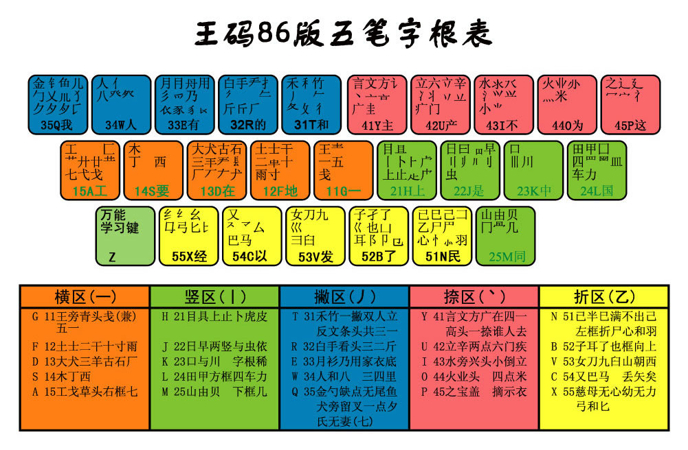
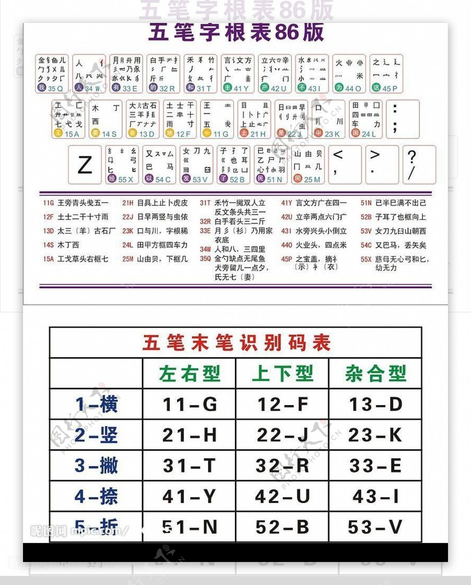

:source-highlighter: pygments
:icons: font
:scripts: cjk
:stem: latexmath
:toc:
:toc: right
:toc-title: 目录
:toclevels: 3

= 五笔86学习

++++
<button id="toggleButton">目录开关</button>

++++

== 五笔86字根表
.字根表

== 五笔86末笔表
.末笔表

== 五笔86难字表
https://wubi.xuelai.com/

glf 盏

