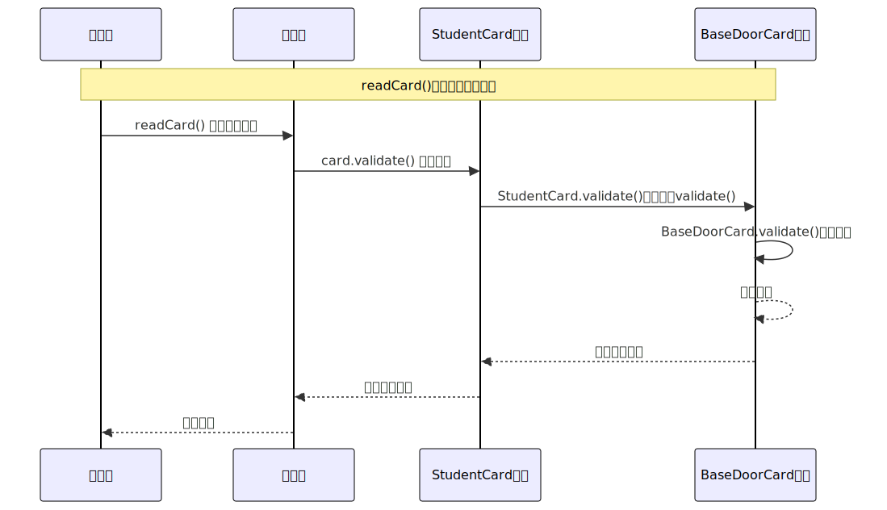
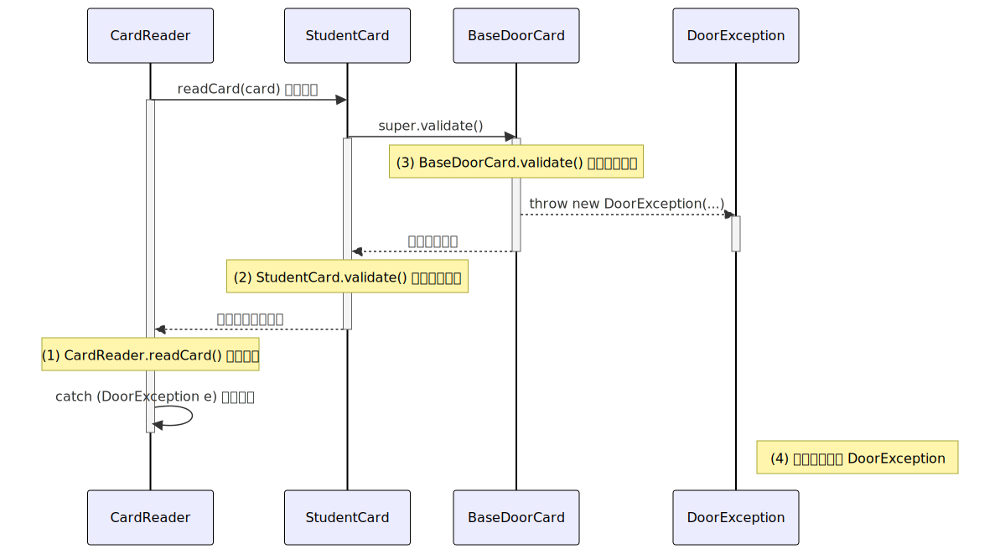

:author: https://github.com/wangzhaohe/swot-learning
:source-highlighter: pygments
:icons: font
:scripts: cjk
:stem: latexmath
:toc:
:toc: right
:toc-title: 目录
:toclevels: 4
:tip-caption: ⚡
:note-caption: ❕
:important-caption: ❗
:warning-caption: ‼️
:caution-caption: ⚠️

= 高级程序设计进阶理论教学内容（Java）共36学时

++++

<button id="toggleButton">目录开关</button>

++++

== 课程基本信息
.课程基本信息
[cols="1,3"]
|===
| 课程名称 | 高级程序设计进阶（Java）
| 总学时 | 72 学时（理论：36 / 实验：36）
| 学分 | 3 学分
| 考核方式 | 大作业 (70%) + 平时成绩 (30%)
|===

== Java 发展简史：从 Oak 到现代化云原生

=== 起源时代：Green Project (1991 - 1995)
Java 最初并非为了互联网设计，而是为了控制电视机顶盒等家用电器。

* **1991年**：James Gosling 带领 "Green Team" 启动项目，最初命名为 **Oak**。

* **1995年**：正式更名为 **Java**。恰逢万维网（WWW）爆发，Sun Microsystems 顺势推出了 **Java Applet**，使浏览器能够运行复杂的交互式程序，Java 因此迅速走红。

=== 奠基时代：J2SE 1.2 与三位一体 (1998 - 2004)
这是 Java 确立企业级江湖地位的关键时期。

* **1998年 (JDK 1.2)**：更名为 **Java 2**。

* **体系划分**：为了应对不同场景，Java 拆分为三个关键版本：
  ** **J2SE (Standard Edition)**: 核心标准版。
  ** **J2EE (Enterprise Edition)**: 企业级服务器版，开启了大规模分布式开发的时代。
  ** **J2ME (Micro Edition)**: 移动与嵌入式开发版（功能机时代的霸主）。

* **2004年 (JDK 5.0)**：语言层面的质变。引入了**泛型 (Generics)**、**注解 (Annotations)**、**枚举 (Enums)** 和 **增强型 for 循环**，极大提升了开发安全性。

=== 动荡与重生：Oracle 收购与开源 (2006 - 2014)
* **2006年**：Sun 宣布将 Java 源代码以 GPL 协议开源，**OpenJDK** 诞生，这保证了 Java 生态的自由与长寿。

* **2010年**：**Oracle 正式完成对 Sun 的收购**。虽然引发了法律诉讼和社区动荡，但 Java 的研发步入标准化商业运作。

* **2014年 (Java 8)**：**里程碑式的飞跃**。
  ** 引入 **Lambda 表达式** 和 **Stream API**，让 Java 具备了现代函数式编程的简洁性。
  ** 它是目前全球生产环境中使用率最高、最稳定的版本之一。

=== 快速更迭：六个月发布周期 (2017 - 2026)
为了应对云原生时代对轻量化和高性能的需求，Java 改变了慢节奏的传统。

[cols="1,3,2"]
|===
| 版本 | 核心特性 | 意义

| **Java 9** | 模块化系统 (Project Jigsaw) | 瘦身成功，让 JVM 能够按需加载。
| **Java 17** | 密封类 (Sealed Classes)、Record 类型 | 提升了代码的简洁度与建模能力。
| **Java 21** | **虚拟线程 (Virtual Threads)** | 革命性地解决了高并发下的线程开销问题。
| **Java 25** | (最新 LTS) 持续优化内存与启动速度 | 进一步巩固在容器化环境中的优势。
|===

=== 总结：Java 为什么长盛不衰？
[upperalpha]
. **向下兼容性**：核心原则是“不破坏旧代码”，保护了企业级资产。

. **JVM 经济圈**：不仅仅是语言，更是一个强大的运行时平台（支持 Kotlin, Scala 等）。

. **自我革新**：从 Project Loom (并发) 到 Project Valhalla (性能)，Java 始终在吸收现代语言的优点。

> "Write Once, Run Anywhere." -- Java 的核心信念

== Java 版本选择 Java17(LTS)
虽然 2026 年 Java 21 和 Java 25 已经普及，但考虑到『微服务』、『大数据』的配套库需求，Java 17 是目前的“平衡之王”。
选择原因如下：

1. 正常的 Web 开发

- **兼容性：** 现代主流 Web 框架（Spring Boot 3.x, Quarkus, Micronaut）的**最低要求**通常就是 Java 17。
- **Podman 实践：** 推荐使用 `eclipse-temurin:17-jdk` 作为基础镜像。它是社区最推荐的 OpenJDK 发行版，体积适中且极其稳定。

2. 微服务开发 (Spring Cloud / Eureka)

- **配套库支持：** 你提到的 **Eureka**、Config Server、Gateway 等 Spring Cloud 组件，在 Java 17 上运行最为完美。
- **Spring Boot 3.x：** 它是微服务的标准，而 Spring Boot 3 开始不再支持 Java 8。如果你用 Java 17，可以无缝使用所有最新的微服务特性。

3. 大数据开发 (Spark / Flink / Hadoop)

- **Spark 3.5+** 已经正式支持 Java 17。
- **Flink 1.18+** 也加入了对 Java 17 的支持。
+
NOTE: 虽然很多大数据框架可以在 Java 8/11 上运行，但 2026 年的企业级大数据平台正在全面向 17 迁移。Java 21 在大数据生态中的支持目前仍处于“试用”或“部分支持”阶段，容易遇到兼容性坑。

4. 配套的其他库

- **生态链：** 无论是数据库驱动、消息队列（Kafka, RabbitMQ）还是日志系统（Log4j2），在 Java 17 上都有成熟的 native 支持。

=== 避坑指南
****
* 不要选 Java 8： 除非要维护 10 年前的老项目，否则在 2026 年学习 Java 8 会错失大量现代特性（如 Record, Sealed Classes, Virtual Threads）。

* 谨慎对待 Java 21/25： 虽然它们有“虚拟线程”等神级特性，但在**大数据框架（如较旧版本的 Hadoop）**中可能会遇到反射调用失败或内存非法访问的问题。
****

== Java 之解惑

=== 编译、解释与 JIT 的三角关系
* **JavaScript (JS)：** 为了跨平台和网络分发而采用源码传输。比如 Chrome 浏览器的现代引擎（V8）使用 **JIT (Just-In-Time)** 在运行时将热点代码转为机器码。
    ** 跨平台与碎片化（最大的障碍）： 浏览器环境极其复杂。Chrome、Safari、Firefox 都有不同的内核，且运行在 Windows、Android、iOS 等各种硬件架构上。如果 JS 是编译后的二进制文件，开发者就得像发布安卓 App 或 Windows 软件一样，为每个平台编译一个版本。目前的 JS 代码（文本）由浏览器实时解析，确保了**“一份代码，到处运行”**。
    ** 网络传输效率： 编译后的二进制文件往往比压缩后的文本（Gzip/Brotli）大得多。在 Web 早期，带宽极其珍贵，传输文本更高效。
    ** 安全性： 浏览器是一个高度受限的“沙箱”。如果执行预编译的代码，浏览器很难实时监控代码是否在非法操作内存，安全性会大打折扣。
    ** 当前的“中间方案”： 实际上，现代浏览器已经进化了。它们不再是简单的“逐行解释”，而是采用了 JIT (Just-In-Time) 编译技术。
    ** 现在的做法是： JS 代码以文本形式传给浏览器，浏览器在运行过程中，把经常执行的热点代码直接编译成机器码。这兼顾了文本传输的灵活性和编译语言的高性能。

* **Java：** 属于“先编译、后解释、再 JIT”的混合语言。源码转为平台无关的**字节码**，由 JVM 执行。JIT 优化使其后期性能接近 C++。
    ** 第一阶段：编译（Compile）
        *** 开发者写完 .java 源代码后，使用 javac 命令进行编译。但它生成的不是 CPU 能直接读懂的机器码，而是 字节码（Bytecode，即 .class 文件）。
        *** 特点： 字节码是平台无关的，它不针对特定的 CPU。
    ** 第二阶段：解释与执行（Runtime）
        *** 当你在电脑上运行 Java 程序时，JVM（Java 虚拟机） 登场了。
        *** 解释： JVM 逐行读取字节码并将其翻译成当前机器的指令。
        *** JIT 编译： JVM 非常聪明，如果它发现某段代码运行了很多次，它会直接把这段字节码编译成机器码并缓存起来，下次直接运行，速度飞快。

* **Python：** 标准实现（CPython）也是字节码，但缺乏原生 JIT，且受限于**动态类型**的运行时检查，性能较差。

* **PyPy：** 带有 JIT 的 Python 实现，虽快但受限于 **C 扩展（C-API）兼容性**，未能在 AI 领域取代 CPython。
    ** 兼容性天敌（C 扩展）： Python 强大的核心在于它的生态（NumPy, Pandas, PyTorch）。这些库是用 C 语言写的。PyPy 运行纯 Python 代码极快，但在调用这些 C 扩展时，会有巨大的转换开销，甚至比标准 Python 还慢。
    ** 部署成本： 很多企业级应用更看重稳定性。标准 CPython 简单可靠，而 PyPy 的 JIT 内存占用更高，且偶尔会有难以预料的性能波动（JIT 预热过程）。

=== 为什么 AI 偏爱 Python 而非 Java？
* **性能错位：** AI 的重型矩阵运算在底层 C++/CUDA 中完成，Python 仅作为“指挥官”。
* **开发体验：** Python 语法更符合数学家思维（简洁、像数学公式）。
* **内存管理：** Java 的 **GC (垃圾回收)** 机制在处理海量张量数据时容易产生停顿，且 Java 的强类型在实验性开发中显得繁琐。

NOTE: 虽然 Java 在 AI 训练 领域不行，但在 大数据处理（Hadoop, Spark）和 企业级推理（将模型部署到后端）领域，Java 依然是主力。

=== 类型的本质与负担
* **Java(名义类型)：** 类型是程序的物理骨架，不可剥离。

* **Python：** 运行过程中根本不看类型。
    ** 现状： 现在的 Python 开发者（尤其是后端和 AI 工程师）大量使用 Type Hints。虽然 Python 解释器运行时依然忽略这些类型，但开发者会配合 mypy 或 PyCharm 这种工具进行静态检查。
    ** 为什么用？ 就像你说的，Python 太灵活了。如果没有类型标注，过三个月你自己都不知道这个函数返回的是列表还是字典。
    ** 库的标配： 像 FastAPI 或 Pydantic 这种现代库，完全是基于类型标注构建的。如果你不写类型，这些库甚至无法工作。

* **TypeScript (TS)：** 编译时进行**类型擦除**，转换后的 JS 代码通常比源码更简洁（去掉了 interface 等声明），运行效率由 JS 引擎决定。

=== 商业版权与开源治理

==== 甲骨文 (Oracle) 与 Java 诉讼
* **核心矛盾：** 尽管 Java 开源，但 Oracle 拥有商标权及特定商业组件所有权。其官司重心在于**“API 的组织结构和命名”**是否受版权保护（如 Oracle vs. Google）。

==== Python (PSF) 的自由之路
* **管理模式：** 归属于非营利基金会（PSF）。其许可证极其开放（PSF License），鼓励连接一切而不设商业关卡。

== Java 文件命名规范：文件名必须与类名一致吗？

=== 核心规则
在 Java 中，文件名是否必须与类名一致，取决于类（Class）的 **访问修饰符**。

[IMPORTANT]
====
如果类声明为 `public`，文件名**必须**与类名完全一致（包括大小写）。
====

=== 详细拆解
[upperalpha]
. 强制一致的情况：`public` 类
+
当你定义一个公共类时，编译器要求文件名匹配，以便于类加载器定位。
+
[source,java]
----
// 文件名必须叫 MyDemo.java
public class MyDemo {
    public static void main(String[] args) {
        System.out.println("Hello, Java!");
    }
}
----

. 可以不一致的情况：非 `public` 类
+
如果类没有 `public` 修饰符（使用的是默认包访问权限），文件名可以自由命名。

* **类名**：`class Secret`
* **文件名**：可以叫 `Internal.java`
* **编译结果**：执行 `javac Internal.java` 后，生成的字节码文件仍为 `Secret.class`。

. 单个文件包含多个类
+
Java 允许在一个 `.java` 源文件中定义多个类，但需遵循以下限制：

* **唯一性**：一个源文件中 **最多只能有一个** `public` 类。
* **命名权**：如果存在 `public` 类，文件名必须以此类命名。
* **全非 public**：如果所有类都不是 `public`，文件名可随意命名。

=== 总结对比
[cols="1,2,2", options="header"]
|===
| 场景 | 文件名要求 | 示例
| 包含 `public class MyDemo` | **必须**叫 `MyDemo.java` | 强制一致
| 包含 `class B` (非 public) | 可以叫 `B.java` 或 `Custom.java` | 灵活命名
| 包含 `public class MyDemo` 和 `class B` | **必须**叫 `MyDemo.java` | 以 public 类为准
|===

[IMPORTANT]
====
即便语法允许不一致，但在实际开发中（无论是使用 IntelliJ IDEA 还是 Neovim），建议始终保持 **一个文件一个类** 且 **名称完全一致**，这符合主流编程规范并能减少 LSP 报错。
====

== Java 语法基石（温故知新）
* *核心知识点*：变量与数据类型、运算符、分支语句（if/else）、循环结构（for/while）。

* *教学要求*：快速唤醒编程逻辑记忆，掌握 Java 最基本的语法骨架，为后续编写门禁系统业务逻辑打下地基。

=== 变量与数据类型 —— “门禁系统的信息容器”
[upperalpha]
. 知识点说明
+
程序运行需要处理数据，变量就是用来装数据的“带标签的盒子”。Java 是强类型语言，装什么货就必须用什么盒子。

* `int` (整数)：适合记录刷卡次数、楼层号。
* `double` (小数)：适合记录账户余额。
* `boolean` (布尔)：只有 true（是）和 false（否），极其适合做状态判断（如：门是否开启、卡是否激活）。
* `String` (字符串)：虽然不是基本类型，但最常用，用来记录姓名、卡号等文本。

. 代码举例（定义门禁卡基础信息）
+
[source,java]
----
// @edit code/testBasicSyntax/src/VariableDemo.java
public class VariableDemo {
    public static void main(String[] args) {
        // 声明并初始化变量
        String userName = "张三";
        String cardId = "A1234567";
        int swipeCount = 0;          // 刷卡次数
        boolean isActive = true;     // 卡片是否激活？true 代表已激活，false 代表未激活

        System.out.println("用户：" + userName + "，卡号：" + cardId + "，状态正常：" + isActive);
    }
}
----

=== 运算符与分支语句 (if/else) —— “智能保安的判断逻辑”
[upperalpha]
. 知识点说明
+
门禁系统的核心就是“判断”。刷卡时，系统需要对比条件，决定是开门还是报警。

* `==` (等于)、`!=` (不等于)、`>` (大于)。
* `&&` (并且：两个条件都得满足)、`||` (或者：满足一个就行)。

. 代码举例（模拟简单的刷卡校验）
+
[source,java]
----
// @edit code/testBasicSyntax/src/IfElseDemo.java
public class IfElseDemo {
    public static void main(String[] args) {
        boolean isCardValid = true; // 卡片有效
        int currentHour = 23; // 当前时间是晚上 23 点

        // 门禁规则：卡片必须有效，且时间必须在早6点到晚22点之间才能正常进入
        if (isCardValid && (currentHour >= 6 && currentHour <= 22)) {
            System.out.println("滴！验证通过，大门已开启。");
        } else if (!isCardValid) {
            System.out.println("警报：无效卡片！");
        } else {
            System.out.println("提示：已过门禁时间，请联系管理员。");
        }
    }
}
----

=== 循环结构 (for/while) —— “不知疲倦的读卡器”
[upperalpha]
. 知识点说明
+
计算机最擅长的就是做重复的苦力活。

* **`while` 循环**：只要条件满足，就一直干。适合“不知道具体要执行多少次”的场景（比如读卡器一直通电等待刷卡）。
* **`for` 循环**：明确知道要执行多少次。适合“遍历、计数”的场景（比如找出今天刷卡超过 5 次的人）。

. 代码举例（使用 while 模拟读卡器待机，使用 for 模拟批量授权）
+
[source,java]
----
// @edit code/testBasicSyntax/src/LoopDemo.java
import java.util.Scanner;

public class LoopDemo {
    public static void main(String[] args) {
        // --- for 循环演示：批量给 3 张新卡初始化 ---
        System.out.println("--- 批量发卡程序启动 ---");
        for (int i = 1; i <= 3; i++) {
            System.out.println("正在制作第 " + i + " 张门禁卡...");
        }
        // --- while 循环演示：模拟读卡器持续工作 ---
        Scanner scanner = new Scanner(System.in);
        boolean powerOn = true;

        System.out.println("\n--- 读卡器已就绪，请输入卡号 (输入 exit 关闭机器) ---");

        while (powerOn) {
            System.out.print("请刷卡 > ");
            String input = scanner.nextLine();

            if (input.equals("exit")) {
                System.out.println("收到关机指令，读卡器关闭。");
                powerOn = false; // 打断循环条件
                // break; // 也可以直接使用 break 跳出循环
            } else {
                System.out.println("读取到卡号：" + input + "，处理中...");
            }
        }
        scanner.close();
    }
}
----

=== 方法 (Methods) —— “打包好的安检流水线”
[upperalpha]
**方法（也叫函数）**就是把一段经常使用的代码“打包”起来，起个名字。以后只要喊这个名字，这段代码就会自动执行。

. 知识点说明
* **参数 (Parameters)**：交给流水线的原材料（比如：待校验的卡号）。
* **返回值 (Return Value)**：
  *** 流水线处理完给的结果（比如：格式是否正确的 `boolean` 结果）。
  *** `void` 代表只干活，不返回结果。

. 代码举例（封装门禁卡校验逻辑）
+
[source,java]
----
public class MethodDemo {
    /**
     * 自定义方法：专门用来校验门禁卡格式
     * @param cardId 输入的卡号
     * @return 如果以 A 开头且长度为 8，返回 true，否则返回 false
     */
    public static boolean checkCardFormat(String cardId) {
        System.out.println(">>> 安检流水线启动，正在扫描卡号: " + cardId);
        if (cardId.startsWith("A") && cardId.length() == 8) {
            return true; // 检验合格，打回 true，方法立刻结束
        } else {
            return false; // 检验不合格，打回 false
        }
    }

    // 主程序：系统的入口
    public static void main(String[] args) {
        String card1 = "A1234567";
        String card2 = "B999";
        
        // 直接“呼叫”我们写好的方法，并接收返回值
        boolean result1 = checkCardFormat(card1);
        boolean result2 = checkCardFormat(card2);
        
        System.out.println("卡号 " + card1 + " 校验结果：" + result1);
        System.out.println("卡号 " + card2 + " 校验结果：" + result2);
    }
}
----

. 小结与避坑

* **初学者的痛点**：很多时候会忘记写 `return`，或者在声明了返回 `boolean` 的方法里 `return 1`。强调“承诺给什么类型，就必须返回什么类型”。

* **教学互动**：可以写一个 `public static void openDoor(String doorName)` 方法，不需要返回值，只要打印出“XX大门已开启，欢迎您”即可，体会 `void` 的用法。

=== 语法基石小结
本章我们补齐了盖起门禁大楼所需的全部“基础砖块”。针对初学者，请务必在脑海中刻下以下几条铁律：

* 严谨的“强类型”：
  ** Java 是极其严谨的，装什么货就必须配什么箱子（类型）。
  ** 千万不要试图把小数存进 `int` 里，或者把文本赋值给 `boolean`。

* 致命的单双等号 (`=` vs `==`)：
  ** 很多时候在写 `if` 判断时，极易把双等号 `==` 写成单等号 `=`。
  ** 在 Java 中 `=` 是用来赋值的，`==` 才是用来比较数字和布尔值的。
  ** 再次重申：字符串的比较绝对不能用 `==`，必须用 `.equals()`。

* 让程序“活”起来的循环：
  ** 死循环不一定是 Bug。在接下来的实验环节中，我们正是要利用无限 `while` 循环，加上控制台输入（`Scanner`），让整个门禁系统真正处于“持续待机”的监听状态，而不是运行一次就结束退出了。

* 告别“面条代码”的方法思维：
  ** 不要把成百上千行的代码全塞进 `main` 方法里！
  ** 学完方法后，要养成“把复杂逻辑拆解、打包”的习惯。
  ** 让 `main` 方法只负责做个宏观的“调度员”，具体的脏活累活交给各个自定义方法去干。

> 到目前为止，我们写的代码还是“面向过程”的（一条流水线跑到底）。有了变量装数据、有了 if/while 做逻辑、有了方法做打包，下一章，我们将正式踏入 Java 的核心——**“面向对象”**，学习如何把这些零散的砖块，组装成一台真正具有独立功能的门禁机器！

== 面向对象基础 (4学时) -> 重中之重！！！
* *核心知识点*：类与对象、抽象与封装、属性与方法、继承与多态、接口设计。

* *教学要求*：深入理解面向对象设计思想，熟练掌握接口与抽象类的应用场景。

* *教学目标*：让学生从“执行者”转变为“设计者”，理解 Java 程序的组织逻辑。

=== 类与对象 —— “设计图纸”与“门禁实物”
[upperalpha]
. 知识点说明
* 类 (Class)：相当于一张门禁机的设计图纸 。它规定了门禁机应该长什么样（安装位置、型号）以及能干什么（读取卡号、开启大门）。
* 对象 (Object)：是根据图纸生产出来的具体某一台门禁机 。
+
TIP: 记住一句话：你不能刷“图纸”进门，你只能刷装在墙上的“门禁机实体” 。在 Java 中，我们要先写类，再用 new 关键字制造出对象 。

. 代码举例
+
[source,java]
----
// code/testBasicSyntax/src/DoorMachineDemo.java
// 定义类（门禁机设计图纸）
class DoorMachineV01 {
    String location;  // 属性：安装位置（如：南大门、图书馆入口）
    String model;     // 属性：机器型号

    // 行为：开启大门的功能
    void openDoor(String userName) {
        System.out.println(
            "【" + location + "】验证通过！欢迎您，" + userName + "。大门已开启。"
        );
    }
}

// 使用类（安装并使用具体的门禁机）
public class DoorMachineDemo {
    public static void main(String[] args) {
        // 使用 new 关键字，根据图纸造出一台真实的门禁机
        DoorMachineV01 southGate = new DoorMachineV01();

        // 给这台具体的机器设置属性
        southGate.location = "学校南大门";
        southGate.model = "SWOT-A100";

        // 让这台机器执行功能：刷卡开门
        southGate.openDoor("张三");

        // 我们还可以根据同一张图纸，再造一台放在图书馆
        DoorMachineV01 libraryGate = new DoorMachineV01();
        libraryGate.location = "图书馆主楼";
        libraryGate.openDoor("李四");
    }
}
----

=== static 关键字 —— “门禁系统的全局可访问属性”
[upperalpha]
. 为什么要学？
* 在写面向对象代码时，最容易让人崩溃的就是：为什么我不能直接调用一个类里的普通属性或者方法？
* 为什么必须要 `new` 一个对象出来再调用？
* 这就涉及到 `static`（静态）的本质。

. 知识点说明

* **非静态（实例成员）**：属于**具体某个对象**的私有财产。比如“南大门的地理位置”、“北大门的地理位置”，每台门禁机是不一样的。必须 `new` 出具体的门禁机，才能访问。

* **静态（static 成员）**：属于**整个类**的共享财产，就像挂在墙上的全局广播站。比如“今天全校总共刷卡多少次”，所有门禁机共享这一个数字。不需要 `new`，直接通过 `类名.变量名` 就能看。

. 场景举例（单台门禁机 vs 监控中心）
+
[source,java]
----
// code/testBasicSyntax/src/StaticDemo.java
class DoorMachineV02 {
    // 非静态变量：属于每台具体的机器（私有财产）
    String location;  // 属性：安装位置（如：南大门、图书馆入口）
    String model;     // 属性：机器型号

    // 静态变量：属于整个安保系统共享（全局统计）
    static int totalSwipes = 0;  // new added

    // 构造方法：出厂时设置安装位置
    public DoorMachineV02(String loc) {
        this.location = loc;
    }

    // 刷卡动作
    public void swipe() {
        System.out.println(this.location + "门禁机：收到刷卡请求！");
        totalSwipes++; // 每次刷卡，全局统计数据 +1
    }
}

public class StaticDemo {
    public static void main(String[] args) {
        // 1. 造两台具体的门禁机
        DoorMachineV02 southDoor = new DoorMachineV02("南大门");
        DoorMachineV02 northDoor = new DoorMachineV02("北大门");

        // 2. 它们各自独立工作（调用非静态方法）
        southDoor.swipe();
        northDoor.swipe();
        northDoor.swipe();

        // 3. 查看全局数据（调用静态变量，直接用【类名.变量名】）
        System.out.println("--- 监控中心系统 ---");
        System.out.println("今日全校累计刷卡总数：" + DoorMachineV02.totalSwipes);  // 3
    }
}
----

. 核心避坑铁律
[IMPORTANT]
====
**静态不能直接访问非静态！**

* `main` 方法天生就是 `static` 的。
* 如果在 `main` 里面想调用一个非静态的方法，Java 会报错。因为 Java 不知道你到底想调用“南大门”的方法，还是“北大门”的方法。
* 所以必须先 `new` 一个具体的门禁机出来！
====

=== 封装 —— “门禁卡的智能芯片”
[upperalpha]
. 知识点说明
* **私有化 (private)**：把核心数据（如工号、姓名、卡号、状态）藏在类内部的“芯片”里，防止外部代码直接乱碰和非法篡改。
* **Getter|Setter (安全读写窗口)**：你想读取或修改数据？不能直接硬改，必须通过类提供的“安全按钮”（方法）来进行。
* **只读保护（Read-Only）**：如果某个数据（比如工号）绝不允许修改，**只需不写它的 Setter 方法即可**。这样外部就彻底失去了修改它的途径。

. 生活举例
+
门禁卡内部的存储芯片是密封的，你不需要（也不应该）拆开卡片去强行改变里面的磁性数据。你只需要把卡放在读卡器上，让系统通过标准的读写接口，安全地读取卡号或更新卡片状态。而像出厂序列号这种数据，更是被硬件锁死，只能看不能改。

. 代码举例
+
[source,java]
----
/**
 * 门禁卡类：模拟卡片内部的存储芯片。
 * 核心思想：数据安全，受控访问。
 */
class DoorCard {
    // 私有化属性：像芯片数据一样锁起来，外部无法直接用 . 来获取
    private String serialNumber; // 卡片序列号 (硬件固化，绝对不可改)
    private String ownerId;      // 持卡人工号 (写卡后不可随意更改)
    private String ownerName;    // 持卡人姓名 (允许修改，但需校验)
    private boolean active;      // 激活状态 (支持挂失/解挂)

    // 无参数构造方法：Java 编程习惯
    public DoorCard() {}

    // 初始发卡：一键写入初始数据
    public DoorCard(String serialNumber, String ownerId, String ownerName, boolean active) {
        this.serialNumber = serialNumber;
        this.ownerId = ownerId;
        this.ownerName = ownerName;
        this.active = active;
    }

    // 序列号：只有 Getter，没有 Setter (真正的硬件只读)
    public String getSerialNumber() {
        return serialNumber;
    }
    // 工号：只有 Getter，没有 Setter (一旦绑定，禁止外部直接篡改)
    public String getOwnerId() {
        return ownerId;
    }
    // 姓名：提供 Setter，但加入“安检”逻辑
    public String getOwnerName() {
        return ownerName;
    }
    public void setOwnerName(String ownerName) {
        if (ownerName != null && ownerName.length() >= 2) {
            this.ownerName = ownerName;
        } else {
            System.out.println("【系统纠错】更名失败：姓名格式合法性校验未通过！");
        }
    }
    // 状态：标准的读写接口，isActive 比 getActive 更容易理解
    public boolean isActive() {
        return active;
    }
    public void setActive(boolean active) {
        this.active = active;
    }
}
// code/testBasicSyntax/src/DoorCardDemo.java
public class DoorCardDemo {
    public static void main(String[] args) {
        // 制作一张新卡
        DoorCard myCard = new DoorCard("SN-9527", "EMP001", "周星星", true);
        System.out.println("--- 读卡成功 ---");
        System.out.println("序列号：" + myCard.getSerialNumber());
        System.out.println("持卡人：" + myCard.getOwnerName());

        // 模拟非法篡改核心数据（序列号）
        // myCard.serialNumber = "SN-0001";   // 编译报错：private 属性不允许直接读取
        // myCard.setSerialNumber("SN-0001"); // 编译报错：根本没写这个方法，改不了！

        // 通过合法渠道修改信息
        System.out.println("\n--- 正在办理更名手续 ---");
        myCard.setOwnerName("周星驰");  // 成功
        myCard.setOwnerName("");       // 拦截：触发 Setter 内部校验

        // 模拟卡片挂失操作
        System.out.println("\n--- 模拟挂失操作 ---");
        myCard.setActive(false);
        System.out.println("卡片状态：" + (myCard.isActive() ? "有效" : "已失效/已挂失"));
    }
}
----

.关于 Java 中 `return active;` 省略 `this` 的解析
****
在 Java 中，`return active;` 和 `return this.active;` 在当前的代码里**效果是完全一样的**。
之所以这里没有写 `this`，主要涉及 Java 的**作用域优先级（Scope Priority）**和**编码习惯**。

[upperalpha]
. 为什么可以省略 `this`？
+
在 Java 中，当方法内**没有重名**的局部变量时，编译器会自动去寻找类成员变量（Field）。

* **没有冲突：** 在 `isActive()` 方法内部，你没有定义一个叫 `active` 的局部变量，也没有同名的参数。
* **自动定位：** 既然内部找不到，Java 就会自动向上寻找，发现类中定义了 `private boolean active;`，于是它就直接使用了这个变量。

. 什么时候必须使用 `this`？
+
对比一下你的 `setActive` 方法和 `isActive` 方法，区别一目了然：
+
[cols="1,2,2", options="header"]
|===
| 方法类型 | 代码示例 | 为什么必须/不必用 `this`？

| **Setter**
| `this.active = active;`
| **必须用**。参数名也叫 `active`。如果不加 `this`，Java 会认为你在执行“局部变量 = 局部变量”，导致成员变量无法被正确赋值。

| **Getter**
| `return active;`
| **可选**。该方法没有参数。由于不存在重名冲突，Java 明确知道这个 `active` 指的就是类里的成员变量。
|===

. 两种风格的博弈
+
虽然省略 `this` 是合法的，但程序员通常分为两个流派：

** 极简派（最常见）： 只要不冲突就不写 `this`。代码更清爽，遵循“默认即成员”的直觉。
** 显式派：无论是否冲突，访问成员变量必带 `this`（例如 `return this.active;`）。这能让人一眼看出哪个是类的属性，特别是在代码量巨大的时候。

[NOTE]
====
**结论：** 在你的 `DoorCard` 类中，`return active;` 不写 `this` 是完全正确的写法。这体现了 Java 的变量寻址机制，即在没有局部干扰时自动指向成员变量。
====
****

=== 包管理 —— “大楼的房间划分” -> 属于架构上的设计
[upperalpha]
. 为什么要学？
+
如果我们把门禁系统的所有代码（用户实体、刷卡逻辑、数据库连接、主程序）全塞在一个文件夹里，随着代码变多，就会变成一个混乱的“垃圾堆”。

* 包 (Package) 就是用来给代码分类建文件夹的，可以比喻成房间；

. 项目结构标准划分（包管理）
+
在企业级开发中，通常按照功能来建包（推荐使用倒置域名命名法）。为了让门禁系统看起来像一个真正的工程，目录应该长这样：
+
----
src/
├── com.swot.door.entity    // 实体包：存放 门卡类（只存数据模型）
├── com.swot.door.exception // 异常包：存放 DoorSystemException 类
├── com.swot.door.utils     // 工具包：存放后续要写的 DBUtils 数据库工具
└── com.swot.door.main      // 启动包：存放包含 main 方法的主程序
----

. 小结
* **规范第一**：从今天起，告别“默认包（Default Package）”。写任何类之前，先建好 `package`。

TIP: 赶紧试着去改下自己的目录结构吧？加油！

IMPORTANT: 不是所有的项目必须要严格地进行拆包，避免过度设计。根据实际架构而定，能够高效快速开发，易维护即可。

=== 继承与多态 —— “父子卡片”与“读卡器逻辑”
[upperalpha]
. 知识点说明
* **继承 (Inheritance)**：子类自动拥有父类的特征。所有卡片（学生卡、管理员卡）都有卡号，我们只需在父类定义一次。
* **多态 (Polymorphism)**：同一种动作，不同的反应。读卡器只需要喊一声“校验”，不同身份的卡片会自动展示不同的权限。

. 代码举例
+
[source,java]
----
// @clean code/testBasicSyntax/src/inheritanceExample/Card.java
package inheritanceExample;
/**
 * 类名：BaseDoorCard (由 DoorCard 演化而来)
 */
class BaseDoorCard {
    private String serialNumber;
    private String ownerName;

    // 全参构造器
    public BaseDoorCard(String serialNumber, String ownerName) {
        this.serialNumber = serialNumber;
        this.ownerName = ownerName;
    }

    // 封装逻辑：Getter
    public String getOwnerName() {
        return ownerName;
    }

    // 多态的核心：父类定义一个“动作标准”
    public void validate() {
        System.out.println("【基础校验】正在核验卡片物理信息...");
    }
}
class StudentCard extends BaseDoorCard {
    public StudentCard(String serialNumber, String ownerName) {
        super(serialNumber, ownerName); // 继承父类的构造
    }

    // 重写父类的方法 validate()
    @Override
    public void validate() {
        super.validate(); // 先执行父类的 validate() 方法，进行通用检测
        System.out.println("【学生卡】检测成功：确认 " + getOwnerName() + " 的图书馆访问权限。");
    }
}

class AdminCard extends BaseDoorCard {
    public AdminCard(String serialNumber, String ownerName) {
        super(serialNumber, ownerName);
    }

    @Override
    public void validate() {
        super.validate(); // 先执行父类的通用检测
        System.out.println("【管理员卡】检测成功：开启全校所有通道。");
    }
}

// 读卡器服务类 (展示多态的精髓)
// 它可以接收 StudentCard，也可以接收 AdminCard，甚至未来的 TeacherCard
class CardReader {
    // 这里传入的是 BaseDoorCard，展示了多态的兼容性
    public void readCard(BaseDoorCard card) {
        System.out.print("读卡器感应 -> ");
        card.validate(); // 自动触发对应的子类方法
    }
}

// @clean code/testBasicSyntax/src/inheritanceExample/Run.java
package inheritanceExample;

public class Run {
    public static void main(String[] args) {
        CardReader cardReader = new CardReader();

        // 准备好不同的卡片（向上转型）
        BaseDoorCard studentCard = new StudentCard("S-2024-001", "小明");
        BaseDoorCard adminCard = new AdminCard("A-007", "张老师");

        // 统一调用读卡器的同一个方法，产生不同的行为
        cardReader.readCard(studentCard); // 输出学生权限
        cardReader.readCard(adminCard); // 输出管理员权限
    }
}
----

. 为什么这样设计？
  * **解耦性**：`CardReader` 硬件逻辑与具体的卡片类型解耦。它不需要知道什么是“学生卡”，它只认识“门禁卡”。
  * **可扩展性**：如果增加“教师卡”或“访客卡”，只需新建子类继承 `BaseDoorCard`，`CardReader` 的代码一行都不用改。

=== 抽象类 --- 禁止基础门卡类创建新卡对象（因为没有这种卡）
这一版在继承的基础上 ，通过 `abstract` 关键字从语义和语法上解决了 `BaseDoorCard` 不应被实例化”的问题。

另外还通过声明包，解决类名冲突问题。
代码举例如下：

[source,java]
----
// @clean code/testBasicSyntax/src/abstractionExample/Card.java
// 通过声明包，解决类名冲突问题
package abstractionExample; // 必须匹配文件夹的名字

/**
 * 类名：BaseDoorCardAbs (抽象类)
 * 演化点：使用了 abstract 关键字。
 * 1. 约束：禁止通过 new BaseDoorCard() 直接创建对象。
 * 2. 规范：强制子类必须实现特定的权限说明逻辑，如方法 showAccessScope()。
 */
abstract class BaseDoorCard {
    private String serialNumber;
    private String ownerName;

    public BaseDoorCard(String serialNumber, String ownerName) {
        this.serialNumber = serialNumber;
        this.ownerName = ownerName;
    }

    public String getOwnerName() {
        return ownerName;
    }

    /**
     * 通用逻辑：所有卡片都要进行的物理核验。
     * 抽象类可以拥有具体实现的方法。
     */
    public void validate() {
        System.out.println("【基础校验】正在核验卡片物理信息...");
    }

    /**
     * 抽象方法：强制规范。
     * 每一个具体的卡片子类，必须通过此方法明确自己的权限范围 。
     */
    public abstract void showAccessScope();
}

// --- 子类必须实现抽象方法 ---
class StudentCard extends BaseDoorCard {
    public StudentCard(String serialNumber, String ownerName) {
        super(serialNumber, ownerName); // 继承并调用父类构造器
    }

    @Override
    public void validate() {
        super.validate(); // 执行通用检测
        showAccessScope(); // 执行个性化权限展示
    }

    @Override
    public void showAccessScope() {
        System.out.println("【权限范围】学生卡：确认" + getOwnerName() + "的图书馆/教学楼访问权限。");
    }
}

class AdminCard extends BaseDoorCard {
    public AdminCard(String serialNumber, String ownerName) {
        super(serialNumber, ownerName);
    }

    @Override
    public void validate() {
        super.validate();
        showAccessScope();
    }

    @Override
    public void showAccessScope() {
        System.out.println("【权限范围】管理员卡：开启全校所有通道，含机房与档案室。");
    }
}

// 读卡器服务类 (展示多态的精髓)
// 它可以接收 StudentCard，也可以接收 AdminCard，甚至未来的 TeacherCard
class CardReader {
    // 这里传入的是 BaseDoorCard，展示了多态的兼容性
    public void readCard(BaseDoorCard card) {
        System.out.print("读卡器感应 -> ");
        card.validate(); // 自动触发对应的子类方法
    }
}

// code/testBasicSyntax/src/use_abstraction/Run.java
// 通过声明包，解决类名冲突问题
package abstractionExample; // 必须匹配文件夹的名字

public class Run {
    public static void main(String[] args) {
        CardReader cardReader = new CardReader();

        // 向上转型：父类引用指向子类对象
        BaseDoorCard studentCard = new StudentCard("S-2024-001", "小明");
        BaseDoorCard adminCard = new AdminCard("A-007", "张老师");

        cardReader.readCard(studentCard);
        System.out.println("--------------------");
        cardReader.readCard(adminCard);

        // 演示抽象类的约束：
        // BaseDoorCard mysteryCard = new BaseDoorCard("X-000", "未知");
        // 上行代码会报错：'BaseDoorCard' is abstract; cannot be instantiated
    }
}
----

=== 接口设计 —— “功能准入协议”
[upperalpha]
. 知识点说明

* 接口 (interface)：它不干活，只负责定规矩。
* 生活举例：USB 标准。不管你是鼠标还是 U 盘，只要符合 USB 规范，电脑就能识别。
* 在门禁系统中的应用：有些卡只能开门（继承 BaseDoorCard），有些卡还能打饭（实现 Payable 接口）。

. 代码举例
+
[source,java]
----
// @clean code/testBasicSyntax/src/interfaceExample/Card.java
// 通过声明包，解决类名冲突问题
package interfaceExample; // 必须匹配文件夹的名字

/**
 * 类名：BaseDoorCardAbs (抽象类)
 * 演化点：使用了 abstract 关键字。
 * 1. 约束：禁止通过 new BaseDoorCard() 直接创建对象。
 * 2. 规范：强制子类必须实现特定的权限说明逻辑，如方法 showAccessScope()。
 */
abstract class BaseDoorCard {
    private String serialNumber;
    private String ownerName;

    public BaseDoorCard(String serialNumber, String ownerName) {
        this.serialNumber = serialNumber;
        this.ownerName = ownerName;
    }

    public String getOwnerName() {
        return ownerName;
    }

    /**
     * 通用逻辑：所有卡片都要进行的物理核验。
     * 抽象类可以拥有具体实现的方法。
     */
    public void validate() {
        System.out.println("【基础校验】正在核验卡片物理信息...");
    }

    /**
     * 抽象方法：强制规范。
     * 每一个具体的卡片子类，必须通过此方法明确自己的权限范围 。
     */
    public abstract void showAccessScope();
}

/**
 * 学生卡：既是门禁卡，又能支付 (多重身份)
 */
class StudentCard extends BaseDoorCard implements Payable {
    public StudentCard(String serialNumber, String ownerName) {
        super(serialNumber, ownerName); // 继承并调用父类构造器
    }

    @Override
    public void pay(double amount) {
        System.out.println("【食堂消费】学生 " + getOwnerName() + " 支付了 " + amount + " 元。");
    }

    @Override
    public void validate() {
        super.validate(); // 执行通用检测
        showAccessScope(); // 执行个性化权限展示
    }

    @Override
    public void showAccessScope() {
        System.out.println("【权限范围】学生卡：确认 " + getOwnerName() + " 的图书馆/教学楼访问权限。");
    }
}

class AdminCard extends BaseDoorCard {
    public AdminCard(String serialNumber, String ownerName) {
        super(serialNumber, ownerName);
    }

    @Override
    public void validate() {
        super.validate();
        showAccessScope();
    }

    @Override
    public void showAccessScope() {
        System.out.println("【权限范围】管理员卡：开启全校所有通道，含机房与档案室。");
    }
}

/**
 * 食堂刷卡机：它不关心你是哪种卡，它只认“Payable”接口
 */
class CanteenReader {
    public void processPayment(Payable card, double price) {
        System.out.println("--- 食堂刷卡机感应中 ---");
        card.pay(price); // 只要实现了 Payable，就一定有 pay 方法
    }
}

/**
 * 支付接口：定义了“能够支付”的规范
 */
interface Payable {
    void pay(double amount); // 谁实现这个接口，谁就必须具备支付功能
}

// @clean code/testBasicSyntax/src/interfaceExample/Run.java
package interfaceExample;

public class Run {
    public static void main(String[] args) {
        StudentCard studentCard = new StudentCard("S-2024-001", "小明");
        AdminCard adminCard = new AdminCard("A-007", "张老师");

        CanteenReader canteen = new CanteenReader();

        // 1. 学生卡实现了 Payable，可以打饭
        canteen.processPayment(studentCard, 15.0);

        // 2. 管理员卡没实现 Payable，下面这行代码在编译时就会报错
        // canteen.processPayment(adminCard, 20.0); // 编译不通过：张老师的卡不能在食堂付钱
    }
}
----

. 设计说明
* 区分“是什么”与“能干什么”：
  ** extends (继承) 代表 身份：它“是一个”门禁卡 。
  ** implements (接口) 代表 能力：它“具备”支付功能 。

* 解耦的极高境界：CanteenReader（食堂机器）完全不需要知道 BaseDoorCard。哪怕以后学校引入了“手机刷脸支付”，只要刷脸系统实现了 Payable 接口，食堂机器照样能用。

* 安全性：通过接口，我们从代码层面限制了“只有该付钱的卡才能付钱”，避免了管理员误刷卡消费的逻辑错误。

=== 访问权限 —— “房间门锁” -> import public class
[upperalpha]
. 访问权限（门锁的级别）
+
Java 中有四种权限，初学阶段不需要死记硬背，只要牢记最极端的两个即可：
+
[cols="1,1,3", options="header"]
|===
| 权限修饰符 | 生活比喻 | 作用范围
| **public** (公共) | 随便进的“大厅” | 任何包、任何类都可以直接访问和调用。
| **private** (私有) | 锁死的“保险柜” | 只有**当前类自己**的内部才能访问，外部绝对进不来。（所以实体类的属性必须是 private！）
|===
+
*(注：还有 `protected` 和默认权限，它们主要与同包或子类有关，后续学框架时再深究。)*

. 代码举例（跨房间叫人：从其他包导入类）
+
* 当你把类分到不同的包里后，如果想要用到另一个包里的类，就必须使用 `import` 来指明路径（就像告诉 Java 去哪个房间找人）。
* 因 public 类要求类名必须和文件名一样，所以我们新建一个 TeacherCard.java，里面的类名使用 TeacherCard。
+
[source,java]
----
// @clean code/testBasicSyntax/src/importPublicExample/Run.java
package importPublicExample;

import inheritanceExample.TeacherCard;

public class Run {
    public static void main(String[] args) {
        TeacherCard teacherCard = new TeacherCard("S-2024-001", "王老师");
        System.out.println("持卡人：" + teacherCard.getOwnerName());
    }
}
// @clean code/testBasicSyntax/src/inheritanceExample/TeacherCard.java
package inheritanceExample;

public class TeacherCard extends BaseDoorCard {
    public TeacherCard(String serialNumber, String ownerName) {
        super(serialNumber, ownerName); // 继承父类的构造
    }

    // 重写父类的方法 validate()
    @Override
    public void validate() {
        super.validate(); // 先执行父类的 validate() 方法，进行通用检测
        System.out.println("【教师卡】检测成功：确认 " + getOwnerName() + " 的实验室访问权限。");
    }
}

----

. 小结
* **权限铁律**：提供给别人调用的类和方法，##必须(must)用 `public`##；
* 自己内部保存的数据属性，死死锁住用 `private`，然后开一扇带安检的窗口（`public` 的 Getter/Setter）。

=== 面向对象基础小结
面向对象是 Java 的核心灵魂。不需要死记硬背枯燥的理论，只需在脑海中牢记这四个核心比喻：

* **类与对象**：类是“设计图纸”，对象是“实物”。你不能给手机图纸打电话，必须先用 `new` 制造出手机实物才行。

* **封装**：把重要数据锁在私有的保险柜里 (`private`)，只对外提供安全的交互窗口 (`public` Getter/Setter)。

* **继承与多态**：继承是“子承父业”（直接拥有父亲的功能）；多态是“同一种指令，不同的反应”。

* **接口**：它不干活，只定规矩（就像 USB 插座标准），谁想接入系统，谁就得按规矩实现功能。

== 常用工具类 (4学时)
本节要求：掌握最常用的 String 字符串处理和 Date 时间记录方法。

[upperalpha]
. 门禁系统拿到的卡号可能有空格，或者我们需要检查卡号长度是否正确。
* String 类就是我们的“文字加工厂”。
  ** `length()`：数数有几个字（检查卡号位数）。
  ** `trim()`：掐头去尾掉空格（防止用户不小心多打了空格）。
  ** `equals()`：比较两个词长得是否**一模一样**（比对密码/卡号）。
  ** `substring()`：切下一块肉（提取身份证里的生日）。

. 门禁系统必须记录：谁在 *什么时候* 刷了卡？
  ** `new Date()`：获取此时此刻的系统时间。
  ** `SimpleDateFormat`：把时间从“一串数字”变成“人能看懂的文字”。生活举例：
    *** 就像相机的“时间水印”，`Date` 抓拍瞬间，`SimpleDateFormat` 决定水印印成 "2026/10/01" 还是 "10月1日"。

. 注意事项
+
[NOTE]
====
关于 String 比较：

* 重点强调：一定要反复强调 String 比较用 .equals()，而不是 ==。
* 这是初学者最容易踩的坑，可以用“一个是比长相，一个是比灵魂”来打比方。

关于 Date：

* 虽然 Java 8 之后有了 LocalDateTime，但 Date + SimpleDateFormat 的代码量更少，概念更直观。
====

=== 应用工具类
[source,java]
----
// @clean code/testBasicSyntax/src/stringDateExample/Card.java
package stringDateExample;

import java.util.Date;
import java.text.SimpleDateFormat;

/**
 * 类名：BaseDoorCardAbs (抽象类)
 * 演化点：使用了 abstract 关键字。
 * 1. 约束：禁止通过 new BaseDoorCard() 直接创建对象。
 * 2. 规范：强制子类必须实现特定的权限说明逻辑，如方法 showAccessScope()。
 */
abstract class BaseDoorCard {
    private final String serialNumber;  // 初始化后不可再变
    private String ownerName;

    public BaseDoorCard(String serialNumber, String ownerName) {
        // -- new -- 增加去除卡号多余空格功能
        this.serialNumber = (serialNumber != null) ? serialNumber.trim() : "";  // <1> 

        // -- new -- 增加卡号长度校验
        if (this.serialNumber.length() !=8) {  // <2>
            System.out.println("【数据异常】警告：新创建的卡号 [" + this.serialNumber + "] 长度非8位！");
        }
        this.ownerName = ownerName;
    }

    public String getSerialNumber() {
        return serialNumber;
    }
    public String getOwnerName() {
        return ownerName;
    }

    /**
     * 通用逻辑：所有卡片都要进行的物理核验。
     * 抽象类可以拥有具体实现的方法。
     */
    public boolean validate() {
        System.out.println("【系统日志】正在启动刷卡即时校验...");
        // -- new -- 增加卡号长度校验
        if (this.serialNumber.length() != 8) {  // <3>
            System.out.println("校验失败：卡号格式非法，拒绝通行！");
            return false;
        }
        // 还可以配合 equals 检查是否在白名单中
        System.out.println("物理校验通过。");
        return true;
    }

    /**
     * 抽象方法：强制规范。
     * 每一个具体的卡片子类，必须通过此方法明确自己的权限范围 。
     */
    public abstract void showAccessScope();
}
/**
 * 学生卡：既是门禁卡，又能支付 (多重身份)
 */
class StudentCard extends BaseDoorCard implements Payable {
    public StudentCard(String serialNumber, String ownerName) {
        super(serialNumber, ownerName); // 继承并调用父类构造器
    }

    @Override
    public void pay(double amount) {
        System.out.println("【食堂消费】学生 " + getOwnerName() + " 支付了 " + amount + " 元。");
    }

    @Override
    public boolean validate() {
        boolean isValid = super.validate();
        if (isValid) {
            showAccessScope(); // 执行个性化权限展示
        }
        return isValid;
    }

    @Override
    public void showAccessScope() {
        System.out.println("【权限范围】学生卡：确认 " + getOwnerName() + " 的图书馆/教学楼访问权限。");
    }
}
class AdminCard extends BaseDoorCard {
    public AdminCard(String serialNumber, String ownerName) {
        super(serialNumber, ownerName);
    }

    @Override
    public boolean validate() {
        boolean isValid = super.validate();
        if (isValid) {
            showAccessScope();
        }
        return isValid;
    }

    @Override
    public void showAccessScope() {
        System.out.println("【权限范围】管理员卡：开启全校所有通道，含机房与档案室。");
    }
}
/**
 * 读卡器服务类：系统核心调度员
 * 多态设计：它可以接收 StudentCard，也可以接收 AdminCard，甚至未来的 TeacherCard
 * 职责：记录时间、触发物理校验、识别特殊身份、展示多态权限
 */
class CardReader {
    // 预设的超级管理员卡号：用于 equals() 比对卡号类别
    private static final String ADMIN_ID = "A1234567";
    
    // 这里传入的是 BaseDoorCard，展示了多态的兼容性
    public void readCard(BaseDoorCard card) {
        // -- new -- 增加时间处理  <4>
        // 1. 【时间记录】记录刷卡的“那一瞬间”
        // yyyy-MM-dd HH:mm:ss 是固定写法，将 Date 转换为人能看懂的文字
        SimpleDateFormat sdf = new SimpleDateFormat("yyyy-MM-dd HH:mm:ss");
        String timeLog = sdf.format(new Date());
    
        System.out.println("\n[" + timeLog + "] 读卡器感应中...");

        if (card.validate()) {
            // 注意：字符串比较一定要用 .equals()，不能用 ==
            if (card.getSerialNumber().equals(ADMIN_ID)) {
                System.out.println("身份确认：[特权管理员] " + card.getOwnerName() + "，欢迎进入。");
            } else {
                // do nothing
            }
        } else {
            // 若 validate() 失败，系统在 BaseDoorCard 内部也打印了错误信息
            System.out.println("系统提示：请更换有效卡片。");
        }
    }
}
/**
 * 支付接口：定义了“能够支付”的规范
 */
interface Payable {
    void pay(double amount); // 谁实现这个接口，谁就必须具备支付功能
}

----

<1> 制卡时 trim() 方法去除卡号多余空格
<2> 制卡时 length() 方法增加卡号长度校验
<3> 读卡时 length() 方法增加卡号长度校验
<4> 增加时间处理

=== 运行类 Run.java
[source,java]
----
// @clean code/testBasicSyntax/src/stringDateExample/Run.java
package stringDateExample;

/**
 * 门禁系统完整演示代码
 * 涵盖知识点：抽象类、继承、多态、String(trim/length/equals)、Date、SimpleDateFormat
 */
public class Run {
    public static void main(String[] args) {
        // 初始化读卡器硬件
        CardReader reader = new CardReader();

        System.out.println("======= 门禁系统 1.0 启动 (测试环境) =======");

        // 场景 A：正常学生卡 (测试 trim 功能：去除两端多余空格)
        BaseDoorCard student = new StudentCard("  S2024001  ", "小明");
        reader.readCard(student);

        System.out.println("\n------------------------------------");

        // 场景 B：非法卡片 (测试 length 双重校验拦截)
        // 构造时会触发警告，刷卡时会因为长度不是 8 位被拦截
        BaseDoorCard badCard = new StudentCard("B999", "非法入侵者");
        reader.readCard(badCard);

        System.out.println("\n------------------------------------");

        // 场景 C：超级管理员卡 (测试 equals 识别特权身份)
        BaseDoorCard admin = new AdminCard("A1234567", "王老师");
        reader.readCard(admin);
    }
}
----

== 异常处理机制 (4学时)
在开发门禁系统时，最怕程序因为一点小错就彻底崩溃（比如读卡器坏了，整个系统不应该直接挂掉）。
这就是异常处理机制 要解决的问题。

* 核心知识点：异常体系结构、try-catch-finally、throw/throws、自定义异常。

* 教学要求：能够编写 #健壮的代码#，防止程序因为一点小意外就“直接罢工” 。

* 异常 (Exception)：不是程序写错了（那是 Bug），而是程序运行中遇到了**意外情况**（比如网络断了）。

* 生活举例： 你出门上班，计划是坐地铁。但如果地铁停运了（异常），你应该去坐公交（处理异常），而不是就不去上班了。

=== try-catch-finally —— 捕获异常自己处理
[upperalpha]
. 核心招式

* **try**：试着运行这段代码（可能有危险）。

* **catch**：如果真的出事了，该怎么办？（抓捕异常并处理）。

* **finally**：不管出不出事，最后都要执行的操作（比如断开数据库链接、重置硬件读卡器状态）。

. 代码举例（模拟刷卡读取数据）

.Card.java & Run.java
[%collapsible]
====
[source,java]
----
// @clean code/testBasicSyntax/src/ExceptionExample/Card.java
package ExceptionTryExample;

import java.util.Date;
import java.text.SimpleDateFormat;

/**
 * 类名：BaseDoorCardAbs (抽象类)
 * 演化点：使用了 abstract 关键字。
 * 1. 约束：禁止通过 new BaseDoorCard() 直接创建对象。
 * 2. 规范：强制子类必须实现特定的权限说明逻辑，如方法 showAccessScope()。
 */
abstract class BaseDoorCard {
    private final String serialNumber;  // 初始化后不可再变
    private String ownerName;

    public BaseDoorCard(String serialNumber, String ownerName) {
        // -- new -- 增加去除卡号多余空格功能
        this.serialNumber = (serialNumber != null) ? serialNumber.trim() : "";  // <1> 

        // -- new -- 增加卡号长度校验
        if (this.serialNumber.length() !=8) {  // <2>
            System.out.println("【数据异常】警告：新创建的卡号 [" + this.serialNumber + "] 长度非8位！");
        }
        this.ownerName = ownerName;
    }

    public String getSerialNumber() {
        return serialNumber;
    }
    public String getOwnerName() {
        return ownerName;
    }

    /**
     * 通用逻辑：所有卡片都要进行的物理核验。
     * 抽象类可以拥有具体实现的方法。
     */
    public boolean validate() {
        System.out.println("【系统日志】正在启动刷卡即时校验...");
        // -- new -- 增加卡号长度校验
        if (this.serialNumber.length() != 8) {  // <3>
            System.out.println("校验失败：卡号格式非法，拒绝通行！");
            return false;
        }
        // 还可以配合 equals 检查是否在白名单中
        System.out.println("物理校验通过。");
        return true;
    }

    /**
     * 抽象方法：强制规范。
     * 每一个具体的卡片子类，必须通过此方法明确自己的权限范围 。
     */
    public abstract void showAccessScope();
}
/**
 * 学生卡：既是门禁卡，又能支付 (多重身份)
 */
class StudentCard extends BaseDoorCard implements Payable {
    public StudentCard(String serialNumber, String ownerName) {
        super(serialNumber, ownerName); // 继承并调用父类构造器
    }

    @Override
    public void pay(double amount) {
        System.out.println("【食堂消费】学生 " + getOwnerName() + " 支付了 " + amount + " 元。");
    }

    @Override
    public boolean validate() {
        boolean isValid = super.validate();
        if (isValid) {
            showAccessScope(); // 执行个性化权限展示
        }
        return isValid;
    }

    @Override
    public void showAccessScope() {
        System.out.println("【权限范围】学生卡：确认 " + getOwnerName() + " 的图书馆/教学楼访问权限。");
    }
}
class AdminCard extends BaseDoorCard {
    public AdminCard(String serialNumber, String ownerName) {
        super(serialNumber, ownerName);
    }

    @Override
    public boolean validate() {
        boolean isValid = super.validate();
        if (isValid) {
            showAccessScope();
        }
        return isValid;
    }

    @Override
    public void showAccessScope() {
        System.out.println("【权限范围】管理员卡：开启全校所有通道，含机房与档案室。");
    }
}
/**
 * 读卡器服务类：系统核心调度员
 * 多态设计：它可以接收 StudentCard，也可以接收 AdminCard，甚至未来的 TeacherCard
 * 职责：记录时间、触发物理校验、识别特殊身份、展示多态权限
 */
class CardReader {
    // 预设的超级管理员卡号：用于 equals() 比对卡号类别
    private static final String ADMIN_ID = "A1234567";

    // 这里传入的是 BaseDoorCard，展示了多态的兼容性
    public void readCard(BaseDoorCard card) {
        // 1. 【时间记录】记录刷卡的“那一瞬间”
        // yyyy-MM-dd HH:mm:ss 是固定写法，将 Date 转换为人能看懂的文字
        SimpleDateFormat sdf = new SimpleDateFormat("yyyy-MM-dd HH:mm:ss");
        String timeLog = sdf.format(new Date());

        System.out.println("\n[" + timeLog + "] 读卡器感应中...");

        try {   // 加入捕获异常功能 <4>
            if (card.validate()) {
                // 注意：字符串比较一定要用 .equals()，不能用 ==
                if (card.getSerialNumber().equals(ADMIN_ID)) {
                    System.out.println("身份确认：[特权管理员] " + card.getOwnerName() + "，欢迎进入。");
                }
            } else {
                // 若 validate() 失败，系统在 BaseDoorCard 内部也打印了错误信息
                System.out.println("系统提示：请更换有效卡片。");
            }
        } catch(NullPointerException e) {  // 获取异常分类 <5>
            // 专门捕获“没读到卡”或“空指针”的情况
            System.out.println("【硬件报警】未检测到有效卡片对象！(NullPointerException)");
        } finally {
            // 无论成功还是失败，都要重置读卡器状态 <6>
            System.out.println(">> [状态流] 读卡器指示灯已重置为绿色闲置状态。");
        }
    }
}
/**
 * 支付接口：定义了“能够支付”的规范
 */
interface Payable {
    void pay(double amount); // 谁实现这个接口，谁就必须具备支付功能
}

// @clean code/testBasicSyntax/src/ExceptionExample/Run.java
package ExceptionTryExample;

public class Run {
    public static void main(String[] args) {
        CardReader reader = new CardReader();  // 初始化读卡器

        // 场景 A：正常卡片
        reader.readCard(new StudentCard("  S1234567  ", "小明"));
        System.out.println("------");

        // 场景 B：非法长度卡片，位数不够
        reader.readCard(new StudentCard("B99", "非法入侵者"));
        System.out.println("------");

        // 场景 C：传入 null (模拟硬件未感应到对象)
        reader.readCard(null);
    }
}
----
====

=== throw 与 throws —— “甩锅与上报”
[upperalpha]
. 知识点说明
* **throw**：手动抛出一个异常。比如：我发现卡有问题，手动报个错。
* **throws**：写在方法头上，告诉调用者：“我这可能会出事，你自己看着办，让调用者去处理产生的异常”。

. 代码举例（模拟门禁权限检查）
+
.Card.java & Run.java
[%collapsible]
====
[source,java]
----
// @clean code/testBasicSyntax/src/ExceptionThrowsExample/Card.java
package ExceptionThrowsExample;

import java.util.Date;
import java.text.SimpleDateFormat;

/**
 * 类名：BaseDoorCardAbs (抽象类)
 * 演化点：使用了 abstract 关键字。
 * 1. 约束：禁止通过 new BaseDoorCard() 直接创建对象。
 * 2. 规范：强制子类必须实现特定的权限说明逻辑，如方法 showAccessScope()。
 * 3. validate() add throws
 */
abstract class BaseDoorCard {
    private final String serialNumber;  // 初始化后不可再变
    private String ownerName;

    public BaseDoorCard(String serialNumber, String ownerName) {
        // -- new -- 增加去除卡号多余空格功能
        this.serialNumber = (serialNumber != null) ? serialNumber.trim() : "";
        // -- new -- 增加卡号长度校验
        if (this.serialNumber.length() !=8) {
            System.out.println(
                "【数据异常】警告：新创建的卡号 [" + this.serialNumber + "] 长度非8位！"
            );
        }
        this.ownerName = ownerName;
    }
    public String getSerialNumber() {
        return serialNumber;
    }
    public String getOwnerName() {
        return ownerName;
    }

    /**
     * 通用逻辑：所有卡片都要进行的物理核验。
     * 抽象类可以拥有具体实现的方法。
     */
    // -- New -- Added throws
    public boolean validate() throws Exception {  // 给调用者抛出异常 <4>
        System.out.println("【系统日志】正在启动刷卡即时校验...");
        if (this.serialNumber.length() != 8) {
            throw new Exception(    // 主动抛出异常
                "校验失败：卡号 [" + this.serialNumber + "] 格式非法，拒绝通行！"
            );
        }
        System.out.println("物理校验通过。");
        return true;
    }

    /**
     * 抽象方法：强制规范。
     * 每一个具体的卡片子类，必须通过此方法明确自己的权限范围 。
     */
    public abstract void showAccessScope();
}
/**
 * 学生卡：既是门禁卡，又能支付 (多重身份)
 */
class StudentCard extends BaseDoorCard implements Payable {
    public StudentCard(String serialNumber, String ownerName) {
        super(serialNumber, ownerName); // 继承并调用父类构造器
    }

    @Override
    public void pay(double amount) {
        System.out.println("【食堂消费】学生 " + getOwnerName() + " 支付了 " + amount + " 元。");
    }

    @Override
    public boolean validate() throws Exception {  // --new-- add throws <3> 
        boolean isValid = super.validate();  // 这里可能会抛出异常，中断后续逻辑
        if (isValid) {
            showAccessScope(); // 执行个性化权限展示
        }
        return isValid;
    }

    @Override
    public void showAccessScope() {
        System.out.println("【权限范围】学生卡：确认 " + getOwnerName() + " 的图书馆/教学楼访问权限。");
    }
}
class AdminCard extends BaseDoorCard {
    public AdminCard(String serialNumber, String ownerName) {
        super(serialNumber, ownerName);
    }

    @Override
    public boolean validate() throws Exception {  // --new-- add throws
        boolean isValid = super.validate();
        if (isValid) {
            showAccessScope();
        }
        return isValid;
    }

    @Override
    public void showAccessScope() {
        System.out.println("【权限范围】管理员卡：开启全校所有通道，含机房与档案室。");
    }
}
/**
 * 读卡器服务类：系统核心调度员
 * 多态设计：它可以接收 StudentCard，也可以接收 AdminCard，甚至未来的 TeacherCard
 * 职责：记录时间、触发物理校验、识别特殊身份、展示多态权限
 * 异常：捕获 validate() 异常并处理
 */
class CardReader {
    // 这里传入的是 BaseDoorCard，展示了多态的兼容性
    public void readCard(BaseDoorCard card) {
        // 1. 【时间记录】记录刷卡的“那一瞬间”
        // yyyy-MM-dd HH:mm:ss 是固定写法，将 Date 转换为人能看懂的文字
        SimpleDateFormat sdf = new SimpleDateFormat("yyyy-MM-dd HH:mm:ss");
        String timeLog = sdf.format(new Date());  // 2026-03-10 08:30:04
        System.out.println("\n[" + timeLog + "] 读卡器感应中...");

        try {
            card.validate();  // 调用卡的验证逻辑，属于调用者 <2>
        } catch(Exception e) {
            // 捕获 validate() 抛出的异常
            System.out.println("【安全拦截】检测到异常：" + e.getMessage());
        } finally {
            // 无论成功还是失败，都要重置读卡器状态
            System.out.println(">> [状态流] 读卡器指示灯已重置为绿色闲置状态。");
        }
    }
}
/**
 * 支付接口：定义了“能够支付”的规范
 */
interface Payable {
    void pay(double amount); // 谁实现这个接口，谁就必须具备支付功能
}

// @clean code/testBasicSyntax/src/ExceptionExample/Run.java
package ExceptionThrowsExample;

public class Run {
    public static void main(String[] args) {
        CardReader reader = new CardReader();  // 创建读卡器对象

        // 场景 A：正常卡片
        reader.readCard(new StudentCard("  S1234567  ", "小明"));
        System.out.println("------");

        // 场景 B：非法长度卡片
        reader.readCard(new StudentCard("B99", "非法卡号"));  // <1>
        System.out.println("------");

        // 场景 C：传入 null (模拟硬件未感应到对象)
        reader.readCard(null);
        System.out.println("------");

        // 场景 D：传入正常的管理员卡
        reader.readCard(new AdminCard("A1234567", "王老师"));
    }
}
----
====

汇总异常层层传递的过程：

<1> readCard() 读取非法卡号，调用卡对象 validate()。
<2> card.validate() 验证卡号，调用子类 validate()。
<3> StudentCard.validate() 子类验证卡号，调用父类 validate()。
<4> BaseDoorCard.validate() 父类验证卡号，抛出异常。

// 如果不是在 GitHub 环境（即本地渲染），执行 Mermaid 脚本
ifndef::env-github[]
.汇总异常层层传递的时序图：
[mermaid, target=img/mermaid-2026-03-10-085836, format=svg]
....
sequenceDiagram
    participant Caller as 调用者
    participant Card as 卡对象
    participant StudentCard as StudentCard子类
    participant BaseDoorCard as BaseDoorCard父类

    Note over Caller,BaseDoorCard: readCard()读取非法卡号流程

    Caller->>Card: readCard() 读取非法卡号
    Card->>StudentCard: card.validate() 验证卡号
    StudentCard->>BaseDoorCard: StudentCard.validate()调用父类validate()
    BaseDoorCard->>BaseDoorCard: BaseDoorCard.validate()验证卡号
    BaseDoorCard-->>BaseDoorCard: 抛出异常
    BaseDoorCard-->>StudentCard: 异常向上传递
    StudentCard-->>Card: 异常向上传递
    Card-->>Caller: 异常返回
....
endif::[]

// 如果是在 GitHub 环境，引用你已经上传的图片
ifdef::env-github[]

endif::[]

TIP: 现在的 readCard() 参数是 BaseDoorCard，不太符合人的逻辑思维。
人的正常思维应该是读卡器只接收字符串，这样才更合理。
我们为了演示方便，才将 BaseDoorCard 放入读卡器的参数中。

=== 自定义异常 —— “定制报警器”
为什么要学？

* Java 自带的异常（如 `NullPointerException`等等）太泛泛了。

* 在门禁系统中，我们需要门禁系统的报警，比如统一使用 `DoorException`。

* 它更具通用性，以后不管是卡号不对、权限不足还是数据库连不上，都可以归并在这一类报警下。

* **易读性**：看到这个报错，程序员立刻就知道是“门禁系统逻辑”出问题了，而不是简单的“空指针”。

.自定义异常代码示例
[source,java]
----
// @clean code/testBasicSyntax/src/ExceptionSelfdefineExample/DoorException.java
package ExceptionSelfdefineExample;

/**
 * 自定义异常：专门处理门禁系统的异常情况
 */
public class DoorException extends Exception {  // <4>
    public DoorException(String message) {
        super(message); // 把错误信息传给父类去处理
    }
}
// @clean code/testBasicSyntax/src/ExceptionSelfdefineExample/Card.java
package ExceptionSelfdefineExample;

import java.util.Date;
import java.text.SimpleDateFormat;

/**
 * 类名：BaseDoorCard (抽象类)
 * 演化点：使用了 abstract 关键字。
 * 1. 约束：禁止通过 new BaseDoorCard() 直接创建对象。
 * 2. 规范：强制子类必须实现特定的权限说明逻辑，如方法 showAccessScope()。
 * 3. validate() add throws
 */
abstract class BaseDoorCard {
    private final String serialNumber;  // 初始化后不可再变
    private String ownerName;

    public BaseDoorCard(String serialNumber, String ownerName) {
        this.serialNumber = (serialNumber != null) ? serialNumber.trim() : "";
        // -- new -- 增加卡号长度校验
        if (this.serialNumber.length() !=8) {
            System.out.println(
                "【数据异常】警告：新创建的卡号 [" + this.serialNumber + "] 长度非8位！"
            );
        }
        this.ownerName = ownerName;
    }
    public String getSerialNumber() {
        return serialNumber;
    }
    public String getOwnerName() {
        return ownerName;
    }

    /**
     * 通用逻辑：所有卡片都要进行的物理核验。
     * 抽象类可以拥有具体实现的方法。
     */
    // -- New -- Added 自定义异常
    public boolean validate() throws DoorException {  // <3>
        System.out.println("【系统日志】正在启动刷卡即时校验...");
        if (this.serialNumber.length() != 8) {
            // 使用自定义异常代替通用异常
            throw new DoorException(
                "校验失败：卡号 [" + this.serialNumber + "] 格式非法！"
            );
        }
        System.out.println("物理校验通过。");
        return true;
    }

    /**
     * 抽象方法：强制规范。
     * 每一个具体的卡片子类，必须通过此方法明确自己的权限范围 。
     */
    public abstract void showAccessScope();
}
/**
 * 学生卡：既是门禁卡，又能支付 (多重身份)
 */
class StudentCard extends BaseDoorCard implements Payable {
    public StudentCard(String serialNumber, String ownerName) {
        super(serialNumber, ownerName); // 继承并调用父类构造器
    }

    @Override
    public void pay(double amount) {
        System.out.println(
            "【食堂消费】学生 " + getOwnerName() + " 支付了 " + amount + " 元。"
        );
    }

    @Override
    public boolean validate() throws DoorException {  // --new-- add 自定义异常 <2>
        boolean isValid = super.validate();  // 这里可能会抛出异常，中断后续逻辑
        if (isValid) {
            showAccessScope(); // 执行个性化权限展示
        }
        return isValid;
    }

    @Override
    public void showAccessScope() {
        System.out.println("【权限范围】学生卡：确认 " + getOwnerName() + " 的图书馆/教学楼访问权限。");
    }
}
class AdminCard extends BaseDoorCard {

    public AdminCard(String serialNumber, String ownerName) {
        super(serialNumber, ownerName);
    }

    @Override
    public boolean validate() throws DoorException {  // --new-- add 自定义异常
        boolean isValid = super.validate();
        if (isValid) {
            showAccessScope();
        }
        return isValid;
    }

    @Override
    public void showAccessScope() {
        System.out.println("【权限范围】管理员卡：开启全校所有通道，含机房与档案室。");
    }
}
/**
 * 读卡器服务类：系统核心调度员
 * 多态设计：它可以接收 StudentCard，也可以接收 AdminCard，甚至未来的 TeacherCard
 * 职责：记录时间、触发物理校验、识别特殊身份、展示多态权限
 * 异常：捕获 validate() 异常并处理
 */
class CardReader {
    // 这里传入的是 BaseDoorCard，展示了多态的兼容性
    public void readCard(BaseDoorCard card) {
        // 1. 【时间记录】记录刷卡的“那一瞬间”
        // yyyy-MM-dd HH:mm:ss 是固定写法，将 Date 转换为人能看懂的文字
        SimpleDateFormat sdf = new SimpleDateFormat("yyyy-MM-dd HH:mm:ss");
        String timeLog = sdf.format(new Date());
        System.out.println("\n[" + timeLog + "] 读卡器感应中...");

        try {
            card.validate();
        } catch(DoorException e) {  // <1>
            // 捕获业务异常
            System.out.println("【安全拦截】门禁逻辑错误：" + e.getMessage());
        } catch(Exception e) {
            // 捕获其他意料之外的异常
            System.out.println("【致命故障】系统崩溃：" + e.getMessage());
        } finally {
            // 无论成功还是失败，都要重置读卡器状态
            System.out.println(">> [状态流] 读卡器指示灯已重置为绿色闲置状态。");
        }
    }
}
/**
 * 支付接口：定义了“能够支付”的规范
 */
interface Payable {
    void pay(double amount); // 谁实现这个接口，谁就必须具备支付功能
}

// @clean code/testBasicSyntax/src/ExceptionSelfdefineExample/Run.java
package ExceptionSelfdefineExample;

public class Run {
    public static void main(String[] args) {
        CardReader reader = new CardReader();

        // 场景 A：正常卡片
        reader.readCard(new StudentCard("  S1234567  ", "小明"));
        System.out.println("------");

        // 场景 B：非法长度卡片，触发自定义异常
        reader.readCard(new StudentCard("B99", "非法入侵者"));
        System.out.println("------");

        // 场景 C：传入 null (模拟硬件未感应到对象)
        reader.readCard(null);
        System.out.println("------");

        // 场景 D：传入正常的管理员卡
        reader.readCard(new AdminCard("A1234567", "王老师"));
    }
}

----

<1> 读卡器 CardReader.readCard() 方法捕获自定义异常类 DoorException
<2> 找到学生卡 StudentCard.validate() 抛出异常逻辑
<3> BaseDoorCard.validate() 抛出异常逻辑
<4> 找到自定义异常类 DoorException

// 如果不是在 GitHub 环境（即本地渲染），执行 Mermaid 脚本
ifndef::env-github[]
.汇总自定义异常层层传递的时序图：
[mermaid, target=img/2026-03-10-145507, format=svg]
....
sequenceDiagram
    participant CR as CardReader
    participant SC as StudentCard
    participant BC as BaseDoorCard
    participant DE as DoorException

    CR->>SC: readCard(card) 触发校验
    activate CR

    SC->>BC: super.validate()
    activate SC
    activate BC

    Note over BC: (3) BaseDoorCard.validate() 抛出异常逻辑
    BC-->>DE: throw new DoorException(...)
    activate DE

    BC-->>SC: 异常向上抛出
    deactivate BC
    deactivate DE

    Note over SC: (2) StudentCard.validate() 异常向上抛出
    SC-->>CR: 异常继续向上抛出
    deactivate SC

    Note over CR: (1) CardReader.readCard() 捕获异常
    CR->>CR: catch (DoorException e) 处理异常
    deactivate CR

    Note right of DE: (4) 自定义异常类 DoorException
....
endif::[]

// 如果是在 GitHub 环境，引用你已经上传的图片
ifdef::env-github[]

endif::[]

=== 异常小结
关于 Exception 体系结构：

* 不需要背诵 Throwable 下面有多少个类。
* 只需要告诉知道：Exception 是所有意外的总称，遇到搞不定的异常，直接 catch (Exception e) 就能##兜底##。

关于 finally 的必要性：

* 用“借书”打比方：你向图书馆借了书（打开流/数据库连接），不管你最后看没看完（执行成功或失败），你都得还书（finally 里关闭资源），否则别人就借不到了。

随堂小练习建议：

* 让学生写一个除法运算器，输入 10 / 0。观察程序崩溃的样子，然后教他们用 try-catch 捕获 ArithmeticException 并输出“分母不能为 0”。这种立竿见影的效果最能激发学习兴趣。

== 集合框架（4学时）

=== ArrayList —— 封装门禁卡名单
[upperalpha]
. **知识点说明**

* 传统的数组容量是固定的，开辟了 10 个位子就只能坐 10 个人。
* `ArrayList`：像一个会变魔术的排队队伍。人多它就变长，人少它就缩短，非常适合存储不确定数量的门禁卡信息 。
  ** 配合泛型语法 <BaseDoorCard> 使用，就像给盒子贴标签，告诉 Java 这个集合只能装"门禁卡"，装入其他类型编译器会直接报错。

. 代码举例：模拟早高峰批量刷卡进校
+
[source,java]
----
// @clean code/testBasicSyntax/src/ArrayListExample/Run.java
package ArrayListExample;

public class Run {
    public static void main(String[] args) {
        AccessControlSystem system = new AccessControlSystem();

        // 1. 动态录入名单（ArrayList 的灵活性）
        system.registerCard(new StudentCard("S1234567", "小明")); // 正常学生卡
        system.registerCard(new StudentCard("BAD-99", "非法者")); // 长度非法触发异常
        system.registerCard(new AdminCard("A8888888", "王老师")); // 正常管理员卡

        // 2. 启动批量校验，模拟批量刷卡操作
        system.executeBatchCheck();
    }
}
// @clean code/testBasicSyntax/src/ArrayListExample/AccessControlSystem.java
package ArrayListExample;

import java.util.Date;
import java.text.SimpleDateFormat;
import java.util.ArrayList;

class AccessControlSystem {

    // 知识点：ArrayList 动态管理名单
    private ArrayList<BaseDoorCard> whitelist = new ArrayList<>();  // <1>

    // 知识点：封装门禁硬件（读卡器）
    private CardReader reader = new CardReader();

    public void registerCard(BaseDoorCard card) {
        whitelist.add(card); // add 操作 <2>
        System.out.println("系统：已录入卡片 " + card.getOwnerName());
    }

    public void executeBatchCheck() {
        System.out.println("\n--- 启动批量校验 (当前待刷卡数量: " + whitelist.size() + ") ---");  // 打印数量 <3>
        for (BaseDoorCard card : whitelist) {  // 循环遍历 <4>
            reader.readCard(card); // 调用读卡器处理单次刷卡
        }
    }
}
/**
 * 读卡器服务类：系统核心调度员
 * 多态设计：它可以接收 StudentCard，也可以接收 AdminCard，甚至未来的 TeacherCard
 * 职责：记录时间、触发物理校验、识别特殊身份、展示多态权限
 * 异常：捕获 validate() 异常并处理
 */
class CardReader {
    // 这里传入的是 BaseDoorCard，展示了多态的兼容性
    public void readCard(BaseDoorCard card) {
        // 1. 【时间记录】记录刷卡的“那一瞬间”
        // yyyy-MM-dd HH:mm:ss 是固定写法，将 Date 转换为人能看懂的文字
        SimpleDateFormat sdf = new SimpleDateFormat("yyyy-MM-dd HH:mm:ss");
        String timeLog = sdf.format(new Date());
        System.out.println("\n[" + timeLog + "] 读卡器感应中...");

        try {
            card.validate();
        } catch(DoorException e) {
            // 捕获业务异常
            System.out.println("【安全拦截】门禁逻辑错误：" + e.getMessage());
        } catch(Exception e) {
            // 捕获其他意料之外的异常
            System.out.println("【致命故障】系统崩溃：" + e.getMessage());
        } finally {
            // 无论成功还是失败，都要重置读卡器状态
            System.out.println(">> [状态流] 读卡器指示灯已重置为绿色闲置状态。");
        }
    }
}
// @clean code/testBasicSyntax/src/ExceptionSelfdefineExample/DoorException.java
package ArrayListExample;

/**
 * 自定义异常：专门处理门禁系统的异常情况
 */
public class DoorException extends Exception {
    public DoorException(String message) {
        super(message); // 把错误信息传给父类去处理
    }
}

// @clean code/testBasicSyntax/src/ArrayListExample/Card.java
package ArrayListExample;

/**
 * 类名：BaseDoorCardAbs (抽象类)
 * 演化点：使用了 abstract 关键字。
 * 1. 约束：禁止通过 new BaseDoorCard() 直接创建对象。
 * 2. 规范：强制子类必须实现特定的权限说明逻辑，如方法 showAccessScope()。
 * 3. validate() add throws
 */
abstract class BaseDoorCard {
    private final String serialNumber;  // 初始化后不可再变
    private String ownerName;

    public BaseDoorCard(String serialNumber, String ownerName) {
        this.serialNumber = (serialNumber != null) ? serialNumber.trim() : "";
        // -- new -- 增加卡号长度校验
        if (this.serialNumber.length() !=8) {
            System.out.println(
                "【数据异常】警告：新创建的卡号 [" + this.serialNumber + "] 长度非8位！"
            );
        }
        this.ownerName = ownerName;
    }
    public String getSerialNumber() {
        return serialNumber;
    }
    public String getOwnerName() {
        return ownerName;
    }

    /**
     * 通用逻辑：所有卡片都要进行的物理核验。
     * 抽象类可以拥有具体实现的方法。
     */
    // -- New -- Added 自定义异常
    public boolean validate() throws DoorException {
        System.out.println("【系统日志】正在启动刷卡即时校验...");
        if (this.serialNumber.length() != 8) {
            // 使用自定义异常代替通用异常
            throw new DoorException(
                "校验失败：卡号 [" + this.serialNumber + "] 格式非法！"
            );
        }
        System.out.println("物理校验通过。");
        return true;
    }

    /**
     * 抽象方法：强制规范。
     * 每一个具体的卡片子类，必须通过此方法明确自己的权限范围 。
     */
    public abstract void showAccessScope();
}
/**
 * 学生卡：既是门禁卡，又能支付 (多重身份)
 */
class StudentCard extends BaseDoorCard implements Payable {
    public StudentCard(String serialNumber, String ownerName) {
        super(serialNumber, ownerName); // 继承并调用父类构造器
    }

    @Override
    public void pay(double amount) {
        System.out.println(
            "【食堂消费】学生 " + getOwnerName() + " 支付了 " + amount + " 元。"
        );
    }

    @Override
    public boolean validate() throws DoorException {  // --new-- add 自定义异常
        boolean isValid = super.validate();  // 这里可能会抛出异常，中断后续逻辑
        if (isValid) {
            showAccessScope(); // 执行个性化权限展示
        }
        return isValid;
    }

    @Override
    public void showAccessScope() {
        System.out.println("【权限范围】学生卡：确认 " + getOwnerName() + " 的图书馆/教学楼访问权限。");
    }
}
class AdminCard extends BaseDoorCard {

    public AdminCard(String serialNumber, String ownerName) {
        super(serialNumber, ownerName);
    }

    @Override
    public boolean validate() throws DoorException {  // --new-- add 自定义异常
        boolean isValid = super.validate();
        if (isValid) {
            showAccessScope();
        }
        return isValid;
    }

    @Override
    public void showAccessScope() {
        System.out.println("【权限范围】管理员卡：开启全校所有通道，含机房与档案室。");
    }
}
/**
 * 支付接口：定义了“能够支付”的规范
 */
interface Payable {
    void pay(double amount); // 谁实现这个接口，谁就必须具备支付功能
}

----

<1> new 创建 whitelist 变量，配合泛型语法 <BaseDoorCard>，限制只能存储门禁卡数据。
<2> .add() 注册门禁卡数据到 whitelist 列表中。
<3> .size() 获取 whitelist 长度，即门禁卡张数。
<4> 遍历  whitelist 对每张卡进行刷卡操作。

.ArrayList 的核心操作小结
[cols="1,3"]
|===
| 操作方法 | 作用说明

| `add(E e)`          | 向名单末尾添加一张新卡。
| `size()`            | 返回当前名单中卡片的总数。
| `get(int index)`    | 根据索引位置获取指定的卡片。
| `remove(int index)` | 从名单中注销并移除某张卡片。
|===

TIP: **选择理由**：如果只是想按顺序存储并遍历名单，使用 `ArrayList` 是效率最高且最简单直观的选择 。

=== HashMap —— “瞬间定位的电子名册”  -> 案例代码结构大改进，真正符合人类思维的开发架构！
// 越来越发现 AI 给不出人类想要的代码架构逻辑，逻辑很拧巴，需要多次更改、调试才行。
知识点说明

* 键值对 (Key-Value)：`HashMap` 存储的是成对的信息。
  ** **Key (键)**：卡号（唯一且不重复）。
  ** **Value (值)**：对应的卡片对象（包含姓名、权限等）。

* 检索效率：它不是按顺序找，而是通过哈希算法“瞬间抵达”。无论名单里有 10 个人还是 10 万个人，查找速度几乎是一样的。

.架构思考：ArrayList 与 HashMap 的协同
[TIP]
====
在门禁系统中，我们通常会同时使用两者:

* **ArrayList**：用于“批量展示”或“导出”所有门禁卡明细。
* **HashMap**：用于“刷卡瞬间”的极速比对校验 。
====

==== 支持类 (从上面代码 clone 而来，无新功能)
.DoorException.java / Card.java / CardReader.java
[%collapsible]
====
[source,java]
----
// @clean code/testBasicSyntax/src/ExceptionSelfdefineExample/DoorException.java
package HashMapExample;

/**
 * 自定义异常：专门处理门禁系统的异常情况
 */
public class DoorException extends Exception {
    public DoorException(String message) {
        super(message); // 把错误信息传给父类去处理
    }
}
// @clean code/testBasicSyntax/src/HashMapExample/Card.java
package HashMapExample;

/**
 * 类名：BaseDoorCard (抽象类)
 * 演化点：使用了 abstract 关键字。
 * 1. 约束：禁止通过 new BaseDoorCard() 直接创建对象。
 * 2. 规范：强制子类必须实现特定的权限说明逻辑，如方法 showAccessScope()。
 * 3. validate() add throws
 */
abstract class BaseDoorCard {
    private final String serialNumber;  // 初始化后不可再变
    private String ownerName;

    public BaseDoorCard(String serialNumber, String ownerName) {
        this.serialNumber = (serialNumber != null) ? serialNumber.trim() : "";
        // -- new -- 增加卡号长度校验
        if (this.serialNumber.length() !=8) {
            System.out.println(
                "【数据异常】警告：新创建的卡号 [" + this.serialNumber + "] 长度非8位！"
            );
        }
        this.ownerName = ownerName;
    }
    public String getSerialNumber() {
        return serialNumber;
    }
    public String getOwnerName() {
        return ownerName;
    }

    /**
     * 通用逻辑：所有卡片都要进行的物理核验。
     * 抽象类可以拥有具体实现的方法。
     */
    // -- New -- Added 自定义异常
    public boolean validate() throws DoorException {  // <3>
        System.out.println("【系统日志】正在启动刷卡即时校验...");
        if (this.serialNumber.length() != 8) {
            // 使用自定义异常代替通用异常
            throw new DoorException(
                "校验失败：卡号 [" + this.serialNumber + "] 格式非法！"
            );
        }
        System.out.println("物理校验通过。");
        return true;
    }

    /**
     * 抽象方法：强制规范。
     * 每一个具体的卡片子类，必须通过此方法明确自己的权限范围 。
     */
    public abstract void showAccessScope();
}
/**
 * 学生卡：既是门禁卡，又能支付 (多重身份)
 */
class StudentCard extends BaseDoorCard implements Payable {
    public StudentCard(String serialNumber, String ownerName) {
        super(serialNumber, ownerName); // 继承并调用父类构造器
    }

    @Override
    public void pay(double amount) {
        System.out.println(
            "【食堂消费】学生 " + getOwnerName() + " 支付了 " + amount + " 元。"
        );
    }

    @Override
    public boolean validate() throws DoorException {  // --new-- add 自定义异常 <2>
        boolean isValid = super.validate();  // 这里可能会抛出异常，中断后续逻辑
        if (isValid) {
            showAccessScope(); // 执行个性化权限展示
        }
        return isValid;
    }

    @Override
    public void showAccessScope() {
        System.out.println("【权限范围】学生卡：确认 " + getOwnerName() + " 的图书馆/教学楼访问权限。");
    }
}
class AdminCard extends BaseDoorCard {

    public AdminCard(String serialNumber, String ownerName) {
        super(serialNumber, ownerName);
    }

    @Override
    public boolean validate() throws DoorException {  // --new-- add 自定义异常
        boolean isValid = super.validate();
        if (isValid) {
            showAccessScope();
        }
        return isValid;
    }

    @Override
    public void showAccessScope() {
        System.out.println("【权限范围】管理员卡：开启全校所有通道，含机房与档案室。");
    }
}
/**
 * 支付接口：定义了“能够支付”的规范
 */
interface Payable {
    void pay(double amount); // 谁实现这个接口，谁就必须具备支付功能
}

----
====

==== 新增类
.代码重构：利用 HashMap 升级管理系统
[source,java]
----
// @clean code/testBasicSyntax/src/HashMapExample/Run.java
package HashMapExample;

public class Run {
    public static void main(String[] args) {
        // 1. 软件系统初始化
        AccessControlSystem system = new AccessControlSystem();
        system.registerCard(new StudentCard("S1234567", "小明")); // 正常卡
        system.registerCard(new StudentCard("BAD-99", "异常者")); // 格式错误卡

        // 2. 硬件设备初始化 (它是独立的)
        CardReader reader = new CardReader();

        // 3. 模拟现实中的物理交互流
        // 读卡器硬件读到信号 -> 得到 ID -> 交给系统处理
        String idFromHardware = reader.readPhysicalSignal("S1234567");
        system.processAccessRequest(idFromHardware);

        String idFromBadCard = reader.readPhysicalSignal("BAD-99");
        system.processAccessRequest(idFromBadCard);

        String unknownId = reader.readPhysicalSignal("UNKNOWN-001");
        system.processAccessRequest(unknownId);
    }
}
// @clean code/testBasicSyntax/src/HashMapExample/AccessControlSystem.java
package HashMapExample;

import java.util.ArrayList;
import java.util.HashMap;

class AccessControlSystem {

    // ArrayList：用于名单的顺序维护和批量管理
    private ArrayList<BaseDoorCard> whitelist = new ArrayList<>();

    // HashMap：变量用于刷卡瞬间的 O(1) 极速检索 <1>
    private HashMap<String, BaseDoorCard> whitelistMap = new HashMap<>();

    public void registerCard(BaseDoorCard card) {

        whitelist.add(card); // 添加到列表
        whitelistMap.put(card.getSerialNumber(), card); // 建立键值映射 <2>

        System.out.println("系统：已授权 " + card.getOwnerName() +
                           " (ID: " + card.getSerialNumber() + ")"
        );
    }
    /**
     * 核心校验逻辑：接收纯文本 ID，返回校验结果
     */
    public void processAccessRequest(String cardId) {

        System.out.println("\n[系统层] 接收到 ID: " + cardId + " 的通行请求...");

        // 1. 利用 HashMap 快速检索是否存在
        BaseDoorCard card = whitelistMap.get(cardId);  // <3>

        if (card == null) {
            System.out.println("【拒绝】此卡未在系统中登记。");
            return;  // 直接退出当前执行的方法
        }

        try {
            // 2. 触发多态校验逻辑
            if (card.validate()) {
                System.out.println("【准许】持卡人：" + card.getOwnerName());
                card.showAccessScope(); // 个性化权限展示
            }
        } catch (DoorException e) {
            System.out.println("【拦截】异常卡片：" + e.getMessage());
        }
    }
}
// @clean code/testBasicSyntax/src/HashMapExample/CardReader.java
package HashMapExample;

/**
 * 硬件读卡器：仅模拟物理信号采集
 * 不依赖任何业务系统
 */
class CardReader {
    // 直接定义了一个读卡的方法
    public String readPhysicalSignal(String simulatedInput) {
        System.out.println("[硬件层] 传感器感应到物理信号...");
        // 模拟磁条或芯片读取过程，返回原始 ID 字符串
        return simulatedInput;
    }
}
----

<1> 定义 HashMap 变量 whitelistMap
<2> 将新门禁卡存入 变量 whitelistMap
<3> 利用 HashMap 快速检索是否存在某个卡 #(这是使用的重点代码！)#

=== 使用小结
[upperalpha]
. 泛型 < > 的“保安”作用
+
无论是 ArrayList<AccessCard> 还是 HashMap<String, AccessCard>，尖括号里的内容就是类型限制：

* 强制约束：告诉 Java “这个容器只能装门禁卡”。
* 安全防范：如果你不小心把“一张照片”存进去，编译器会立刻报错。这保证了程序运行到“刷卡逻辑”时，拿出来的绝对是“卡片”，不会导致系统崩溃。

. 开发实战建议：协同作战
+
在真实的门禁管理类中，我们通常双管齐下：

* 用 ArrayList 存储原始数据：当你需要导出所有名单、或者按录入顺序查看最近注册的用户时，它是最佳选择。
* 用 HashMap 建立检索索引：当硬件读取到卡号，需要 0.01 秒判定是否开门时，必须调取 HashMap。

== IO 流技术 (6学时)
* *核心知识点*：File 类、字节流与字符流、缓冲流、转换流、序列化（对象流）、随机存取文件。

* *教学要求*：掌握文件读写操作及流的关闭规范。
    ** 让程序拥有“持久记忆”。
    ** 学习如何将门禁系统的用户信息存入硬盘，实现关机后数据不丢失。

=== 为什么要学 IO？ —— “大脑”与“笔记本”
知识点说明

* **内存 (RAM)**：像人的大脑，程序运行极快，但一断电（关机）数据就全丢了。我们之前创建的 `ArrayList` 就在这里。

* **硬盘 (Disk)**：像笔记本，速度虽慢，但写上去了就能永久保存。

* **IO (Input|Output)**：就是把数据在大脑和笔记本之间搬运的过程。

[NOTE]
====
* **Output (输出)**：把脑子里的名单**写**到纸上（保存文件）

* **Input (输入)**：把纸上的名单**读**进脑子里（读取文件）
====

=== File 类 —— “文件管理员”
知识点说明

* 在操作文件内容之前，先要找到文件。

* `File` 类不负责读写，它只负责查看文件是否存在、文件名叫什么、有多大。

代码举例: 检查文件是否存在

[source,java]
----
// @clean code/testBasicSyntax/src/streamExample/FileDemo.java
package streamExample;

import java.io.File;

public class FileDemo {
    public static void main(String[] args) {
        // 创建一个文件对象（注意：这只是建立了联系，不代表文件一定存在）
        File file = new File("cards.txt");

        if (file.exists()) {
            System.out.println("找到名单文件了！大小是：" + file.length() + " 字节");
        } else {
            System.out.println("找不到文件。");
        }
    }
}
----

您可以创建一个空的文本文件进行测试。如：
code/testBasicSyntax/cards.txt

=== 字符缓冲流 —— “高效搬运工”
[upperalpha]
. 角色分工与类关系 (Decorator Pattern)
+
.这三个类之间不是 **继承** 关系，而是 **组合（包装）** 关系。
[cols="1,1,2"]
|===
| 类名 | 角色 | 核心职责

| `File` 已学
| **地址标签**
| 仅代表磁盘上的路径或属性，不具备读写数据的能力。

| `FileWriter / FileReader`
| **基础搬运工**
| 字符流写入器。负责建立连接并将字符一个个“敲”入硬盘。FileReader 同理。

| `BufferedWriter / BufferedReader`
| **集装箱/缓冲区**
| 包装类。在内存开辟 8KB 空间，攒满后再调用一次 `FileWriter` 批量写入硬盘。
|===

. “打水”实验：为什么需要缓冲区？
* **直接写入 (`FileWriter`)**：
  如同用 **勺子** 舀水，每舀一勺都要跑一趟将水倒入水缸（触发一次磁盘 I/O），效率极低。
* **缓冲写入 (`BufferedWriter`)**：
  如同给勺子配了一个 **水桶**。先将数据存在内存里，等桶装满了再跑一趟将水倒入水缸，极大地减少了往返次数。

. 代码核心要点
.. **自动关闭**：最好将 BufferedWriter 使用的资源写在 `try` 里，就不需要手动再写 `BufferedWriter.close()`。
.. **便捷路径**：`new FileWriter("cards02.txt")` 这种写法会在底层自动为你创建一个 `new File("cards02.txt")`。
.. **追加数据**：第二个参数 `true` 确保你的数据是“接在后面”写，而不是覆盖掉整个文件。

==== BufferedWriter 代码举例
[source,java]
----
// @clean code/testBasicSyntax/src/streamExample/SaveCardDemo.java
package streamExample;

import java.io.*;

public class SaveCardDemo {
    public static void main(String[] args) {
        // try-with-resources 语法：括号里的资源会自动关闭，省心省力
        try (BufferedWriter writer = new BufferedWriter(
                                     new FileWriter("cards02.txt", true))) {
            // 模拟存入一个用户信息
            writer.write("小明,S1234567");
            writer.newLine(); // 支持跨平台自动加入相应的换行
            System.out.println("保存成功！用户信息已写入硬盘。");
        }
        catch (IOException e) {
            System.err.println("发生意外！文件写不进去了：" + e.getMessage());
        }
    }
}
----

.自行扩展功能
TIP: 可以在前面的 `AccessControlSystem.registerCard()` 中调用该例子的逻辑，把门禁卡信息写入本地文件中。

==== BufferedReader 代码举例
我们将之前学的 **DoorException** 融入进来。如果读取文件失败，直接上报门禁系统异常。

[source,java]
----
// @clean code/testBasicSyntax/src/streamExample/ReadCardDemo.java
package streamExample;

import java.io.*;

// 使用了静态方法 static，这样可以让 main 直接调用，而不用实例化。
public class ReadCardDemo {
    public static void read() throws DoorException {
        try (BufferedReader reader = new BufferedReader(new FileReader("cards02.txt"))) {
            String line = reader.readLine();
            if (line == null) {
                // 手动抛出你定义的自定义异常
                throw new DoorException("读取失败：门禁卡文件为空！");
            }
            System.out.println("成功读取到数据：" + line);
        }
        catch (IOException e) {
            // 将底层的 IOException 包装成业务层的 DoorException
            throw new DoorException("读取异常：磁盘损坏或文件丢失");
        }
    }

    public static void main(String[] args) {
        try {
            read();
        } catch (DoorException e) {
            System.err.println("捕获到业务异常: " + e.getMessage());
            e.printStackTrace();
        }
    }
}
// @clean code/testBasicSyntax/src/streamExample/DoorException.java
package streamExample;

/**
 * 自定义异常：专门处理门禁系统的异常情况
 */
public class DoorException extends Exception {
    public DoorException(String message) {
        super(message); // 把错误信息传给父类去处理
    }
}
----

=== 序列化 —— “数据冷冻技术”
[upperalpha]
. 知识点说明
+
如果想把整个 `StudentCard` 对象（包含姓名、卡号、状态等）原封不动“冻结”并存进硬盘，就需要**序列化**。
+
序列化好处是允许将 Java 对象转换为字节序列，从而可以将其保存到磁盘或通过网络传输，并在以后可以恢复为完全相同的对象。

. 核心步骤
..  **盖章认证**：在 `BaseDoorCard` 类后面加上 `implements Serializable`。这相当于告诉 Java：“这个类是安全的，可以转成二进制”。这样可以应用于所有类型的卡，如 StudentCard / AdminCard。
..  **对象流**：使用 `ObjectOutputStream` 将对象写入文件。
..  **对象流**：使用 `ObjectInputStream` 将对象从文件读出。

. 代码例子

[source,java]
----
// @clean code/testBasicSyntax/src/streamExample/DoorException.java
package streamExample;

/**
 * 自定义异常：专门处理门禁系统的异常情况
 */
public class DoorException extends Exception {
    public DoorException(String message) {
        super(message); // 把错误信息传给父类去处理
    }
}
// @clean code/testBasicSyntax/src/streamExample/Card.java
package streamExample;

import java.io.Serializable;

/**
 * 类名：BaseDoorCard (抽象类)
 * 演化点：使用了 abstract 关键字。
 * 1. 约束：禁止通过 new BaseDoorCard() 直接创建对象。
 * 2. 规范：强制子类必须实现特定的权限说明逻辑，如方法 showAccessScope()。
 * 3. validate() add throws
 * 4. 必须实现 Serializable 接口才能进行序列化
 */
abstract class BaseDoorCard implements Serializable {  // <1>
    private final String serialNumber;  // 初始化后不可再变
    private String ownerName;

    public BaseDoorCard(String serialNumber, String ownerName) {
        this.ownerName = ownerName;
        this.serialNumber = (serialNumber != null) ? serialNumber.trim() : "";
        // -- new -- 增加卡号长度校验
        if (this.serialNumber.length() !=8) {
            System.out.println(
                "【数据异常】警告：新创建的卡号 [" + this.serialNumber + "] 长度非8位！"
            );
        }
    }
    public String getSerialNumber() {
        return serialNumber;
    }
    public String getOwnerName() {
        return ownerName;
    }

    /**
     * 通用逻辑：所有卡片都要进行的物理核验。
     * 抽象类可以拥有具体实现的方法。
     */
    // -- New -- Added 自定义异常
    public boolean validate() throws DoorException {
        System.out.println("【系统日志】正在启动刷卡即时校验...");
        if (this.serialNumber.length() != 8) {
            // 使用自定义异常代替通用异常
            throw new DoorException(
                "校验失败：卡号 [" + this.serialNumber + "] 格式非法！"
            );
        }
        System.out.println("物理校验通过。");
        return true;
    }

    /**
     * 抽象方法：强制规范。
     * 每一个具体的卡片子类，必须通过此方法明确自己的权限范围 。
     */
    public abstract void showAccessScope();

    @Override
    public String toString() {
        return "门禁卡信息 { 卡号='" + serialNumber + "', 持卡人='" + ownerName + "' }";
    }
}
/**
 * 学生卡：既是门禁卡，又能支付 (多重身份)
 */
class StudentCard extends BaseDoorCard implements Payable {
    public StudentCard(String serialNumber, String ownerName) {
        super(serialNumber, ownerName); // 继承并调用父类构造器
    }

    @Override
    public void pay(double amount) {
        System.out.println(
            "【食堂消费】学生 " + getOwnerName() + " 支付了 " + amount + " 元。"
        );
    }

    @Override
    public boolean validate() throws DoorException {
        boolean isValid = super.validate();  // 这里可能会抛出异常，中断后续逻辑
        if (isValid) {
            showAccessScope(); // 执行个性化权限展示
        }
        return isValid;
    }

    @Override
    public void showAccessScope() {
        System.out.println("【权限范围】学生卡：确认 " + getOwnerName() + " 的图书馆/教学楼访问权限。");
    }
}
class AdminCard extends BaseDoorCard {

    public AdminCard(String serialNumber, String ownerName) {
        super(serialNumber, ownerName);
    }

    @Override
    public boolean validate() throws DoorException {
        boolean isValid = super.validate();
        if (isValid) {
            showAccessScope();
        }
        return isValid;
    }

    @Override
    public void showAccessScope() {
        System.out.println("【权限范围】管理员卡：开启全校所有通道，含机房与档案室。");
    }
}
/**
 * 支付接口：定义了“能够支付”的规范
 */
interface Payable {
    void pay(double amount); // 谁实现这个接口，谁就必须具备支付功能
}

// @clean code/testBasicSyntax/src/streamExample/CardReader.java
package streamExample;

/**
 * 硬件读卡器：仅模拟物理信号采集
 * 不依赖任何业务系统
 */
class CardReader {
    // 直接定义了一个读卡的方法
    public String readPhysicalSignal(String simulatedInput) {
        System.out.println("[硬件层] 传感器感应到物理信号...");
        // 模拟磁条或芯片读取过程，返回原始 ID 字符串
        return simulatedInput;
    }
}
// @clean code/testBasicSyntax/src/streamExample/AccessControlSystem.java
package streamExample;

import java.util.ArrayList;
import java.util.HashMap;
import java.io.*;

class AccessControlSystem {

    // ArrayList：用于门禁卡名单的顺序维护和批量管理
    private ArrayList<BaseDoorCard> whitelist = new ArrayList<>();

    // HashMap：变量用于刷卡瞬间的 O(1) 极速检索
    private HashMap<String, BaseDoorCard> whitelistMap = new HashMap<>();

    public void registerCard(BaseDoorCard card) {

        whitelist.add(card); // 添加到列表
        whitelistMap.put(card.getSerialNumber(), card);

        System.out.println("系统：已授权 " + card.getOwnerName() +
                           " (ID: " + card.getSerialNumber() + ")"
        );
    }
    /**
     * 核心校验逻辑：接收纯文本 ID，返回校验结果
     */
    public void processAccessRequest(String cardId) {

        System.out.println("\n[系统层] 接收到 ID: " + cardId + " 的通行请求...");

        // 1. 利用 HashMap 快速检索是否存在
        BaseDoorCard card = whitelistMap.get(cardId);

        if (card == null) {
            System.out.println("【拒绝】此卡未在系统中登记。");
            return;  // 直接退出当前执行的方法
        }

        try {
            // 2. 触发多态校验逻辑
            if (card.validate()) {
                System.out.println("【准许】持卡人：" + card.getOwnerName());
                card.showAccessScope(); // 个性化权限展示
            }
        } catch (DoorException e) {
            System.out.println("【拦截】异常卡片：" + e.getMessage());
        }
    }
    // 一次性保存所有卡片的方法
    public void saveAllCards() {

        try (ObjectOutputStream oos = new ObjectOutputStream(
                                      new FileOutputStream("cards.ser"))) {
            oos.writeObject(whitelist); // 直接把整个 ArrayList 存进去  <2>
            System.out.println("全部对象序列化成功，已保存至 cards.ser");
        }
        catch (IOException e) {
            e.printStackTrace();
        }
    }
    // 修改：反序列化读取整个集合
    @SuppressWarnings("unchecked")
    public ArrayList<BaseDoorCard> restoreAllCards() throws DoorException {

        try (ObjectInputStream ois = new ObjectInputStream(
                                     new FileInputStream("cards.ser"))) {
            // 反序列化出来的是 ArrayList 对象
            return (ArrayList<BaseDoorCard>) ois.readObject();  // <3>
        }
        catch (Exception e) {
            throw new DoorException("读取异常：文件损坏或类定义丢失");
        }
    }
}
// @clean code/testBasicSyntax/src/streamExample/Run.java
package streamExample;

import java.util.ArrayList;

public class Run {
    public static void main(String[] args) {
        // 1. 软件系统初始化
        AccessControlSystem acs = new AccessControlSystem();
        acs.registerCard(new StudentCard("S1234567", "小明")); // 正常卡
        acs.registerCard(new StudentCard("BAD-99", "异常者")); // 格式错误卡
        acs.saveAllCards(); // <--- 统一保存

        // 2. 硬件设备初始化 (它是独立的)
        CardReader reader = new CardReader();

        // 3. 模拟现实中的物理交互流
        // 读卡器硬件读到信号 -> 得到 ID -> 交给系统处理
        String idFromHardware = reader.readPhysicalSignal("S1234567");
        acs.processAccessRequest(idFromHardware);

        String idFromBadCard = reader.readPhysicalSignal("BAD-99");
        acs.processAccessRequest(idFromBadCard);

        String unknownId = reader.readPhysicalSignal("UNKNOWN-001");
        acs.processAccessRequest(unknownId);
        try {
            ArrayList<BaseDoorCard> restoredCards = acs.restoreAllCards();  // <4>
            System.out.println("成功复活 " + restoredCards.size() + " 个对象:");
            
            for (BaseDoorCard card : restoredCards) {
                System.out.println(card); // 会自动调用 BaseDoorCard.toString()
            }
        }
        catch (DoorException e) {
            System.err.println("业务异常: " + e.getMessage());
        }
    }
}
----

<1> 必须实现 Serializable 接口才能进行序列化
<2> 将整个 ArrayList 对象“冷冻”并写入文件
<3> 读取保存的整个 ArrayList 对象
<4> 调用方法恢复 ArrayList 对象

NOTE: 此时用编辑器打开 card.ser 文件，会发现是乱码。

. 程序运行打印结果
+
.查看注册的所有门禁卡
....
…… 忽略其它打印内容 ……
成功复活 2 个对象:
门禁卡信息 { 卡号='S1234567', 持卡人='小明' }
门禁卡信息 { 卡号='BAD-99', 持卡人='异常者' }
....

=== 小结
- **“打水”实验**： 
    ** 用勺子舀水和用水桶打水的区别，可以立刻明白为什么 `BufferedWriter` 比 `FileWriter` 快。

- **重点避坑：文件的位置**： 
  **  `carts.txt` 在哪。默认就在你 IntelliJ IDEA 项目的根文件夹里。

- **IO 异常的必然性**：
  ** 即使代码写得再完美，硬盘也可能坏，U 盘也可能被拔掉。所以 IO 操作**强制要求**写 `try-catch`，这是为了让程序更坚强。

****
虽然文件存取很方便，但如果我们要处理几万个用户，在一个 txt 文件里找人会非常慢且麻烦。
这就是为什么我们后面需要学习 **JDBC 数据库编程** 的原因——引入专业的“数据仓库”。
****

== Java 数据库编程 (6学时)
* *核心知识点*：JDBC 架构、Connection/Statement/ResultSet、预编译 SQL、事务处理。

* *教学要求*：学会使用 Java 连接数据库，让门禁系统具备“海量数据”的管理能力。

=== 核心知识
[upperalpha]
. 知识点说明

* **IO 文件**：像是个人的小账本。数据多了不好找（比如在 10 万行里找一个卡号），且容易写乱。
* **数据库 (Database)**：专业的数字化仓库。自带索引，找人“瞬间即达”，且支持多个人同时读写。

. 核心工具：JDBC

* **JDBC** 全称 Java Database Connectivity。

* **大白话**：它就是一套**“标准翻译协议”**。
  ** 不管数据库是 MySQL、Oracle 还是 SQL Server，Java 程序员只需要学一套 JDBC 的写法，就能跟所有数据库沟通。

. **操作四大步骤**：准备电话线 (加载驱动) -> 拨通电话 (建立连接) -> 传达指令 / 沟通需求 (执行 SQL) -> 挂断电话 (关闭资源)。

. **防止 SQL 注入**：绝不能用字符串拼接 SQL，必须使用 `PreparedStatement`。它就像一份填空题模版，只能在空位填内容，确保了系统的安全底线。

. **学习建议**：不要死记硬背冗长的 JDBC 代码，理解步骤最重要，具体代码完全可以依赖模版。在写代码前，可以先用图形化工具往表里填数据，再写 Java 去查，成就感会很强。

=== Podman 启动 PostgreSQL 17 容器
[source,console]
----
podman run -d \
  --name door-postgres \
  -e POSTGRES_PASSWORD=123456 \
  -p 5432:5432 \
  docker.m.daocloud.io/library/postgres:17
----

**参数解释：**

- `-d`: 让容器在后台运行。

- `--name door-postgres`: 给这个容器起个好记的名字。

- `-e POSTGRES_PASSWORD=your_password`: 初始化超级管理员 `postgres` 的密码。**注意：这必须与你 Java 代码 `DBUtils.java` 中的密码保持一致！**

- `-p 5432:5432`: 将本机的 5432 端口映射到容器内部的 5432 端口，这样 Java 才能通过 `localhost:5432` 连上它。

小提示：容器启动后，你可以用 `podman ps` 检查它是否正在正常运行。

=== 建表准备 (Podman)
.创建表 cards
[source,console]
----
podman exec -it door-postgres psql -U postgres -c "
CREATE TABLE IF NOT EXISTS cards (
    serial_number VARCHAR(20) PRIMARY KEY,
    owner_name VARCHAR(50) NOT NULL,
    card_type VARCHAR(20) NOT NULL
);"
----

.查看表 cards 结构
[source,console]
----
> podman exec -it door-postgres psql -U postgres -c "\d cards"
                          Table "public.cards"
    Column     |         Type          | Collation | Nullable | Default
---------------+-----------------------+-----------+----------+---------
 serial_number | character varying(20) |           | not null |
 owner_name    | character varying(50) |           | not null |
 card_type     | character varying(20) |           | not null |
Indexes:
    "cards_pkey" PRIMARY KEY, btree (serial_number)
----

=== 下载并配置 PostgreSQL JDBC 驱动
Java 原生是不认识 PostgreSQL 的，必须请个“翻译官”，也就是 JDBC 驱动包（一个 .jar 文件）。

[upperalpha]
. 下载驱动包
+
可以直接去 PostgreSQL JDBC 的官方网站下载最新版的驱动：

- **下载地址**: [Download | pgJDBC](https://jdbc.postgresql.org/download/)
- 找最新的版本（例如 `postgresql-42.7.3.jar`），点击下载。

. 存放与使用
+
下载完成后，在你的项目根目录下建一个名叫 `lib` 的文件夹，把这个 `.jar` 文件扔进去。
+
.项目结构大概长这样：
....
你的项目目录/
├── lib/
│   └── postgresql-42.7.3.jar
└── src/
    └── jdbcExample/
        ├── AccessControlSystem.java
        ├── Card.java
        ├── ... (其他 Java 文件)
....

. 编译与运行命令
+
在没有使用 Maven 或 Gradle 等构建工具时，需要手动用命令行告诉 Java 编译器和虚拟机这个驱动包在哪。
+
.编译代码 (在 src 目录下执行)
[source,console]
----
# Windows
javac -cp ".;../lib/postgresql-42.7.3.jar" jdbcExample/*.java

# Linux/Mac
javac -cp ".:../lib/postgresql-42.7.3.jar" jdbcExample/*.java
----
+
.运行代码 (在 src 目录下执行)
[source,console]
----
# Windows
java -cp ".;../lib/postgresql-42.7.3.jar" jdbcExample.Run

# Linux/Mac
java -cp ".:../lib/postgresql-42.7.3.jar" jdbcExample.Run
----

=== 代码实现：数据库版门禁系统
[source,java]
----
// @clean code/testBasicSyntax/src/jdbcExample/DoorException.java
package jdbcExample;

/**
 * 自定义异常：专门处理门禁系统的异常情况
 */
public class DoorException extends Exception {
    public DoorException(String message) {
        super(message);
    }
}

// @clean code/testBasicSyntax/src/jdbcExample/Card.java
package jdbcExample;

/**
 * 类名：BaseDoorCard (抽象类)
 * 演化点：移除了 Serializable，因为数据将由数据库字段来承载。
 */
abstract class BaseDoorCard {
    private final String serialNumber;
    private String ownerName;

    public BaseDoorCard(String serialNumber, String ownerName) {
        this.ownerName = ownerName;
        this.serialNumber = (serialNumber != null) ? serialNumber.trim() : "";
        if (this.serialNumber.length() != 8) {
            System.out.println("【数据异常】警告：新创建的卡号 [" + this.serialNumber + "] 长度非8位！");
        }
    }
    
    public String getSerialNumber() { return serialNumber; }
    public String getOwnerName() { return ownerName; }

    public boolean validate() throws DoorException {
        System.out.println("【系统日志】正在启动刷卡即时校验...");
        if (this.serialNumber.length() != 8) {
            throw new DoorException("校验失败：卡号 [" + this.serialNumber + "] 格式非法！");
        }
        System.out.println("物理校验通过。");
        return true;
    }

    public abstract void showAccessScope();

    @Override
    public String toString() {
        return "门禁卡信息 { 卡号='" + serialNumber + "', 持卡人='" + ownerName + "' }";
    }
}
class StudentCard extends BaseDoorCard implements Payable {

    public StudentCard(String serialNumber, String ownerName) {
        super(serialNumber, ownerName);
    }

    @Override
    public void pay(double amount) {
        System.out.println("【食堂消费】学生 " + getOwnerName() + " 支付了 " + amount + " 元。");
    }

    @Override
    public boolean validate() throws DoorException {
        boolean isValid = super.validate();
        if (isValid) {
            showAccessScope();
        }
        return isValid;
    }

    @Override
    public void showAccessScope() {
        System.out.println("【权限范围】学生卡：确认 " + getOwnerName() + " 的图书馆/教学楼访问权限。");
    }
}
class AdminCard extends BaseDoorCard {

    public AdminCard(String serialNumber, String ownerName) {
        super(serialNumber, ownerName);
    }

    @Override
    public boolean validate() throws DoorException {
        boolean isValid = super.validate();
        if (isValid) {
            showAccessScope();
        }
        return isValid;
    }

    @Override
    public void showAccessScope() {
        System.out.println("【权限范围】管理员卡：开启全校所有通道，含机房与档案室。");
    }
}
interface Payable {
    void pay(double amount);
}

// @clean code/testBasicSyntax/src/jdbcExample/DBUtils.java
package jdbcExample;

import java.sql.Connection;
import java.sql.DriverManager;
import java.sql.SQLException;

/**
 * 专门负责开/关数据库的工具类
 */
public class DBUtils {  // <1>
    // 根据实际 Podman 映射的端口和密码修改
    private static final String URL = "jdbc:postgresql://localhost:5432/postgres";
    private static final String USER = "postgres";
    private static final String PWD = "123456";

    public static Connection getConnection() throws SQLException {
        // 步骤1&2：加载驱动并拨通电话
        return DriverManager.getConnection(URL, USER, PWD);
    }
}
// @clean code/testBasicSyntax/src/jdbcExample/CardReader.java
package jdbcExample;

class CardReader {
    public String readPhysicalSignal(String simulatedInput) {
        System.out.println("[硬件层] 传感器感应到物理信号...");
        return simulatedInput;
    }
}
// @clean code/testBasicSyntax/src/jdbcExample/AccessControlSystem.java
package jdbcExample;

import java.sql.Connection;
import java.sql.PreparedStatement;
import java.sql.ResultSet;
import java.sql.SQLException;
import java.util.ArrayList;

class AccessControlSystem {
    /**
     * 将卡片信息持久化到 PostgreSQL 数据库
     */
    public void registerCard(BaseDoorCard card) {

        String sql = "INSERT INTO cards (serial_number, owner_name, card_type) VALUES (?, ?, ?) ON CONFLICT (serial_number) DO NOTHING";

        try (Connection conn = DBUtils.getConnection();
             PreparedStatement pstmt = conn.prepareStatement(sql)) { // <2>

            // 像填空题一样安全地设置参数，防止 SQL 注入
            pstmt.setString(1, card.getSerialNumber());
            pstmt.setString(2, card.getOwnerName());
            pstmt.setString(3, card instanceof StudentCard ? "Student" : "Admin");

            pstmt.executeUpdate(); // <3>
            System.out.println("系统：已将授权人员 " + card.getOwnerName() + " 写入数据库。");
        }
        catch (SQLException e) {
            System.err.println("数据库写入失败: " + e.getMessage());
        }
    }
    /**
     * 核心校验逻辑：接收纯文本 ID，从数据库中实时检索并验证
     */
    public void processAccessRequest(String cardId) {
        System.out.println("\n[系统层] 接收到 ID: " + cardId + " 的通行请求...");

        String sql = "SELECT * FROM cards WHERE serial_number = ?";

        try (Connection conn = DBUtils.getConnection();
             PreparedStatement pstmt = conn.prepareStatement(sql)) {

            pstmt.setString(1, cardId);  // 1 对应第一个问号
            ResultSet rs = pstmt.executeQuery(); // <4>

            if (rs.next()) {
                String name = rs.getString("owner_name");
                String type = rs.getString("card_type");

                // 根据数据库中的类型动态复原对象
                BaseDoorCard card = "Student".equals(type) ?
                                    new StudentCard(cardId, name) :
                                    new AdminCard(cardId, name);
                try {
                    if (card.validate()) {
                        System.out.println("【准许】持卡人：" + card.getOwnerName());
                    }
                } catch (DoorException e) {
                    System.out.println("【拦截】异常卡片：" + e.getMessage());
                }
            } else {
                System.out.println("【拒绝】此卡未在系统中登记。");
            }
        } catch (SQLException e) {
            System.out.println("【系统异常】数据库连接中断！");
        }
    }
    /**
     * 代替反序列化：一次性从数据库中读取所有卡片记录
     */
    public ArrayList<BaseDoorCard> loadAllCards() throws DoorException {

        ArrayList<BaseDoorCard> list = new ArrayList<>();
        String sql = "SELECT * FROM cards";

        try (Connection conn = DBUtils.getConnection();
             PreparedStatement pstmt = conn.prepareStatement(sql);
             ResultSet rs = pstmt.executeQuery()) {

            while (rs.next()) { // <5>
                String id = rs.getString("serial_number");
                String name = rs.getString("owner_name");
                String type = rs.getString("card_type");

                if ("Student".equals(type)) {
                    list.add(new StudentCard(id, name));
                } else {
                    list.add(new AdminCard(id, name));
                }
            }
        } catch (SQLException e) {
            throw new DoorException("读取异常：无法连接至 PostgreSQL");
        }
        return list;
    }
}
// @clean code/testBasicSyntax/src/jdbcExample/Run.java
package jdbcExample;
import java.util.ArrayList;

public class Run {
    public static void main(String[] args) {
        // 1. 软件系统初始化
        AccessControlSystem acs = new AccessControlSystem();

        // --- 写入数据库阶段 ---
        acs.registerCard(new StudentCard("S1234567", "小明"));
        acs.registerCard(new StudentCard("BAD-99", "异常者"));
        acs.registerCard(new AdminCard("A0000001", "王校长"));

        // 2. 硬件设备初始化
        CardReader reader = new CardReader();

        // 3. 模拟现实中的物理交互流 (实时从数据库校验)
        String idFromHardware = reader.readPhysicalSignal("S1234567");
        acs.processAccessRequest(idFromHardware);

        String idFromBadCard = reader.readPhysicalSignal("BAD-99");
        acs.processAccessRequest(idFromBadCard);

        String unknownId = reader.readPhysicalSignal("UNKNOWN-001");
        acs.processAccessRequest(unknownId);

        // 4. 批量加载演示 (替代原先的反序列化)
        try {
            System.out.println("\n--- 正在从数据库批量加载全校授权名单 ---");
            ArrayList<BaseDoorCard> restoredCards = acs.loadAllCards();
            System.out.println("成功加载 " + restoredCards.size() + " 条记录:");
            for (BaseDoorCard card : restoredCards) {
                System.out.println(card);
            }
        } catch (DoorException e) {
            System.err.println("业务异常: " + e.getMessage());
        }
    }
}
----

<1> 定义专门负责开/关数据库的工具类 DBUtils
<2> 核心：使用 `PreparedStatement` 获取数据库执行对象，这是抵御 SQL 注入的安全底线。
<3> `executeUpdate()` 用于执行插入(或修改或删除)操作。
<4> `executeQuery()` 用于执行查询，返回代表查询结果的 `ResultSet` 游标。
<5> 使用 `rs.next()` 逐行遍历数据库记录。

NOTE: 编译与运行前，请确保在命令行使用 `-cp ".;lib/postgresql-42.7.3.jar"` 参数引入 PostgreSQL 官方驱动包。

== 多线程与反射 (4学时)
* *核心知识点*：线程创建与生命周期、同步机制（synchronized）、反射 API、动态代理。

* *教学要求*：理解并发编程基础及 Java 语言的动态特性。

* *本节要求*：理解“分身术”的原理，让程序能同时干多件事；了解反射这一“透视眼”技术。

=== 多线程 —— “程序的分身术”
[upperalpha]
. 知识点说明
* **进程**：像是一个工厂（比如整个门禁系统）。
* **线程**：像是工厂里的工人。一个工厂可以有很多工人同时干活。
* **为什么要学？**：如果门禁程序只有一个线程，那么它在下载更新包时，可能就没法响应用户的刷卡请求了。

. 生活举例
+
你在火锅店吃饭，一个服务员（线程）负责点菜，另一个服务员（线程）负责倒水。如果只有一个服务员，他去厨房端菜时，你就没法叫他加水了。

. 代码实现：模拟门禁自检与刷卡同时进行
+
[source,java]
----
// @clean code/testBasicSyntax/src/threadExample/MultiThreadDemo.java
package threadExample;

public class MultiThreadDemo {
    public static void main(String[] args) throws InterruptedException {
        HealthCheckThread check = new HealthCheckThread();
        check.start();

        // 让主线程运行 12 秒，确保子线程跑了几次循环
        Thread.sleep(12000);

        System.out.println("【主线程】检测到程序即将关闭，发送中断信号给子线程...");

        // 发送中断信号，而不是暴力杀掉
        check.interrupt();

        // 等待子线程彻底结束后，主线程再退出
        check.join();

        System.out.println("【主线程】所有任务已结束，程序退出。");
    }
}
class HealthCheckThread extends Thread {
    @Override
    public void run() {
        // 核心逻辑：检查当前线程是否被下达了“中断”指令
        while (!Thread.currentThread().isInterrupted()) {
            try {
                System.out.println("系统自检中：硬件状态正常...");
                // 模拟耗时操作
                Thread.sleep(5000);
            }
            catch (InterruptedException e) {
                // 重要：当线程在 sleep 时被 interrupt()，会抛出此异常
                System.out.println("【子线程】在睡眠中收到中断信号，准备清理现场并退出...");
                // 抛出异常后中断位会被重置，通常需要跳出循环
                break;
            }
        }
        System.out.println("【子线程】已安全关闭。");
    }
}
----

. 关键点解析
1. **`check.interrupt()`**：这就像是主线程过去拍了拍子线程的肩膀说：“嘿，别干了，准备下班。”
2. **`InterruptedException`**：如果子线程当时正在 `sleep`，它会立刻“惊醒”并跳到 `catch` 块里。这是 Kill 掉正在休眠线程的唯一优雅方式。
3. **`isInterrupted()`**：如果子线程当时正在忙着算账（没在睡觉），它会在下一次 `while` 循环开始前检查这个状态，发现是 `true` 就退出。
4. **`check.join()`**：这是一行好习惯代码。它让主线程等一等，直到子线程完全把活干完、把门锁好（执行完 `run` 方法），主线程才彻底消失。

. 运行结果
+
....
系统自检中：硬件状态正常...
系统自检中：硬件状态正常...
系统自检中：硬件状态正常...
【主线程】检测到程序即将关闭，发送中断信号给子线程...
【子线程】在睡眠中收到中断信号，准备清理现场并退出...
【子线程】已安全关闭。
【主线程】所有任务已结束，程序退出。
....

=== 反射机制 —— “程序的 X 光机”
知识点说明

* **反射 (Reflection)**：平时我们用类，是先看到图纸再造房子。反射则是房子已经在那了，我们拿个“X光机”去扫，看看它里面有什么属性和方法。

* **核心价值**：它是很多框架（如 Spring）的灵魂，让程序在运行时动态地加载类。

.代码举例（看看 StudentCard 类里有什么）
[source,java]
----
// @clean code/testBasicSyntax/src/ReflectionDemo/DoorException.java
package ReflectionDemo;

/**
 * 自定义异常：专门处理门禁系统的异常情况
 */
public class DoorException extends Exception {
    public DoorException(String message) {
        super(message);
    }
}

// @clean code/testBasicSyntax/src/ReflectionDemo/Card.java
package ReflectionDemo;

/**
 * 类名：BaseDoorCard (抽象类)
 * 演化点：移除了 Serializable，因为数据将由数据库字段来承载。
 */
abstract class BaseDoorCard {
    private final String serialNumber;
    private String ownerName;

    public BaseDoorCard(String serialNumber, String ownerName) {
        this.ownerName = ownerName;
        this.serialNumber = (serialNumber != null) ? serialNumber.trim() : "";
        if (this.serialNumber.length() != 8) {
            System.out.println("【数据异常】警告：新创建的卡号 [" + this.serialNumber + "] 长度非8位！");
        }
    }
    
    public String getSerialNumber() { return serialNumber; }
    public String getOwnerName() { return ownerName; }

    public boolean validate() throws DoorException {
        System.out.println("【系统日志】正在启动刷卡即时校验...");
        if (this.serialNumber.length() != 8) {
            throw new DoorException("校验失败：卡号 [" + this.serialNumber + "] 格式非法！");
        }
        System.out.println("物理校验通过。");
        return true;
    }

    public abstract void showAccessScope();

    @Override
    public String toString() {
        return "门禁卡信息 { 卡号='" + serialNumber + "', 持卡人='" + ownerName + "' }";
    }
}
class StudentCard extends BaseDoorCard implements Payable {

    public StudentCard(String serialNumber, String ownerName) {
        super(serialNumber, ownerName);
    }

    @Override
    public void pay(double amount) {
        System.out.println("【食堂消费】学生 " + getOwnerName() + " 支付了 " + amount + " 元。");
    }

    @Override
    public boolean validate() throws DoorException {
        boolean isValid = super.validate();
        if (isValid) {
            showAccessScope();
        }
        return isValid;
    }

    @Override
    public void showAccessScope() {
        System.out.println("【权限范围】学生卡：确认 " + getOwnerName() + " 的图书馆/教学楼访问权限。");
    }
}
class AdminCard extends BaseDoorCard {

    public AdminCard(String serialNumber, String ownerName) {
        super(serialNumber, ownerName);
    }

    @Override
    public boolean validate() throws DoorException {
        boolean isValid = super.validate();
        if (isValid) {
            showAccessScope();
        }
        return isValid;
    }

    @Override
    public void showAccessScope() {
        System.out.println("【权限范围】管理员卡：开启全校所有通道，含机房与档案室。");
    }
}
interface Payable {
    void pay(double amount);
}

// @clean code/testBasicSyntax/src/ReflectionDemo/Run.java
package ReflectionDemo;

import java.lang.reflect.Field;
import java.lang.reflect.Method;

public class Run {
    public static void main(String[] args) {
        try {
            // ? 告诉编译器：“我要接收一个类，但我现在还不知道具体是什么类。”
            Class<?> clazz = Class.forName("ReflectionDemo.StudentCard");

            System.out.println("--- 类的基本信息 ---");
            System.out.println("全限定类名: " + clazz.getName());
            System.out.println("简单类名: " + clazz.getSimpleName());
            System.out.println("\n--- 继承与接口 ---");
            System.out.println("它的父类是: " + clazz.getSuperclass().getSimpleName());

            Class<?>[] interfaces = clazz.getInterfaces();

            for (Class<?> i : interfaces) {
                System.out.println("它实现的接口是: " + i.getSimpleName());
            }
            System.out.println("\n--- 属性探测 ---");
            Field[] selfFields = clazz.getDeclaredFields();
            System.out.println("StudentCard 自己声明的属性数量: " + selfFields.length); // 结果为0

            // 真正要看属性，得去扫描它的父类 BaseDoorCard
            Field[] superFields = clazz.getSuperclass().getDeclaredFields();
            for (Field f : superFields) {
                System.out.println("在父类中发现属性: " + f.getName() + " (类型: " + f.getType().getSimpleName() + ")");
            }
            System.out.println("\n--- 方法探测 ---");
            Method[] methods = clazz.getDeclaredMethods();

            for (Method m : methods) {
                System.out.println("发现方法: " + m.getName());
            }
        }
        catch (ClassNotFoundException e) {
            System.out.println("找不到类，请检查包名和类名是否正确！");
            e.printStackTrace();
        }
    }
}
----

.运行结果
....
--- 类的基本信息 ---
全限定类名: ReflectionDemo.StudentCard
简单类名: StudentCard

--- 继承与接口 ---
它的父类是: BaseDoorCard
它实现的接口是: Payable

--- 属性探测 ---
StudentCard 自己声明的属性数量: 0
在父类中发现属性: serialNumber (类型: String)
在父类中发现属性: ownerName (类型: String)

--- 方法探测 ---
发现方法: pay
发现方法: showAccessScope
发现方法: validate
....

=== 小结
[upperalpha]
. **多线程的坑**：
   * 多线程虽然好用，但不要乱用。两个工人都去抢一个笔记本（共享资源）会打架（死锁/线程安全）。

. **反射的定位**：
   * 基础阶段，不需要能写出复杂的反射逻辑，只要知道“原来 Java 可以在运行的时候去拆解一个类”就可以了。

== 网络编程 (4学时)
* *核心知识点*：TCP/UDP 协议、Socket 编程、URL 处理。

* *教学要求*：能够实现简单的 C/S 架构通信。

* *本节要求*：理解 TCP 通信流程，实现门禁终端与服务器的“跨空间对话”。

=== 网络基础 —— “寄快递”
知识点说明

* **IP 地址**：收件人的地址（哪台电脑）。

* **端口号 (Port)**：收件人的姓名/房间号（电脑里的哪个程序）。

* **TCP 协议**：像发快递，必须收件人签收了，寄件人才放心（可靠连接）。

=== Socket 编程 —— “上传刷卡数据”
服务端像是一个**“全天候值守的收发室”**，负责监听连接并读取终端传来的数据。

客户端像是一个**“寄信人”**，它主动发起连接，并将信息推送到服务器。

[source,java]
----
// @clean code/testBasicSyntax/src/socketExample/CentralServer.java
package socketExample;

import java.io.*;
import java.net.*;

/**
 * 中央服务器类：模拟门禁系统的后端管理中心
 * 功能：监听 8888 端口，接收门禁终端上报的卡号，并下发开门指令
 */
public class CentralServer {
    public static void main(String[] args) throws Exception {
        // 1. 启动服务：在本地 8888 端口创建一个监听“热线”
        // 这个对象负责监听是否有客户端（门禁终端）发来连接请求
        ServerSocket server = new ServerSocket(8888);
        System.out.println("服务器已启动，正在 8888 端口等待门禁终端连接...");

        // 服务器通常需要 24/7 不间断运行，所以使用死循环
        while (true) {
            // 2. 阻塞等待：程序运行到这里会“停住”，直到有客户端连进来
            // 一旦连接成功，accept() 会返回一个 Socket 对象，它代表了服务器与该客户端之间的专属“双向通话通道”
            Socket client = server.accept();
            System.out.println("检测到终端接入，来源地址：" + client.getInetAddress());

            /* --- 输入流部分：读取终端发来的数据 --- */
            
            // getInputStream(): 获取底层的字节流
            // InputStreamReader: 将字节流(Byte)转为字符流(Char)，解决中文乱码等编码问题
            // BufferedReader: 包装成带缓冲的流，提供 readLine() 方法，能整行读取字符串，效率更高
            BufferedReader in = new BufferedReader(
                new InputStreamReader(client.getInputStream())
            );

            // 读取客户端发送的第一行文本数据（例如：“卡号:A1234567”）
            String request = in.readLine();
            System.out.println("【数据上报】收到终端内容：" + request);

            /* --- 输出流部分：回传指令给终端 --- */

            // getOutputStream(): 获取指向客户端的输出字节流
            // PrintWriter: 字符打印流，方便直接输出字符串。
            // 第二个参数 true 表示“自动刷新(autoFlush)”，即调用 println 会立即将数据发送出去，无需手动 flush()
            PrintWriter out = new PrintWriter(client.getOutputStream(), true);

            // 3. 业务逻辑判断
            // 模拟数据库校验过程：只有特定卡号才允许进入
            if (request != null && request.contains("A1234567")) {
                // 发送开门指令
                out.println("卡有效，请开门 (Status: OK)");
                System.out.println("【决策结果】验证通过，已下发开门指令。");
            } else {
                // 发送拒绝指令
                out.println("非法卡片，拒绝进入 (Status: Denied)");
                System.out.println("【决策结果】验证失败，已拦截非法请求。");
            }

            // 4. 短连接处理：任务完成后关闭当前会话
            // 注意：关闭 client 会同时关闭与之关联的输入/输出流
            client.close();
            System.out.println("当前事务处理完毕，已断开连接。\n--------------------------");
        }
    }
}
// @clean code/testBasicSyntax/src/socketExample/DoorClient.java
package socketExample;

import java.io.*;
import java.net.*;

/**
 * 门禁终端客户端类：模拟安装在门口的刷卡机
 * 功能：主动连接服务器，发送卡号并接收服务器的开门/拒绝指令
 */
public class DoorClient {
    public static void main(String[] args) {
        // try-with-resources 语法：在括号内声明资源，代码块结束后会自动关闭 socket 和流
        // 这样可以避免因忘记写 .close() 导致的端口占用或内存泄漏
        try (
            // 1. 尝试连接：向 IP 地址为 127.0.0.1 (本机) 的 8888 端口发起连接请求
            // 如果服务器没启动，这里会直接抛出 IOException 进入 catch 块
            Socket socket = new Socket("127.0.0.1", 8888);

            // 2. 建立输出流：用于向服务器“说话”
            // PrintWriter 方便发送字符串，true 表示自动刷新缓冲区(autoFlush)
            PrintWriter out = new PrintWriter(socket.getOutputStream(), true);

            // 3. 建立输入流：用于听取服务器“回话”
            // 将字节流包装成字符流，再包装成缓冲流，以便调用 readLine() 按行读取文本
            BufferedReader in = new BufferedReader(
                new InputStreamReader(socket.getInputStream())
            )
        ) {
            // --- 步骤 1：发送刷卡数据 ---
            // 构造协议格式字符串，模拟刷卡操作
            String cardData = "CARD_ID:A1234567;ACTION:OPEN";
            out.println(cardData); 
            System.out.println("【客户端】已将刷卡数据传回中央服务器：" + cardData);

            // --- 步骤 2：读取服务器的回传信息 ---
            // readLine() 是“阻塞式”的：如果服务器还没回话，程序会停在这里等
            // 只有当服务器发送了内容并带有换行符（\n），或者连接关闭时，它才会继续
            String response = in.readLine();
            
            if (response != null) {
                System.out.println("【终端显示】服务器反馈结果：" + response);
            } else {
                System.out.println("【终端警告】服务器异常断开，未返回明确指令。");
            }

        } catch (IOException e) {
            // 网络异常处理：例如服务器未开启、网络闪断、防火墙拦截等
            System.out.println("【系统告警】网络连接失败，门禁自动进入“离线应急模式”。");
            // e.printStackTrace(); // 调试时可以取消注释查看具体报错原因
        }
        // 代码执行到此处，try 括号里的资源（socket, out, in）会被自动关闭
    }
}
----

.运行结果
....
已将刷卡数据传回中央服务器。

服务器已启动，等待门禁终端连接...
收到终端上报：CARD_ID:A1234567;ACTION:OPEN
....

=== 小结
**网络编程的演示**：

   * 演示这一课时，最好**开两个命令行窗口**。一个跑服务器，一个跑客户端，可以看到一台电脑里的两个程序在“聊天”，这种直观感非常重要。

