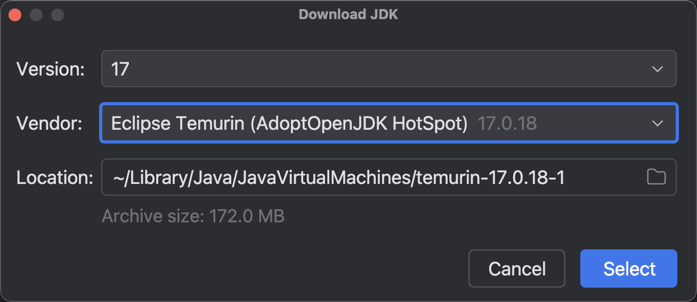
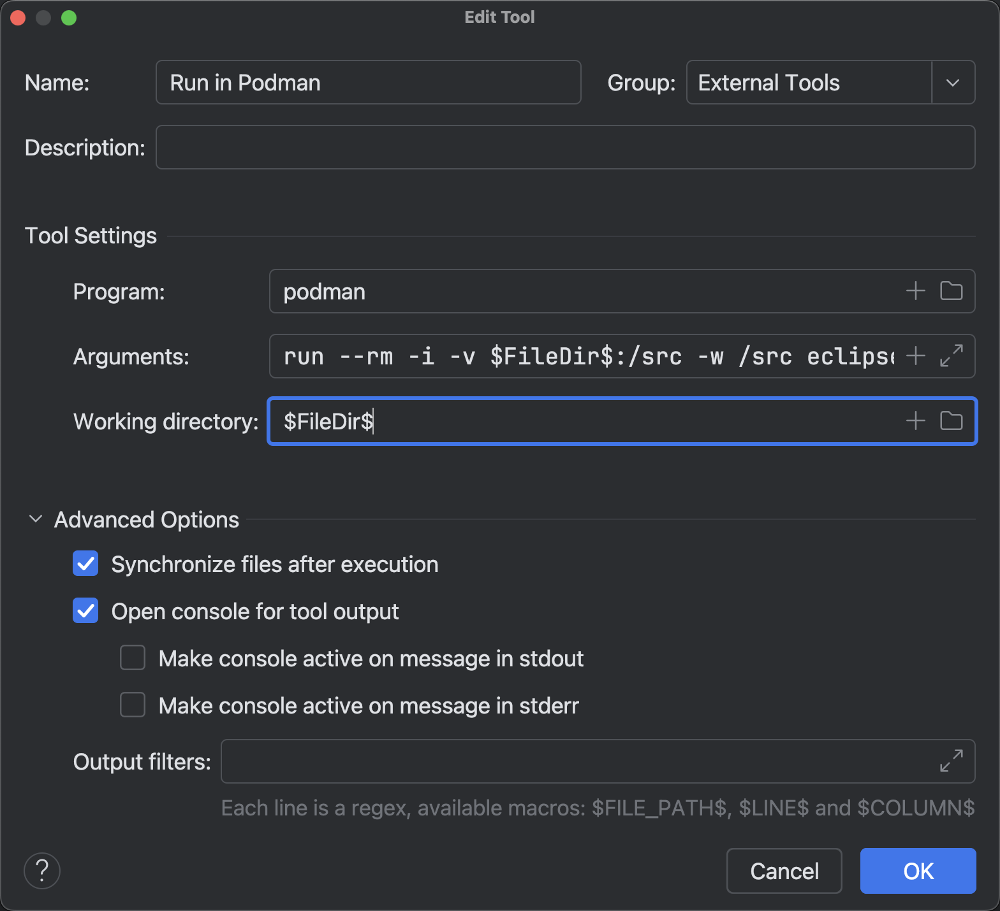

:author: https://github.com/wangzhaohe/swot-learning
:source-highlighter: pygments
:icons: font
:scripts: cjk
:stem: latexmath
:experimental:
:toc:
:toc: right
:toc-title: 目录
:toclevels: 3
:tip-caption: ⚡
:note-caption: ❕
:important-caption: ❗
:warning-caption: ‼️
:caution-caption: ⚠️

= Java高级程序设计进阶实验-JavaSE 门禁系统实训（共 36 学时）

++++
<button id="toggleButton">目录开关</button>

++++

== 实验一：环境与项目初始化 (4学时)
* *目标*：搭建 JDK 与 IntelliJ IDEA 环境，完成项目骨架搭建。

=== 安装开发环境 IntelliJ IDEA 和 JDK 17
idea 下载地址：
https://www.jetbrains.com/idea/download/

在 Idea 创建新项目时可以直接安装 java jdk17，参考下图：

image::img/click_download_jdk.png[select_download,740,]

IMPORTANT: 这样就可以开发 java 程序了。
下面在 podman 容器中运行 java 程序是提高的内容，初学者可以忽略！

[WARNING]
====
* 如果使用社区版本的 IDEA，仍然需要在本地安装 JDK17，因为 podman 容器中只是运行环境，无法提供代码补全和语法检查等功能。
* 旗舰版 (Ultimate)可以通过 "Remote Robot" 或 "On Target" 功能，让 IDEA 直接去读容器里的 JDK 文件来做代码补全，实现真正的“本地零安装”。
====

=== 容器介绍：docker vs podman
用一句话概括：容器是带上所有“行李”的一键式运行环境。

如果展开成三个关键词，它的作用就是：

* 封装：把代码和它运行所需的依赖（库、环境、配置）像罐头一样封在一起。

* 隔离：让应用像住在独立公寓里一样，互不干扰，不污染宿主机系统。

* 一致：确保程序在开发电脑、测试服务器和云端运行得完全一模一样。

一言以蔽之： 容器消灭了 “在我电脑上明明能跑” 这种程序员最头疼的借口。

.常用容器 Docker vs Podman 核心特性对比表
[cols="2,4,4", options="header", stripes=even]
|===
| 维度 | Docker (传统霸主) | Podman (红帽新锐)

| **架构模型**
| C/S 架构，依赖后台守护进程 `dockerd`
| 典型的 Fork-Exec 模型，无守护进程 (Daemonless)

| **权限管理**
| 默认需要 Root 权限，安全风险相对较高
| 原生支持 **Rootless** 模式，普通用户即可运行

| **Kubernetes 集成**
| 需通过额外工具转换
| 原生支持 **Pod** 概念，可直接导出/导入 Kubernetes YAML

| **系统集成**
| 使用自带的 Restart Policy 自动重启
| 完美集成 **systemd**，可作为原生系统服务管理

| **命令行兼容性**
| 标准 `docker` 命令
| 与 Docker CLI 几乎完全一致 (alias docker=podman)

| **生态与桌面端**
| 生态极度丰富，Docker Desktop 在 Win/Mac 体验领先
| 社区快速增长，Podman Desktop 正在发力

| **镜像存放**
| 由 Docker Daemon 统一管理存储
| 存放在用户家目录（Rootless）或 /var/lib/containers
|===

=== WSL2 安装容器环境 podman -- 重点
什么是 WSL2？ (地基/虚拟化引擎)

- 全称： Windows Subsystem for Linux 2。

- 本质： 它是微软开发的一个 Windows 功能组件。

- 功能： 它在 Windows 内部提供了一个真实的 Linux 内核。
        它负责处理硬件资源（CPU、内存、网络）的分配，让 Linux 能够直接运行在 Windows 上。

- 特点： 它本身不是一个可以让你操作的界面，它只是一个运行环境。没有它，Linux 系统无法在 Windows 上跑起来。

==== 检查 windows 虚拟化环境状态并安装 WSL2 引擎
请在你的 Windows 搜索栏输入 PowerShell，
右键点击并选择 “以管理员身份运行”，打开命令行工具。

===== 查看 BIOS 是否开启虚拟化支持
[source,console]
----
(Get-CimInstance -ClassName Win32_Processor).VirtualizationFirmwareEnabled
# 返回 True 表示 BIOS 已开启虚拟化支持。
# 或者进入「任务管理器」-> 「性能」-> 「CPU」-> 「虚拟化」是否为「已启用」
----

如果是“已禁用”，就必须进 BIOS 了。

WSL2 和 Podman 实际上是在 Windows 内部运行了一个极简的虚拟机。为了让这个虚拟机运行得飞快（接近原生性能），CPU 必须从硬件层面提供支持：

* Intel 处理器： 叫 VT-x (Virtualization Technology)。
* AMD 处理器： 叫 SVM (Secure Virtual Machine)。

如何进入 BIOS 并开启？
不同品牌的笔记本进入方式略有不同，但逻辑是一样的：

第一步：进入 BIOS

- **常见热键：** 关机状态下按下电源键，然后不停地狂按 `F2`（联想、戴尔、华硕等常见）或 `F10` (HP) 或 `Del` (微星、组装机)。 
- **通用方法（Windows 内）：** `设置` -> `系统` -> `恢复` -> `高级启动` -> `立即重新启动`。重启后选择 `疑难解答` -> `高级选项` -> `UEFI 固件设置`。

第二步：找到开关（通常在 Advanced 或 Configuration 菜单下）

进入 BIOS 后，寻找类似以下的字样并将其设置为 **Enabled**：

- **Intel 平台：** `Intel Virtualization Technology` 或 `VT-x`。
- **AMD 平台：** `SVM Mode` 或 `Secure Virtual Machine`。
- **某些笔记本：** 可能会藏在 `Security` -> `Virtualization` 路径下。

第三步：保存退出

通常按 `F10` 保存并退出。

===== 查看 windows 是否安装了适用于 Linux 的 Windows 子系统
[source,console]
----
wsl -l -v
----

你可能会看到的三种结果：

[upperalpha]
. 列表为空 (No distributions)
* 提示：适用于 Linux 的 Windows 子系统没有已安装的分发版。
* 解读： 你的 WSL2 地基已经打好了，但是上面没盖任何房子（没装 Ubuntu，也没装 Podman）。
* 状态： 完美！这正是你想要的状态。你现在可以直接去安装 Podman，它会创建自己的专属环境。

. 出现列表，版本为 2
* 提示：NAME: podman-machine-default, STATE: Running, VERSION: 2
* 解读： 你已经安装过 Podman 且它正在运行，它用的是 WSL2 引擎。
* 状态： 一切正常，你可以开始写 Java 代码了。

. 错误提示：'wsl' 不是内部或外部命令 或 未安装适用于 Linux 的 Windows 子系统。
* 解读： 你的 Windows 还没有开启 WSL 功能。
* 操作： 有两种方式来开启
  ** 方式一：要执行 dism.exe 命令来开启 #(我没使用方式一，用了方式二)#
+
.直接复制在 power shell 中执行
[source,console]
----
# 开启 WSL 基础功能
dism.exe /online /enable-feature /featurename:Microsoft-Windows-Subsystem-Linux /all /norestart

# 开启 WSL2 必需的虚拟机平台
dism.exe /online /enable-feature /featurename:VirtualMachinePlatform /all /norestart

# 提示：请立即重启电脑！
Write-Host "操作完成！请手动重启电脑以生效。" -ForegroundColor Yellow
----
  ** 方式二：直接运行 `wsl --install --no-distribution` （这会开启 WSL 但不装 Ubuntu）。
+
.方式二运行后显示
....
PS C:\Windows\system32> wsl --install --no-distribution
正在下载: 适用于 Linux 的 Windows 子系统 2.6.3
正在安装: 适用于 Linux 的 Windows 子系统 2.6.3
已安装 适用于 Linux 的 Windows 子系统 2.6.3。
正在安装 Windows 可选组件: VirtualMachinePlatform

部署映像服务和管理工具
版本: 10.0.26100.5074
映像版本: 10.0.26200.7840

启用一个或多个功能
[==========================100.0%==========================]
操作成功完成。
请求的操作成功。直到重新启动系统前更改将不会生效。
....
+
.再运行 ws -l -v 就会显示 wsl 底座已经ok了
....
PS C:\Windows\system32> wsl -l -v
适用于 Linux 的 Windows 子系统没有已安装的分发。
可通过安装包含以下说明的分发来解决此问题：

使用“wsl.exe --list --online' ”列出可用的分发
和 “wsl.exe --install <Distro>” 进行安装。
....

IMPORTANT: 一定一定记得要重启 Windows 操作系统！！！

===== 再次确认 wsl 版本为 2
.查看 wsl 状态：一定要是版本 2
....
PS C:\Windows\system32> wsl --status
默认版本: 2
当前计算机配置不支持 WSL1。
若要使用 WSL1，请启用“Windows Subsystem for Linux”可选组件。
....

.不是版本 2，则需要进行设置
....
wsl --set-default-version 2
....

===== 删除 ubuntu Linux 系统
如果你已经手快执行了 `wsl --install` 并且 Ubuntu 已经出现在你的菜单里了，也不用重装系统，直接在 PowerShell 里输入这行命令就能把它彻底删掉：

[source,console]
----
wsl --unregister Ubuntu
----

这样你就回到了一个“只有 WSL2 引擎，没有 Ubuntu”的纯净状态了。

==== 在 WSL2 引擎下安装 podman
[upperalpha]
. 下载地址
  ** https://github.com/containers/podman/releases[Podman GitHub Releases]
  ** 找最新的 .exe 安装文件

. 安装完成后，在 PowerShell 输入
+
.初始化 podman 机器并开启
[source,console]
----
# 限制 Podman 虚拟机使用 4G 内存，2 核 CPU
podman machine init --cpus 2 --memory 4096

# 可以再改
podman machine set --cpus 4 --memory 4096

# 查看设置
> podman machine inspect --format '{{.Resources.CPUs}} CPU, {{.Resources.Memory}} MB'

podman machine start

# 不用了就释放计算机内存资源
podman machine stop
----

如果 init 自动下载太慢了，直接下载镜像再导入。 +
https://github.com/containers/podman/releases

[source,console]
----
# 彻底清理旧的失败记录
podman machine rm -f

# 手动指定你下载好的那个 141MB 的文件
podman machine init --image "D:\rootfs.tar.xz"

# 启动
podman machine start
----

.成功后再查看 machine list 就有了
....
PS C:\Windows\system32> podman.exe machine list
NAME                     VM TYPE     CREATED        LAST UP            CPUS        MEMORY      DISK SIZE
podman-machine-default*  wsl         8 minutes ago  Currently running  8           2GiB        100GiB
....

=== podman 安装 JDK17
[source,console]
----
# 拉取镜像 (使用 Eclipse Temurin 发行版)
podman pull eclipse-temurin:17-jdk

# 启动一个交互式容器来测试 java 版本
podman run -it --rm eclipse-temurin:17-jdk java -version
----

.output result
....
openjdk version "17.0.18" 2026-01-20
OpenJDK Runtime Environment Temurin-17.0.18+8 (build 17.0.18+8)
OpenJDK 64-Bit Server VM Temurin-17.0.18+8 (build 17.0.18+8, mixed mode, sharing)
....

=== IDEA 使用 podman JDK17 运行 java 项目
**IntelliJ IDEA Community (社区版)** 默认不支持原生的 "Run Targets" 功能。
本方法通过 **External Tools (外部工具)** 模拟旗舰版的远程运行体验，实现“本地编码、容器运行”的无缝衔接。

==== 社区版本 IDEA 运行 podman 容器 jdk17 方法
[upperalpha]
. External Tool 参数设置
+
.请在 `Settings` -> `Tools` -> `External Tools` 中添加以下配置：
[cols="1,3", options="header"]
|===
| 配置项 | 填写内容
| **Name** | `Run in Podman (Auto)`
| **Program** | `podman`
| **Arguments** | `run --rm -i -v $FileDir$:/src -w /src eclipse-temurin:17-jdk sh -c "javac *.java && java $FileNameWithoutExtension$"`
| **Working directory** | `$FileDir$`
|===
+
命令详解

* `run --rm`: 容器运行结束即销毁，保持系统整洁。
* `-i` 参数，如果程序需要 Scanner 输入数据，控制台也能支持交互。
* `-v $FileDir$:/src`: 将 IDEA 当前打开文件所在的目录映射到容器 `/src`。
* `-w /src`: 指定容器内的工作目录，确保 `javac` 能找到源码。
* `sh -c`: 启动容器内的 Shell 以支持 `&&` 逻辑。
* `javac *.java`: **万能编译**，自动处理目录下所有 Java 类的依赖。
* `java $FileNameWithoutExtension$`: 动态获取当前文件名（不含后缀）并运行。
+

. 快捷键绑定 (Keymap)
+
为了实现“一键运行”，建议进行以下操作：

.. 打开 `Settings` -> `Keymap`。
.. 搜索 `Run in Podman`。
.. 右键选择 `Add Keyboard Shortcut`，建议绑定为 **`Option + R`** (Mac) 或 **`Alt + R`** (Win)。

. 验证测试
+
.查看程序运行结果，即可知道是否在 podman 中运行成功。
[source,java]
----
public class Main {
    public static void main(String[] args) {
        System.out.println("========= Podman 环境测试 =========");

        // 验证运行操作系统（如果是 Linux，说明 Podman 成功了）
        String os = System.getProperty("os.name");
        System.out.println("当前运行操作系统: " + os);

        // 验证 JDK 版本
        String version = System.getProperty("java.version");
        System.out.println("当前 JDK 版本: " + version);

        // 验证环境变量
        String user = System.getProperty("user.name");
        System.out.println("当前容器用户: " + user);

        if ("Linux".equalsIgnoreCase(os)) {
            System.out.println("✅ 成功！代码正在 Podman 容器内运行。");
        } else {
            System.out.println("❌ 警告：代码仍在 macOS 本地运行，请检查 Run on 设置。");
        }

        System.out.println("==================================");
    }
}
----

[TIP]
====
* 如果您想在容器里进行 Debug，需要配置 Remote JVM Debug。请自行搜索AI去解决。
* 如果以后项目引入了 Maven 或 Gradle 依赖，建议将本地的 `.m2` 目录也通过 `-v` 挂载到容器中，以加速构建。
====

==== 实际开发与验证的落地建议
如果没有 IDEA 专业版本，实际开发与验证的流程建议如下：

. 日常写代码/Debug：直接用本地 JDK 17，享受最快的响应速度。

. 最后验证：写完一个阶段了，按下你配好的 Option + R（Podman），看一眼在 Linux 下报不报错。

这叫“本地开发，容器验证”，是性价比最高的工作流。

[TIP]
====
* VSCode 的 Dev Containers (开发容器)可以解决这个问题，但是就得用 VSCode 进行开发了。
看个人和团队喜好吧。

* 直接在 podman 容器里用 lazyvim 开发，更不错。
====

=== 深度思考：为什么坚持在容器中运行 Java？
[upperalpha]
. 彻底抹平“环境熵增”
[quote, 架构师思维]
“本地环境是一块不断被污染的实验田，而容器是永恒纯净的无菌室。”

* **宿主机解耦**：你的 Mac/Windows 不需要安装数据库、不需要配置复杂的环境变量。从而解决“在我机器上能跑”的玄学问题。
* **版本隔离**：你可以同时运行 JDK 8、11、17、21 的不同项目，它们在各自的容器里互不干扰。

. 预演“云原生”发布流程
+
现代企业应用最终都会跑在 **Kubernetes (K8s)** 或 **Docker Swarm** 上。

* **镜像对齐**：你在 Podman 里用的 `eclipse-temurin:17-jdk` 镜像，通常就是生产环境的基础镜像。
* **配置对齐**：在容器里跑代码，会强制你思考：我的配置文件在哪里？我的日志往哪儿输出？我的内存限制是多少？这些都是线上运行的核心问题。

. 极速入职与迁移 (Onboarding)
+
[EXAMPLE]
====
想象一下：一个新同事加入项目。

* **传统方式**：配置 JDK、安装 Maven、设置环境变量、解决 Mac M1/M2 兼容性问题... 耗时一天。
* **容器方式**：安装 Podman，执行你的 `External Tool` 命令。耗时 5 分钟。
====

. 社区版“折腾”的附加价值
+
[TIP]
====
* 在 **Ultimate 版**里，这一切都是自动的，你会觉得理所当然；
* 在 **Community 版**里，你手写了 `mount` 挂载、`working dir` 切换、`sh -c` 脚本。
* 这些“折腾”让你真正理解了：**IDE 是如何通过宿主机与 Linux 虚拟机（Podman Machine）进行通信的。** 这种底层感知力，才是最值钱的。
====

== 实验二：数据模型与实体类开发 (4学时)
* *目标*：根据需求设计实体类及自定义异常类。

*实验目标*：学会定义一个标准的“实体类”（Entity），用于存储门禁系统中的用户信息。

[discrete]
=== 1. 什么是实体类？
在门禁系统中，我们需要一个东西来代表“人”。实体类就像一张**电子入职登记表**，把一个人的信息打包在一起。

[discrete]
=== 2. 标准的 User 类要求
为了保证数据的安全，我们要遵循上一节学的“封装”原则：
1. 属性全部私有 (`private`)。
2. 提供公共的 `Getter/Setter` 方法。
3. 提供一个无参构造方法和一个全参构造方法。

[discrete]
=== 3. 代码实现

=== class User 用户实体类
[source,java]
----
/**
 * 用户实体类：代表一个拥有门禁卡的人
 */
public class User {
    private String id;        // 工号
    private String name;      // 姓名
    private String cardId;    // 门禁卡号
    private boolean isActive; // 账户是否激活

    // 无参数构造方法（Java 习惯，方便以后框架使用）
    public User() {
    }

    // 全参数构造方法（方便一句话创建用户）
    public User(String id, String name, String cardId, boolean isActive) {
        this.id = id;
        this.name = name;
        this.cardId = cardId;
        this.isActive = isActive;
    }

    // Getter 和 Setter（就像开关，外界通过它们读写数据）
    public String getName() {
        return name;
    }

    public void setName(String name) {
        this.name = name;
    }

    public String getCardId() {
        return cardId;
    }

    public void setCardId(String cardId) {
        this.cardId = cardId;
    }

    // ... id 和 isActive 的 Getter/Setter 省略，实际开发中需补全
}
----

=== 关于 User 类小结
private + Getter|Setter 是 Java 的“潜规则”，虽然写起来累，但可以保护数据不被乱改（例如可以在 setCardId 里加逻辑，长度不对就不给存）。

在 IDEA 中演示 Alt + Insert 快捷键自动生成这些代码，学生会觉得很神奇，从而降低抗拒感。

=== class DoorSystemException 门禁系统异常类代码实现
[source,java]
----
/**
 * 自定义异常：专门处理门禁系统的异常情况
 */
public class DoorSystemException extends Exception {
    public DoorSystemException(String message) {
        super(message); // 把错误信息传给父类去处理
    }
}
----

== 实验三：系统逻辑接口设计 (6学时)
* *目标*：利用接口和抽象类定义门禁系统的核心业务逻辑。

== 实验四：单元测试与验证 (4学时)
* *目标*：编写测试类，对功能模块进行逻辑覆盖测试。

== 实验五：认证算法实现 (6学时)
* *目标*：实现门禁系统的核心认证算法及权限校验。

== 实验六：持久化层升级 (6学时)
* *目标*：将原有的文件存储或内存存储升级为 JDBC 数据库存储。

== 实验七：系统集成与发布 (6学时)
* *目标*：完成模块整合，开发主程序交互逻辑，提交最终成果。

