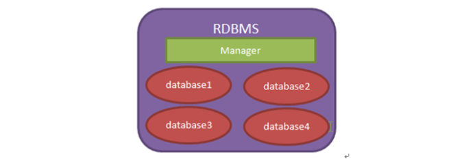

:author: https://github.com/wangzhaohe/swot-learning
:source-highlighter: pygments
:icons: font
:scripts: cjk
:stem: latexmath
:experimental:
:toc:
:toc: right
:toc-title: 目录
:toclevels: 3
:tip-caption: ⚡
:note-caption: ❕
:important-caption: ❗
:warning-caption: ‼️
:caution-caption: ⚠️

= MySQL

++++
<style>
/* 1. 默认状态：初始就是隐藏的 */
#toc {
    max-width: 0 !important;
    opacity: 0 !important;
    padding-left: 0 !important;
    padding-right: 0 !important;
    border: none !important;
    overflow: hidden !important; /* 必须在这里，保证收缩时内容不溢出 */
    white-space: nowrap !important;

    /* 【关键】：过渡动画必须放在基类里，这样“展开”和“收回”都有动画 */
    transition: max-width 0.3s cubic-bezier(0.4, 0, 0.2, 1),
                padding 0.3s cubic-bezier(0.4, 0, 0.2, 1),
                opacity 0.3s ease;
}

/* 2. 展开状态：点击后添加 .active 或 .expanded 类 */
#toc.active {
    max-width: 530px !important;
    opacity: 1 !important;
    padding: 10px !important; /* 根据需要恢复 padding */
    overflow-y: auto !important;
}

/* 3. 列表样式保持不变 */
#toc ul, #toc li {
    margin-bottom: 8px !important;
    line-height: 1.4 !important;
}
</style>

<button id="toggleButton">展开目录</button>
<div id="toc">
    </div>

<script>
const toggleButton = document.getElementById('toggleButton');
const contentDiv = document.getElementById('toc');

toggleButton.addEventListener('click', () => {
    // 切换 active 类
    const isExpanded = contentDiv.classList.toggle('active');

    // 逻辑：如果现在是 expanded (true)，说明打开了，按钮应该提示“收起”
    toggleButton.textContent = isExpanded ? '收起目录' : '展开目录';
});
</script>
++++

== 1. 数据库概述
.1. 什么是数据库 +
[%collapsible]
====
数据库就是用来存储和管理数据的仓库！::
数据库存储数据的优点：

* 可存储大量数据
* 方便检索
* 保持数据的一致性、完整性
* 安全，可共享
* 通过组合分析，可产生新数据。
====

.2. 数据库的发展史
[%collapsible]
====
* 没有数据库，使用磁盘文件存储数据
* 层次结构模型数据库
* 网状结构模型数据库
* #关系结构型数据库：使用二维表格来存储数据(指表与表之间建立关系，如 MySQL)#
* 关系-对象模型数据库
====

.3. 常见数据库
[%collapsible]
====
* Oracle（中文：神喻）：甲骨文(在国内注册名称)(市场占有率最高~)
* DB2：IBM
* SQL Server：微软(.net 用的比较多)
* #MySQL：甲骨文(被 Oracle 收购~~)#
====

.4. 理解数据库
[%collapsible]
====
我们现在所说的数据库泛指「关系型数据库管理系统(RDBMS)」，即「数据库服务器」。



当安装了数据库服务器后，就可以在数据库服务器中创建数据库，每个数据库中还可以包含多张表。这就是关系型数据库~


数据库表就是一个多行多列的表格。在创建表时，需要指定表的列数，以及列名称，列类型等信息。而不用指定表格的行数，行数是没有上限的。下面是 tab_sutdent 表的结构。


当把表格创建好了之后，就可以向表格中添加数据了。向表格添加数据是以行为单位的！下面是 s_student 表的记录：


大家要学会区分什么是表结构，什么是表记录。
====

.5. 应用程序与数据库
[%collapsible]
====
应用程序使用数据库完成对数据的存储！


====

== 2. 安装服务器 MySQL Community Server
:table-caption!:

*完整安装文档*:

https://dev.mysql.com/doc/refman/8.3/en/installing.html +
https://dev.mysql.com/doc/refman/8.3/en/windows-installation.html

'''
*总结注意事项*:

. 只支持 Windows 64-bit 操作系统，推荐安装打包形式为 MSI 的安装程序 +
https://dev.mysql.com/downloads/installer/

. 还需要 Visual C++ 2019 再发布包 +
https://learn.microsoft.com/zh-cn/cpp/windows/latest-supported-vc-redist?view=msvc-170#visual-studio-2015-2017-2019-and-2022
. 默认安装路径 `C:\Program Files\MySQL\MySQL Server 8.0`
. 要以管理员权限安装
. 杀毒软件设置（关闭软件省事）
** 不要在 datadir 目录上开启病毒扫描（C:\Program Files\MySQL\MySQL Server X.Y\data）
** 不要在 tmpdir  目录上开启病毒扫描

. 配置服务器 : `C:\Program Files\MySQL\MySQL Server X.Y\bin\mysql-configurator.exe`
+
.Server Configuration type

[cols="1,1"]
|===
|Development |占用内存最少 (学习推荐)
|Server      |占用内存中等
|Dedicated   |占用内存最多
|Manual      |手工配置，默认占用内存 16M
|===

. Configure MySQL server as a Windows service (Selected by default.)


'''
NOTE: 安装后会自带简单的客户端工具 mysql (登录后可以执行 SQL 语句) +
后面还有功能强大的 MySQL Shell 客户端工具。

== 3. 启动 MySQL 数据库服务
Windows 下启动：

. 作为系统服务，开机自启动。
. 手工双击启动。


.MacOS 下启动
[source,console]
----
sudo /usr/local/mysql/support-files/mysql.server start
----


.Linux 启动:
[source,console]
----
systemctl start mysql
----

== 4. 默认客户端 mysql
获取帮助::
    mysql --help

链接数据库（确保服务在运行）:: 
    mysql -h host -u user -p +
    Enter password: 在此处输入密码，输入时没有反馈

1. 显示 Access denied 表示登录失败
2. 显示 mysql> 表示登录成功

退出链接:: 
    $> quit (or \q)

登录报错文档:: https://dev.mysql.com/doc/refman/8.3/en/common-errors.html

== 5. 下载客户端 GUI Client (图形界面)
有许多不同的数据库客户端软件可供选择，以下是一些常见的数据库客户端软件：

1. **DBeaver：** DBeaver 是一款功能强大的开源数据库客户端，支持多种数据库管理系统，包括 MySQL、PostgreSQL、SQLite、Oracle 等。
* https://dbeaver.io/download/
* https://github.com/dbeaver/dbeaver

2. **MySQL Workbench：** MySQL Workbench 是 MySQL 官方提供的数据库设计和管理工具，具有图形用户界面和丰富的功能，适用于 MySQL 数据库。

3. **Navicat：** Navicat 是一款强大的数据库管理工具，支持多种数据库，包括 MySQL、MariaDB、PostgreSQL、SQLite 等，具有直观的用户界面和丰富的功能。

4. **SQLyog：** SQLyog 是一款专门针对 MySQL 的数据库管理工具，具有直观的用户界面和丰富的功能，适用于开发人员和数据库管理员。

5. **HeidiSQL：** HeidiSQL 是一款免费开源的 MySQL 数据库客户端软件，具有直观的用户界面和丰富的功能，适用于 Windows 平台。

6. **pgAdmin：** pgAdmin 是 PostgreSQL 数据库的官方管理工具，具有图形用户界面和丰富的功能，适用于 PostgreSQL 数据库的管理和开发。

7. **MongoDB Compass：** MongoDB Compass 是 MongoDB 数据库的官方管理工具，具有直观的用户界面和丰富的功能，适用于 MongoDB 数据库的管理和查询。

以上是一些常见的数据库客户端软件，它们提供了各种功能和特性，您可以根据自己的需要选择适合的数据库客户端软件。

== 6. 下载客户端 MySQL Shell(命令界面)
https://dev.mysql.com/downloads/shell/

https://dev.mysql.com/doc/mysql-shell/8.0/en/

安装后运行命令::
mysqlsh -u root -p -h yourip

=== 6.1 链接数据库 Shell -> Server
https://dev.mysql.com/doc/mysql-shell/8.0/en/mysql-shell-sessions.html

链接数据库有三种方式，参考上面链接。

1. 在执行 mysqlsh 时链接数据库
+
[source,console,]
----
mysqlsh -u username -h ip -P 3306 -p
----

2. 进入 mysqlsh 后再链接数据库
+
[source,console,]
----
运行命令: mysqlsh
MySQL JS >\connect root@localhost:3306
输入密码
----
+
IMPORTANT: \connect 用户名@ip或者域名:端口

3. 在 javascript 或者 python 模式下链接数据库（省略）


NOTE: 在实际开发中，会使用 MySQL 的第三方库进行开发。即使用代码链接数据库。 +
参考 https://www.npmjs.com/ 查找第三方库

=== 6.2 进操作模式 MySQL Shell
* Shell 对话时激活模式 (在 MySQL Shell 命令行里) +
  _用于最初一步一步调试_

. \sql
. \js  -> 是默认的模式
. \py


'''
* Shell 批处理模式激活 (在操作系统命令行里) +
  _一个命令操作批量处理任务_

. $> mysqlsh --sql < code.sql
. $> mysqlsh --js  < code.js
. $> mysqlsh --py  < code.py

[NOTE]
====
* $> 指操作系统系统命令行的提示符
* 从 code 文件后缀也能自动判断使用哪个模式
====


'''
文档网址::
https://dev.mysql.com/doc/mysql-shell/8.0/en/mysql-shell-active-language.html

=== 6.3 交互式多行 Code
* 支持单行代码执行

* 支持多行代码执行
** mysql-sql> \  可以跟多行代码
** mysql-js>\sql 在别的模式下 \sql 不能跟多行代码

.是否加 excute()
****
若对象赋值给了变量，则需要加 .excute() 方法。
****

'''
文档网址::
https://dev.mysql.com/doc/mysql-shell/8.0/en/mysql-shell-interactive-code-execution.html

== 7. 数据类型
https://dev.mysql.com/doc/refman/8.3/en/data-types.html

https://www.runoob.com/mysql/mysql-data-types.html

https://www.w3cschool.cn/mysql/mysql-data-types.html

== 8. MySQL 开启远程访问权限总结


=== 8.1 链接方式 ip/socket
使用 ip 去链接 MySQL 数据库，会被拒绝，更改配置允许链接。

* 在 Linux 系统中编辑配置文件 /etc/mysql/mysql.conf.d/mysqld.cnf，打开允许 ip 链接功能。
* 在 Windows  系统中查找文件 my.ini 进行编辑。
* 在 MacOS 直接就可以使用，不用改这个配置。

[source,console]
----
bind-address = 0.0.0.0
----


在 Linux/MacOS 重启 MySQL 服务

[source,console]
----
systermctl restart mysql
----

NOTE: Windows 下可以在服务管理中进行重启 MySQL 服务

=== 8.2 设置用户权限
[upperalpha]
. 进入 MySQL 环境
+
.在终端输入以下命令并输入密码登录：
[source,console]
----
-- mysql 命令要加 -h,否则不让登录
mysql -u root -P 3307 -h 127.0.0.1 -p
----

. 执行权限变更 SQL
+
.在 MySQL 提示符下依次输入：
[source,sql]
----
-- 进入系统库
USE mysql;

-- 将 root 用户的访问限制从 localhost 改为所有 IP (%)
UPDATE user SET host = '%' WHERE user = 'root' AND host = 'localhost';

-- 刷新授权表使修改立即生效
FLUSH PRIVILEGES;

-- 确认修改是否成功
SELECT user, host FROM user WHERE user = 'root';
----

. 验证网络监听
+
.退出 MySQL 后，在终端执行以下命令确认 MySQL 已经监听在所有网卡上（显示为 `*.3306`）：
[source,console]
----
netstat -an | grep 3306
----

. 注意事项
* **安全风险**：开启 `%` 后，root 用户将暴露在网络中，请务必设置强密码。
* **防火墙**：若远程仍无法连接，请前往 `系统设置 -> 网络 -> 防火墙` 确保相应的端口已允许传入连接。

== 9. SQL命令操作数据库案例


=== 9.1 基本语句介绍
查询数据库版本、日期、时间

.运行命令
[source,python,]
----
SELECT VERSION(), CURRENT_DATE, CURRENT_TIME;
----

.运行结果
....
+-------------------------+--------------+--------------+
| version()               | current_date | current_time |
+-------------------------+--------------+--------------+
| 8.0.34-0ubuntu0.20.04.1 | 2024-03-28   | 10:30:28     |
+-------------------------+--------------+--------------+
....

IMPORTANT: sql 语句以英文分号 ; 结尾

'''

.运行命令
[source,python,]
----
SHOW WARNINGS;
----

可以查看之前的报错信息。

=== 9.2 数据库操作


==== 9.2.1 SHOW DATABASES  -- 显示所有数据库
一个数据库服务器可以拥有多个数据库。

.运行命令
[source,python,]
----
show databases;
----

.输出结果 Database:
....
dayu-test
information_schema
mysql
nuxt3_blog
performance_schema
red-maple__model
red_maple
swizer-master
sys
test-prisma
....


*问题：哪些数据库是默认存在的？*

在 MySQL 8 中，默认情况下会创建以下几个数据库：

1. `information_schema`：包含关于 MySQL 服务器内部的信息，如数据库、表和列的元数据。
2. `mysql`：包含 MySQL 服务器的系统和管理数据，如用户权限、访问控制和日志。
3. `performance_schema`：提供了有关 MySQL 服务器性能的信息，如线程活动、资源使用和事件计时。
4. `sys`：提供了 MySQL 服务器的性能监控和诊断功能，它是基于 `performance_schema` 和 `information_schema` 数据库的视图。

除了以上几个默认数据库外，其他数据库均需要用户手动创建。

WARNING: 不要去轻易改变 MySQL 的默认数据库，否则会造成 MySQL server 无法正常运行。

==== 9.2.2 CREATE DATABASE -- 创建空数据库
假设我们正在制作某个公司的官方网站，创建一个空的数据库，将其命名为 OfficialWebsite。

.运行命令
[source,python,]
----
CREATE DATABASE OfficialWebsite;
----

再次使用 `show databases;` 命令查看数据库 OfficialWebsite 已经被创建了。

*问题: 如果已经存在 OfficialWebsite 数据库，会报什么错吗？*::
Can't create database 'OfficialWebsite'; database exists


.MySQL 8.x 中文环境字符集与排序规则推荐
[cols="1,1,2", options="header"]
|===
| 业务场景 | 推荐配置 | 说明

| 绝大多数中文互联网应用 (推荐)
| utf8mb4_0900_ai_ci
| MySQL 8.x 默认值。基于 Unicode 9.0 规范，支持 Emoji，排序准确且性能优秀，不区分大小写。

| 极致兼容老旧系统 (5.7 以前)
| utf8mb4_general_ci
| 传统的简化排序方式。如果你的数据需要迁移回旧版本 MySQL 或与老系统频繁对接，可选择此项。

| 严格中文拼音/笔画排序
| utf8mb4_zh_0900_as_cs
| 区分大小写。专门针对中文定制的排序规则，支持按照拼音顺序对中文进行排序。
|===

==== 9.2.3 USE             -- 使用存在的数据库
选择某个数据库作为当前使用的数据库。

* 指在 MySQL Shell 中需要使用 USE
* 在实际编程代码中，会直接指定要链接的数据库。

.运行命令
[source,python,]
----

USE OfficialWebsite;
----

.运行结果
....
Default schema set to `OfficialWebsite`.
....

==== 9.2.4 SELECT DATABASE()  -- 显示当前数据库
*问题: 如何显示当前正在使用哪个数据库？*

在 MySQL Shell 中使用命令
[source,sql,]
----
SELECT DATABASE();
----

.运行结果
....
database()
OfficialWebsite
....

NOTE: 注意要有小括号。

==== 9.2.5 DROP DATABASE name -- 删除数据库
*问题: 如何删除指定的数据库？*

在 MySQL Shell 中使用命令
[source,sql,]
----
drop DATABASE OfficialWebsite;
----

.运行结果
....
Query OK, 0 rows affected (0.01 sec)
....

=== 9.3 表格操作


==== 9.3.1 SHOW TABLES     -- 显示所有表
显示当前数据库中的所有表

.运行命令
[source,python,]
----
SHOW TABLES;
----

.运行结果
....
Empty set (0.00 sec) 指没有表
....

==== 9.3.2 CREATE TABLE    -- 创建表
创建一个内容分类表 ContentCategory，用于对网站内容进行类别区分。创建若干字段如下：

* 分类标题 `title` -- UNIQUE 指该字段的记录是唯一
* 分类描述 `description`
* 分类归属 `owner`
* 是否启用 `useFlag`
* 创建日期 `createDate`

.运行命令
[source,sql,]
----
CREATE TABLE ContentCategory (
    id INT AUTO_INCREMENT PRIMARY KEY,
    title VARCHAR(20) NOT NULL UNIQUE,
    description VARCHAR(200),
    owner VARCHAR(20),
    useFlag CHAR(1),
    createDate DATE
);
----

.运行结果
....
Query OK, 0 rows affected (0.02 sec)
....

.表存在报错
NOTE: ERROR: 1050 (42S01) at line 1: Table 'ContentCategory' already exists

'''

*问题: 为什么下面这条语句不能执行？* +
`CREATE TABLE ContentCategory (title VARCHAR(20), desc VARCHAR(100));`

.执行报错为
....
ERROR: 1064 (42000) at line 1: You have an error in your SQL syntax; check the manual that corresponds to your MySQL server version for the right syntax to use near 'desc VARCHAR(100))' at line 1
....

.报错原因
[%collapsible]
====
提供创建表的 SQL 语句大部分是正确的。但是，“desc”是 SQL 中的一个保留关键字，表示降序排序，最好避免将保留关键字用作标识符（如列名），以防止潜在的冲突。

如果你需要将 “desc” 作为列名使用，可以通过用反引号（对于 MySQL）或双引号（对于某些其他数据库系统）将其括起来来实现，如下所示：

```sql
CREATE TABLE ContentCategory (title VARCHAR(20), `desc` VARCHAR(20));
```

通过在 `desc` 周围使用反引号，你告诉数据库系统将其视为标识符而不是保留关键字。
====

==== 9.3.3 DESCRIBE        -- 显示表结构
显示表的所有字段定义

.运行命令
[source,python,]
----
DESCRIBE ContentCategory;
----

.运行结果
....
+-------------+--------------+------+-----+---------+-------+
| Field       | Type         | Null | Key | Default | Extra |
+-------------+--------------+------+-----+---------+-------+
| title       | varchar(20)  | YES  |     | NULL    |       |
| description | varchar(200) | YES  |     | NULL    |       |
| owner       | varchar(20)  | YES  |     | NULL    |       |
| useFlag     | char(1)      | YES  |     | NULL    |       |
| createDate  | date         | YES  |     | NULL    |       |
+-------------+--------------+------+-----+---------+-------+
5 rows in set (0.00 sec)
....

[NOTE]
====
* Null: 允许为空

* Default: 默认值为 NULL，对应 javascript 是 null

* 命令缩写为 DESC
====

==== 9.3.4 ALTER 更改表名称
.两个 SQL 语句效果一样
[source,sql,]
--
RENAME TABLE old_table TO new_table;

ALTER TABLE old_table RENAME new_table;
--

NOTE: 实际操作省略

https://dev.mysql.com/doc/refman/8.3/en/rename-table.html

==== 9.3.5 ALTER 更改表增加字段 ADD COLUMN -- 常用
添加自增字段 id 到 ContentCategory 表，并设置为第一列。

.运行命令
[source,python,]
----
ALTER TABLE ContentCategory
      ADD COLUMN id INT AUTO_INCREMENT PRIMARY KEY FIRST;
----

'''

重新设置自增 id 数字，如想从 10 开始设置。

.运行命令
[source,python,]
----
SET @row_number = 10;
UPDATE ContentCategory SET id = @row_number := @row_number + 1;
----

==== 9.3.6 ALTER 更改表字段位置 MODIFY COLUMN
如果你想要修改表中字段的位置，你需要使用 `ALTER TABLE` 语句，并且在该语句中重新定义表的结构，包括字段的顺序。以下是一个示例：

假设对于 `ContentCategory` 的表，想把字段 `id` 移动到第一列，可以这样做：

```sql
ALTER TABLE ContentCategory
      MODIFY COLUMN id INT AUTO_INCREMENT PRIMARY KEY FIRST,
      MODIFY COLUMN other_column_name data_type AFTER id;
```

在上面的语句中，`MODIFY COLUMN` 关键字用于指定要修改的列，`AFTER` 关键字用于指定在哪个字段之后插入当前字段。在这个例子中，`id` 字段被移到了第一列，然后是其他的字段。

请注意，修改表结构可能会影响到已有的数据和相关的索引，所以在执行此类操作之前，请务必备份数据，并确保对表结构的修改不会破坏已有的应用程序逻辑。

'''
举例将 useFlag 移到 description 后面

.运行命令
[source,python,]
----
ALTER TABLE ContentCategory
      MODIFY COLUMN useFlag CHAR(1) AFTER description;
----

==== 9.3.7 ALTER 生成列（Generated Column）-- 含删除列演示
[upperalpha]
. 创建包含生成列的表
+
.运行命令
[source,sql]
----
CREATE TABLE t1 (
    c1 INT,
    c2 INT GENERATED ALWAYS AS (c1 + 1) STORED);
----
+
创建名为 `t1` 的表，包含两个列：

* `c1`：普通整数列
* `c2`：存储型生成列，值由 `c1 + 1` 自动计算得出并持久化存储


. 插入数据（观察生成列效果）
+
.运行命令
[source,sql]
----
INSERT INTO t1 (c1) VALUES (7);
----
+
插入记录时只需指定普通列 `c1`，生成列 `c2` 会自动计算：

* `c1` = 7
* `c2` = 8（自动计算：7 + 1）
+
[TIP]
====
插入时必须排除生成列，只需为 `c1` 提供值。
====


. 修改生成列名称（c2 → c3）
+
.运行命令
[source,sql]
----
ALTER TABLE t1
    CHANGE c2 c3 INT GENERATED ALWAYS AS (c1 + 1) STORED;
----
+
使用 `CHANGE` 关键字修改列名和定义：

* 将 `c2` 重命名为 `c3`
* 保持生成规则不变：`(c1 + 1) STORED`


. 删除生成列
+
.运行命令
[source,sql]
----
ALTER TABLE t1 DROP COLUMN c3;
----
+
使用 `DROP COLUMN` 删除 `c3` 列。


. 参考文档

* https://dev.mysql.com/doc/refman/8.3/en/alter-table-generated-columns.html[MySQL 8.3: ALTER TABLE and Generated Columns]

==== 9.3.9 DROP 删除表
.运行命令
[source,python,]
----
DROP TABLE ContentCategory;
----

=== 9.4 记录操作


==== 9.4.1 LOAD DATA LOCAL INFILE -- 批量导入数据 -- 了解
文档网址: https://dev.mysql.com/doc/refman/8.3/en/loading-tables.html

一般用于数据的初始化，这种方式比较麻烦，因为有一些条件：

[upperalpha]
. 数据以 tabs 分隔
. 以字段顺序传入
. 用 \N 代替 NULL
. 不同操作系统换行符不同
. 开启本地文件能力功能 +
https://dev.mysql.com/doc/refman/8.3/en/load-data-local-security.html

NOTE: 了解此方式即可，知道有这样的功能就行。

==== 9.4.2 INSERT INTO       -- 按位置插入记录
用于在表格中插入一条记录。##字段位置与字段内容必须一一对应##，#包括自增的 id 字段#。

NOTE: 可以更改字段内容的顺序，测试字段位置与字段内容不同报错的现象。

.运行命令 插入记录到表 ContentCategory
[source,sql]
----
INSERT INTO ContentCategory VALUES (
    100,
    '解决方案',
    '为企业提供数字孪生、3D可视化、三维建模和数据大屏技术的解决方案',
    'Swot',
    'Y',
    '2024-02-01');

INSERT INTO ContentCategory VALUES (
    101,
    '成功案例',
    '众多企业数字化、数字孪生、3D可视化、三维建模和数据大屏的成功案例',
    'River',
    'N',
    '2024-03-01');

INSERT INTO ContentCategory VALUES (
    102,
    '模型资源',
    '拥有精美丰富的3D模型资源，高度覆盖各种行业需求。',
    'River',
    'Y',
    '2024-01-01');
----

.运行结果
....
Query OK, 1 row affected (0.00 sec)
....

*问题: 每次都需要指定 id，用于简单测试时可以，但是实际情况下需要数据库自动递增 id 怎么办 ？* +

答：参考下面指定字段名的方式来插入记录。

==== 9.4.3 INSERT INTO       -- 按字段插入记录
使用字段与位置对应的方式插入记录，这样表中的 id 就会自增长。

.运行命令
[source,python,]
----
INSERT INTO ContentCategory (title, description, useFlag, owner, createDate)
VALUES (
    '解决方案',
    '为企业提供数字孪生、3D可视化、三维建模和数据大屏技术的解决方案',
    'Y',
    'Swot',
    '2024-02-01');

INSERT INTO ContentCategory (title, description, useFlag, owner, createDate)
VALUES (
    '成功案例',
    '众多企业数字化、数字孪生、3D可视化、三维建模和数据大屏的成功案例',
    'N',
    'River',
    '2024-03-01');

INSERT INTO ContentCategory (title, description, useFlag, owner, createDate)
VALUES (
    '模型资源',
    '拥有精美丰富的3D模型资源，高度覆盖各种行业需求。',
    'Y',
    'River',
    '2024-01-01');
----

说明：

* 在表名后给出要插入的列名，其他没有指定的列等同于插入 null 值。一次插入一行
* 在 values 后给出列值，值的顺序和个数必须与前面指定的列对应

==== 9.4.4 SELECT FROM WHERE -- 获取记录语法说明
语法格式：

    SELECT what_to_select
    FROM which_table
    WHERE conditions_to_satisfy;

语法解释：

what_to_select 想要看见的内容::
    indicates what you want to see. This can be a list of columns, or * to indicate “all columns.” +
    `*` 表示所有列

which_table 哪个表::
    indicates the table from which you want to retrieve data. +
    表明数据从哪个表里获取。

conditions_to_satisfy 满足的条件::
    The WHERE clause is optional. If it is present, conditions_to_satisfy specifies one or more conditions that rows must satisfy to qualify for retrieval. +
    WHERE 是可选的。如果存在，行数据必须满足这个条件才能取出来。

==== 9.4.5 SELECT * FROM     -- 获取所有列
.运行命令
[source,python,]
----
SELECT * FROM ContentCategory;
----

.运行结果
....
+----------+------------------------------------------------------------------+
| title    | description                                                      |
+----------+------------------------------------------------------------------+
| 解决方案 | 为企业提供数字孪生、3D可视化、三维建模和数据大屏技术的解决方案   |
| 成功案例 | 众多企业数字化、数字孪生、3D可视化、三维建模和数据大屏的成功案例 |
+----------+------------------------------------------------------------------+
....

在 MySQL 中，* 是一个通配符，用于表示选择所有列(All Columns)。


.隐藏列无法被选择
[NOTE]
====
There is an exception to the principle that SELECT * selects all columns. +
If a table contains invisible columns, * does not include them. +
For more information, see Section 15.1.20.10, “Invisible Columns”. +
https://dev.mysql.com/doc/refman/8.3/en/invisible-columns.html
====

==== 9.4.6 SELECT * FROM WHERE  -- 条件选择
选择特定条件的行

.运行命令
[source,python,]
----
SELECT * FROM ContentCategory WHERE title = '解决方案';
----

.运行结果
....
+----------+------------------------------+
| title    | description                  |
+----------+------------------------------+
| 解决方案 | 为企业提供数字孪生的解决方案 |
+----------+------------------------------+
....


.运行命令
[source,python,]
----
SELECT * FROM ContentCategory WHERE createDate >= '2024-02-01';
----

.运行结果
....
+----------+---------------------------------------------------+---------+------------+
| title    | description                                       | useFlag | createDate |
+----------+---------------------------------------------------+---------+------------+
| 成功案例 | 众多企业数字化、数字孪生、3D可视化、三维建模和数据大屏的成功案例 | N    | 2024-03-01 |
+----------+---------------------------------------------------+---------+------------+
....

IMPORTANT: 在实际开发中，如果数据量比较大，就不要一次性把 #所有行# 的数据都取出来。应该使用条件选择，来实现分页或者过滤功能。

==== 9.4.7 SELECT * FROM WHERE AND/OR -- 条件选择
.运行命令
[source,python,]
----
SELECT * FROM ContentCategory WHERE useFlag='Y' AND createDate >= '2024-01-01';
----

.运行结果
....
+----------+---------------------------------------------------+---------+------------+
| title    | description                                       | useFlag | createDate |
+----------+---------------------------------------------------+---------+------------+
| 成功案例 | 众多企业数字化、数字孪生、3D可视化、三维建模和数据大屏的成功案例 | N    | 2024-03-01 |
+----------+---------------------------------------------------+---------+------------+
....


.运行命令
[source,python,]
----
SELECT * FROM ContentCategory WHERE useFlag='N' OR createDate <= '2024-01-31';
----

.运行结果（注意这里是或的条件）
....
+----------+---------------------------------------------------+---------+------------+
| title    | description                                       | useFlag | createDate |
+----------+---------------------------------------------------+---------+------------+
| 成功案例 | 众多企业数字化、数字孪生、3D可视化、三维建模和数据大屏的成功案例 | N    | 2024-03-01 |
+----------+---------------------------------------------------+---------+------------+
....

TIP: AND 和 OR 混用时，记得加小括号。案例省略。

==== 9.4.8 SELECT column FROM   -- 选择指定列
选择指定的列进行显示，列名之间用逗号分隔。

.运行命令
[source,sql]
----
SELECT title, description FROM ContentCategory;
----

.运行结果
....
+----------+------------------------------------------------------------------+
| 解决方案 | 为企业提供数字孪生、3D可视化、三维建模和数据大屏技术的解决方案   |
| 成功案例 | 众多企业数字化、数字孪生、3D可视化、三维建模和数据大屏的成功案例 |
+----------+------------------------------------------------------------------+
....


.运行命令
[source,sql]
----
-- 会显示所有 owner
SELECT owner FROM ContentCategory;

-- 只显示不同的 owner
SELECT DISTINCT owner FROM ContentCategory;
----

.运行结果
....
+-------+
| owner |
+-------+
| Swot  |
| River |
+-------+
....

NOTE: DISTINCT 排除 owner 列相同的记录。

IMPORTANT: You can use a WHERE clause to combine row selection with column selection. +
案例省略

==== 9.4.9 SELECT FROM ORDER BY -- 排序 重要内容!
对行进行排序

.运行命令
[source,python,]
----
SELECT title, description, createDate 
       FROM ContentCategory ORDER BY createDate;
----

.运行结果
....
+----------+-------------------------------------------------------+------------+
| title    | description                                           | createDate |
+----------+-------------------------------------------------------+------------+
| 模型资源 | 拥有精美丰富的3D模型资源，高度覆盖各种行业需求。               | 2024-01-01 |
| 解决方案 | 为企业提供数字孪生、3D可视化、三维建模和数据大屏技术的解决方案   | 2024-02-01 |
| 成功案例 | 众多企业数字化、数字孪生、3D可视化、三维建模和数据大屏的成功案例 | 2024-03-01 |
+----------+-------------------------------------------------------+------------+
....

NOTE: 默认 ORDER BY 对于字符是不区分大小写的，区分大小写时用 ORDER BY BINARY YourColumnName;


'''
默认排序为升序 ASC，降序使用 DESC

.运行命令
[source,python,]
----
SELECT title, description, createDate 
         FROM ContentCategory ORDER BY createDate DESC;
----

'''

多列分别排序

.运行命令
[source,python,]
----
SELECT title, useFlag, createDate 
       FROM ContentCategory ORDER BY useFlag, createDate DESC;
----

==== 9.4.10 SELECT * FROM LIMIT  -- 分页 重要内容!
LIMIT
子句常用于计算分页。在网页中的分页设计中，通常浏览器传递两个参数来控制分页：

[arabic]
. *页码（Page Number）*：表示当前所在的页码。
. *每页显示数量（Page Size）*：表示每页显示的记录数。

在 SQL 查询中，通过 `LIMIT` 子句来实现分页。
`LIMIT` 子句包括两个参数，分别是**起始位置和要返回的行数**。
通常，起始位置可以通过计算 `(页码 - 1) * 每页显示数量`得到，而要返回的行数即为每页显示数量。

因此，在网页中的分页设计中，你可以计算出起始位置和每页显示数量，然后将其应用到SQL 查询中。
例如，如果你希望显示第 3 页，每页显示 10 条记录，那么起始位置为 `(3 - 1) * 10 = 20`，要返回的行数为
10，你可以构造如下的 SQL 查询：

[source,sql]
----
SELECT * FROM ContentCategory LIMIT 20, 10;
----

这将返回从第 21 行开始的 10 条记录，即第 3 页的内容。

NOTE: 如果想做测试，请加入更多的测试记录。

// 学生自行做测试即可

==== 9.4.11 SELECT UNION ALL SELECT  -- 不去除重复行 了解内容


===== 9.4.11.1 create 2 tables
假设我们有两个表格，一个是记录学生选修的数学课程的表格 `MathCourses`，另一个是记录学生选修的英语课程的表格 `EnglishCourses`。

下面是创建 `MathCourses` 和 `EnglishCourses` 表格的 SQL 语句示例：

```sql
-- 创建 MathCourses 表格
CREATE TABLE MathCourses (
    student VARCHAR(50),
    math_grade VARCHAR(2)
);

-- 创建 EnglishCourses 表格
CREATE TABLE EnglishCourses (
    student VARCHAR(50),
    english_grade VARCHAR(2)
);
```

使用以上 SQL 语句，您可以创建两个表格，分别用于存储学生选修的数学课程和英语课程的信息。


CAUTION: 实际在设计数据库时，不会这样设计结构。因为设计这样的两个表明显不合理，冗余了。这里只是为了演示 `UNION ALL`。

===== 9.4.11.2 insert data
以下是向 `MathCourses` 和 `EnglishCourses` 表格分别插入示例数据的 SQL 语句：

[source,sql]
----
-- 向 MathCourses 表格插入示例数据
INSERT INTO MathCourses (student, math_grade) VALUES
    ('Alice', 'A'),
    ('Bob', 'B'),
    ('Charlie', 'C');

-- 向 EnglishCourses 表格插入示例数据
INSERT INTO EnglishCourses (student, english_grade) VALUES
    ('Alice', 'B'),
    ('Bob', 'A'),
    ('Charlie', 'C');
----

使用以上 SQL 语句，您可以将示例数据插入到 `MathCourses` 和 `EnglishCourses` 表格中。

===== 9.4.11.3 select * from ...
以下是分别读取 `MathCourses` 和 `EnglishCourses` 表格所有记录的 SQL 查询语句：

[source,sql]
----
-- 读取 MathCourses 表格所有记录
SELECT * FROM MathCourses;

-- 读取 EnglishCourses 表格所有记录
SELECT * FROM EnglishCourses;
----

.`MathCourses` 表格包含以下数据
[source,plaintext]
----
+---------+---------------------+
| student | math_grade          |
+---------+---------------------+
| Alice   | A                   |
| Bob     | B                   |
| Charlie | C                   |
+---------+---------------------+
----

.`EnglishCourses` 表格包含以下数据
[source,plaintext]
----
+---------+---------------------+
| student | english_grade       |
+---------+---------------------+
| Alice   | B                   |
| Bob     | A                   |
| Charlie | C                   |
+---------+---------------------+
----

===== 9.4.11.4 union all
`UNION ALL` 操作符。

[source,sql]
----
SELECT student, math_grade, NULL AS english_grade
FROM MathCourses
UNION ALL
SELECT student, NULL, english_grade
FROM EnglishCourses;
----

执行以上查询将得到以下结果：

[source,plaintext]
----
+---------+------------+---------------+
| student | math_grade | english_grade |
+---------+------------+---------------+
| Alice   | A          | NULL          |
| Bob     | B          | NULL          |
| Charlie | C          | NULL          |
| Alice   | NULL       | B             |
| Bob     | NULL       | A             |
| Charlie | NULL       | C             |
+---------+------------+---------------+
----

这样，我们就将两个表格的数据合并成了一个结果集，并且保留了每个表格的数据行之间的关系。

==== 9.4.12 计算日期
https://dev.mysql.com/doc/refman/8.3/en/date-calculations.html

===== 9.4.12.1 计算时间长度
计算内容分类表中记录创建多长时间了，使用 TIMESTAMPDIFF() 函数。

.运行命令
[source,python,]
----
SELECT title,
       createDate,
       CURDATE(),
       TIMESTAMPDIFF(DAY, createDate, CURDATE()) AS duration
       FROM ContentCategory
       ORDER BY duration;
----

.运行结果
....
+----------+------------+------------+----------+
| title    | createDate | CURDATE()  | duration |
+----------+------------+------------+----------+
| 成功案例 | 2024-03-01 | 2024-03-30 |       29 |
| 成功案例 | 2024-03-01 | 2024-03-30 |       29 |
| 解决方案 | 2024-02-01 | 2024-03-30 |       58 |
| 解决方案 | 2024-02-01 | 2024-03-30 |       58 |
| 模型资源 | 2024-01-01 | 2024-03-30 |       89 |
| 模型资源 | 2024-01-01 | 2024-03-30 |       89 |
+----------+------------+------------+----------+
....

===== 9.4.12.2 判断时间值为 NULL
排除 createDate 是 NULL 的行

.运行命令
[source,python,]
----
SELECT title,
       createDate,
       CURDATE(),
       TIMESTAMPDIFF(DAY, createDate, CURDATE()) AS duration
       FROM ContentCategory
       WHERE createDate IS NOT NULL
       ORDER BY duration;
----


*问题: 为什么使用 `IS NOT NULL`？*

The query uses `createDate IS NOT NULL` rather than `createDate <> NULL` because `NULL` is a special value that cannot be compared using the usual comparison operators. This is discussed later. See [Section 5.3.4.6, “Working with NULL Values”](https://dev.mysql.com/doc/refman/8.3/en/working-with-null.html).

===== 9.4.12.3 抽取月份值
抽取月份 MONTH()

.运行命令
[source,python,]
----
SELECT title, createDate, MONTH(createDate) FROM ContentCategory;
----

.运行结果
....
+----------+------------+-------------------+
| title    | createDate | MONTH(createDate) |
+----------+------------+-------------------+
| 解决方案 | 2024-02-01 |                 2 |
| 成功案例 | 2024-03-01 |                 3 |
| 模型资源 | 2024-01-01 |                 1 |
| 解决方案 | 2024-02-01 |                 2 |
+----------+------------+-------------------+
....

===== 9.4.12.4 抽取下个月的记录
*前置知识: MySQL Shell 中如何执行函数？*
// 参网页最后知识: https://dev.mysql.com/doc/refman/8.3/en/date-calculations.html

.运行命令
[source,python,]
----
-- 常用方法
SELECT MONTH(DATE_ADD(CURDATE(), INTERVAL 1 MONTH));

-- 不好理解，用的少
SELECT MOD(MONTH(CURDATE()), 12) + 1;
----

可以先查看上面函数执行的结果为：

.执行第一条 sql
....
+----------------------------------------------+
| MONTH(DATE_ADD(CURDATE(), INTERVAL 1 MONTH)) |
+----------------------------------------------+
|                                            4 |
+----------------------------------------------+
....

.执行第二条 sql
....
+-------------------------------+
| MOD(MONTH(CURDATE()), 12) + 1 |
+-------------------------------+
|                             4 |
+-------------------------------+
....


抽取 createDate 中月份为下个月的记录（实际上经常用来计算生日）

方法1:

.运行命令
[source,python,]
----
SELECT title, createDate FROM ContentCategory
       WHERE MONTH(createDate) = MONTH(DATE_ADD(CURDATE(), INTERVAL 1 MONTH));
----

.运行结果
....
+----------+------------+
| title    | createDate |
+----------+------------+
| 解决方案 | 2024-04-01 |
+----------+------------+
....

NOTE: 日期取自系统时间。

'''
方法2:

.运行命令
[source,python,]
----
SELECT title, createDate FROM ContentCategory
       WHERE MONTH(createDate) = MOD(MONTH(CURDATE()), 12) + 1;
----

.运行结果
....
+----------+------------+
| title    | createDate |
+----------+------------+
| 解决方案 | 2024-04-01 |
+----------+------------+
....

NOTE: 日期取自系统时间。

====== 9.4.12.4.1 MOD 函数解释
代码的目的是计算**下一个月份**，无论当前的月份是多少，它都会返回当前月份的下一个月。

[source,sql]
----
SELECT MOD(MONTH(CURDATE()), 12) + 1;
----

[arabic]
. *`MONTH(CURDATE())`*：
* `CURDATE()` 返回当前的日期，例如 `2024-09-03`。
* `MONTH(CURDATE())` 从当前日期中提取月份部分。在这个例子中，它会返回 `9`（表示 9 月）。

. *`MOD(MONTH(CURDATE()), 12)`*：
* `MOD(x, y)` 函数计算 `x` 除以 `y` 的余数。
* `MOD(MONTH(CURDATE()), 12)` 将月份（例如 9 月）对 12 取模，因此 `MOD(9, 12)` 结果是 `9`，因为 9 小于 12。
* 对于 12 月来说，`MOD(12, 12)` 的结果是 `0`，这将帮助我们将月份计算回 1 月。

. *`+ 1`*：
* 最后一步加 `1`，目的是得到下一个月份
** 例如 `MOD(9, 12) + 1 = 10`，即当前是 9 月，下一月是 10 月。
** 对于 12 月的情况，`MOD(12, 12) + 1 = 1`，即从 12 月循环回到 1 月。

结果： - 如果当前是 9 月，这个查询会返回 *10*。 - 如果当前是 12 月，这个查询会返回 *1*。

总结：这段 SQL 代码是用来计算当前月份的下一个月，并且在 12 月后返回 1 月。

==== 9.4.13 NULL 值处理
参考文档: https://dev.mysql.com/doc/refman/8.3/en/working-with-null.html

.运行命令
[source,python,]
----
SELECT 1 IS NULL, 1 IS NOT NULL;
----

.运行结果
....
+-----------+---------------+
| 1 IS NULL | 1 IS NOT NULL |
+-----------+---------------+
|         0 |             1 |
+-----------+---------------+
....


*问题: 可以使用 `=, <, <>` 来测试 NULL 吗？*

#不可以！# 因为和 NULL 的算术比较结果都是 NULL，得不到有意义的结果。例子如下：

.运行命令
[source,python,]
----
SELECT 1 = NULL, 1 <> NULL, 1 < NULL, 1 > NULL;
----

.运行结果
....
+----------+-----------+----------+----------+
| 1 = NULL | 1 <> NULL | 1 < NULL | 1 > NULL |
+----------+-----------+----------+----------+
|     NULL |      NULL |     NULL |     NULL |
+----------+-----------+----------+----------+
....

==== 9.4.14 MySQL 自带模式匹配语法 Pattern Matching
https://dev.mysql.com/doc/refman/8.3/en/pattern-matching.html

模式匹配语法

* 默认不区分大小写

* 使用 `LIKE` （不要使用 =）后面跟匹配模式字符串

* 使用 `NOT LIKE` （不要使用 <>）后面跟匹配模式字符串

* `_` 匹配任意单个字符

* `%` 匹配任意数量的字符（包括 0 个字符）

===== 9.4.14.1 举例查找 owner 字段以 S 开头的任意记录
.运行命令
[source,python,]
----
SELECT title, owner FROM ContentCategory
       WHERE owner LIKE 'S%';
----

.运行结果
....
+----------+-------+
| title    | owner |
+----------+-------+
| 解决方案 | Swot  |
| 一级分类 | Swot  |
+----------+-------+
....

NOTE: 第一个字符 S，后面可以为任意数量的字符。

===== 9.4.14.2 举例查找 owner 字段以 S 开头的记录 -- 区分大小写
* 默认情况下，MySQL 的 `LIKE` 操作不区分大小写。

* 使用 `COLLATE utf8mb4++_++0900++_++as++_++cs` 可以启用**区分大小写**匹配。

* `utf8mb4++_++bin` 也区分大小写，但更严格（按二进制值比较）。

示例查询

[source,sql]
----
SELECT title, owner 
FROM ContentCategory
WHERE owner COLLATE utf8mb4_0900_as_cs LIKE 'S%';
----

查询结果

.只返回 `owner` 以**大写 S 开头**的记录
[cols=",",options="header",]
|===
|title |owner
|解决方案 |Swot
|一级分类 |Swot
|===

对比说明

[width="100%",cols="61%,39%",options="header",]
|===
|LIKE 写法 |匹配结果
|`LIKE 'S%'` （使用区分大小写的 collation） |只匹配 `S` 开头（如 Swot）
|`LIKE 's%'` （使用区分大小写的 collation） |只匹配 `s` 开头（如 sword）
|===

TIP: 如果去掉 `COLLATE` 或使用 `utf8mb4++_++general++_++ci`（默认，`ci` 表示
case-insensitive），则 `'S%'` 和 `'s%'` 结果相同，都不区分大小写。


快速记忆

* `++_++cs` = case-sensitive（区分大小写）
* `++_++ci` = case-insensitive（不区分大小写）
* `++_++bin` = 二进制比较（也区分，但更严格）

===== 9.4.14.3 举例查找 owner 字段以 ver 结尾的记录
.运行命令
[source,python,]
----
SELECT title, owner FROM ContentCategory
       WHERE owner LIKE '%ver';
----

.运行结果
....
+----------+-------+
| title    | owner |
+----------+-------+
| 成功案例 | River |
| 模型资源 | River |
+----------+-------+
....

===== 9.4.14.4 举例查找 owner 字段含 w 字符的记录
.运行命令
[source,python,]
----
SELECT title, owner FROM ContentCategory
       WHERE owner LIKE '%w%';
----

.运行结果
....
+----------+-------+
| title    | owner |
+----------+-------+
| 解决方案 | Swot  |
| 一级分类 | Swot  |
+----------+-------+
....

===== 9.4.14.5 举例查找 owner 字段是 5 个字符的记录
.运行命令
[source,python,]
----
sSELECT title, owner FROM ContentCategory
        WHERE owner LIKE '_____';
----

.运行结果
....
+----------+-------+
| title    | owner |
+----------+-------+
| 成功案例 | River |
| 模型资源 | River |
+----------+-------+
....

***
`_` 原始字符的使用，需要转义。

.运行命令
[source,python,]
----
SELECT title, owner from ContentCategory WHERE owner LIKE '\_\_\_\_\_';
----

.运行结果
....
+----------+-------+
| title    | owner |
+----------+-------+
| 解决方案 | _____ |
+----------+-------+
....

==== 9.4.15 MySQL 扩展正则表达式语法 Regular Expression 个人最喜欢模式
https://dev.mysql.com/doc/refman/8.3/en/pattern-matching.html

正则表达式是一种用于匹配和操作文本的强大工具，它是由一系列字符和特殊字符组成的模式，用于描述要匹配的文本模式。

正则表达式可以在文本中查找、替换、提取和验证特定的模式。


MySQL 中有三种使用正则表达式的形式：

* REGEXP_LIKE()
* REGEXP 操作符
* RLIKE  操作符

===== 9.4.15.1 举例查找 owner 字段以 S 开头的记录
.运行命令
[source,python,]
----
SELECT title, owner FROM ContentCategory
       WHERE REGEXP_LIKE(owner, '^S');
----

.运行结果
....
+----------+-------+
| title    | owner |
+----------+-------+
| 解决方案 | Swot  |
| 解决方案 | Swot  |
+----------+-------+
....

===== 9.4.15.2 举例查找 owner 字段以 S 开头的记录 -- 区分大小写
以下两条语句都支持区分大小写。

.运行命令
[source,python,]
--

SELECT title, owner FROM ContentCategory
       WHERE REGEXP_LIKE(owner, '^s' COLLATE utf8mb4_0900_as_cs);

SELECT title, owner FROM ContentCategory
       WHERE REGEXP_LIKE(owner, '^s', 'c');
--

.运行结果
....
无内容
....

===== 9.4.15.3 举例查找 owner 字段以 ver 结尾的记录
.运行命令
[source,python,]
----
SELECT title, owner FROM ContentCategory
       WHERE REGEXP_LIKE(owner, 'ver$');
----

.运行结果
....
+----------+-------+
| title    | owner |
+----------+-------+
| 成功案例 | River |
| 模型资源 | River |
+----------+-------+
....

===== 9.4.15.4 举例查找 owner 字段含 w 字符的记录
.运行命令
[source,python,]
----
SELECT title, owner FROM ContentCategory
       WHERE REGEXP_LIKE(owner, 'w');
----

.运行结果
....
+----------+-------+
| title    | owner |
+----------+-------+
| 解决方案 | Swot  |
| 解决方案 | Swot  |
+----------+-------+
....

===== 9.4.15.5 举例查找 owner 字段是 5 个字符的记录
以下两条语句都可以实现。

.运行命令
[source,python,]
--
SELECT title, owner FROM ContentCategory
       WHERE REGEXP_LIKE(owner, '^.....$');
SELECT title, owner FROM ContentCategory
       WHERE REGEXP_LIKE(owner, '^.{5}$');
--

.运行结果
....
+----------+-------+
| title    | owner |
+----------+-------+
| 成功案例 | River |
| 模型资源 | River |
+----------+-------+
....

==== 9.4.16 计算行 Counting Rows
https://dev.mysql.com/doc/refman/8.3/en/counting-rows.html

COUNT(*) 的使用

.运行命令: 计算所有行的个数( * 表示选择表中的所有行)
[source,python,]
----
SELECT COUNT(*) FROM ContentCategory;
----

.运行结果: 总行数为 8
....
+----------+
| COUNT(*) |
+----------+
|        8 |
+----------+
....


***
.运行命令
[source,python,]
----
SELECT owner, COUNT(*) FROM ContentCategory GROUP BY owner;
----

.运行结果
....
+-------+----------+
| owner | COUNT(*) |
+-------+----------+
| Swot  |        4 |
| River |        4 |
+-------+----------+
....

TIP: 可以使用多种组合来查询数据。

==== 9.4.17 多表操作: 两个表 INNER JOIN
有了内容分类 ContentCategory 表之后，就可以在每一篇要发布的内容信息中使用了，
我们可以定义表 ContentInfo 来保存所有要发布的内容信息。字段如下：

[caption=]
.ContentInfo 内容信息表
[cols="1,1",options="header",stripes=even]
|===
| 字段名         | 说明
| id            | 自增 id
| category      | 内容分类
| title         | 标题
| description   | 描述
| publish_date  | 发布日期
| author        | 作者
| view_count    | 浏览量
| content       | 详细内容
| del           | 是否删除
|===

***

NOTE: 需要先增加一些 ContentInfo 记录

===== 9.4.17.1 CREATE TABLE ContentInfo
.运行命令
[source,sql]
----
CREATE TABLE ContentInfo (
    id           INT AUTO_INCREMENT PRIMARY KEY,
    category     VARCHAR(20),
    title        VARCHAR(50),
    description  VARCHAR(200),
    publish_date DATETIME,
    author       VARCHAR(20),
    view_count   INT,
    content      LONGTEXT,
    del          BOOLEAN);
----

*问题: 在 MySQL 中，布尔类型的字段可以接受哪些值？*

答：可以接受以下三种值：

* 0 或 1：分别表示 FALSE 和 TRUE。

* 字符串：字符串 '0' 或 '1' 也可以表示 FALSE 或 TRUE。

* TRUE 或 FALSE：MySQL 也允许使用 TRUE 或 FALSE 关键字直接赋值。

NOTE: 在 MySQL 中，TRUE 和 FALSE 关键字不要求必须大写，MySQL 对关键字是大小写不敏感的。

===== 9.4.17.2 INSERT INTO  ContentInfo
.运行命令
[source,sql]
----
INSERT INTO ContentInfo (
    category, title, description, publish_date,
    author, view_count, content, del)
VALUES (
    '解决方案',
    '红枫视觉：利用数字孪生技术开创智慧园区新篇章',
    '红枫视觉数字孪生可视化平台通过建立实体园区与数字模型之间的双向映射关系，实现了对园区的实时、精准监控。管理者可以通过平台，对园区的运营状态进行全面了解，掌握各项数据指标，进而做出科学决策。',
    '2023-10-27 20:18:04',
    '红枫视觉新闻中心',
    0,
    'abc',
    FALSE);

INSERT INTO ContentInfo (
    category, title, description, publish_date,
    author, view_count, content, del)
VALUES (
    '成功案例',
    '数据科技园',
    '科技园智慧园区可视化系统是一种利用先进的物联网技术、云计算技术和大数据技术，对园区内的各项数据进行实时监测、分析和展示的综合解决方案。该系统旨在提高园区的智能化水平和运营效率，为科技园区的管理者提供更加直观、便捷的管理工具。',
    '2023-08-25 14:00:31',
    '红枫视觉新闻中心',
    0,
    'def',
    1);

INSERT INTO ContentInfo (
    category, title, description, publish_date,
    author, view_count, content, del)
VALUES (
    '模型资源',
    '建筑｜房间',
    '房间通常是指一个建筑内部的一个独立空间，用于居住、工作、学习或存储物品等。根据不同的用途和功能，房间可以有不同的类型和配置。',
    '2023-08-25 14:01:04',
    '红枫视觉新闻中心',
    0,
    'xyz',
    "0");
----

===== 9.4.17.3 两个表 INNER JOIN
.运行命令
[source,python,]
----
SELECT category,
    ContentInfo.title,
    publish_date,
    TIMESTAMPDIFF(DAY, publish_date, CURDATE()) as days,
    view_count,
    del,
    ContentCategory.useFlag
FROM ContentInfo INNER JOIN ContentCategory
    ON ContentInfo.category = ContentCategory.title;
----

.运行结果
....
+----------+---------------------------+---------------------+------+------------+-----+---------+
| category | title                     | publish_date        | days | view_count | del | useFlag |
+----------+---------------------------+---------------------+------+------------+-----+---------+
| 解决方案 | 红枫视觉：利用数字孪生技术      | 2023-10-27 20:18:04 |  154 |          0 |   0 | Y       |
| 成功案例 | 数据科技园                   | 2023-08-25 14:00:31 |  217 |          0 |   1 | N       |
| 模型资源 | 建筑｜房间                   | 2023-08-25 14:01:04 |  217 |          0 |   0 | Y       |
+----------+---------------------------+---------------------+------+------------+-----+---------+
....

==== 9.4.18 多表操作: 单个表 INNER JOIN


===== 9.4.18.1 ADD COLUMN parent_id
需求:: 内容分类要求实现多级分类，用一个表来设计实现。所以我们需要对内容分类表 ContentCategory 做些更改。如下增加一个 parent_id 字段，用于表示当前内容分类记录的父 id。

* parent_id = NULL 表示一级分类


.运行命令
[source,sql]
----
ALTER TABLE ContentCategory
      ADD COLUMN parent_id INT AFTER id;
DESCRIBE ContentCategory;
----

.运行结果
....
+-------------+--------------+------+-----+---------+----------------+
| Field       | Type         | Null | Key | Default | Extra          |
+-------------+--------------+------+-----+---------+----------------+
| id          | int          | NO   | PRI | NULL    | auto_increment |
| parent_id   | int          | YES  |     | NULL    |                |
| title       | varchar(20)  | YES  |     | NULL    |                |
| description | varchar(200) | YES  |     | NULL    |                |
| useFlag     | char(1)      | YES  |     | NULL    |                |
| owner       | varchar(20)  | YES  |     | NULL    |                |
| createDate  | date         | YES  |     | NULL    |                |
+-------------+--------------+------+-----+---------+----------------+
....

IMPORTANT: 通过 parent_id 可以实现多级内容分类的设计，参看下面的 `INSERT INTO` 操作。

===== 9.4.18.2 INSERT INTO ContentCategory -- level 1
插入一级内容分类测试数据。

.运行命令
[source,sql]
----
INSERT INTO ContentCategory (
        parent_id, title, description,
        useFlag, owner, createDate)
    VALUES (
        NULL,
        '一级分类',
        '一级分类简介',
        'Y',
        'Swot',
        '2024-05-01');
----

.新记录为
....
+----+-----------+----------+--------------+---------+-------+------------+
| id | parent_id | title    | description  | useFlag | owner | createDate |
+----+-----------+----------+--------------+---------+-------+------------+
| 21 |      NULL | 一级分类   | 一级分类简介   | Y       | Swot  | 2024-05-01 |
+----+-----------+----------+--------------+---------+-------+------------+
....

NOTE: parent_id 为 NULL 表示一级分类，因为它没有父分类了。

===== 9.4.18.3 INSERT INTO ContentCategory -- level 2
插入二级内容分类测试数据。

.运行命令
[source,sql]
----
INSERT INTO ContentCategory (
    parent_id, title, description,
    useFlag, owner, createDate)
VALUES (
    26,
    '二级分类B1',
    '二级分类B1简介',
    'Y',
    'Swot',
    '2024-05-10');

INSERT INTO ContentCategory (
    parent_id, title, description,
    useFlag, owner, createDate)
VALUES (
    26,
    '二级分类B2',
    '二级分类B2简介',
    'Y',
    'Swot',
    '2024-05-11');
----

NOTE: 注意 parent_id 的值为父分类的 id

===== 9.4.18.4 INSERT INTO ContentCategory -- level 3
插入三级内容分类测试数据。

.运行命令
[source,sql]
----
INSERT INTO ContentCategory (
        parent_id, title, description,
        useFlag, owner, createDate)
    VALUES (
        27,
        '三级分类',
        '三级分类简介',
        'Y',
        'Swot',
        '2024-05-18');
----

NOTE: 注意 parent_id 的值为父分类的 id

===== 9.4.18.5 单个表 INNER JOIN 选择所有子分类的分层数据
.运行命令
[source,sql]
----
SELECT c1.id, c1.title, c2.parent_id, c2.id, c2.title
    From ContentCategory AS c1 INNER JOIN ContentCategory AS c2
    ON c2.parent_id = c1.id
    AND c1.useFlag = 'Y'
    AND c2.useFlag = 'Y'
----


.运行结果
....
+----+-----------+----+-----------+-----------+
| id | title     | id | title     | parent_id |
+----+-----------+----+-----------+-----------+
| 26 | 一级分类  | 28 | 二级分类B1 |        26 |
| 26 | 一级分类  | 27 | 二级分类B2 |        26 |
| 27 | 二级分类B1 | 29 | 三级分类  |        27 |
+----+-----------+----+-----------+-----------+
....

===== 9.4.18.6 单个表 INNER JOIN 选择某个分类的所有子分类
.运行命令
[source,sql]
----
SELECT c1.id, c1.title, c2.id, c2.title, c2.parent_id
    From ContentCategory AS c1 INNER JOIN ContentCategory AS c2
    ON c2.parent_id = c1.id
    AND c1.useFlag = 'Y'
    AND c2.useFlag = 'Y'
    WHERE c1.id = 26;
----


.运行结果
....
+----+----------+----+-----------+-----------+
| id | title    | id | title     | parent_id |
+----+----------+----+-----------+-----------+
| 26 | 一级分类 | 27 | 二级分类B |        26 |
| 26 | 一级分类 | 28 | 二级分类B |        26 |
+----+----------+----+-----------+-----------+
....

===== 9.4.18.7 单个表 INNER JOIN 选择某个分类的所有后代分类 -- 了解即可(也可以使用编程语言的递归来实现)
.运行命令
[source,sql]
----
WITH RECURSIVE CategoryCTE AS (
    SELECT id, title, parent_id
    FROM ContentCategory
    WHERE id = 26
    UNION ALL
    SELECT cc.id, cc.title, cc.parent_id
    FROM ContentCategory cc
    INNER JOIN CategoryCTE cte ON cc.parent_id = cte.id
)
SELECT * FROM CategoryCTE;
----


.运行结果
....
+----+-----------+-----------+
| id | title     | parent_id |
+----+-----------+-----------+
| 26 | 一级分类  |      NULL |
| 27 | 二级分类B |        26 |
| 28 | 二级分类B |        26 |
| 29 | 三级分类  |        27 |
+----+-----------+-----------+
....

***
SQL 说明：

要选择某个分类的所有后代分类，你可以使用递归查询或者使用递归公用表表达式（CTE）来实现。但是，在 MySQL 中，没有内置的递归查询功能。但你可以通过编写存储过程或应用程序逻辑来实现递归查询。

以下是一个使用递归公用表表达式（CTE）的示例，假设你的表结构中包含一个 `parent_id` 字段来表示父分类的ID：

```sql
WITH RECURSIVE CategoryCTE AS (
    SELECT id, title, parent_id
    FROM ContentCategory
    WHERE id = 21  -- 起始分类的ID
    UNION ALL
    SELECT cc.id, cc.title, cc.parent_id
    FROM ContentCategory cc
    INNER JOIN CategoryCTE cte ON cc.parent_id = cte.id
)
SELECT * FROM CategoryCTE;
```

这个查询会选择ID为 21 的分类及其所有后代分类。递归公用表表达式（CTE）允许在查询中递归地引用相同的表，以便查找所有相关的后代分类。

在这个查询中，`cc` 和 `cte` 都是表别名（或表变量），用于引用查询中的表和递归公用表表达式（CTE）。

1. `cc` 表别名：
   - `cc` 是 `ContentCategory` 表的别名，用于引用主查询中的 `ContentCategory` 表。
   - 在递归查询的第二部分（`UNION ALL` 后面的部分）中，`cc` 用于引用 `ContentCategory` 表，表示后代分类的数据。

2. `cte` 表别名：
   - `cte` 是递归公用表表达式（CTE）的别名，用于引用递归查询结果集。
   - 在递归查询的第一部分（`WITH RECURSIVE` 后面的部分）中，`cte` 表示初始的起始分类（ID为21的分类）。
   - 在递归查询的第二部分中，`cte` 用于引用上一次递归查询结果集，表示当前已经选择的分类及其所有后代分类。

这样，`cc` 和 `cte` 都用于引用不同的表或查询结果集，从而实现了对分类及其后代分类的选择和递归查询。

TIP: UNION ALL 不去除重复行; UNION，去除重复行。

==== 9.4.19 UPDATE SET WHERE  -- 更新记录
只更新需要更新的记录。

.运行命令
[source,python,]
----
UPDATE ContentCategory SET 
       description = '为企业提供数字孪生的解决方案'
       WHERE title = '解决方案';
----

==== 9.4.20 DELETE FROM       -- 删除所有记录
删除某个表中所有记录

.运行命令
[source,sql]
----
DELETE FROM ContentCategory;
----

WARNING: 谨慎操作!!!

***
删除特定条件的记录

.运行命令
[source,sql]
----
DELETE FROM ContentCategory WHERE owner='-----';
----

***
你可以使用 `DELETE` 语句来删除 MySQL 表中满足特定条件的行。以下是删除 `id` 为 23 和 25 的两行记录的 SQL 语句：

```sql
DELETE FROM ContentCategory WHERE id IN (23, 25);
```

在这里，`ContentCategory` 是你要删除行的表的名称，`id` 是你要匹配的列名，`(23, 25)` 是要删除的行的 `id` 值列表。

执行此语句后，表中 `id` 为 23 和 25 的两行记录将被删除。请注意，这将永久性地删除这些行，所以请谨慎操作。

=== 9.5 用户授权
DCL 是数据库控制语言（Data Control Language），用于管理数据库对象的访问权限和安全性。

常规做法如下：

* 一个项目创建一个用户！一个项目对应的数据库只有一个！

* 这个用户只能对这个数据库有权限，其他数据库你就操作不了了！

==== 9.5.1 查看用户表
.运行命令
[source,sql,]
----
USE mysql;
select user, host from user;
----

NOTE: user 表在 mysql 数据库中，所以需要 `USE mysql`。

.运行结果
....
+------------------+-----------+
| user             | host      |
+------------------+-----------+
| root             | %         |
| debian-sys-maint | localhost |
| mysql.infoschema | localhost |
| mysql.session    | localhost |
| mysql.sys        | localhost |
+------------------+-----------+
....

*问题: % 表示什么 ？* +
在 MySQL 中，`%` 表示任何主机，这意味着与该用户相关联的权限适用于任何连接源。当用户使用任何主机尝试连接时，将会匹配到这条记录。这是一个通配符，表示用户可以从任何主机连接到 MySQL 服务器。

CAUTION: 实际上这是不安全的设置。在生产中应该指定固定的 ip 去操作数据库。

==== 9.5.2 创建新用户
MySQL 8 引入了更严格的密码策略，默认情况下要求密码必须符合一定的复杂度和安全性标准。

MySQL 8 默认的密码策略包括以下要求：

* 密码长度至少为 8 个字符。
* 包含至少一个大写字母。
* 包含至少一个小写字母。
* 包含至少一个数字。
* 包含至少一个特殊字符（例如 !@#$%^&*）。

***

创建##只能在本地登录的用户##，密码为 'Password1='

.运行命令
[source,sql,]
----
CREATE USER 'zhangsan'@localhost IDENTIFIED BY 'Password1=';
----

IMPORTANT: localhost 指只能在 MySQL 服务器安装的本地机器上登录。

***

创建能在任意 IP 上登录的用户

.运行命令
[source,sql,]
----
CREATE USER 'lisi'@'%' IDENTIFIED BY 'Password1=';
----

==== 9.5.3 查看当前登录的用户
.运行命令
[source,sql,]
----
SELECT CURRENT_USER();
----

.运行结果
....
+----------------+
| CURRENT_USER() |
+----------------+
| root@%         |
+----------------+
....

==== 9.5.4 给用户授权
给帐号 lisi 分配在任意 ip 上登录数据库，并使用数据库 OfficialWebsite 的权限。

.运行命令
[source,sql,]
----
GRANT ALL ON OfficialWebsite.* TO 'lisi'@'%';

-- 如果不生效，执行
FLUSH PRIVILEGES;
----

使用 lisi 登录 MySQL 数据库，并检查能否看到 OfficialWebsite 数据库。

```console
mysqlsh -ulisi -p
mysql -ulisi -P 3307 -h 127.0.0.1 -p
```

.运行命令
[source,sql,]
----
SHOW DATABASES;
----

.运行结果
....
+--------------------+
| Database           |
+--------------------+
| OfficialWebsite    |
| information_schema |
| performance_schema |
+--------------------+
....

有以下常用的权限：

/ create
/ insert
/ update
/ select
/ alter
/ drop
/ delete

==== 9.5.5 查看用户权限
用 root 或者 lisi 都可以查看权限。

.运行命令
[source,sql,]
----
SHOW GRANTS FOR 'lisi'@'%';
----

.运行结果
....
+-----------------------------------------------------------+
| Grants for lisi@%                                         |
+-----------------------------------------------------------+
| GRANT USAGE ON *.* TO `lisi`@`%`                          |
| GRANT ALL PRIVILEGES ON `OfficialWebsite`.* TO `lisi`@`%` |
+-----------------------------------------------------------+
....


[NOTE]
====
对 OfficialWebsite 数据库 → lisi 拥有 ALL PRIVILEGES（所有权限）

对其他数据库（如 mysql、performance_schema 等） → lisi 没有任何权限（USAGE 只是表示能连接，没有增删改查权限）
====

==== 9.5.6 撤销授权 revoke
撤销 lisi 在数据库 OfficialWebsite 的 delete 权限。

.运行命令
[source,sql]
----
revoke delete on OfficialWebsite.* from 'lisi'@'%';  -- 只去掉 lisi 的删除权限
revoke all on OfficialWebsite.* from 'lisi'@'%';  -- 去掉 lisi 的所有权限
----


NOTE: 只有 lisi 重新登录以后再会生效。

要重新登录 lisi 帐号，然后执行删除记录的操作进行测试。

    mysql -ulisi -p

.运行命令
[source,sql,]
----
USE OfficialWebsite;
DELETE FROM ContentCategory WHERE id=1';
----

.运行结果
....
ERROR: 1142 (42000): DELETE command denied to user 'lisi'@'111.31.210.7' for table 'ContentCategory'
....

==== 9.5.7 删除用户
使用 root 帐号登录数据库。

.运行命令
[source,sql,]
----
USE mysql;
DROP USER 'lisi'@'%';
SELECT user,host from user;
----

运行结果中没有用户 lisi 了。

==== 9.5.8 更改密码
[source,sql]
----
ALTER USER 'root'@'localhost' IDENTIFIED BY 'new_root_password';

ALTER USER 'root'@'%' IDENTIFIED BY 'new_root_password';
----

=== 9.6 外键关联一对多


==== 9.6.1 一对多关系在创建新表时生成
.运行命令
[source,python,]
----
CREATE TABLE ContentInfo (
    id           INT AUTO_INCREMENT PRIMARY KEY,
    title        VARCHAR(50),
    description  VARCHAR(200),
    publish_date DATETIME,
    author       VARCHAR(20),
    view_count   INT,
    content      LONGTEXT,
    del          BOOLEAN,
    category_id  INT,
    FOREIGN KEY (category_id) REFERENCES ContentCategory(id));
----

之前已经存在表 ContentCategory，下面语句创建了一对多外键。我们就称 category_id 字段是 ContentCategory 表的外键。

==== 9.6.2 一对多关系在创建新表后生成
.运行命令
[source,python,]
----
ALTER TABLE ContentInfo
    ADD COLUMN category_id INT;

ALTER TABLE ContentInfo
    ADD CONSTRAINT fk_category_id_id
    FOREIGN KEY (category_id)
    REFERENCES ContentCategory(id);
----

NOTE: fk_category_id_id 名称可以自己定义。

==== 9.6.3 查看表的创建语句
.运行命令
[source,sql,]
----
show create TABLE ContentInfo;
----

.运行结果
....
ContentInfo | CREATE TABLE `ContentInfo` (
  `id` int NOT NULL AUTO_INCREMENT,
  `category` varchar(20) DEFAULT NULL,
  `title` varchar(50) DEFAULT NULL,
  `description` varchar(200) DEFAULT NULL,
  `publish_date` datetime DEFAULT NULL,
  `author` varchar(20) DEFAULT NULL,
  `view_count` int DEFAULT NULL,
  `content` longtext,
  `del` tinyint(1) DEFAULT NULL,
  `category_id` int DEFAULT NULL,
  PRIMARY KEY (`id`),
  KEY `fk_category_id_id` (`category_id`),
  CONSTRAINT `fk_category_id_id` FOREIGN KEY (`category_id`) REFERENCES `ContentCategory` (`id`)
) ENGINE=InnoDB AUTO_INCREMENT=6 DEFAULT CHARSET=utf8mb4 COLLATE=utf8mb4_0900_ai_ci
....

可以查看到创建的外键信息。

==== 9.6.4 两个表 INNER JOIN
.运行命令
[source,python,]
----
SELECT category,
       ContentInfo.title,
       publish_date,
       TIMESTAMPDIFF(DAY, publish_date, CURDATE()) as days,
       view_count,
       del,
       ContentCategory.useFlag
FROM ContentInfo INNER JOIN ContentCategory
  ON ContentInfo.category_id = ContentCategory.id;
----

.运行结果
....
+----------+---------------------------+---------------------+------+------------+-----+---------+
| category | title                     | publish_date        | days | view_count | del | useFlag |
+----------+---------------------------+---------------------+------+------------+-----+---------+
| 解决方案 | 红枫视觉：利用数字孪生技术      | 2023-10-27 20:18:04 |  154 |          0 |   0 | Y       |
| 成功案例 | 数据科技园                   | 2023-08-25 14:00:31 |  217 |          0 |   1 | N       |
| 模型资源 | 建筑｜房间                   | 2023-08-25 14:01:04 |  217 |          0 |   0 | Y       |
+----------+---------------------------+---------------------+------+------------+-----+---------+
....

=== 9.7 外键关联一对一


==== 9.7.1 一对一关系举例
一个常见的例子是用户信息表（User）和用户详细信息表（UserDetails）之间的关系。

假设有一个用户信息表存储用户的基本信息，如用户名、密码等，结构如下：

```plaintext
User:
---------------------------------
| id | username | password | ...
---------------------------------
```

然后，假设需要存储用户的更详细的信息，如姓名、家庭地址、电子邮件地址等，但这些信息并不是每个用户都需要提供的，而且这些信息并不会经常被查询。这时可以使用一对一关系将用户详细信息存储在另一个表中，结构如下：

```plaintext
UserDetails:
----------------------------------------------
| id | user_id | full_name | email | ...       |
----------------------------------------------
```

在这个例子中，`UserDetails` 表中的每一行都与 `User` 表中的一行相关联，通过 `user_id` 外键列进行关联。这样，可以将用户的详细信息与基本信息分离开来，使数据库结构更加清晰，并且只有在需要时才会访问用户详细信息，从而提高了查询性能。

==== 9.7.2 一对一关系实现
以下是使用 SQL 创建上述示例中的两个表的语句：

.创建用户信息表
[source,sql,]
----
CREATE TABLE User (
    id INT PRIMARY KEY AUTO_INCREMENT,
    username VARCHAR(50) NOT NULL,
    password VARCHAR(50) NOT NULL
);
----


.创建用户详细信息表
[source,sql,]
----
CREATE TABLE UserDetails (
    id INT PRIMARY KEY AUTO_INCREMENT,
    user_id INT UNIQUE,
    full_name VARCHAR(100),
    address VARCHAR(100),
    FOREIGN KEY (user_id) REFERENCES User(id)
);
----

这里的 `UserDetails` 表中的 `user_id` 列是一个外键，它与 `User` 表中的 `id` 列关联起来，确保了每个 `UserDetails` 行都与一个 `User` 行相关联。


*问题：上面 sql 哪里体现了是一对一，unique 吗？*

在上面的 SQL 中，一对一关系通过 `UserDetails` 表中的 `user_id` 列的 #UNIQUE# 约束来体现。

在 `UserDetails` 表的创建语句中，`user_id` 列被定义为 UNIQUE，这意味着每个 `user_id` 值在表中都是唯一的。这样一来，每个 `UserDetails` 行都与 `User` 表中的唯一一行相关联，从而实现了一对一的关系。

==== 9.7.3 一对一关系数据
# 下面是填充一对一关系的 `User` 和 `UserDetails` 表的示例测试数据：
#
# [source,sql,linenums]
# ----
# INSERT INTO User (username, password) VALUES
#     ('user1', '123456'),
#     ('user2', '123456'),
#     ('user3', '123456');
#
# INSERT INTO UserDetails (user_id, full_name, address) VALUES
#     (1, 'User One',   '123 Main St, City1'),
#     (2, 'User Two',   '456 Elm St,  City2'),
#     (3, 'User Three', '789 Oak St,  City3');
# ----
#
# 这些 SQL 语句将向 `User` 表和 `UserDetails` 表中插入一些示例数据，以填充一对一关系的测试数据。每个用户在 `User` 表中具有一个唯一的 `user_id`，并且在 `UserDetails` 表中有相应的详细信息，通过 `user_id` 来关联。

==== 9.7.4 一对一关系查询
以下是一个演示如何查询一对一关系的示例查询：

[source,sql]
----
SELECT User.username, UserDetails.full_name, UserDetails.address
FROM User JOIN UserDetails 
ON User.id = UserDetails.user_id;
----

这个查询将从 `User` 表和 `UserDetails`
表中检索数据，并将它们连接起来以获取完整的用户信息。

=== 9.8 外键关联多对多


==== 9.8.1 1. 多对多关系举例
一个常见的多对多关系的例子是「学生和课程」之间的关系。_一个学生可以选修多门课程，而一门课程也可以被多名学生选修。_

我们可以使用三个表来表示这种关系：学生表（Students）、课程表（Courses）和关联表（StudentCourses）。

学生表 Students 存储学生的基本信息，如学号和姓名等等：

[source,plaintext]
----
Students:
--------------------------------
| id | student_id | name | ...
--------------------------------
----

课程表 Courses 存储课程的基本信息，如课程编号和名称等等：

[source,plaintext]
----
Courses:
-------------------------------
| id | course_id | name | ...
-------------------------------
----

关联表 StudentCourses 存储学生和课程之间的关系，以及额外的信息（如成绩等等）：

[source,plaintext]
----
StudentCourses:
------------------------------
| id | student_id | course_id | ...
------------------------------
----

在关联表中，`student_id` 和 `course_id`
列分别引用学生表和课程表中的主键，表示学生选修了哪些课程，而每一行表示一个学生选修了一门课程的记录。

这样，学生和课程之间就形成了多对多的关系，_一个学生可以选修多门课程，而一门课程也可以被多名学生选修。_

==== 9.8.2 2. 多对多关系实现
以下是使用 SQL 创建上述示例中的三个表的语句：

.创建学生表
[source,sql]
----
CREATE TABLE Students (
    id INT PRIMARY KEY AUTO_INCREMENT,
    student_id INT UNIQUE,
    name VARCHAR(100)
);
----

.创建课程表
[source,sql]
----
CREATE TABLE Courses (
    id INT PRIMARY KEY AUTO_INCREMENT,
    course_id INT UNIQUE,
    name VARCHAR(100)
);
----

.创建关联表
[source,sql]
----
CREATE TABLE StudentsCourses (
    student_id INT,
    course_id INT,
    grade VARCHAR(10),  -- 分数 
    PRIMARY KEY (student_id, course_id),
    FOREIGN KEY (student_id) REFERENCES Students(student_id),
    FOREIGN KEY (course_id)  REFERENCES Courses(course_id)
);
----

在关联表 `StudentsCourses` 中，`student_id` 和 `course_id` 列分别引用 `Students` 表和 `Courses` 表中的主键，并且还定义了一个复合主键，以确保每个学生只能选修一门课程一次。即表示 (student_id, course_id) 这个组合在整个表中必须是唯一的。

具体含义：

* 单独某一列可以重复：同一个 student_id 可以出现多次（一个学生选多门课），同一个 course_id 也可以出现多次（一门课被多个学生选）
* 但组合必须唯一：同一个学生不能以相同的 (student_id, course_id) 组合插入两次

==== 9.8.3 3. 多对多关系数据
以下是向示例表中插入一些示例数据的 SQL 语句：

[source,sql,]
----
INSERT INTO Students (student_id, name) VALUES
    (1, 'Alice'),
    (2, 'Bob'),
    (3, 'Charlie');

INSERT INTO Courses (course_id, name) VALUES
    (101, 'Math'),
    (102, 'English'),
    (103, 'History');

INSERT INTO StudentCourses (student_id, course_id, grade) VALUES
    (1, 101, 'A'),
    (1, 102, 'B'),
    (2, 101, 'B'),
    (2, 103, 'A'),
    (3, 102, 'C');
----

这些 SQL 语句将会向三个表中分别插入一些示例数据，包括学生的基本信息、课程的基本信息以及学生选修课程的记录。

==== 9.8.4 4. 多对多关系查询
以下是一些 SQL 查询示例，用于演示如何从示例表中检索数据：

1. 检索所有学生的基本信息：
+
```sql
SELECT * FROM Students;
```

2. 检索所有课程的基本信息：
+
```sql
SELECT * FROM Courses;
```

3. 检索学生 Alice 的基本信息：
+
```sql
SELECT * FROM Students WHERE name = 'Alice';
```

4. 检索所有学生选修的课程及成绩：
+
[source,sql]
----
SELECT Students.name AS student_name,
       Courses.name  AS course_name,
       StudentsCourses.grade
FROM Students
JOIN StudentsCourses ON Students.student_id = StudentsCourses.student_id
JOIN Courses        ON StudentsCourses.course_id = Courses.course_id;
----

+
....
+--------------+-------------+-------+
| student_name | course_name | grade |
+--------------+-------------+-------+
| Alice        | Math        | A     |
| Alice        | English     | B     |
| Bob          | Math        | B     |
| Bob          | History     | A     |
| Charlie      | English     | C     |
+--------------+-------------+-------+
....

5. 检索学生 Bob 选修的课程及成绩：
+
```sql
SELECT Courses.name AS course_name, StudentsCourses.grade
FROM Students
JOIN StudentsCourses ON Students.student_id = StudentsCourses.student_id
JOIN Courses ON StudentsCourses.course_id = Courses.course_id
WHERE Students.name = 'Bob';
```
+
....
+-------------+-------+
| course_name | grade |
+-------------+-------+
| Math        | B     |
| History     | A     |
+-------------+-------+
....

这些查询演示了如何使用 SQL 语句从示例表中检索学生、课程和学生选修的课程信息。

=== 9.9 主键约束
主键约束是一种用于确保表中每行数据都有唯一标识的约束。在关系型数据库中，主键通常用于唯一标识表中的每一行数据，并且可以用来进行数据的快速检索。

在 MySQL 中，可以通过在表定义中指定主键来创建主键约束。主键可以包含一个或多个列，但每个表只能有一个主键。主键约束提供了以下几点特性：

[arabic]
. *唯一性*：主键列的值在整个表中必须是唯一的，即每行数据都必须具有唯一的主键值。
. *非空性*：主键列的值不能为 NULL，因为主键用于唯一标识每一行数据。
. *索引*： 主键列会自动创建索引，这样可以加快数据检索的速度。

在创建表时指定主键约束的一般语法如下：

[source,sql]
----
CREATE TABLE table_name (
    column1 datatype PRIMARY KEY,
    column2 datatype,
    ...
);
----

在上面的语法中，`column1` 是主键列，`datatype` 是该列的数据类型。还可以在 `PRIMARY KEY` 关键字后面指定多个列，以创建复合主键。例如：

[source,sql]
----
CREATE TABLE table_name (
    column1 datatype,
    column2 datatype,
    PRIMARY KEY (column1, column2)
);
----

这样的话，`(column1, column2)` 组合将作为主键。

=== 9.10 主键约束测试


==== 9.10.1 未更改时的表结构
[source,sql]
----
USE OfficialWebsite;
DESC ContentCategory;
----

....
+-------------+--------------+------+-----+---------+----------------+
| Field       | Type         | Null | Key | Default | Extra          |
+-------------+--------------+------+-----+---------+----------------+
| id          | int          | NO   | PRI | NULL    | auto_increment |
| title       | varchar(20)  | YES  |     | NULL    |                |
| description | varchar(200) | YES  |     | NULL    |                |
| useFlag     | char(1)      | YES  |     | NULL    |                |
| owner       | varchar(20)  | YES  |     | NULL    |                |
| createDate  | date         | YES  |     | NULL    |                |
+-------------+--------------+------+-----+---------+----------------+
....

==== 9.10.2 删除被引用外键 -- DROP FOREIGN KEY ContentInfo_ibfk_1
```sql
ALTER TABLE ContentInfo DROP FOREIGN KEY ContentInfo_ibfk_1;
```
....
如果 id 字段被别的表做为外键使用，请先删除该外键，比如此例子。
假设被 ContentInfo 使用了，且名称为`ContentInfo_ibfk_1`，要删除名为 `ContentInfo_ibfk_1` 的外键约束，可以使用上面的 SQL 语句，这条语句将从 `ContentInfo` 表中删除名为 `ContentInfo_ibfk_1` 的外键约束。
....

==== 9.10.3 删除 id 自增 -- MODIFY COLUMN id INT NOT NULL
```sql
ALTER TABLE ContentCategory MODIFY COLUMN id INT NOT NULL;
DESC ContentCategory;
```
....
即删除 auto_increment （因为不删除的话不让删除主键）
+-------------+--------------+------+-----+---------+-------+
| Field       | Type         | Null | Key | Default | Extra |
+-------------+--------------+------+-----+---------+-------+
| id          | int          | NO   | PRI | NULL    |       |
| title       | varchar(20)  | YES  |     | NULL    |       |
| description | varchar(200) | YES  |     | NULL    |       |
| useFlag     | char(1)      | YES  |     | NULL    |       |
| owner       | varchar(20)  | YES  |     | NULL    |       |
| createDate  | date         | YES  |     | NULL    |       |
+-------------+--------------+------+-----+---------+-------+
....

==== 9.10.4 删除主键 -- DROP PRIMARY KEY
```sql
ALTER TABLE ContentCategory DROP PRIMARY KEY;
DESC ContentCategory;
```
....
+-------------+--------------+------+-----+---------+-------+
| Field       | Type         | Null | Key | Default | Extra |
+-------------+--------------+------+-----+---------+-------+
| id          | int          | NO   |     | NULL    |       |
| title       | varchar(20)  | YES  |     | NULL    |       |
| description | varchar(200) | YES  |     | NULL    |       |
| useFlag     | char(1)      | YES  |     | NULL    |       |
| owner       | varchar(20)  | YES  |     | NULL    |       |
| createDate  | date         | YES  |     | NULL    |       |
+-------------+--------------+------+-----+---------+-------+
....

==== 9.10.5 增加主键 -- ADD PRIMARY KEY(id)
```sql
ALTER TABLE ContentCategory ADD PRIMARY KEY(id);
DESC ContentCategory;
```
....
+-------------+--------------+------+-----+---------+-------+
| Field       | Type         | Null | Key | Default | Extra |
+-------------+--------------+------+-----+---------+-------+
| id          | int          | NO   | PRI | NULL    |       |
| title       | varchar(20)  | YES  |     | NULL    |       |
| description | varchar(200) | YES  |     | NULL    |       |
| useFlag     | char(1)      | YES  |     | NULL    |       |
| owner       | varchar(20)  | YES  |     | NULL    |       |
| createDate  | date         | YES  |     | NULL    |       |
+-------------+--------------+------+-----+---------+-------+
....

==== 9.10.6 增加 id 自增 -- MODIFY COLUMN id INT AUTO_INCREMENT
```sql
ALTER TABLE ContentCategory MODIFY COLUMN id INT AUTO_INCREMENT;
DESC ContentCategory;
```
....
+-------------+--------------+------+-----+---------+----------------+
| Field       | Type         | Null | Key | Default | Extra          |
+-------------+--------------+------+-----+---------+----------------+
| id          | int          | NO   | PRI | NULL    | auto_increment |
| title       | varchar(20)  | YES  |     | NULL    |                |
| description | varchar(200) | YES  |     | NULL    |                |
| useFlag     | char(1)      | YES  |     | NULL    |                |
| owner       | varchar(20)  | YES  |     | NULL    |                |
| createDate  | date         | YES  |     | NULL    |                |
+-------------+--------------+------+-----+---------+----------------+
....

==== 9.10.7 增加被引用的外键
.重新添加外键约束
[source,sql]
----
ALTER TABLE ContentInfo 
ADD CONSTRAINT fk_category_id_id 
FOREIGN KEY (category_id) REFERENCES ContentCategory(id);
----

=== 9.11 使用索引


==== 9.11.1 创建索引
在 SQL 中，创建索引可以提高查询性能，特别是在经常用于检索的列上。以下是在常见的关系型数据库（如 MySQL、PostgreSQL、SQLite 等）中创建索引的通用语法：

```sql
-- 在单个列上创建索引
CREATE INDEX index_name ON table_name (column_name);

-- 在多个列上创建联合索引
CREATE INDEX index_name ON table_name (column1_name, column2_name, ...);
```

在上面的语法中：

- `index_name` 是索引的名称，用于标识索引，必须在数据库中是唯一的。
- `table_name` 是要在其上创建索引的表的名称。
- `column_name` 是要在其上创建索引的列的名称。对于联合索引，可以指定多个列名。

例如，在名为 `ContentCategory` 的表上创建一个名为 `idx_title` 的索引，以提高对 `title` 列的查询性能，可以执行以下 SQL 语句：

```sql
CREATE INDEX idx_title ON ContentCategory (title);
```

在实际使用中，应该根据具体的查询需求和性能优化的目标来选择合适的列创建索引。需要注意的是，虽然索引可以提高查询性能，但也会增加数据库##写操作##的成本，因为每次对索引列进行插入、更新或删除操作时，都需要更新索引。因此，应该谨慎地选择需要创建索引的列，避免过度索引导致性能下降。


TIP: idx 表示 index


*问题：创建索引后，在用 sql 操作数据库时，需要写什么特殊的语句吗？*

在使用 SQL 操作数据库时，一般不需要编写特殊的语句来使用已创建的索引。索引是由数据库管理系统自动使用的，它会根据查询语句的条件和连接来选择合适的索引进行优化查询。因此，在正常的 SQL 查询中，不需要额外的操作来使用索引。

当编写 SQL 查询时，可以通过在 `WHERE` 子句中指定索引列的条件，或者在连接操作中使用索引列，来利用已创建的索引。数据库管理系统会根据查询条件和连接方式，自动选择合适的索引来优化查询性能。

例如，如果在 `ContentCategory` 表上创建了一个名为 `idx_title` 的索引，用于优化对 `title` 列的查询，那么查询该表中 `title` 为「解决方案」的内容分类记录时，可以写如下的 SQL 查询语句：

```sql
SELECT * FROM ContentCategory WHERE title = '解决方案';
```

数据库管理系统会自动选择并使用 `idx_title` 索引来优化此查询，加快检索速度。

总之，一般情况下，在使用 SQL 操作数据库时，不需要额外的特殊语句来使用已创建的索引，数据库管理系统会自动根据查询条件和连接来优化查询性能。

==== 9.11.2 查看索引
要查看表的索引，可以使用以下 SQL 查询：

[source,sql,]
----
SHOW INDEX FROM ContentCategory;
----

....
+-----------------+------------+-----------+--------------+-------------+
| Table           | Non_unique | Key_name  | Seq_in_index | Column_name |
+-----------------+------------+-----------+--------------+-------------+
| ContentCategory |          0 | PRIMARY   |            1 | id          |
| ContentCategory |          1 | idx_title |            1 | title       |
+-----------------+------------+-----------+--------------+-------------+
....

将 `ContentCategory` 替换为你要查看索引的表的名称。这条查询会列出指定表的所有索引信息。

==== 9.11.3 删除索引
要删除索引，可以使用以下 SQL 查询：

```sql
DROP INDEX index_name ON table_name;
```

其中，`index_name` 是要删除的索引的名称，`table_name` 是索引所属的表的名称。

=== 9.12 创建视图
视图（View）是数据库中一个虚拟的表，它是由一个或多个表的行和列组合而成的，可以像表一样被查询。视图本身并不存储数据，而是基于存储在数据库中的表的数据而动态生成的结果集。视图可以简化复杂的查询操作，隐藏表的结构细节，提高数据的安全性，并且可以在不改变表结构的情况下提供不同的数据访问方式。

创建视图后，可以像操作表一样对视图进行查询、更新、删除等操作，但实际上是对基础表进行了相应的操作。视图可以包含来自一个或多个表的列，并且可以对列进行计算、重命名或过滤，以满足特定的查询需求。

视图的优点包括：

1. 简化复杂的查询：通过视图，可以将复杂的查询逻辑封装在一个简单的视图中，便于使用和维护。
2. 数据安全性：可以限制用户只能访问视图中的特定列或特定行，隐藏敏感数据。
3. 逻辑数据独立性：通过视图，可以将应用程序与底层表的结构分离，使得应用程序可以独立于底层表的变化而不受影响。
4. 重用性：可以重复使用视图，避免重复编写相同的查询逻辑。

创建视图的语法通常类似于以下形式：

```sql
CREATE VIEW view_name AS
SELECT column1, column2, ...
FROM table_name
WHERE condition;
```

其中，`view_name` 是视图的名称，`table_name` 是视图所基于的表，`condition` 是可选的筛选条件。视图创建后，可以像查询表一样使用该视图，例如：

```sql
SELECT * FROM view_name;
```

IMPORTANT: 需要注意的是，视图的查询结果是动态生成的，即每次查询视图时都会重新执行视图的查询逻辑生成结果集，因此视图的数据是实时的，反映了基础表的最新状态。

==== 9.12.1 视图举例
视图是一个虚拟的表，它是由 SELECT 查询语句定义的结果集合。你可以像操作表一样，对视图进行查询，这样可以简化复杂查询或者用于提供对特定数据的预定义视图。

要创建一个视图，你可以使用类似以下的 SQL 语句：

```sql
CREATE VIEW view_name AS
SELECT nav_column2.categoryId, content_category.* ,pagha_shablono.prefikso
FROM nav_column2
JOIN content_category ON nav_column2.categoryId = content_category.id
JOIN pagha_shablono ON content_category.shablono_id = pagha_shablono.id
WHERE nav_column2.del=0;
```

然后，你就可以像查询表一样查询这个视图了，例如：

```sql
SELECT * FROM view_name;
```

这将会返回根据你提供的 SELECT 查询语句所定义的结果集。

=== 9.13 事务操作
假设你有一个银行应用程序，需要执行转账操作。转账涉及两个步骤：从一个账户扣款，然后将相同金额存入另一个账户。这个过程应该是一个原子操作，要么成功完成，要么完全失败。

以下是一个简单的 MySQL 事务示例，演示了如何执行转账操作：

```sql
START TRANSACTION;

-- 扣款
UPDATE accounts SET balance = balance - 100 WHERE account_id = 123;

-- 存款
UPDATE accounts SET balance = balance + 100 WHERE account_id = 456;

COMMIT;
```

在这个例子中，`START TRANSACTION` 开始了一个新的事务。然后，两个 `UPDATE` 被执行，一个用于从账户 123 扣除 100，另一个用于向账户 456 存入 100。最后，`COMMIT` 语句将事务提交，表示操作成功完成。

如果任何一个 `UPDATE` 失败（例如，由于账户余额不足），你可以使用 `ROLLBACK` 语句来回滚事务，以确保数据库的一致性。

```sql
ROLLBACK;
```

这样，如果任何一个操作失败，整个转账操作就会被撤销，保持了数据库的一致性。

=== 9.14 数据导出和导入


==== 9.14.1 数据导入导出 -> DBeaver
# 演示 DBeaver 软件对数据的导入和导出功能。
#

==== 9.14.2 数据导出 -> 命令行 mysqldump
# `mysqldump` 是 MySQL 提供的一个命令行工具，用于备份 MySQL 数据库或生成 SQL 转储文件。以下是一些常见的 `mysqldump` 使用示例：
#
# * **备份整个数据库**：
#
# ```bash
# mysqldump -u username -p dbname > backup.sql
# ```
#
# 这会备份名为 `dbname` 的整个数据库，并将备份内容保存到 `backup.sql` 文件中。执行此命令时会提示输入密码。
#
# * **备份特定表**：
#
# ```bash
# mysqldump -u username -p dbname table1 table2 > backup.sql
# ```
#
# 这会备份名为 `dbname` 的数据库中的 `table1` 和 `table2` 表，并将备份内容保存到 `backup.sql` 文件中。
#
# * **备份数据库结构**：
#
# ```bash
# mysqldump -u username -p --no-data dbname > structure_backup.sql
# ```
#
# 这会备份名为 `dbname` 的数据库的结构，但不包含数据，并将备份内容保存到 `structure_backup.sql` 文件中。
#
# * **备份特定表的结构**：
#
# ```bash
# mysqldump -u username -p --no-data dbname table1 > structure_backup.sql
# ```
#
# 这会备份名为 `dbname` 的数据库中 `table1` 表的结构，但不包含数据，并将备份内容保存到 `structure_backup.sql` 文件中。
#
# * **指定远程主机**：
#
# ```bash
# mysqldump -h remotehost -u username -p dbname > backup.sql
# ```
#
# 这会备份远程主机上的名为 `dbname` 的数据库，并将备份内容保存到 `backup.sql` 文件中。
#
# NOTE: 我们备份的其实是数据库里的内容，而不是数据库，我们打开.sql 发现没有 create database 语句，所以我们在导入前，一定要先创建一个空的数据库，然后再导入到空数据库中。

==== 9.14.3 数据导出导入 -> 命令行 mysqlsh -> util.dumpSchemas()
# https://www.percona.com/blog/backup-and-restore-using-mysql-shell/
#
# 备份: 会在 swizer_master_dump 下生成好多备份文件：
#
#     mysql JS >
#     util.dumpSchemas(["OfficialWebsite"], "OfficialWebsite_dump", {"compression":"none", "threads":6, chunking:false})
#
#
# ***
# 恢复：默认恢复到##原来的数据库上##。如果要恢复到新建的数据库上，如 `test_restore`，则需要专门指定，如下所示：
#
#     MySQL localhost SQL > create database test_restore;
#     Query OK, 1 row affected (0.3658 sec)
#
#     MySQL localhost SQL > js
#     Switching to JavaScript mode...
#
#     MySQL localhost JS >
#     util.loadDump("/Users/swot/OfficialWebsite_dump", {schema:"test_restore", progressFile: "progress.json", threads: 8, showProgress:true, resetProgress:true})
#
#     util.loadDump("/Users/swot/OfficialWebsite_dump", {schema:"OfficialWebsite", progressFile: "progress.json", threads: 8, showProgress:true, resetProgress:true})

===== 9.14.3.1 util.loadDump 报错
# ....
# ERROR: The 'local_infile' global system variable must be set to ON in the target server, after the server is verified to be trusted.
# Util.loadDump: local_infile disabled in server (MYSQLSH 53025)
# ....
#
#
# [source,sql,]
# ----
#
# sql = """
#     SHOW GLOBAL VARIABLES LIKE 'local_infile';
# """
# ----
#
# ....
# +---------------+-------+
# | Variable_name | Value |
# +---------------+-------+
# | local_infile  | OFF   |
# +---------------+-------+
# ....
#
#
# [source,sql,]
# ----
# sql = """
#     SET GLOBAL local_infile=1;
#     SHOW GLOBAL VARIABLES LIKE 'local_infile';
# """
# ----
#
# ....
# +---------------+-------+
# | Variable_name | Value |
# +---------------+-------+
# | local_infile  | ON    |
# +---------------+-------+
# ....
#
# 好了，可以导入了。

==== 9.14.4 数据导入 -> 命令行 mysql
# 方式一
#
# .直接在终端执行命令
# [source,console,]
# ----
# mysql -u username -p databasename < /path/to/your/file.sql
# ----
#
#
# 方式二
#
# . 使用 `mysql` 命令连接到 MySQL 服务器：
# +
# ```bash
# mysql -u username -p
# ```
# +
# 在这里，`username` 是你连接到 MySQL 服务器时使用的用户名。连接成功后，会提示输入密码。
#
# . 选择要导入数据的数据库（可选）：
# +
# ```sql
# USE databasename;
# ```
# +
# 这里的 `databasename` 是你要导入数据的数据库名称。如果不想切换数据库，可以跳过这一步。
#
# . 使用 `source` 命令来执行 `.sql` 文件：
# +
# ```sql
# source /path/to/your/file.sql;
# ```
# +
# 这里的 `/path/to/your/file.sql` 是包含要导入的 SQL 命令的文件的路径。执行此命令后，MySQL 将执行文件中的 SQL 命令，并将数据导入到选定的数据库中。
#
# 请确保你有足够的权限来导入数据，并且导入的 SQL 文件是正确的，并且与数据库的结构兼容。

==== 9.14.5 数据导入 -> 命令行 mysqlsh -> \source
# 在 MySQL Shell 中导入数据库通常通过执行 SQL 文件来实现。你可以使用 MySQL Shell 的内置 JavaScript 功能来执行系统命令，例如 `source` 命令来执行 SQL 文件。
#
# 以下是在 MySQL Shell 中导入数据库的一般步骤：
#
# 1. 打开 MySQL Shell。
#
# 2. 连接到 MySQL 服务器：
# +
# ```bash
# mysqlsh -u username -p
# ```
# +
# 在这里，`username` 是你连接到 MySQL 服务器时使用的用户名。连接成功后，会提示输入密码。
#
# 3. 选择要导入数据的数据库：
# +
# ```bash
# \use dbname
# ```
# +
# 这里的 `dbname` 是你要导入数据的数据库名称。
#
# 4. 执行 `source` 命令来导入 SQL 文件：
# +
# ```bash
# \source path/to/your/file.sql
# ```
# +
# 这里的 `path/to/your/file.sql` 是包含要导入的 SQL 命令的文件的路径。执行此命令后，MySQL Shell 将执行文件中的 SQL 命令，并将数据导入到选定的数据库中。
#
# 5. 导入完成后，你可以执行其他 SQL 查询来确认数据已经成功导入。
#
# 请确保你有足够的权限来导入数据，并且导入的 SQL 文件是正确的，并且与数据库的结构兼容。

=== 9.15 编码问题
# [source,console,]
# ----
# MySQL  182.92.131.108:3306 ssl  JS > \status
# ----
#
# ....
# MySQL Shell version 8.0.36
#
# Connection Id:                5380
# Current schema:
# Current user:                 root@60.25.179.7
# SSL:                          Cipher in use: TLS_AES_256_GCM_SHA384 TLSv1.3
# Using delimiter:              ;
# Server version:               8.0.34-0ubuntu0.20.04.1 (Ubuntu)
# Protocol version:             Classic 10
# Client library:               8.0.36
# Connection:                   182.92.131.108 via TCP/IP
# TCP port:                     3306
# Server characterset:          utf8mb4
# Schema characterset:          utf8mb4
# Client characterset:          utf8mb4
# Conn. characterset:           utf8mb4
# Result characterset:          utf8mb4
# Compression:                  Disabled
# Uptime:                       6 days 10 hours 48 min 10.0000 sec
#
# Threads: 35  Questions: 595724  Slow queries: 90  Opens: 1470  Flush tables: 3  Open tables: 1201  Queries per second avg: 1.068
# ....
#
# NOTE: 建议使用 MySQL Shell，从上面输出结果可以看到服务端和客户端的编码是一致的。

== 10. JS 操作数据库案例
我们知道 MySQL 是运行在服务器上的软件，在浏览器端是无法访问的。这样就需要一个环境能够提供访问 MySQL 的功能。我们可以使用 Node.js 来链接数据库 MySQL。

=== 10.1 1. install Node.js
1. 下载并安装 Node.js https://nodejs.org/en

2. 运行 `node -v` 查看版本号

3. 建议使用淘宝镜像安装源，以加快安装速度：

    npm config get registry 查看使用的安装源
    // 返回 https://registry.npm.taobao.org/，则说明当前使用的是旧的淘宝镜像源

    // 配置安装源为淘宝镜像源，下面 npm 或者 pnpm 二选一
    npm config set registry http://registry.npm.taobao.org  // 已经弃用
    npm config set registry http://registry.npmmirror.com

4. 安装 pnpm

    npm install -g pnpm   全局安装

=== 10.2 2. 创建项目配置文件 package.json
1. 创建项目目录（自己定义的目录），如 `js_use_mysql`。

    mkdir js_use_mysql

2. 执行 `npm init` 创建 package.json （不要直接在用户家目录下执行）


.支持 ECMAScript6 规范
****
因为 Node.js 默认支持的是 CommonJS，所以如果要使用 ECMAScript6 规范，则需要用下面两种方式之一进行：

* 使用 .mjs 后缀来命名模块文件

* package.json 文件中设置 `"type": "module"`
****

=== 10.3 3. install mysql2
我们使用 javascript 的第三方库 mysql2 来使用 MySQL 数据库。

step1: https://www.npmjs.com/package/mysql2

    pnpm install --save mysql2

step2: For TypeScript (不使用 ts，则不用安装)
https://github.com/sidorares/node-mysql2/blob/HEAD/documentation/en/TypeScript-Examples.md

    pnpm install --save-dev @types/node

NOTE: If you use TypeScript, step2 should be run in your project directory.


mysql2::
https://sidorares.github.io/node-mysql2/docs

=== 10.4 4. 创建数据库帐号 lisi
创建只能在任意 IP 上登录的用户

以 root 用户登录数据库

.运行命令
[source,sql,]
----
CREATE USER 'lisi'@'%' IDENTIFIED BY 'Password1=';
GRANT ALL ON OfficialWebsite.* TO 'lisi'@'%';
----

=== 10.5 @path js_use_mysql


==== 10.5.1 #file dbase.mjs
import * as mysql from 'mysql2/promise'

const access = {
    host: '182.92.131.108',
    user: 'lisi',
    database: 'OfficialWebsite',
    password: 'Password1='
}

const conn = mysql.createPool(access);

// 定义并导出函数
export const sql = async ({ query, values }) => {
    const [rows] = await conn.query(query, values)
    return rows
}
# ----
#
# Question: createPool 是什么? ::
#
# `createPool` 是 MySQL2 中创建数据库连接池的方法。
# 连接池是一种管理数据库连接的机制，它会在需要时创建连接，然后在不需要时释放连接，以提高数据库访问的性能和效率。
# 使用连接池可以有效地管理大量的并发数据库连接请求，并且可以重复利用已经建立的连接，减少了连接和断开连接的开销。
#
#
# Question: 为什么定义的参数写成对象的形式 { query, values } ? ::
#
# 写成对象的形式 `{ query, values }` 是为了方便在函数调用时传递多个参数，同时保持参数的语义清晰。这种写法利用了 JavaScript 对象的解构赋值特性，可以方便地从传入的参数对象中获取指定的属性。
# +
# 当调用 `sql` 函数时，传入的参数可以直接包含 `query` 和 `values` 属性，例如：
# +
# ```javascript
# const result = await sql({ query: 'SELECT * FROM users WHERE id = ?', values: [userId] });
# ```
# +
# 这样写的好处是在调用函数时可以清晰地指定参数的含义，不容易混淆。同时，如果需要传递更多的参数，可以直接在对象中添加新的属性，而不需要改变函数的参数列表。

==== 10.5.2 #file model.mjs
# [source,javascript]
# ----
import { sql } from "./dbase.mjs";
# ----
# [source,javascript,linenums]
# ----
export const read = async () => {
    const result = await sql({
        query: 'SELECT id, title, owner FROM ContentCategory'
    });
    return result;
}
# ----
# [source,javascript,linenums]
# ----
export const detail = async (id) => {

    const result = await sql({
        query: 'SELECT * FROM ContentCategory WHERE id = ?',
        values: [id],
    });

    return result.length === 1 ? (result[0]) : null;
}
# ----
# [source,javascript,linenums]
# ----
export const create = async (data) => {

    const result = await sql({
        query: `INSERT INTO ContentCategory (title, owner) VALUES (?, ?)`,
        values: [data.title, data.owner]
    });

    console.log("result:", result);  // <1>


    if (result.affectedRows === 1) {

        const insertedId = result.insertId;
        const insertedRow = await sql({
            query: 'SELECT * FROM ContentCategory WHERE id = ?',
            values: [insertedId],
        });
        console.log("insertedRow:", insertedRow);
        return insertedRow.length === 1 ? (insertedRow[0]) : null;
    }
    else {
        return null;
    }
}
# ----
# [source,javascript,linenums]
# ----
export const update = async (id, data) => {

    const result = await sql({
        query: `
            UPDATE ContentCategory SET
                title = ?,
                owner = ?
            WHERE id = ?
        `,
        values: [ data.title, data.owner, id ],
    });

    console.log("update result:", result);
    return await detail(id);
}
# ----
# [source,javascript,linenums]
# ----
export const remove = async (id) => {

    const result = await sql({
        query: 'DELETE FROM ContentCategory WHERE id = ?',
        values: [id],
    });

    console.log('remove result:', result);
    return result.affectedRows === 1 ? 'success' : null;
}

# ----
#
# delete 是 javascript 的一个关键字，避免作为函数名使用。

==== 10.5.3 #file controller.mjs
# [source,javascript,]
# ----
import * as model from "./model.mjs";
# ----
# [source,javascript,linenums]
# ----
export const read = async () => {
    try {
        const result = await model.read();
        return {
            code: 0,
            data: result
        }
    }
    catch (error) {
        console.log(error);
    }
};

// const res = await read()
// console.log('res:', res);

// process.exit(0);  // 主动退出 Node.js 环境
# ----
# [source,javascript,linenums]
# ----
export const detail = async (id) => {
    try {
        const result = await model.detail(id);
        return {
            code: 0,
            data: result
        }
    }
    catch (error) {
        console.log(error);
    }
}

// const res = await detail(33)
// console.log('res:', res);
# ----
# [source,javascript,linenums]
# ----
export const create = async (body) => {
    try {
        const result = await model.create(body);
        console.log("result:", result);
        return {
            code: 0,
            data: result
        }
    } catch (error) {
        console.log('error:', error);
    }
}

// const res = await create({title: "yyy", owner: "YYY"});
// console.log('res:', res);
# ----
# [source,javascript,linenums]
# ----
export const update = async (id, body) => {
    try {
        const result = await model.update(
            id,
            {
                title: body.title,
                owner: body.owner
            }
        );
        return {
            code: 0,
            data: result
        }
    }
    catch (error) {
        console.log(error);
    }
}

// const res = await update(33, { title: "zzz", owner: "ZZZ" });
// console.log('res:', res);
# ----
# [source,javascript,linenums]
# ----
export const remove = async (id) => {
    try {
        const result = await model.remove(id);
        return {
            code: 0,
            data: result
        }
    } catch (error) {
        console.log(error);
    }
}

// const res = await remove(33)
// console.log('res:', res);
# ----

== 11. Q&A


=== 11.1 MySQL 命令行中插入中文字符时出现错误
如果在 MySQL 命令行中插入中文字符时出现错误，可能是因为字符集的设置不正确导致的。在插入中文字符时，确保以下几点：

1. **数据库字符集设置：** 确保数据库和表的字符集设置为支持中文字符的字符集，例如 `utf8mb4`。
- 可以在创建数据库和表时指定字符集，例如：
+
```sql
CREATE DATABASE your_database_name CHARACTER SET utf8mb4 COLLATE utf8mb4_unicode_ci;

CREATE TABLE your_table_name (
 ...
) CHARACTER SET utf8mb4 COLLATE utf8mb4_unicode_ci;
```
- 或者通过修改已有数据库和表的字符集：
+
```sql
ALTER DATABASE your_database_name CHARACTER SET utf8mb4 COLLATE utf8mb4_unicode_ci;

ALTER TABLE your_table_name CONVERT TO CHARACTER SET utf8mb4 COLLATE utf8mb4_unicode_ci;
```

2. **连接字符集设置：** 在连接到 MySQL 服务器时，确保客户端连接使用的字符集与数据库和表的字符集一致。
- 可以在连接 MySQL 命令行时指定字符集，例如：
+
```console
mysql -u username -p --default-character-set=utf8mb4
```

3. **终端字符集设置：** 确保终端（命令行窗口）的字符集设置正确，以正确显示中文字符。
   - 对于 Windows 平台，可以在 CMD 窗口的属性设置中更改代码页为 UTF-8。
   - 对于 Unix/Linux 平台，可以使用 `export LANG=zh_CN.UTF-8` 等命令来设置终端的字符集。

通过以上步骤，可以确保在 MySQL 命令行插入中文字符时不会出现错误。

=== 11.2 MySQL 命令行修改数据库名称
要修改 MySQL 中的数据库名称，可以使用 `RENAME DATABASE` 语句。但是需要注意的是，MySQL 不直接支持 `RENAME DATABASE` 语句。因此，通常的做法是先创建一个新的数据库，然后将原数据库中的数据导入到新数据库中，最后删除原数据库。下面是具体的步骤：

1. **创建新数据库：** 使用 `CREATE DATABASE` 语句创建一个新的数据库，名称为要修改的新名称。
+
```sql
CREATE DATABASE new_database_name;
```

2. **导出数据：** 使用 `mysqldump` 命令导出原数据库的数据。假设原数据库名为 `old_database_name`，则导出命令如下：
+
```console
mysqldump -u username -p old_database_name > data_dump.sql
```

3. **导入数据：** 将导出的数据文件导入到新数据库中。
+
```console
mysql -u username -p new_database_name < data_dump.sql
```

4. **删除原数据库：** 导入完成后，确认新数据库中的数据已经完整，然后删除原数据库。
+
```sql
DROP DATABASE old_database_name;
```

通过上述步骤，就可以实现修改 MySQL 数据库名称的操作。但是请确保在执行删除操作之前，已经确认新数据库中的数据已经完整，并且没有丢失任何重要的数据。

== 12. MySQL 大作业
每个同学计划一个自己在毕业设计时要写的项目。通过所学的数据库 MySQL 知识为毕设项目设计数据库表。

举例如设计一个公司的官网项目如下：

1. 60分：官网会定期更新新闻、文章、产品等等内容，所以需要设计一个内容的`分类表`。

2. +10分：一般的网站会是两级或者三级分类，所以需要设计`分类表`的层级关系。

3. +10分：再设计要发的`内容表`。内容属于某个分类，所以需要设计`内容表`与`分类表`的关系。

4. +10分：在网站的顶部一般都有导航菜单。导航菜单一般由三种数据组构：

* 各分类下的内容列表，因为每个分类都可能有自己要发布的内容。
  ** 『各分类下的内容列表』，是指某个导航链接点击后会跳转到一个页面，该页面显示指定的分类下的所有内容（文章、商品等）。
* 某个发布内容的链接地址。
* 外网的某个链接地址。

请同学们根据自己要做的项目设计相应的数据库表。往届毕设供参考的项目如下：

* 基于微信小程序的音乐平台的设计与实现
* 基于微信小程序的在线读书网站的设计与实现
* 基于Vue技术的新闻系统的设计与实现
* 基于微信小程序的校园跑腿平台的设计与实现
* 基于微信小程序的驾校报名系统的设计与实现
* 基于微信小程序的便利店系统的设计与实现
* 基于Vue框架和微信小程序的蛋糕店的设计与实现
* 基于Vue框架的图书管理系统的设计与实现
* 基于vue框架的宠物领养平台的设计与实现
* 基于微信小程序电影评分系统的设计与实现
* 基于微信小程序的四六级助手系统的设计与实现

作业提交形式：

1. markdown 或者 txt 文件描述自己项目的设计。
2. 数据库表设计完成后导出的 sql 文件。

