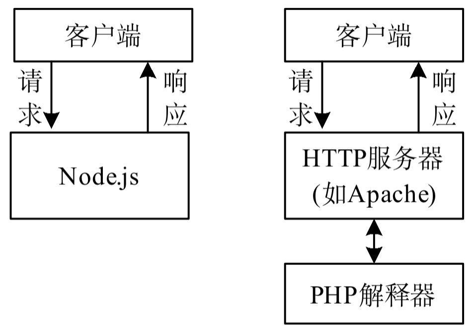
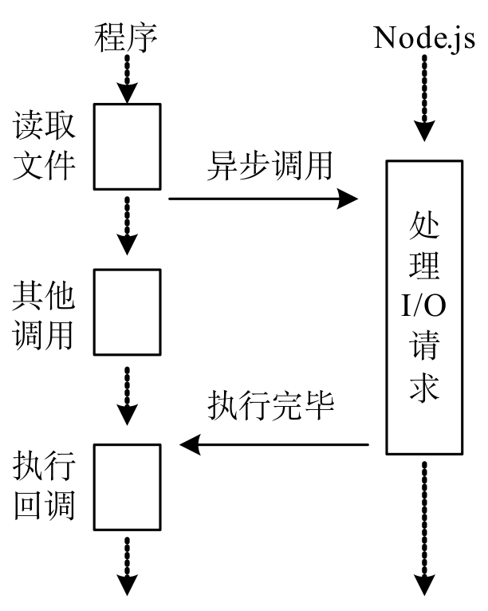
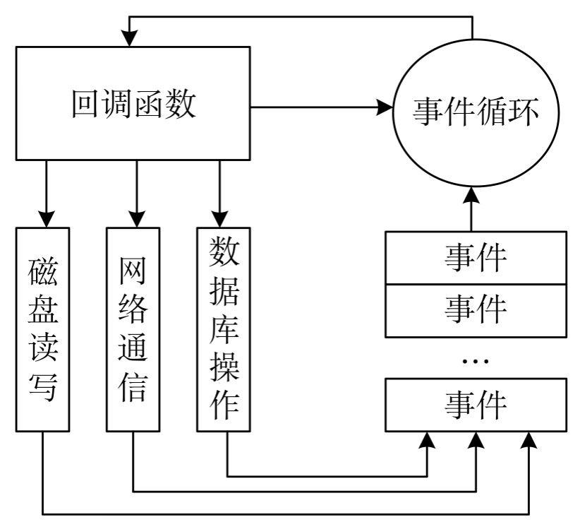
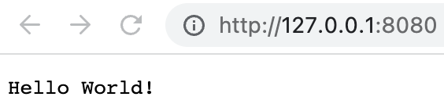
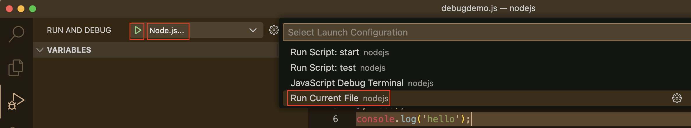
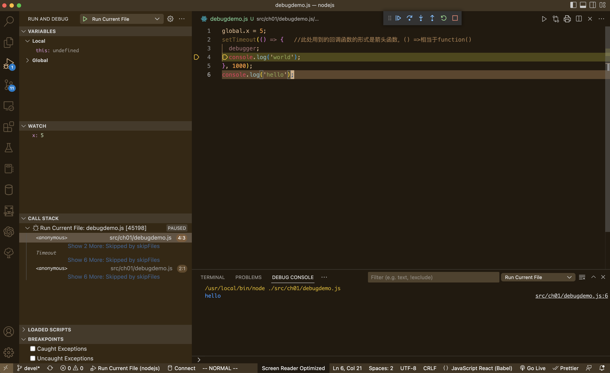

:author: https://github.com/wangzhaohe/swot-learning
:source-highlighter: pygments
:icons: font
:font-size: 16px
:scripts: cjk
:stem: latexmath
:experimental:
:toc:
:toc: right
:toc-title: 目录
:toclevels: 3
:tip-caption: ⚡
:note-caption: ❕
:important-caption: ❗
:warning-caption: ‼️
:caution-caption: ⚠️

// 如果是 PDF 后端，强制将目录改为宏模式，并关闭 HTML 专用的 right 定位
ifdef::backend-pdf[]
:toc: macro
:toc-placement: macro
endif::[]

= Node.js Learning

// 只有当后端不是 pdf 时才包含以下内容
ifndef::backend-pdf[]
++++

<button id="toggleButton">展开目录</button>

    

++++
endif::[]

== 基于 Node.js 技术的后端框架介绍
在 2026 年的 JavaScript 后端生态中，选择框架时不再仅仅看“流行度”，更多是看你的**业务复杂度**、**团队对 TypeScript 的依赖**以及*部署环境*。

以下是针对你提到的几个候选框架的深度对比建议：

=== NestJS：中大型业务的首选（企业级）
如果你在做一个**逻辑复杂、需要长期维护**的后端业务，NestJS
是目前的行业标准。

* *架构风格*：深受 Angular 影响，强制使用 *依赖注入 (DI)* 和 *模块化 (Modules)*。

* *优势*：
  ** *架构统一*：团队协作时，代码风格高度一致，新人上手后一眼就能找到 Controller 和 Service。
  ** *TypeScript 原生支持*：提供了最完美的装饰器（Decorators）支持，开发体验极佳。
  ** *生态全面*：内置了对微服务、WebSocket、GraphQL、各种数据库 ORM（如 Prisma/TypeORM）的深度集成。

* *缺点*：学习曲线较陡，代码量（Boilerplate）相对较多。

=== Nitro (Nuxt 4 的核心)：极致的 DX 与 Serverless 专家
Nitro 是 Nuxt 后端的引擎，现在越来越多的人将其作为**独立后端框架**使用。

* *架构风格*：基于 Web Standard，零配置，支持**文件路由**。

* *优势*：
  ** *跨平台部署*：代码写一份，可以无缝部署到 Node.js、Cloudflare Workers、Vercel、Deno 等任何环境。
  ** *极速启动*：热更新（HMR）飞快，包体积极小，非常适合 *Serverless* 架构。
  ** *现代特性*：自动导入（Auto-imports）、内置的缓存系统和存储层抽象。

* *缺点*：对于复杂的传统大型单体应用（Monolith），其结构可能显得过于轻量。

=== Express & Koa：极简主义与遗留系统
* *Express*：虽然老旧，但它依然是“JS 后端的底座”。如果你只是写一个几百行代码的小工具，或者需要极高的自由度，它依然可行。
但在 2026 年，它的异步处理和 TS 支持已落后于时代。

* *Koa*：比 Express 更现代一点（利用 async/await），但社区活跃度已不如 NestJS 和新兴框架。

=== 2026 年值得关注的“黑马”：Hono & Fastify
除了你提到的，这两个框架在当前非常火爆：

* *Hono*：被称为“Node.js 界的极致性能王者”。它极小、极快，且 API 极其简洁。如果你追求性能和 Edge Computing（边缘计算），选它。

* *Fastify*：NestJS 默认的底层引擎之一。它提供极高的吞吐量和强大的插件系统，适合对性能有硬性要求的业务。

=== 总结建议：我该选哪个? -> 快速开发首选 Express
[width="100%",cols="<34%,<33%,<33%",options="header",]
|===
|场景 |推荐框架 |原因
|*企业级、多人协作、长期迭代* |*NestJS* |架构严谨，可维护性最高。

|*全栈开发 (Nuxt)、Serverless、边缘计算* |*Nitro*
|部署最简单，开发体验（DX）最好。

|*极致性能、微服务、小型 API* |*Hono / Fastify* |速度最快，开销最小。

|*快速原型、简单脚本* |*Express* |简单直观，但不再建议用于复杂业务。
|===

*如果你追求稳健和职业发展，首选
NestJS；如果你希望在开发效率和跨平台能力上找突破，尝试 Nitro。*

https://www.youtube.com/watch?v=HhzHoJOtKOc[NestJS vs Express 深度对比]
这个视频详细对比了 2026 年主流后端框架的性能和 AI 辅助开发的友好度，能帮你更直观地看到各框架的代码风格差异。

== 基于 Bun 技术的后端框架介绍 -> 了解 目前还是首先 Node.js
在 2026 年，基于 Bun 构建后端，最大的优势就是 **原生性能**（极快的启动速度和 HTTP 吞吐量）以及 **开箱即用**（内置了打包、测试、SQLite、WebSocket 等工具）。

目前在 Bun 生态中，最值得关注的三个打桩（或核心构建）框架如下：

[upperalpha]
. ElysiaJS：Bun 的“亲儿子”
+
ElysiaJS 是专门为 Bun 量身定制的框架，它的设计哲学和 Bun 完美契合。

* **性能极限**：在多个 Benchmark 测试中，Elysia + Bun 的组合通常是 JS 领域中最快的，性能接近 Go 或 Rust。
* **端到端类型安全 (Eden)**：这是它最大的杀手锏。如果你前端也用 TS，Elysia 的 `Eden` 插件可以让前端像调用本地函数一样调用后端 API，共享所有的类型定义。
* **架构风格**：借鉴了 Fastify 和 Express 的简洁，但通过链式调用实现了极佳的开发体验。

. Hono：全能型选手
+
Hono（日语意为“火”）最初是为边缘计算设计的，但在 Bun 社区中极受欢迎。

* **极度轻量**：体积非常小，没有繁琐的依赖。
* **运行时无关**：虽然它在 Bun 上跑得飞快，但如果哪天你需要把代码迁移到 Node.js 或 Cloudflare Workers，几乎不需要修改代码。
* **内置功能丰富**：虽然轻量，但中间件非常全（Validator, Auth, CORS, Logger 等）。

. NestJS (配合 Bun 运行)
+
虽然 NestJS 不是专门为 Bun 设计的，但从 2025 年起，NestJS 对 Bun 的兼容性已经非常成熟。

* **适用场景**：如果你需要 Bun 的性能，但业务逻辑极其复杂，需要 NestJS 那套严谨的“依赖注入”和“面向对象”架构。
* **优势**：利用 Bun 极速的 `install` 和 `test` 命令，大幅缩短 NestJS 项目的 CI/CD 时间。

.核心对比表：基于 Bun 的选择
[caption=]
[cols="1,1,1,1",options="header",stripes=even]
|===
| 特性 | **ElysiaJS** | **Hono** | **NestJS (on Bun)** 

| **设计初衷** | 为 Bun 极致优化 | 跨运行时、轻量 | 企业级架构
| **类型支持** | 顶级 (Eden Connector) | 优秀 (TS First) | 优秀 (Decorators)
| **学习曲线** | 中等 | 极低 | 较高
| **性能** | ⭐⭐⭐⭐⭐ | ⭐⭐⭐⭐ | ⭐⭐⭐ 
| **最佳用途** | 高性能 API、全栈项目 | 边缘计算、中型 API | 大型复杂业务、企业后端
|===

为什么选择 Bun 框架而不是传统 Node.js 框架？

[upperalpha]
.  **原生 HTTP 性能**：Bun 实现了 `Bun.serve`，比 Node.js 的 `http` 模块快得多，上述框架都针对此进行了优化。
.  **内置工具链**：在使用 Elysia 或 Hono 时，你不再需要 `ts-node` 或 `nodemon`，Bun 自带的热重载（`bun --watch`）和测试工具（`bun test`）会让开发体验丝滑无比。
.  **零配置 TypeScript**：Bun 原生支持 `.ts` 文件，你不需要配置复杂的 `tsconfig` 或编译步骤。

总结建议

* 如果你追求 **最极致的性能** 和 **前后端类型同步**：选 **ElysiaJS**。
* 如果你追求 **轻量、灵活** 且可能考虑 **多平台部署**：选 **Hono**。
* 如果你在写 **传统的复杂业务**：用 Bun 跑 **NestJS**。

== Node.js 简介

=== 什么是 Node.js
Node.js 简称 Node，是一个可以使 JavaScript 运行在服务器端的开发平台。

JavaScript 本是一种 Web 前端语言，Node.js 让 JavaScript 成为服务器端脚本语言。

Node.js 选择 JavaScript 作为实现语言的原因：

- JavaScript 满足 ES/CommonJS 标准，符合事件驱动，用户较多且门槛较低；
- Chrome 的 V8 引擎具有出色的性能。

Node.js 将 V8 引擎封装起来，作为服务器运行平台，以执行 JavasScript 编写的后端脚本程序。 

***

- Node.js 运行时环境包含执行 JavaScript 程序所需的一切条件。该引擎会将 JavaScript 代码转换为更快的机器码。
+
.Node.js 与 Java 运行时环境对比

- Node.js 进一步提升 JavaScript 的能力，使 JavaScript 可以访问文件、读取数据库、访问进程，从而胜任后端任务。
- Node.js 的最大优点是开发人员可以在客户端和服务器端编写 JavaScript，打通了前后端开发语言。
- Node.js 发展迅速，目前已成为 JavaScript 服务器端运行平台的事实标准。
- Node.js 是跨平台的，能运行在 Windows、macOS 和 Linux 平台上。
- Node.js 除了自己的标准类库之外，还可使用大量的第三方模块系统来实现代码的分享和重用。
- 与其他后端脚本语言不同的是，Node.js 内置了处理网络请求和响应的函数库，也就是自备了 HTTP 服务器，#所以不需要额外部署 HTTP 服务器#。
+
.Node.js 与 PHP 对 HTTP 请求的处理

=== Node.js 的特点
[discrete]
===== 非阻塞I/O

.Node.js 的非阻塞 I/O

* 非阻塞I/O 又称异步式 I/O，是 Node.js 的重要特点。
* 阻塞I/O是指线程在执行过程中遇到I/O操作时，操作系统会撤销该线程的CPU控制权，使其暂停执行，处于等待状态，同时将资源转让给其他线程。
* 非阻塞I/O是指当线程遇到I/O操作时，不会以阻塞方式等待I/O操作完成或数据返回，而只是将I/O请求转发给操作系统，继续执行下一条指令。

---

[discrete]
===== 事件驱动

- 非阻塞I/O是一种异步方式的I/O，与事件驱动密不可分。
- 事件驱动以事件为中心，Node.js将每一个任务都当成事件来处理。Node.js在执行过程中会维护一个事件队列，需执行的每个任务都会加入事件队列并提供一个包含处理结果的回调函数。
- 在事件驱动模型中，会生成一个事件循环线程来监听事件，不断地检查是否有未处理的事件。
- Node.js 的异步机制是基于事件的，所有磁盘I/O、网络通信、数据库查询事件都以非阻塞的方式请求，返回的结果由事件循环线程来处理。

---
[discrete]
===== 单线程

* Node.js的应用程序是单进程、单线程的，但是通过事件和回调支持并发，性能变得非常高。
* 在阻塞模式下，一个线程只能处理一项任务，要想提高吞吐量必须使用多线程。
* 在非阻塞模式下，线程不会被I/O操作阻塞，该线程所使用的CPU核心利用率永远是100%，I/O操作以事件的方式通知操作系统。
* Node.js在主线程中维护一个事件队列，当接收到请求后，就将该请求作为一个事件放入该队列中，然后继续接收其他请求。
* Node.js内部通过线程池来完成非阻塞I/O操作，Node.js的单线程是指对JavaScript层面的任务处理是单线程的，而Node.js本身是一个多线程平台。

NOTE: Node.js采用非阻塞I/O与事件驱动相结合的编程模式，与传统同步I/O线性编程思维有很大的不同，Node.js程序的控制很大程度要依靠事件和回调函数，这不符合开发人员的常规线性思路，需要将一个完整的逻辑拆分为若干单元（事件），从而增加了开发和调试的难度。

=== Node.js 的应用场合
[discrete]
===== 适合用 Node.js 的场合

* REST API：REST API是一种前后端分离的应用程序架构。
* 单页 Web 应用：加载单个HTML页面，并在用户与应用程序交互时动态更新该页面的Web应用程序。
* 统一 Web 应用的UI层：Node.js 是面向服务的架构，其能够更好地实现前后端的依赖分离，可以将所有的关键业务逻辑都封装成REST API，UI层只需要考虑如何用这些API构建具体的应用。
* 准实时系统：如聊天系统、微博系统、博客系统的准实时社交系统，特点是轻量级、高流量，没有复杂的计算逻辑。
* 游戏服务器：程序员不必使用 C 语言就能开发游戏的服务器程序。
* 微服务架构：Node.js 也可用于实现基于微服务架构的应用。

[discrete]
===== 不适合用Node.js的场合

* 数据加密和解密。
* 数据压缩和解压。
* 模板渲染。

[discrete]
===== 弥补Node.js不足的解决方案

[caption=]
[cols="55,45",options="header"]
|===
|存在问题  |解决方案

|CPU 密集型任务偏向于 CPU计 算操作，需要 Node.js 直接处理，在事件队列中，如果前面的CPU计算任务没有完成，那么后面的任务就会被阻塞，出现响应慢的情况，使得后续I/O操作无法发起
|将大型运算任务分解为多个小任务，适时释放CPU计算空间资源，以免阻塞I/O调用的发起

|单线程无法利用多核 CPU。多CPU或多核CPU的服务器当 Node.js 被 CPU 密集型任务占用，导致其他任务被阻塞时，其他 CPU 核心处于闲置状态，从而造成资源浪费；Node.js 程序一旦在某个环节崩溃，整个系统都会崩溃，这会影响其可靠性
a|
1. 部署 Nginx 反向代理和负载均衡，开启多个进程，绑定多个端口
2. 使用 cluster 模块构建应用集群，启动多个 Node.js 实例，开启多个进程以监听同一个端口
|===

== 部署 Node.js 开发环境
安装地址，按说明直接安装：
https://nodejs.org/en/download/

NOTE: 建议使用 LTS 长期支持的版本即可。

下面推荐使用 nvm 进行安装，因为可以同时在一台电脑上安装多个版本的 Node.js。

=== 安装 nvm 管理 Node.js 版本
nvm 支持全平台的 Node.js 版本管理
https://github.com/nvm-sh/nvm

Windows system:
https://github.com/coreybutler/nvm-windows

nvm 常用命令

* nvm ls

nvm 未下载相应 Node.js 对应 npm 的解决方法
https://blog.csdn.net/touzhu11/article/details/126847877
+
1. nvm uninstall your_node_version
2. nvm npm_mirror https://npm.taobao.org/mirrors/npm/
3. nvm install your_node_version
4. 重新使用 npm 查看 node 以及 npm 版本是否存在
.. node -v
.. npm -v

=== 使用 nvm 管理 Node.js 版本

==== 核心命令速查表
[width="100%",cols="3,4,3",options="header"]
|===
| 命令 | 说明 | 示例
| `nvm install <version>` | 安装指定版本的 Node | `nvm install 20.11.0`
| `nvm use <version>` | 切换到指定版本 | `nvm use 18.19.0`
| `nvm ls` | 查看本地已安装的所有版本 | `nvm ls`
| `nvm ls-remote` | 查看远程可供安装的所有版本 | `nvm ls-remote`
| `nvm uninstall <version>` | 卸载指定版本 | `nvm uninstall 14.17.0`
| `nvm alias default <version>` | 设置默认版本 | `nvm alias default 20`
|===

==== 进阶实用技巧
查看当前正在使用的版本

[source,bash]
----
nvm current
----

快速安装最新版本

* **最新稳定版 (LTS)**: `nvm install --lts`
* **最新发布版 (Current)**: `nvm install node`

项目自动切换（最佳实践）

在项目根目录创建 `.nvmrc` 文件，内容仅需写上版本号（例如 `20.11.0`）。

.项目根目录下的 .nvmrc 文件内容
[source,text]
----
20.11.0
----

.之后进入该目录只需执行
[source,bash]
----
nvm use
----

`nvm` 会自动读取该文件并切换到对应的 Node 环境。

==== 配置国内镜像源
建议使用淘宝镜像安装源，以加快安装速度：

....
# 查看使用的安装源
npm config get registry
// 返回 https://registry.npm.taobao.org/，则说明当前使用的是旧的淘宝镜像源

// 配置安装源为淘宝镜像源，下面 npm 或者 pnpm 二选一
npm config set registry http://registry.npm.taobao.org  // 已经弃用
npm config set registry https://registry.npmmirror.com
....

.切换回官方的源
[source,javascript]
----
npm config set registry https://registry.npmjs.org/
----

.安装 pnpm (可选)
....
npm install -g pnpm   全局安装
....

==== nrm 管理镜像源
nrm (npm registry manager) 是一个简单、高效的 npm 源管理器。

[upperalpha]
. 安装
+
.在终端执行以下命令进行全局安装：
[source,bash]
----
npm install -g nrm
----

. 常用命令
+
.查看源列表，列出所有内置及自定义的镜像源（带 `*` 的为当前使用源）
[source,bash]
----
nrm ls
----
+
.切换源，切换到指定的镜像源（如切换到阿里云镜像）
[source,bash]
----
nrm use taobao
----
+
.测试延迟，测试你的网络环境到各个镜像源的响应速度：
[source,bash]
----
nrm test
----

. 常见问题
+
如果在 Windows 下运行报错，请确保已将 npm 的全局安装路径（通常是 `C:\Users\<用户名>\AppData\Roaming\npm`）添加到系统的 **PATH** 环境变量中。

=== fnm 使用 rust 写的最新管理工具 -- 了解
特点小且快。但是不要和 nvm 一起使用，因为会操作系统的环境变量搞乱。

=== 交互式运行环境
进入命令行界面，执行 #node# 命令即可启动 Node 终端，出现 “>” 提示符表示进入 REPL 命令行交互界面。

举例输入 2 * 6 查看结果为 12

输入 .exit 退出命令行工具。

问题：Node.js 开发环境有不有像 pytho 一样的超强的命令行工具，如 IPython 或者科学计算用的 notebook？

有的，参考: https://gemini.google.com/share/b9968fad202f

=== Node.js 程序开发工具 -- 建议 安装 Visual Studio Code
Download Visual Studio Code:
https://code.visualstudio.com/download

// 自行下载安装
// 自行学习如何使用 vscode

== 开始开发 Node.js 程序

=== 实战演练 -- 构建第一个 Node.js 原生 http 服务应用 -- 学习原理
[source,javascript]
----
/**
 * @fileoverview Hello World 服务器示例
 * @description 使用 Node.js 原生 http 模块创建简单的 HTTP 服务器
 * @author swot
 * @version 1.0.0
 */

import http from 'http';  // <1>

const httpServer = http.createServer(function (req, res) {  // <2>
    res.writeHead(200, {'Content-Type': 'text/plain'});  // <3>
    res.end("Hello World!");  // <4>
});

/**
 * 启动服务器并监听指定端口
 * @param {number} port - 监听端口号
 * @param {function} [callback] - 服务器启动后的回调函数
 */
httpServer.listen(8081, function(){  // <5>
    console.log(
        '服务器正在 8081 端口上监听!\n',
        'http://127.0.0.1:8081'
    );  // <6>
});
----

<1> 导入 Node.js 自带的 http 模块，并将实例化的 HTTP 组件赋值给变量 http。
模块是 Node.js 程序组织可重用代码的方式，可使用 import 方法来载入模块。

<2> 创建 HTTP 服务器。调用 http 模块提供的 http.createServer() 方法创建服务器，使用一个回调函数作为参数，该回调函数又接受两个参数，分别是代表客户端的请求对象和向客户端发送的响应对象，所有请求和响应都由此回调函数处理。

<3> 设置响应头信息: 200 告诉浏览器返回成功，文本内容

<4> 发送响应数据

<5> 启动 HTTP 服务器，并设置监听器的端口号。
http.createServer() 方法返回一个 HTTP 服务器对象，它使用 listen() 方法启动 HTTP 服务器以监听连接、指定端口号。该方法包含一个回调函数参数，用于设置启动 HTTP 服务器之后的操作。

<6> 向终端输出信息

=== 测试程序
. 在终端窗口中运行程序进行测试
+
[source,console,]
----
node helloworld.js
----
+
.终端输出如下
....
服务器正在8080端口上监听!
....

. 通过浏览器访问该 Web 应用程序进行测试
+

=== 运行 Node.js 程序

==== 使用 node 命令运行程序
[source,console,]
----
node xxx.js
----

* 运行当前目录下的 index.js 脚本文件，可以使用点号代替
+
[source,console,]
----
node .
----

* 选项-e（--eval）表示直接执行某语句：
[source,console,]
----
node -e "console.log('Hello World!');"
----

==== 使用 npm 命令运行程序 -- 实际开发常用
应该先使用 `npm init -y` 生成 package.json 文件（使用框架会自动执行初始化）。

这需要依赖当前目录下的配置文件 `package.json`。它是 CommonJS 规定的用于描述包的文件。
例如，当前目录下的 package.json 包含如下内容:
+
[source,json,]
----
{
  "name": "code",
  "version": "1.0.0",
  "type": "module",
  "description": "",
  "main": "index.js",
  "scripts": {
    "start": "node helloworld.js",
    "test": "echo \"Error: no test specified\" && exit 1"
  },
  "keywords": [],
  "author": "",
  "license": "ISC",
  "packageManager": "pnpm@10.9.0",
  "dependencies": {
    "express": "^4.22.1"
  },
  "devDependencies": {
    "nodemon": "^3.1.14"
  }
}
----
+
其中 scripts 属性定义要执行的脚本

- 在当前目录下执行 `npm start` 命令就相当于执行 `node helloworld.js` 命令;
- 执行 `npm test` 命令就相当于执行 `node test.js` 命令。
+
这种方式可以为不同的环境 (如测试、生产) 指定不同的 Node.js 程序。

==== 使用 nodemon 监视文件改动并自动重启程序
[source,console,]
----
$ npm i nodemon -g
$ nodemon xxx.js
----

==== 在 Visual Studio Code 中运行程序
在 vscode 中打开一个终端窗口，运行命令

[source,console,]
----
$ node xxx.js
----

=== 调试 Node.js 程序

==== 使用日志工具进行调试 -- 很常用的调试方式
* 使用 console.log() 方法检查变量或字符串的值，记录脚本调用的函数，或记录来自第三方服务的响应。

* 使用 console.warn() 方法记录警告。

* 使用 console.error() 方法记录错误信息。

[source,javascript]
----
global.x = 5;

// setTimeout 是异步函数，后打印
//此处用到的回调函数的形式是箭头函数，() => 相当于 function()
setTimeout(() => {
  console.log('world');
}, 1000);

// 同步代码先打印
console.log('hello');

/* 打印结果
hello
world
*/
----

CAUTION: 在生产项目中不要写太多的打印，如果使用 PM2 部署应用，则可能会占用太多的硬盘空间。

.pm2 对打印占用硬盘空间的解决方法
****
[source,javascript]
----
module.exports = {
  apps: [{
    name: 'your-app',
    script: './app.js',

    // 日志配置
    output: './logs/out.log',     // 标准输出日志
    error: './logs/err.log',      // 错误日志
    log_date_format: 'YYYY-MM-DD HH:mm:ss',

    // 关键：日志轮转限制
    max_size: '10M',              // 单个日志文件最大 10MB
    retain: 7,                    // 保留 7 个历史文件
    compress: true,               // 压缩旧日志

    // 或者合并日志到统一文件
    merge_logs: true,
  }]
}
----
****

==== 使用 Node.js 内置调试器 debugger --  命令行调试
Node.js 内置一个进程外的调试实用程序，可通过 V8 检查器和内置调试客户端访问。

. 调试之前先将 debugger; 语句插入到脚本的源代码，以在代码中的该位置启用断点。
+
[source,javascript,]
----
global.x = 5;

// setTimeout 是异步函数，后打印
//此处用到的回调函数的形式是箭头函数，() => 相当于 function()
setTimeout(() => {
  debugger;
  console.log('world');
}, 1000);

// 同步代码先打印
console.log('hello');

/* 打印结果
hello
world
*/
----
+
<1> 插入 debugger 语句

. 执行 node 命令时加上 `inspect` 参数，指定要调试的脚本的路径。
+
[source,console,]
----
node inspect debugdemo.js
----

==== debugger 调试操作
[%collapsible]
====
....
< Debugger listening on ws://127.0.0.1:9229/bf92c68e-26b6-44cb-bc75-f5f812fb4c0b
< For help, see: https://nodejs.org/en/docs/inspector
<
< Debugger attached.
<
 ok
Break on start in debugdemo.js:1
> 1 global.x = 5;
  2 setTimeout(() => {   //此处用到的回调函数的形式是箭头函数，() =>相当于function()
  3   debugger;
debug> cont // <1>
< hello
<
break in debugdemo.js:3
  1 global.x = 5;
  2 setTimeout(() => {   //此处用到的回调函数的形式是箭头函数，() =>相当于function()
> 3   debugger;
  4   console.log('world');
  5 }, 1000);
debug> next  // <2>
break in debugdemo.js:4
  2 setTimeout(() => {   //此处用到的回调函数的形式是箭头函数，() =>相当于function()
  3   debugger;
> 4   console.log('world');
  5 }, 1000);
  6 console.log('hello');
debug> repl  // <3>
Press Ctrl+C to leave debug repl
> x
5
> .exit  // <4>
....
<1> cont 继续执行后面代码直到断点
<2> next 下一步
<3> repl 交互模式，比如输入 x 可以查看 x 的值，输入 1+1 能得到 2
<4> exit 退出调试

NOTE: 其中代码行号前面的 > 符号表示程序暂停的位置。
====

==== 在 Visual Studio Code 中调试 -- 或者使用 codebuddy 调试
.执行调试

.调试界面

// https://blog.csdn.net/weixin_47978760/article/details/125956108?[VSCode如何调试Nodejs]
// https://blog.csdn.net/guoqiankunmiss/article/details/121820579?[NodeJS Debug & VSCode Debugger]
// https://www.bilibili.com/read/cv16911146?[vscode nodejs断点调试]

