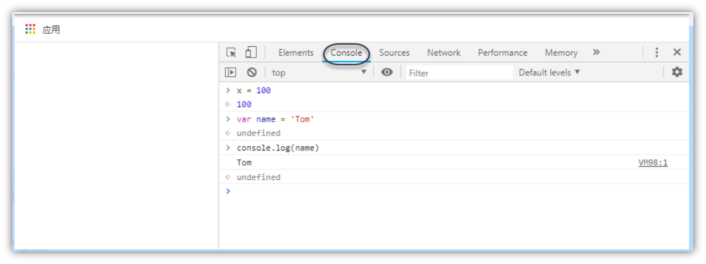
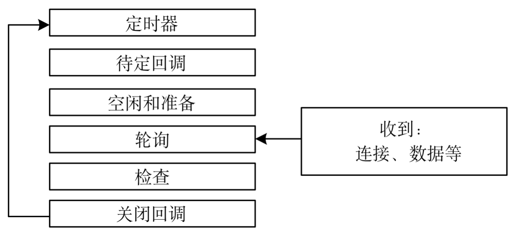

:author: https://github.com/wangzhaohe/swot-learning
:source-highlighter: pygments
:icons: font
:font-size: 16px
:scripts: cjk
:stem: latexmath
:experimental:
:toc:
:toc: right
:toc-title: 目录
:toclevels: 3
:tip-caption: ⚡
:note-caption: ❕
:important-caption: ❗
:warning-caption: ‼️
:caution-caption: ⚠️

// 如果是 PDF 后端，强制将目录改为宏模式，并关闭 HTML 专用的 right 定位
ifdef::backend-pdf[]
:toc: macro
:toc-placement: macro
endif::[]

= Node.js Learning

// 只有当后端不是 pdf 时才包含以下内容
ifndef::backend-pdf[]
++++
<style>
/* 1. 默认状态：初始就是隐藏的 */
#toc {
    max-width: 0 !important;
    opacity: 0 !important;
    padding-left: 0 !important;
    padding-right: 0 !important;
    border: none !important;
    overflow: hidden !important; /* 必须在这里，保证收缩时内容不溢出 */
    white-space: nowrap !important;

    /* 【关键】：过渡动画必须放在基类里，这样“展开”和“收回”都有动画 */
    transition: max-width 0.3s cubic-bezier(0.4, 0, 0.2, 1),
                padding 0.3s cubic-bezier(0.4, 0, 0.2, 1),
                opacity 0.3s ease;
}

/* 2. 展开状态：点击后添加 .active 或 .expanded 类 */
#toc.active {
    max-width: 530px !important;
    opacity: 1 !important;
    padding: 10px !important; /* 根据需要恢复 padding */
    overflow-y: auto !important;
}

/* 3. 列表样式保持不变 */
#toc ul, #toc li {
    margin-bottom: 8px !important;
    line-height: 1.4 !important;
}
</style>

<button id="toggleButton">展开目录</button>
<div id="toc">
    </div>

<script>
const toggleButton = document.getElementById('toggleButton');
const contentDiv = document.getElementById('toc');

toggleButton.addEventListener('click', () => {
    // 切换 active 类
    const isExpanded = contentDiv.classList.toggle('active');

    // 逻辑：如果现在是 expanded (true)，说明打开了，按钮应该提示“收起”
    toggleButton.textContent = isExpanded ? '收起目录' : '展开目录';
});
</script>
++++
endif::[]

== 基于 Node.js 技术的后端框架介绍
在 2026 年的 JavaScript 后端生态中，选择框架时不再仅仅看“流行度”，更多是看你的**业务复杂度**、**团队对 TypeScript 的依赖**以及*部署环境*。

以下是针对你提到的几个候选框架的深度对比建议：

=== NestJS：中大型业务的首选（企业级）
如果你在做一个**逻辑复杂、需要长期维护**的后端业务，NestJS
是目前的行业标准。

* *架构风格*：深受 Angular 影响，强制使用 *依赖注入 (DI)* 和 *模块化 (Modules)*。

* *优势*：
  ** *架构统一*：团队协作时，代码风格高度一致，新人上手后一眼就能找到 Controller 和 Service。
  ** *TypeScript 原生支持*：提供了最完美的装饰器（Decorators）支持，开发体验极佳。
  ** *生态全面*：内置了对微服务、WebSocket、GraphQL、各种数据库 ORM（如 Prisma/TypeORM）的深度集成。

* *缺点*：学习曲线较陡，代码量（Boilerplate）相对较多。

=== Nitro (Nuxt 4 的核心)：极致的 DX 与 Serverless 专家
Nitro 是 Nuxt 后端的引擎，现在越来越多的人将其作为**独立后端框架**使用。

* *架构风格*：基于 Web Standard，零配置，支持**文件路由**。

* *优势*：
  ** *跨平台部署*：代码写一份，可以无缝部署到 Node.js、Cloudflare Workers、Vercel、Deno 等任何环境。
  ** *极速启动*：热更新（HMR）飞快，包体积极小，非常适合 *Serverless* 架构。
  ** *现代特性*：自动导入（Auto-imports）、内置的缓存系统和存储层抽象。

* *缺点*：对于复杂的传统大型单体应用（Monolith），其结构可能显得过于轻量。

=== Express & Koa：极简主义与遗留系统
* *Express*：虽然老旧，但它依然是“JS 后端的底座”。如果你只是写一个几百行代码的小工具，或者需要极高的自由度，它依然可行。
但在 2026 年，它的异步处理和 TS 支持已落后于时代。

* *Koa*：比 Express 更现代一点（利用 async/await），但社区活跃度已不如 NestJS 和新兴框架。

=== 2026 年值得关注的“黑马”：Hono & Fastify
除了你提到的，这两个框架在当前非常火爆：

* *Hono*：被称为“Node.js 界的极致性能王者”。它极小、极快，且 API 极其简洁。如果你追求性能和 Edge Computing（边缘计算），选它。

* *Fastify*：NestJS 默认的底层引擎之一。它提供极高的吞吐量和强大的插件系统，适合对性能有硬性要求的业务。

=== 总结建议：我该选哪个? -> 快速开发首选 Express
[width="100%",cols="<34%,<33%,<33%",options="header",]
|===
|场景 |推荐框架 |原因
|*企业级、多人协作、长期迭代* |*NestJS* |架构严谨，可维护性最高。

|*全栈开发 (Nuxt)、Serverless、边缘计算* |*Nitro*
|部署最简单，开发体验（DX）最好。

|*极致性能、微服务、小型 API* |*Hono / Fastify* |速度最快，开销最小。

|*快速原型、简单脚本* |*Express* |简单直观，但不再建议用于复杂业务。
|===

*如果你追求稳健和职业发展，首选
NestJS；如果你希望在开发效率和跨平台能力上找突破，尝试 Nitro。*

https://www.youtube.com/watch?v=HhzHoJOtKOc[NestJS vs Express 深度对比]
这个视频详细对比了 2026 年主流后端框架的性能和 AI 辅助开发的友好度，能帮你更直观地看到各框架的代码风格差异。

== 基于 Bun 技术的后端框架介绍 -> 了解 目前还是首先 Node.js
在 2026 年，基于 Bun 构建后端，最大的优势就是 **原生性能**（极快的启动速度和 HTTP 吞吐量）以及 **开箱即用**（内置了打包、测试、SQLite、WebSocket 等工具）。

目前在 Bun 生态中，最值得关注的三个打桩（或核心构建）框架如下：

[upperalpha]
. ElysiaJS：Bun 的“亲儿子”
+
ElysiaJS 是专门为 Bun 量身定制的框架，它的设计哲学和 Bun 完美契合。

* **性能极限**：在多个 Benchmark 测试中，Elysia + Bun 的组合通常是 JS 领域中最快的，性能接近 Go 或 Rust。
* **端到端类型安全 (Eden)**：这是它最大的杀手锏。如果你前端也用 TS，Elysia 的 `Eden` 插件可以让前端像调用本地函数一样调用后端 API，共享所有的类型定义。
* **架构风格**：借鉴了 Fastify 和 Express 的简洁，但通过链式调用实现了极佳的开发体验。

. Hono：全能型选手
+
Hono（日语意为“火”）最初是为边缘计算设计的，但在 Bun 社区中极受欢迎。

* **极度轻量**：体积非常小，没有繁琐的依赖。
* **运行时无关**：虽然它在 Bun 上跑得飞快，但如果哪天你需要把代码迁移到 Node.js 或 Cloudflare Workers，几乎不需要修改代码。
* **内置功能丰富**：虽然轻量，但中间件非常全（Validator, Auth, CORS, Logger 等）。

. NestJS (配合 Bun 运行)
+
虽然 NestJS 不是专门为 Bun 设计的，但从 2025 年起，NestJS 对 Bun 的兼容性已经非常成熟。

* **适用场景**：如果你需要 Bun 的性能，但业务逻辑极其复杂，需要 NestJS 那套严谨的“依赖注入”和“面向对象”架构。
* **优势**：利用 Bun 极速的 `install` 和 `test` 命令，大幅缩短 NestJS 项目的 CI/CD 时间。


.核心对比表：基于 Bun 的选择
[caption=]
[cols="1,1,1,1",options="header",stripes=even]
|===
| 特性 | **ElysiaJS** | **Hono** | **NestJS (on Bun)** 

| **设计初衷** | 为 Bun 极致优化 | 跨运行时、轻量 | 企业级架构
| **类型支持** | 顶级 (Eden Connector) | 优秀 (TS First) | 优秀 (Decorators)
| **学习曲线** | 中等 | 极低 | 较高
| **性能** | ⭐⭐⭐⭐⭐ | ⭐⭐⭐⭐ | ⭐⭐⭐ 
| **最佳用途** | 高性能 API、全栈项目 | 边缘计算、中型 API | 大型复杂业务、企业后端
|===


为什么选择 Bun 框架而不是传统 Node.js 框架？

[upperalpha]
.  **原生 HTTP 性能**：Bun 实现了 `Bun.serve`，比 Node.js 的 `http` 模块快得多，上述框架都针对此进行了优化。
.  **内置工具链**：在使用 Elysia 或 Hono 时，你不再需要 `ts-node` 或 `nodemon`，Bun 自带的热重载（`bun --watch`）和测试工具（`bun test`）会让开发体验丝滑无比。
.  **零配置 TypeScript**：Bun 原生支持 `.ts` 文件，你不需要配置复杂的 `tsconfig` 或编译步骤。

总结建议

* 如果你追求 **最极致的性能** 和 **前后端类型同步**：选 **ElysiaJS**。
* 如果你追求 **轻量、灵活** 且可能考虑 **多平台部署**：选 **Hono**。
* 如果你在写 **传统的复杂业务**：用 Bun 跑 **NestJS**。

== Node.js 简介


=== 什么是 Node.js
Node.js 简称 Node，是一个可以使 JavaScript 运行在服务器端的开发平台。

JavaScript 本是一种 Web 前端语言，Node.js 让 JavaScript 成为服务器端脚本语言。

Node.js 选择 JavaScript 作为实现语言的原因：

- JavaScript 满足 ES/CommonJS 标准，符合事件驱动，用户较多且门槛较低；
- Chrome 的 V8 引擎具有出色的性能。

Node.js 将 V8 引擎封装起来，作为服务器运行平台，以执行 JavasScript 编写的后端脚本程序。 

***

- Node.js 运行时环境包含执行 JavaScript 程序所需的一切条件。该引擎会将 JavaScript 代码转换为更快的机器码。
+
.Node.js 与 Java 运行时环境对比
image::img/nodejs_vs_java.png[,500,role=thumb]

- Node.js 进一步提升 JavaScript 的能力，使 JavaScript 可以访问文件、读取数据库、访问进程，从而胜任后端任务。
- Node.js 的最大优点是开发人员可以在客户端和服务器端编写 JavaScript，打通了前后端开发语言。
- Node.js 发展迅速，目前已成为 JavaScript 服务器端运行平台的事实标准。
- Node.js 是跨平台的，能运行在 Windows、macOS 和 Linux 平台上。
- Node.js 除了自己的标准类库之外，还可使用大量的第三方模块系统来实现代码的分享和重用。
- 与其他后端脚本语言不同的是，Node.js 内置了处理网络请求和响应的函数库，也就是自备了 HTTP 服务器，#所以不需要额外部署 HTTP 服务器#。
+
.Node.js 与 PHP 对 HTTP 请求的处理
image::img/nodejs_vs_php.png[,400,role=thumb]

=== Node.js 的特点
[discrete]
===== 非阻塞I/O

.Node.js 的非阻塞 I/O
image::img/nodejs_io.png[,240,role="thumb right"]

* 非阻塞I/O 又称异步式 I/O，是 Node.js 的重要特点。
* 阻塞I/O是指线程在执行过程中遇到I/O操作时，操作系统会撤销该线程的CPU控制权，使其暂停执行，处于等待状态，同时将资源转让给其他线程。
* 非阻塞I/O是指当线程遇到I/O操作时，不会以阻塞方式等待I/O操作完成或数据返回，而只是将I/O请求转发给操作系统，继续执行下一条指令。

---

[discrete]
===== 事件驱动

image::img/event_drive.png[,270,role="thumb right"]

- 非阻塞I/O是一种异步方式的I/O，与事件驱动密不可分。
- 事件驱动以事件为中心，Node.js将每一个任务都当成事件来处理。Node.js在执行过程中会维护一个事件队列，需执行的每个任务都会加入事件队列并提供一个包含处理结果的回调函数。
- 在事件驱动模型中，会生成一个事件循环线程来监听事件，不断地检查是否有未处理的事件。
- Node.js 的异步机制是基于事件的，所有磁盘I/O、网络通信、数据库查询事件都以非阻塞的方式请求，返回的结果由事件循环线程来处理。

---
[discrete]
===== 单线程

* Node.js的应用程序是单进程、单线程的，但是通过事件和回调支持并发，性能变得非常高。
* 在阻塞模式下，一个线程只能处理一项任务，要想提高吞吐量必须使用多线程。
* 在非阻塞模式下，线程不会被I/O操作阻塞，该线程所使用的CPU核心利用率永远是100%，I/O操作以事件的方式通知操作系统。
* Node.js在主线程中维护一个事件队列，当接收到请求后，就将该请求作为一个事件放入该队列中，然后继续接收其他请求。
* Node.js内部通过线程池来完成非阻塞I/O操作，Node.js的单线程是指对JavaScript层面的任务处理是单线程的，而Node.js本身是一个多线程平台。

NOTE: Node.js采用非阻塞I/O与事件驱动相结合的编程模式，与传统同步I/O线性编程思维有很大的不同，Node.js程序的控制很大程度要依靠事件和回调函数，这不符合开发人员的常规线性思路，需要将一个完整的逻辑拆分为若干单元（事件），从而增加了开发和调试的难度。

=== Node.js 的应用场合
[discrete]
===== 适合用 Node.js 的场合

* REST API：REST API是一种前后端分离的应用程序架构。
* 单页 Web 应用：加载单个HTML页面，并在用户与应用程序交互时动态更新该页面的Web应用程序。
* 统一 Web 应用的UI层：Node.js 是面向服务的架构，其能够更好地实现前后端的依赖分离，可以将所有的关键业务逻辑都封装成REST API，UI层只需要考虑如何用这些API构建具体的应用。
* 准实时系统：如聊天系统、微博系统、博客系统的准实时社交系统，特点是轻量级、高流量，没有复杂的计算逻辑。
* 游戏服务器：程序员不必使用 C 语言就能开发游戏的服务器程序。
* 微服务架构：Node.js 也可用于实现基于微服务架构的应用。

[discrete]
===== 不适合用Node.js的场合

* 数据加密和解密。
* 数据压缩和解压。
* 模板渲染。

[discrete]
===== 弥补Node.js不足的解决方案

[caption=]
[cols="55,45",options="header"]
|===
|存在问题  |解决方案

|CPU 密集型任务偏向于 CPU计 算操作，需要 Node.js 直接处理，在事件队列中，如果前面的CPU计算任务没有完成，那么后面的任务就会被阻塞，出现响应慢的情况，使得后续I/O操作无法发起
|将大型运算任务分解为多个小任务，适时释放CPU计算空间资源，以免阻塞I/O调用的发起

|单线程无法利用多核 CPU。多CPU或多核CPU的服务器当 Node.js 被 CPU 密集型任务占用，导致其他任务被阻塞时，其他 CPU 核心处于闲置状态，从而造成资源浪费；Node.js 程序一旦在某个环节崩溃，整个系统都会崩溃，这会影响其可靠性
a|
1. 部署 Nginx 反向代理和负载均衡，开启多个进程，绑定多个端口
2. 使用 cluster 模块构建应用集群，启动多个 Node.js 实例，开启多个进程以监听同一个端口
|===

== 部署 Node.js 开发环境
安装地址，按说明直接安装：
https://nodejs.org/en/download/

NOTE: 建议使用 LTS 长期支持的版本即可。

下面推荐使用 nvm 进行安装，因为可以同时在一台电脑上安装多个版本的 Node.js。

=== 安装 nvm 管理 Node.js 版本
nvm 支持全平台的 Node.js 版本管理
https://github.com/nvm-sh/nvm

Windows system:
https://github.com/coreybutler/nvm-windows

nvm 常用命令

* nvm ls


nvm 未下载相应 Node.js 对应 npm 的解决方法
https://blog.csdn.net/touzhu11/article/details/126847877
+
1. nvm uninstall your_node_version
2. nvm npm_mirror https://npm.taobao.org/mirrors/npm/
3. nvm install your_node_version
4. 重新使用 npm 查看 node 以及 npm 版本是否存在
.. node -v
.. npm -v

=== 使用 nvm 管理 Node.js 版本


==== 核心命令速查表
[width="100%",cols="3,4,3",options="header"]
|===
| 命令 | 说明 | 示例
| `nvm install <version>` | 安装指定版本的 Node | `nvm install 20.11.0`
| `nvm use <version>` | 切换到指定版本 | `nvm use 18.19.0`
| `nvm ls` | 查看本地已安装的所有版本 | `nvm ls`
| `nvm ls-remote` | 查看远程可供安装的所有版本 | `nvm ls-remote`
| `nvm uninstall <version>` | 卸载指定版本 | `nvm uninstall 14.17.0`
| `nvm alias default <version>` | 设置默认版本 | `nvm alias default 20`
|===

==== 进阶实用技巧
查看当前正在使用的版本

[source,bash]
----
nvm current
----

快速安装最新版本

* **最新稳定版 (LTS)**: `nvm install --lts`
* **最新发布版 (Current)**: `nvm install node`

项目自动切换（最佳实践）

在项目根目录创建 `.nvmrc` 文件，内容仅需写上版本号（例如 `20.11.0`）。

.项目根目录下的 .nvmrc 文件内容
[source,text]
----
20.11.0
----

.之后进入该目录只需执行
[source,bash]
----
nvm use
----

`nvm` 会自动读取该文件并切换到对应的 Node 环境。

==== 配置国内镜像源
建议使用淘宝镜像安装源，以加快安装速度：

....
# 查看使用的安装源
npm config get registry
// 返回 https://registry.npm.taobao.org/，则说明当前使用的是旧的淘宝镜像源

// 配置安装源为淘宝镜像源，下面 npm 或者 pnpm 二选一
npm config set registry http://registry.npm.taobao.org  // 已经弃用
npm config set registry https://registry.npmmirror.com
....

.切换回官方的源
[source,javascript]
----
npm config set registry https://registry.npmjs.org/
----

.安装 pnpm (可选)
....
npm install -g pnpm   全局安装
....

==== nrm 管理镜像源
nrm (npm registry manager) 是一个简单、高效的 npm 源管理器。

[upperalpha]
. 安装
+
.在终端执行以下命令进行全局安装：
[source,bash]
----
npm install -g nrm
----

. 常用命令
+
.查看源列表，列出所有内置及自定义的镜像源（带 `*` 的为当前使用源）
[source,bash]
----
nrm ls
----
+
.切换源，切换到指定的镜像源（如切换到阿里云镜像）
[source,bash]
----
nrm use taobao
----
+
.测试延迟，测试你的网络环境到各个镜像源的响应速度：
[source,bash]
----
nrm test
----


. 常见问题
+
如果在 Windows 下运行报错，请确保已将 npm 的全局安装路径（通常是 `C:\Users\<用户名>\AppData\Roaming\npm`）添加到系统的 **PATH** 环境变量中。

=== fnm 使用 rust 写的最新管理工具 -- 了解
特点小且快。但是不要和 nvm 一起使用，因为会操作系统的环境变量搞乱。

=== 交互式运行环境
进入命令行界面，执行 #node# 命令即可启动 Node 终端，出现 “>” 提示符表示进入 REPL 命令行交互界面。

举例输入 2 * 6 查看结果为 12

输入 .exit 退出命令行工具。


问题：Node.js 开发环境有不有像 pytho 一样的超强的命令行工具，如 IPython 或者科学计算用的 notebook？

有的，参考: https://gemini.google.com/share/b9968fad202f

=== Node.js 程序开发工具 -- 建议 安装 Visual Studio Code
Download Visual Studio Code:
https://code.visualstudio.com/download

// 自行下载安装
// 自行学习如何使用 vscode

== 开始开发 Node.js 程序


=== 实战演练 -- 构建第一个 Node.js 原生 http 服务应用 -- 学习原理
[source,javascript]
----
/**
 * @fileoverview Hello World 服务器示例
 * @description 使用 Node.js 原生 http 模块创建简单的 HTTP 服务器
 * @author swot
 * @version 1.0.0
 */

import http from 'http';  // <1>

const httpServer = http.createServer(function (req, res) {  // <2>
    res.writeHead(200, {'Content-Type': 'text/plain'});  // <3>
    res.end("Hello World!");  // <4>
});

/**
 * 启动服务器并监听指定端口
 * @param {number} port - 监听端口号
 * @param {function} [callback] - 服务器启动后的回调函数
 */
httpServer.listen(8081, function(){  // <5>
    console.log(
        '服务器正在 8081 端口上监听!\n',
        'http://127.0.0.1:8081'
    );  // <6>
});
----

<1> 导入 Node.js 自带的 http 模块，并将实例化的 HTTP 组件赋值给变量 http。
模块是 Node.js 程序组织可重用代码的方式，可使用 import 方法来载入模块。

<2> 创建 HTTP 服务器。调用 http 模块提供的 http.createServer() 方法创建服务器，使用一个回调函数作为参数，该回调函数又接受两个参数，分别是代表客户端的请求对象和向客户端发送的响应对象，所有请求和响应都由此回调函数处理。

<3> 设置响应头信息: 200 告诉浏览器返回成功，文本内容

<4> 发送响应数据

<5> 启动 HTTP 服务器，并设置监听器的端口号。
http.createServer() 方法返回一个 HTTP 服务器对象，它使用 listen() 方法启动 HTTP 服务器以监听连接、指定端口号。该方法包含一个回调函数参数，用于设置启动 HTTP 服务器之后的操作。

<6> 向终端输出信息

=== 测试程序
. 在终端窗口中运行程序进行测试
+
[source,console,]
----
node helloworld.js
----
+
.终端输出如下
....
服务器正在8080端口上监听!
....


. 通过浏览器访问该 Web 应用程序进行测试
+
image::img/helloworld.png[,420,]

=== 运行 Node.js 程序


==== 使用 node 命令运行程序
[source,console,]
----
node xxx.js
----

* 运行当前目录下的 index.js 脚本文件，可以使用点号代替
+
[source,console,]
----
node .
----

* 选项-e（--eval）表示直接执行某语句：
[source,console,]
----
node -e "console.log('Hello World!');"
----

==== 使用 npm 命令运行程序 -- 实际开发常用
应该先使用 `npm init -y` 生成 package.json 文件（使用框架会自动执行初始化）。

这需要依赖当前目录下的配置文件 `package.json`。它是 CommonJS 规定的用于描述包的文件。
例如，当前目录下的 package.json 包含如下内容:
+
[source,json,]
----
{
  "name": "code",
  "version": "1.0.0",
  "type": "module",
  "description": "",
  "main": "index.js",
  "scripts": {
    "start": "node helloworld.js",
    "test": "echo \"Error: no test specified\" && exit 1"
  },
  "keywords": [],
  "author": "",
  "license": "ISC",
  "packageManager": "pnpm@10.9.0",
  "dependencies": {
    "express": "^4.22.1"
  },
  "devDependencies": {
    "nodemon": "^3.1.14"
  }
}
----
+
其中 scripts 属性定义要执行的脚本

- 在当前目录下执行 `npm start` 命令就相当于执行 `node helloworld.js` 命令;
- 执行 `npm test` 命令就相当于执行 `node test.js` 命令。
+
这种方式可以为不同的环境 (如测试、生产) 指定不同的 Node.js 程序。

==== 使用 nodemon 监视文件改动并自动重启程序
[source,console,]
----
$ npm i nodemon -g
$ nodemon xxx.js
----

==== 在 Visual Studio Code 中运行程序
在 vscode 中打开一个终端窗口，运行命令

[source,console,]
----
$ node xxx.js
----

=== 调试 Node.js 程序


==== 使用日志工具进行调试 -- 很常用的调试方式
* 使用 console.log() 方法检查变量或字符串的值，记录脚本调用的函数，或记录来自第三方服务的响应。

* 使用 console.warn() 方法记录警告。

* 使用 console.error() 方法记录错误信息。

[source,javascript]
----
global.x = 5;

// setTimeout 是异步函数，后打印
//此处用到的回调函数的形式是箭头函数，() => 相当于 function()
setTimeout(() => {
  console.log('world');
}, 1000);

// 同步代码先打印
console.log('hello');

/* 打印结果
hello
world
*/
----


CAUTION: 在生产项目中不要写太多的打印，如果使用 PM2 部署应用，则可能会占用太多的硬盘空间。


.pm2 对打印占用硬盘空间的解决方法
****
[source,javascript]
----
module.exports = {
  apps: [{
    name: 'your-app',
    script: './app.js',

    // 日志配置
    output: './logs/out.log',     // 标准输出日志
    error: './logs/err.log',      // 错误日志
    log_date_format: 'YYYY-MM-DD HH:mm:ss',

    // 关键：日志轮转限制
    max_size: '10M',              // 单个日志文件最大 10MB
    retain: 7,                    // 保留 7 个历史文件
    compress: true,               // 压缩旧日志

    // 或者合并日志到统一文件
    merge_logs: true,
  }]
}
----
****

==== 使用 Node.js 内置调试器 debugger --  命令行调试
Node.js 内置一个进程外的调试实用程序，可通过 V8 检查器和内置调试客户端访问。

. 调试之前先将 debugger; 语句插入到脚本的源代码，以在代码中的该位置启用断点。
+
[source,javascript,]
----
global.x = 5;

// setTimeout 是异步函数，后打印
//此处用到的回调函数的形式是箭头函数，() => 相当于 function()
setTimeout(() => {
  debugger;
  console.log('world');
}, 1000);

// 同步代码先打印
console.log('hello');

/* 打印结果
hello
world
*/
----
+
<1> 插入 debugger 语句

. 执行 node 命令时加上 `inspect` 参数，指定要调试的脚本的路径。
+
[source,console,]
----
node inspect debugdemo.js
----

==== debugger 调试操作
[%collapsible]
====
....
< Debugger listening on ws://127.0.0.1:9229/bf92c68e-26b6-44cb-bc75-f5f812fb4c0b
< For help, see: https://nodejs.org/en/docs/inspector
<
< Debugger attached.
<
 ok
Break on start in debugdemo.js:1
> 1 global.x = 5;
  2 setTimeout(() => {   //此处用到的回调函数的形式是箭头函数，() =>相当于function()
  3   debugger;
debug> cont // <1>
< hello
<
break in debugdemo.js:3
  1 global.x = 5;
  2 setTimeout(() => {   //此处用到的回调函数的形式是箭头函数，() =>相当于function()
> 3   debugger;
  4   console.log('world');
  5 }, 1000);
debug> next  // <2>
break in debugdemo.js:4
  2 setTimeout(() => {   //此处用到的回调函数的形式是箭头函数，() =>相当于function()
  3   debugger;
> 4   console.log('world');
  5 }, 1000);
  6 console.log('hello');
debug> repl  // <3>
Press Ctrl+C to leave debug repl
> x
5
> .exit  // <4>
....
<1> cont 继续执行后面代码直到断点
<2> next 下一步
<3> repl 交互模式，比如输入 x 可以查看 x 的值，输入 1+1 能得到 2
<4> exit 退出调试

NOTE: 其中代码行号前面的 > 符号表示程序暂停的位置。
====

==== 在 Visual Studio Code 中调试 -- 或者使用 codebuddy 调试
.执行调试
image::img/vscode_debug.png[]

.调试界面
image::img/vscode_debug2.png[]

// https://blog.csdn.net/weixin_47978760/article/details/125956108?[VSCode如何调试Nodejs]
// https://blog.csdn.net/guoqiankunmiss/article/details/121820579?[NodeJS Debug & VSCode Debugger]
// https://www.bilibili.com/read/cv16911146?[vscode nodejs断点调试]

== Node.js 编程基础


=== JavaScript 基本语法
Node.js 基于 V8 引擎，这意味着其语法与 JavaScript 基本相同，本章先概略地介绍 JavaScript 的语法。JavaScript 语法内容非常多，这里仅介绍与 Node.js 编程有关的 JavaScript 新特性和新要求，建议重点关注块级作用域、模板字符串、集合和映射、箭头函数、高阶函数、闭包、严格模式等内容。

==== 版本
ES6 是目前的主流版本, Node.js 自 6.0 版本开始全面支持 ES6。
目前的 Node.js 版本对 ES6 标准的支持率达 99%。可以使用 es-checker 包来检测当前 Node.js 版本对 ES6 的支持情况。

Node 的新版本也在逐渐提供对 ES 新标准的支持，尽管有的是部分支持。这里主要以 ES6 版本为例 JavaScript 语法。
Node.js 对 ES 标准的支持得益于 V8 引擎，V8 引擎在发展的过程中一直紧追 ECMAScript 发布的脚步，使 Node,js 能及时采用 ECMAScript 的最新语法。

Node.js 自 7.6 版本于开始就默认支持 async/await 异步编程。

==== 运行环境
- 方式一：Node.js REPL交互式运行环境
+
[source,console,]
----
node
----
+
....
Welcome to Node.js v17.9.0.
Type ".help" for more information.
> .help
.break    Sometimes you get stuck, this gets you out
.clear    Alias for .break
.editor   Enter editor mode
.exit     Exit the REPL
.help     Print this help message
.load     Load JS from a file into the REPL session
.save     Save all evaluated commands in this REPL session to a file

Press Ctrl+C to abort current expression, Ctrl+D to exit the REPL
>
....


- 方式二：浏览器控制台（不能执行 Node.js 特有的函数）
+
打开浏览器 Ctrl + Shift + c 可快捷进入开发模式，
再点击 Console 标签



==== 语句与注释
JavaScript 语法的基本规则与 Java 语言类似，严格区分大小写。JS 是解释型语言，程序(脚本)由 JS 引擎解释执行。

. 语句
* JavaScript每条语句都以分号“;”结束。（非强制但推荐）
* 一行代码可包含多条语句。（不推荐）
* 一行语句太长，则可以使用续行符 “\” 进行换行。

. 语句块
* 语句块是一组语句的集合，作为一个整体使用大括号 “{}” 封装。
// 大括号内的语句采用缩进格式，缩进通常是4个空格。这不是 JS 语法强制要求的，但缩进格式有助于区分代码的层次。
* 语句块可以嵌套，形成层级结构。
// js 对嵌套层级没有限制，但是层级不宜过多，以免影响代码的易读性。确实需要更多嵌套层级的，可以将部分代码抽出来并定义为函数加以调用，以降低代码的复杂度。

. 注释
+
.行注释
[source,javascript,]
--
// 我是单独一行注释
console.log("Hello World!"); // 我是行注释
--
// 以符号“//”"打头，直到行末的字符都被视为行注释。行注释可以单独成行，也可以加在语句末尾，
+
.块注释
[source,javascript,]
--
/* 块注释开始
   块注释结束 */
--
// 块注释可用于多行注释，使用符号“/*” 和“*/”括住多行注释内容

==== 变量
. 变量命名
- JavaScript 的变量可以是任意数据类型。
- 变量名可以是大小写英文字母、数字、符号“$”或“_”的任意组合，但不能以数字开头。
- 变量名不能是 javascript 的关键字（如 for、if、while）等。

. 变量的声明与赋值
* 弱类型的编程语言，所有数据类型都可以用 var 关键字声明。在定义变量时无须指定变量类型。
+
[source,javascript]
----
var hello; // 声明一个名为 hello 的变量，此时该变量的值为 undefined，表示未定义
----
* 使用等号对变量进行赋值，可以将任意数据类型赋值给变量。
+
[source,javascript]
----
hello='我是个字符串'; // 此时变量的值为“我是个字符串”
----
* 可以在声明变量的同时对变量进行赋值。
* 可以反复赋值同一个变量。

. 变量提升
* 变量可以在声明之前使用，值为 undefined
[source,javascript,]
----
console.log(temp);  // 返回undefined
var temp = '你好';
----
* ES6 用 let 关键字改变这种行为，变量一定要在声明之后使用，否则会报错。
[source,javascript,]
----
console.log(temp);  // Uncaught ReferenceError: can't access lexical declaration 'temp' before initialization
let temp = '你好';
----

. 变量泄露
* 用来计数的循环变量使用 var 关键字声明后会泄露为全局变量。
[source,javascript,]
----
var temp = 'Hello!';
for (var i = 0; i < temp.length; i++) {
  console.log(temp[i]);
}
console.log(i); // 这里的 i 成为全局变量，返回数字 6
----
* 改用 let 关键字来声明循环变量避免变量泄露。


. 全局作用域和函数作用域
* ES5 中只有全局作用域（顶层作用域）和函数作用域。
[source,javascript,]
----
var temp = '你好！';  // 全局作用域
function testScope() {
    var temp = '早上好！';  //函数作用域
    console.log(temp);
}
testScope();        // 返回函数作用域中的“早上好”！
console.log(temp);  // 返回全局变量的“你好”！
----

. 块级作用域与 let 关键字
* ES6 引入块级作用域，使用 let 关键字声明的变量只能在当前块级作用域中使用。
[source,javascript,]
----
function testBlockScope() {
  let name = '小明';
  if (true) {            // {}是块级作用域
      let name = '小红';
      console.log(name); // 返回“小红”
  }
  console.log(name);     // 返回“小明”
}
----

. 使用 const 关键字声明只读常量
+
[source,javascript,]
--
const PI = 3.1415;
// PI = 3.14;  // TypeError: Assignment to constant variable.
--

// 一旦采用这种声明方式，常量的值就不能改变，同时还要立即初始化，不能之后再赋值。
// 也就是说如果使用 const 关键字声明变量时不赋值，程序就会报错。
// 使用 const 关键字声明的变量的作用域与使用 let 关键字声明的变量的作用域相同，
// 即该变量只在其所在的块级作用域内有效，也只能在声明的位置后面使用。

==== 数据类型


===== 数值 Number
* 不区分整数和浮点数，统一用数值表示。
* [[number,进制表示]]十六进制数使用 0x 作为前缀。二进制和八进制数值分别使用前缀 0b（或0B）和 0o（或0O）。
* 无法计算结果时就可用NaN表示；Infinity表示无限大。

[TIP]
====
要注意两个特殊的数值 NaN 和 Infinity

- 前者表示“Not a Number"，当无法计算结果时就可用 NaN 表示；
- 后者表示无限大，当数值超过 JavaScript 所能表示的最大值时，就用 Infinity 表示
- NaN 与其他任意值均不相等，包括它自己, NaN  == NaN 比较的结果为 false。
- 只有 isNaN() 函数能正确判断 NaN，如 isNaN(NaN) 会返回 true。
====

===== 字符串 String
- 字符串是用单引号“'”或双引号“"”括起来的任意文本。
- ES6 提供模板字符串，可使用反引号包括整个模板字符串，使用 ${} 将变量括起来。
+
[source,javascript]
----
var msg = `服务器侦听监听地址和端口：${srvip}:${port}，请注意！`;
----
-  模板字符串中也可以不嵌入任何变量，通常用于按实际格式输出（如换行）。

** 由于反引号是模板字符串的标识符,如果需要在字符串中使用反引号，就需要对其进行转义(\ )。
** 除了变量外，在 ${ } 中可以放入任意的 JavaScript 表达式，也可以进行运算，引用对象属性，甚至还可以调用函数。

===== 布尔值 Boolean
- 布尔值只有 true、false 两种，经常用于条件判断中。
- 在比较是否相等时，建议使用 === 而不要使用 ==。

// 比较运算符包括>、>=、<、<=、==和===。
// 运算符 == 会自动转换待比较的数据类型;而===不会自动转换数据类型，如果数据类型不一致，返回false,如果-致,再进行比较。
// 所以在比较是否相等时，建议使用 === 而不要使用 ==。

null 和 undefined
- null 表示一个空值，即什么也没有。
- undefined 表示“未定义”，仅用于判断函数参数是否正常传递。

** null 表示一个空值，它与 0 及空字符串不同，0 是一个数值，"" 表示长度为 0 的字符串，而 null 就表示空，就是什么也没有。

===== 数组 Array
数组是一组按顺序排列的集合，集合中的值称为元素。数组中元素是有顺序的，且允许重复值。

- JavaScript 的数组可以包括任意数据类型。

- 数组用 [] 表示，元素之间用逗号分隔。
// 数组也可以通过Array() 函数来创建。

- 数组的元素可以通过索引来访问，注意索引的起始值为 0。
// 当索引超出范围则返回 undefined。

===== 对象 Object
- 对象是一组由键值对组成的无序集合，用 {} 表示，键值对之间用逗号分隔。
+
[source,javascript,]
----
var myObj = {
  isobj: true,
  num: [1,2,3],
  desp: '对象好像可以无所不包'
};
----

- 键均为字符串类型，而值可以是任意数据类型。
- 获取一个对象的属性可用 #“对象名.属性（键）名”# 的方式。
- ES6 允许将表达式作为对象的属性名，即把表达式放在方括号内。

[source,javascript,]
----
let numproperty = 'num';
var myObj = {
  isobj: true,
  [numproperty]: [1,2,3],
  ['des'+'cription']: '我是个对象'
};
myObj[numproperty];    // [1,2,3]
myObj['num'];          // [1,2,3]
myObj['description'];  // "我是个对象"
----

===== 符号 Symbol
- ES6 引入数据类型 Symbol，用于表示独一无二的值，其值通过 Symbol() 函数自动生成。
- Symbol 值用于对象的属性名，可以有 3 种表示方法。

[source,javascript,]
----
let welcome = Symbol();  // 自动产生一个值
let myObj = {};
myObj[welcome] = '欢迎光临';  // <1>

let myObj = { [welcome]: '欢迎光临' };  // <2>

let myObj = {};
Object.defineProperty(myObj, welcome, { value: '欢迎光临' });  // <3>
----
+
<1> 第 1 种表示方法
<2> 第 2 种表示方法
<3> 第 3 种表示方法

===== 映射 Map
// JavaScrip t对象本质上是键值对的集合，但只能用字符串作为键，这在实际使用中具有很大的局限性。为此

- ES6 引入 Map 数据结构，与对象类似，但各种类型的数据（甚至对象）都可以作为键。
- Map 本身是一个构造函数，用于生成 Map 数据结构。
+
[source,javascript,]
----
const myMap = new Map();
----

- 可以使用 Map 结构的 set 方法添加成员
+
[source,javascript,]
----
const myObj = {welcome: '欢迎光临'};
myMap.set(myObj, '我是一个对象');  // 对象作为键的例子
----

- 使用Map结构的 get 方法读取键（成员）
+
[source,javascript,]
----
myMap.get(myObj);  // 结果为'我是一个对象
----

- Map() 函数也可以将一个数组作为参数， 该数组的成员是表示键值对的数组，例如:
[source,javascript,]
----
const myMap = new Map([
  ['name',  "王刚"],
  ['title', "博士"]
]);
myMap.get("name");   // 返回“王刚”
myMap.get("title");  // 返回“博士”
----

- Map 结构的实例支持遍历方法。
    * keys()：   返回键名的遍历器。
    * values()： 返回键值的遍历器。
    * entries()：返回键值对的遍历器。
    * forEach()：使用回调函数遍历每个成员。

===== 集合 Set
- 集合是无重复的、无序的数据结构，类似于数组，即没有重复的值。
- 集合是一个构造函数，用于生成 Set 数据结构。
+
[source,javascript,]
----
const mySet = new Set();
----

- 可以通过 add() 方法向 Set 结构加入成员。
- Set() 函数可将 Iterable 类型的数据结构（数组、集合或映射）作为参数，用于初始化集合。
+
[source,javascript,]
----
const mySet = new Set([1, 2, 3, 4, 4]);  //会自动过滤掉其中一个数字 4
----

- Set 结构中的元素可以看作是键，与 Map 结构不同的是，它只有键名没有键值。
- Set 结构使用与 Map 结构相同的 4 种遍历方法来遍历成员。只是 values() 方法返回的也是元素(键名)。

[TIP]
====
- 遍历数组可以采用下标循环，而遍历映射和集合就无法使用下标。
- 为了统一集合类型，ES6 引入了新的 Iterable 类型，数组、映射和集合都属于 Iterable 类型。
- 这种类型的集合可以通过新的 for...of 循环来遍历。
- 更好的遍历方式是使用 Iterable 类型内置的 forEach 方法。它接收一个函数，每次迭代就目动回调该函数。
* 以数组 arr 为例，forEach 用法为:
+
[source,javascript,]
----
arr.forEach(function (element, index, array) ...};
----
+
.以映射 map 为例，forEach 用法为:
[source,javascript,]
----
map.forEach(function (value, key, map) ...};
----
+
.以集合 set 为例，forEach 用法为
[source,javascript,]
----
set.forEach(function (element, sameElement, set) ..}
----
+
forEach 的标准设计总是包含三个参数：值、键（索引）、集合本身。
但是，Set 是没有“键（key）”或“索引（index）”的。
一个 Set 里的元素既是它的值，也充当了它的键。
为了让 Set 的用法和 Array 或 Map 保持格式统一，JavaScript 开发团队决定让第二个参数也返回元素本身。
====

==== 流程控制
JavaScript 默认情况下按顺序执行每一条语句， 直到脚本文件结束，一条路走到底， 也就是线性地执行语句列，这是最基本的顺序结构。

JavaScript 还提供分支结构和循环结构以进行流程控制

- 分支结构好比有多条岔路可以选择;

- 循环结构类似于一段路来来回回地反复走。

===== 分支结构
- if () { ... } else { ... }

- if () { ... } else if () { ... } else { ... }

- switch ... case
+
[source,javascript,]
----
switch(变量) {
  case 值1:
    代码1;
    break;
  case 值2:
    代码2;
    break;
  default:
    如果以上条件都不满足则执行该代码;
}
----


- 关键字 switch 后面的小括号内一般是一个变量名， 这个变量可能会有不同的取值;
- 每个 case 关键字定义的值将与该变量的值进行比对，如果匹配就执行该 case 语句体中的代码;
- case 语句体的代码执行完毕后，必须要用break关键字结束，之后，程序将跳出 switch 结构体并继续运行;
- 如果不提供 break 关键字，该 case 语句体后的 case 关键字均会执行。

===== 循环结构
循环结构用于反复执行一段代码， JavaScript 支持以下循环语句。

- for
+
这种循环语句通过初始条件、结束条件和递增条件来循环执行语句块。for 循环的 3 个条件都是可以省略的，如果没有设置退出循环的判断条件，就必须使用 break 关键字退出循环，否则就是死循环。

- for ... in
+
这是 for 循环的一个变体，可以将一个对象的所有属性依次循环出来。例如:
+
[source,javascript,]
----
for (var key in obj) {
  console.log(key); 
}
----

- while
+
for 循环更适用于已知循环的初始和结束条件，否则使用 while 循环更好。
while 循环只有一个判断条件，只要条件满足，就继续循环，条件不满足时则退出循环。

- do ... While
+
它与 while 循环的唯一区别在于,不是在每次循环开始的时候判断条件，而是在每次循环完成的时候判断条件。

***
循环过程中有时需要在未达到循环结束条件时强制跳出循环。

- break
+
break 关键字用于终止一个重复的循环。

- continue
+
coninue 关键字可跳过循环体中位于它后面的语句，回到本层循环的开头，进行下一次循环。

NOTE: 循环结构中的条件需使用括号括起。

==== 函数
函数可以将一个复杂功能划分成若干模块，让程序结构更加清晰，代码重复利用率更高。

===== 函数声明
- 声明函数需要使用 function 关键字。例如下面的函数用于求两人年龄的和:
+
[source,javascript,]
----
function sumAge(x, y) {
  return  x + y;
}
----

- 其中 sumAge 是函数的名称;
- 紧接着的括号内列出函数的参数，多个参数以逗号分隔，也可以没有参数;
- { } 中间的代码是函数体，可以包含若干语句，甚至可以没有任何语句;
- return 定义返回值。函数体内的语句在执行时
  * 一旦执行到 retun 语句，函数就执行完毕,并将结果返回。
  * 如果没有 retun 语句，函数执行完毕后也会返回结果，只是结果为 undefined。

- ES6 直接支持默认参数
+
[source,javascript,]
----
sumAge(x = 19, y = 20)
----

- 在 ES5 中设置默认参数需要采用变通的方法
+
[source,javascript,]
----
function sumAge (x, y) {
  x = arguments[0] === undefined ? 21 : arguments[0]; //设置参数x的默认值为21
  y = arguments[1] === undefined ? 20 : arguments[1]; //设置参数y的默认值为20
  return  x + y;
}
----

===== 函数调用及参数
- 声明函数之后使用 “函数名(参数)” 的形式，按顺序传入参数进行调用。
+
[source,javascript,]
----
sumAge(22, 20);  // 两人加起来 42 岁
----

// JavaScript 允许传入任意多个参数而不影响函数的调用，因此无论传入的参数比定义的参数多或少，函数都能正常执行。

- arguments 对象
+
JavaScript 的函数默认带有 arguments 对象，利用该对象可以获得调用者传入的所有参数。
// arguments对象类似数组但并不是一个数组，它只在函数内部起作用，并且永远指向当前函数的调用者传入的所有参数。
// 即使函数不定义任何参数，也可以获取参数的值。
+
.例如下面的函数可以获取任意多个人的年龄和:
[source,javascript,]
----
function sumAge (){
  var sum = 0;
  var numcount = arguments.length
  for (var i = 0; i < numcount; i++){
    sum += arguments[i];
  }
  return sum;
}
----

// arguments 常用于判断传入参数的个数。还可以通过数组的 slice() 方法将 arguments 转换为一个真正的数组，以便调用数组的方法来处理参数。

- rest 参数
+
ES6 引入 rest 参数（形式为“...变量名”），用于获取函数的多余参数，以代替 arguments 对象。
+
// rest 参数搭配的变量是一个数组，该变量将多余的参数放入数组中。下面改写上述代码，利用 rest 参数向该函数传入任意数目的参数。
+
[source,javascript,]
----
function sumAge(...values){
  var  sum = 0;
  for (var val of values){
    sum += val;
  }
  return sum;
}
----

===== 匿名函数
声明函数时省略函数名。

[source,javascript,]
----
var sumAge = function (x,y) {
  return  x + y;
};
----

这种没有函数名的函数被称为匿名函数。

例子中这个匿名函数被赋值给了变量 sumAge，在函数末尾需添加一个分号。

通过变量 sumAge 就可以调用该函数。

===== 箭头函数
使用箭头符号 \=> 定义的函数。

[caption=]
[cols="20,40,40",options="header"]
|===
|示例  |箭头函数  |普通函数
|一个参数
a|
[source,javascript,]
----
var f = x => x;
----
a|
[source,javascript,]
----
var f = function (x) {
  return x;
};
----

|多个参数
a|
[source,javascript]
----
var sumAge = (x, y) => x + y;
----
a|
[source,javascript,]
----
var sumAge = function (x,y) {
  return  x + y;
};
----

|无参数
a|
[source,javascript,]
----
var f = () => 20;
----
a|
[source,javascript,]
----
var f = function () { return 20 };
----

|代码块包含多条语句
a|
[source,javascript,]
----
var diffAge = (x, y) => {
  var diff = x - y;
  return Math.abs(diff);
}
----
a|
[source,javascript,]
----
var diffAge = function (x,y) {
    var diff = x - y;
    return Math.abs(diff);
}
----
|===

===== 高阶函数
以一个或多个函数作为参数的函数。

高函数是异步编程的基础。在 JavaScript 中，函数可指向某个变量，函数的参数能接受变量，也就能接受函数。

如果一个函数以一个或多个函数作为参数，或将一个函数作为返回值， 则此函数就被为高阶函数(Higher-order function)。这里给出求年龄差的高阶函数：

[source,javascript,]
----
function diffAge(m, n, abs) {
  return abs(m-n);
}
diffAge(19, 22, Math.abs);  // 相差 3 岁
----

当计算 diffAge(19, 22, Math.abs) 时，3 个参数分别是 19、22 和函数 Math.abs，根据函数的声明，会返回 Math.abs(19-22) 的结果。

JavaScript 数组方法 map()、reduce()、filter()、sort() 等都是高阶函数。
例如数组的 sort() 方法默认会将所有元素先转换为字符串再排序，如果直接对数字排序，排序结果就会错误。但是sort() 作为一个高阶函数，还可以接收一个比较函数来实现自定义的排序。下面给出一个按数字大小排序的例子：

[source,javascript,]
----
var arr = [100, 120, -10, 2];
arr.sort(function (m, n) {
  if (m < n) {
    return -1;
  }
  if (m > n) {
    return 1;
  }
  return 0;
});  // [ -10, 2, 100, 120 ]
----

===== 闭包
- 当函数作为返回值，或者作为参数传递时，该函数就被称为闭包。
- 闭包是能够读取其他函数内部变量的函数，可以使用函数之外定义的变量。

[source,javascript,linenums]
--
// 打车例子
var basePrice = 10.00;       // 起步价
var baseMiles = 3.00;        // 起步里程

function taxiPrice(unitPrice, mileAge) {
  function totalPrice() {   //计算总费用 ；这是定义在一个函数内部的函数
    if ( mileAge > baseMiles) {   //超过起步里程
      return  unitPrice * mileAge;  //单价与里程相乘
    }
    else{                    //在起步里程内
      return basePrice;
    }
  }
  return totalPrice();
}
taxiPrice(2.00, 6.00);  // 打车费用 12.00
--

- 这个示例在一个函数内部定义另一个函数,函数 taxiPrice() 包括函数 totalPrice()。
- totalPrice()是一个闭包，作为内部函数，它将获取外部函数 taxiPrice() 的两个参数 unitPrice 和 mileAge,以及全局变量 baseMiles 和 basePrice 的值。
- taxiPrice() 最后调用了 totalPrice() 函数，根据里程是否超过起步里程来计算总费用。
- 闭包 totalPrice() 函数不接收参数，它使用的值是从执行环境中获取的。
- 返回的 totalPrice() 函数并没有在定义时立刻执行，而是在 taxiPrice() 函数内部通过 return totalPrice() 调用它时才执行。

==== 类
[caption=]
[cols="1,1",options="header"]
|===
|ES5 通过构造函数生成实例对象		|ES6 引入类作为对象的模板，通过 class 关键字定义类

a|
[source,javascript,]
--
function Visitor(name, sex) {   //来宾信息
    this.name = name;
    this.sex = sex;
}

Visitor.prototype.getInfo = function () {
    return this.name + ', ' + this.sex;
};

var visitor = new Visitor('张勇', '先生');
--

a|
[source,javascript,]
----
class Visitor {  // <1>
  constructor(name, sex) {  // <2>
    this.name = name;  // <3>
    this.sex = sex;
  }
  getInfo() {  // <4>
    return this.name + ', ' + this.sex;
  }
}
var visitor = new Visitor('张勇', '先生');  // <5>
----
|===

ES6 的写法更像面向对象编程的语法。

<1> 定义一个类 Visitor
<2> constructor 是构造方法
<3> this 代表实例对象本身
<4> 定义方法时前面不用加 function 关键字
<5> 实例化对象时直接使用 new，跟构造函数的用法完全一致

// 
- 在大多数 ES5 实现中，每一个对象都有 `\\__proto__` 属性，指向对应的构造函数的 prototype 属性
- 而类同时有 prototype 属性和 `\\__proto__` 属性，因此同时存在两条继承链:子类的 `\\__proto__` 属性表示构造函数的继承，总是指向父类;子类 prototype 属性的 `\\__proto__` 属性，表示方法的继承，总是指向父类的 prototype 属性。
// 类的原型先了解即可

ES6 类可以通过 exends 关键字实现继承，这比 ES5 通过修改原型链实现继承更清晰和方便。

类相当于实例的原型，所有在类中定义的方法，都会被实例继承。如果在一个方法前加上 static 关键字，就表示该方法不会被实例继承，而是直接通过类来调用，这就是静态方法。父类的静态方法,可以被子类继承。

==== 严格模式
早期的 JavaScript 并不强制要求声明变量，如果一个变量没有声明就被使用，那么该变量就自动被作为全局变量，这会导致在同一网页的不同 JavaScript 文件中如果使用相同的变量名，可能造成变量之间的冲突，产生错误结果。而在函数内部使用 var 关键字声明的变量就不是全局变量，其作用域被限制在声明该变量的函数体内，这样不同的函数体内同名变量不会产生冲突。ECMA 从 ES5 版本开始增加严格模式（Strict Mode），要求指定代码在严格条件下执行，强制要求变量在声明之后使用，不能使用未声明的变量。

1. 使用严格模式
+
严格模式通过在脚本或函数的头部添加以下语句来声明。
+
[source,javascript]
----
'use strict';
----
- 在文件第 1 行使用这个声明，表示整个脚本文件都执行严格模式;
- 在函数第 1 行使用该声明，这个函数内部使用严格模式。
+
[NOTE]
====
- 严格模式声明语句只是一个字符串, 不支持严格模式的 JavaScript 引擎会将它作为一个字符串语句执行，而支持严格模式的 js 引擎将开启严格模式来运行 js 代码。
- 严格模式消除代码运行的一些不安全之处以保证代码的安全运行，提高编译器效率以提高运行速度。
- 严格模式禁用了一些可能在未来版本中定义的语法，从而体现了 JavaScript 向更合理、更安全、 更严谨的方向发展。
- 浏览器 Intenet Explorer 10+、Firefox4+、. Chrome 13+、Safari5.1+ 和 Opera12+ 都支持严格模式。
- ES6 的模块自动采用严格模式，无论是否声明都会使用严格模式。
- #在 Node.js 中，建议在所有脚本文件中加入严格模式声明，也可以给 node 命令加上选项 `--use_strict` 来默认启用严格模式。#
====

2. 严格模式的主要限制
*  变量必须先声明后使用。
*  不能出现两个命名参数同名的情况，否则报错。
*  不能使用 with 语句。
*  不能对只读属性赋值，否则报错。
*  不能使用前缀 0 表示八进制数，否则报错。
*  不能删除不可删除的属性，否则报错。
*  不能删除变量，只能删除属性。
*  eval 关键字不会在它的外层作用域引入变量。
*  eval 和 arguments 不能被重新赋值。
*  不能使用 arguments.callee 和 arguments.caller 属性。
*  禁止 this 关键字指向全局对象。
*  不能使用 fn.caller 和 fn.arguments 属性获取函数调用的堆栈。
*  增加了保留字（如 protected、static 和 interface）。

==== JavaScript 编程规范
. 代码格式

* 每行代码应小于 80 个字符。如果代码较长，应尽量换行。
* 使用 UNIX 风格的换行，每行以软回车“\n” 结束，不使用 Windows 的硬回车"nr" 换行符。通过 Git 工具提交代码时 Git 会自动将换行符转换为 UNIX 风格。
* 行末无空白。
* 每条 JavaScript 语句应该以分号结束。
* 缩进使用 2 个半角空格或 4 个半角空格，而不使用 Tab 键。
* 每行仅声明一个变量，而不要声明多个变量。
* 字符串尽量使用单引号。
* 符号“{”应在行末，表示代码块的开始，符号“}”应在行首，表示代码块的结束。
* 适当的空白行可以大大提高代码的可阅读性，可以使代码逻辑更清晰易懂。

. 命名规范

* 变量推荐使用小驼峰命名法。
* 常量名建议全部大写。
* 函数也采用小驼峰命名法，建议前缀部分为动词。
* 类和构造函数采用大驼峰命名法，同时建议前缀部分为名词。
* 文件命名尽量采用下划线分割单词。
* 类的公共属性和方法与上述变量和函数的命名方法一样。类的私有属性和方法建议前缀为下划线。
* 文件命名时尽量采用下划线分割单词。

. 函数

- 函数的实现代码尽可能短小精悍，便于阅读。
- 避免多余的 else 语句，尽早执行 retun 语句。
- 尽可能为闭包命名，便于调试跟踪。
- 不要嵌套闭包。
- 使用方法链时，每行仅调用一个方法，并使用缩进表明方法的并列关系。

. 注释

- 注释要尽量简单、清晰明了，同时注重注释的意义。
- 尽可能从更高层次说明代码的功能。
- 尽可能使用英文注释。 当然书写中文注释也是无可厚非的。

=== Node.js 回调函数
Node.js 异步编程的直接体现就是回调 (Callback) 函数。
回调函数在完成任务后就会被调用，Node.js 使用了大量的回调函数，其 API 支持回调函数。
回调函数与异步执行是紧密相关的，Node.js 大部分异步函数的参数列表的最后一项接受一个回调函数，##因此这些异步函数实际上就是高阶函数，而回调函数可以看作闭包函数##。

所以学习和使用 Node.js，必须理解回调函数这个概念并能熟练使用。

==== 什么是回调函数
回调函数是作为另外一个函数(主函数)的参数传递给该主函数，然后在该主函数体的某个位置执行的函数，这就涉及在一个函数中调用另外一个函数。

[source,javascript,]
----
function main(info, callback){  // <1>
    console.log('还在回家的路上');
    console.log('到家了，发条信息吧');
    callback(info);  // <2>
}

function sendMsg(msg){  // <3>
    console.log(msg);
}

main('亲爱的，我到家了！', sendMsg);  // <4>
----

<1> main 是主函数，参数列表中的 callback 是一个回调函数
<2> 调用回调函数
<3> 回调函数
<4> 执行主函数

* 首先定义一个主函数 main，它有个参数 callback，这个 callback 就是回调函数。
* 在 main 函数体中，先输出两条信息，然后调用 callback 函数。callback 函数使用主函数的 info 参数作为自己的参数。
* 然后调用主函数，此时就需要在参数列表中指定具体的回调函数名称，可以发现该回调函数的功能实际上是输出一条信息。 回调函数也可以通过一个匿名函数定义。 回调函数-般放在函数参数列表的末尾。

==== 回调函数示例
使用 Node.js 程序读取文件有两种方式。

- 一种是同步操作，只有读取操作结束之后才能进行后面的命令，这种方式称为阻塞。
- 另一种是异步方式，可以一边读取文件，一边执行其他命令，这种方式又称为非阻塞。

非阻塞方式基于回调函数，允许并行执行操作，操作结果会在事件发生时由回调函数处理，因此程序无须等待某个操作的结果就能继续下一步操作。这就大大提高了 Node.js 的性能，使其可以处理大量的并发请求。

Node.js 异步方式读取文件的语法如下:

[source,javascript]
----
fs.readFile(file[, options], callback)
----

- 其中参数 file 是文件路径名或文件描述符;
- 参数 options 可以用来指定字符编码;
- callback 是个回调函数，它有 err 和 data 两个参数，err 返回错误信息，data 返回读取的文件内容。

===== Example
下面以一个异步读取文件内容的例子来说明回调函数的使用。

====== 会被读取的文本文件内容
- 首先在当前目录下准备一个名为 test_callback.txt 的文本文件(以 UTF-8 编码格式保存)。
+
[source,txt]
----
周董好久没有发新歌了，左盼右盼，终于等来了《说好不哭》
----

====== 读取文件程序
然后新建一个名为 test_callback.js 的文件，并以 UTF-8 编码格式保存。

[source,javascript]
----
import { readFile } from "fs";  // <1>

readFile('node/test_callback.txt', function (err, data) {  // <2>
    if (err) return console.error(err);  // <3>
    console.log(data.toString());   // <4>
});

console.log("Node 程序已经执行结束!");  // <5>
----

<1> 引入fs（filesystem）模块
<2> 异步读取文件内容
<3> 读取失败则报出错误
<4> 读取成功则输出文件内容
<5> 先于 <4> 执行，因为 <4> 是异步执行的

====== 运行文件 `node test_callback.js`
[source,console]
----
node node/test_callback.js
----

....
Node程序已经执行结束!
周董好久没有发新歌了，左盼右盼，终于等来了《说好不哭》
....

可以发现，由于使用异步读取操作，所以在读取文件时，不管文件是否读取并输出完毕，脚本都会继续执行下面的代码。
因此就会先显示 `console.log("Node程序已经执行结束!")` 语句的执行结果，然后才显示输出的文件内容。
一旦文件读取完毕，读取的文件内容就作为回调函数的参数 data 返回，这样在执行代码时就没有了阻塞，不需要等待文件 I/O 操作了。

=== Node.js 事件机制
目前的应用程序大多是事件驱动的。在可交互的应用程序中，用户会产生一系列事件，如单击按钮、双击按钮、拖动对象等，这些事件会按照顺序加入一个队列。

除了界面交互事件外，还有一些文件读取完毕或其他任务执行产生的事件。Node.js 应用程序是单进程、单线程的，但仍然能够支持高并发，这是通过事件循环(Event Loop)实现的。

事件循环就是一个程序启动期间运行的“死”循环。Node.js 的事件循环本身是单线程运行的，但是通过异步执行回调接口和事件驱动，Node.js 就可以处埋大量的并发事件，而且性能非常高。

==== 事件循环 -- 了解即可
在事件驱动模型中，会生成一个主循环(事件循环)来监听事件。Node.js 中几乎所有事件机制都是使用观察员模式实现的。Node.js 单线程类似进入一个 while(true) 循环结构的事件循环，注册到每个异步事件上的回调函数相当于个观察员，如果观察员观察到事件发生就调用该回调函数，直到没有事件时观察员退出循环。

以 Web 应用程序为例，当 Web 服务接收到请求时，就将请求交给操作系统内核处理，然后去服务下一个 Web 请求。当一个请求完成时，其结果被放回处理队列，当该结果到达队列开头时，它就被返回给用户。这个模型非常高效，可扩展性强，因为 Web 服务一直接受请求而不用等待任何读写操作。

事件循环尽可能地将相应的操作转给操作系统内核处理，从而让单线程的 JavaScript 程序支持非阻塞 I/O 操作。目前主流的内核都是多线程的，它们可以同时在后台执行多个操作。当其中的某个操作完成时，内核就会通知 Node.js 将与其相关的回调函数添加到轮询队列中并最终得到执行。

Node.js 启动后，它会初始化事件循环，处理提供的输入脚本，该脚本可以进行异步 API 调用、定
时器，或者调用 process.nextTick() 方法，然后开始处理事件循环。下图展示了事件循环的操作顺序，其中每个方框代表事件循环的一个阶段，共有 6 个阶段。

事件循环的每个阶段都会维持一个先进先出的可执行回调函数的队列。这个队列类似于买票排队，排在前面的人买完票就从队列中退出来了。通常情况下当事件循环进入某个阶段时，它将执行这个阶段特有的任何操作，然后执行该阶段的队列中的回调，直到队列结束，或者回调数达到最大限制。当该队列结束或达到回调限制，事件循环将移动到下一阶段继续处理，循环往复。

.事件循环的操作顺序


由于事件循环中任一操作都可能调度更多的操作，并且在轮询阶段处理的新事件会加入内核的队列，轮询事件被处理时会有新的轮询事件加入。这样，处理时间较长的回调任务会导致轮询阶段的时间超过了定时器的阈值。事件循环的各个阶段说明如下。

1. 定时器(timers)：定时器的用途是让指定的回调函数在某个阈值后会被执行。定时器的回调会在指定的时间后尽快得到执行，然而，操作系统的调度或者其他回调的执行可能会延迟该回调的执行。本阶段执行 setTimeout() 和 setInterval() 方法调度的回调函数。
2. 待定回调(pending callbacks)：执行已被延迟到下一个循环迭代的 I/O 回调函数。
3. 空闲和准备(idle, prepare)：仅在系统内部使用。
4. 轮询(poll)：轮询阶段有两个主要功能，一是执行已到时间的定时器脚本，二是处理轮询队列中的事件。一旦轮询队列空闲，事件循环会查找已到时间的定时器。如果找到，事件循环就回到定时器阶段执行回调。Node.js 将在此阶段根据实际情况进行阻塞操作。
5. 检查(check)：这个阶段允许回调函数在轮询阶段完成后立即被执行。如果轮询阶段空闲，并且存在已经被 setImmediate() 方法加入队列的回调函数，事件循环会进入检测阶段而不是在轮询阶段等待。
6. 关闭回调(close callbacks)：执行一些关闭的回调函数，如 socket.on('close',...)。例如，一个 Socket (套接字)忽然关闭，close 事件将会在此阶段触发。否则这类事件会通过 process.nextTick() 方法触发。

在事件循环执行过程中，Nodejs 检查循环是否有需要等待的非阻塞 I/O 或定时器，如果没有则彻底结束事件循环。

==== 事件的监听与触发
Node.js 不是在各个线程中为每个请求执行所有的任务，而是把任务添加到事件队列中，然后由一个单独的线程运行一个事件循环，将任务从事件队列中提取出来。事件循环获取事件队列中头部的任务，执行该任务，再找到下一个任务。当执行到长期运行或有阻塞 I/O 的代码时，它不是直接调用函数，而是将函数与一个要在此函数完成后执行的回调函数一起添加到事件队列中。当 Node.js 事件队列中的所有事件都被完成时，Node.js 应用程序终止。阻塞 I/O 停止当前线程的执行并等待响应，直到收到响应线程执行才能继续。Node.js 使用事件回调来避免对阻塞 I/O 的等待。事件回调的关键就是事件轮询。

在 Node.js 中，异步的 I/O 操作在完成时都会发送一个事件到事件从列中。Node.js 中的许多对象也会分发事件，如 net.Server 对象会在毎次有新的连接时分发一个事件，fs.readStream 对象会在文件被打开时分发一个事件。这些产生事件的对象都是 event.EventEmitter 类的实例。

events 模块是 Node.js 的核心，Node.js 中大部分的模块都继承自 events 模块，events 模块只提供了一个EventEmitter 对象。EventEmitter 本质上是观察者模式的实现，这种模式定义了对象间的一种一对多的关系，让多个观察者同时监听某一个对象，当一个对象发生改变时，所有依赖于它的对象都将得到通知。Node.js 大多数情况下不会直接使用 EventEmitter 对象，而是在对象中继承它。只要是支持事件响应的 Node.js 核心模块(如fs、net、 http)，都是 EventEmitter 类的子类。

===== 事件的监听与触发实例
EventEmitter 类的核心就是事件触发与事件监听器功能的封装。所有能触发事件的对象都是 EventEmitter 类的实例。

EventEmitter 对象的事件均由一个事件名和若干个参数组成，事件名是一个字符串，通常表达一定的语义。对于每个事件，EventEmitter 对象支持若干个事件监听器( Listener )。当事件触发(又称发射)时，注册到这个事件的事件监听器被依次调用，事件参数作为回调函数参数传递。大多数 Node.js 核心 API 基于异步事件驱动架构构建，其中某些类型的对象(又称触发器)会触发命名事件来调用函数(又称监听器)。

当 EventEmitter 对象触发一个事件时，所有绑定在该事件上的函数会被同步地调用。下面以门卫报告有人来了为例简单示范事件的监听与触发，eventEmitter.on() 方法用于注册监听器(有人来就报告)，eventEmitter.emit() 方法用于触发事件(发现有人来了)。

[source,javascript]
----
import { EventEmitter as _EventEmitter } from 'events';  // <1>

const myEmitter = new _EventEmitter();  // <2>

myEmitter.on('seen', () => {  // <3><5>
    console.log('报告，有人来了');
});

myEmitter.emit('seen');  // <4>
----

<1> 引入事件模块
<2> 创建 EventEmitter 对象用于监听
<3> 注册一个监听函数，当 'seen' 事件发生时执行。
<4> 触发（发射）上面注册的 seen 事件，打印'报告，有人来了'
<5> 箭头函数 ()=> 相当于匿名函数 function()

.运行结果
....
报告，有人来了
....

===== 为一个事件注册多个监听器
EventEmitter 类常用 API 列举如下：

- EventEmiter.on(event, istener)、emitter.addListener(event, istener)：为指定事件注册一个监听器，参数 event 和 listener 分别表示事件名称和回调函数。

- EventEmitter.once(event, listener)：为指定事件注册一个单次监听器 ，即监听器最多触发一次，触发后立刻解除该监听器。

- EvetEmiter.emit(event, [arg1], [arg2], [...])：触发由 event 参数指定的事件，传递若干可选参数到事件监听器的参数表。

- EventEniter.removeListener(event, listener)：删除指定事件的某个监听器，参数 listener 必须是该事件已经注册过的监听器。

- emitter.listeners(event)：返回由 event 参数指定的事件的监听器的数组。

- emitter.setMaxListeners(n)：设置 emitter 实例的最大事件监听数，默认是10个，设置 0 为不限制。

- emitter.removeAllListeners(event)：删除所有由 event 参数指定的事件的监听器。

下面的例子演示如何为一个事件注册多个监听器。

[source,javascript]
----
import { EventEmitter } from 'events';  // <1>

var event = new EventEmitter();   // <2>

event.on('seen', function(who) {  // <3>
    console.log('报告，来人是一位', who);
});
event.on('seen', function() {  // <4>
    console.log('欢迎光临！');
});
event.emit('seen', '女士');  // <5>
----

<1> 加载事件模块
<2> 实例化事件模块
<3> 注册事件(seen)
<4> 再次注册事件(seen)
<5> 发射(触发)事件(seen)

以上例子为事件 seen 注册了两个事件监听器，然后触发了 seen 事件。从运行结果可以发现两个事
件监听器回调函数被先后调用。

.运行结果
....
报告，来人是一位 女士
欢迎光临！
....

===== 处理 error 事件
EventEmitter 类定义 error 事件，当遇到异常时通常会触发 error 事件。

EventEmitter 规定,当 error 被触发时，如果没有注册相应的监听器, Node.js 会将它当作异常，退出程序并输出错误信息。

为避免遇到错误后整个程序崩溃，一般要为会触发 error 事件的对象设置监听器，例如：

[source,javascript]
----
import { EventEmitter } from 'events';

var event = new EventEmitter();
event.emit("error") ;  // 触发 error 事件，会报错
----

=== Node.js 全局对象
在 Node.js 的 ES Modules (ESM) 环境下，全局对象的使用逻辑与传统的 CommonJS (CJS) 有显著差异。

[upperalpha]
. 顶层全局对象：globalThis
+
在 ESM 中，为了保持与浏览器及其他 JavaScript 运行时的兼容性，推荐使用 `globalThis` 作为访问全局命名空间的标准方式。

* *描述*：`globalThis` 是指向全局对象的标准引用。
* *对应关系*：在 Node.js 中，`globalThis === global` 为 `true`。
* *特性*：所有全局变量（除 `globalThis` 自身外）都是其属性，所有模块均可直接调用。


. 真正的全局对象与函数
+
这些对象和函数在 ESM 模块中依然保持全局可用，无需 `import` 即可使用。
+
全局对象

* `console`: 用于打印日志、调试。
* `process`: 提供当前 Node.js 进程的信息（如 `process.env`, `process.exit()`）。
* `Buffer`: 用于处理二进制数据。
* `URL`, `URLSearchParams`: 现代 URL 解析接口。
+
全局函数

* *定时器函数*: `setTimeout()`, `setInterval()`, `setImmediate()` 以及对应的清除函数。
* *Web API*: `fetch()`, `structuredClone()`, `atob()`, `btoa()` 等。


. import.meta：替代 CJS 的伪全局变量
+
这是 ESM 与 CJS 最大的区别。在 ESM 中，**`__filename`、`__dirname`、`module`、`exports` 和 `require` 不再存在**。
+
[cols="1,2"]
|===
| CJS 变量 | ESM 替代方案 (Node.js 20.11+)

| `__filename`
| `import.meta.filename`

| `__dirname`
| `import.meta.dirname`

| `require()`
| `import` 语句 或 `createRequire(import.meta.url)`

| `module.exports`
| `export` 或 `export default`
|===
+
[source,javascript]
----
// ESM 获取路径示例
console.log(import.meta.url);      // 当前模块的 file:// 协议 URL
console.log(import.meta.filename); // 当前文件的绝对路径
console.log(import.meta.dirname);  // 当前文件所属目录的绝对路径
----


. 模块作用域说明

* **隔离性**：ESM 自动运行在“严格模式”下。模块内的顶级变量不是全局变量，它们仅存在于模块自身的作用域内。
* **导出机制**：若需跨模块共享变量，必须显式使用 `export` 关键字，而不能将其挂载到 `module.exports`。


. 总结
+
在 ESM 环境下，开发者应养成以下习惯：
[loweralpha]
1. 使用 `globalThis` 访问全局环境。
2. 利用 `import.meta` 获取模块元数据（路径信息）。
3. 弃用 `require`，全面转向 `import` 和 `export` 语法。

==== console 模块
console 模块提供了一个简单的调试控制台，类似于 Web 浏览器提供的 JavaScript 控制台。该模块导出两个特定的组件：

- 全局 console 实例
- Console 类

===== 全局 console 实例
console.log([data][, ...])::
打印到标准输出流 stdout，并以换行符结束。可以传入多个参数，第 1 个参数作为主要信息，其他参数则以类似 C 语言 printf() 命令的格式输出。

console.info([data][, ...])::
这是 console.log() 的别名。

console.error([data][, ...])::
打印到标准错误流 stderr, 并以换行符结束。可以传入多个参数，第 1 个参数作为主要信息，其他参数则以类似 C 语言 printf() 命令的格式输出。

console.warn([data][, ...])::
这是 console.error() 的别名。

console.dir(obj[, options])::
使用 util.inspect() 方法转换对象，并将结果字符串以易于阅读的格式打印到标准输出流。选项 showHidden、depth 和 colors 的说明请参见第3章的 util.inspect()。

console.time(label)::
表示计时开始，启动一个计时器以计算一个操作的持续时间。计时器由唯一的 label 进行标识。

console.timeEnd(label)::
表示计时结束，与 console.time(abel) 配套使用，启动一个计时器后，可以使用相同的 label 来停止计时器，并以毫秒为单位将持续的时间打印到标准输出流。

console.trace(message[, ...])::
打印字符串 “Trace:” 到标准错误流，然后将 util.formnat() 格式化的消息和堆栈跟踪打印到代码中的当前位置。

console.assert(value[, message][, ...])::
这是一个简单的断言测试，用于验证 value(表达式或变量)是否为真。它接收两个参数，第 1 个参数是表达式，第 2 个参数是字符串。只有当第 1 个参数为 false 时，才会输出第 2 个参数，否则不会有任何结果。

下面给出使用全局 console 实例的示例代码:

.node/console.js
[source,javascript]
----
console.log('hello world');          // 打印hello world到标准输出流
console.log('hello %s', 'world');    // 打印hello world到标准输出流

console.error(new Error('错误信息')); // 打印 [Error: 错误信息] 到标准错误流

const name = 'Robert';
console.warn(`Danger ${name}! Danger!`);  // 打印 Danger Robert! Danger!到标准错误流
----

.输出如下：
....
> node node/console.js    
hello world
hello world
Error: 错误信息
    at file:///Users/swot/swot-learning/%E5%A4%A7%E8%BD%AF3+2/nodejs/code/node/console.js:4:15
    at ModuleJob.run (node:internal/modules/esm/module_job:343:25)
    at async onImport.tracePromise.__proto__ (node:internal/modules/esm/loader:665:26)
    at async asyncRunEntryPointWithESMLoader (node:internal/modules/run_main:117:5)
Danger Robert! Danger!
....

===== Console 类
// https://zhuanlan.zhihu.com/p/28546150/?[参考资料]
Console 类可用于创建一个具有可配置输出流的简单记录器，可以通过 require('console').Console 或 console.Console 使用：

[source,javascript,]
----
const { Console } = require('console');
// 或者
const { Console } = console;
----

Console 语法::
new Console(stdout[, stderr]):::
* stdout <Writable>
* stderr <Writable>

通过传入一个或两个可写流实例，创建一个新的 Console 对象。

- stdout 是一个可写流，用于打印日志或输出信息。
- stderr 用于输出警告或错误。
- 如果没有传入 stderr ，则警告或错误输出会被发送到 stdout。

[IMPORTANT]
====
全局的 console 是一个特殊的 Console 实例，它的输出会发送到 process.stdout 和 process.stderr。 相当于调用：

[source,javascript]
----
new Console(process.stdout, process.stderr);
----
====

Console 类包含 console.log()、console.error()、console.warn() 等方法，可用于写入任何 Node.js 流。

举例如下：

.code/node/Console_class.js
[source,javascript]
----
import fs from 'fs';
import { Console } from 'console';

// 创建写入流
const output = fs.createWriteStream('./stdout.log');
const errorOutput = fs.createWriteStream('./stderr.log');

// 实例化 logger
const logger = new Console(output, errorOutput);  // <.>

// 像 console 一样使用 logger
const count = 5;
logger.log('count: %d', count);  // <.> 

logger.error(new Error("错误信息"));  // <.>

const name = "Swot";
logger.warn(`Danger ${name}! Danger!`);  // <.>
----

<.> 自定义的简单记录器
<.> stdout.log 文件中写入 count: 5
<.> stderr.log 文件中写入 Error: 错误信息 ...
<.> stderr.log 文件中写入 Danger Swot! Danger!

.stdout.log
....
count: 5
....

.stderr.log
....
Error: 错误信息
    at file:///Users/swot/swot-learning/%E5%A4%A7%E8%BD%AF3+2/nodejs/code/node/Console_class.js:15:14
    at ModuleJob.run (node:internal/modules/esm/module_job:343:25)
    at async onImport.tracePromise.__proto__ (node:internal/modules/esm/loader:665:26)
    at async asyncRunEntryPointWithESMLoader (node:internal/modules/run_main:117:5)
Danger Swot! Danger!
....

==== process 对象
process 对象是一个全局变量，其提供有关当前 Node.js 进程的信息井对其进行控制。作为一个全局变量，它始终可供 Node.Js 应用程序使用，无须加载 process 模块。它通常用于编写本地命令行程序。

===== 进程事件
// 举一个 exit 的例子就可以了
process 对象是 EventEmitter 类的实例，它提供多种事件，这里列出常用的几种事件。

exit 当 Node.js 进程准备退出时触发。此时无法阻止事件循环退出，并且一旦所有 exit 事件的监听器都完成运行，Node.js 进程将终止。

#简单的示例代码参下面文件 process_exit.js#

beforeExit: 当 Node.js 清空其事件循环并且没有其他工作要调度时，会触发此事件。通常, Node.js 进程将在没有调度工作时退出，但是在 beforeExit 事件上注册的监听器可以进行异步调用，从而导致 Node.js 进程继续。调用监听器回调函数时会将 process.exitCode (退出码) 值作为唯一参数传入。

uncaughtException: 未捕获的 JavaScript 异常一直处于冒泡状态，返回事件循环时，会触发此事件。默认情况下，Node.js 通过将堆栈跟踪打印到标准错误流并返回退出码1来处理此类异常,从而覆盖任何先前设置的 process.exitCode。为 uncaughtException 事件添处理程序会覆盖此默认行为。

信号(Signal)事件:当Node.is进程接收到一个信号时，会触发信号事件。信号名称可对照标准 POSIX 的信号名称列表，例如 SIGINT、SIGHUP。每个事件名称均以信号名称的大写表示。

====== #clean src/ch02/process_exit.js
console.log("程序开始执行");
process.on('exit', function(code) {
  // 以下代码永远不会执行
  setTimeout(function(){
    console.log("该代码不会执行");
  }, 0);
  console.log('退出码为:',code);
});
console.log("程序执行结束");

===== 退出状态码
如果没有异步操作任务正在等待执行，则 Node.js 会以状态码 0 正常退出，其他情形使用的状态码如下表：

[caption=]
[cols="10,90",options="header",stripes=even]
|===
|状态码 | 名称&描述
| 1    | **Uncaught Fatal Exception** 有未捕获异常，并且没有被域或 uncaughtException 处理函数处理。
| 2    | **Unused** 保留，由 Bash 预留用于内置误用
| 3    | **Internal JavaScript Parse Error** JavaScript的源码启动 Node 进程时引起解析错误。非常罕见，仅会在开发 Node 时才会有。
| 4    | **Internal JavaScript Evaluation Failure** JavaScript 的源码启动 Node 进程，评估时返回函数失败。非常罕见，仅会在开发 Node 时才会有。
| 5    | **Fatal Error** V8 里致命的不可恢复的错误。通常会打印到 stderr ，内容为： FATAL ERROR
| 6    | **Non-function Internal Exception Handler** 未捕获异常，内部异常处理函数不知为何设置为on-function，并且不能被调用。
| 7    | **Internal Exception Handler Run-Time Failure** 未捕获的异常， 并且异常处理函数处理时自己抛出了异常。例如，如果 process.on('uncaughtException') 或 domain.on('error') 抛出了异常。
| 8    | **Unused** 保留，在以前版本的 Node.js 中，退出码 8 有时表示未捕获的异常。
| 9    | **Invalid Argument** 可能是给了未知的参数，或者给的参数没有值。
| 10   | **Internal JavaScript Run-Time Failure** JavaScript的源码启动 Node 进程时抛出错误，非常罕见，仅会在开发 Node 时才会有。
| 12   | **Invalid Debug Argument** 设置了参数--debug 和/或 --debug-brk，但是选择了错误端口。
| 128  | **Signal Exits** 如果 Node 接收到致命信号，比如SIGKILL 或 SIGHUP，那么退出代码就是128 加信号代码。这是标准的 Unix 做法，退出信号代码放在高位。
|===

===== process 对象的属性
Process 提供了很多有用的属性，便于我们更好的控制系统的交互：

[caption=]
[cols="10,90",options="header",stripes=even]
|===
|序号   |属性&描述
| 1    | **stdout** 标准输出流。
| 2    | **stderr** 标准错误流。
| 3    | **stdin** 标准输入流。
| 4    | **argv** argv 属性返回一个数组，由命令行执行脚本时的各个参数组成。它的第一个成员总是node，第二个成员是脚本文件名，其余成员是脚本文件的参数。
| 5    | **execPath** 返回执行当前脚本的 Node 二进制文件的绝对路径。
| 6    | **execArgv** 返回一个数组，成员是命令行下执行脚本时，在Node可执行文件与脚本文件之间的命令行参数。
| 7    | **env** 返回一个对象，成员为当前 shell 的环境变量
| 8    | **exitCode** 进程退出时的代码，如果进程优通过 process.exit() 退出，不需要指定退出码。
| 9    | **version** Node 的版本，比如v0.10.18。
| 10   | **versions** 一个属性，包含了 node 的版本和依赖.
| 11   | **config** 一个包含用来编译当前 node 执行文件的 javascript 配置选项的对象。它与运行 ./configure 脚本生成的 "config.gypi" 文件相同。
| 12   | **pid** 当前进程的进程号。
| 13   | **title** 进程名，默认值为"node"，可以自定义该值。
| 14   | **arch** 当前 CPU 的架构：'arm'、'ia32' 或者 'x64'。
| 15   | **platform** 运行程序所在的平台系统 'darwin', 'freebsd', 'linux', 'sunos' 或 'win32'
| 16   | **mainModule** require.main 的备选方法。不同点，如果主模块在运行时改变，require.main可能会继续返回老的模块。可以认为，这两者引用了同一个模块。
|===

====== #clean src/ch02/process_attr.js
process.stdout.write("Hello World!" + "\n");  // 输出到终端

process.argv.forEach(function(val, index, array) {  // 通过参数读取
   console.log(index + ': ' + val);
});

console.log(process.execPath);  // 获取执行路径
console.log(process.platform);  // 平台信息

===== process 对象的方法
Process 提供了很多有用的方法，便于我们更好的控制系统的交互：

[caption=]
[cols="10,90",options="header",stripes=even]
|===
|序号   |属性&描述
| 1    | **abort()** 这将导致 node 触发 abort 事件。会让 node 退出并生成一个核心文件。
| 2    | **chdir(directory)** 改变当前工作进程的目录，如果操作失败抛出异常。
| 3    | **cwd()** 返回当前进程的工作目录
| 4    | **exit([code])** 使用指定的 code 结束进程。如果忽略，将会使用 code 0。
| 5    | **getgid()** 获取进程的群组标识（参见 getgid(2)）。获取到的是群组的数字 id，而不是名字。 注意：这个函数仅在 POSIX 平台上可用(例如，非Windows 和 Android)。
| 6    | **setgid(id)** 设置进程的群组标识（参见 setgid(2)）。可以接收数字 ID 或者群组名。如果指定了群组名，会阻塞等待解析为数字 ID 。 注意：这个函数仅在 POSIX 平台上可用(例如，非Windows 和 Android)。
| 7    | **getuid()** 获取进程的用户标识(参见 getuid(2))。这是数字的用户 id，不是用户名。 注意：这个函数仅在 POSIX 平台上可用(例如，非Windows 和 Android)。
| 8    | **setuid(id)** 设置进程的用户标识（参见setuid(2)）。接收数字 ID或字符串名字。如果指定了群组名，会阻塞等待解析为数字 ID 。 注意：这个函数仅在 POSIX 平台上可用(例如，非Windows 和 Android)。
| 9    | **getgroups()** 返回进程的群组 ID 数组。POSIX 系统没有保证一定有，但是 node.js 保证有。 注意：这个函数仅在 POSIX 平台上可用(例如，非Windows 和 Android)。
| 10   | **setgroups(groups)** 设置进程的群组 ID。这是授权操作，所以你需要有 root 权限，或者有 CAP_SETGID 能力。 注意：这个函数仅在 POSIX 平台上可用(例如，非Windows 和 Android)。
| 11   | **initgroups(user, extra_group)** 读取 /etc/group ，并初始化群组访问列表，使用成员所在的所有群组。这是授权操作，所以你需要有 root 权限，或者有 CAP_SETGID 能力。 注意：这个函数仅在 POSIX 平台上可用(例如，非Windows 和 Android)。
| 12   | **kill(pid[, signal])** 发送信号给进程. pid 是进程id，并且 signal 是发送的信号的字符串描述。信号名是字符串，比如 'SIGINT' 或 'SIGHUP'。如果忽略，信号会是 'SIGTERM'。
| 13   | **memoryUsage()** 返回一个对象，描述了 Node 进程所用的内存状况，单位为字节。
| 14   | **nextTick(callback)** 一旦当前事件循环结束，调用回调函数。
| 15   | **umask([mask])** 设置或读取进程文件的掩码。子进程从父进程继承掩码。如果mask 参数有效，返回旧的掩码。否则，返回当前掩码。
| 16   | **uptime()** 返回 Node 已经运行的秒数。
| 17   | **hrtime()** 返回当前进程的高分辨时间，形式为 [seconds, nanoseconds]数组。它是相对于过去的任意事件。该值与日期无关，因此不受时钟漂移的影响。主要用途是可以通过精确的时间间隔，来衡量程序的性能。 你可以将之前的结果传递给当前的 process.hrtime() ，会返回两者间的时间差，用来基准和测量时间间隔。
|===

====== #clean src/ch02/process_method.js
console.log('当前目录: ' + process.cwd());  // 输出当前目录

console.log('当前版本: ' + process.version);  // 输出当前版本

console.log(process.memoryUsage());  // 输出内存使用情况

=== Node.js 的定时器
定时器 timers 模块对外暴露一个全局的 API,用于调度在某个时段调用的函数。

因为定时器函数是全局变量，所以不需要加载 timers 模块来使用它。

Node.js 的定时器函数实现了与 Web 浏览器提供的定时器 API 类似的 API,但是它们使用了不同的内部实现机制，Node.js 的定时器函数是基于 Node.js 事件循环构建的。

// 参考资料 https://segmentfault.com/a/1190000023315304

==== 设置定时器
Node.js 中的定时器在一段时间后会调用给定的函数。何时调用定时器函数取决于用来创建定时器的方法及 Node.js 事件循环正在执行的其他工作。

[discrete]
===== 一次性定时器
基本用法 `setTimeout(callback, delay[, ...args])`
////
这个方法用于延迟一个函数的执行时间，在到达指定的时间点执行该函数，并且只执行一次。

** 其中参数 callback 用于指定要调用的回调函数
** delay 设置调用回调函数之前等待的毫秒数
** args 设置调用回调函数时传入的可选参数。
** 它返回 Timeout 对象的 ID, 该 ID 可以传递给 clearTimeOut() 以取消该定时器。
////

例如，下面的代码将在 1 秒后输出提示信息，之后定时器就不再起作用。

[source,javascript,]
----
setTimeout(function () {
  console.log("我是一个一次性定时器");
}, 1000);
----

CAUTION: 定时器可能不会精确地在指定的时刻调用回调函数。Node.js 不保证回调被触发的确切时间，也不保证它们的顺序。回调函数会尽可能接近指定的时间，并在该时间点被调用。
// 为什么会这样？因为定时时间点可能正好有耗时的同步任务没有完成。
// https://segmentfault.com/a/1190000023315304?[参考定时器不准部分]

[discrete]
===== 周期性定时器
基本用法 `setInterval(callback, delay[, ...args])`
// 这个方法用于以指定的时间间隔周期性地执行回调函数，其参数和返回值同上述 setTimeout() 方法的参数和返回值。

例如，下面的代码将在 1 秒之后输出提示信息，之后定时器每隔 1 秒就重复输出提示信息，除非使用 clearlnterval() 方法取消该定时器或者终止程序。

[source,javascript,]
----
setInterval(function () {
  console.log("我是一个周期性的定时器");
},1000);
----

[discrete]
===== 即时定时器
基本用法 `setImmediate(callback[, ...args])`
////
https://blog.csdn.net/weixin_47450807/article/details/124098448?[参考]
setImmediate 表示立即执行，它是宏任务，回调函数会被放置到事件循环的 check 阶段。
在应用中如果有大量的计算型任务，它是不适合放在主线程中执行的，因为计算任务会阻塞主线程，主线程一旦被阻塞，其他任务就需要等待，所以这种类型的任务最好交给C++维护线程去执行。
可以通过 setImmediate 方法将任务放入事件循环中的 check 阶段，因为代码在这一个阶段执行不会阻塞主线程，也不会阻塞事件循环。
////

[caption=]
[cols="1,1"]
|===
a|
[source,javascript,]
--
function sleep(delay) {
  var start = new Date().getTime()
  while(new Date().getTime() - start < delay) {
    continue
  }
  console.log('ok')
}
console.log('start')
sleep(2000)
console.log('end')
--
先打印出 start，然后等待 2000ms 后再打印 ok 和 end
a|
[source,javascript,]
--
function sleep(delay) {
  var start = new Date().getTime()
  while(new Date().getTime() - start < delay) {
    continue
  }
  console.log('ok')
}
console.log('start')
setImmediate(sleep, 2000)  // <1>
console.log('end')
--
先打印 start，再打印 end, 最后等待 2000ms 后打印 end
|===

<1> 出现这种情况的原因是：setImmediate 将其中的函数作为宏任务，放到 C++ 一个线程中去执行，然后将其放入任务队列中。所以不会影响主线程的执行。

==== 取消定时器
分别用 clearTimeout()、clearInterval() 和 clearImmediate() 方法取消相应定时器，防止该定时器触发。

[source,javascript,]
----
var testInterval = setInterval(testFunc,2000);
...
clearInterval(testInterval);
----

==== Timeout 和 Immediate 类
Node.js 内置两个有关定时器的类 Timeout 和 Immediate，可用于创建相应的对象。

- Timeout 对象在内部创建，并由 setTimeout() 或 setInterval() 方法返回，可以传递给 clearTimeout() 或 clearInterval() 以取消定时器。

- Immediate 对象也在内部创建，并由 setImmediate() 方法返回。它可以传递给 clearImmediate() 以取消即时定时器。

NOTE: 需要注意的是，setTimeout() 或 setInterval() 方法中的 this 关键字在 JavaScript 中均指向 Window 对象，而在 Node.js 中, 则都指向 Timeout 对象。

==== setImmediate() 方法与 setTimeout() 方法
setImmediate() 和 setTimeout() 类似，但由于它们的调用时机不同，所以行为也不相同。

- setlmmediate() 在当前轮询阶段完成后执行脚本
- setTimeout()   在指定周期的最小阈值后调度脚本运行

// 请看下面的案例

===== #clean src/ch02/timeout_vs_immediate0.js
console.log('outer');

// EventLoop: timers
setTimeout(() => {  // <1><7>
  setTimeout(() => {  // <2>
    console.log('setTimeout');
  }, 0);
  setImmediate(() => {  // <3>
    console.log('setImmediate');
  });
}, 0);  // <4>
// EventLoop: pending callbacks
// EventLoop: idle, prepare
// EventLoop: poll
// EventLoop: check   <5>
// EventLoop: close callbacks <6>

===== #clean src/ch02/timeout_vs_immediate1.js
console.log("outer");  // <.>

setTimeout(() => {
  console.log('setTimeout');
}, 0);  // <.>

setImmediate(() => {  // <.>
  console.log('setImmediate');
});
// <.>

===== #clean src/ch02/timeout_vs_immediate2.js
var fs = require('fs')

// EventLoop: timers
// EventLoop: pending callbacks
// EventLoop: idle, prepare
// EventLoop: poll
fs.readFile(__filename, () => {  // <1>
  setTimeout(() => {  // <2>
    console.log('setTimeout');
  }, 0);
  setImmediate(() => {  // <3>
    console.log('setImmediate');
  });
});
// EventLoop: check
// EventLoop: close callbacks

==== process.nextTick() 与 setImmediate() 的对比
process.nextTick() 是一个特殊的异步 API，他不属于任何的 Event Loop 阶段。事实上 Node 在遇到这个 API 时，Event Loop 根本就不会继续进行，会马上停下来执行 process.nextTick()，这个执行完后才会继续 Event Loop。我们写个例子来看下：

===== #clean src/ch02/nextTick_vs_setImmediate.js
var fs = require('fs')

// EventLoop: timers
// EventLoop: pending callbacks
// EventLoop: idle, prepare
// EventLoop: poll
fs.readFile(__filename, () => {  // <1>
  setTimeout(() => {  // <2>
    console.log('setTimeout');  // <7>
  }, 0);
  setImmediate(() => {  // <3>
    console.log('setImmediate');  // <5>
    process.nextTick(() => {
      console.log('nextTick 2');  // <6>
    });
  });
  process.nextTick(() => {  // <4>
    console.log('nextTick 1');
  });
// EventLoop: check
// EventLoop: close callbacks
});

=== Buffer 数据类型
https://nodejs.dev/en/api/v19/buffer/

==== Buffer 实例的创建
- 可以将 Buffer 视为一种用来处理二进制数据的数据类型。

- Buffer 类的实例（即对象）类似于整数数组，但实例对应于固定大小的原始内存分配，其大小在创建时被确定且无法更改。

- Buffer 类位于全局作用域中，因此无须使用 require() 方法加载相应的模块。

Buffer实例创建使用 Buffer.from()、Buffer.alloc() 或 Buffer.allocUnsafe() 方法。

***
创建一个包含数组 [0x1, 0x2, 0x3] 的 Buffer 实例::
  `const buf1 = Buffer.from([1, 2, 3]);`

创建一个包含 UTF-8 字节 [0x74, 0xc3, 0xa9, 0x73, 0x74] 的 Buffer实例::
  `const buf2 = Buffer.from('tést');`

创建一个包含 Latin-1 字节 [0x74, 0xe9, 0x73, 0x74] 的 Buffer实例::
  `const buf3 = Buffer.from('tést', 'latin1');`

创建一个长度为 10、且用零填充的 Buffer实例::
  `const buf4 = Buffer.alloc(10);`

创建一个长度为 10、且用 0x1 填充的 Buffer实例::
`const buf5 = Buffer.alloc(10, 1);`

创建一个长度为 10、且未初始化的 Buffer实例::
  `const buf6 = Buffer.allocUnsafe(10);`

TIP: 这个方法比调用 Buffer.alloc()更快，但返回的 Buffer 实例可能包含旧数据，因此需要使用 fill() 或 write() 重写。

==== Buffer 用于编码转换
- Buffer 实例一般用于表示编码字符的序列，如 UTF-8、UCS2(UTF-16)、Base64 或十六进制编码的数据。

- 在文件操作和网络操作中，如果没有显式声明编码格式，返回数据的默认类型为 Buffer。

- 通过使用显式字符编码将 Buffer 实例与 JavaScript 字符串相互转换。

- 在创建 Buffer 实例时指定存入字符串的字符编码
  * const buf = Buffer.from('hello world', 'ascii');

- 将已创建的 Buffer 实例转换成字符串的语法
  * buf.toString([encoding[, start[, end]]])

////
这个方法根据参数 encoding 指定的字符编码将 buf 对象解码成字符串。

- 其中参数 encoding 指定所用的字符编码，默认值为utf8;
- start 指定开始解码的字节偏移量，默认值为0; 
- end 指定结束解码的字节偏移量，默认值为buf.length。
- 返回的结果是字符串。
////

下面是一个简单的例子:
[source,javascript]
----
const buf = Buffer.from('tést');
console.log(buf.toString('hex'));         // 输出结果: 74c3a97374
console.log(buf.toString('utf8', 0, 3));  // 输出结果：té
----

Node.js 目前支持的字符编码如下：

- ascii: 仅适用于 7 位 ASCII 数据。此编码速度很快，如果设置这种编码，将从数据中删除高位。
- utf8:  多字节编码的 Unicode 字符。许多网页和文档都使用这种编码格式。
- utf16le: 2个或4个字节，小字节序编码的 Unicode 字符。支持代理对(U+10000 至 U+10FFFF)。
  ucs2是它的别名。

- base64: Base6编码。
- latin1: 一种将 Buffer 编码成单字节编码字符串的方法。binary 是 latin1 的别名。
- hex: 将每个字节编码成两个十六进制的字符。

==== Buffer 实例与JSON 对象互相转换


===== #clean src/ch02/buf_to_json.js
const buf = Buffer.from([0x1, 0x2, 0x3, 0x4, 0x5]);
const json = JSON.stringify(buf);
console.log(json);  // <1>

const copy = JSON.parse (json, (key, value) => {
  console.log('key:', key)
  console.log('value:', value)
  console.log('value.type:', value.type)
  console.log('value.data:', value.data)
  return value && value.type === 'Buffer'
      ? Buffer.from(value.data)
      : value;
});
console.log(copy);  // <2>

==== Buffer 实例基本操作


===== Buffer 写入实例
使用 buf.write() 方法将字符串写入 Buffer 实例

[source,javascript,]
----
buf.write(string[, offset[, length]][, encoding])
----

.示例
[source,javascript,]
----
const buf = Buffer.alloc(256);
const len = buf.write('\u00bd + \u00bc = \u00be', 0);
console.log(`${len} 个字节: ${buf.toString('utf8', 0, len)}`);
// 输出: 12 个字节: ½ + ¼ = ¾
----

.references
buf.write::
https://nodejs.dev/en/api/v19/buffer/#bufwritestring-offset-length-encoding
buf.toString::
https://nodejs.dev/en/api/v19/buffer/#buftostringencoding-start-end

===== Buffer 读取实例
- 使用 buf.toString() 方法从 Buffer 实例读取字符串

- 使用其他专用方法从Buffer实例读取其他类型的数据

[source,javascript,]
----
const buf = Buffer.from([-1, 5]);
console.log(buf.readInt8(0));// 输出结果: -1
console.log(buf.readInt8(1));// 输出结果: 5
console.log(buf.readInt8(2));// 抛出异常 ERR_OUT_OF_RANGE（超出范围）
----

.references
buf.toString:: https://nodejs.dev/en/api/v19/buffer/#buftostringencoding-start-end
buf.readInt8:: https://nodejs.dev/en/api/v19/buffer/#bufreadint8offset

===== Buffer 实例合并
可以使用 Buffer.concat()方 法将多个 Bufer 实例拼接合并组成一个新的 Bufer 实例。该方法语法格式如下:

  Buffer.concat (list[, totalLength])

- 参数 list 给出要合并的 Buffer 数组或 Uint8Array 数组
- totaLength 指定合并后 Buffer 实例的总长度。
- 如果 list 中没有元素或 totalLength 为 0，则返回一个长度为 0 的 Buffer
- 如果没有指定 totalLength，则计算 list 中的 Buffer 实例的总长度。
- 如果 list 中的 Buffer 实例总长度大于 totaLength，则合并后的 Buffer 实例会被截断 totalLength 的长度。

这里给出简单的示例:

[source,javascript,]
----
const buf1 = Buffer.alloc(5);
const buf2 = Buffer.alloc(7);
const totalLength = buf1.length + buf2.length;
const bufA = Buffer.concat([buf1, buf2], totalLength);
console.log(bufA);  // <Buffer 00 00 00 00 00 00 00 00 00 00 00 00>
----

===== Buffer 实例复制
可以使用 buf.copy() 方法将一个 Butter 实例(源对象)某个区域的数据复制到另一个 Buffer 实例(目标对象)的某个区域，目标对象的内存区域可能会与源对象的内存区域重叠。该方法语法格式如下:

  buf.copy (target[, targetStart[, sourceStart[, sourceEnd]]])

- 参数 target 指定目标对象，可以是 Buffer 或 Uint8Array 类型;
- targetStart 指定开始写入目标对象的偏移量，默认值为 0;
- sourceStart 指定源对象 buf 开始复制的偏移量，默认值为 0;
- sourceEnd 指定源对象 buf 结束复制的偏移量，默认值为 buf.lenath

===== Buffer 实例切片
可以使用 buf.slice() 方法创建一个裁剪过的新 Buffer 实例。该方法语法格式如下:

  buf.slice(start[, end]])

- start 指定开始切片的偏移量，默认值为 0
- end 指定结束切片的偏移量，默认值为 buf.length
- 该方法返回一个指向与源 Buffer 实例同一内存区域的新 Buffer 实例，但对新 Buffer 实例进行了裁剪。
- 修改新建的 Buffer 切片实例，也会同时修改源 Buffer 实例，因为两个对象所分配的内存区域是重叠的。

=== Node.js 的流操作


==== 概述
// 概念性内容，了解一下

流可以看作是某段时间内从一个点移动到另一个点的数据序列，就像水从一根管子的一端流到另-端。Node.js 中的流用于管理和处理数据，可以使用流完成对大量数据的操作以及逐段处理的操作。在 Node.js 异步处理数据的基础上，流将要传输的数据处理成“块”(chunk) 连续传输，这样就可使用较低的内存消耗获得较高的性能提升。

流是 Node.js 中处理流式数据的抽象接口。Node.js 提供了多种流对象，例如 HTTP 服务器的请求和 process.stdout 都是流的实例。流可以是可读的、可写的，或者可读可写的。所有流都是 EventEmitter 类的实例。stream 模块用于构建实现了流接口的对象，使用时需要导入，方法如下:

  const stream = require('stream');

stream 模块主要用于开发人员创建新类型的流实例。几乎所有的 Node.js 应用程序都在某种程度上使用了流。应用程序只需写入数据到流，或者从流消费数据，并不需要直接实现流的接口，通常也不需要直接加载 stream 模块。本节给出的示例代码没有直接实现流的接口，而是直接利用 fs 模块内置的文件操作流接口。

流的基本类型：

- 可写流（Writable）
- 可读流（Readable）
- 双工流（Duplex）
// 可读可写流
- 转换流（Transform）
// 读写过程中可以修改或转换数据的流

流的实现类型

- 普通的流：基于字符串和 Buffer（或 Uint8Array）工作
- 对象模式的流：使用其他类型的 JavaScript 值工作
// 创建流时，可以使用 objectMode 选项将流实例切换到对象模式。而将现有的流切换到对象模式则是不安全的。

可写流和可读流都会在内部的缓冲器中存储数据，
// 可分别使用 writable.writableBuffer 和 readable.readableBuffer 来获取。
可缓冲的数据大小取决于传入流构造函数的 highWaterMark 选项（相当于水位线）。
// 对于普通的流，highWaterMark 指定了字节的总数。对于对象模式的流，highWaterMark 指定了对象的总数。

// 当调用 stream.push(chunk) 方法时，数据会被缓冲在可读流中。如果流的消费者没有调用 stream.read() 方法，则数据会保留在内部队列中直到被消费。

// 一旦内部的可读缓冲的总大小达到 highWaterMark 指定的阈值，流会暂时停止从底层资源读取数据，直到当前缓冲的数据被消费。

// 当调用 witable.write(chunk) 方法时，数据会被缓冲在可写流中。当内部的可写缓冲的总大小小于 highWaterMark 设置的阈值时，调用 writable.write() 方法会返回 true。一旦内部缓冲的大小达到或超过 highWaterMark,则会返回 false。

// Node.js 中流的 API,特别是 stream.pipe() 方法的主要目标就是将数据的缓冲限制到可接受的程度,也就是读写速度不一致的源与目标不会超出可用内存。

双工流和转换流都是可读又可写的，各自维护着两个相互独立的内部缓冲器用于读取和写入。在维护数据流时，读取和写入两端可以各自独立地工作。
// 例如, net.Socket 实例是双工流，它的可读端可以消费从 Socket 接收的数据，而可写端则可以将数据写入 Socket。因为数据写入 Socket 的速度可能与接收数据的速度不-致(较快或较慢), 所以在读写两端独立地进行操作或缓冲就显得很重要。

==== 可读流
// 概念性内容，了解一下

可读流是对提供数据的来源的一种抽象。所有可读流都实现了 stream.Readable 类定义的接口。
// 可读流的例子包括客户端的 HTTP 响应、服务器的 HTTP 请求、fs的读取流、zlib流、crypto流、TCP Socket、子进程 stdout 与 stderr、process.stdin 等。

***
可读流有两种模式：流动（Flowing）和暂停（Paused）。
// 在流动模式中，数据被自动从底层系统读取，并通过 EventEmitter 接口的事件尽可能快地提供给应用程序。
// 在暂停模式中，必须显式调用 stream.read() 方法读取数据块。

所有可读流一开始都处于暂停模式，之后可以通过以下方式切换到流动模式。

- 添加 data 事件处理函数。
- 调用 stream.resume() 方法
- 调用 stream.pipe() 方法

可读流也可以通过以下方式切换回暂停模式。

- 如果没有管道目标，则调用 stream.pause() 方法。
- 如果有管道目标，则移除所有管道目标。调用 stream.unpipe() 方法可以移除多个管道目标。

// 只有提供了数据消费或忽略数据的机制后，可读流才会产生数据。如果消费的机制被禁用或移除，则可读流会停止产生数据。

***
stream.Readable 类定义的主要##事件##

- data：当有数据可读时被触发。
- end：没有更多的数据可读时被触发。
- error：当接收过程中发生错误时被触发。
- readable：当流中有数据可供读取时被触发。当到达流数据的尽头时，readable 事件也会被触发,但是在 end 事件之前被触发。
- close: 当流或其底层资源被关闭时被触发。这表明不会再触发其他事件，也不会再发生操作。
// 注意不是所有可读流都会触发close事件。

***
stream.Readable 类定义的主要方法

- readable.read([size])：从内部缓冲区拉取并返回数据（默认返回是 Buffer 对象），size 指定要读取的数据的字节数。如果没在可读的数据，则返回 null。它只对处于暂停模式的可读流调用。
- readable.pause()：使流动模式的流停止触发data事件，并切换出流动模式。任何可用的数据都会保留在内部缓存中。
- readable.resume()：将被暂停的可读流恢复触发 data 事件，并将流切换到流动模式。
- readable.setEncoding(encoding)：为从可读流读取的数据设置字符编码。
// 默认情况下不设置字符编码，流数据返回的是 Buffer 对象。
// 如果设置了字符编码，则流数据返回指定编码的字符串。

下面是可读流操作的例子

===== #clean src/ch02/test_readablestream.js
const fs = require('fs')

var readStream=fs.createReadStream('demo.txt');  // <1>

var str='';
readStream.on('data',function(chunk){  // <2>
    str+=chunk;
})
readStream.on('end',function(chunk){  // <3>
    console.log(str);
})
readStream.on('error',function(err){  // <4>
    console.log(err);
})

==== 可写流
// 概念性内容，了解一下

可写流是对数据被写入的目的地的一种抽象。所有可写流都实现了 stream.Writable 类定义的接口。
// 可写流的例子包括客户端的 HTTP 请求、服务器的 HTTP 响应、fs 的写入流、zlib流、crypto流、TCP Socket、 子进程 stdin、process.stdout、process.stderr等。这些例子也都是实现了可写流接口的双工流。

////
尽管可写流的具体实例可能略有差别，但所有可写流都遵循同一基本的使用模式，下面用一个示例解释这种模式:
```
const myStream = getWritableStreamSomehow();
nyStream.write('一些数据');
myStream.write('更多数据');
myStream.end("完成写入数据");
```
////

***
stream.Writable 类定义的主要事件如下：

- close: 当流或其底层资源被关闭时被触发。不是所有可写流都会触发该事件。
- drain: 如果调用stream.wite(chunk)方法返回false,则当可以继续写入数据到流时会触发该事件。
- error: 写入数据发生错误时被触发。当触发该事件时，流还未被关闭。
- finish: 调用 stream.end() 方法且缓冲数据都已传给底层系统之后被触发。
- pipe:  当在可读流上调用 stream.pipe() 方法时被触发。
- unpipe: 当在可读流上调用 stream.unpipe() 方法时被触发。
// 当可读流通过管道流向可写流发生错误时，也会触发该事件。

***
stream.Witable类定义的主要方法是

- writable.write(chunk[, encoding][, callback])。这个方法写入数据到流，并在数据被完全处理之后调用回调函数。
// 参数 chunk 指定要写入的数据块;
// 如 chunk 是字符串,则可通过 encoding 指定字符编码; 
// callback 设置数据块被输出到目标后的回函数。

////
如果发生错误，则回调函数可能被调用，也可能不被调用。为可靠地检测错误，可以为error事件添加监听器。

接收了数据块后，如果内部的缓冲区小于创建流时配置的 highWaterMark,则返回true。
如果返回 false,则应该停止向流写入数据，直到 drain 事件被触发。

当流还未被排空时，调用write()方法会缓冲数据块，并返回false. 一旦当前所有缓冲的数据块都排空(被操作系统接收并传输),则触发 drain 事件。
建议当write()方法返回false,就不再写入任何据块，直到drain事件被触发。
////

下面给出一个可写流操作的例子。

===== #clean src/ch02/test_writablestream.js
const fs = require('fs')

var str = '这是测试可写流的数据，保存起来';
var writerStream = fs.createWriteStream('output.txt');  // <1>

writerStream.write(str,'UTF8');  // <2>
writerStream.end();  // <3>

// 处理流事件
writerStream.on('finish', function() {
    console.log('写入完成!');
});
writerStream.on('error', function(err){
    console.log('写入失败');
});

==== 管道读写操作
通常要将从一个流中获取的数据传递到另外一个流中，这可以通过管道操作机制实现。可读流提供的 readable.pipe() 方法在可读流与可写流之间架起桥梁，使数据可以通过管道由可读流进入可写流。该方法的语法如下:

  readable.pipe (destination[, options])

- 参数 destination 指定数据写入的目标
- options 用于设选项，其中 end 指定当读取结束时是否终止写入，默认为 true。
- 该方法返回目标可写流，如果该方法返回的目标可写流是双工流或转换流，则可以形成管道链。

// readable.pipe() 方法将可写流绑定到可读流，将可读流自动切换到流动模式，并将可读流的所有数据推送到绑定的可写流。数据流会被自动管理，因此即使可读流非常快，目标可写流也不会超负荷。

***
下面的代码将可读流的所有数据通过管道推送到 file.txt 文件:

[source,javascript]
----
const readable = getReadableStreamSomehow();       // 创建一个可读流
const writable = fs.createWriteStream('file.txt'); // 创建一个可写流
readable.pipe(writable); //管道读写操作，将 readable 的所有数据都推送到文件 file.txt
----

可以在单个可读流上绑定多个可写流。readable.pipe() 会返回目标流的引用，这样就可以对流进行链式管道操作。下面给出一段示例代码:

[source,javascript,]
----
const fs = require('fs');
const r = fs.createReadStream('file.txt');
const z = zlib.createGzip();
const w = fs.createWriteStream('file.txt.gz');
r.pipe(z).pipe(w);// 链式管道操作两个可写流
----
// 这是将输出流连接到另外一个流并创建多个流操作链的一种机制。

默认情况下，当来源可读流触发 end 事件时，目标可写流也会调用 stream.end() 结束写入。如果禁用这种默认行为，end 选项应设为 false，这样目标流就会保持打开状态，例如:

[source,javascript,]
----
reader.pipe(writer, {end: false});
reader.on('end', () => {
  writer.end('结束');
});
----

如果可读流发生错误，目标可写流不会自动关闭，因此需要手动关闭所有流以避免内存泄漏。

还有一个 readable.unpipe() 方法用于解绑之前使用 stream.pipe() 方法绑定的可写流，
它有一个参数 destination 用于指定要移除管道的可写流。

- 如果没有指定该参数，则解绑所有管道。
- 如果指定 destination 参数，但它并没有建立管道，则不起作用。

=== 实战演练 -- 提供图片浏览服务
xref:实战演练_提供图片浏览服务.adoc[]

=== 本章小结


=== 习题


